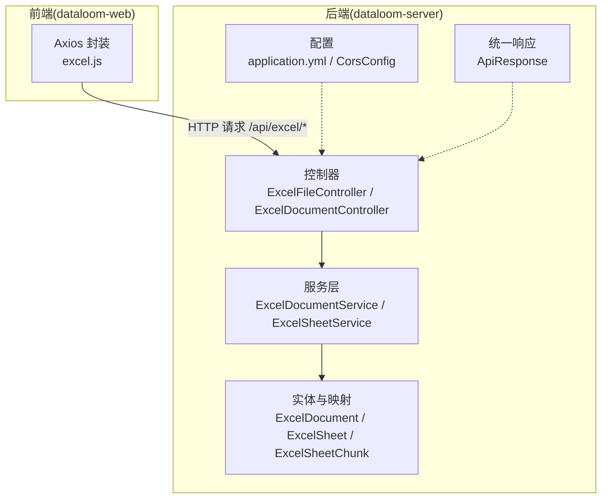
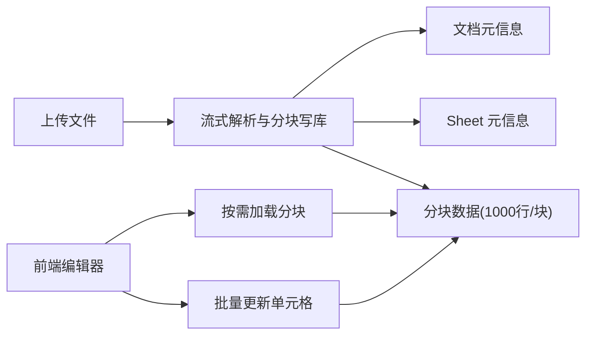
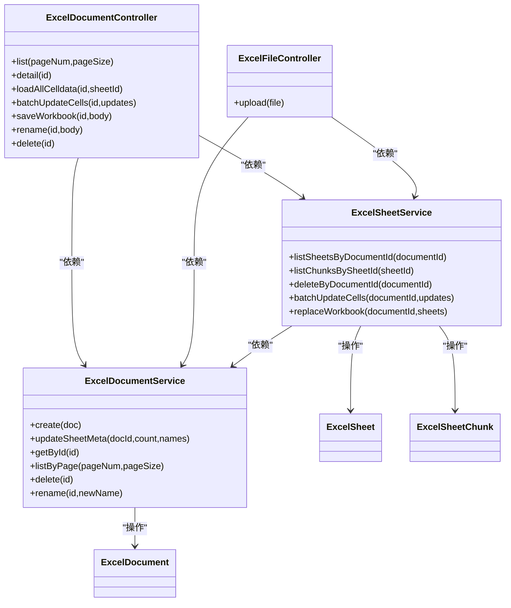

# API 接口文档

<cite>
**本文引用的文件**
- [ExcelDocumentController.java](file://dataloom-server/src/main/java/com/demo/excel/controller/ExcelDocumentController.java)
- [ExcelFileController.java](file://dataloom-server/src/main/java/com/demo/excel/controller/ExcelFileController.java)
- [ApiResponse.java](file://dataloom-server/src/main/java/com/demo/excel/common/ApiResponse.java)
- [ExcelDocumentService.java](file://dataloom-server/src/main/java/com/demo/excel/service/ExcelDocumentService.java)
- [ExcelSheetService.java](file://dataloom-server/src/main/java/com/demo/excel/service/ExcelSheetService.java)
- [ExcelDocument.java](file://dataloom-server/src/main/java/com/demo/excel/entity/ExcelDocument.java)
- [ExcelSheet.java](file://dataloom-server/src/main/java/com/demo/excel/entity/ExcelSheet.java)
- [ExcelSheetChunk.java](file://dataloom-server/src/main/java/com/demo/excel/entity/ExcelSheetChunk.java)
- [schema.sql](file://dataloom-server/src/main/resources/schema.sql)
- [application.yml](file://dataloom-server/src/main/resources/application.yml)
- [CorsConfig.java](file://dataloom-server/src/main/java/com/demo/excel/config/CorsConfig.java)
- [excel.js](file://dataloom-web/src/api/excel.js)
- [README.md](file://README.md)
</cite>

## 目录
1. [简介](#简介)
2. [项目结构](#项目结构)
3. [核心组件](#核心组件)
4. [架构概览](#架构概览)
5. [详细接口规范](#详细接口规范)
6. [依赖关系分析](#依赖关系分析)
7. [性能考量](#性能考量)
8. [故障排查指南](#故障排查指南)
9. [结论](#结论)
10. [附录](#附录)

## 简介
本文件为 DataLoom 的完整 API 接口文档，涵盖以下内容：
- 文档管理接口：上传、列表、详情、重命名、删除
- 数据读写接口：按块加载、单元格更新、批量更新
- 统一响应格式、错误码与错误处理机制
- 认证与安全注意事项
- 前端 API 封装与调用约定
- API 测试与调试建议

## 项目结构
后端采用 Spring Boot + MyBatis-Plus，数据库为 H2（文件模式），默认启动即建表。前端通过 Axios 封装统一的 API 方法，并由 Vite 将 /api 前缀代理到后端 9191 端口。

**图表来源**
- [ExcelFileController.java:35-141](file://dataloom-server/src/main/java/com/demo/excel/controller/ExcelFileController.java#L35-L141)
- [ExcelDocumentController.java:22-296](file://dataloom-server/src/main/java/com/demo/excel/controller/ExcelDocumentController.java#L22-L296)
- [ExcelDocumentService.java:19-119](file://dataloom-server/src/main/java/com/demo/excel/service/ExcelDocumentService.java#L19-L119)
- [ExcelSheetService.java:33-443](file://dataloom-server/src/main/java/com/demo/excel/service/ExcelSheetService.java#L33-L443)
- [ApiResponse.java:6-52](file://dataloom-server/src/main/java/com/demo/excel/common/ApiResponse.java#L6-L52)
- [application.yml:1-51](file://dataloom-server/src/main/resources/application.yml#L1-L51)
- [CorsConfig.java:10-22](file://dataloom-server/src/main/java/com/demo/excel/config/CorsConfig.java#L10-L22)
- [excel.js:1-79](file://dataloom-web/src/api/excel.js#L1-L79)

**章节来源**
- [application.yml:1-51](file://dataloom-server/src/main/resources/application.yml#L1-L51)
- [schema.sql:1-124](file://dataloom-server/src/main/resources/schema.sql#L1-L124)
- [README.md:190-216](file://README.md#L190-L216)

## 核心组件
- 统一响应体 ApiResponse：封装 code、success、message、data 字段，提供 ok/fail 工厂方法
- 控制器层：ExcelFileController（上传）、ExcelDocumentController（文档管理与数据读写）
- 服务层：ExcelDocumentService（文档 CRUD）、ExcelSheetService（Sheet 元信息、分块、单元格批量更新）
- 实体层：ExcelDocument（文档元数据）、ExcelSheet（Sheet 元信息）、ExcelSheetChunk（单元格分块）

**章节来源**
- [ApiResponse.java:6-52](file://dataloom-server/src/main/java/com/demo/excel/common/ApiResponse.java#L6-L52)
- [ExcelDocumentController.java:22-296](file://dataloom-server/src/main/java/com/demo/excel/controller/ExcelDocumentController.java#L22-L296)
- [ExcelFileController.java:35-141](file://dataloom-server/src/main/java/com/demo/excel/controller/ExcelFileController.java#L35-L141)
- [ExcelDocumentService.java:19-119](file://dataloom-server/src/main/java/com/demo/excel/service/ExcelDocumentService.java#L19-L119)
- [ExcelSheetService.java:33-443](file://dataloom-server/src/main/java/com/demo/excel/service/ExcelSheetService.java#L33-L443)
- [ExcelDocument.java:15-55](file://dataloom-server/src/main/java/com/demo/excel/entity/ExcelDocument.java#L15-L55)
- [ExcelSheet.java:14-77](file://dataloom-server/src/main/java/com/demo/excel/entity/ExcelSheet.java#L14-L77)
- [ExcelSheetChunk.java:18-53](file://dataloom-server/src/main/java/com/demo/excel/entity/ExcelSheetChunk.java#L18-L53)

## 架构概览
- 数据模型：文档（ExcelDocument）→ 工作表（ExcelSheet）→ 分块（ExcelSheetChunk），分块大小固定为 1000 行
- 上传流程：后端接收文件 → 保存原始文件 → 流式解析（Apache POI）→ 按 1000 行分块写入数据库 → 返回文档 ID 与 Sheet 元信息
- 编辑流程：前端按需加载分块 → 单元格变更时仅更新受影响的分块 → 批量保存时按块回写

**图表来源**
- [ExcelFileController.java:70-116](file://dataloom-server/src/main/java/com/demo/excel/controller/ExcelFileController.java#L70-L116)
- [ExcelParserService.java:43-44](file://dataloom-server/src/main/java/com/demo/excel/service/ExcelParserService.java#L43-L44)
- [ExcelSheetService.java:318-346](file://dataloom-server/src/main/java/com/demo/excel/service/ExcelSheetService.java#L318-L346)

**章节来源**
- [ExcelFileController.java:57-116](file://dataloom-server/src/main/java/com/demo/excel/controller/ExcelFileController.java#L57-L116)
- [ExcelParserService.java:43-44](file://dataloom-server/src/main/java/com/demo/excel/service/ExcelParserService.java#L43-L44)
- [ExcelSheetService.java:318-346](file://dataloom-server/src/main/java/com/demo/excel/service/ExcelSheetService.java#L318-L346)

## 详细接口规范

### 统一响应格式
- 成功响应：code=200，success=true，message="success"，data 为具体数据
- 失败响应：code 默认 500，success=false，message 为错误描述
- 支持自定义 code 的 fail 工厂方法

**章节来源**
- [ApiResponse.java:13-40](file://dataloom-server/src/main/java/com/demo/excel/common/ApiResponse.java#L13-L40)

### 文档管理接口

#### 上传 Excel 文件
- 方法与路径
  - POST /api/excel/upload
- 请求类型
  - multipart/form-data，字段名为 file
- 请求参数
  - file: 上传的 Excel 文件（.xlsx/.xls）
- 成功响应
  - data.documentId: 新建文档 ID
  - data.name: 文档名称
  - data.sheetCount: Sheet 数量
  - data.sheets: 每个 Sheet 的元信息（包含 sheetId、sheetIndex、sheetName、totalRows、totalCols、chunkCount、active）
- 错误响应
  - 上传失败时返回失败响应，message 包含错误原因

典型使用场景
- 用户拖拽上传 Excel 文件，后端进行流式解析并分块入库，返回文档 ID 与 Sheet 元信息列表

**章节来源**
- [ExcelFileController.java:70-116](file://dataloom-server/src/main/java/com/demo/excel/controller/ExcelFileController.java#L70-L116)
- [excel.js:12-25](file://dataloom-web/src/api/excel.js#L12-L25)

#### 文档列表（分页）
- 方法与路径
  - GET /api/excel/document/list
- 查询参数
  - pageNum: 页码，默认 1
  - pageSize: 每页条数，默认 20
- 成功响应
  - total: 总记录数
  - pages: 总页数
  - current: 当前页
  - records: 每条记录包含 id、name、sheetCount、sheetNames、version、fileSize、createTime、updateTime

典型使用场景
- 文档列表页面分页展示文档元数据

**章节来源**
- [ExcelDocumentController.java:44-69](file://dataloom-server/src/main/java/com/demo/excel/controller/ExcelDocumentController.java#L44-L69)
- [excel.js:31-36](file://dataloom-web/src/api/excel.js#L31-L36)

#### 文档详情
- 方法与路径
  - GET /api/excel/document/{id}
- 路径参数
  - id: 文档 ID
- 成功响应
  - id、name、sheetCount、version
  - sheets: 每个 Sheet 的元信息（sheetId、sheetIndex、sheetName、totalRows、totalCols、chunkCount、active、config、mergeConfig、columnLen、rowLen、hyperlink、images、luckysheet_conditionformat_save、chart）
- 错误响应
  - 文档不存在时返回 404

典型使用场景
- 打开文档时先获取各 Sheet 的元信息与分块数量，再决定后续加载策略

**章节来源**
- [ExcelDocumentController.java:77-131](file://dataloom-server/src/main/java/com/demo/excel/controller/ExcelDocumentController.java#L77-L131)
- [excel.js:38-41](file://dataloom-web/src/api/excel.js#L38-L41)

#### 重命名文档
- 方法与路径
  - PUT /api/excel/document/{id}/name
- 路径参数
  - id: 文档 ID
- 请求体
  - name: 新名称（必填且非空）
- 成功响应
  - 重命名成功
- 错误响应
  - 名称为空或文档不存在时返回相应错误

典型使用场景
- 用户在界面中修改文档名称

**章节来源**
- [ExcelDocumentController.java:238-251](file://dataloom-server/src/main/java/com/demo/excel/controller/ExcelDocumentController.java#L238-L251)
- [excel.js:70-73](file://dataloom-web/src/api/excel.js#L70-L73)

#### 删除文档
- 方法与路径
  - DELETE /api/excel/document/{id}
- 路径参数
  - id: 文档 ID
- 成功响应
  - 删除成功
- 错误响应
  - 无

典型使用场景
- 用户删除不再使用的文档，后端进行软删除并清理相关数据

**章节来源**
- [ExcelDocumentController.java:258-264](file://dataloom-server/src/main/java/com/demo/excel/controller/ExcelDocumentController.java#L258-L264)
- [excel.js:75-78](file://dataloom-web/src/api/excel.js#L75-L78)

### 数据读写接口

#### 加载指定 Sheet 的全部单元格数据
- 方法与路径
  - GET /api/excel/document/{id}/sheet/{sheetId}/all
- 路径参数
  - id: 文档 ID
  - sheetId: Sheet ID
- 成功响应
  - sheetId: Sheet ID
  - celldata: 合并后的单元格数据数组
  - cellCount: 单元格总数
- 错误响应
  - 无

典型使用场景
- 打开文档后一次性拉取整个 Sheet 的单元格数据（适用于中小规模 Sheet）

**章节来源**
- [ExcelDocumentController.java:139-161](file://dataloom-server/src/main/java/com/demo/excel/controller/ExcelDocumentController.java#L139-L161)
- [excel.js:47-50](file://dataloom-web/src/api/excel.js#L47-L50)

#### 批量增量更新单元格
- 方法与路径
  - PUT /api/excel/document/{id}/cells/batch
- 路径参数
  - id: 文档 ID
- 请求体
  - updates: 单元格修改列表，每项包含 sheetId、r（行）、c（列）、v（值，可为空表示删除）
- 成功响应
  - 保存成功
- 错误响应
  - 保存失败时返回失败响应

典型使用场景
- 前端编辑器频繁变更单元格内容时，仅更新受影响的分块，避免全量重建

**章节来源**
- [ExcelDocumentController.java:176-190](file://dataloom-server/src/main/java/com/demo/excel/controller/ExcelDocumentController.java#L176-L190)
- [ExcelSheetService.java:103-212](file://dataloom-server/src/main/java/com/demo/excel/service/ExcelSheetService.java#L103-L212)
- [excel.js:56-59](file://dataloom-web/src/api/excel.js#L56-L59)

#### 全量快照保存
- 方法与路径
  - PUT /api/excel/document/{id}/workbook
- 路径参数
  - id: 文档 ID
- 请求体
  - sheets: 新的工作簿快照（每个 Sheet 为 Luckysheet 格式）
- 成功响应
  - message: 保存成功
  - data.sheetCount: 新的 Sheet 数量
  - data.sheetIdMap: 旧 SheetIndex → 新 SheetId 的映射
- 错误响应
  - 保存失败时返回失败响应

典型使用场景
- 当工作簿结构发生变更（增删 Sheet、合并单元格、列宽/行高等配置变化）时，走全量替换流程

**章节来源**
- [ExcelDocumentController.java:204-226](file://dataloom-server/src/main/java/com/demo/excel/controller/ExcelDocumentController.java#L204-L226)
- [ExcelSheetService.java:221-316](file://dataloom-server/src/main/java/com/demo/excel/service/ExcelSheetService.java#L221-L316)
- [excel.js:61-64](file://dataloom-web/src/api/excel.js#L61-L64)

### 前端 API 封装与调用约定
- 基础配置
  - baseURL: /api/excel
  - 超时: 300000ms
- 上传
  - uploadExcel(file, onProgress): 以 multipart/form-data 上传文件，支持进度回调
- 文档查询
  - getDocumentList(pageNum, pageSize): 获取文档列表
  - getDocument(id): 获取文档详情
- 数据加载
  - loadAllCelldata(docId, sheetId): 加载指定 Sheet 的全部 celldata
- 数据写入
  - batchUpdateCells(docId, updates): 批量增量更新单元格
  - saveWorkbook(docId, sheets): 全量快照保存
- 文档管理
  - renameDocument(id, newName): 重命名
  - deleteDocument(id): 删除

**章节来源**
- [excel.js:3-79](file://dataloom-web/src/api/excel.js#L3-L79)

## 依赖关系分析

**图表来源**
- [ExcelDocumentController.java:22-296](file://dataloom-server/src/main/java/com/demo/excel/controller/ExcelDocumentController.java#L22-L296)
- [ExcelFileController.java:35-141](file://dataloom-server/src/main/java/com/demo/excel/controller/ExcelFileController.java#L35-L141)
- [ExcelDocumentService.java:19-119](file://dataloom-server/src/main/java/com/demo/excel/service/ExcelDocumentService.java#L19-L119)
- [ExcelSheetService.java:33-443](file://dataloom-server/src/main/java/com/demo/excel/service/ExcelSheetService.java#L33-L443)
- [ExcelDocument.java:15-55](file://dataloom-server/src/main/java/com/demo/excel/entity/ExcelDocument.java#L15-L55)
- [ExcelSheet.java:14-77](file://dataloom-server/src/main/java/com/demo/excel/entity/ExcelSheet.java#L14-L77)
- [ExcelSheetChunk.java:18-53](file://dataloom-server/src/main/java/com/demo/excel/entity/ExcelSheetChunk.java#L18-L53)

**章节来源**
- [ExcelDocumentController.java:22-296](file://dataloom-server/src/main/java/com/demo/excel/controller/ExcelDocumentController.java#L22-L296)
- [ExcelFileController.java:35-141](file://dataloom-server/src/main/java/com/demo/excel/controller/ExcelFileController.java#L35-L141)
- [ExcelDocumentService.java:19-119](file://dataloom-server/src/main/java/com/demo/excel/service/ExcelDocumentService.java#L19-L119)
- [ExcelSheetService.java:33-443](file://dataloom-server/src/main/java/com/demo/excel/service/ExcelSheetService.java#L33-L443)

## 性能考量
- 分块存储：每块约 1000 行，单块 JSON 通常在数百 KB，避免单行超大 JSON 导致的性能与内存问题
- 懒加载：前端按需加载分块，打开大文件几乎无等待
- 增量更新：按块分组批量写入，减少数据库 I/O
- 导出优化：前端使用 ExcelJS 直接从编辑器状态导出，保证样式零丢失

**章节来源**
- [ExcelParserService.java:43-44](file://dataloom-server/src/main/java/com/demo/excel/service/ExcelParserService.java#L43-L44)
- [ExcelSheetService.java:94-212](file://dataloom-server/src/main/java/com/demo/excel/service/ExcelSheetService.java#L94-L212)
- [README.md:63-70](file://README.md#L63-L70)

## 故障排查指南
- 上传失败
  - 检查文件大小限制（默认 100MB），确认 multipart 配置
  - 查看后端日志，定位异常堆栈
- 文档不存在
  - 确认文档 ID 正确，检查数据库状态字段（1=正常，3=已删除）
- 单元格更新失败
  - 检查 updates 格式是否符合要求（包含 sheetId、r、c、v）
  - 关注事务回滚日志
- CORS 问题
  - Demo 阶段允许所有来源，生产环境请按需配置
- 导出样式丢失
  - 后端不提供导出接口，前端使用 ExcelJS 完成导出

**章节来源**
- [application.yml:19-24](file://dataloom-server/src/main/resources/application.yml#L19-L24)
- [CorsConfig.java:10-22](file://dataloom-server/src/main/java/com/demo/excel/config/CorsConfig.java#L10-L22)
- [ExcelDocumentController.java:80-82](file://dataloom-server/src/main/java/com/demo/excel/controller/ExcelDocumentController.java#L80-L82)
- [ExcelSheetService.java:103-212](file://dataloom-server/src/main/java/com/demo/excel/service/ExcelSheetService.java#L103-L212)

## 结论
DataLoom 的 API 设计围绕“分块存储 + 懒加载 + 增量更新”展开，既能支撑十万级数据的流畅编辑，又能保持前后端职责清晰。文档管理与数据读写接口覆盖了从上传、浏览到编辑、保存的完整链路，配合统一响应体与前端封装，便于开发者快速集成与扩展。

## 附录

### 错误码定义与处理
- 成功：code=200，success=true
- 通用失败：code=500，success=false
- 自定义错误：可通过 fail(code,message) 指定特定 code

**章节来源**
- [ApiResponse.java:28-40](file://dataloom-server/src/main/java/com/demo/excel/common/ApiResponse.java#L28-L40)

### 认证与安全
- Demo 阶段未实现认证，允许跨域访问
- 生产环境建议增加鉴权与授权机制（如 JWT、OAuth2），并限制 CORS 源

**章节来源**
- [CorsConfig.java:10-22](file://dataloom-server/src/main/java/com/demo/excel/config/CorsConfig.java#L10-L22)

### API 测试指南与调试技巧
- 后端启动：cd dataloom-server && mvn spring-boot:run
- 前端启动：cd dataloom-web && npm install && npm run dev
- H2 控制台：http://localhost:9191/h2-console
- 建议使用 Postman 或 curl 测试上传与读写接口
- 前端通过 excel.js 封装的方法调用，注意 baseURL 与代理设置

**章节来源**
- [README.md:161-187](file://README.md#L161-L187)
- [application.yml:1-51](file://dataloom-server/src/main/resources/application.yml#L1-L51)