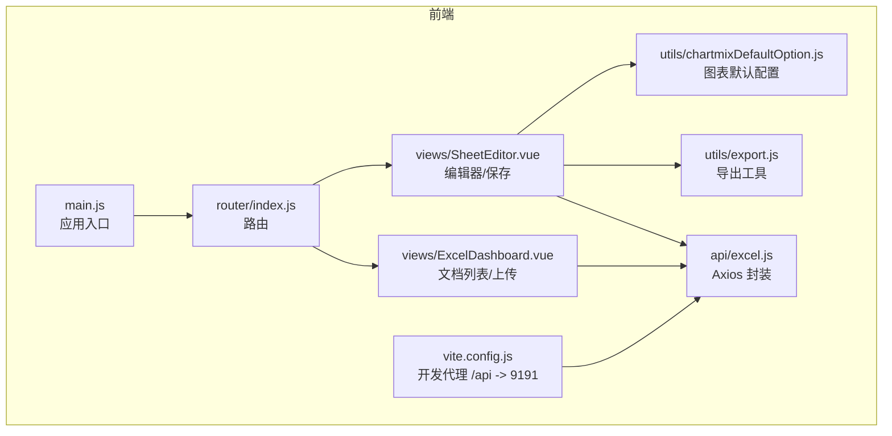
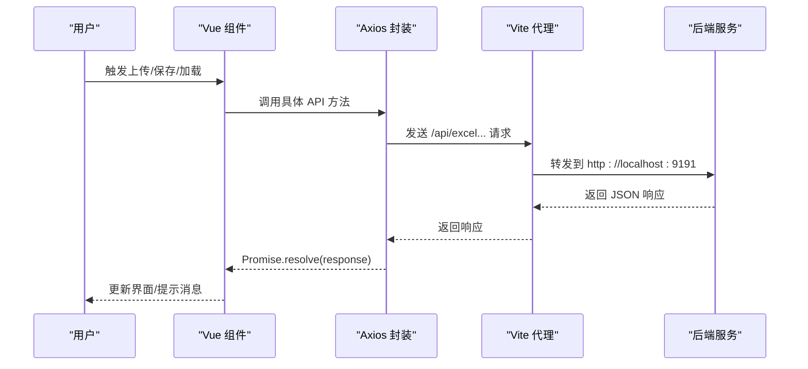
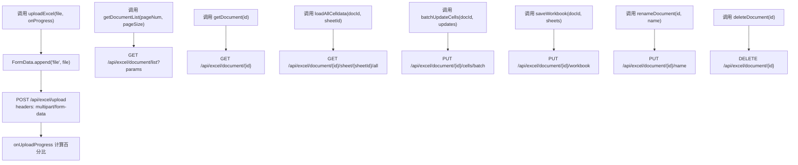
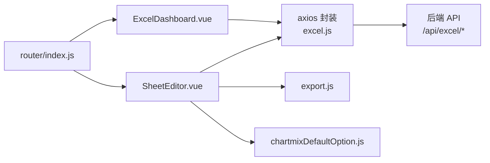

# 前端 API 集成

<cite>
**本文引用的文件**
- [excel.js](file://dataloom-web/src/api/excel.js)
- [main.js](file://dataloom-web/src/main.js)
- [package.json](file://dataloom-web/package.json)
- [vite.config.js](file://dataloom-web/vite.config.js)
- [router/index.js](file://dataloom-web/src/router/index.js)
- [ExcelDashboard.vue](file://dataloom-web/src/views/ExcelDashboard.vue)
- [SheetEditor.vue](file://dataloom-web/src/views/SheetEditor.vue)
- [export.js](file://dataloom-web/src/utils/export.js)
- [chartmixDefaultOption.js](file://dataloom-web/src/utils/chartmixDefaultOption.js)
- [App.vue](file://dataloom-web/src/App.vue)
- [README.md](file://README.md)
</cite>

## 目录
1. [简介](#简介)
2. [项目结构](#项目结构)
3. [核心组件](#核心组件)
4. [架构总览](#架构总览)
5. [详细组件分析](#详细组件分析)
6. [依赖关系分析](#依赖关系分析)
7. [性能考量](#性能考量)
8. [故障排查指南](#故障排查指南)
9. [结论](#结论)
10. [附录](#附录)

## 简介
本文件面向前端开发者，系统化说明 DataLoom 前端如何通过 axios 封装调用后端 API，涵盖请求/响应拦截器、错误处理与重试机制、前后端交互模式与数据格式约定、状态管理与缓存策略、加载状态管理与用户体验优化、版本与兼容性处理、最佳实践与调试技巧，以及完整集成示例与常见问题解决方案。

## 项目结构
前端采用 Vue 3 + Vite 架构，核心模块如下：
- API 封装：位于 src/api/excel.js，封装所有与后端交互的 HTTP 方法
- 路由：src/router/index.js，定义仪表盘与编辑器两个页面路由
- 视图组件：ExcelDashboard.vue（文档列表/上传/重命名/删除）、SheetEditor.vue（文档结构加载、单元格增量/全量保存）
- 工具函数：export.js（ExcelJS 导出）、chartmixDefaultOption.js（图表兜底默认配置）
- 构建与代理：vite.config.js（/api 代理至后端 9191 端口）
- 依赖声明：package.json（axios、vue、element-plus、luckysheet、exceljs 等）

**图表来源**
- [main.js:1-19](file://dataloom-web/src/main.js#L1-L19)
- [router/index.js:1-21](file://dataloom-web/src/router/index.js#L1-L21)
- [ExcelDashboard.vue:106-229](file://dataloom-web/src/views/ExcelDashboard.vue#L106-L229)
- [SheetEditor.vue:48-416](file://dataloom-web/src/views/SheetEditor.vue#L48-L416)
- [excel.js:1-79](file://dataloom-web/src/api/excel.js#L1-L79)
- [export.js:1-239](file://dataloom-web/src/utils/export.js#L1-L239)
- [chartmixDefaultOption.js:1-2](file://dataloom-web/src/utils/chartmixDefaultOption.js#L1-L2)
- [vite.config.js:1-26](file://dataloom-web/vite.config.js#L1-L26)

**章节来源**
- [main.js:1-19](file://dataloom-web/src/main.js#L1-L19)
- [router/index.js:1-21](file://dataloom-web/src/router/index.js#L1-L21)
- [vite.config.js:12-21](file://dataloom-web/vite.config.js#L12-L21)
- [package.json:12-25](file://dataloom-web/package.json#L12-L25)

## 核心组件
- Axios 封装（excel.js）
  - 创建带基础路径与超时的 axios 实例
  - 提供上传、文档列表/详情、Sheet 全量数据加载、单元格批量更新、工作簿全量保存、文档重命名、删除等方法
  - 上传接口支持进度回调
- 视图组件
  - ExcelDashboard.vue：负责文档列表分页加载、文件上传、重命名、删除、分页切换
  - SheetEditor.vue：负责文档结构加载、各 Sheet 分块数据加载、增量/全量保存、导出、图表兼容处理
- 工具函数
  - export.js：基于 ExcelJS 将前端编辑器状态导出为 .xlsx
  - chartmixDefaultOption.js：图表插件兜底默认配置，避免 chartmix 初始化失败

**章节来源**
- [excel.js:3-79](file://dataloom-web/src/api/excel.js#L3-L79)
- [ExcelDashboard.vue:106-229](file://dataloom-web/src/views/ExcelDashboard.vue#L106-L229)
- [SheetEditor.vue:48-416](file://dataloom-web/src/views/SheetEditor.vue#L48-L416)
- [export.js:1-239](file://dataloom-web/src/utils/export.js#L1-L239)
- [chartmixDefaultOption.js:1-2](file://dataloom-web/src/utils/chartmixDefaultOption.js#L1-L2)

## 架构总览
前端通过 axios 封装统一调用后端 REST API，开发服务器通过 Vite 代理将 /api 前缀转发至后端 9191 端口。编辑器 Luckysheet 与后端交互遵循“按需加载 + 增量更新”的策略，以提升大文件编辑体验。

**图表来源**
- [excel.js:13-25](file://dataloom-web/src/api/excel.js#L13-L25)
- [excel.js:32-41](file://dataloom-web/src/api/excel.js#L32-L41)
- [excel.js:48-59](file://dataloom-web/src/api/excel.js#L48-L59)
- [vite.config.js:15-20](file://dataloom-web/vite.config.js#L15-L20)

## 详细组件分析

### Axios 封装与 API 方法
- 基础配置
  - baseURL：/api/excel
  - timeout：300000ms
- 上传接口
  - 支持 multipart/form-data
  - onUploadProgress 回调用于进度展示
- 文档接口
  - 列表分页：pageNum/pageSize 参数
  - 详情：返回文档元信息与 Sheet 列表
- 数据加载
  - 全量 celldata：按 Sheet 加载全部单元格数据
- 数据写入
  - 增量：批量更新单元格（仅变更块）
  - 全量：替换整个工作簿（结构/图片/图表变更时使用）
- 文档管理
  - 重命名、删除（软删除 + 级联清理）

**图表来源**
- [excel.js:13-25](file://dataloom-web/src/api/excel.js#L13-L25)
- [excel.js:32-41](file://dataloom-web/src/api/excel.js#L32-L41)
- [excel.js:48-59](file://dataloom-web/src/api/excel.js#L48-L59)
- [excel.js:70-78](file://dataloom-web/src/api/excel.js#L70-L78)

**章节来源**
- [excel.js:3-79](file://dataloom-web/src/api/excel.js#L3-L79)

### 错误处理与重试机制
- 当前实现
  - 组件内对响应进行校验：payload.success 存在且为真才视为成功
  - 失败时弹出消息提示，finally 中关闭 loading
  - 未实现 axios 拦截器与自动重试
- 建议增强
  - 在 axios 实例中添加响应拦截器，统一处理非 2xx 与 payload.success=false 的场景
  - 对网络错误与幂等请求（GET/PUT 增量）增加指数退避重试
  - 对上传进度与长耗时任务增加取消与超时控制

**章节来源**
- [ExcelDashboard.vue:126-140](file://dataloom-web/src/views/ExcelDashboard.vue#L126-L140)
- [ExcelDashboard.vue:156-172](file://dataloom-web/src/views/ExcelDashboard.vue#L156-L172)
- [SheetEditor.vue:134-173](file://dataloom-web/src/views/SheetEditor.vue#L134-L173)
- [SheetEditor.vue:216-234](file://dataloom-web/src/views/SheetEditor.vue#L216-L234)

### 状态管理与数据缓存策略
- 组件级状态
  - ExcelDashboard.vue：documents、loading、uploading、pageNum、pageSize、total
  - SheetEditor.vue：documentId、documentName、sheetCount、loadingSheet、loadedChunks、totalChunks、workbookDirty、structureDirty、dirtyCells、sheetIdMap
- 缓存与一致性
  - 文档结构与 Sheet 元信息来自后端，celldata 按需加载
  - 保存策略：检测结构变更决定全量快照保存或增量单元格更新
  - 保存后刷新 sheetIdMap 与结构快照，确保后续保存一致
- 建议
  - 引入轻量状态管理（如 Pinia）集中管理文档与工作簿状态
  - 对热点数据（最近打开的文档）做内存缓存，减少重复请求

**章节来源**
- [ExcelDashboard.vue:115-124](file://dataloom-web/src/views/ExcelDashboard.vue#L115-L124)
- [SheetEditor.vue:60-82](file://dataloom-web/src/views/SheetEditor.vue#L60-L82)
- [SheetEditor.vue:486-531](file://dataloom-web/src/views/SheetEditor.vue#L486-L531)
- [SheetEditor.vue:547-631](file://dataloom-web/src/views/SheetEditor.vue#L547-L631)

### 加载状态管理与用户体验优化
- 加载态
  - Element Plus 的 v-loading 与 :loading 绑定，提升视觉反馈
  - 上传/保存/导出按钮设置 loading 状态
- 进度反馈
  - 上传接口支持 onUploadProgress，组件内计算百分比
- 错误提示
  - 使用 ElMessage/ElMessageBox 提示与确认
- 性能细节
  - 分块加载 celldata，避免一次性渲染大量单元格
  - 保存前对比结构快照，仅在必要时全量保存

**章节来源**
- [ExcelDashboard.vue:12-23](file://dataloom-web/src/views/ExcelDashboard.vue#L12-L23)
- [ExcelDashboard.vue:156-172](file://dataloom-web/src/views/ExcelDashboard.vue#L156-L172)
- [SheetEditor.vue:38-45](file://dataloom-web/src/views/SheetEditor.vue#L38-L45)
- [SheetEditor.vue:216-234](file://dataloom-web/src/views/SheetEditor.vue#L216-L234)

### 前后端交互模式与数据格式约定
- 基础路径与代理
  - baseURL：/api/excel
  - Vite 代理：/api -> http://localhost:9191
- 请求体与响应体
  - 请求体：application/json（除上传为 multipart/form-data）
  - 响应体：统一包装 payload，包含 success/message/data
- 数据模型要点
  - 文档：包含 id/name/sheets/chunkCount 等
  - Sheet：包含 config/merge/columnLen/rowLen/images/chart 等
  - celldata：单元格数组，包含 r/c/v/f 等字段

**章节来源**
- [excel.js:3-6](file://dataloom-web/src/api/excel.js#L3-L6)
- [vite.config.js:15-20](file://dataloom-web/vite.config.js#L15-L20)
- [README.md:190-215](file://README.md#L190-L215)

### 版本管理与兼容性处理
- 前端版本
  - package.json 中声明版本号与依赖版本
- 兼容性
  - Luckysheet 2.1.13 与 chartmix 插件存在 chartOptions 生命周期问题，通过序列化流程中的四步法（ECharts 兜底 → 清理僵尸 → 安全刷新 → 序列化）规避崩溃
  - 使用 defaultOption 作为兜底配置，确保图表初始化稳定

**章节来源**
- [package.json:1-27](file://dataloom-web/package.json#L1-L27)
- [SheetEditor.vue:633-783](file://dataloom-web/src/views/SheetEditor.vue#L633-L783)
- [chartmixDefaultOption.js:1-2](file://dataloom-web/src/utils/chartmixDefaultOption.js#L1-L2)

### 调用示例与错误处理代码路径
- 上传 Excel 并跳转编辑器
  - 路径参考：[ExcelDashboard.vue:146-172](file://dataloom-web/src/views/ExcelDashboard.vue#L146-L172)
- 加载文档列表与分页
  - 路径参考：[ExcelDashboard.vue:126-140](file://dataloom-web/src/views/ExcelDashboard.vue#L126-L140)
- 加载文档结构与各 Sheet celldata
  - 路径参考：[SheetEditor.vue:134-173](file://dataloom-web/src/views/SheetEditor.vue#L134-L173)
- 增量更新单元格
  - 路径参考：[SheetEditor.vue:581-590](file://dataloom-web/src/views/SheetEditor.vue#L581-L590)
- 全量保存工作簿
  - 路径参考：[SheetEditor.vue:559-581](file://dataloom-web/src/views/SheetEditor.vue#L559-L581)
- 导出 Excel
  - 路径参考：[export.js:1-28](file://dataloom-web/src/utils/export.js#L1-L28)

**章节来源**
- [ExcelDashboard.vue:126-172](file://dataloom-web/src/views/ExcelDashboard.vue#L126-L172)
- [SheetEditor.vue:134-173](file://dataloom-web/src/views/SheetEditor.vue#L134-L173)
- [SheetEditor.vue:547-631](file://dataloom-web/src/views/SheetEditor.vue#L547-L631)
- [export.js:1-28](file://dataloom-web/src/utils/export.js#L1-L28)

## 依赖关系分析
- 组件依赖
  - ExcelDashboard.vue 依赖 axios 封装与 Element Plus
  - SheetEditor.vue 依赖 axios 封装、ExcelJS 导出、chartmix 默认配置
- 外部依赖
  - axios：HTTP 通信
  - vue/vue-router：视图与路由
  - element-plus：UI 组件库
  - luckysheet：在线表格编辑器
  - exceljs：前端导出

**图表来源**
- [excel.js:1-79](file://dataloom-web/src/api/excel.js#L1-L79)
- [ExcelDashboard.vue:111](file://dataloom-web/src/views/ExcelDashboard.vue#L111)
- [SheetEditor.vue:53](file://dataloom-web/src/views/SheetEditor.vue#L53)
- [export.js:1-239](file://dataloom-web/src/utils/export.js#L1-L239)
- [chartmixDefaultOption.js:1-2](file://dataloom-web/src/utils/chartmixDefaultOption.js#L1-L2)
- [router/index.js:1-21](file://dataloom-web/src/router/index.js#L1-L21)

**章节来源**
- [package.json:12-25](file://dataloom-web/package.json#L12-L25)

## 性能考量
- 分块加载与懒加载：按需加载 celldata，降低首屏与单次渲染压力
- 增量更新：仅写变更块，减少 IO 与网络传输
- 导出优化：前端 ExcelJS 直接生成 .xlsx，避免后端二次处理
- 代理与跨域：Vite 代理简化开发阶段跨域问题，生产环境建议后端配置 CORS

[本节为通用指导，不直接分析具体文件]

## 故障排查指南
- 上传失败
  - 检查文件类型与大小限制
  - 查看上传进度回调与 ElMessage 错误提示
  - 参考路径：[ExcelDashboard.vue:146-172](file://dataloom-web/src/views/ExcelDashboard.vue#L146-L172)
- 文档加载失败
  - 确认 /api 代理是否生效（端口 9191）
  - 检查后端服务是否启动
  - 参考路径：[vite.config.js:15-20](file://dataloom-web/vite.config.js#L15-L20)
- 保存失败
  - 若结构变更，优先全量保存；否则走增量更新
  - 检查 dirtyCells 是否为空
  - 参考路径：[SheetEditor.vue:547-631](file://dataloom-web/src/views/SheetEditor.vue#L547-L631)
- 图表初始化崩溃
  - 确保 defaultOption 注入与 chartOptions 恢复流程执行
  - 参考路径：[SheetEditor.vue:633-783](file://dataloom-web/src/views/SheetEditor.vue#L633-L783)
- 导出空白或样式丢失
  - 确认前端编辑器状态中存在数据与样式
  - 参考路径：[export.js:1-28](file://dataloom-web/src/utils/export.js#L1-L28)

**章节来源**
- [ExcelDashboard.vue:146-172](file://dataloom-web/src/views/ExcelDashboard.vue#L146-L172)
- [vite.config.js:15-20](file://dataloom-web/vite.config.js#L15-L20)
- [SheetEditor.vue:547-631](file://dataloom-web/src/views/SheetEditor.vue#L547-L631)
- [SheetEditor.vue:633-783](file://dataloom-web/src/views/SheetEditor.vue#L633-L783)
- [export.js:1-28](file://dataloom-web/src/utils/export.js#L1-L28)

## 结论
DataLoom 前端通过简洁的 axios 封装与组件化的视图层，实现了与后端的高效协作。结合分块加载、增量更新与前端导出策略，在大文件场景下具备良好的性能与用户体验。建议后续引入 axios 拦截器与自动重试、Pinia 状态管理与缓存策略，进一步提升稳定性与可维护性。

[本节为总结，不直接分析具体文件]

## 附录

### API 方法一览（路径参考）
- 上传 Excel：[excel.js:13-25](file://dataloom-web/src/api/excel.js#L13-L25)
- 文档列表：[excel.js:32-36](file://dataloom-web/src/api/excel.js#L32-L36)
- 文档详情：[excel.js:39-41](file://dataloom-web/src/api/excel.js#L39-L41)
- 加载 Sheet 全量数据：[excel.js:48-50](file://dataloom-web/src/api/excel.js#L48-L50)
- 批量更新单元格：[excel.js:57-59](file://dataloom-web/src/api/excel.js#L57-L59)
- 全量保存工作簿：[excel.js:62-64](file://dataloom-web/src/api/excel.js#L62-L64)
- 重命名文档：[excel.js:71-73](file://dataloom-web/src/api/excel.js#L71-L73)
- 删除文档：[excel.js:76-78](file://dataloom-web/src/api/excel.js#L76-L78)

### 路由与页面
- 路由配置：[router/index.js:1-21](file://dataloom-web/src/router/index.js#L1-L21)
- 仪表盘组件：[ExcelDashboard.vue:106-229](file://dataloom-web/src/views/ExcelDashboard.vue#L106-L229)
- 编辑器组件：[SheetEditor.vue:48-416](file://dataloom-web/src/views/SheetEditor.vue#L48-L416)

### 开发与构建
- 依赖与脚本：[package.json:1-27](file://dataloom-web/package.json#L1-L27)
- 开发代理：[vite.config.js:12-21](file://dataloom-web/vite.config.js#L12-L21)
- 应用入口：[main.js:1-19](file://dataloom-web/src/main.js#L1-L19)
- 根组件：[App.vue:1-4](file://dataloom-web/src/App.vue#L1-L4)