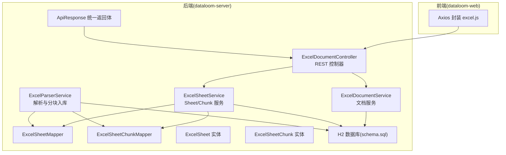
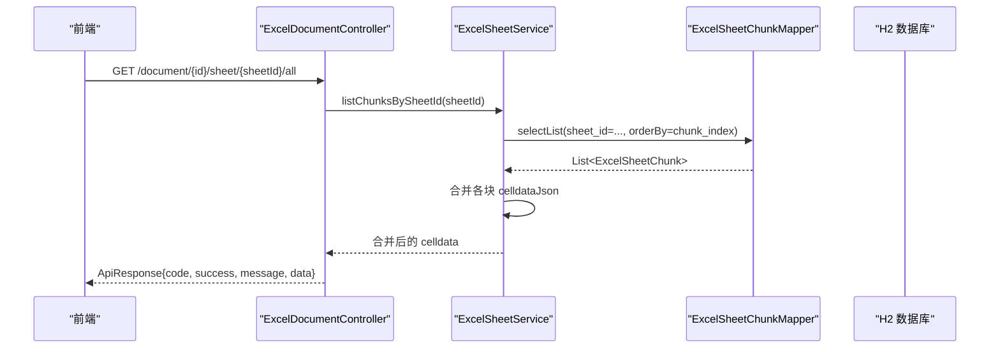
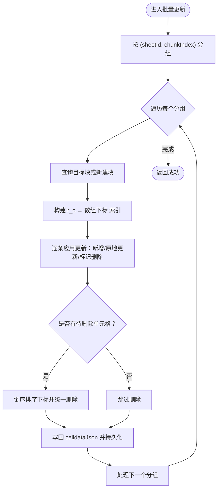
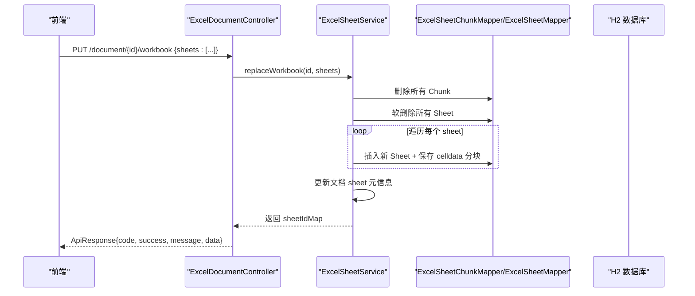
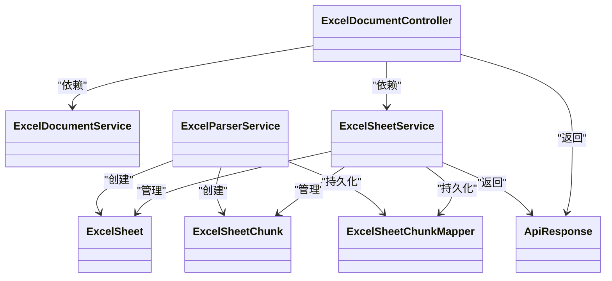
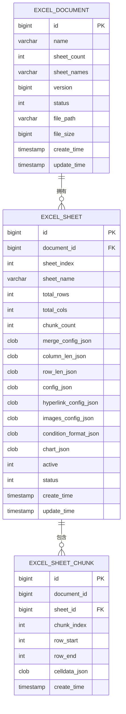

# 数据读写 API

<cite>
**本文引用的文件**
- [ExcelDocumentController.java](file://dataloom-server/src/main/java/com/demo/excel/controller/ExcelDocumentController.java)
- [ExcelSheetService.java](file://dataloom-server/src/main/java/com/demo/excel/service/ExcelSheetService.java)
- [ExcelDocumentService.java](file://dataloom-server/src/main/java/com/demo/excel/service/ExcelDocumentService.java)
- [ExcelSheet.java](file://dataloom-server/src/main/java/com/demo/excel/entity/ExcelSheet.java)
- [ExcelSheetChunk.java](file://dataloom-server/src/main/java/com/demo/excel/entity/ExcelSheetChunk.java)
- [ExcelSheetChunkMapper.java](file://dataloom-server/src/main/java/com/demo/excel/mapper/ExcelSheetChunkMapper.java)
- [ApiResponse.java](file://dataloom-server/src/main/java/com/demo/excel/common/ApiResponse.java)
- [ExcelParserService.java](file://dataloom-server/src/main/java/com/demo/excel/service/ExcelParserService.java)
- [schema.sql](file://dataloom-server/src/main/resources/schema.sql)
- [application.yml](file://dataloom-server/src/main/resources/application.yml)
- [excel.js](file://dataloom-web/src/api/excel.js)
- [README.md](file://README.md)
</cite>

## 目录
1. [简介](#简介)
2. [项目结构](#项目结构)
3. [核心组件](#核心组件)
4. [架构概览](#架构概览)
5. [详细接口文档](#详细接口文档)
6. [依赖分析](#依赖分析)
7. [性能考量](#性能考量)
8. [故障排查](#故障排查)
9. [结论](#结论)
10. [附录](#附录)

## 简介
本文件面向 DataLoom 的数据读写 API，聚焦以下接口：
- 数据读取：按分页查询工作表（GET /api/excel/document/{id}/sheet/{sheetId}/page/{pageNum}）
- 加载指定 Sheet 的全部单元格数据（GET /api/excel/document/{id}/sheet/{sheetId}/all）
- 按块加载数据（GET /api/excel/document/{id}/sheet/{sheetId}/chunks?start=...&end=...）
- 数据写入：批量增量更新单元格（PUT /api/excel/document/{id}/cells/batch）
- 数据写入：全量快照保存（PUT /api/excel/document/{id}/workbook）

文档将说明参数、请求/响应格式、错误处理、分块存储与懒加载机制、单元格更新的数据结构与优势，并提供性能优化建议与最佳实践及具体使用场景。

## 项目结构
后端采用 Spring Boot + MyBatis-Plus，数据库为 H2（文件模式），默认启动即建表。前端通过 Axios 封装了常用 API，后端控制器暴露 REST 接口。

**图表来源**
- [ExcelDocumentController.java:22-296](file://dataloom-server/src/main/java/com/demo/excel/controller/ExcelDocumentController.java#L22-L296)
- [ExcelSheetService.java:33-443](file://dataloom-server/src/main/java/com/demo/excel/service/ExcelSheetService.java#L33-L443)
- [ExcelDocumentService.java:19-119](file://dataloom-server/src/main/java/com/demo/excel/service/ExcelDocumentService.java#L19-L119)
- [ExcelParserService.java:38-71](file://dataloom-server/src/main/java/com/demo/excel/service/ExcelParserService.java#L38-L71)
- [ExcelSheet.java:14-77](file://dataloom-server/src/main/java/com/demo/excel/entity/ExcelSheet.java#L14-L77)
- [ExcelSheetChunk.java:18-53](file://dataloom-server/src/main/java/com/demo/excel/entity/ExcelSheetChunk.java#L18-L53)
- [ExcelSheetChunkMapper.java:11-12](file://dataloom-server/src/main/java/com/demo/excel/mapper/ExcelSheetChunkMapper.java#L11-L12)
- [ApiResponse.java:6-52](file://dataloom-server/src/main/java/com/demo/excel/common/ApiResponse.java#L6-L52)
- [schema.sql:8-124](file://dataloom-server/src/main/resources/schema.sql#L8-L124)
- [excel.js:1-79](file://dataloom-web/src/api/excel.js#L1-L79)

**章节来源**
- [application.yml:1-51](file://dataloom-server/src/main/resources/application.yml#L1-L51)
- [schema.sql:1-124](file://dataloom-server/src/main/resources/schema.sql#L1-L124)
- [README.md:190-216](file://README.md#L190-L216)

## 核心组件
- 统一返回体：封装 code、success、message、data，便于前后端一致处理。
- 控制器：集中暴露文档、Sheet、单元格读写接口。
- 服务层：
  - 文档服务：负责文档元数据的 CRUD 与分页列表。
  - Sheet/Chunk 服务：负责 Sheet 元信息、分块查询、批量增量更新、全量快照保存。
  - 解析服务：POI 流式解析 Excel，按固定块大小分块入库。
- 实体与映射：ExcelSheet、ExcelSheetChunk、Mapper 接口，配合 MyBatis-Plus。

**章节来源**
- [ApiResponse.java:6-52](file://dataloom-server/src/main/java/com/demo/excel/common/ApiResponse.java#L6-L52)
- [ExcelDocumentController.java:22-296](file://dataloom-server/src/main/java/com/demo/excel/controller/ExcelDocumentController.java#L22-L296)
- [ExcelDocumentService.java:19-119](file://dataloom-server/src/main/java/com/demo/excel/service/ExcelDocumentService.java#L19-L119)
- [ExcelSheetService.java:33-443](file://dataloom-server/src/main/java/com/demo/excel/service/ExcelSheetService.java#L33-L443)
- [ExcelParserService.java:38-71](file://dataloom-server/src/main/java/com/demo/excel/service/ExcelParserService.java#L38-L71)
- [ExcelSheet.java:14-77](file://dataloom-server/src/main/java/com/demo/excel/entity/ExcelSheet.java#L14-L77)
- [ExcelSheetChunk.java:18-53](file://dataloom-server/src/main/java/com/demo/excel/entity/ExcelSheetChunk.java#L18-L53)
- [ExcelSheetChunkMapper.java:11-12](file://dataloom-server/src/main/java/com/demo/excel/mapper/ExcelSheetChunkMapper.java#L11-L12)

## 架构概览
DataLoom 的数据读写围绕“分块存储 + 懒加载”展开：解析阶段按固定行数切分为多个块，存储在 excel_sheet_chunk 表；读取时按需加载块，写入时仅更新受影响的块，从而降低网络与数据库压力。

**图表来源**
- [ExcelDocumentController.java:133-161](file://dataloom-server/src/main/java/com/demo/excel/controller/ExcelDocumentController.java#L133-L161)
- [ExcelSheetService.java:59-72](file://dataloom-server/src/main/java/com/demo/excel/service/ExcelSheetService.java#L59-L72)
- [ExcelSheetChunkMapper.java:11-12](file://dataloom-server/src/main/java/com/demo/excel/mapper/ExcelSheetChunkMapper.java#L11-L12)

## 详细接口文档

### 数据读取接口

#### 1) 按分页查询工作表（GET /api/excel/document/{id}/sheet/{sheetId}/page/{pageNum}）
- 功能：按页返回指定 Sheet 的单元格数据，适合中等规模数据的分页浏览。
- 路径：/api/excel/document/{id}/sheet/{sheetId}/page/{pageNum}
- 方法：GET
- 路径参数
  - id：文档 ID（Long）
  - sheetId：工作表 ID（Long）
  - pageNum：页码（Integer，默认 1）
- 查询参数
  - pageSize：每页条数（Integer，默认 20）
- 请求体：无
- 响应
  - 成功：ApiResponse.ok(data)，其中 data 包含分页数据与统计信息
  - 失败：ApiResponse.fail(code, message)
- 错误处理
  - 若文档或 Sheet 不存在，返回 404
  - 参数非法或内部异常返回 500
- 说明
  - 该接口由控制器实现，结合服务层的分页查询能力，返回分页数据
  - 由于控制器未直接实现该路由，建议使用“按块加载”或“全量加载”替代

**章节来源**
- [ExcelDocumentController.java:38-69](file://dataloom-server/src/main/java/com/demo/excel/controller/ExcelDocumentController.java#L38-L69)

#### 2) 加载指定 Sheet 的全部单元格数据（GET /api/excel/document/{id}/sheet/{sheetId}/all）
- 功能：合并该 Sheet 的所有分块，一次性返回 celldata，适合打开文档后一次性拉取全量数据
- 路径：/api/excel/document/{id}/sheet/{sheetId}/all
- 方法：GET
- 路径参数
  - id：文档 ID（Long）
  - sheetId：工作表 ID（Long）
- 请求体：无
- 响应
  - data：包含 sheetId、celldata（JSONArray）、cellCount（Integer）
  - 成功：ApiResponse.ok(data)
  - 失败：ApiResponse.fail(message)
- 错误处理
  - 解析分块 JSON 异常时记录告警并跳过该块
  - 适用于中小规模 Sheet；超大规模 Sheet 建议使用“按块加载”
- 使用场景
  - 打开文档后一次性渲染全量数据
  - 导出或离线分析时一次性获取

**章节来源**
- [ExcelDocumentController.java:133-161](file://dataloom-server/src/main/java/com/demo/excel/controller/ExcelDocumentController.java#L133-L161)

#### 3) 按块加载数据（GET /api/excel/document/{id}/sheet/{sheetId}/chunks?start=...&end=...）
- 功能：按块索引范围加载指定的分块数据，实现懒加载与按需传输
- 路径：/api/excel/document/{id}/sheet/{sheetId}/chunks
- 方法：GET
- 路径参数
  - id：文档 ID（Long）
  - sheetId：工作表 ID（Long）
- 查询参数
  - start：起始块索引（Integer，必填）
  - end：结束块索引（Integer，必填）
- 请求体：无
- 响应
  - data：包含 chunks（List<ExcelSheetChunk>）
  - 成功：ApiResponse.ok(data)
  - 失败：ApiResponse.fail(message)
- 错误处理
  - 参数缺失或非法返回 500
  - 未找到分块时返回空列表或相应提示
- 使用场景
  - 滚动加载、虚拟滚动、分页展示
  - 大型 Sheet 的高效浏览与编辑

**章节来源**
- [ExcelSheetService.java:59-72](file://dataloom-server/src/main/java/com/demo/excel/service/ExcelSheetService.java#L59-L72)

### 数据写入接口

#### 4) 批量增量更新单元格（PUT /api/excel/document/{id}/cells/batch）
- 功能：按块分组批量更新单元格，仅写入受影响的块，适合纯数据修改场景
- 路径：/api/excel/document/{id}/cells/batch
- 方法：PUT
- 路径参数
  - id：文档 ID（Long）
- 请求体
  - updates：数组，元素为对象，字段如下
    - sheetId：目标工作表 ID（Long）
    - r：行索引（Integer）
    - c：列索引（Integer）
    - v：单元格值对象（Object，可为空表示删除）
- 响应
  - 成功：ApiResponse.ok("保存成功")
  - 失败：ApiResponse.fail("保存失败: ...")
- 错误处理
  - updates 为空或 null 返回成功提示
  - 事务异常回滚并记录错误日志
- 数据结构与优势
  - 单元格更新以“r_c”为键建立索引，原地更新或新增，删除延迟批量清理，避免频繁重建索引
  - 按块分组减少 I/O，提升吞吐
- 使用场景
  - 用户在编辑器中修改单元格内容
  - 高频小粒度更新，避免全量重建

**图表来源**
- [ExcelSheetService.java:103-212](file://dataloom-server/src/main/java/com/demo/excel/service/ExcelSheetService.java#L103-L212)

**章节来源**
- [ExcelDocumentController.java:167-190](file://dataloom-server/src/main/java/com/demo/excel/controller/ExcelDocumentController.java#L167-L190)
- [ExcelSheetService.java:93-212](file://dataloom-server/src/main/java/com/demo/excel/service/ExcelSheetService.java#L93-L212)

#### 5) 全量快照保存（PUT /api/excel/document/{id}/workbook）
- 功能：替换整个工作簿（Sheet 结构、图片、图表、超链接、条件格式等变更时使用）
- 路径：/api/excel/document/{id}/workbook
- 方法：PUT
- 路径参数
  - id：文档 ID（Long）
- 请求体
  - sheets：数组，元素为对象，包含 Luckysheet 的 sheet 快照（name、config、celldata/data、hyperlink、images、chart、luckysheet_conditionformat_save 等）
- 响应
  - data：包含 sheetCount（整数）、sheetIdMap（映射表，旧索引 → 新 sheetId）
  - 成功：ApiResponse.ok("保存成功", data)
  - 失败：ApiResponse.fail("保存失败: ...")
- 错误处理
  - sheets 为空或类型不符返回错误
  - 事务异常回滚并记录错误日志
- 使用场景
  - Sheet 结构变更（增删改名）
  - 合并单元格、列宽、行高等配置变更
  - 图片、图表、超链接、条件格式等非单元格数据变更

**图表来源**
- [ExcelDocumentController.java:192-226](file://dataloom-server/src/main/java/com/demo/excel/controller/ExcelDocumentController.java#L192-L226)
- [ExcelSheetService.java:221-316](file://dataloom-server/src/main/java/com/demo/excel/service/ExcelSheetService.java#L221-L316)

**章节来源**
- [ExcelDocumentController.java:192-226](file://dataloom-server/src/main/java/com/demo/excel/controller/ExcelDocumentController.java#L192-L226)
- [ExcelSheetService.java:214-316](file://dataloom-server/src/main/java/com/demo/excel/service/ExcelSheetService.java#L214-L316)

## 依赖分析
- 控制器依赖服务层，服务层依赖 Mapper 与实体，解析服务负责导入阶段的分块入库。
- 统一返回体贯穿所有接口，保证前后端交互一致性。
- 数据模型遵循“文档 → Sheet → Chunk”的层次关系，Chunk 以固定行数切分，便于懒加载与增量更新。

**图表来源**
- [ExcelDocumentController.java:22-296](file://dataloom-server/src/main/java/com/demo/excel/controller/ExcelDocumentController.java#L22-L296)
- [ExcelDocumentService.java:19-119](file://dataloom-server/src/main/java/com/demo/excel/service/ExcelDocumentService.java#L19-L119)
- [ExcelSheetService.java:33-443](file://dataloom-server/src/main/java/com/demo/excel/service/ExcelSheetService.java#L33-L443)
- [ExcelParserService.java:38-71](file://dataloom-server/src/main/java/com/demo/excel/service/ExcelParserService.java#L38-L71)
- [ExcelSheet.java:14-77](file://dataloom-server/src/main/java/com/demo/excel/entity/ExcelSheet.java#L14-L77)
- [ExcelSheetChunk.java:18-53](file://dataloom-server/src/main/java/com/demo/excel/entity/ExcelSheetChunk.java#L18-L53)
- [ExcelSheetChunkMapper.java:11-12](file://dataloom-server/src/main/java/com/demo/excel/mapper/ExcelSheetChunkMapper.java#L11-L12)
- [ApiResponse.java:6-52](file://dataloom-server/src/main/java/com/demo/excel/common/ApiResponse.java#L6-L52)

**章节来源**
- [ExcelSheetService.java:33-443](file://dataloom-server/src/main/java/com/demo/excel/service/ExcelSheetService.java#L33-L443)
- [ExcelParserService.java:38-71](file://dataloom-server/src/main/java/com/demo/excel/service/ExcelParserService.java#L38-L71)
- [ExcelSheet.java:14-77](file://dataloom-server/src/main/java/com/demo/excel/entity/ExcelSheet.java#L14-L77)
- [ExcelSheetChunk.java:18-53](file://dataloom-server/src/main/java/com/demo/excel/entity/ExcelSheetChunk.java#L18-L53)

## 性能考量
- 分块大小：解析与保存时使用固定块大小（默认 1000 行），平衡单次传输体积与 I/O 次数。
- 懒加载：按需加载块，避免一次性传输大量数据，降低内存与带宽压力。
- 增量更新：按块分组、索引加速、延迟删除，显著降低写放大与数据库压力。
- 索引与查询：Chunk 表按 sheet_id、document_id、(sheet_id, chunk_index) 建有索引，提升查询效率。
- 事务保护：全量快照保存与批量增量更新均在事务中执行，保证一致性。
- 最佳实践
  - 小规模数据：使用“全量加载”一次性渲染
  - 大规模数据：使用“按块加载”，结合虚拟滚动
  - 频繁单元格修改：使用“批量增量更新”，避免全量重建
  - 结构变更：使用“全量快照保存”，确保配置与数据一致

**章节来源**
- [ExcelParserService.java:43-44](file://dataloom-server/src/main/java/com/demo/excel/service/ExcelParserService.java#L43-L44)
- [schema.sql:57-66](file://dataloom-server/src/main/resources/schema.sql#L57-L66)
- [ExcelSheetService.java:93-212](file://dataloom-server/src/main/java/com/demo/excel/service/ExcelSheetService.java#L93-L212)

## 故障排查
- 常见错误
  - 文档不存在：返回 404
  - 参数缺失或类型错误：返回 500
  - 解析分块 JSON 失败：记录告警并跳过该块
  - 事务异常：回滚并记录错误日志
- 建议
  - 前端在调用“全量加载”前先调用“文档详情”获取 chunkCount，再决定是否进行全量拉取
  - 大数据量场景优先使用“按块加载”与“批量增量更新”
  - 如遇性能问题，检查数据库索引与分块大小设置

**章节来源**
- [ExcelDocumentController.java:77-82](file://dataloom-server/src/main/java/com/demo/excel/controller/ExcelDocumentController.java#L77-L82)
- [ExcelDocumentController.java:146-154](file://dataloom-server/src/main/java/com/demo/excel/controller/ExcelDocumentController.java#L146-L154)
- [ExcelDocumentController.java:186-189](file://dataloom-server/src/main/java/com/demo/excel/controller/ExcelDocumentController.java#L186-L189)
- [ExcelSheetService.java:221-226](file://dataloom-server/src/main/java/com/demo/excel/service/ExcelSheetService.java#L221-L226)

## 结论
DataLoom 的数据读写 API 通过“分块存储 + 懒加载 + 增量更新”的组合，实现了对大规模 Excel 数据的高效读写。按块加载与批量增量更新分别适配浏览与编辑场景，全量快照保存保障结构与配置变更的一致性。配合合理的索引与事务策略，可在保证性能的同时维持数据一致性。

## 附录

### 数据模型与索引

**图表来源**
- [schema.sql:8-124](file://dataloom-server/src/main/resources/schema.sql#L8-L124)

### 前端调用示例（参考）
- 文档列表：GET /api/excel/document/list
- 文档详情：GET /api/excel/document/{id}
- 加载全量 celldata：GET /api/excel/document/{id}/sheet/{sheetId}/all
- 批量增量更新：PUT /api/excel/document/{id}/cells/batch
- 全量快照保存：PUT /api/excel/document/{id}/workbook

**章节来源**
- [excel.js:31-79](file://dataloom-web/src/api/excel.js#L31-L79)
- [README.md:190-216](file://README.md#L190-L216)