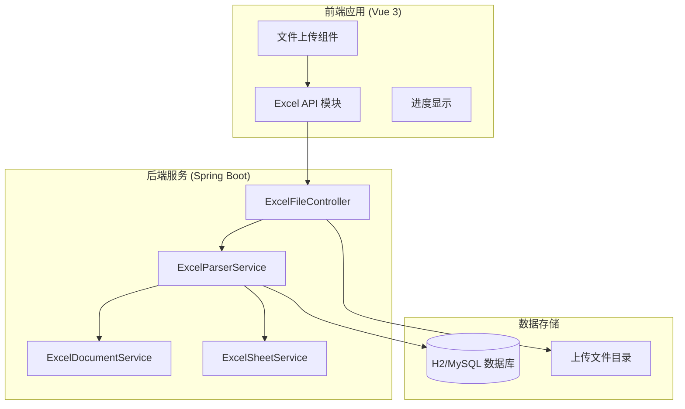
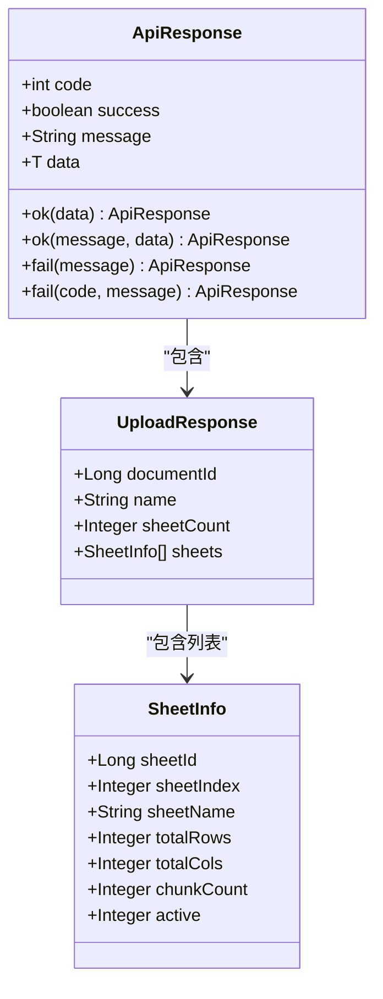
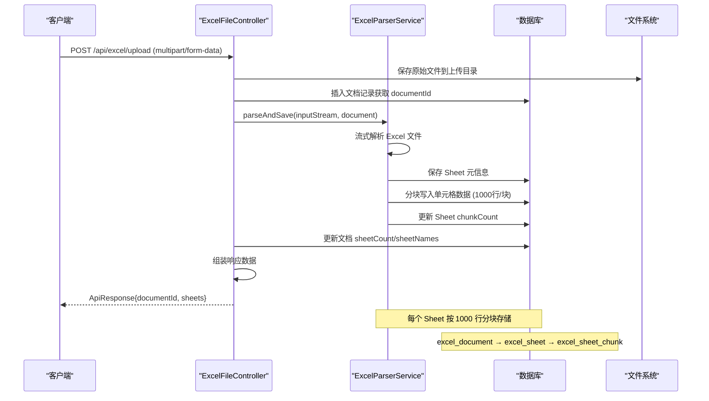
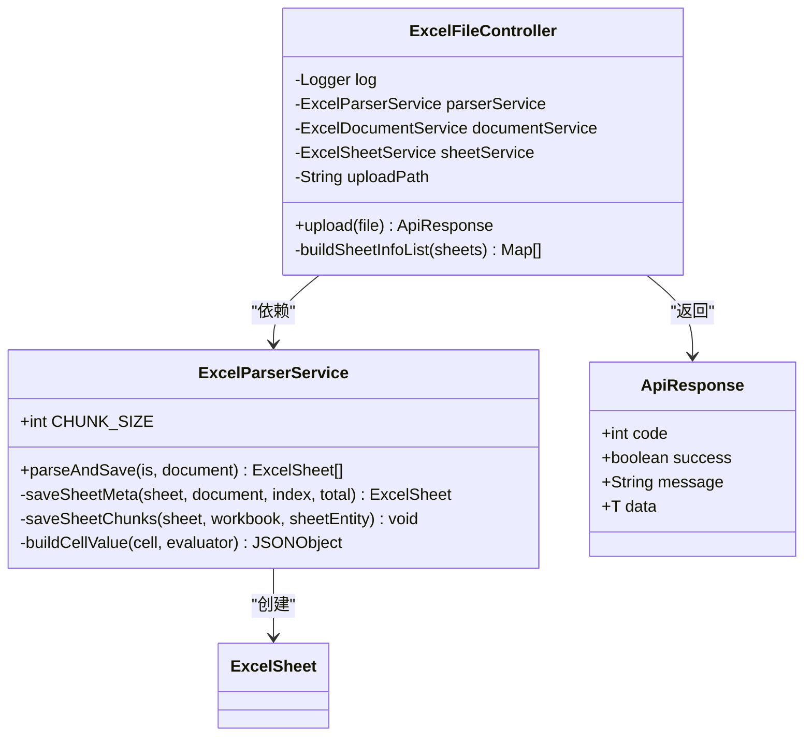
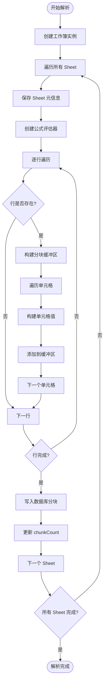
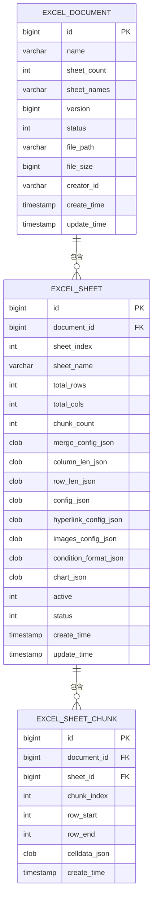
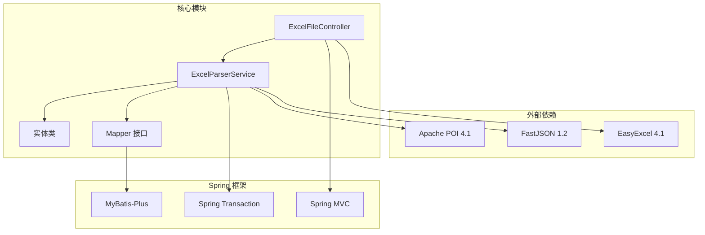
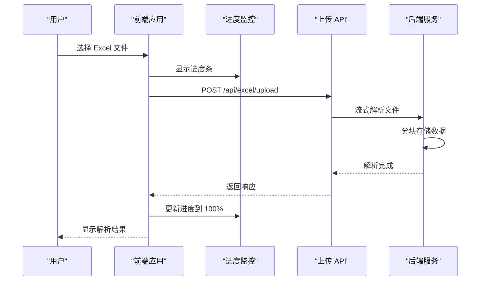

# 文件上传 API

<cite>
**本文档引用的文件**
- [ExcelFileController.java](file://dataloom-server/src/main/java/com/demo/excel/controller/ExcelFileController.java)
- [ExcelParserService.java](file://dataloom-server/src/main/java/com/demo/excel/service/ExcelParserService.java)
- [ApiResponse.java](file://dataloom-server/src/main/java/com/demo/excel/common/ApiResponse.java)
- [application.yml](file://dataloom-server/src/main/resources/application.yml)
- [excel.js](file://dataloom-web/src/api/excel.js)
- [ExcelDocument.java](file://dataloom-server/src/main/java/com/demo/excel/entity/ExcelDocument.java)
- [ExcelSheet.java](file://dataloom-server/src/main/java/com/demo/excel/entity/ExcelSheet.java)
- [ExcelSheetChunk.java](file://dataloom-server/src/main/java/com/demo/excel/entity/ExcelSheetChunk.java)
- [schema.sql](file://dataloom-server/src/main/resources/schema.sql)
- [README.md](file://README.md)
</cite>

## 目录
1. [简介](#简介)
2. [项目结构](#项目结构)
3. [核心组件](#核心组件)
4. [架构概览](#架构概览)
5. [详细组件分析](#详细组件分析)
6. [依赖关系分析](#依赖关系分析)
7. [性能考虑](#性能考虑)
8. [故障排除指南](#故障排除指南)
9. [结论](#结论)

## 简介

DataLoom 是一个从零构建的在线 Excel 协作系统，专门设计用于处理大规模 Excel 文件（支持十万级数据）。本文档详细说明了文件上传 API 的完整流程和接口规范，包括 Excel 文件上传的端点、请求格式、响应格式、进度跟踪机制以及安全考虑。

## 项目结构

DataLoom 采用前后端分离的架构设计，后端使用 Spring Boot + MyBatis-Plus，前端使用 Vue 3 + Vite。文件上传功能位于后端控制器中，通过 EasyExcel 和 Apache POI 实现高效的 Excel 文件解析。



**图表来源**
- [ExcelFileController.java:35-141](file://dataloom-server/src/main/java/com/demo/excel/controller/ExcelFileController.java#L35-L141)
- [ExcelParserService.java:25-348](file://dataloom-server/src/main/java/com/demo/excel/service/ExcelParserService.java#L25-L348)

**章节来源**
- [README.md:190-215](file://README.md#L190-L215)
- [application.yml:1-51](file://application.yml#L1-L51)

## 核心组件

### API 端点定义

文件上传 API 的核心端点如下：

| 方法 | 路径 | 描述 |
|------|------|------|
| `POST` | `/api/excel/upload` | 上传 Excel 文件（支持 `.xlsx` / `.xls`），解析后分块入库 |

### 请求参数规范

**请求头**
- `Content-Type`: `multipart/form-data`
- `Accept`: `application/json`

**请求体参数**
- `file` (必需): Excel 文件对象
  - 支持格式: `.xlsx` (Office 2007+)、`.xls` (Excel 97-2003)
  - 最大文件大小: 100MB
  - 文件名: 自动生成 UUID 前缀的唯一文件名

**章节来源**
- [ExcelFileController.java:70-116](file://dataloom-server/src/main/java/com/demo/excel/controller/ExcelFileController.java#L70-L116)
- [application.yml:19-24](file://application.yml#L19-L24)

### 响应格式

统一响应格式使用 `ApiResponse<T>` 包装：



**图表来源**
- [ApiResponse.java:6-52](file://dataloom-server/src/main/java/com/demo/excel/common/ApiResponse.java#L6-L52)
- [ExcelFileController.java:102-108](file://dataloom-server/src/main/java/com/demo/excel/controller/ExcelFileController.java#L102-L108)

**章节来源**
- [ApiResponse.java:13-40](file://dataloom-server/src/main/java/com/demo/excel/common/ApiResponse.java#L13-L40)

## 架构概览

文件上传处理流程采用分层架构设计，实现了高效的流式解析和分块存储：



**图表来源**
- [ExcelFileController.java:70-116](file://dataloom-server/src/main/java/com/demo/excel/controller/ExcelFileController.java#L70-L116)
- [ExcelParserService.java:66-87](file://dataloom-server/src/main/java/com/demo/excel/service/ExcelParserService.java#L66-L87)

## 详细组件分析

### ExcelFileController 组件

ExcelFileController 是文件上传功能的核心控制器，负责接收文件、保存文件、调用解析服务并返回统一响应。



**图表来源**
- [ExcelFileController.java:37-141](file://dataloom-server/src/main/java/com/demo/excel/controller/ExcelFileController.java#L37-L141)
- [ExcelParserService.java:38-348](file://dataloom-server/src/main/java/com/demo/excel/service/ExcelParserService.java#L38-L348)

#### 上传流程详解

1. **文件接收与保存**
   - 验证上传文件参数
   - 生成唯一文件名（UUID + 原始文件名）
   - 保存到配置的上传目录
   - 记录文件路径和大小

2. **文档记录创建**
   - 创建 ExcelDocument 实体
   - 设置文件元信息
   - 插入数据库获取 documentId

3. **流式解析与分块存储**
   - 调用 ExcelParserService.parseAndSave()
   - 使用 Apache POI 流式读取
   - 按 1000 行分块存储单元格数据

4. **响应组装**
   - 更新文档的 sheetCount 和 sheetNames
   - 组装 Sheet 元信息列表
   - 返回统一 ApiResponse

**章节来源**
- [ExcelFileController.java:70-116](file://dataloom-server/src/main/java/com/demo/excel/controller/ExcelFileController.java#L70-L116)

### ExcelParserService 组件

ExcelParserService 是解析引擎的核心，实现了高效的流式 POI 解析和分块持久化。

#### 核心算法流程



**图表来源**
- [ExcelParserService.java:66-87](file://dataloom-server/src/main/java/com/demo/excel/service/ExcelParserService.java#L66-L87)
- [ExcelParserService.java:142-200](file://dataloom-server/src/main/java/com/demo/excel/service/ExcelParserService.java#L142-L200)

#### 分块存储策略

- **分块大小**: 1000 行/块
- **分块索引计算**: `chunkIndex = rowIdx / CHUNK_SIZE`
- **行范围计算**: `rowStart = chunkIndex * CHUNK_SIZE`, `rowEnd = (chunkIndex + 1) * CHUNK_SIZE - 1`
- **数据格式**: Luckysheet celldata JSON 格式

**章节来源**
- [ExcelParserService.java:43-44](file://dataloom-server/src/main/java/com/demo/excel/service/ExcelParserService.java#L43-L44)
- [ExcelParserService.java:154-197](file://dataloom-server/src/main/java/com/demo/excel/service/ExcelParserService.java#L154-L197)

### 数据模型设计

文件上传涉及三个核心数据表，采用分层存储设计以支持大规模数据：



**图表来源**
- [schema.sql:8-66](file://dataloom-server/src/main/resources/schema.sql#L8-L66)
- [ExcelDocument.java:17-55](file://dataloom-server/src/main/java/com/demo/excel/entity/ExcelDocument.java#L17-L55)
- [ExcelSheet.java:16-77](file://dataloom-server/src/main/java/com/demo/excel/entity/ExcelSheet.java#L16-L77)
- [ExcelSheetChunk.java:20-53](file://dataloom-server/src/main/java/com/demo/excel/entity/ExcelSheetChunk.java#L20-L53)

**章节来源**
- [schema.sql:1-124](file://dataloom-server/src/main/resources/schema.sql#L1-L124)

## 依赖关系分析

文件上传功能的依赖关系清晰明确，遵循单一职责原则：



**图表来源**
- [ExcelFileController.java:3-14](file://dataloom-server/src/main/java/com/demo/excel/controller/ExcelFileController.java#L3-L14)
- [ExcelParserService.java:3-16](file://dataloom-server/src/main/java/com/demo/excel/service/ExcelParserService.java#L3-L16)

**章节来源**
- [ExcelFileController.java:1-141](file://dataloom-server/src/main/java/com/demo/excel/controller/ExcelFileController.java#L1-L141)
- [ExcelParserService.java:1-348](file://dataloom-server/src/main/java/com/demo/excel/service/ExcelParserService.java#L1-L348)

## 性能考虑

### 流式解析优化

- **内存效率**: 使用 Apache POI 的流式读取，避免将整个 Excel 文件加载到内存
- **CPU 利用率**: 分块处理减少单次操作的数据量
- **I/O 性能**: 顺序读取和写入，减少随机访问

### 分块存储优势

- **查询性能**: 按需加载特定块，避免全表扫描
- **更新粒度**: 只更新受影响的块，提高并发性能
- **缓存友好**: 小块数据更适合内存缓存

### 并发处理

- **事务隔离**: 每个文档解析在独立事务中进行
- **锁机制**: 基于块级别的细粒度锁定
- **资源管理**: 及时释放解析器和数据库连接

## 故障排除指南

### 常见错误及解决方案

| 错误类型 | 错误代码 | 可能原因 | 解决方案 |
|----------|----------|----------|----------|
| 文件格式错误 | 500 | 不支持的文件格式 | 确保上传 .xlsx 或 .xls 文件 |
| 文件过大 | 500 | 超过 100MB 限制 | 分割文件或压缩数据 |
| 解析失败 | 500 | Excel 文件损坏 | 检查文件完整性 |
| 数据库连接 | 500 | 数据库不可用 | 检查数据库服务状态 |
| 磁盘空间 | 500 | 磁盘空间不足 | 清理上传目录空间 |

### 前端集成最佳实践



**图表来源**
- [excel.js:13-25](file://dataloom-web/src/api/excel.js#L13-L25)

### 前端实现示例

**基础上传函数**
```javascript
// 基础实现
export function uploadExcel(file) {
  const formData = new FormData()
  formData.append('file', file)
  
  return api.post('/upload', formData, {
    headers: { 'Content-Type': 'multipart/form-data' }
  })
}
```

**带进度监控的实现**
```javascript
// 带进度监控
export function uploadExcel(file, onProgress) {
  const formData = new FormData()
  formData.append('file', file)

  return api.post('/upload', formData, {
    headers: { 'Content-Type': 'multipart/form-data' },
    onUploadProgress: (event) => {
      if (onProgress && event.total) {
        onProgress(Math.round((event.loaded / event.total) * 100))
      }
    }
  })
}
```

**章节来源**
- [excel.js:13-25](file://dataloom-web/src/api/excel.js#L13-L25)

### 后端配置检查

**文件上传限制**
- `max-file-size`: 100MB
- `max-request-size`: 100MB
- 上传目录: `./upload`（可配置）

**数据库配置**
- H2 内存数据库（开发环境）
- 支持切换到 MySQL/PostgreSQL
- 自动建表初始化

**章节来源**
- [application.yml:19-46](file://application.yml#L19-L46)

## 结论

DataLoom 的文件上传 API 设计充分考虑了大规模 Excel 文件处理的需求，通过流式解析、分块存储和细粒度的错误处理机制，实现了高效、可靠的文件上传体验。系统采用前后端分离架构，前端负责进度监控和用户体验，后端专注于数据处理和存储，形成了完整的数据处理流水线。

主要优势包括：
- 支持十万级数据的大文件处理
- 流式解析避免内存溢出
- 分块存储提升查询和更新性能
- 统一的错误处理和响应格式
- 完善的进度跟踪机制

该设计为后续的功能扩展（如多人协作、权限管理、实时同步等）奠定了坚实的基础。