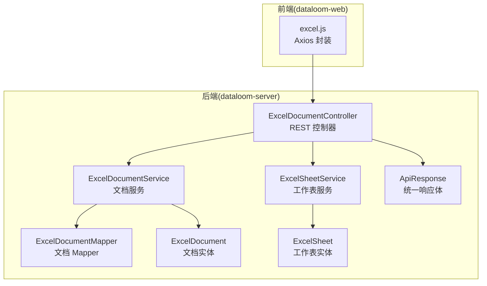
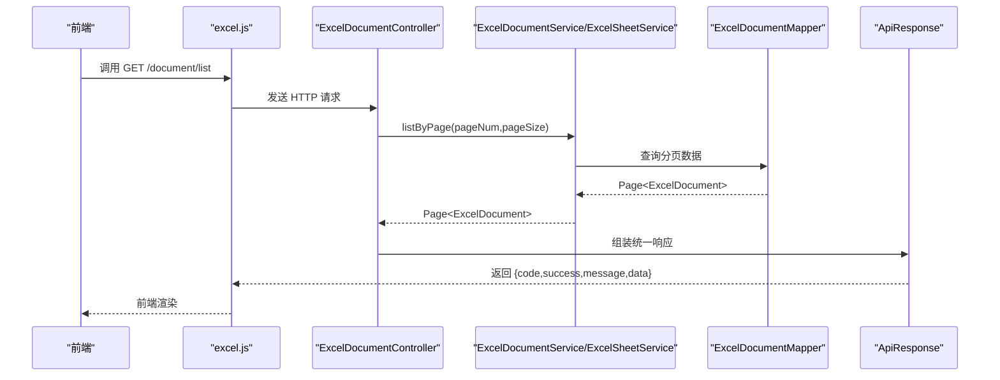
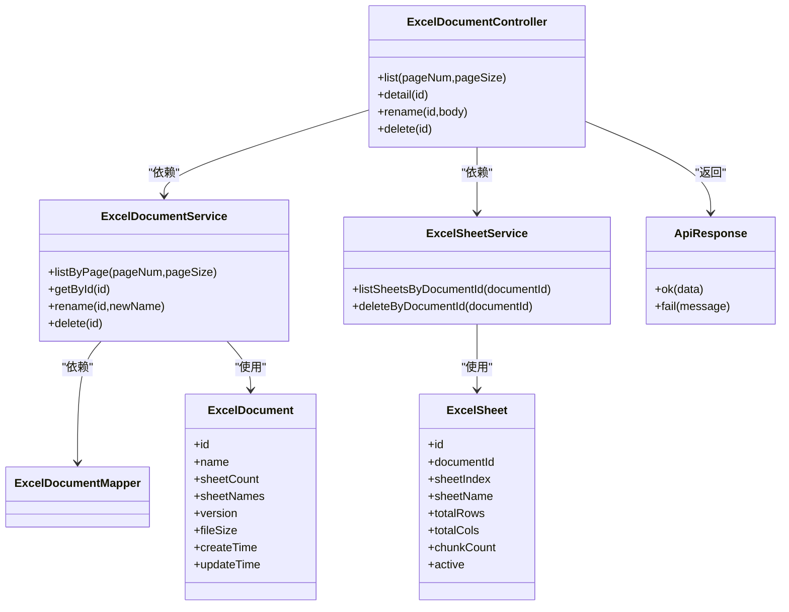

# 文档管理 API

<cite>
**本文引用的文件**
- [ExcelDocumentController.java](file://dataloom-server/src/main/java/com/demo/excel/controller/ExcelDocumentController.java)
- [ExcelDocumentService.java](file://dataloom-server/src/main/java/com/demo/excel/service/ExcelDocumentService.java)
- [ExcelDocument.java](file://dataloom-server/src/main/java/com/demo/excel/entity/ExcelDocument.java)
- [ExcelSheetService.java](file://dataloom-server/src/main/java/com/demo/excel/service/ExcelSheetService.java)
- [ExcelSheet.java](file://dataloom-server/src/main/java/com/demo/excel/entity/ExcelSheet.java)
- [ExcelDocumentMapper.java](file://dataloom-server/src/main/java/com/demo/excel/mapper/ExcelDocumentMapper.java)
- [ApiResponse.java](file://dataloom-server/src/main/java/com/demo/excel/common/ApiResponse.java)
- [application.yml](file://dataloom-server/src/main/resources/application.yml)
- [excel.js](file://dataloom-web/src/api/excel.js)
- [README.md](file://README.md)
</cite>

## 目录
1. [简介](#简介)
2. [项目结构](#项目结构)
3. [核心组件](#核心组件)
4. [架构总览](#架构总览)
5. [详细接口文档](#详细接口文档)
6. [依赖关系分析](#依赖关系分析)
7. [性能考量](#性能考量)
8. [故障排查指南](#故障排查指南)
9. [结论](#结论)
10. [附录](#附录)

## 简介
本文档面向 DataLoom 的“文档管理”相关 API，聚焦以下四个端点：
- 文档列表查询：GET /api/excel/document/list
- 文档详情获取：GET /api/excel/document/{id}
- 文档重命名：PUT /api/excel/document/{id}/name
- 文档删除：DELETE /api/excel/document/{id}

文档还涵盖分页参数、默认值、响应格式、错误处理、典型请求/响应示例以及最佳实践与注意事项。

## 项目结构
后端采用 Spring Boot + MyBatis-Plus 架构，控制器位于 controller 包，服务层位于 service 包，实体与 Mapper 位于 entity 与 mapper 包。统一响应体封装在 common 包中。前端通过 axios 封装的 API 文件进行调用。

**图表来源**
- [ExcelDocumentController.java:22-24](file://dataloom-server/src/main/java/com/demo/excel/controller/ExcelDocumentController.java#L22-L24)
- [ExcelDocumentService.java:19-24](file://dataloom-server/src/main/java/com/demo/excel/service/ExcelDocumentService.java#L19-L24)
- [ExcelSheetService.java:33-44](file://dataloom-server/src/main/java/com/demo/excel/service/ExcelSheetService.java#L33-L44)
- [ExcelDocumentMapper.java:9-10](file://dataloom-server/src/main/java/com/demo/excel/mapper/ExcelDocumentMapper.java#L9-L10)
- [ExcelDocument.java:15-17](file://dataloom-server/src/main/java/com/demo/excel/entity/ExcelDocument.java#L15-L17)
- [ExcelSheet.java:14-16](file://dataloom-server/src/main/java/com/demo/excel/entity/ExcelSheet.java#L14-L16)
- [ApiResponse.java:6-11](file://dataloom-server/src/main/java/com/demo/excel/common/ApiResponse.java#L6-L11)
- [excel.js:3-6](file://dataloom-web/src/api/excel.js#L3-L6)

**章节来源**
- [ExcelDocumentController.java:22-24](file://dataloom-server/src/main/java/com/demo/excel/controller/ExcelDocumentController.java#L22-L24)
- [ExcelDocumentService.java:19-24](file://dataloom-server/src/main/java/com/demo/excel/service/ExcelDocumentService.java#L19-L24)
- [ExcelSheetService.java:33-44](file://dataloom-server/src/main/java/com/demo/excel/service/ExcelSheetService.java#L33-L44)
- [ExcelDocumentMapper.java:9-10](file://dataloom-server/src/main/java/com/demo/excel/mapper/ExcelDocumentMapper.java#L9-L10)
- [ExcelDocument.java:15-17](file://dataloom-server/src/main/java/com/demo/excel/entity/ExcelDocument.java#L15-L17)
- [ExcelSheet.java:14-16](file://dataloom-server/src/main/java/com/demo/excel/entity/ExcelSheet.java#L14-L16)
- [ApiResponse.java:6-11](file://dataloom-server/src/main/java/com/demo/excel/common/ApiResponse.java#L6-L11)
- [excel.js:3-6](file://dataloom-web/src/api/excel.js#L3-L6)

## 核心组件
- 控制器：负责接收 HTTP 请求、参数校验、调用服务层并返回统一响应体。
- 服务层：
  - 文档服务：提供分页查询、详情查询、重命名、软删除等。
  - 工作表服务：提供按文档查询工作表、按工作表查询分块、删除级联清理等。
- 实体与 Mapper：文档与工作表的持久化模型及 MyBatis-Plus 接口。
- 统一响应体：统一返回 code、success、message、data 字段，便于前后端约定。

**章节来源**
- [ExcelDocumentController.java:28-32](file://dataloom-server/src/main/java/com/demo/excel/controller/ExcelDocumentController.java#L28-L32)
- [ExcelDocumentService.java:21-24](file://dataloom-server/src/main/java/com/demo/excel/service/ExcelDocumentService.java#L21-L24)
- [ExcelSheetService.java:33-44](file://dataloom-server/src/main/java/com/demo/excel/service/ExcelSheetService.java#L33-L44)
- [ApiResponse.java:6-11](file://dataloom-server/src/main/java/com/demo/excel/common/ApiResponse.java#L6-L11)

## 架构总览
文档管理 API 的调用链路如下：前端通过 axios 封装的 API 调用后端控制器，控制器调用服务层，服务层通过 Mapper 访问数据库，最终返回统一响应体。

**图表来源**
- [excel.js:31-36](file://dataloom-web/src/api/excel.js#L31-L36)
- [ExcelDocumentController.java:44-69](file://dataloom-server/src/main/java/com/demo/excel/controller/ExcelDocumentController.java#L44-L69)
- [ExcelDocumentService.java:72-78](file://dataloom-server/src/main/java/com/demo/excel/service/ExcelDocumentService.java#L72-L78)
- [ExcelDocumentMapper.java:9-10](file://dataloom-server/src/main/java/com/demo/excel/mapper/ExcelDocumentMapper.java#L9-L10)
- [ApiResponse.java:13-26](file://dataloom-server/src/main/java/com/demo/excel/common/ApiResponse.java#L13-L26)

## 详细接口文档

### 文档列表查询
- HTTP 方法：GET
- URL 路径：/api/excel/document/list
- 功能描述：分页查询文档列表，仅返回文档元数据（不含单元格数据）。
- 分页参数
  - pageNum：页码，默认值 1
  - pageSize：每页条数，默认值 20
- 请求示例
  - curl 示例：curl "http://localhost:9191/api/excel/document/list?pageNum=1&pageSize=20"
- 响应格式
  - 成功时返回统一响应体，data 字段包含 total、pages、current、records。
  - records 中的每个元素包含：id、name、sheetCount、sheetNames、version、fileSize、createTime、updateTime。
- 错误处理
  - 默认成功码 200，消息 success；若出现异常，统一返回 code 500、success false。
- 典型响应示例
  - {
      "code": 200,
      "success": true,
      "message": "success",
      "data": {
        "total": 120,
        "pages": 6,
        "current": 1,
        "records": [
          {
            "id": 1001,
            "name": "销售报表.xlsx",
            "sheetCount": 3,
            "sheetNames": "[\"Sheet1\",\"Sheet2\",\"Sheet3\"]",
            "version": 1,
            "fileSize": 1048576,
            "createTime": "2025-01-01T10:00:00",
            "updateTime": "2025-01-02T11:00:00"
          }
        ]
      }
    }

**章节来源**
- [ExcelDocumentController.java:44-69](file://dataloom-server/src/main/java/com/demo/excel/controller/ExcelDocumentController.java#L44-L69)
- [ExcelDocumentService.java:72-78](file://dataloom-server/src/main/java/com/demo/excel/service/ExcelDocumentService.java#L72-L78)
- [ApiResponse.java:13-26](file://dataloom-server/src/main/java/com/demo/excel/common/ApiResponse.java#L13-L26)

### 文档详情获取
- HTTP 方法：GET
- URL 路径：/api/excel/document/{id}
- 功能描述：获取文档元信息与各工作表的元信息（不含单元格数据 celldata）。
- 路径参数
  - id：文档 ID（Long）
- 请求示例
  - curl 示例：curl "http://localhost:9191/api/excel/document/1001"
- 响应格式
  - 成功时返回统一响应体，data 字段包含：id、name、sheetCount、version、sheets。
  - sheets 中每个元素包含：sheetId、sheetIndex、sheetName、totalRows、totalCols、chunkCount、active、config、mergeConfig、columnLen、rowLen、hyperlink、images、luckysheet_conditionformat_save、chart。
- 错误处理
  - 若文档不存在，返回 code 404、success false。
  - 默认成功码 200，消息 success。
- 典型响应示例
  - {
      "code": 200,
      "success": true,
      "message": "success",
      "data": {
        "id": 1001,
        "name": "销售报表.xlsx",
        "sheetCount": 3,
        "version": 1,
        "sheets": [
          {
            "sheetId": 2001,
            "sheetIndex": 0,
            "sheetName": "Sheet1",
            "totalRows": 10000,
            "totalCols": 20,
            "chunkCount": 10,
            "active": 1,
            "config": { "merge": {}, "columnlen": {}, "rowlen": {} },
            "mergeConfig": {},
            "columnLen": {},
            "rowLen": {},
            "hyperlink": {},
            "images": {},
            "luckysheet_conditionformat_save": [],
            "chart": []
          }
        ]
      }
    }

**章节来源**
- [ExcelDocumentController.java:77-131](file://dataloom-server/src/main/java/com/demo/excel/controller/ExcelDocumentController.java#L77-L131)
- [ExcelSheetService.java:51-57](file://dataloom-server/src/main/java/com/demo/excel/service/ExcelSheetService.java#L51-L57)
- [ApiResponse.java:13-26](file://dataloom-server/src/main/java/com/demo/excel/common/ApiResponse.java#L13-L26)

### 文档重命名
- HTTP 方法：PUT
- URL 路径：/api/excel/document/{id}/name
- 功能描述：重命名指定文档。
- 路径参数
  - id：文档 ID（Long）
- 请求体
  - JSON 对象，包含 name 字段（字符串，必填且非空）。
- 请求示例
  - curl 示例：curl -X PUT "http://localhost:9191/api/excel/document/1001/name" -H "Content-Type: application/json" -d '{"name":"新报表名称.xlsx"}'
- 响应格式
  - 成功时返回统一响应体，message 为“重命名成功”，data 为 null。
  - 若名称为空或文档不存在，返回相应错误码与消息。
- 错误处理
  - 名称为空：返回 code 500、success false。
  - 文档不存在：返回 code 404、success false。
  - 默认成功码 200，消息 success。
- 典型响应示例
  - {
      "code": 200,
      "success": true,
      "message": "重命名成功",
      "data": null
    }

**章节来源**
- [ExcelDocumentController.java:238-251](file://dataloom-server/src/main/java/com/demo/excel/controller/ExcelDocumentController.java#L238-L251)
- [ExcelDocumentService.java:111-117](file://dataloom-server/src/main/java/com/demo/excel/service/ExcelDocumentService.java#L111-L117)
- [ApiResponse.java:28-40](file://dataloom-server/src/main/java/com/demo/excel/common/ApiResponse.java#L28-L40)

### 文档删除
- HTTP 方法：DELETE
- URL 路径：/api/excel/document/{id}
- 功能描述：软删除文档（同时软删除其工作表，并物理删除所有分块数据）。
- 路径参数
  - id：文档 ID（Long）
- 请求示例
  - curl 示例：curl -X DELETE "http://localhost:9191/api/excel/document/1001"
- 响应格式
  - 成功时返回统一响应体，message 为“删除成功”，data 为 null。
- 错误处理
  - 默认成功码 200，消息 success。
- 典型响应示例
  - {
      "code": 200,
      "success": true,
      "message": "删除成功",
      "data": null
    }

**章节来源**
- [ExcelDocumentController.java:258-264](file://dataloom-server/src/main/java/com/demo/excel/controller/ExcelDocumentController.java#L258-L264)
- [ExcelDocumentService.java:86-103](file://dataloom-server/src/main/java/com/demo/excel/service/ExcelDocumentService.java#L86-L103)
- [ExcelSheetService.java:79-91](file://dataloom-server/src/main/java/com/demo/excel/service/ExcelSheetService.java#L79-L91)
- [ApiResponse.java:13-26](file://dataloom-server/src/main/java/com/demo/excel/common/ApiResponse.java#L13-L26)

## 依赖关系分析
- 控制器依赖服务层，服务层依赖 Mapper 与实体。
- 统一响应体贯穿所有接口，保证前后端一致的契约。
- 前端通过 axios 封装的 API 调用后端控制器。

**图表来源**
- [ExcelDocumentController.java:28-32](file://dataloom-server/src/main/java/com/demo/excel/controller/ExcelDocumentController.java#L28-L32)
- [ExcelDocumentService.java:21-24](file://dataloom-server/src/main/java/com/demo/excel/service/ExcelDocumentService.java#L21-L24)
- [ExcelSheetService.java:33-44](file://dataloom-server/src/main/java/com/demo/excel/service/ExcelSheetService.java#L33-L44)
- [ExcelDocumentMapper.java:9-10](file://dataloom-server/src/main/java/com/demo/excel/mapper/ExcelDocumentMapper.java#L9-L10)
- [ExcelDocument.java:17-52](file://dataloom-server/src/main/java/com/demo/excel/entity/ExcelDocument.java#L17-L52)
- [ExcelSheet.java:16-74](file://dataloom-server/src/main/java/com/demo/excel/entity/ExcelSheet.java#L16-L74)
- [ApiResponse.java:6-11](file://dataloom-server/src/main/java/com/demo/excel/common/ApiResponse.java#L6-L11)

**章节来源**
- [ExcelDocumentController.java:28-32](file://dataloom-server/src/main/java/com/demo/excel/controller/ExcelDocumentController.java#L28-L32)
- [ExcelDocumentService.java:21-24](file://dataloom-server/src/main/java/com/demo/excel/service/ExcelDocumentService.java#L21-L24)
- [ExcelSheetService.java:33-44](file://dataloom-server/src/main/java/com/demo/excel/service/ExcelSheetService.java#L33-L44)
- [ExcelDocumentMapper.java:9-10](file://dataloom-server/src/main/java/com/demo/excel/mapper/ExcelDocumentMapper.java#L9-L10)
- [ExcelDocument.java:17-52](file://dataloom-server/src/main/java/com/demo/excel/entity/ExcelDocument.java#L17-L52)
- [ExcelSheet.java:16-74](file://dataloom-server/src/main/java/com/demo/excel/entity/ExcelSheet.java#L16-L74)
- [ApiResponse.java:6-11](file://dataloom-server/src/main/java/com/demo/excel/common/ApiResponse.java#L6-L11)

## 性能考量
- 分页查询：列表接口使用 MyBatis-Plus 分页插件，避免一次性加载大量数据。
- 元数据优先：详情接口返回工作表元信息而非单元格数据，前端可按需加载 celldata。
- 删除策略：软删除文档，同时软删除工作表并物理删除分块，降低数据库压力。
- 前端代理：前端通过代理将 /api 请求转发至后端，避免跨域问题。

**章节来源**
- [ExcelDocumentController.java:44-69](file://dataloom-server/src/main/java/com/demo/excel/controller/ExcelDocumentController.java#L44-L69)
- [ExcelDocumentService.java:72-78](file://dataloom-server/src/main/java/com/demo/excel/service/ExcelDocumentService.java#L72-L78)
- [ExcelSheetService.java:79-91](file://dataloom-server/src/main/java/com/demo/excel/service/ExcelSheetService.java#L79-L91)
- [application.yml:1-51](file://dataloom-server/src/main/resources/application.yml#L1-L51)

## 故障排查指南
- 常见错误码
  - 200：成功
  - 404：文档不存在
  - 500：通用错误（如参数非法、内部异常）
- 常见问题
  - 重命名时 name 为空：检查请求体是否包含合法 name。
  - 删除后仍可见：确认软删除状态与前端过滤逻辑。
  - 列表为空：检查 pageNum/pageSize 参数与数据库中 status=1 的文档。
- 日志定位
  - 控制器与服务层均包含日志输出，可通过日志定位具体异常。

**章节来源**
- [ExcelDocumentController.java:80-82](file://dataloom-server/src/main/java/com/demo/excel/controller/ExcelDocumentController.java#L80-L82)
- [ExcelDocumentController.java:241-243](file://dataloom-server/src/main/java/com/demo/excel/controller/ExcelDocumentController.java#L241-L243)
- [ExcelDocumentController.java:260-263](file://dataloom-server/src/main/java/com/demo/excel/controller/ExcelDocumentController.java#L260-L263)
- [ApiResponse.java:28-40](file://dataloom-server/src/main/java/com/demo/excel/common/ApiResponse.java#L28-L40)

## 结论
本文档梳理了 DataLoom 文档管理 API 的四个核心端点，明确了参数、响应、错误处理与最佳实践。通过分页与元数据优先的设计，配合软删除与分块存储策略，能够稳定支撑大规模文档的管理与编辑需求。

## 附录

### 分页参数与默认值
- pageNum：默认 1
- pageSize：默认 20

**章节来源**
- [ExcelDocumentController.java:45-46](file://dataloom-server/src/main/java/com/demo/excel/controller/ExcelDocumentController.java#L45-L46)

### 文档元数据字段说明
- id：文档主键
- name：文档名称
- sheetCount：工作表数量
- sheetNames：工作表名称列表（JSON 数组字符串）
- version：乐观锁版本号
- fileSize：文件大小（字节）
- createTime：创建时间
- updateTime：更新时间

**章节来源**
- [ExcelDocument.java:19-52](file://dataloom-server/src/main/java/com/demo/excel/entity/ExcelDocument.java#L19-L52)

### 前端调用参考
- 前端通过 axios 封装的 API 调用后端接口，baseUrl 为 /api/excel。

**章节来源**
- [excel.js:3-6](file://dataloom-web/src/api/excel.js#L3-L6)

### API 调用最佳实践
- 使用分页参数合理控制数据量，避免一次性加载过多文档。
- 重命名时确保 name 非空，避免无效请求。
- 删除文档前确认不再需要该文档及其工作表与分块数据。
- 前端与后端保持统一的响应体格式，便于错误处理与调试。

**章节来源**
- [README.md:190-215](file://README.md#L190-L215)