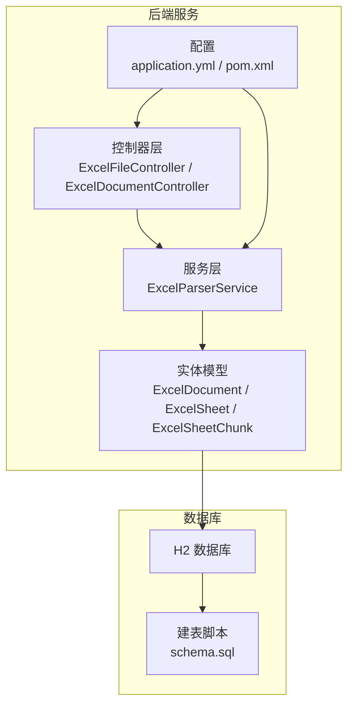
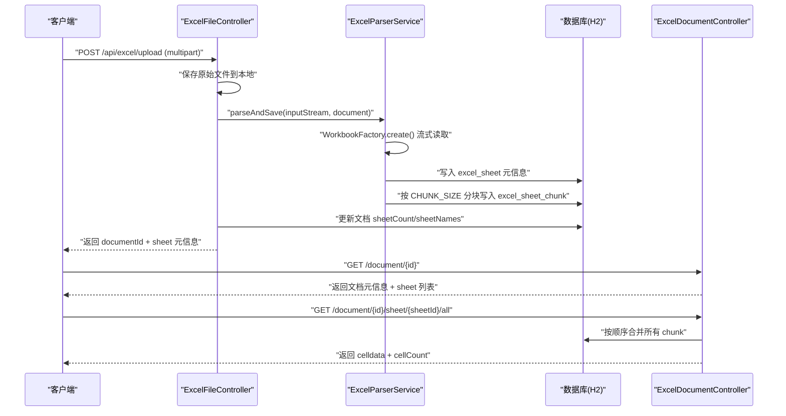
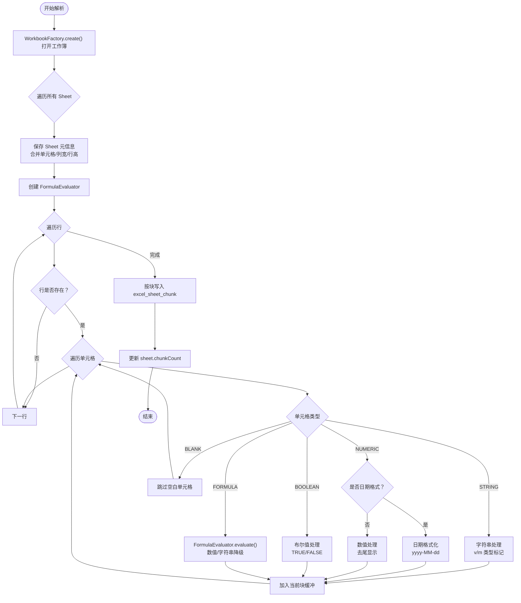
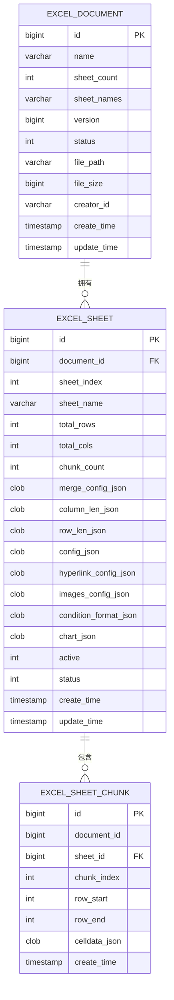
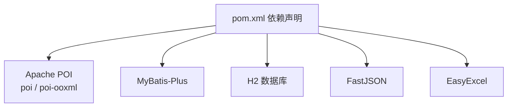

# Apache POI 流式解析引擎

<cite>
**本文引用的文件**
- [ExcelParserService.java](file://dataloom-server/src/main/java/com/demo/excel/service/ExcelParserService.java)
- [ExcelDocumentController.java](file://dataloom-server/src/main/java/com/demo/excel/controller/ExcelDocumentController.java)
- [ExcelFileController.java](file://dataloom-server/src/main/java/com/demo/excel/controller/ExcelFileController.java)
- [ExcelTest.java](file://dataloom-server/src/main/java/com/demo/excel/ExcelTest.java)
- [pom.xml](file://dataloom-server/pom.xml)
- [ExcelDocument.java](file://dataloom-server/src/main/java/com/demo/excel/entity/ExcelDocument.java)
- [ExcelSheet.java](file://dataloom-server/src/main/java/com/demo/excel/entity/ExcelSheet.java)
- [ExcelSheetChunk.java](file://dataloom-server/src/main/java/com/demo/excel/entity/ExcelSheetChunk.java)
- [application.yml](file://dataloom-server/src/main/resources/application.yml)
- [schema.sql](file://dataloom-server/src/main/resources/schema.sql)
- [README.md](file://README.md)
</cite>

## 目录
1. [简介](#简介)
2. [项目结构](#项目结构)
3. [核心组件](#核心组件)
4. [架构概览](#架构概览)
5. [详细组件分析](#详细组件分析)
6. [依赖关系分析](#依赖关系分析)
7. [性能考虑](#性能考虑)
8. [故障排查指南](#故障排查指南)
9. [结论](#结论)
10. [附录](#附录)

## 简介
本文件面向 Apache POI 流式解析引擎的技术文档，围绕 ExcelParserService 的实现进行深入剖析，重点解释：
- WorkbookFactory 的使用原理与流式读取优势
- 内存管理与性能优化策略（分块存储）
- 不同单元格类型的处理逻辑（字符串、数值、日期、布尔值、公式、空白）
- FormulaEvaluator 的工作原理与公式计算实现
- 空单元格处理策略与数据完整性保障
- 关键功能的实现细节与最佳实践

同时结合项目中的控制器、实体模型与数据库模式，给出端到端的数据流与架构视图，帮助读者全面理解从上传到持久化、再到前端按需加载的完整链路。

## 项目结构
后端采用 Spring Boot + MyBatis-Plus 架构，Excel 解析与分块存储集中在服务层，控制器负责对外暴露 REST API，数据库采用 H2（文件模式）作为演示环境，支持按需迁移到 MySQL。

**图表来源**
- [ExcelFileController.java:1-141](file://dataloom-server/src/main/java/com/demo/excel/controller/ExcelFileController.java#L1-L141)
- [ExcelDocumentController.java:1-296](file://dataloom-server/src/main/java/com/demo/excel/controller/ExcelDocumentController.java#L1-L296)
- [ExcelParserService.java:1-348](file://dataloom-server/src/main/java/com/demo/excel/service/ExcelParserService.java#L1-L348)
- [ExcelDocument.java:1-55](file://dataloom-server/src/main/java/com/demo/excel/entity/ExcelDocument.java#L1-L55)
- [ExcelSheet.java:1-77](file://dataloom-server/src/main/java/com/demo/excel/entity/ExcelSheet.java#L1-L77)
- [ExcelSheetChunk.java:1-53](file://dataloom-server/src/main/java/com/demo/excel/entity/ExcelSheetChunk.java#L1-L53)
- [application.yml:1-51](file://dataloom-server/src/main/resources/application.yml#L1-L51)
- [schema.sql:1-124](file://dataloom-server/src/main/resources/schema.sql#L1-L124)

**章节来源**
- [README.md:88-130](file://README.md#L88-L130)
- [application.yml:1-51](file://dataloom-server/src/main/resources/application.yml#L1-L51)
- [schema.sql:1-124](file://dataloom-server/src/main/resources/schema.sql#L1-L124)

## 核心组件
- ExcelParserService：核心解析与分块存储引擎，负责使用 WorkbookFactory 流式读取、按行分块构建 celldata、持久化到 excel_sheet_chunk 表，并维护 sheet 元信息。
- ExcelFileController：文件上传入口，负责保存原始文件、触发解析、更新文档元信息。
- ExcelDocumentController：文档与单元格读写接口，支持按块加载 celldata、批量更新单元格。
- 实体模型：ExcelDocument、ExcelSheet、ExcelSheetChunk，承载分层数据结构。
- 配置与依赖：application.yml、pom.xml，定义数据库连接、文件上传限制、POI/EasyExcel/FastJSON 版本。

**章节来源**
- [ExcelParserService.java:25-87](file://dataloom-server/src/main/java/com/demo/excel/service/ExcelParserService.java#L25-L87)
- [ExcelFileController.java:57-116](file://dataloom-server/src/main/java/com/demo/excel/controller/ExcelFileController.java#L57-L116)
- [ExcelDocumentController.java:133-161](file://dataloom-server/src/main/java/com/demo/excel/controller/ExcelDocumentController.java#L133-L161)
- [ExcelDocument.java:8-14](file://dataloom-server/src/main/java/com/demo/excel/entity/ExcelDocument.java#L8-L14)
- [ExcelSheet.java:8-13](file://dataloom-server/src/main/java/com/demo/excel/entity/ExcelSheet.java#L8-L13)
- [ExcelSheetChunk.java:9-17](file://dataloom-server/src/main/java/com/demo/excel/entity/ExcelSheetChunk.java#L9-L17)
- [pom.xml:61-85](file://dataloom-server/pom.xml#L61-L85)

## 架构概览
下图展示了从文件上传到解析入库、再到前端按需加载的完整数据流。

**图表来源**
- [ExcelFileController.java:70-116](file://dataloom-server/src/main/java/com/demo/excel/controller/ExcelFileController.java#L70-L116)
- [ExcelParserService.java:66-87](file://dataloom-server/src/main/java/com/demo/excel/service/ExcelParserService.java#L66-L87)
- [ExcelDocumentController.java:77-161](file://dataloom-server/src/main/java/com/demo/excel/controller/ExcelDocumentController.java#L77-L161)

## 详细组件分析

### ExcelParserService：流式解析与分块存储
- 流式读取：通过 WorkbookFactory.create(inputStream) 获取 Workbook，避免一次性将整个 Excel 加载到内存，降低内存峰值。
- 分块策略：以行号直接决定块归属，chunkIndex = rowIdx / CHUNK_SIZE，确保与批量更新时的定位逻辑一致，避免空行导致的边界偏移。
- 单元格类型处理：
  - 字符串：保留原始字符串与显示值，类型标记为字符串。
  - 数值：区分日期与普通数值；日期使用固定格式化，数值采用去尾处理。
  - 布尔值：映射为布尔类型，显示值为 TRUE/FALSE。
  - 公式：使用 FormulaEvaluator.evaluate(cell) 计算结果，数值型结果保留数值与格式化显示，字符串型结果保留字符串与显示值；计算异常时降级为字符串。
  - 空白：直接跳过，不写入 celldata。
- 元信息持久化：合并单元格、列宽、行高等配置以 JSON 形式存入 excel_sheet，便于前端渲染。
- 错误处理：单个单元格解析异常不会中断整体流程，提升鲁棒性。

**图表来源**
- [ExcelParserService.java:66-200](file://dataloom-server/src/main/java/com/demo/excel/service/ExcelParserService.java#L66-L200)
- [ExcelParserService.java:205-281](file://dataloom-server/src/main/java/com/demo/excel/service/ExcelParserService.java#L205-L281)

**章节来源**
- [ExcelParserService.java:25-87](file://dataloom-server/src/main/java/com/demo/excel/service/ExcelParserService.java#L25-L87)
- [ExcelParserService.java:135-200](file://dataloom-server/src/main/java/com/demo/excel/service/ExcelParserService.java#L135-L200)
- [ExcelParserService.java:205-281](file://dataloom-server/src/main/java/com/demo/excel/service/ExcelParserService.java#L205-L281)

### ExcelFileController：上传与解析入口
- 保存原始文件至本地磁盘，便于备份与后续导出。
- 先插入文档主记录，获取 documentId 后调用 ExcelParserService 进行流式解析与分块写入。
- 更新文档的 sheetCount 与 sheetNames，组装响应返回给前端。

**章节来源**
- [ExcelFileController.java:57-116](file://dataloom-server/src/main/java/com/demo/excel/controller/ExcelFileController.java#L57-L116)

### ExcelDocumentController：文档与单元格读写
- 文档详情：返回文档元信息与各 Sheet 的配置（合并单元格、列宽、行高、超链接、图片、条件格式、图表等）。
- 全量加载 celldata：按顺序合并所有 chunk，适用于小到中等规模 Sheet。
- 批量更新单元格：按块回写，仅影响相关分块，适合增量保存。

**章节来源**
- [ExcelDocumentController.java:77-161](file://dataloom-server/src/main/java/com/demo/excel/controller/ExcelDocumentController.java#L77-L161)
- [ExcelDocumentController.java:176-190](file://dataloom-server/src/main/java/com/demo/excel/controller/ExcelDocumentController.java#L176-L190)

### 实体模型与数据库模式
- ExcelDocument：文档主表，仅存元数据，避免单行存储过大。
- ExcelSheet：Sheet 元信息表，包含合并单元格、列宽、行高、配置等 JSON 字段。
- ExcelSheetChunk：按块存储 celldata，每块约 1000 行，单块 JSON 通常在几百 KB 以内。
- schema.sql：H2 建表脚本，包含索引与字段定义；提供 MySQL 参考建表语句。

**图表来源**
- [ExcelDocument.java:15-54](file://dataloom-server/src/main/java/com/demo/excel/entity/ExcelDocument.java#L15-L54)
- [ExcelSheet.java:14-76](file://dataloom-server/src/main/java/com/demo/excel/entity/ExcelSheet.java#L14-L76)
- [ExcelSheetChunk.java:18-52](file://dataloom-server/src/main/java/com/demo/excel/entity/ExcelSheetChunk.java#L18-L52)
- [schema.sql:8-66](file://dataloom-server/src/main/resources/schema.sql#L8-L66)

**章节来源**
- [ExcelDocument.java:8-14](file://dataloom-server/src/main/java/com/demo/excel/entity/ExcelDocument.java#L8-L14)
- [ExcelSheet.java:8-13](file://dataloom-server/src/main/java/com/demo/excel/entity/ExcelSheet.java#L8-L13)
- [ExcelSheetChunk.java:9-17](file://dataloom-server/src/main/java/com/demo/excel/entity/ExcelSheetChunk.java#L9-L17)
- [schema.sql:1-124](file://dataloom-server/src/main/resources/schema.sql#L1-L124)

### 单元格类型处理与数据完整性
- 字符串：保留原始值与显示值，类型标记为字符串。
- 数值：日期格式化为 yyyy-MM-dd，数值采用去尾显示；非日期数值保持数值类型。
- 布尔值：映射为布尔类型，显示值为 TRUE/FALSE。
- 公式：优先使用 FormulaEvaluator.evaluate 计算，数值型结果保留数值与格式化显示，字符串型结果保留字符串与显示值；计算异常时降级为字符串。
- 空白：直接跳过，不写入 celldata，保证数据完整性与体积最小化。
- 异常处理：单个单元格解析异常不会中断整体流程，日志记录并继续处理后续单元格。

**章节来源**
- [ExcelParserService.java:205-281](file://dataloom-server/src/main/java/com/demo/excel/service/ExcelParserService.java#L205-L281)

### FormulaEvaluator 工作原理与公式计算
- 创建方式：通过 workbook.getCreationHelper().createFormulaEvaluator() 获取 FormulaEvaluator 实例。
- 计算流程：对 FORMULA 类型单元格调用 evaluate(cell)，根据返回的 CellValue 类型分别处理数值或字符串结果。
- 降级策略：当公式计算抛出异常时，将单元格视为字符串，显示原始公式表达式，保证解析稳定性。
- 与单元格类型映射：公式结果在 celldata 中统一标记为数值类型，但显示值可能为字符串（如文本函数结果）。

**章节来源**
- [ExcelParserService.java:143-144](file://dataloom-server/src/main/java/com/demo/excel/service/ExcelParserService.java#L143-L144)
- [ExcelParserService.java:246-268](file://dataloom-server/src/main/java/com/demo/excel/service/ExcelParserService.java#L246-L268)

### 空单元格处理策略与数据完整性保障
- 空单元格直接跳过，不写入 celldata，减少存储与传输开销。
- 分块策略与行号绑定，即使存在空行也不影响分块边界，确保定位一致性。
- 元信息（合并单元格、列宽、行高）单独持久化，不影响 celldata 的完整性。
- 单元格解析异常降级处理，避免单点故障影响整体解析。

**章节来源**
- [ExcelParserService.java:149-156](file://dataloom-server/src/main/java/com/demo/excel/service/ExcelParserService.java#L149-L156)
- [ExcelParserService.java:270-277](file://dataloom-server/src/main/java/com/demo/excel/service/ExcelParserService.java#L270-L277)

### 代码示例路径（功能实现细节）
以下为关键功能的实现位置，便于进一步查阅具体代码：
- 流式解析与分块写入：[ExcelParserService.java:66-200](file://dataloom-server/src/main/java/com/demo/excel/service/ExcelParserService.java#L66-L200)
- 单元格类型处理与格式化：[ExcelParserService.java:205-281](file://dataloom-server/src/main/java/com/demo/excel/service/ExcelParserService.java#L205-L281)
- 公式求值与降级策略：[ExcelParserService.java:246-268](file://dataloom-server/src/main/java/com/demo/excel/service/ExcelParserService.java#L246-L268)
- 元信息构建（合并单元格/列宽/行高）：[ExcelParserService.java:299-340](file://dataloom-server/src/main/java/com/demo/excel/service/ExcelParserService.java#L299-L340)
- 上传入口与解析触发：[ExcelFileController.java:70-116](file://dataloom-server/src/main/java/com/demo/excel/controller/ExcelFileController.java#L70-L116)
- 全量加载 celldata：[ExcelDocumentController.java:139-161](file://dataloom-server/src/main/java/com/demo/excel/controller/ExcelDocumentController.java#L139-L161)
- 批量更新单元格：[ExcelDocumentController.java:176-190](file://dataloom-server/src/main/java/com/demo/excel/controller/ExcelDocumentController.java#L176-L190)
- 本地调试与独立验证：[ExcelTest.java:20-101](file://dataloom-server/src/main/java/com/demo/excel/ExcelTest.java#L20-L101)

**章节来源**
- [ExcelParserService.java:66-281](file://dataloom-server/src/main/java/com/demo/excel/service/ExcelParserService.java#L66-L281)
- [ExcelFileController.java:70-116](file://dataloom-server/src/main/java/com/demo/excel/controller/ExcelFileController.java#L70-L116)
- [ExcelDocumentController.java:139-190](file://dataloom-server/src/main/java/com/demo/excel/controller/ExcelDocumentController.java#L139-L190)
- [ExcelTest.java:20-101](file://dataloom-server/src/main/java/com/demo/excel/ExcelTest.java#L20-L101)

## 依赖关系分析
- Apache POI：提供 Excel 解析能力，支持 .xlsx/.xls。
- MyBatis-Plus：ORM 框架，简化数据库操作。
- H2：嵌入式数据库，演示环境零配置。
- FastJSON：JSON 序列化与反序列化。
- EasyExcel：Excel 导出（前端导出由 ExcelJS 完成，此处用于参考）。

**图表来源**
- [pom.xml:61-85](file://dataloom-server/pom.xml#L61-L85)

**章节来源**
- [pom.xml:21-30](file://dataloom-server/pom.xml#L21-L30)
- [pom.xml:61-85](file://dataloom-server/pom.xml#L61-L85)

## 性能考虑
- 流式读取：WorkbookFactory.create() 逐行读取，避免整体加载，显著降低内存占用。
- 分块存储：每块约 1000 行，单块 JSON 通常在几百 KB 以内，前端按需加载，避免一次性传输大量数据。
- 元信息分离：合并单元格、列宽、行高等配置单独存储，celldata 仅包含核心数据，减少冗余。
- 增量更新：批量更新单元格时仅回写受影响的块，降低写入成本。
- 索引优化：schema.sql 中为 excel_sheet_chunk 建立复合索引，加速按 sheet_id 与 chunk_index 的查询。

**章节来源**
- [ExcelParserService.java:44-44](file://dataloom-server/src/main/java/com/demo/excel/service/ExcelParserService.java#L44-L44)
- [schema.sql:111-123](file://dataloom-server/src/main/resources/schema.sql#L111-L123)

## 故障排查指南
- 上传失败：检查 application.yml 中的文件上传大小限制与上传路径权限。
- 解析异常：查看 ExcelParserService 中的异常捕获逻辑，确认是否为单个单元格异常导致的跳过。
- 公式计算失败：确认 FormulaEvaluator 的使用与降级策略，必要时检查公式语法与外部依赖。
- 数据不完整：核对空单元格处理逻辑与分块边界，确保 chunkIndex 计算与行号一致。
- 数据库连接：确认 H2 配置与 schema.sql 执行情况，生产环境可替换为 MySQL。

**章节来源**
- [application.yml:19-23](file://dataloom-server/src/main/resources/application.yml#L19-L23)
- [ExcelParserService.java:274-277](file://dataloom-server/src/main/java/com/demo/excel/service/ExcelParserService.java#L274-L277)
- [ExcelParserService.java:260-267](file://dataloom-server/src/main/java/com/demo/excel/service/ExcelParserService.java#L260-L267)

## 结论
本项目通过 WorkbookFactory 的流式解析与分块存储策略，有效解决了十万级数据 Excel 的内存与性能瓶颈；结合 FormulaEvaluator 的公式计算与完善的错误降级机制，确保了解析的稳定性与数据完整性。配合前端按需加载与增量更新，实现了从上传到编辑再到导出的高效闭环。

## 附录
- 本地调试工具：ExcelTest 提供独立运行的解析验证，便于快速定位问题。
- 架构图与 API 参考：README.md 中包含数据流图与 API 列表，便于整体把握。

**章节来源**
- [ExcelTest.java:12-17](file://dataloom-server/src/main/java/com/demo/excel/ExcelTest.java#L12-L17)
- [README.md:190-215](file://README.md#L190-L215)