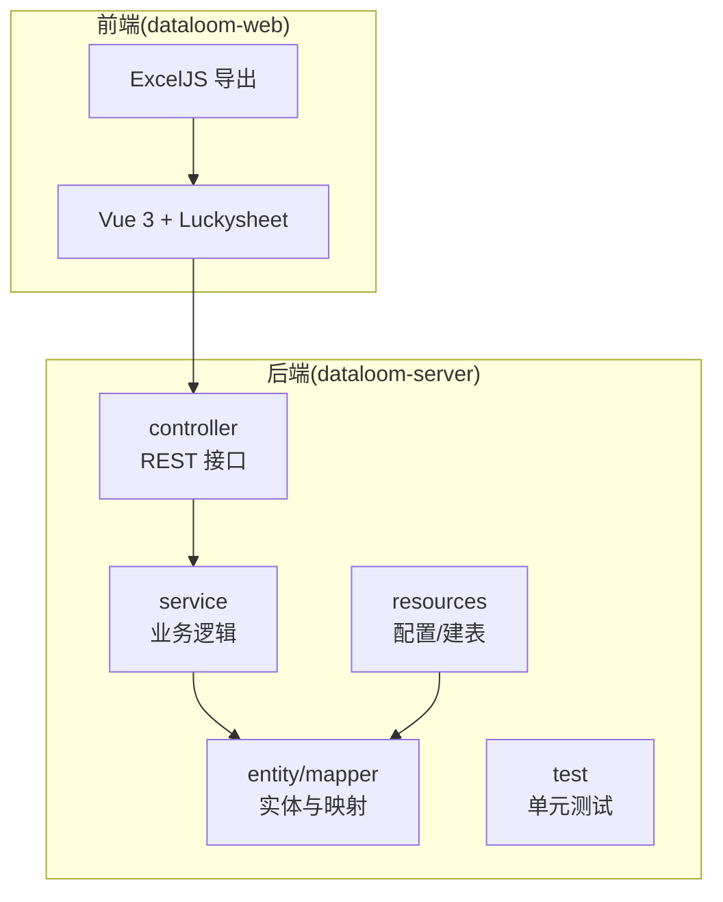
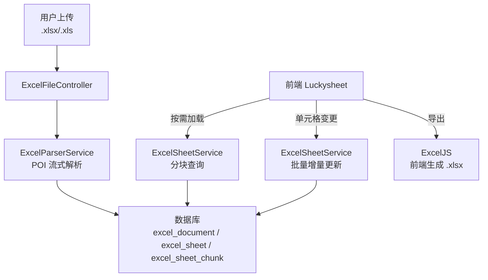
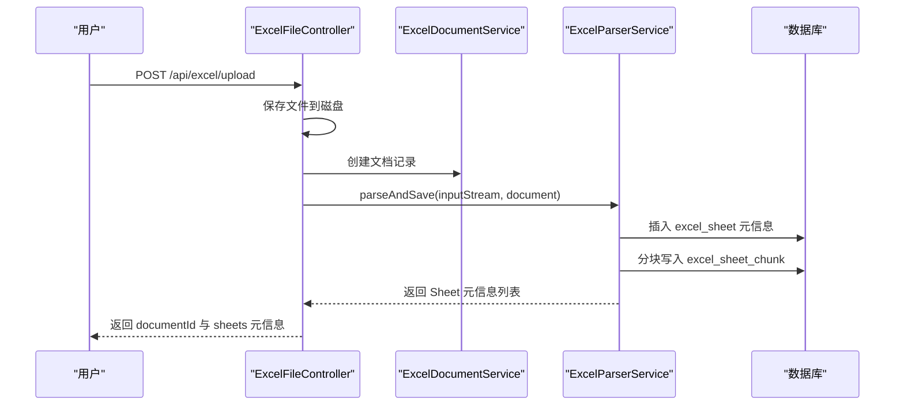
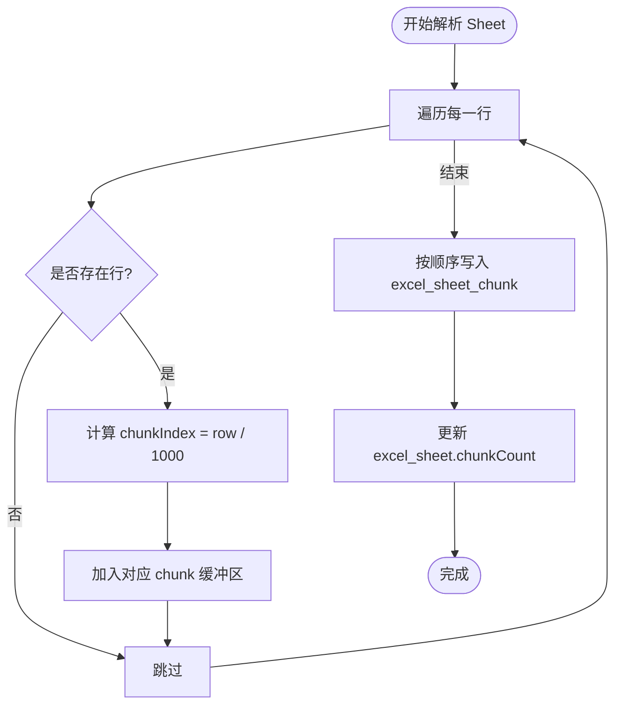
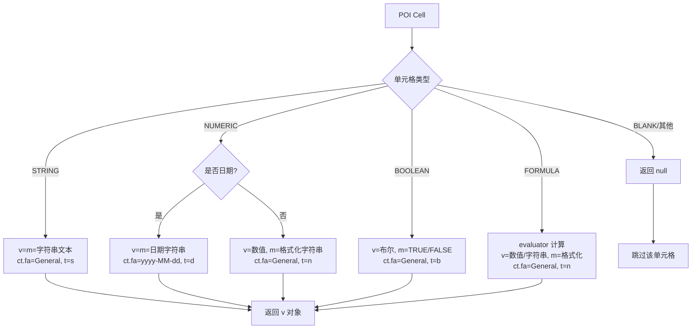
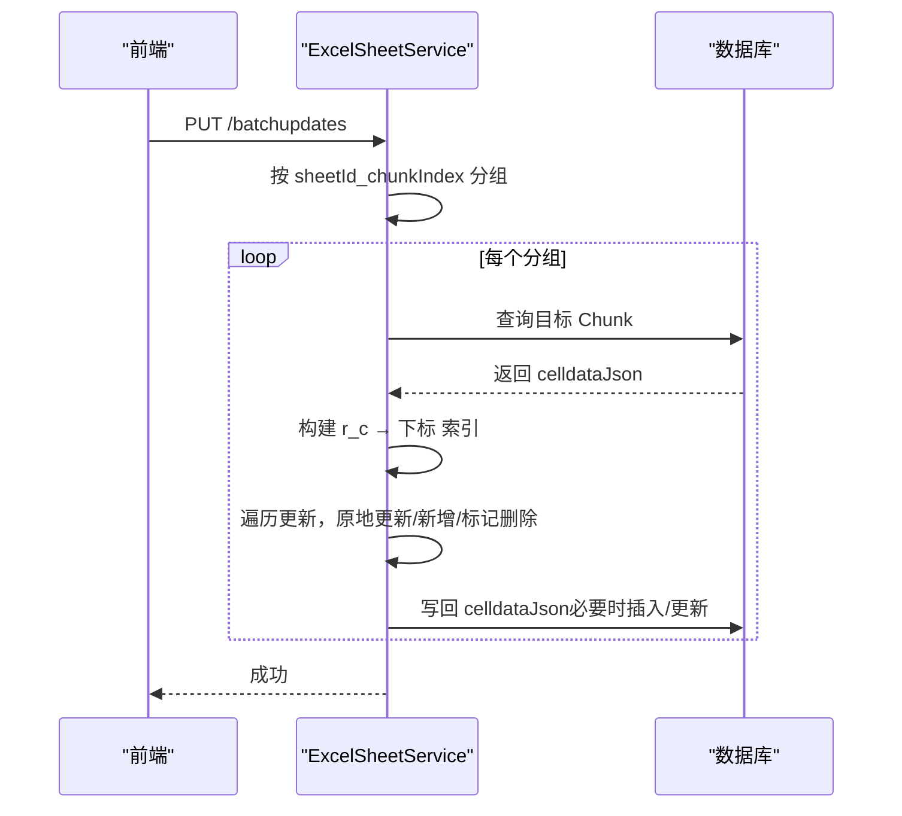
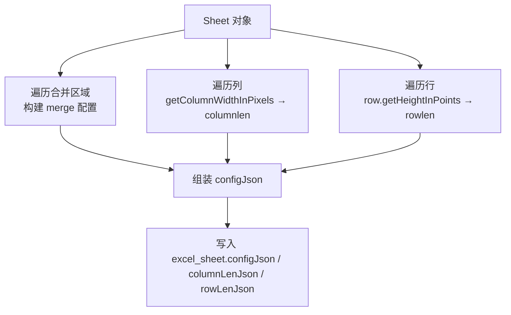
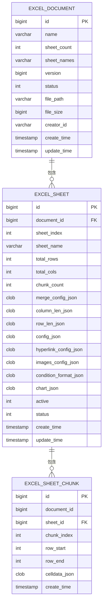
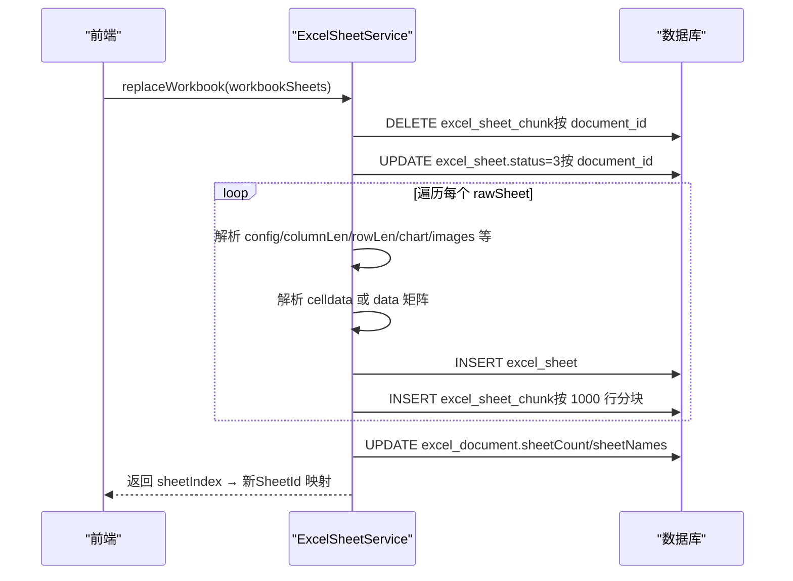
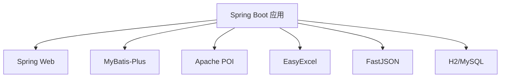

# Excel 文件处理

<cite>
**本文引用的文件**   
- [ExcelServiceApplication.java](file://dataloom-server/src/main/java/com/demo/excel/ExcelServiceApplication.java)
- [ExcelFileController.java](file://dataloom-server/src/main/java/com/demo/excel/controller/ExcelFileController.java)
- [ExcelParserService.java](file://dataloom-server/src/main/java/com/demo/excel/service/ExcelParserService.java)
- [ExcelDocumentService.java](file://dataloom-server/src/main/java/com/demo/excel/service/ExcelDocumentService.java)
- [ExcelSheetService.java](file://dataloom-server/src/main/java/com/demo/excel/service/ExcelSheetService.java)
- [ExcelDocument.java](file://dataloom-server/src/main/java/com/demo/excel/entity/ExcelDocument.java)
- [ExcelSheet.java](file://dataloom-server/src/main/java/com/demo/excel/entity/ExcelSheet.java)
- [ExcelSheetChunk.java](file://dataloom-server/src/main/java/com/demo/excel/entity/ExcelSheetChunk.java)
- [ExcelDocumentMapper.java](file://dataloom-server/src/main/java/com/demo/excel/mapper/ExcelDocumentMapper.java)
- [ExcelSheetMapper.java](file://dataloom-server/src/main/java/com/demo/excel/mapper/ExcelSheetMapper.java)
- [ExcelSheetChunkMapper.java](file://dataloom-server/src/main/java/com/demo/excel/mapper/ExcelSheetChunkMapper.java)
- [application.yml](file://dataloom-server/src/main/resources/application.yml)
- [schema.sql](file://dataloom-server/src/main/resources/schema.sql)
- [pom.xml](file://dataloom-server/pom.xml)
- [ExcelSheetServiceTest.java](file://dataloom-server/src/test/java/com/demo/excel/service/ExcelSheetServiceTest.java)
- [README.md](file://README.md)
- [从零构建在线Excel.md](file://从零构建在线Excel.md)
</cite>

## 目录
1. [简介](#简介)
2. [项目结构](#项目结构)
3. [核心组件](#核心组件)
4. [架构总览](#架构总览)
5. [详细组件分析](#详细组件分析)
6. [依赖分析](#依赖分析)
7. [性能考量](#性能考量)
8. [故障排查指南](#故障排查指南)
9. [结论](#结论)
10. [附录](#附录)

## 简介
本项目是一个从零构建的在线 Excel 协作编辑系统，后端基于 Spring Boot + MyBatis-Plus，前端基于 Vue 3 + Luckysheet + ExcelJS。核心目标是支持上传、解析、在线编辑与导出，尤其针对“十万级数据”场景，采用 Apache POI 流式解析与“分块存储”策略，将每个 Sheet 的单元格数据按 1000 行为单位切分为多个数据块，显著降低单次读写与网络传输压力。

系统的关键设计点包括：
- 使用 Apache POI 流式解析，避免将整张表加载至内存
- 分块存储策略：每块约 1000 行，单元格数据以 JSON 数组形式存储，便于按需加载与增量更新
- 单元格数据序列化与反序列化：兼容 Luckysheet 的 celldata 格式，包含值、显示文本、数字/日期/布尔/公式等类型及样式信息
- 增量更新机制：按块分组聚合更新，仅写入变更单元格，最小化数据库写入
- 多工作表处理、列宽/行高计算、合并单元格配置等元信息的持久化
- 前端导出：ExcelJS 直接从编辑器状态生成 .xlsx，保证样式零丢失

## 项目结构
后端采用标准 Spring Boot 结构，主要模块如下：
- controller：REST 接口层，负责文件上传、文档与数据读写
- service：业务逻辑层，包含解析、分块存储、增量更新等
- entity/mapper：实体与 MyBatis-Plus Mapper，对应三张核心表
- resources：应用配置与建表脚本
- test：单元测试，验证分块与替换流程

**章节来源**
- [ExcelServiceApplication.java:1-21](file://dataloom-server/src/main/java/com/demo/excel/ExcelServiceApplication.java#L1-L21)
- [pom.xml:1-127](file://dataloom-server/pom.xml#L1-L127)
- [application.yml:1-51](file://dataloom-server/src/main/resources/application.yml#L1-L51)
- [schema.sql:1-124](file://dataloom-server/src/main/resources/schema.sql#L1-L124)

## 核心组件
- ExcelFileController：提供文件上传接口，保存原始文件，调用解析服务进行流式解析与分块写库，并返回文档与 Sheet 元信息
- ExcelParserService：核心解析引擎，使用 Apache POI 流式读取，按 1000 行分块构建 celldata JSON，写入 excel_sheet_chunk
- ExcelSheetService：提供 Sheet 元信息查询、分块查询、批量增量更新、全量替换工作簿等能力
- ExcelDocumentService：文档主表 CRUD，负责文档元数据与 Sheet 元信息的更新
- 实体与映射：ExcelDocument、ExcelSheet、ExcelSheetChunk 三张表，分别存储文档元数据、Sheet 元信息与分块数据

**章节来源**
- [ExcelFileController.java:57-116](file://dataloom-server/src/main/java/com/demo/excel/controller/ExcelFileController.java#L57-L116)
- [ExcelParserService.java:66-87](file://dataloom-server/src/main/java/com/demo/excel/service/ExcelParserService.java#L66-L87)
- [ExcelSheetService.java:51-91](file://dataloom-server/src/main/java/com/demo/excel/service/ExcelSheetService.java#L51-L91)
- [ExcelDocumentService.java:31-53](file://dataloom-server/src/main/java/com/demo/excel/service/ExcelDocumentService.java#L31-L53)
- [ExcelDocument.java:15-55](file://dataloom-server/src/main/java/com/demo/excel/entity/ExcelDocument.java#L15-L55)
- [ExcelSheet.java:14-77](file://dataloom-server/src/main/java/com/demo/excel/entity/ExcelSheet.java#L14-L77)
- [ExcelSheetChunk.java:18-53](file://dataloom-server/src/main/java/com/demo/excel/entity/ExcelSheetChunk.java#L18-L53)

## 架构总览
系统围绕“上传 → 解析 → 分块存储 → 懒加载 → 增量更新 → 前端导出”的主流程运转。后端通过 Apache POI 流式解析 Excel，将单元格数据按 1000 行分块写入数据库；前端按需加载数据块，编辑时仅提交变更单元格，后端按块定位并局部更新。

**图表来源**
- [ExcelFileController.java:70-116](file://dataloom-server/src/main/java/com/demo/excel/controller/ExcelFileController.java#L70-L116)
- [ExcelParserService.java:66-87](file://dataloom-server/src/main/java/com/demo/excel/service/ExcelParserService.java#L66-L87)
- [ExcelSheetService.java:103-212](file://dataloom-server/src/main/java/com/demo/excel/service/ExcelSheetService.java#L103-L212)

**章节来源**
- [README.md:88-131](file://README.md#L88-L131)
- [从零构建在线Excel.md:52-112](file://从零构建在线Excel.md#L52-L112)

## 详细组件分析

### 上传与解析流程（Controller → Parser）
- 上传接口接收文件，保存到磁盘，创建文档记录，随后调用解析服务进行流式解析与分块写库
- 解析服务遍历每个 Sheet，统计行列数，提取合并单元格、列宽、行高等配置，写入 excel_sheet
- 按 1000 行为块，逐块构建 celldata JSON，写入 excel_sheet_chunk，并更新 chunkCount

**图表来源**
- [ExcelFileController.java:70-116](file://dataloom-server/src/main/java/com/demo/excel/controller/ExcelFileController.java#L70-L116)
- [ExcelParserService.java:66-87](file://dataloom-server/src/main/java/com/demo/excel/service/ExcelParserService.java#L66-L87)
- [ExcelDocumentService.java:31-37](file://dataloom-server/src/main/java/com/demo/excel/service/ExcelDocumentService.java#L31-L37)

**章节来源**
- [ExcelFileController.java:70-116](file://dataloom-server/src/main/java/com/demo/excel/controller/ExcelFileController.java#L70-L116)
- [ExcelParserService.java:66-87](file://dataloom-server/src/main/java/com/demo/excel/service/ExcelParserService.java#L66-L87)
- [ExcelDocumentService.java:31-53](file://dataloom-server/src/main/java/com/demo/excel/service/ExcelDocumentService.java#L31-L53)

### 分块存储策略与 CHUNK_SIZE 设计
- 每块 1000 行，chunkIndex 由行号整除确定，保证与批量更新时按 r / CHUNK_SIZE 的定位逻辑一致
- celldata JSON 采用 [{"r": 行,"c": 列,"v": {...}}, ...] 格式，与 Luckysheet 完全兼容
- 合并单元格、列宽、行高等小型配置直接存入 excel_sheet，不参与分块

**图表来源**
- [ExcelParserService.java:142-200](file://dataloom-server/src/main/java/com/demo/excel/service/ExcelParserService.java#L142-L200)

**章节来源**
- [ExcelParserService.java:43-44](file://dataloom-server/src/main/java/com/demo/excel/service/ExcelParserService.java#L43-L44)
- [ExcelParserService.java:142-200](file://dataloom-server/src/main/java/com/demo/excel/service/ExcelParserService.java#L142-L200)

### 单元格数据序列化与反序列化
- buildCellValue 将 POI 单元格类型转换为 Luckysheet v 对象，包含值 v、显示文本 m、以及样式 ct（包含数字格式 fa 与类型 t）
- 支持字符串、数值（日期/普通）、布尔、公式（含计算失败降级为字符串）
- 反序列化在批量更新时进行：将传入的 v 对象转为 JSON 字符串，写入 celldataJson

**图表来源**
- [ExcelParserService.java:205-281](file://dataloom-server/src/main/java/com/demo/excel/service/ExcelParserService.java#L205-L281)

**章节来源**
- [ExcelParserService.java:205-281](file://dataloom-server/src/main/java/com/demo/excel/service/ExcelParserService.java#L205-L281)

### 增量更新机制与脏数据追踪
- 批量更新按 (sheetId_chunkIndex) 分组，减少数据库 I/O
- 通过 r / CHUNK_SIZE 计算目标块，若块不存在则新建
- 为每个块建立 “r_c → 数组下标” 的索引，实现 O(1) 查找与原地更新
- 删除操作采用延迟删除策略：先收集待删下标，最后统一倒序删除，避免索引错位

**图表来源**
- [ExcelSheetService.java:103-212](file://dataloom-server/src/main/java/com/demo/excel/service/ExcelSheetService.java#L103-L212)

**章节来源**
- [ExcelSheetService.java:103-212](file://dataloom-server/src/main/java/com/demo/excel/service/ExcelSheetService.java#L103-L212)

### 多工作表处理、列宽/行高与合并单元格
- 多工作表：遍历所有 Sheet，逐个保存元信息与分块
- 列宽：按像素宽度计算，最小不低于 72
- 行高：从点值转换为像素并四舍五入
- 合并单元格：以首行首列坐标为键，保存 rs（行跨度）、cs（列跨度）

**图表来源**
- [ExcelParserService.java:299-340](file://dataloom-server/src/main/java/com/demo/excel/service/ExcelParserService.java#L299-L340)

**章节来源**
- [ExcelParserService.java:299-340](file://dataloom-server/src/main/java/com/demo/excel/service/ExcelParserService.java#L299-L340)

### 数据模型与数据库设计
- excel_document：文档元数据（名称、文件路径、大小、Sheet 数量与名称列表）
- excel_sheet：Sheet 元信息（总行/列数、合并配置、列宽/行高、配置 JSON、活跃状态）
- excel_sheet_chunk：分块数据（documentId、sheetId、chunkIndex、rowStart/rowEnd、celldataJson）

**图表来源**
- [schema.sql:8-66](file://dataloom-server/src/main/resources/schema.sql#L8-L66)
- [ExcelDocument.java:15-55](file://dataloom-server/src/main/java/com/demo/excel/entity/ExcelDocument.java#L15-L55)
- [ExcelSheet.java:14-77](file://dataloom-server/src/main/java/com/demo/excel/entity/ExcelSheet.java#L14-L77)
- [ExcelSheetChunk.java:18-53](file://dataloom-server/src/main/java/com/demo/excel/entity/ExcelSheetChunk.java#L18-L53)

**章节来源**
- [schema.sql:8-66](file://dataloom-server/src/main/resources/schema.sql#L8-L66)
- [ExcelDocument.java:15-55](file://dataloom-server/src/main/java/com/demo/excel/entity/ExcelDocument.java#L15-L55)
- [ExcelSheet.java:14-77](file://dataloom-server/src/main/java/com/demo/excel/entity/ExcelSheet.java#L14-L77)
- [ExcelSheetChunk.java:18-53](file://dataloom-server/src/main/java/com/demo/excel/entity/ExcelSheetChunk.java#L18-L53)

### 全量替换工作簿流程
- 物理删除旧块 → 软删除旧 Sheet → 逐 Sheet 插入新记录 + 保存 celldata → 更新文档 sheet 元信息
- 支持从 data 矩阵或 celldata 两种输入形态转换为标准 celldata

**图表来源**
- [ExcelSheetService.java:221-316](file://dataloom-server/src/main/java/com/demo/excel/service/ExcelSheetService.java#L221-L316)

**章节来源**
- [ExcelSheetService.java:221-316](file://dataloom-server/src/main/java/com/demo/excel/service/ExcelSheetService.java#L221-L316)

## 依赖分析
- Spring Boot Web：提供 REST 接口与 Web 容器
- MyBatis-Plus：简化数据库操作与逻辑删除配置
- H2（Demo）/ MySQL（生产可替换）：数据库存储
- Apache POI：Excel 解析（WorkbookFactory 流式读取）
- EasyExcel：Excel 导出（后端补充）
- FastJSON：JSON 序列化与反序列化
- Lombok：简化实体类代码

**图表来源**
- [pom.xml:32-107](file://dataloom-server/pom.xml#L32-L107)

**章节来源**
- [pom.xml:32-107](file://dataloom-server/pom.xml#L32-L107)
- [application.yml:4-41](file://dataloom-server/src/main/resources/application.yml#L4-L41)

## 性能考量
- 流式解析：使用 WorkbookFactory 打开输入流，逐行读取，避免整表内存占用
- 分块存储：每块约 1000 行，celldataJson 控制在数百 KB，按需加载，显著降低网络与内存压力
- 增量更新：按块分组聚合，O(1) 索引定位，延迟删除避免频繁重建索引
- 懒加载：前端仅加载可见块，滚动时按需请求，打开大文件几乎无等待
- 导出优化：前端 ExcelJS 直接生成 .xlsx，零网络传输，样式零丢失
- 生产迁移：H2 → MySQL 仅需修改数据源配置，MyBatis-Plus 自动适配

**章节来源**
- [从零构建在线Excel.md:113-165](file://从零构建在线Excel.md#L113-L165)
- [从零构建在线Excel.md:309-342](file://从零构建在线Excel.md#L309-L342)
- [application.yml:8-41](file://dataloom-server/src/main/resources/application.yml#L8-L41)

## 故障排查指南
- 上传失败：检查文件大小限制、磁盘空间与路径权限
- 解析异常：关注 buildCellValue 中公式计算失败的降级逻辑与空单元格跳过
- 分块不一致：确认 chunkIndex 计算与批量更新 r / CHUNK_SIZE 保持一致
- 增量更新未生效：检查 “r_c → 下标” 索引构建与延迟删除顺序
- 导出样式丢失：确认前端使用 ExcelJS 导出，后端不参与样式重建
- 数据库迁移：H2 → MySQL 时注意索引与字符集设置

**章节来源**
- [ExcelFileController.java:112-116](file://dataloom-server/src/main/java/com/demo/excel/controller/ExcelFileController.java#L112-L116)
- [ExcelParserService.java:260-277](file://dataloom-server/src/main/java/com/demo/excel/service/ExcelParserService.java#L260-L277)
- [ExcelSheetService.java:146-195](file://dataloom-server/src/main/java/com/demo/excel/service/ExcelSheetService.java#L146-L195)
- [ExcelSheetServiceTest.java:44-107](file://dataloom-server/src/test/java/com/demo/excel/service/ExcelSheetServiceTest.java#L44-L107)

## 结论
本系统通过“流式解析 + 分块存储 + 增量更新”的组合拳，有效解决了 Excel 大数据量场景下的性能与可扩展性问题。结合 Luckysheet 的在线编辑能力与前端 ExcelJS 导出，实现了从上传、解析、编辑到导出的完整闭环。未来可在实时协作、缓存优化、并发压测等方面进一步增强，逐步从“能用”走向“好用”。

## 附录
- API 参考与端到端流程见项目 README 与“从零构建在线Excel”文档
- 测试用例验证了全量替换工作簿与分块写入行为

**章节来源**
- [README.md:190-216](file://README.md#L190-L216)
- [从零构建在线Excel.md:166-242](file://从零构建在线Excel.md#L166-L242)
- [ExcelSheetServiceTest.java:44-107](file://dataloom-server/src/test/java/com/demo/excel/service/ExcelSheetServiceTest.java#L44-L107)