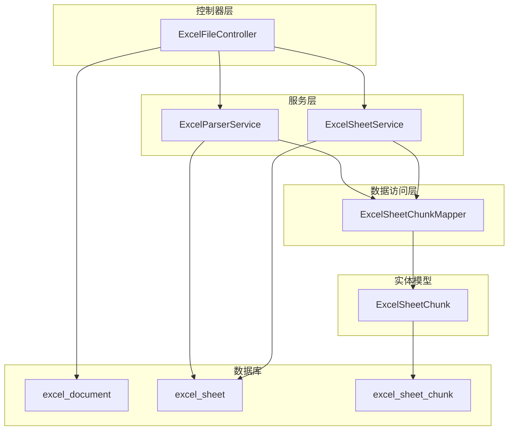
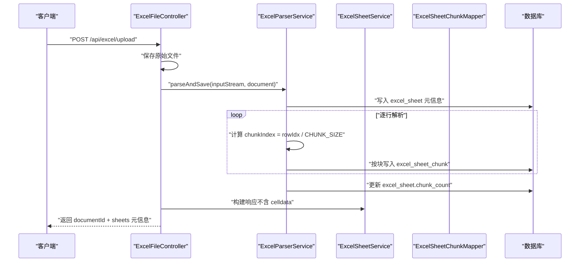
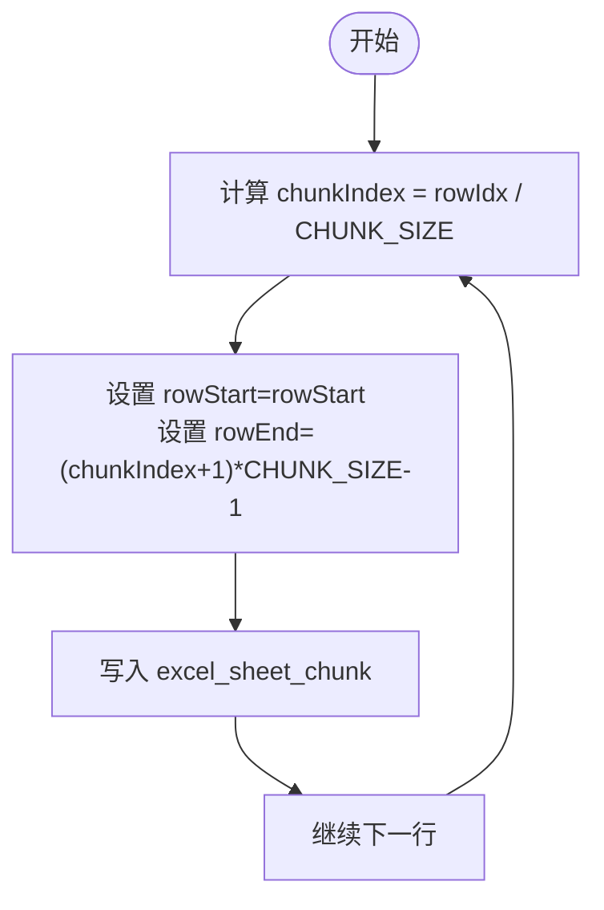
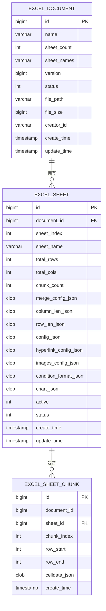
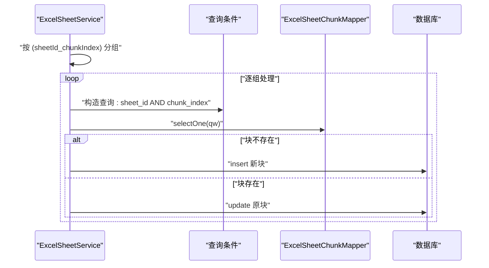
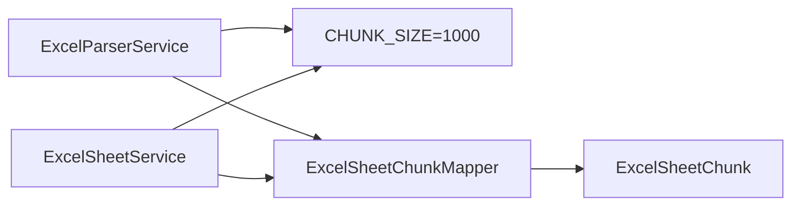

# 分块存储策略

<cite>
**本文引用的文件**
- [ExcelSheetChunk.java](file://dataloom-server/src/main/java/com/demo/excel/entity/ExcelSheetChunk.java)
- [ExcelParserService.java](file://dataloom-server/src/main/java/com/demo/excel/service/ExcelParserService.java)
- [ExcelSheetService.java](file://dataloom-server/src/main/java/com/demo/excel/service/ExcelSheetService.java)
- [ExcelSheetChunkMapper.java](file://dataloom-server/src/main/java/com/demo/excel/mapper/ExcelSheetChunkMapper.java)
- [ExcelFileController.java](file://dataloom-server/src/main/java/com/demo/excel/controller/ExcelFileController.java)
- [schema.sql](file://dataloom-server/src/main/resources/schema.sql)
- [ExcelTest.java](file://dataloom-server/src/main/java/com/demo/excel/ExcelTest.java)
- [ExcelSheetServiceTest.java](file://dataloom-server/src/test/java/com/demo/excel/service/ExcelSheetServiceTest.java)
</cite>

## 目录
1. [简介](#简介)
2. [项目结构](#项目结构)
3. [核心组件](#核心组件)
4. [架构概览](#架构概览)
5. [详细组件分析](#详细组件分析)
6. [依赖分析](#依赖分析)
7. [性能考量](#性能考量)
8. [故障排查指南](#故障排查指南)
9. [结论](#结论)
10. [附录](#附录)

## 简介
本文件系统性阐述“分块存储策略”的设计原理、实现细节与性能优化要点。核心思想是以固定行数（默认 1000 行/块）将 Sheet 的单元格数据拆分为多个数据块，分别持久化至 excel_sheet_chunk 表，从而实现：
- 降低单次读写压力与网络传输开销
- 支持按需加载与增量更新
- 提升大规模数据场景下的可用性与稳定性

## 项目结构
围绕分块存储的关键模块如下：
- 实体与映射：ExcelSheetChunk 实体、ExcelSheetChunkMapper 接口
- 服务层：ExcelParserService（解析与分块写入）、ExcelSheetService（查询、批量更新、重建）
- 控制器：ExcelFileController（上传入口）
- 数据库：schema.sql 定义三张核心表（excel_document、excel_sheet、excel_sheet_chunk）

图表来源
- [ExcelFileController.java:1-141](file://dataloom-server/src/main/java/com/demo/excel/controller/ExcelFileController.java#L1-L141)
- [ExcelParserService.java:1-348](file://dataloom-server/src/main/java/com/demo/excel/service/ExcelParserService.java#L1-L348)
- [ExcelSheetService.java:1-443](file://dataloom-server/src/main/java/com/demo/excel/service/ExcelSheetService.java#L1-L443)
- [ExcelSheetChunkMapper.java:1-13](file://dataloom-server/src/main/java/com/demo/excel/mapper/ExcelSheetChunkMapper.java#L1-L13)
- [ExcelSheetChunk.java:1-53](file://dataloom-server/src/main/java/com/demo/excel/entity/ExcelSheetChunk.java#L1-L53)
- [schema.sql:1-124](file://dataloom-server/src/main/resources/schema.sql#L1-L124)

章节来源
- [ExcelFileController.java:1-141](file://dataloom-server/src/main/java/com/demo/excel/controller/ExcelFileController.java#L1-L141)
- [ExcelParserService.java:1-348](file://dataloom-server/src/main/java/com/demo/excel/service/ExcelParserService.java#L1-L348)
- [ExcelSheetService.java:1-443](file://dataloom-server/src/main/java/com/demo/excel/service/ExcelSheetService.java#L1-L443)
- [ExcelSheetChunkMapper.java:1-13](file://dataloom-server/src/main/java/com/demo/excel/mapper/ExcelSheetChunkMapper.java#L1-L13)
- [ExcelSheetChunk.java:1-53](file://dataloom-server/src/main/java/com/demo/excel/entity/ExcelSheetChunk.java#L1-L53)
- [schema.sql:1-124](file://dataloom-server/src/main/resources/schema.sql#L1-L124)

## 核心组件
- 分块实体 ExcelSheetChunk：承载单块单元格数据及其边界信息（chunkIndex、rowStart、rowEnd），并包含 celldataJson 字段。
- 解析服务 ExcelParserService：负责流式解析 Excel、按 1000 行/块进行分块、批量写入数据库，并维护 chunkCount。
- 查询与更新服务 ExcelSheetService：提供分块查询、批量增量更新、全量重建等工作簿能力；批量更新中采用按块分组策略以减少 I/O。
- 数据访问层 ExcelSheetChunkMapper：基于 MyBatis-Plus 的基础 CRUD 接口。
- 控制器 ExcelFileController：对外提供上传接口，串联文件保存、解析与元信息回传。

章节来源
- [ExcelSheetChunk.java:1-53](file://dataloom-server/src/main/java/com/demo/excel/entity/ExcelSheetChunk.java#L1-L53)
- [ExcelParserService.java:1-348](file://dataloom-server/src/main/java/com/demo/excel/service/ExcelParserService.java#L1-L348)
- [ExcelSheetService.java:1-443](file://dataloom-server/src/main/java/com/demo/excel/service/ExcelSheetService.java#L1-L443)
- [ExcelSheetChunkMapper.java:1-13](file://dataloom-server/src/main/java/com/demo/excel/mapper/ExcelSheetChunkMapper.java#L1-L13)
- [ExcelFileController.java:1-141](file://dataloom-server/src/main/java/com/demo/excel/controller/ExcelFileController.java#L1-L141)

## 架构概览
分块存储贯穿“上传—解析—持久化—查询—更新”的完整链路，核心在于：
- 解析阶段：按行号计算 chunkIndex = rowIdx / CHUNK_SIZE，确保与后续定位逻辑一致
- 持久化阶段：为每块设置 rowStart = chunkIndex * CHUNK_SIZE、rowEnd = (chunkIndex+1)*CHUNK_SIZE - 1
- 查询阶段：按 sheet_id + chunk_index 精确定位目标块
- 更新阶段：按 (sheetId_chunkIndex) 分组，逐块读写，避免重复 I/O

图表来源
- [ExcelFileController.java:56-116](file://dataloom-server/src/main/java/com/demo/excel/controller/ExcelFileController.java#L56-L116)
- [ExcelParserService.java:66-87](file://dataloom-server/src/main/java/com/demo/excel/service/ExcelParserService.java#L66-L87)
- [ExcelParserService.java:142-200](file://dataloom-server/src/main/java/com/demo/excel/service/ExcelParserService.java#L142-L200)

## 详细组件分析

### 分块索引与边界计算
- 索引计算：chunkIndex = rowIdx / CHUNK_SIZE（整除取整），确保行号与块归属一一对应
- 边界确定：rowStart = chunkIndex * CHUNK_SIZE；rowEnd = (chunkIndex + 1) * CHUNK_SIZE - 1
- 一致性保证：解析写入与批量更新均采用相同公式，避免空行导致的边界偏移

图表来源
- [ExcelParserService.java:135-200](file://dataloom-server/src/main/java/com/demo/excel/service/ExcelParserService.java#L135-L200)
- [ExcelSheetService.java:318-346](file://dataloom-server/src/main/java/com/demo/excel/service/ExcelSheetService.java#L318-L346)

章节来源
- [ExcelParserService.java:135-200](file://dataloom-server/src/main/java/com/demo/excel/service/ExcelParserService.java#L135-L200)
- [ExcelSheetService.java:318-346](file://dataloom-server/src/main/java/com/demo/excel/service/ExcelSheetService.java#L318-L346)

### 数据结构设计
- ExcelSheetChunk 字段
  - chunkIndex：块序号（0 起始）
  - rowStart / rowEnd：块内包含的起始/结束行号（闭区间）
  - celldataJson：Luckysheet 兼容格式的单元格数组
  - documentId/sheetId：外键与冗余字段，便于按文档删除
- 关系约束
  - excel_sheet 与 excel_sheet_chunk：一对多
  - excel_document 与 excel_sheet：一对多
- 索引设计
  - excel_sheet_chunk 上建立 sheet_id + chunk_index 复合索引，支撑按块快速定位

图表来源
- [schema.sql:8-124](file://dataloom-server/src/main/resources/schema.sql#L8-L124)
- [ExcelSheetChunk.java:18-52](file://dataloom-server/src/main/java/com/demo/excel/entity/ExcelSheetChunk.java#L18-L52)

章节来源
- [ExcelSheetChunk.java:18-52](file://dataloom-server/src/main/java/com/demo/excel/entity/ExcelSheetChunk.java#L18-L52)
- [schema.sql:8-124](file://dataloom-server/src/main/resources/schema.sql#L8-L124)

### 分块写入的批量处理策略
- 解析阶段
  - 逐行读取，按 chunkIndex 分组收集单元格
  - 逐块写入数据库，同时更新 chunkCount
- 批量更新阶段
  - 将待更新列表按 (sheetId_chunkIndex) 分组，每组仅读写一次对应块
  - 通过“r_c”键到数组下标的索引，将查找复杂度从 O(n) 降至 O(1)
  - 延迟删除：先标记待删下标，最后统一倒序清理，避免索引错位

图表来源
- [ExcelSheetService.java:103-212](file://dataloom-server/src/main/java/com/demo/excel/service/ExcelSheetService.java#L103-L212)

章节来源
- [ExcelSheetService.java:103-212](file://dataloom-server/src/main/java/com/demo/excel/service/ExcelSheetService.java#L103-L212)

### 与后续数据读取的对应关系
- 读取路径
  - 列表：按 sheet_id + chunk_index 升序返回所有块
  - 精确定位：根据目标行 r 计算 chunkIndex = r / CHUNK_SIZE，直接命中对应块
- 一致性保障
  - 解析与更新均采用同一公式，确保 chunkIndex 与 rowStart/rowEnd 的一致性

章节来源
- [ExcelSheetService.java:67-72](file://dataloom-server/src/main/java/com/demo/excel/service/ExcelSheetService.java#L67-L72)
- [ExcelParserService.java:153-155](file://dataloom-server/src/main/java/com/demo/excel/service/ExcelParserService.java#L153-L155)

### 全量重建与替换
- replaceWorkbook 流程
  - 删除旧块 → 软删除旧 Sheet → 逐 Sheet 插入新记录 + 保存 celldata → 更新文档 sheet 元信息
- 分块策略
  - 依据 celldata 的 r 字段计算 chunkIndex，若无 celldata 则从 data 矩阵转换而来
  - 若空数据，按 totalRows 计算最小块数

章节来源
- [ExcelSheetService.java:221-316](file://dataloom-server/src/main/java/com/demo/excel/service/ExcelSheetService.java#L221-L316)
- [ExcelSheetService.java:318-346](file://dataloom-server/src/main/java/com/demo/excel/service/ExcelSheetService.java#L318-L346)

## 依赖分析
- 组件耦合
  - ExcelParserService 与 ExcelSheetService 通过 CHUNK_SIZE 常量保持逻辑一致
  - ExcelSheetService 依赖 ExcelSheetChunkMapper 进行块级 CRUD
- 外部依赖
  - MyBatis-Plus 提供基础 CRUD 能力
  - Apache POI 用于流式解析 Excel
  - FastJSON 用于 JSON 序列化与解析

图表来源
- [ExcelParserService.java:43-44](file://dataloom-server/src/main/java/com/demo/excel/service/ExcelParserService.java#L43-L44)
- [ExcelSheetService.java:107](file://dataloom-server/src/main/java/com/demo/excel/service/ExcelSheetService.java#L107)

章节来源
- [ExcelParserService.java:43-44](file://dataloom-server/src/main/java/com/demo/excel/service/ExcelParserService.java#L43-L44)
- [ExcelSheetService.java:107](file://dataloom-server/src/main/java/com/demo/excel/service/ExcelSheetService.java#L107)

## 性能考量
- 分块大小选择
  - 默认 1000 行/块，单块 JSON 通常在数百 KB，适合大多数编辑场景
  - 建议结合数据密度与业务访问模式调整（见“调优指导”）
- I/O 优化
  - 解析阶段：按块缓冲，减少数据库往返
  - 批量更新阶段：按块分组，逐块事务写入，避免重复 I/O
- 索引与查询
  - excel_sheet_chunk 上的复合索引（sheet_id, chunk_index）提升定位效率
- 内存与序列化
  - celldataJson 采用 JSON 数组，便于增量更新与懒加载
  - 单次响应仅返回元信息，避免大体积 celldata 回传

章节来源
- [ExcelParserService.java:135-200](file://dataloom-server/src/main/java/com/demo/excel/service/ExcelParserService.java#L135-L200)
- [ExcelSheetService.java:103-212](file://dataloom-server/src/main/java/com/demo/excel/service/ExcelSheetService.java#L103-L212)
- [schema.sql:110-123](file://dataloom-server/src/main/resources/schema.sql#L110-L123)

## 故障排查指南
- 上传后 chunkCount 不正确
  - 检查解析阶段是否正确计算 chunkCount 并更新 excel_sheet
  - 参考：[ExcelParserService.java:192-197](file://dataloom-server/src/main/java/com/demo/excel/service/ExcelParserService.java#L192-L197)
- 批量更新未命中目标块
  - 确认更新时使用的 chunkIndex 计算与解析一致（r / CHUNK_SIZE）
  - 参考：[ExcelSheetService.java:112](file://dataloom-server/src/main/java/com/demo/excel/service/ExcelSheetService.java#L112)
- 单元格更新异常或丢失
  - 检查“r_c”索引构建与延迟删除顺序（倒序清理）
  - 参考：[ExcelSheetService.java:146-195](file://dataloom-server/src/main/java/com/demo/excel/service/ExcelSheetService.java#L146-L195)
- 全量重建后数据不完整
  - 确认 celldata 是否为空，必要时从 data 矩阵转换
  - 参考：[ExcelSheetService.java:348-354](file://dataloom-server/src/main/java/com/demo/excel/service/ExcelSheetService.java#L348-L354)

章节来源
- [ExcelParserService.java:192-197](file://dataloom-server/src/main/java/com/demo/excel/service/ExcelParserService.java#L192-L197)
- [ExcelSheetService.java:112](file://dataloom-server/src/main/java/com/demo/excel/service/ExcelSheetService.java#L112)
- [ExcelSheetService.java:146-195](file://dataloom-server/src/main/java/com/demo/excel/service/ExcelSheetService.java#L146-L195)
- [ExcelSheetService.java:348-354](file://dataloom-server/src/main/java/com/demo/excel/service/ExcelSheetService.java#L348-L354)

## 结论
分块存储策略通过“固定行数分块 + 精确定位 + 懒加载”的组合拳，有效解决了大规模 Excel 数据的读写与传输瓶颈。其关键在于：
- 明确的索引与边界计算规则
- 一致的 chunkIndex 计算逻辑
- 高效的批量更新与索引优化
- 清晰的数据库结构与索引设计

## 附录

### 分块大小调优指导
- 评估维度
  - 数据密度：单元格密集度越高，单块 JSON 越大
  - 访问模式：频繁随机访问 vs 顺序滚动，影响缓存命中率
  - 网络与内存：单次响应体大小与前端渲染压力
- 调优建议
  - 低密度数据：可适当增大 CHUNK_SIZE（如 1500~2000）
  - 高密度数据：可适当减小 CHUNK_SIZE（如 500~800）
  - 严格控制单块大小在数百 KB 以内，避免前端渲染卡顿
- 最佳实践
  - 优先在解析阶段统一调整 CHUNK_SIZE 常量
  - 全量重建时同步应用新分块策略
  - 保留历史数据迁移路径，避免破坏现有 chunkIndex

章节来源
- [ExcelParserService.java:43-44](file://dataloom-server/src/main/java/com/demo/excel/service/ExcelParserService.java#L43-L44)
- [ExcelSheetService.java:330](file://dataloom-server/src/main/java/com/demo/excel/service/ExcelSheetService.java#L330)

### 大数据量处理最佳实践
- 解析与写入
  - 使用流式 POI，避免一次性加载
  - 按块缓冲，批量写入数据库
- 查询与展示
  - 仅返回元信息，按需请求具体块
  - 前端实现“滚动到哪加载到哪”
- 更新与一致性
  - 按块分组，逐块事务提交
  - 使用延迟删除与倒序清理，保证索引一致性
- 索引与监控
  - 确保复合索引生效
  - 监控单块大小与 chunkCount，及时发现异常

章节来源
- [ExcelParserService.java:135-200](file://dataloom-server/src/main/java/com/demo/excel/service/ExcelParserService.java#L135-L200)
- [ExcelSheetService.java:103-212](file://dataloom-server/src/main/java/com/demo/excel/service/ExcelSheetService.java#L103-L212)
- [schema.sql:110-123](file://dataloom-server/src/main/resources/schema.sql#L110-L123)