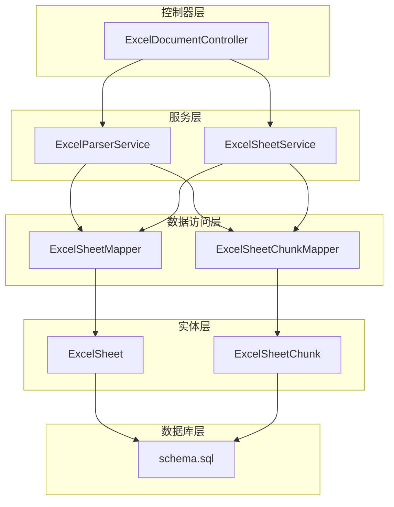
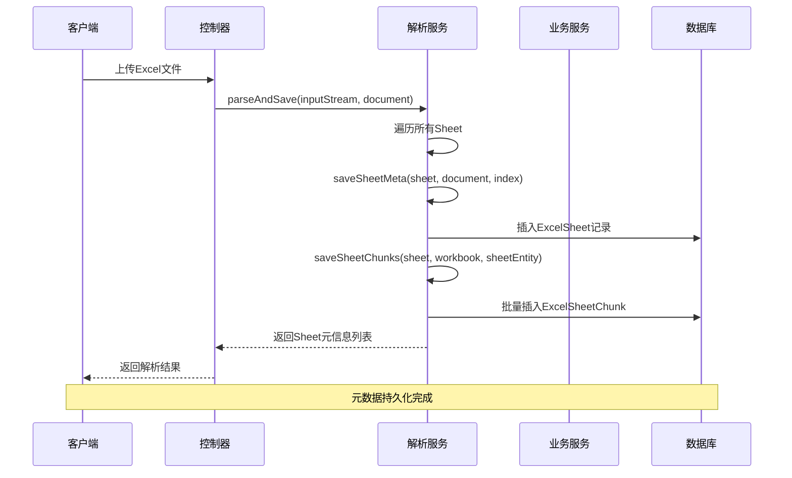
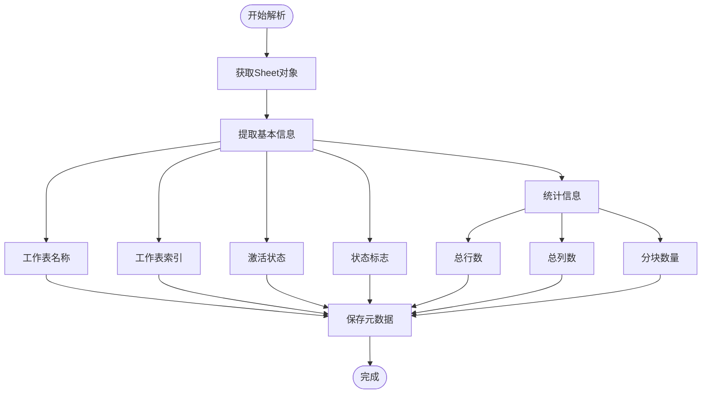
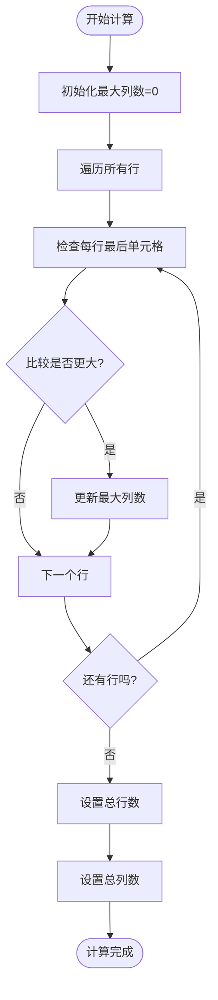
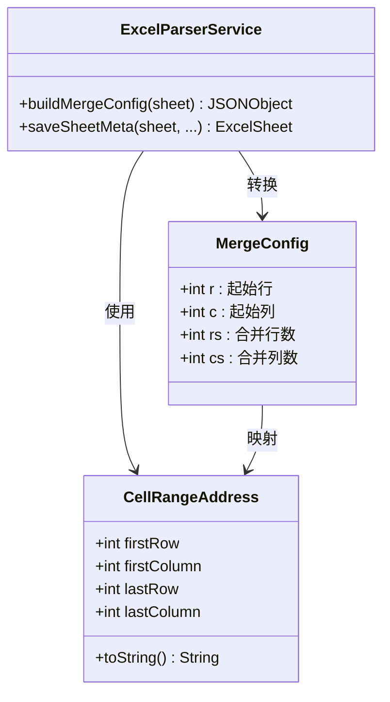
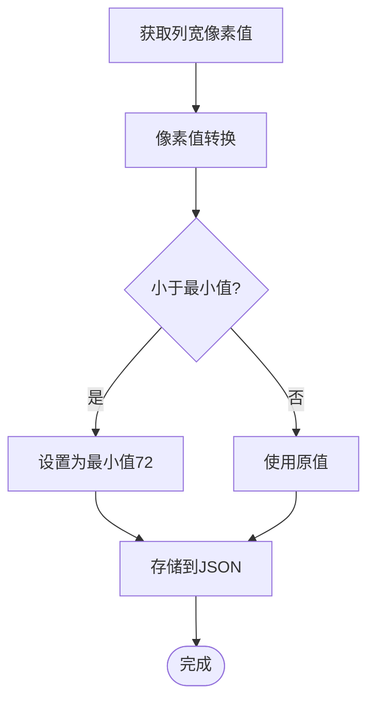
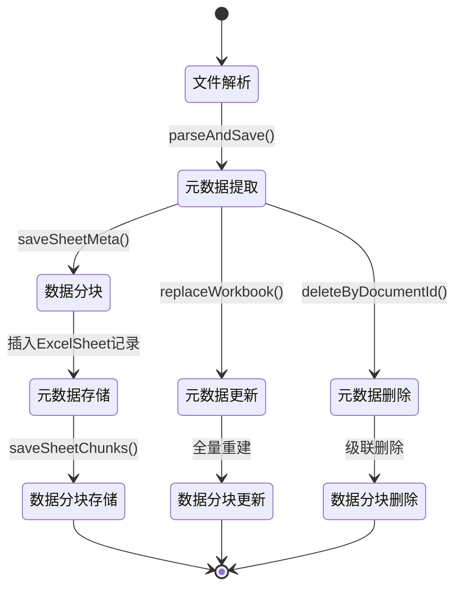
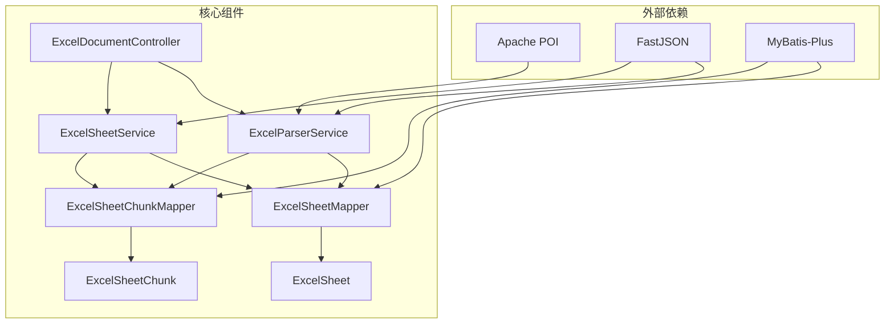
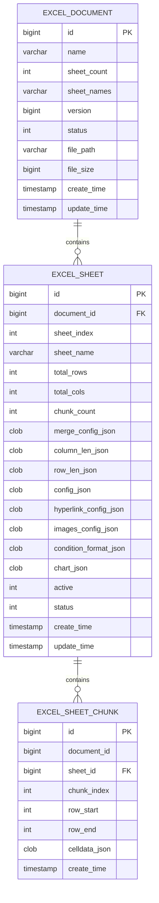

# 工作表元数据管理

<cite>
**本文档引用的文件**
- [ExcelSheet.java](file://dataloom-server/src/main/java/com/demo/excel/entity/ExcelSheet.java)
- [ExcelSheetChunk.java](file://dataloom-server/src/main/java/com/demo/excel/entity/ExcelSheetChunk.java)
- [ExcelParserService.java](file://dataloom-server/src/main/java/com/demo/excel/service/ExcelParserService.java)
- [ExcelSheetService.java](file://dataloom-server/src/main/java/com/demo/excel/service/ExcelSheetService.java)
- [ExcelSheetMapper.java](file://dataloom-server/src/main/java/com/demo/excel/mapper/ExcelSheetMapper.java)
- [ExcelSheetChunkMapper.java](file://dataloom-server/src/main/java/com/demo/excel/mapper/ExcelSheetChunkMapper.java)
- [ExcelDocumentController.java](file://dataloom-server/src/main/java/com/demo/excel/controller/ExcelDocumentController.java)
- [schema.sql](file://dataloom-server/src/main/resources/schema.sql)
- [ExcelSheetServiceTest.java](file://dataloom-server/src/test/java/com/demo/excel/service/ExcelSheetServiceTest.java)
</cite>

## 目录
1. [简介](#简介)
2. [项目结构](#项目结构)
3. [核心组件](#核心组件)
4. [架构概览](#架构概览)
5. [详细组件分析](#详细组件分析)
6. [依赖关系分析](#依赖关系分析)
7. [性能考虑](#性能考虑)
8. [故障排除指南](#故障排除指南)
9. [结论](#结论)

## 简介

工作表元数据管理系统是DataLoom项目的核心组成部分，负责管理和维护Excel工作表的各种元数据信息。该系统采用分层架构设计，通过Apache POI进行Excel文件解析，结合Luckysheet格式标准，实现了高效的工作表元数据提取、存储和管理功能。

系统主要功能包括：
- 工作表基本信息提取（名称、索引、激活状态、状态标志）
- 行列统计逻辑和最大行列数计算
- 合并单元格配置的收集和存储
- 列宽和行高的动态计算与转换
- 元数据的完整生命周期管理

## 项目结构

DataLoom项目采用标准的Spring Boot三层架构模式，围绕工作表元数据管理形成了完整的数据处理链路：



**图表来源**
- [ExcelDocumentController.java:1-296](file://dataloom-server/src/main/java/com/demo/excel/controller/ExcelDocumentController.java#L1-L296)
- [ExcelParserService.java:1-348](file://dataloom-server/src/main/java/com/demo/excel/service/ExcelParserService.java#L1-L348)
- [ExcelSheetService.java:1-443](file://dataloom-server/src/main/java/com/demo/excel/service/ExcelSheetService.java#L1-L443)

**章节来源**
- [ExcelDocumentController.java:1-296](file://dataloom-server/src/main/java/com/demo/excel/controller/ExcelDocumentController.java#L1-L296)
- [ExcelParserService.java:1-348](file://dataloom-server/src/main/java/com/demo/excel/service/ExcelParserService.java#L1-L348)
- [ExcelSheetService.java:1-443](file://dataloom-server/src/main/java/com/demo/excel/service/ExcelSheetService.java#L1-L443)

## 核心组件

### 实体模型设计

系统采用清晰的实体模型设计，将工作表元数据分为两大类：

#### ExcelSheet实体 - 工作表元信息
- **基本信息**：工作表ID、文档ID、索引、名称
- **统计信息**：总行数、总列数、分块数量
- **配置信息**：合并单元格配置、列宽配置、行高配置
- **状态管理**：活动状态、状态标志、时间戳

#### ExcelSheetChunk实体 - 数据分块
- **分块标识**：分块索引、起始行、结束行
- **数据内容**：单元格数据JSON数组
- **关联关系**：文档ID、工作表ID

**章节来源**
- [ExcelSheet.java:1-77](file://dataloom-server/src/main/java/com/demo/excel/entity/ExcelSheet.java#L1-L77)
- [ExcelSheetChunk.java:1-53](file://dataloom-server/src/main/java/com/demo/excel/entity/ExcelSheetChunk.java#L1-L53)

### 服务层架构

#### ExcelParserService - 解析引擎
负责Excel文件的流式解析和元数据提取，采用POI框架进行高性能处理。

#### ExcelSheetService - 业务服务
提供工作表元数据的查询、更新、替换等业务操作，支持全量保存和增量更新。

**章节来源**
- [ExcelParserService.java:25-87](file://dataloom-server/src/main/java/com/demo/excel/service/ExcelParserService.java#L25-L87)
- [ExcelSheetService.java:23-57](file://dataloom-server/src/main/java/com/demo/excel/service/ExcelSheetService.java#L23-L57)

## 架构概览

系统采用分层架构，实现了工作表元数据的完整生命周期管理：



**图表来源**
- [ExcelParserService.java:66-87](file://dataloom-server/src/main/java/com/demo/excel/service/ExcelParserService.java#L66-L87)
- [ExcelDocumentController.java:176-226](file://dataloom-server/src/main/java/com/demo/excel/controller/ExcelDocumentController.java#L176-L226)

## 详细组件分析

### 工作表元数据提取与存储

#### 基本信息提取
系统从Excel文件中提取以下基本信息：



**图表来源**
- [ExcelParserService.java:96-133](file://dataloom-server/src/main/java/com/demo/excel/service/ExcelParserService.java#L96-L133)

#### 行列统计逻辑
系统采用双重统计策略确保准确性：

1. **最大行数计算**：使用`getLastRowNum()`获取实际存在的最大行号
2. **最大列数计算**：遍历所有行，比较每行的`getLastCellNum()`，取最大值



**图表来源**
- [ExcelParserService.java:286-294](file://dataloom-server/src/main/java/com/demo/excel/service/ExcelParserService.java#L286-L294)

**章节来源**
- [ExcelParserService.java:104-108](file://dataloom-server/src/main/java/com/demo/excel/service/ExcelParserService.java#L104-L108)
- [ExcelParserService.java:286-294](file://dataloom-server/src/main/java/com/demo/excel/service/ExcelParserService.java#L286-L294)

### 合并单元格配置管理

#### CellRangeAddress处理机制
系统使用Apache POI的`CellRangeAddress`类处理合并单元格：



**图表来源**
- [ExcelParserService.java:299-311](file://dataloom-server/src/main/java/com/demo/excel/service/ExcelParserService.java#L299-L311)

#### JSON格式转换
合并单元格配置采用Luckysheet标准格式存储：

| 字段 | 类型 | 描述 |
|------|------|------|
| r | int | 合并区域起始行索引 |
| c | int | 合并区域起始列索引 |
| rs | int | 合并区域行数 |
| cs | int | 合并区域列数 |

**章节来源**
- [ExcelParserService.java:299-311](file://dataloom-server/src/main/java/com/demo/excel/service/ExcelParserService.java#L299-L311)

### 列宽配置的动态计算

#### 像素到点的转换逻辑
系统采用`getColumnWidthInPixels()`方法获取列宽，并进行必要的转换：



**图表来源**
- [ExcelParserService.java:316-327](file://dataloom-server/src/main/java/com/demo/excel/service/ExcelParserService.java#L316-L327)

#### 转换算法说明
- **输入**：POI返回的列宽（像素）
- **处理**：取最大值，确保最小宽度为72像素
- **输出**：Luckysheet兼容的列宽配置

**章节来源**
- [ExcelParserService.java:316-327](file://dataloom-server/src/main/java/com/demo/excel/service/ExcelParserService.java#L316-L327)

### 行高配置提取与存储

#### 行高提取策略
系统遍历所有行，提取非零高度的行高信息：

```mermaid
flowchart TD
Start([开始提取]) --> IterateRows[遍历所有行]
IterateRows --> CheckRow{行是否存在?}
CheckRow --> |否| NextRow[下一个行]
CheckRow --> |是| GetHeight[获取行高(点)]
GetHeight --> HeightCheck{高度>0?}
HeightCheck --> |否| NextRow
HeightCheck --> |是| Convert[转换为Luckysheet格式]
Convert --> Store[存储到JSON]
Store --> NextRow
NextRow --> MoreRows{还有行吗?}
MoreRows --> |是| IterateRows
MoreRows --> |否| End([完成])
```

**图表来源**
- [ExcelParserService.java:329-340](file://dataloom-server/src/main/java/com/demo/excel/service/ExcelParserService.java#L329-L340)

#### 转换逻辑
- **输入**：POI返回的行高（点）
- **处理**：转换为Luckysheet使用的格式，进行精度控制
- **输出**：行高配置JSON

**章节来源**
- [ExcelParserService.java:329-340](file://dataloom-server/src/main/java/com/demo/excel/service/ExcelParserService.java#L329-L340)

### 元数据管理生命周期

#### 完整生命周期流程



**图表来源**
- [ExcelParserService.java:66-87](file://dataloom-server/src/main/java/com/demo/excel/service/ExcelParserService.java#L66-L87)
- [ExcelSheetService.java:79-91](file://dataloom-server/src/main/java/com/demo/excel/service/ExcelSheetService.java#L79-L91)

#### 关键处理步骤

1. **解析阶段**：使用Apache POI流式解析Excel文件
2. **提取阶段**：提取工作表基本信息和配置数据
3. **存储阶段**：将元数据存储到ExcelSheet表
4. **分块阶段**：将单元格数据按固定大小分块存储
5. **更新阶段**：支持增量更新和全量替换
6. **清理阶段**：支持文档删除时的级联清理

**章节来源**
- [ExcelParserService.java:66-87](file://dataloom-server/src/main/java/com/demo/excel/service/ExcelParserService.java#L66-L87)
- [ExcelSheetService.java:79-91](file://dataloom-server/src/main/java/com/demo/excel/service/ExcelSheetService.java#L79-L91)

## 依赖关系分析

### 组件依赖图



**图表来源**
- [ExcelParserService.java:10-15](file://dataloom-server/src/main/java/com/demo/excel/service/ExcelParserService.java#L10-L15)
- [ExcelSheetService.java:3-11](file://dataloom-server/src/main/java/com/demo/excel/service/ExcelSheetService.java#L3-L11)

### 数据库设计

#### 表结构设计



**图表来源**
- [schema.sql:8-66](file://dataloom-server/src/main/resources/schema.sql#L8-L66)

**章节来源**
- [schema.sql:8-66](file://dataloom-server/src/main/resources/schema.sql#L8-L66)

## 性能考虑

### 分块存储策略
系统采用1000行分块策略，有效解决了大数据量存储问题：

- **内存优化**：避免单次加载大量数据到内存
- **网络传输**：减少HTTP响应体大小
- **按需加载**：支持分块级别的数据访问

### 缓存和索引优化
- **数据库索引**：为常用查询字段建立索引
- **分块索引**：按sheet_id和chunk_index建立复合索引
- **查询优化**：使用QueryWrapper进行精确查询

### 异常处理机制
系统实现了完善的异常处理策略：
- **单元格级别异常**：单个单元格解析失败不影响整体
- **事务保护**：关键操作使用事务确保数据一致性
- **降级策略**：公式计算失败时降级为字符串处理

## 故障排除指南

### 常见问题及解决方案

#### 合并单元格处理问题
**问题**：合并单元格配置不正确
**解决方案**：
1. 检查CellRangeAddress的有效性
2. 验证Luckysheet格式的正确性
3. 确认JSON序列化过程

#### 列宽计算异常
**问题**：列宽显示异常或为0
**解决方案**：
1. 检查getColumnWidthInPixels()返回值
2. 验证像素到点的转换逻辑
3. 确认最小宽度限制

#### 行高提取失败
**问题**：行高配置为空
**解决方案**：
1. 检查行高是否大于0
2. 验证行高转换逻辑
3. 确认数据完整性

**章节来源**
- [ExcelSheetServiceTest.java:44-107](file://dataloom-server/src/test/java/com/demo/excel/service/ExcelSheetServiceTest.java#L44-L107)

## 结论

工作表元数据管理系统通过精心设计的架构和实现，成功解决了Excel文件元数据管理的技术挑战。系统的主要优势包括：

1. **高性能设计**：采用分块存储和流式解析，有效处理大规模数据
2. **完整功能**：覆盖工作表元数据的全生命周期管理
3. **标准化格式**：采用Luckysheet标准，便于前后端协作
4. **健壮性保障**：完善的异常处理和事务保护机制

该系统为DataLoom项目提供了坚实的基础，支持后续的功能扩展和性能优化。通过合理的设计决策，系统在保证功能完整性的同时，也兼顾了性能和可维护性。