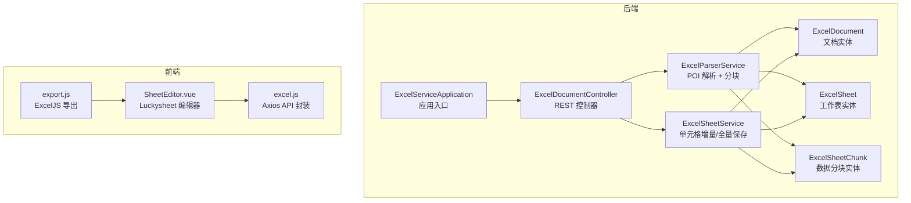
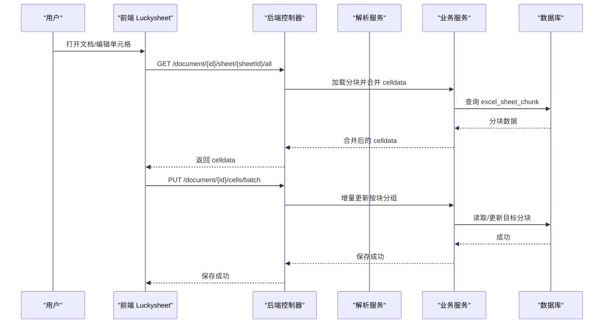
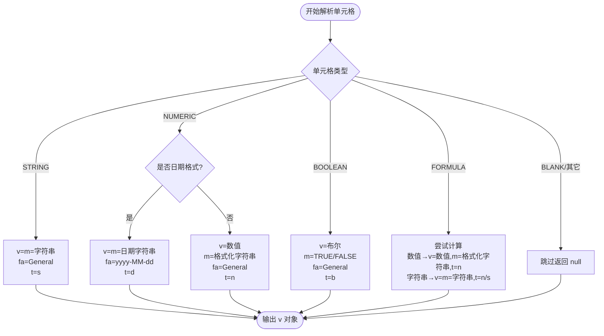
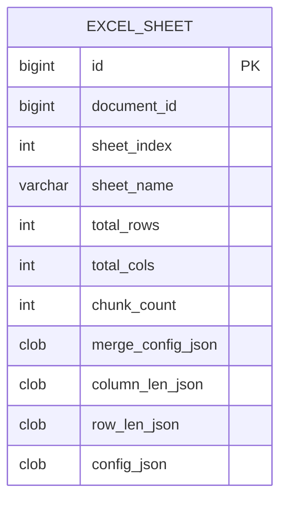
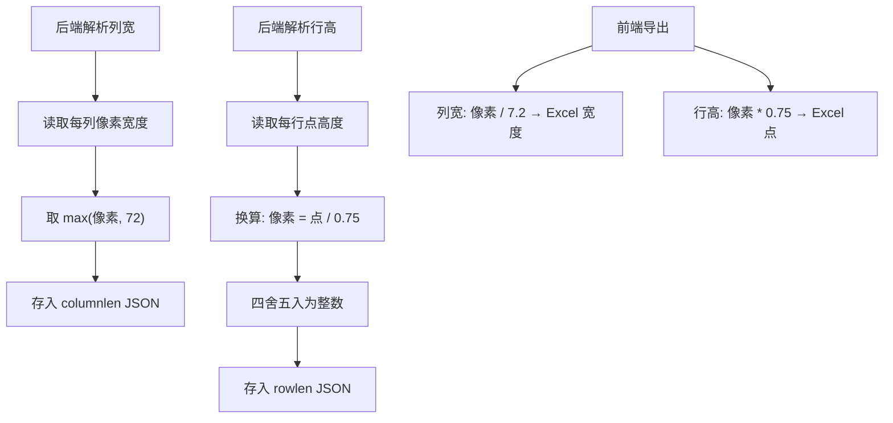
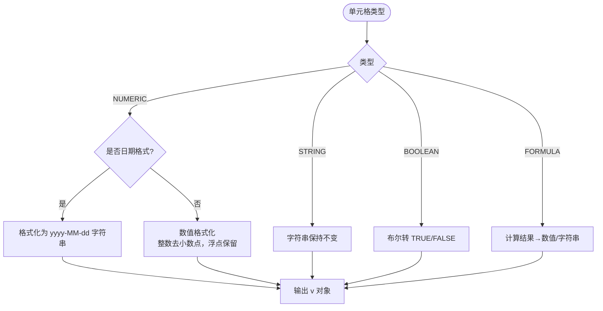
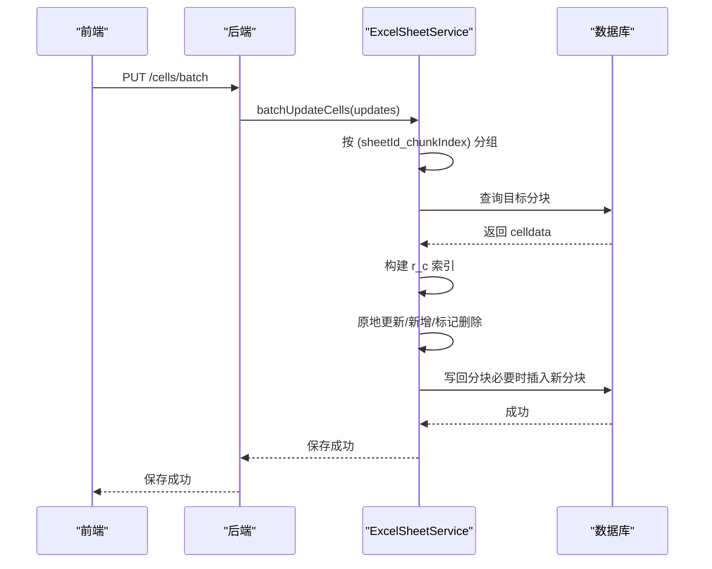
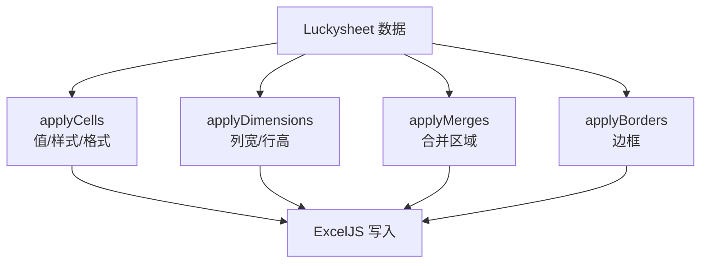
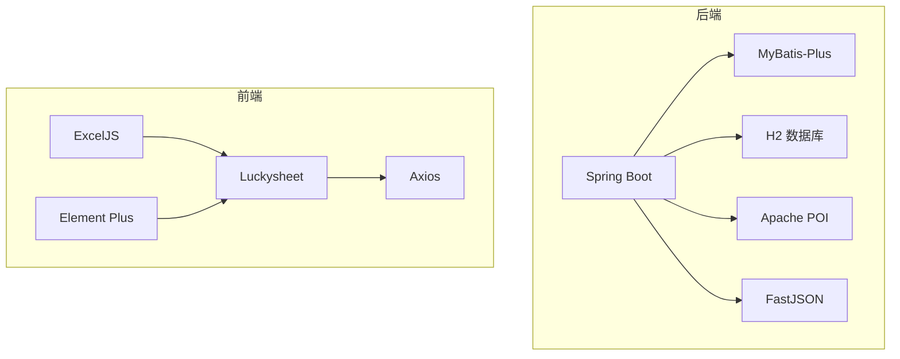

# 数据序列化与映射

<cite>
**本文引用的文件**
- [ExcelServiceApplication.java](file://dataloom-server/src/main/java/com/demo/excel/ExcelServiceApplication.java)
- [ExcelDocumentController.java](file://dataloom-server/src/main/java/com/demo/excel/controller/ExcelDocumentController.java)
- [ExcelParserService.java](file://dataloom-server/src/main/java/com/demo/excel/service/ExcelParserService.java)
- [ExcelSheetService.java](file://dataloom-server/src/main/java/com/demo/excel/service/ExcelSheetService.java)
- [ExcelDocument.java](file://dataloom-server/src/main/java/com/demo/excel/entity/ExcelDocument.java)
- [ExcelSheet.java](file://dataloom-server/src/main/java/com/demo/excel/entity/ExcelSheet.java)
- [ExcelSheetChunk.java](file://dataloom-server/src/main/java/com/demo/excel/entity/ExcelSheetChunk.java)
- [application.yml](file://dataloom-server/src/main/resources/application.yml)
- [schema.sql](file://dataloom-server/src/main/resources/schema.sql)
- [README.md](file://README.md)
- [export.js](file://dataloom-web/src/utils/export.js)
- [SheetEditor.vue](file://dataloom-web/src/views/SheetEditor.vue)
- [excel.js](file://dataloom-web/src/api/excel.js)
</cite>

## 目录
1. [简介](#简介)
2. [项目结构](#项目结构)
3. [核心组件](#核心组件)
4. [架构总览](#架构总览)
5. [详细组件分析](#详细组件分析)
6. [依赖分析](#依赖分析)
7. [性能考量](#性能考量)
8. [故障排查指南](#故障排查指南)
9. [结论](#结论)
10. [附录](#附录)

## 简介
本技术文档围绕 Luckysheet v 对象的数据结构设计与序列化映射展开，系统性解释以下主题：
- Luckysheet v、m、ct 等关键字段的含义与作用
- 样式信息（ct）的序列化格式与类型标识（t）定义
- 合并单元格配置的 JSON 结构与坐标映射关系
- 列宽与行高的存储格式以及像素与点的转换关系
- 数据类型转换逻辑（数值格式化、日期格式化、布尔值处理）
- 完整数据结构示例与序列化/反序列化的实现思路
- 帮助开发者理解 Excel 与 Luckysheet 之间的数据转换机制

## 项目结构
后端采用 Spring Boot + MyBatis-Plus，数据库为 H2（文件模式）。前端使用 Vue 3 + Luckysheet + ExcelJS。核心数据模型采用“文档-工作表-分块”三层结构，以分块存储替代整表 JSON，提升大表性能与可维护性。

**图表来源**
- [ExcelServiceApplication.java:1-21](file://dataloom-server/src/main/java/com/demo/excel/ExcelServiceApplication.java#L1-L21)
- [ExcelDocumentController.java:1-296](file://dataloom-server/src/main/java/com/demo/excel/controller/ExcelDocumentController.java#L1-L296)
- [ExcelParserService.java:1-348](file://dataloom-server/src/main/java/com/demo/excel/service/ExcelParserService.java#L1-L348)
- [ExcelSheetService.java:1-443](file://dataloom-server/src/main/java/com/demo/excel/service/ExcelSheetService.java#L1-L443)
- [ExcelDocument.java:1-55](file://dataloom-server/src/main/java/com/demo/excel/entity/ExcelDocument.java#L1-L55)
- [ExcelSheet.java:1-77](file://dataloom-server/src/main/java/com/demo/excel/entity/ExcelSheet.java#L1-L77)
- [ExcelSheetChunk.java:1-53](file://dataloom-server/src/main/java/com/demo/excel/entity/ExcelSheetChunk.java#L1-L53)
- [SheetEditor.vue:1-200](file://dataloom-web/src/views/SheetEditor.vue#L1-L200)
- [export.js:1-239](file://dataloom-web/src/utils/export.js#L1-L239)
- [excel.js:1-79](file://dataloom-web/src/api/excel.js#L1-L79)

**章节来源**
- [README.md:88-130](file://README.md#L88-L130)
- [application.yml:1-51](file://dataloom-server/src/main/resources/application.yml#L1-L51)
- [schema.sql:1-124](file://dataloom-server/src/main/resources/schema.sql#L1-L124)

## 核心组件
- 文档实体：仅存元数据，避免整表 JSON 带来的性能问题
- 工作表实体：保存合并单元格、列宽、行高等小型配置
- 数据分块实体：celldata 按行范围切片存储，每块约 1000 行
- 解析服务：使用 Apache POI 流式解析 Excel，构建 Luckysheet v 对象
- 业务服务：负责增量更新与全量快照保存，协调分块写入

**章节来源**
- [ExcelDocument.java:1-55](file://dataloom-server/src/main/java/com/demo/excel/entity/ExcelDocument.java#L1-L55)
- [ExcelSheet.java:1-77](file://dataloom-server/src/main/java/com/demo/excel/entity/ExcelSheet.java#L1-L77)
- [ExcelSheetChunk.java:1-53](file://dataloom-server/src/main/java/com/demo/excel/entity/ExcelSheetChunk.java#L1-L53)
- [ExcelParserService.java:25-87](file://dataloom-server/src/main/java/com/demo/excel/service/ExcelParserService.java#L25-L87)
- [ExcelSheetService.java:23-32](file://dataloom-server/src/main/java/com/demo/excel/service/ExcelSheetService.java#L23-L32)

## 架构总览
后端通过控制器暴露 REST 接口，解析服务将 Excel 文件流式解析为 Luckysheet 兼容的 celldata，并按 1000 行分块存储。前端 Luckysheet 编辑器加载 celldata，用户修改后通过增量接口仅写入受影响的分块；导出时前端使用 ExcelJS 将编辑器状态转为 .xlsx，确保样式零丢失。

**图表来源**
- [ExcelDocumentController.java:139-161](file://dataloom-server/src/main/java/com/demo/excel/controller/ExcelDocumentController.java#L139-L161)
- [ExcelDocumentController.java:176-190](file://dataloom-server/src/main/java/com/demo/excel/controller/ExcelDocumentController.java#L176-L190)
- [ExcelSheetService.java:103-212](file://dataloom-server/src/main/java/com/demo/excel/service/ExcelSheetService.java#L103-L212)
- [ExcelParserService.java:66-87](file://dataloom-server/src/main/java/com/demo/excel/service/ExcelParserService.java#L66-L87)

## 详细组件分析

### Luckysheet v/m/ct 字段与序列化
- v：单元格值对象，包含 v（真实值）、m（显示值）、f（公式，仅公式单元格）、ct（样式与格式信息）
- m：显示值，用于展示（例如日期字符串、布尔字符串）
- ct：样式与格式对象，包含：
  - fa：数字/日期格式字符串（如 yyyy-MM-dd）
  - t：类型标识，字符串如下：
    - s：字符串
    - n：数值
    - d：日期
    - b：布尔
- 解析逻辑：
  - 字符串：v=m=字符串，fa=General，t=s
  - 数值：非日期时 v=数值，m=格式化字符串，fa=General，t=n；日期时 v=m=日期字符串，fa=yyyy-MM-dd，t=d
  - 布尔：v=布尔，m=TRUE/FALSE，fa=General，t=b
  - 公式：尝试计算，数值则 v=数值，m=格式化字符串；否则 v=m=字符串，fa=General，t=n 或 s（降级）

**图表来源**
- [ExcelParserService.java:205-281](file://dataloom-server/src/main/java/com/demo/excel/service/ExcelParserService.java#L205-L281)

**章节来源**
- [ExcelParserService.java:205-281](file://dataloom-server/src/main/java/com/demo/excel/service/ExcelParserService.java#L205-L281)
- [ExcelSheetChunk.java:41-47](file://dataloom-server/src/main/java/com/demo/excel/entity/ExcelSheetChunk.java#L41-L47)

### 合并单元格配置（config.merge）
- 存储结构：以“首行_首列”为键，值包含 r（首行）、c（首列）、rs（行跨度）、cs（列跨度）
- 前端渲染：Luckysheet 根据此配置进行合并区域绘制
- 后端解析：遍历合并区域，构造 JSON 并存入 excel_sheet.merge_config_json

**图表来源**
- [schema.sql:25-45](file://dataloom-server/src/main/resources/schema.sql#L25-L45)
- [ExcelParserService.java:299-311](file://dataloom-server/src/main/java/com/demo/excel/service/ExcelParserService.java#L299-L311)

**章节来源**
- [ExcelParserService.java:299-311](file://dataloom-server/src/main/java/com/demo/excel/service/ExcelParserService.java#L299-L311)
- [ExcelDocumentController.java:98-110](file://dataloom-server/src/main/java/com/demo/excel/controller/ExcelDocumentController.java#L98-L110)

### 列宽与行高存储与转换
- 列宽 columnlen：以列索引为键，值为像素宽度；前端导出时转换为 Excel 列宽（约 1 字符 ≈ 7.2 像素）
- 行高 rowlen：以行索引为键，值为像素高度；前端导出时转换为 Excel 行高（约 1 点 ≈ 0.75 像素）
- 后端解析：列宽以像素读取并取最小 72；行高以点读取后换算为像素

**图表来源**
- [ExcelParserService.java:316-340](file://dataloom-server/src/main/java/com/demo/excel/service/ExcelParserService.java#L316-L340)
- [export.js:30-44](file://dataloom-web/src/utils/export.js#L30-L44)

**章节来源**
- [ExcelParserService.java:316-340](file://dataloom-server/src/main/java/com/demo/excel/service/ExcelParserService.java#L316-L340)
- [export.js:30-44](file://dataloom-web/src/utils/export.js#L30-L44)

### 数据类型转换与格式化
- 数值：整数去除小数部分，浮点保留原值；公式计算结果同样遵循此规则
- 日期：统一格式化为“yyyy-MM-dd”的字符串显示值
- 布尔：显示值为“TRUE”或“FALSE”
- 公式：优先取计算结果；若失败则降级为字符串（保留“=”前缀）

**图表来源**
- [ExcelParserService.java:210-277](file://dataloom-server/src/main/java/com/demo/excel/service/ExcelParserService.java#L210-L277)

**章节来源**
- [ExcelParserService.java:210-277](file://dataloom-server/src/main/java/com/demo/excel/service/ExcelParserService.java#L210-L277)

### 分块存储与增量更新
- 分块策略：chunkIndex = row / 1000，保证与前端增量更新定位一致
- 增量更新：按 (sheetId_chunkIndex) 分组，逐块读取/更新 celldata，使用“r_c”索引加速查找
- 全量快照：删除旧分块与工作表，按新工作簿重建

**图表来源**
- [ExcelDocumentController.java:176-190](file://dataloom-server/src/main/java/com/demo/excel/controller/ExcelDocumentController.java#L176-L190)
- [ExcelSheetService.java:103-212](file://dataloom-server/src/main/java/com/demo/excel/service/ExcelSheetService.java#L103-L212)

**章节来源**
- [ExcelSheetService.java:103-212](file://dataloom-server/src/main/java/com/demo/excel/service/ExcelSheetService.java#L103-L212)
- [ExcelParserService.java:142-200](file://dataloom-server/src/main/java/com/demo/excel/service/ExcelParserService.java#L142-L200)

### 前端导出与样式映射
- 导出流程：遍历每个工作表，应用维度、单元格值、合并区域、边框等
- 值映射：公式单元格优先使用 f 与 v；文本单元格根据 ct.s 拼接
- 数字格式：fa 从“yyyy-MM-dd”映射为“yyyy-MM-dd”（ExcelJS 支持）
- 边框与填充：Luckysheet 的边框/填充映射到 ExcelJS 的 border/fill/font/alignment

**图表来源**
- [export.js:4-98](file://dataloom-web/src/utils/export.js#L4-L98)

**章节来源**
- [export.js:4-98](file://dataloom-web/src/utils/export.js#L4-L98)
- [SheetEditor.vue:175-200](file://dataloom-web/src/views/SheetEditor.vue#L175-L200)

## 依赖分析
- 后端依赖：Spring Boot、MyBatis-Plus、H2、Apache POI、FastJSON
- 前端依赖：Luckysheet、ExcelJS、Element Plus、Axios
- 数据库：H2（文件模式），生产可切换为 MySQL/PostgreSQL

**图表来源**
- [application.yml:4-51](file://dataloom-server/src/main/resources/application.yml#L4-L51)
- [README.md:73-84](file://README.md#L73-L84)

**章节来源**
- [application.yml:4-51](file://dataloom-server/src/main/resources/application.yml#L4-L51)
- [schema.sql:1-124](file://dataloom-server/src/main/resources/schema.sql#L1-L124)
- [README.md:73-84](file://README.md#L73-L84)

## 性能考量
- 分块存储：每块约 1000 行，单次拉取几百 KB，避免整表 JSON 的几十 MB 传输
- 增量更新：仅写入受影响的分块，降低 I/O 与序列化成本
- 索引优化：在分块表上建立 sheet_id 与 chunk_index 的复合索引
- 前端懒加载：按需加载分块，打开大文件几乎无等待

[本节为通用性能讨论，不直接分析具体文件]

## 故障排查指南
- 单元格解析异常：解析服务对单个单元格异常进行吞吐，避免中断整体解析
- 分块边界偏移：分块索引由行号直接决定，即使存在空行也不偏移
- 公式计算失败：降级为字符串，保留原始公式字符串
- 导出样式丢失：样式信息存在于前端编辑器状态，需前端导出

**章节来源**
- [ExcelParserService.java:274-277](file://dataloom-server/src/main/java/com/demo/excel/service/ExcelParserService.java#L274-L277)
- [ExcelParserService.java:260-267](file://dataloom-server/src/main/java/com/demo/excel/service/ExcelParserService.java#L260-L267)
- [ExcelSheetService.java:112-115](file://dataloom-server/src/main/java/com/demo/excel/service/ExcelSheetService.java#L112-L115)
- [README.md:213](file://README.md#L213)

## 结论
本项目通过“文档-工作表-分块”的三层结构与 Luckysheet v 对象的序列化映射，实现了 Excel 与 Luckysheet 之间的高效转换。后端以分块存储与增量更新保障大表性能，前端以 ExcelJS 导出确保样式零丢失。开发者可依据本文档的字段定义与转换逻辑，扩展更多类型与样式支持。

[本节为总结性内容，不直接分析具体文件]

## 附录

### 数据结构示例（示意）
- 单元格 v 对象
  - v：真实值（字符串/数值/布尔/日期字符串）
  - m：显示值（字符串）
  - f：公式（仅公式单元格）
  - ct：样式与格式
    - fa：格式字符串（如 General、yyyy-MM-dd）
    - t：类型标识（s/n/d/b）
- 合并单元格 merge
  - 键：首行_首列
  - 值：{ r, c, rs, cs }
- 列宽 columnlen
  - 键：列索引（字符串）
  - 值：像素宽度（整数）
- 行高 rowlen
  - 键：行索引（字符串）
  - 值：像素高度（整数）

**章节来源**
- [ExcelParserService.java:205-281](file://dataloom-server/src/main/java/com/demo/excel/service/ExcelParserService.java#L205-L281)
- [ExcelParserService.java:299-311](file://dataloom-server/src/main/java/com/demo/excel/service/ExcelParserService.java#L299-L311)
- [ExcelParserService.java:316-340](file://dataloom-server/src/main/java/com/demo/excel/service/ExcelParserService.java#L316-L340)
- [ExcelSheetChunk.java:41-47](file://dataloom-server/src/main/java/com/demo/excel/entity/ExcelSheetChunk.java#L41-L47)

### 序列化/反序列化实现要点
- 后端解析：POI 读取单元格类型，构建 v 对象与 ct，写入 celldata JSON
- 前端导出：遍历 celldata，将 v/m/f/ct 映射到 ExcelJS 单元格属性
- 增量保存：按 chunkIndex 分组，原地更新/新增/延迟删除，避免重复 I/O

**章节来源**
- [ExcelParserService.java:66-87](file://dataloom-server/src/main/java/com/demo/excel/service/ExcelParserService.java#L66-L87)
- [ExcelSheetService.java:103-212](file://dataloom-server/src/main/java/com/demo/excel/service/ExcelSheetService.java#L103-L212)
- [export.js:4-98](file://dataloom-web/src/utils/export.js#L4-L98)