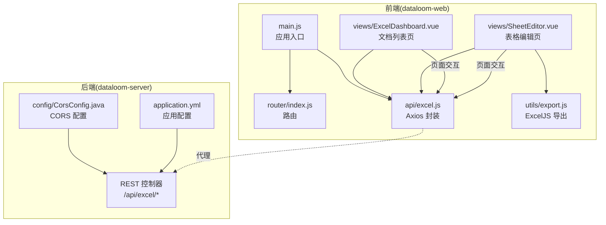
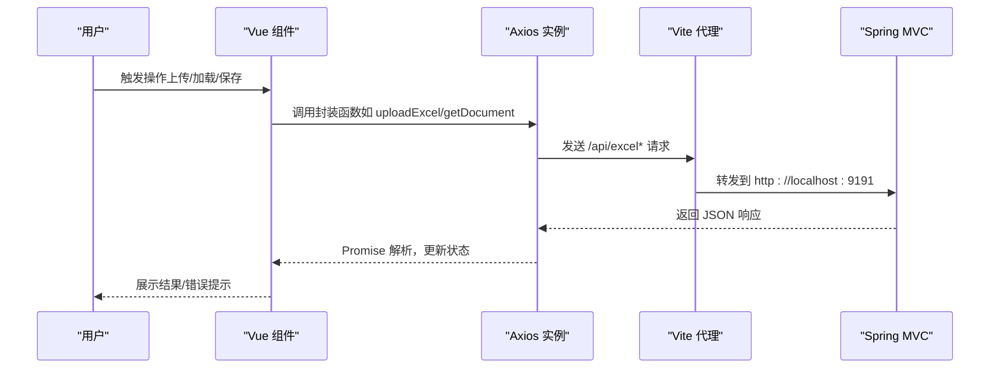
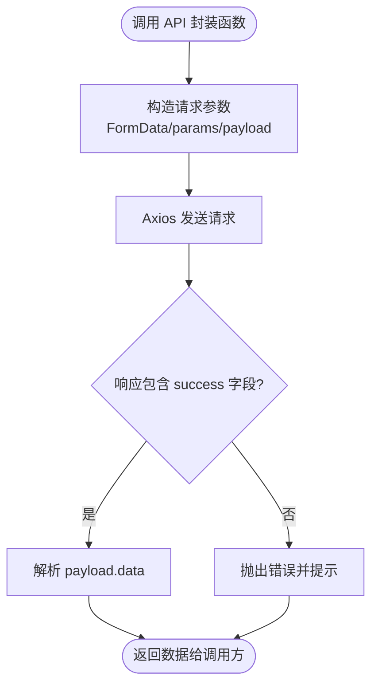
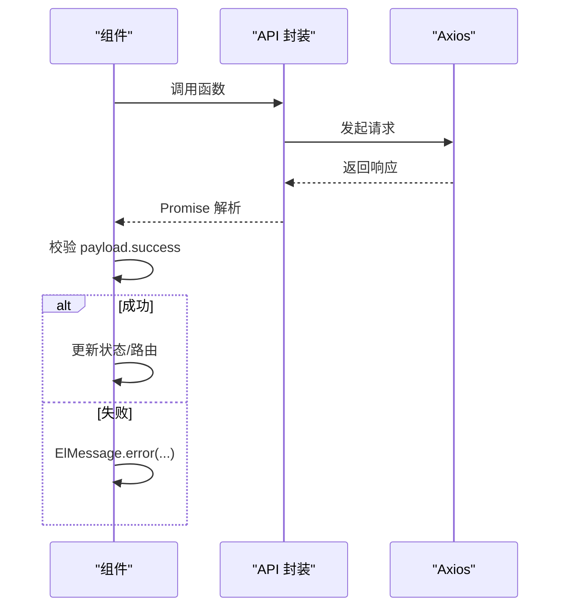
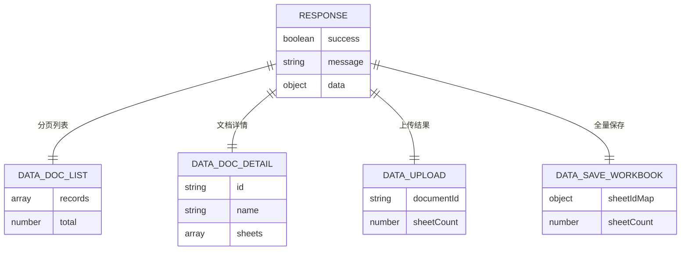
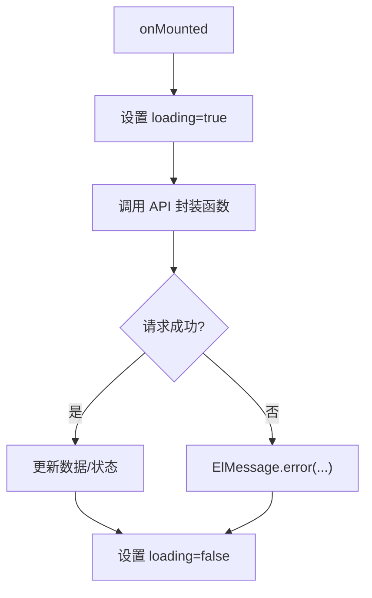
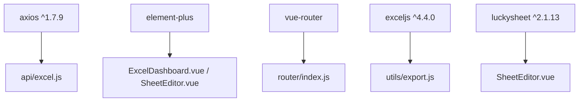

# API 接口集成

<cite>
**本文引用的文件**
- [excel.js](file://dataloom-web/src/api/excel.js)
- [main.js](file://dataloom-web/src/main.js)
- [package.json](file://dataloom-web/package.json)
- [vite.config.js](file://dataloom-web/vite.config.js)
- [ExcelDashboard.vue](file://dataloom-web/src/views/ExcelDashboard.vue)
- [SheetEditor.vue](file://dataloom-web/src/views/SheetEditor.vue)
- [export.js](file://dataloom-web/src/utils/export.js)
- [index.js](file://dataloom-web/src/router/index.js)
- [CorsConfig.java](file://dataloom-server/src/main/java/com/demo/excel/config/CorsConfig.java)
- [application.yml](file://dataloom-server/src/main/resources/application.yml)
- [README.md](file://README.md)
</cite>

## 目录
1. [简介](#简介)
2. [项目结构](#项目结构)
3. [核心组件](#核心组件)
4. [架构总览](#架构总览)
5. [详细组件分析](#详细组件分析)
6. [依赖关系分析](#依赖关系分析)
7. [性能考量](#性能考量)
8. [故障排查指南](#故障排查指南)
9. [结论](#结论)
10. [附录](#附录)

## 简介
本文件面向前端工程师，系统化梳理 DataLoom 前端对后端 API 的集成方式，涵盖 Axios 配置与请求拦截器扩展、接口封装策略、统一错误处理、请求/响应数据格式与类型约定、异步状态管理与加载指示器、最佳实践与性能优化、测试与调试方法，以及跨域与认证集成方案。文档以仓库现有实现为依据，避免臆测，帮助读者快速理解并高效维护前端 API 集成。

## 项目结构
前端采用 Vue 3 + Vite 架构，API 封装集中在独立模块，视图组件负责状态管理与调用，路由负责页面导航，工具模块负责导出等辅助能力。后端通过 Spring MVC 提供 REST 接口，并在 Demo 阶段启用宽松跨域策略。

**图示来源**
- [main.js:1-19](file://dataloom-web/src/main.js#L1-L19)
- [index.js:1-21](file://dataloom-web/src/router/index.js#L1-L21)
- [excel.js:1-79](file://dataloom-web/src/api/excel.js#L1-L79)
- [ExcelDashboard.vue:1-386](file://dataloom-web/src/views/ExcelDashboard.vue#L1-L386)
- [SheetEditor.vue:1-970](file://dataloom-web/src/views/SheetEditor.vue#L1-L970)
- [export.js:1-239](file://dataloom-web/src/utils/export.js#L1-L239)
- [CorsConfig.java:1-22](file://dataloom-server/src/main/java/com/demo/excel/config/CorsConfig.java#L1-L22)
- [application.yml:1-51](file://dataloom-server/src/main/resources/application.yml#L1-L51)

**章节来源**
- [main.js:1-19](file://dataloom-web/src/main.js#L1-L19)
- [index.js:1-21](file://dataloom-web/src/router/index.js#L1-L21)
- [excel.js:1-79](file://dataloom-web/src/api/excel.js#L1-L79)
- [ExcelDashboard.vue:1-386](file://dataloom-web/src/views/ExcelDashboard.vue#L1-L386)
- [SheetEditor.vue:1-970](file://dataloom-web/src/views/SheetEditor.vue#L1-L970)
- [export.js:1-239](file://dataloom-web/src/utils/export.js#L1-L239)
- [CorsConfig.java:1-22](file://dataloom-server/src/main/java/com/demo/excel/config/CorsConfig.java#L1-L22)
- [application.yml:1-51](file://dataloom-server/src/main/resources/application.yml#L1-L51)

## 核心组件
- Axios 实例与基础配置：统一基地址、超时设置、上传进度回调。
- API 封装函数：按功能域划分（上传、文档查询、数据加载、数据写入、文档管理），每个函数对应一个具体接口。
- 视图组件状态管理：使用 ref/reactive 管理加载/上传/保存/导出等状态，结合 Element Plus 的消息与加载提示。
- 路由与页面导航：通过路由参数传递文档 ID，驱动编辑页初始化。
- 导出工具：基于 ExcelJS 将前端编辑器状态导出为 .xlsx 文件。

**章节来源**
- [excel.js:1-79](file://dataloom-web/src/api/excel.js#L1-L79)
- [ExcelDashboard.vue:106-229](file://dataloom-web/src/views/ExcelDashboard.vue#L106-L229)
- [SheetEditor.vue:48-844](file://dataloom-web/src/views/SheetEditor.vue#L48-L844)
- [export.js:1-239](file://dataloom-web/src/utils/export.js#L1-L239)
- [index.js:1-21](file://dataloom-web/src/router/index.js#L1-L21)

## 架构总览
前端通过 Axios 实例向后端发起 REST 请求，Vite 开发服务器配置了 /api 前缀代理，将请求转发至后端 9191 端口。后端通过 Spring MVC 提供 /api/excel 前缀的接口，Demo 阶段启用宽松 CORS 策略以便前后端分离开发。

**图示来源**
- [excel.js:1-79](file://dataloom-web/src/api/excel.js#L1-L79)
- [vite.config.js:12-21](file://dataloom-web/vite.config.js#L12-L21)
- [CorsConfig.java:10-21](file://dataloom-server/src/main/java/com/demo/excel/config/CorsConfig.java#L10-L21)

## 详细组件分析

### Axios 配置与请求拦截器
- 基础配置
  - 基地址：统一前缀 /api/excel，便于集中管理接口路径。
  - 超时：较长超时（毫秒级）以适配大文件上传与大数据块加载。
- 请求拦截器
  - 当前实现未显式添加请求拦截器，如需统一注入 Token、签名或埋点，可在请求拦截器中实现。
- 响应拦截器
  - 当前实现未显式添加响应拦截器，如需统一处理鉴权失效、全局错误提示，可在响应拦截器中实现。
- 上传进度
  - 上传接口通过 onUploadProgress 回调计算百分比，便于在组件中展示进度条。

建议扩展点（概念性说明，非现有实现）：
- 在请求拦截器中注入 Authorization 头或签名参数。
- 在响应拦截器中统一处理 401/403/5xx 错误，触发登出或全局提示。
- 对特定接口开启重试或幂等策略。

**章节来源**
- [excel.js:3-6](file://dataloom-web/src/api/excel.js#L3-L6)
- [excel.js:17-24](file://dataloom-web/src/api/excel.js#L17-L24)

### API 接口封装策略
- 功能域划分清晰：上传、文档查询、数据加载、数据写入、文档管理。
- 参数与返回值
  - 上传：FormData，支持进度回调。
  - 查询：分页参数、路径参数。
  - 写入：批量更新单元格、全量快照保存。
- 统一错误处理
  - 组件侧对响应进行校验，若 payload.success 为假则抛错并提示。
  - 对不同操作使用 ElMessage 的 error/info/warning 进行差异化提示。

**图示来源**
- [excel.js:12-78](file://dataloom-web/src/api/excel.js#L12-L78)
- [ExcelDashboard.vue:126-140](file://dataloom-web/src/views/ExcelDashboard.vue#L126-L140)
- [SheetEditor.vue:142-173](file://dataloom-web/src/views/SheetEditor.vue#L142-L173)

**章节来源**
- [excel.js:1-79](file://dataloom-web/src/api/excel.js#L1-L79)
- [ExcelDashboard.vue:126-216](file://dataloom-web/src/views/ExcelDashboard.vue#L126-L216)
- [SheetEditor.vue:134-173](file://dataloom-web/src/views/SheetEditor.vue#L134-L173)

### 统一错误处理机制
- 组件侧校验
  - 读取 response.data.success，若为假则根据 message 字段提示。
  - 对上传/删除/保存等操作分别捕获错误并提示。
- 全局提示
  - 使用 Element Plus 的 ElMessage 提示错误/成功/警告信息。
- 加载态
  - 使用 v-loading、:loading、:disabled 等属性配合 ref 标识，避免重复请求与交互。

**图示来源**
- [ExcelDashboard.vue:126-140](file://dataloom-web/src/views/ExcelDashboard.vue#L126-L140)
- [SheetEditor.vue:142-173](file://dataloom-web/src/views/SheetEditor.vue#L142-L173)

**章节来源**
- [ExcelDashboard.vue:126-216](file://dataloom-web/src/views/ExcelDashboard.vue#L126-L216)
- [SheetEditor.vue:134-173](file://dataloom-web/src/views/SheetEditor.vue#L134-L173)

### 请求/响应数据格式与类型定义
- 请求体
  - JSON：默认 application/json。
  - 上传：multipart/form-data，包含 file 字段。
- 响应体
  - 统一结构：包含 success、message、data 字段。
  - data 为具体业务数据，如分页 records、文档元信息、sheetId 映射等。
- 上传进度
  - onUploadProgress 回调提供 loaded/total，可用于计算百分比。

**图示来源**
- [ExcelDashboard.vue:129-135](file://dataloom-web/src/views/ExcelDashboard.vue#L129-L135)
- [ExcelDashboard.vue:158-165](file://dataloom-web/src/views/ExcelDashboard.vue#L158-L165)
- [SheetEditor.vue:562-581](file://dataloom-web/src/views/SheetEditor.vue#L562-L581)
- [SheetEditor.vue:570-581](file://dataloom-web/src/views/SheetEditor.vue#L570-L581)

**章节来源**
- [excel.js:17-24](file://dataloom-web/src/api/excel.js#L17-L24)
- [ExcelDashboard.vue:129-165](file://dataloom-web/src/views/ExcelDashboard.vue#L129-L165)
- [SheetEditor.vue:562-631](file://dataloom-web/src/views/SheetEditor.vue#L562-L631)

### 异步请求状态管理与加载指示器
- 状态变量
  - loading/uploading/saving/exporting/booting/loadingSheet 等，用于控制按钮与表格的加载态。
- 指示器
  - v-loading、:loading、ElLoading.service 等，提升用户体验。
- 生命周期
  - onMounted 时触发初始数据加载。
  - 组件卸载前清理事件监听与编辑器实例，避免内存泄漏。

**图示来源**
- [ExcelDashboard.vue:122-140](file://dataloom-web/src/views/ExcelDashboard.vue#L122-L140)
- [SheetEditor.vue:134-173](file://dataloom-web/src/views/SheetEditor.vue#L134-L173)

**章节来源**
- [ExcelDashboard.vue:106-229](file://dataloom-web/src/views/ExcelDashboard.vue#L106-L229)
- [SheetEditor.vue:48-173](file://dataloom-web/src/views/SheetEditor.vue#L48-L173)

### 接口调用最佳实践与性能优化
- 最佳实践
  - 在组件内对响应进行显式校验，避免直接使用 data。
  - 对上传进度使用节流/防抖，减少 UI 更新频率。
  - 对分页/懒加载场景，合理设置 pageNum/pageSize，避免一次性请求过多数据。
  - 对编辑器保存前进行结构变更检测，优先增量更新，必要时全量保存。
- 性能优化
  - 大文件上传：利用 onUploadProgress 实时反馈，避免长时间无响应。
  - 数据懒加载：按需加载 Sheet 的 celldata，减少首屏压力。
  - 增量保存：仅提交变更的单元格，降低网络与数据库压力。
  - 导出：前端 ExcelJS 导出，避免后端往返，提升体验。

**章节来源**
- [excel.js:17-24](file://dataloom-web/src/api/excel.js#L17-L24)
- [SheetEditor.vue:216-245](file://dataloom-web/src/views/SheetEditor.vue#L216-L245)
- [SheetEditor.vue:547-631](file://dataloom-web/src/views/SheetEditor.vue#L547-L631)

### API 测试方法与调试工具
- 前端测试
  - 单元测试：针对 API 封装函数的参数构造与返回值结构进行断言。
  - 集成测试：模拟组件调用流程，验证 loading/error/message 的行为。
- 调试工具
  - 浏览器 Network 面板：观察 /api 前缀请求、响应体、状态码。
  - Vite DevTools：查看代理规则与转发目标。
  - 后端日志：application.yml 中开启 DEBUG 级别日志，定位接口处理问题。
- 调试建议
  - 在请求拦截器中打印请求摘要（URL/方法/简要参数）。
  - 在响应拦截器中打印响应摘要（状态/耗时/简要数据）。

**章节来源**
- [vite.config.js:12-21](file://dataloom-web/vite.config.js#L12-L21)
- [application.yml:48-51](file://dataloom-server/src/main/resources/application.yml#L48-L51)

### 跨域处理与认证机制集成方案
- 跨域（CORS）
  - 后端通过 CorsConfig.java 对 /api/** 开放跨域，允许任意来源、方法与头。
  - 前端通过 Vite 代理将 /api 前缀请求转发到后端 9191 端口，避免浏览器同源策略限制。
- 认证（Token）
  - 当前实现未体现 Token 注入与鉴权处理。
  - 建议在请求拦截器中注入 Authorization 头，在响应拦截器中处理 401/403。
  - 若后端提供登录接口，可在登录成功后持久化 Token，并在拦截器中统一携带。

**图示来源**
- [vite.config.js:15-20](file://dataloom-web/vite.config.js#L15-L20)
- [CorsConfig.java:14-20](file://dataloom-server/src/main/java/com/demo/excel/config/CorsConfig.java#L14-L20)

**章节来源**
- [CorsConfig.java:1-22](file://dataloom-server/src/main/java/com/demo/excel/config/CorsConfig.java#L1-L22)
- [vite.config.js:12-21](file://dataloom-web/vite.config.js#L12-L21)

## 依赖关系分析
- Axios 版本：1.7.9（package.json 中声明）
- Element Plus：UI 组件与消息/加载提示
- Vue Router：页面导航与参数传递
- ExcelJS：前端导出工具
- Luckysheet：在线表格编辑器（编辑器状态转换为后端保存）

**图示来源**
- [package.json:12-25](file://dataloom-web/package.json#L12-L25)
- [excel.js:1-1](file://dataloom-web/src/api/excel.js#L1-L1)
- [ExcelDashboard.vue:110-111](file://dataloom-web/src/views/ExcelDashboard.vue#L110-L111)
- [SheetEditor.vue:53-54](file://dataloom-web/src/views/SheetEditor.vue#L53-L54)
- [export.js:1-2](file://dataloom-web/src/utils/export.js#L1-L2)
- [index.js:1-21](file://dataloom-web/src/router/index.js#L1-L21)

**章节来源**
- [package.json:1-27](file://dataloom-web/package.json#L1-L27)
- [excel.js:1-1](file://dataloom-web/src/api/excel.js#L1-L1)
- [ExcelDashboard.vue:110-111](file://dataloom-web/src/views/ExcelDashboard.vue#L110-L111)
- [SheetEditor.vue:53-54](file://dataloom-web/src/views/SheetEditor.vue#L53-L54)
- [export.js:1-2](file://dataloom-web/src/utils/export.js#L1-L2)
- [index.js:1-21](file://dataloom-web/src/router/index.js#L1-L21)

## 性能考量
- 网络层面
  - 合理设置超时与重试策略，避免长时间占用连接。
  - 上传大文件时使用进度回调，避免 UI 卡顿。
- 前端渲染
  - 懒加载与虚拟滚动（如适用）减少 DOM 压力。
  - 对频繁更新的状态进行节流/去抖。
- 数据处理
  - 增量保存优先，避免全量覆盖。
  - 导出在前端完成，减少后端压力。

## 故障排查指南
- 上传失败
  - 检查文件类型与大小限制（后端 multipart 配置）。
  - 查看 Network 面板与后端日志，确认接口是否可达与解析是否成功。
- 文档/Sheet 加载失败
  - 确认文档 ID 与 Sheet ID 是否正确。
  - 检查后端 CORS 配置与代理是否生效。
- 保存失败
  - 确认是否存在结构变更导致全量保存。
  - 检查编辑器状态是否完整（图表/图片/超链接等）。
- 导出失败
  - 确认编辑器已初始化且存在数据。
  - 检查导出工具链（ExcelJS）是否可用。

**章节来源**
- [application.yml:19-24](file://dataloom-server/src/main/resources/application.yml#L19-L24)
- [ExcelDashboard.vue:150-172](file://dataloom-web/src/views/ExcelDashboard.vue#L150-L172)
- [SheetEditor.vue:166-173](file://dataloom-web/src/views/SheetEditor.vue#L166-L173)
- [SheetEditor.vue:547-631](file://dataloom-web/src/views/SheetEditor.vue#L547-L631)
- [export.js:1-239](file://dataloom-web/src/utils/export.js#L1-L239)

## 结论
本项目前端 API 集成以 Axios 封装为核心，围绕功能域划分接口，组件侧承担统一错误处理与状态管理，辅以 Element Plus 的加载与消息提示，形成清晰、易维护的调用链路。建议后续在拦截器中补充认证与全局错误处理，并结合现有懒加载与增量保存策略进一步优化性能与稳定性。

## 附录
- API 参考（来自 README）
  - 文档管理：上传、分页列表、详情、重命名、删除。
  - 数据读写：按 Sheet 加载全部 celldata、批量更新单元格、全量快照保存。
- 目录结构参考（来自 README）
  - 前端：api、router、utils、views。
  - 后端：controller、entity、mapper、service、config。

**章节来源**
- [README.md:190-215](file://README.md#L190-L215)
- [README.md:217-242](file://README.md#L217-L242)