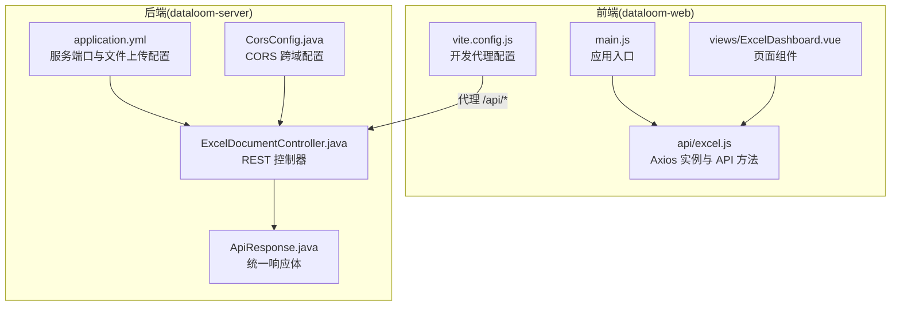
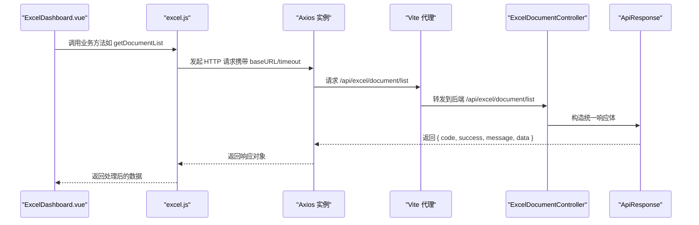
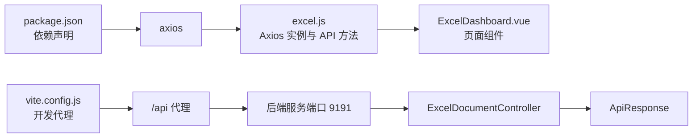

# Axios 配置与拦截器

<cite>
**本文引用的文件**
- [package.json](file://dataloom-web/package.json)
- [excel.js](file://dataloom-web/src/api/excel.js)
- [vite.config.js](file://dataloom-web/vite.config.js)
- [ExcelDashboard.vue](file://dataloom-web/src/views/ExcelDashboard.vue)
- [application.yml](file://dataloom-server/src/main/resources/application.yml)
- [CorsConfig.java](file://dataloom-server/src/main/java/com/demo/excel/config/CorsConfig.java)
- [ApiResponse.java](file://dataloom-server/src/main/java/com/demo/excel/common/ApiResponse.java)
- [ExcelDocumentController.java](file://dataloom-server/src/main/java/com/demo/excel/controller/ExcelDocumentController.java)
</cite>

## 目录
1. [简介](#简介)
2. [项目结构](#项目结构)
3. [核心组件](#核心组件)
4. [架构总览](#架构总览)
5. [详细组件分析](#详细组件分析)
6. [依赖关系分析](#依赖关系分析)
7. [性能考量](#性能考量)
8. [故障排查指南](#故障排查指南)
9. [结论](#结论)
10. [附录](#附录)

## 简介
本文件围绕前端 Vue 应用中的 Axios 配置与拦截器展开，结合现有代码梳理 axios 实例的创建与基础配置（如 baseURL、超时时间等），说明请求与响应拦截器在认证 token 注入、请求预处理、响应数据处理与错误统一处理方面的职责与实现方式，并给出拦截器链执行顺序与最佳实践建议。同时，结合代理配置与后端统一响应体设计，帮助读者理解前后端交互的整体流程。

## 项目结构
前端项目采用 Vue 3 + Vite 构建，Axios 作为 HTTP 客户端被引入并在 API 层进行集中封装；Vite 提供开发服务器与代理能力，将 /api 前缀请求转发至后端服务端口；后端通过 Spring Boot 提供 REST 接口，并以统一响应体包装业务结果。

**图表来源**
- [main.js:1-19](file://dataloom-web/src/main.js#L1-L19)
- [excel.js:1-79](file://dataloom-web/src/api/excel.js#L1-L79)
- [ExcelDashboard.vue:106-229](file://dataloom-web/src/views/ExcelDashboard.vue#L106-L229)
- [vite.config.js:12-21](file://dataloom-web/vite.config.js#L12-L21)
- [ExcelDocumentController.java:22-296](file://dataloom-server/src/main/java/com/demo/excel/controller/ExcelDocumentController.java#L22-L296)
- [ApiResponse.java:6-51](file://dataloom-server/src/main/java/com/demo/excel/common/ApiResponse.java#L6-L51)
- [application.yml:1-51](file://dataloom-server/src/main/resources/application.yml#L1-L51)
- [CorsConfig.java:11-21](file://dataloom-server/src/main/java/com/demo/excel/config/CorsConfig.java#L11-L21)

**章节来源**
- [package.json:12-21](file://dataloom-web/package.json#L12-L21)
- [vite.config.js:12-21](file://dataloom-web/vite.config.js#L12-L21)
- [application.yml:1-51](file://dataloom-server/src/main/resources/application.yml#L1-L51)

## 核心组件
- Axios 实例与 API 封装
  - 在 API 层创建 axios 实例，设置基础路径与超时时间，封装具体业务接口方法。
  - 参考：[excel.js:1-79](file://dataloom-web/src/api/excel.js#L1-L79)
- 开发代理与跨域
  - Vite 本地开发服务器对 /api 前缀进行代理，转发到后端服务端口；后端开启 CORS，允许 /api/** 路由跨域访问。
  - 参考：[vite.config.js:12-21](file://dataloom-web/vite.config.js#L12-L21)，[CorsConfig.java:11-21](file://dataloom-server/src/main/java/com/demo/excel/config/CorsConfig.java#L11-L21)
- 统一响应体
  - 后端以统一响应体包装业务结果，前端据此进行成功/失败判定与数据提取。
  - 参考：[ApiResponse.java:6-51](file://dataloom-server/src/main/java/com/demo/excel/common/ApiResponse.java#L6-L51)

**章节来源**
- [excel.js:1-79](file://dataloom-web/src/api/excel.js#L1-L79)
- [vite.config.js:12-21](file://dataloom-web/vite.config.js#L12-L21)
- [CorsConfig.java:11-21](file://dataloom-server/src/main/java/com/demo/excel/config/CorsConfig.java#L11-L21)
- [ApiResponse.java:6-51](file://dataloom-server/src/main/java/com/demo/excel/common/ApiResponse.java#L6-L51)

## 架构总览
下图展示了从前端发起请求到后端返回统一响应体的整体流程，以及代理与跨域的关键节点。

**图表来源**
- [ExcelDashboard.vue:126-140](file://dataloom-web/src/views/ExcelDashboard.vue#L126-L140)
- [excel.js:32-36](file://dataloom-web/src/api/excel.js#L32-L36)
- [vite.config.js:15-20](file://dataloom-web/vite.config.js#L15-L20)
- [ExcelDocumentController.java:44-69](file://dataloom-server/src/main/java/com/demo/excel/controller/ExcelDocumentController.java#L44-L69)
- [ApiResponse.java:13-26](file://dataloom-server/src/main/java/com/demo/excel/common/ApiResponse.java#L13-L26)

## 详细组件分析

### Axios 实例创建与基础配置
- 实例创建位置与配置项
  - 在 API 层创建 axios 实例，设置基础路径与超时时间，便于全局复用与统一行为控制。
  - 参考：[excel.js:3-6](file://dataloom-web/src/api/excel.js#L3-L6)
- 基础配置说明
  - baseURL：统一前缀，简化接口路径书写。
  - timeout：请求超时时间，避免长时间挂起。
  - 参考：[excel.js:3-6](file://dataloom-web/src/api/excel.js#L3-L6)

**章节来源**
- [excel.js:3-6](file://dataloom-web/src/api/excel.js#L3-L6)

### 请求拦截器（请求预处理与认证注入）
- 当前实现状态
  - 在现有代码中未发现显式的请求拦截器注册逻辑。
  - 参考：[excel.js:1-79](file://dataloom-web/src/api/excel.js#L1-L79)
- 建议实现方式（概念性说明）
  - 在实例创建后，通过添加请求拦截器注入认证 token、设置默认请求头、统一处理请求参数等。
  - 示例参考路径：[excel.js:1-79](file://dataloom-web/src/api/excel.js#L1-L79)

**章节来源**
- [excel.js:1-79](file://dataloom-web/src/api/excel.js#L1-L79)

### 响应拦截器（响应数据处理与错误统一处理）
- 当前实现状态
  - 在现有代码中未发现显式的响应拦截器注册逻辑。
  - 参考：[excel.js:1-79](file://dataloom-web/src/api/excel.js#L1-L79)
- 建议实现方式（概念性说明）
  - 在实例创建后，通过添加响应拦截器统一处理响应数据、状态码判断与错误提示，结合后端统一响应体进行解包与错误分类。
  - 示例参考路径：[excel.js:1-79](file://dataloom-web/src/api/excel.js#L1-L79)

**章节来源**
- [excel.js:1-79](file://dataloom-web/src/api/excel.js#L1-L79)

### 拦截器链执行顺序与最佳实践
- 执行顺序（概念性说明）
  - 请求拦截器链：按注册顺序执行，每个拦截器可对请求进行预处理或注入信息。
  - 响应拦截器链：按注册逆序执行，用于统一处理响应与错误。
- 最佳实践（概念性说明）
  - 认证 token 注入：在请求拦截器中读取存储的 token 并附加到请求头。
  - 错误统一处理：在响应拦截器中根据统一响应体字段进行错误分类与提示。
  - 超时与重试：结合 timeout 与网络层策略，必要时在响应拦截器中触发重试逻辑。
  - 参考：[ApiResponse.java:6-51](file://dataloom-server/src/main/java/com/demo/excel/common/ApiResponse.java#L6-L51)

**章节来源**
- [ApiResponse.java:6-51](file://dataloom-server/src/main/java/com/demo/excel/common/ApiResponse.java#L6-L51)

### 请求头设置与上传进度
- 请求头设置
  - 在特定上传接口中设置 Content-Type 为 multipart/form-data，以便后端正确解析文件流。
  - 参考：[excel.js:17-19](file://dataloom-web/src/api/excel.js#L17-L19)
- 上传进度监听
  - 使用 onUploadProgress 回调计算并上报上传百分比。
  - 参考：[excel.js:19-24](file://dataloom-web/src/api/excel.js#L19-L24)

**章节来源**
- [excel.js:17-24](file://dataloom-web/src/api/excel.js#L17-L24)

### 页面组件中的调用与错误处理
- 页面组件对 API 的调用与错误处理
  - 在页面生命周期中调用文档列表接口；基于后端统一响应体进行成功/失败判定与消息提示。
  - 参考：[ExcelDashboard.vue:126-140](file://dataloom-web/src/views/ExcelDashboard.vue#L126-L140)

**章节来源**
- [ExcelDashboard.vue:126-140](file://dataloom-web/src/views/ExcelDashboard.vue#L126-L140)

### 代理与跨域配置
- 开发代理
  - Vite 将 /api 前缀的请求代理到后端服务地址，便于前后端分离开发。
  - 参考：[vite.config.js:15-20](file://dataloom-web/vite.config.js#L15-L20)
- 跨域配置
  - 后端开放 /api/** 路由的跨域访问，允许常见方法与头部。
  - 参考：[CorsConfig.java:14-20](file://dataloom-server/src/main/java/com/demo/excel/config/CorsConfig.java#L14-L20)

**章节来源**
- [vite.config.js:15-20](file://dataloom-web/vite.config.js#L15-L20)
- [CorsConfig.java:14-20](file://dataloom-server/src/main/java/com/demo/excel/config/CorsConfig.java#L14-L20)

### 后端统一响应体设计
- 统一响应体字段
  - code、success、message、data，前端据此进行通用处理。
  - 参考：[ApiResponse.java:8-11](file://dataloom-server/src/main/java/com/demo/excel/common/ApiResponse.java#L8-L11)
- 控制器返回策略
  - 控制器方法返回统一响应体，保证前端一致的错误与数据处理逻辑。
  - 参考：[ExcelDocumentController.java:68-69](file://dataloom-server/src/main/java/com/demo/excel/controller/ExcelDocumentController.java#L68-L69)

**章节来源**
- [ApiResponse.java:8-11](file://dataloom-server/src/main/java/com/demo/excel/common/ApiResponse.java#L8-L11)
- [ExcelDocumentController.java:68-69](file://dataloom-server/src/main/java/com/demo/excel/controller/ExcelDocumentController.java#L68-L69)

## 依赖关系分析
- 前端依赖
  - Axios 作为 HTTP 客户端，被 API 层封装使用；Vite 提供开发代理与构建能力。
  - 参考：[package.json:12-21](file://dataloom-web/package.json#L12-L21)，[vite.config.js:12-21](file://dataloom-web/vite.config.js#L12-L21)
- 后端依赖
  - Spring Boot 提供 Web MVC 与 CORS 支持；统一响应体类用于标准化返回。
  - 参考：[application.yml:1-51](file://dataloom-server/src/main/resources/application.yml#L1-L51)，[CorsConfig.java:11-21](file://dataloom-server/src/main/java/com/demo/excel/config/CorsConfig.java#L11-L21)，[ApiResponse.java:6-51](file://dataloom-server/src/main/java/com/demo/excel/common/ApiResponse.java#L6-L51)

**图表来源**
- [package.json:12-21](file://dataloom-web/package.json#L12-L21)
- [vite.config.js:12-21](file://dataloom-web/vite.config.js#L12-L21)
- [excel.js:1-79](file://dataloom-web/src/api/excel.js#L1-L79)
- [ExcelDashboard.vue:106-229](file://dataloom-web/src/views/ExcelDashboard.vue#L106-L229)
- [application.yml:1-51](file://dataloom-server/src/main/resources/application.yml#L1-L51)
- [CorsConfig.java:11-21](file://dataloom-server/src/main/java/com/demo/excel/config/CorsConfig.java#L11-L21)
- [ApiResponse.java:6-51](file://dataloom-server/src/main/java/com/demo/excel/common/ApiResponse.java#L6-L51)

**章节来源**
- [package.json:12-21](file://dataloom-web/package.json#L12-L21)
- [vite.config.js:12-21](file://dataloom-web/vite.config.js#L12-L21)
- [excel.js:1-79](file://dataloom-web/src/api/excel.js#L1-L79)
- [ExcelDashboard.vue:106-229](file://dataloom-web/src/views/ExcelDashboard.vue#L106-L229)
- [application.yml:1-51](file://dataloom-server/src/main/resources/application.yml#L1-L51)
- [CorsConfig.java:11-21](file://dataloom-server/src/main/java/com/demo/excel/config/CorsConfig.java#L11-L21)
- [ApiResponse.java:6-51](file://dataloom-server/src/main/java/com/demo/excel/common/ApiResponse.java#L6-L51)

## 性能考量
- 超时与并发
  - 合理设置请求超时时间，避免长时间阻塞；对高频接口考虑并发控制与缓存策略。
  - 参考：[excel.js:5-6](file://dataloom-web/src/api/excel.js#L5-L6)
- 上传性能
  - 使用分块上传与进度回调，提升大文件上传体验；后端需配合文件大小限制配置。
  - 参考：[excel.js:17-24](file://dataloom-web/src/api/excel.js#L17-L24)，[application.yml:19-23](file://dataloom-server/src/main/resources/application.yml#L19-L23)

**章节来源**
- [excel.js:5-6](file://dataloom-web/src/api/excel.js#L5-L6)
- [excel.js:17-24](file://dataloom-web/src/api/excel.js#L17-L24)
- [application.yml:19-23](file://dataloom-server/src/main/resources/application.yml#L19-L23)

## 故障排查指南
- 代理与跨域问题
  - 确认 Vite 代理规则是否覆盖目标路径；检查后端 CORS 是否放行对应路由。
  - 参考：[vite.config.js:15-20](file://dataloom-web/vite.config.js#L15-L20)，[CorsConfig.java:14-20](file://dataloom-server/src/main/java/com/demo/excel/config/CorsConfig.java#L14-L20)
- 统一响应体解析
  - 前端需依据统一响应体字段进行成功/失败判定与数据提取，避免直接读取 data 导致异常。
  - 参考：[ExcelDashboard.vue:129-134](file://dataloom-web/src/views/ExcelDashboard.vue#L129-L134)，[ApiResponse.java:13-26](file://dataloom-server/src/main/java/com/demo/excel/common/ApiResponse.java#L13-L26)
- 上传失败与进度异常
  - 检查 Content-Type 设置与 onUploadProgress 回调逻辑；关注后端文件大小限制。
  - 参考：[excel.js:17-24](file://dataloom-web/src/api/excel.js#L17-L24)，[application.yml:20-23](file://dataloom-server/src/main/resources/application.yml#L20-L23)

**章节来源**
- [vite.config.js:15-20](file://dataloom-web/vite.config.js#L15-L20)
- [CorsConfig.java:14-20](file://dataloom-server/src/main/java/com/demo/excel/config/CorsConfig.java#L14-L20)
- [ExcelDashboard.vue:129-134](file://dataloom-web/src/views/ExcelDashboard.vue#L129-L134)
- [ApiResponse.java:13-26](file://dataloom-server/src/main/java/com/demo/excel/common/ApiResponse.java#L13-L26)
- [excel.js:17-24](file://dataloom-web/src/api/excel.js#L17-L24)
- [application.yml:20-23](file://dataloom-server/src/main/resources/application.yml#L20-L23)

## 结论
- 本项目在前端通过 axios 实例集中封装 API，在后端通过统一响应体规范返回结构，形成清晰的前后端交互边界。
- 现有代码未显式注册请求/响应拦截器，建议在实例创建后补充拦截器以实现认证 token 注入、请求预处理与响应统一处理。
- 开发阶段的代理与跨域配置确保了前后端联调的顺畅；生产环境需结合实际域名与安全策略完善 CORS 与鉴权机制。

## 附录
- 关键配置参数说明（基于现有实现）
  - baseURL：统一前缀，简化接口路径。
  - timeout：请求超时时间，避免长时间等待。
  - Content-Type：上传场景使用 multipart/form-data。
  - 参考：[excel.js:3-6](file://dataloom-web/src/api/excel.js#L3-L6)，[excel.js:17-19](file://dataloom-web/src/api/excel.js#L17-L19)

**章节来源**
- [excel.js:3-6](file://dataloom-web/src/api/excel.js#L3-L6)
- [excel.js:17-19](file://dataloom-web/src/api/excel.js#L17-L19)