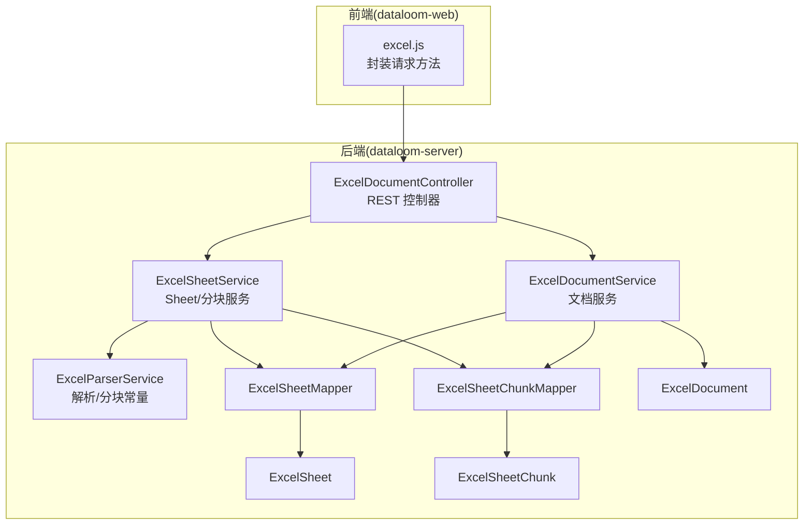
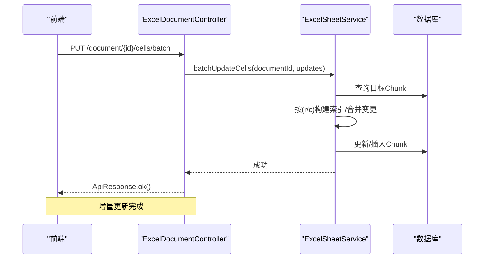
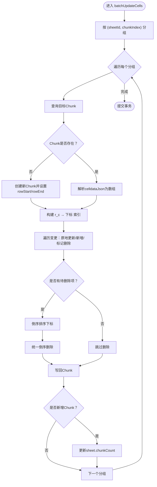
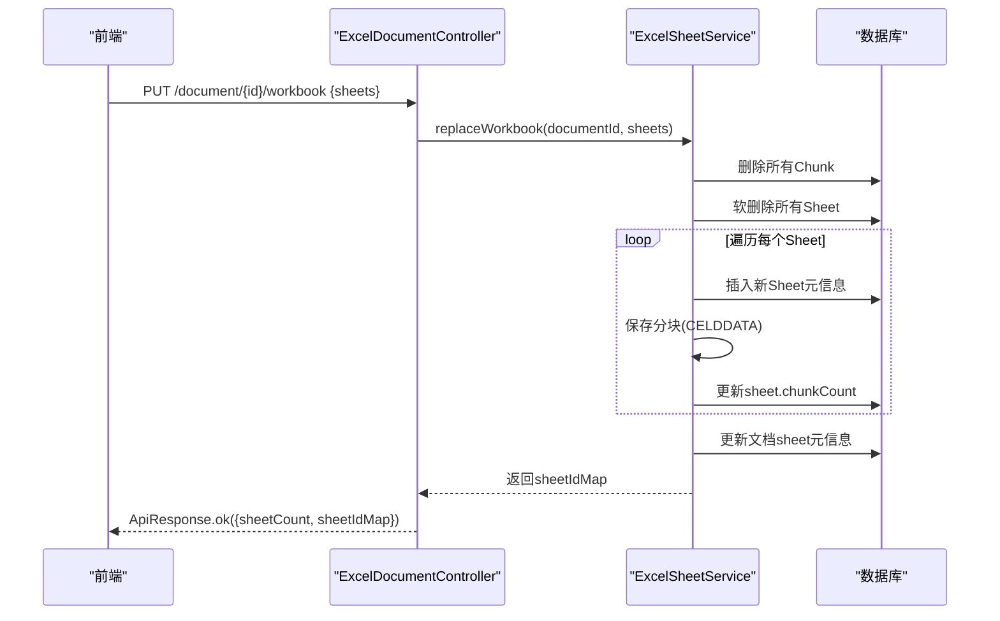
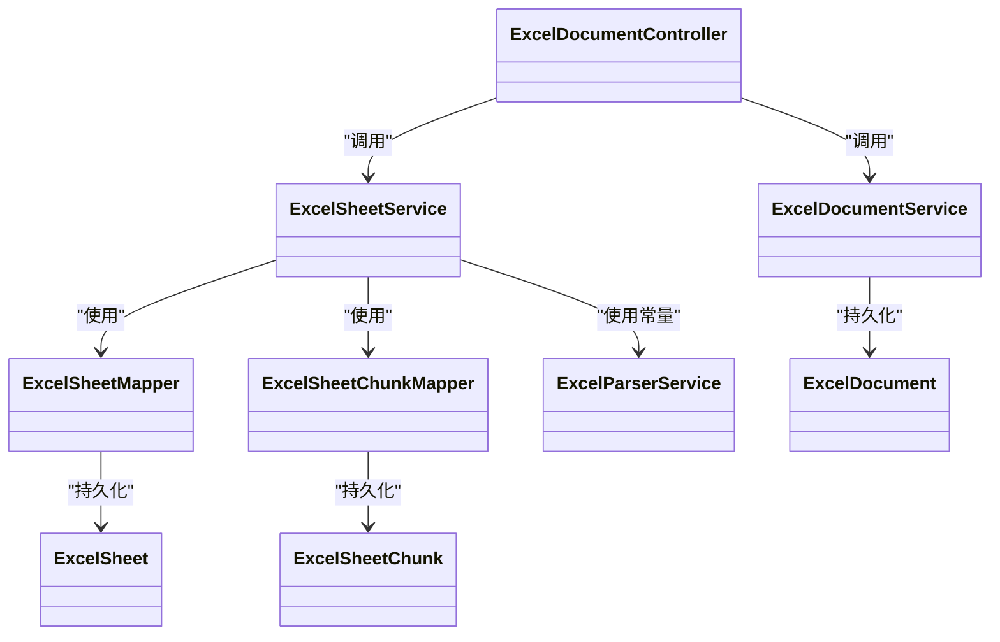
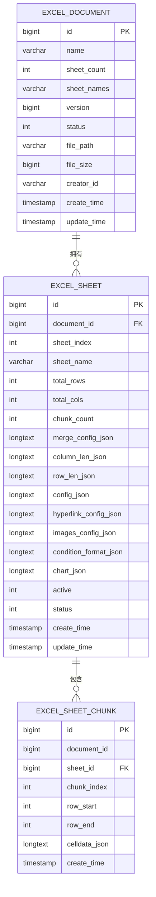

# 数据写入接口

<cite>
**本文引用的文件**
- [ExcelDocumentController.java](file://dataloom-server/src/main/java/com/demo/excel/controller/ExcelDocumentController.java)
- [ExcelSheetService.java](file://dataloom-server/src/main/java/com/demo/excel/service/ExcelSheetService.java)
- [ExcelParserService.java](file://dataloom-server/src/main/java/com/demo/excel/service/ExcelParserService.java)
- [ExcelDocument.java](file://dataloom-server/src/main/java/com/demo/excel/entity/ExcelDocument.java)
- [ExcelSheet.java](file://dataloom-server/src/main/java/com/demo/excel/entity/ExcelSheet.java)
- [ExcelSheetChunk.java](file://dataloom-server/src/main/java/com/demo/excel/entity/ExcelSheetChunk.java)
- [ExcelSheetMapper.java](file://dataloom-server/src/main/java/com/demo/excel/mapper/ExcelSheetMapper.java)
- [ExcelSheetChunkMapper.java](file://dataloom-server/src/main/java/com/demo/excel/mapper/ExcelSheetChunkMapper.java)
- [ExcelDocumentService.java](file://dataloom-server/src/main/java/com/demo/excel/service/ExcelDocumentService.java)
- [ApiResponse.java](file://dataloom-server/src/main/java/com/demo/excel/common/ApiResponse.java)
- [application.yml](file://dataloom-server/src/main/resources/application.yml)
- [schema.sql](file://dataloom-server/src/main/resources/schema.sql)
- [excel.js](file://dataloom-web/src/api/excel.js)
</cite>

## 目录
1. [简介](#简介)
2. [项目结构](#项目结构)
3. [核心组件](#核心组件)
4. [架构总览](#架构总览)
5. [详细组件分析](#详细组件分析)
6. [依赖分析](#依赖分析)
7. [性能考量](#性能考量)
8. [故障排查指南](#故障排查指南)
9. [结论](#结论)
10. [附录](#附录)

## 简介
本文面向“数据写入接口”的实现与使用，重点覆盖两类写入模式：
- 批量增量更新单元格接口：按分块粒度进行最小化写入，适用于仅单元格内容变化的场景。
- 全量快照保存接口：替换整个工作簿（Sheet 与分块），适用于结构变更、图片/图表/超链接/条件格式等非单元格内容变更的场景。

文档将深入解释变更检测与分块更新机制、全量快照保存流程、两种模式的差异与适用场景、事务与一致性保障、接口调用示例、最佳实践与错误恢复策略。

## 项目结构
后端采用 Spring Boot + MyBatis-Plus 架构，控制器负责对外暴露 REST 接口，服务层承担业务逻辑与事务控制，实体与 Mapper 负责数据持久化。前端通过 axios 封装的 API 方法调用后端接口。

图示来源
- [ExcelDocumentController.java:1-296](file://dataloom-server/src/main/java/com/demo/excel/controller/ExcelDocumentController.java#L1-L296)
- [ExcelSheetService.java:1-443](file://dataloom-server/src/main/java/com/demo/excel/service/ExcelSheetService.java#L1-L443)
- [ExcelParserService.java:1-348](file://dataloom-server/src/main/java/com/demo/excel/service/ExcelParserService.java#L1-L348)
- [ExcelSheetMapper.java:1-13](file://dataloom-server/src/main/java/com/demo/excel/mapper/ExcelSheetMapper.java#L1-L13)
- [ExcelSheetChunkMapper.java:1-13](file://dataloom-server/src/main/java/com/demo/excel/mapper/ExcelSheetChunkMapper.java#L1-L13)
- [ExcelDocumentService.java:1-119](file://dataloom-server/src/main/java/com/demo/excel/service/ExcelDocumentService.java#L1-L119)

章节来源
- [ExcelDocumentController.java:1-296](file://dataloom-server/src/main/java/com/demo/excel/controller/ExcelDocumentController.java#L1-L296)
- [ExcelSheetService.java:1-443](file://dataloom-server/src/main/java/com/demo/excel/service/ExcelSheetService.java#L1-L443)
- [ExcelParserService.java:1-348](file://dataloom-server/src/main/java/com/demo/excel/service/ExcelParserService.java#L1-L348)
- [ExcelSheetMapper.java:1-13](file://dataloom-server/src/main/java/com/demo/excel/mapper/ExcelSheetMapper.java#L1-L13)
- [ExcelSheetChunkMapper.java:1-13](file://dataloom-server/src/main/java/com/demo/excel/mapper/ExcelSheetChunkMapper.java#L1-L13)
- [ExcelDocumentService.java:1-119](file://dataloom-server/src/main/java/com/demo/excel/service/ExcelDocumentService.java#L1-L119)

## 核心组件
- 控制器层：提供 REST 接口，负责参数校验、调用服务层并返回统一响应体。
- 服务层：
  - ExcelSheetService：实现批量增量更新与全量快照保存的核心逻辑，包含事务控制。
  - ExcelParserService：定义分块大小常量，用于解析与写入的一致性。
  - ExcelDocumentService：维护文档元数据与软删除。
- 数据访问层：基于 MyBatis-Plus 的 Mapper 接口，统一通过 QueryWrapper 在 Service 层组装查询。
- 实体层：ExcelDocument、ExcelSheet、ExcelSheetChunk，分别对应三张表。

章节来源
- [ExcelDocumentController.java:1-296](file://dataloom-server/src/main/java/com/demo/excel/controller/ExcelDocumentController.java#L1-L296)
- [ExcelSheetService.java:1-443](file://dataloom-server/src/main/java/com/demo/excel/service/ExcelSheetService.java#L1-L443)
- [ExcelParserService.java:1-348](file://dataloom-server/src/main/java/com/demo/excel/service/ExcelParserService.java#L1-L348)
- [ExcelDocumentService.java:1-119](file://dataloom-server/src/main/java/com/demo/excel/service/ExcelDocumentService.java#L1-L119)

## 架构总览
写入流程分为两条主线：
- 增量更新：接收单元格变更列表，按 (sheetId_chunkIndex) 分组，逐块读取/合并/更新，最后写回。
- 全量快照：删除旧分块与软删除旧 Sheet，逐 Sheet 重建并分块写入，返回新 sheetId 映射。

图示来源
- [ExcelDocumentController.java:176-190](file://dataloom-server/src/main/java/com/demo/excel/controller/ExcelDocumentController.java#L176-L190)
- [ExcelSheetService.java:103-212](file://dataloom-server/src/main/java/com/demo/excel/service/ExcelSheetService.java#L103-L212)

章节来源
- [ExcelDocumentController.java:176-190](file://dataloom-server/src/main/java/com/demo/excel/controller/ExcelDocumentController.java#L176-L190)
- [ExcelSheetService.java:93-212](file://dataloom-server/src/main/java/com/demo/excel/service/ExcelSheetService.java#L93-L212)

## 详细组件分析

### 批量增量更新单元格（按分块最小化写入）
- 接口定义与调用
  - 控制器方法：PUT /api/excel/document/{id}/cells/batch
  - 请求体：单元格变更列表，元素包含 sheetId、行 r、列 c、值 v
  - 响应：统一 ApiResponse
- 实现要点
  - 分组策略：以 r / CHUNK_SIZE 计算 chunkIndex，按 (sheetId_chunkIndex) 分组，减少 I/O
  - 索引优化：构建 “r_c” → 数组下标 的哈希索引，查找复杂度从 O(n) 降至 O(1)
  - 原地更新/新增/延迟删除：原地更新不破坏索引；新增追加至末尾；删除标记后统一倒序清理，避免下标错位
  - 新分块创建：若目标 chunk 不存在则新建并更新 sheet.chunkCount
  - 事务：@Transactional 包裹，任一异常回滚
- 关键常量
  - CHUNK_SIZE = 1000，确保每块约 1000 行，单块 JSON 通常在数百 KB 以内，便于按需加载与写入

图示来源
- [ExcelSheetService.java:103-212](file://dataloom-server/src/main/java/com/demo/excel/service/ExcelSheetService.java#L103-L212)
- [ExcelParserService.java:43-44](file://dataloom-server/src/main/java/com/demo/excel/service/ExcelParserService.java#L43-L44)

章节来源
- [ExcelDocumentController.java:176-190](file://dataloom-server/src/main/java/com/demo/excel/controller/ExcelDocumentController.java#L176-L190)
- [ExcelSheetService.java:93-212](file://dataloom-server/src/main/java/com/demo/excel/service/ExcelSheetService.java#L93-L212)
- [ExcelParserService.java:43-44](file://dataloom-server/src/main/java/com/demo/excel/service/ExcelParserService.java#L43-L44)

### 全量快照保存（工作簿替换）
- 接口定义与调用
  - 控制器方法：PUT /api/excel/document/{id}/workbook
  - 请求体：包含 sheets 数组，每个元素为 Luckysheet 格式的快照对象
  - 响应：包含 sheetCount 与 sheetIdMap（旧索引 → 新 sheetId）
- 实现要点
  - 事务保护：删除旧分块 → 软删除旧 Sheet → 逐 Sheet 插入新记录并分块写入 → 更新文档 sheet 元信息
  - 结构处理：合并单元格、列宽、行高、超链接、图片、条件格式、图表等配置均作为 Sheet 元信息存储
  - 分块写入：与解析阶段一致，按 r / CHUNK_SIZE 分块，确保与增量更新定位逻辑一致
  - 返回映射：返回 sheetIndex → 新 sheetId 的映射，供前端后续增量保存使用
- 适用场景
  - 结构变更：增删 Sheet、改名、合并单元格、列宽/行高变化
  - 非单元格内容变更：图片/图表/超链接/条件格式等

图示来源
- [ExcelDocumentController.java:204-226](file://dataloom-server/src/main/java/com/demo/excel/controller/ExcelDocumentController.java#L204-L226)
- [ExcelSheetService.java:221-316](file://dataloom-server/src/main/java/com/demo/excel/service/ExcelSheetService.java#L221-L316)

章节来源
- [ExcelDocumentController.java:192-226](file://dataloom-server/src/main/java/com/demo/excel/controller/ExcelDocumentController.java#L192-L226)
- [ExcelSheetService.java:214-316](file://dataloom-server/src/main/java/com/demo/excel/service/ExcelSheetService.java#L214-L316)

### 两种写入模式的区别与适用场景
- 批量增量更新
  - 优点：仅写入变更涉及的分块，I/O 最小化，适合高频单元格编辑
  - 限制：不处理结构/图片/图表等非单元格配置变更
- 全量快照保存
  - 优点：可一次性替换结构与非单元格配置，保证一致性
  - 成本：涉及大量删除与重建，适合低频但全面的变更
- 性能对比
  - 增量更新：O(k) 分块写入，k 为变更分块数
  - 全量快照：O(N) 重建，N 为 Sheet 总单元格数，但可并行化与分批处理

章节来源
- [ExcelSheetService.java:93-212](file://dataloom-server/src/main/java/com/demo/excel/service/ExcelSheetService.java#L93-L212)
- [ExcelSheetService.java:214-316](file://dataloom-server/src/main/java/com/demo/excel/service/ExcelSheetService.java#L214-L316)

### 事务处理与一致性保证
- 增量更新：@Transactional 包裹，任一分组写入失败将回滚
- 全量快照：@Transactional 包裹，删除/重建过程原子性保证
- 并发控制：文档版本字段（乐观锁）用于并发写冲突检测与处理

章节来源
- [ExcelSheetService.java:103-212](file://dataloom-server/src/main/java/com/demo/excel/service/ExcelSheetService.java#L103-L212)
- [ExcelSheetService.java:221-316](file://dataloom-server/src/main/java/com/demo/excel/service/ExcelSheetService.java#L221-L316)
- [ExcelDocument.java:32-34](file://dataloom-server/src/main/java/com/demo/excel/entity/ExcelDocument.java#L32-L34)

### 接口调用示例与参数说明
- 批量增量更新
  - URL：PUT /api/excel/document/{id}/cells/batch
  - 请求体：数组，元素为对象，包含 sheetId、r、c、v
  - 示例路径：[excel.js:56-59](file://dataloom-web/src/api/excel.js#L56-L59)
- 全量快照保存
  - URL：PUT /api/excel/document/{id}/workbook
  - 请求体：对象，包含 sheets 数组，每个元素为 Luckysheet 格式的快照
  - 示例路径：[excel.js:61-64](file://dataloom-web/src/api/excel.js#L61-L64)
- 响应体
  - 统一结构：code、success、message、data
  - 示例路径：[ApiResponse.java:6-52](file://dataloom-server/src/main/java/com/demo/excel/common/ApiResponse.java#L6-L52)

章节来源
- [ExcelDocumentController.java:176-226](file://dataloom-server/src/main/java/com/demo/excel/controller/ExcelDocumentController.java#L176-L226)
- [excel.js:56-64](file://dataloom-web/src/api/excel.js#L56-L64)
- [ApiResponse.java:6-52](file://dataloom-server/src/main/java/com/demo/excel/common/ApiResponse.java#L6-L52)

## 依赖分析
- 控制器依赖服务层，服务层依赖 Mapper 与实体
- 分块大小常量在解析与写入两端保持一致，确保定位逻辑一致
- 数据库层面，三张表通过外键关联，分块表冗余存储文档 ID 以支持按文档级联删除

图示来源
- [ExcelDocumentController.java:1-296](file://dataloom-server/src/main/java/com/demo/excel/controller/ExcelDocumentController.java#L1-L296)
- [ExcelSheetService.java:1-443](file://dataloom-server/src/main/java/com/demo/excel/service/ExcelSheetService.java#L1-L443)
- [ExcelParserService.java:1-348](file://dataloom-server/src/main/java/com/demo/excel/service/ExcelParserService.java#L1-L348)
- [ExcelSheetMapper.java:1-13](file://dataloom-server/src/main/java/com/demo/excel/mapper/ExcelSheetMapper.java#L1-L13)
- [ExcelSheetChunkMapper.java:1-13](file://dataloom-server/src/main/java/com/demo/excel/mapper/ExcelSheetChunkMapper.java#L1-L13)
- [ExcelDocumentService.java:1-119](file://dataloom-server/src/main/java/com/demo/excel/service/ExcelDocumentService.java#L1-L119)

章节来源
- [ExcelDocumentController.java:1-296](file://dataloom-server/src/main/java/com/demo/excel/controller/ExcelDocumentController.java#L1-L296)
- [ExcelSheetService.java:1-443](file://dataloom-server/src/main/java/com/demo/excel/service/ExcelSheetService.java#L1-L443)
- [ExcelParserService.java:1-348](file://dataloom-server/src/main/java/com/demo/excel/service/ExcelParserService.java#L1-L348)
- [ExcelSheetMapper.java:1-13](file://dataloom-server/src/main/java/com/demo/excel/mapper/ExcelSheetMapper.java#L1-L13)
- [ExcelSheetChunkMapper.java:1-13](file://dataloom-server/src/main/java/com/demo/excel/mapper/ExcelSheetChunkMapper.java#L1-L13)
- [ExcelDocumentService.java:1-119](file://dataloom-server/src/main/java/com/demo/excel/service/ExcelDocumentService.java#L1-L119)

## 性能考量
- 分块大小：CHUNK_SIZE = 1000，平衡单块体积与 I/O 次数
- 索引优化：按 “r_c” 构建哈希索引，降低查找与更新成本
- 延迟删除：统一倒序删除，避免索引重建与下标错位
- 事务粒度：按分组或按工作簿进行事务控制，避免长事务阻塞
- 前端配合：全量快照后根据返回的 sheetIdMap 使用增量更新，减少后续写入压力

章节来源
- [ExcelParserService.java:43-44](file://dataloom-server/src/main/java/com/demo/excel/service/ExcelParserService.java#L43-L44)
- [ExcelSheetService.java:146-195](file://dataloom-server/src/main/java/com/demo/excel/service/ExcelSheetService.java#L146-L195)

## 故障排查指南
- 增量更新失败
  - 检查请求体格式是否正确（sheetId/r/c/v）
  - 查看日志中“解析 chunk 失败”提示，确认 celldataJson 格式
  - 确认数据库连接与事务未被外部中断
- 全量快照失败
  - 确认 sheets 数组非空且结构合法
  - 检查数据库权限与索引是否存在
  - 观察日志中“工作簿全量保存失败”，定位具体异常
- 一致性问题
  - 若出现并发写入冲突，检查文档版本号（乐观锁）是否被其他进程更新
- 前端调用
  - 参考封装方法：[excel.js:56-64](file://dataloom-web/src/api/excel.js#L56-L64)

章节来源
- [ExcelDocumentController.java:176-226](file://dataloom-server/src/main/java/com/demo/excel/controller/ExcelDocumentController.java#L176-L226)
- [ExcelSheetService.java:103-212](file://dataloom-server/src/main/java/com/demo/excel/service/ExcelSheetService.java#L103-L212)
- [excel.js:56-64](file://dataloom-web/src/api/excel.js#L56-L64)

## 结论
- 批量增量更新适合高频单元格编辑，性能优异且最小化写入范围
- 全量快照适合结构与非单元格配置变更，保证一致性但成本较高
- 通过分块与索引优化、事务控制与乐观锁，系统在大数据量场景下仍具备良好稳定性
- 建议：结构频繁变更使用全量快照，日常编辑使用增量更新，并结合返回的 sheetIdMap 进行后续增量保存

## 附录
- 数据模型关系

图示来源
- [schema.sql:8-66](file://dataloom-server/src/main/resources/schema.sql#L8-L66)
- [ExcelDocument.java:15-54](file://dataloom-server/src/main/java/com/demo/excel/entity/ExcelDocument.java#L15-L54)
- [ExcelSheet.java:14-76](file://dataloom-server/src/main/java/com/demo/excel/entity/ExcelSheet.java#L14-L76)
- [ExcelSheetChunk.java:18-52](file://dataloom-server/src/main/java/com/demo/excel/entity/ExcelSheetChunk.java#L18-L52)

- 环境与配置
  - 数据源：H2 内存数据库（演示），生产环境可切换为 MySQL
  - 初始化：启动时执行 schema.sql 建表
  - 日志：开启 com.demo.excel 包日志输出

章节来源
- [application.yml:1-51](file://dataloom-server/src/main/resources/application.yml#L1-L51)
- [schema.sql:1-124](file://dataloom-server/src/main/resources/schema.sql#L1-L124)