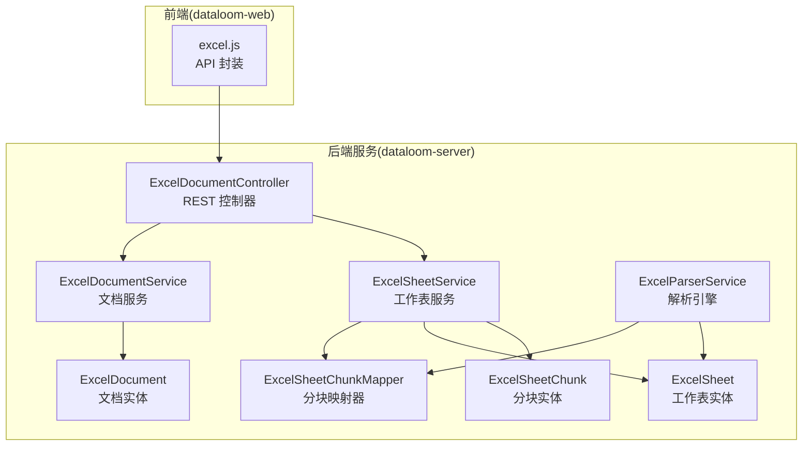
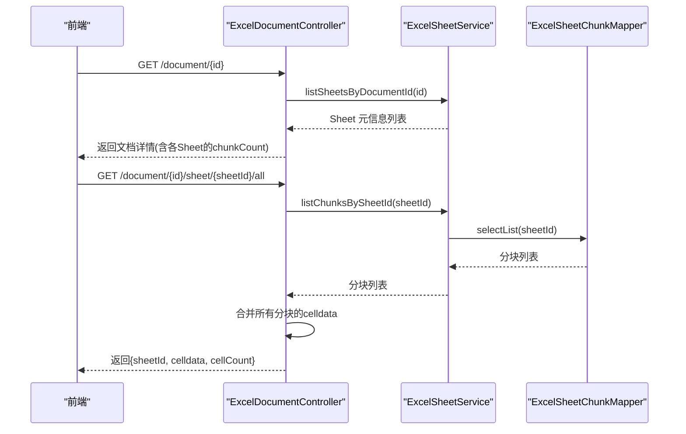
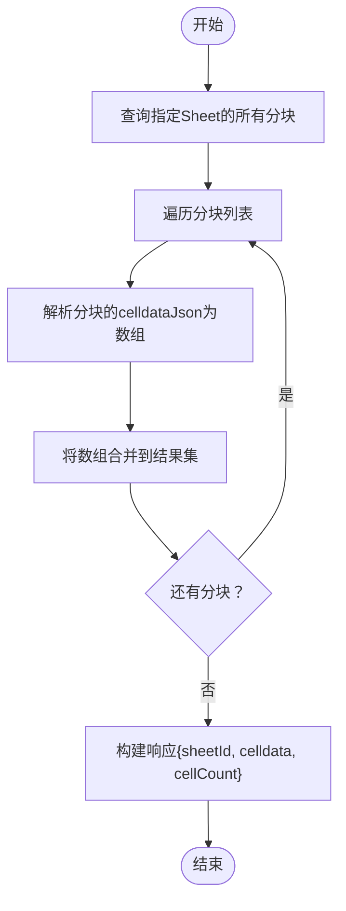
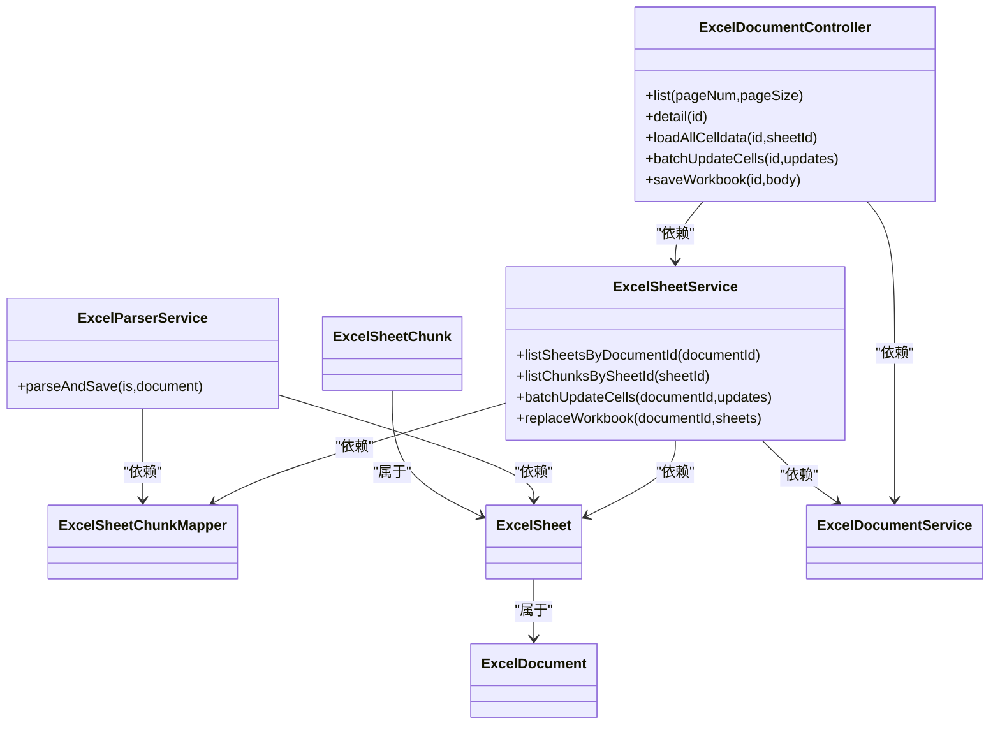

# 数据加载接口

<cite>
**本文引用的文件**
- [ExcelDocumentController.java](file://dataloom-server/src/main/java/com/demo/excel/controller/ExcelDocumentController.java)
- [ExcelSheetService.java](file://dataloom-server/src/main/java/com/demo/excel/service/ExcelSheetService.java)
- [ExcelParserService.java](file://dataloom-server/src/main/java/com/demo/excel/service/ExcelParserService.java)
- [ExcelSheetChunk.java](file://dataloom-server/src/main/java/com/demo/excel/entity/ExcelSheetChunk.java)
- [ExcelSheet.java](file://dataloom-server/src/main/java/com/demo/excel/entity/ExcelSheet.java)
- [ExcelDocument.java](file://dataloom-server/src/main/java/com/demo/excel/entity/ExcelDocument.java)
- [ApiResponse.java](file://dataloom-server/src/main/java/com/demo/excel/common/ApiResponse.java)
- [ExcelSheetChunkMapper.java](file://dataloom-server/src/main/java/com/demo/excel/mapper/ExcelSheetChunkMapper.java)
- [schema.sql](file://dataloom-server/src/main/resources/schema.sql)
- [application.yml](file://dataloom-server/src/main/resources/application.yml)
- [excel.js](file://dataloom-web/src/api/excel.js)
- [ExcelSheetServiceTest.java](file://dataloom-server/src/test/java/com/demo/excel/service/ExcelSheetServiceTest.java)
</cite>

## 目录
1. [简介](#简介)
2. [项目结构](#项目结构)
3. [核心组件](#核心组件)
4. [架构概览](#架构概览)
5. [详细组件分析](#详细组件分析)
6. [依赖分析](#依赖分析)
7. [性能考虑](#性能考虑)
8. [故障排查指南](#故障排查指南)
9. [结论](#结论)
10. [附录](#附录)

## 简介
本文档围绕“数据加载接口”进行深入说明，重点覆盖：
- 工作表数据加载的实现机制，包括分块数据的合并与 celldata 结构说明
- 全量数据加载接口的工作原理，包括大数据量处理与内存优化策略
- 数据加载过程中的缓存机制与性能优化技巧
- 数据格式转换与类型处理逻辑
- 数据加载的完整流程示例，包括请求参数、响应数据结构与错误处理
- 大数据量场景下的最佳实践与性能调优建议

## 项目结构
后端采用 Spring Boot + MyBatis-Plus 架构，数据模型分为三层：
- 文档层：仅存储元数据，不包含单元格数据
- Sheet 层：存储工作表元信息与少量配置
- 分块层：将单元格数据按固定行数切分为多个块，便于按需加载与内存控制

**图表来源**
- [ExcelDocumentController.java:1-296](file://dataloom-server/src/main/java/com/demo/excel/controller/ExcelDocumentController.java#L1-L296)
- [ExcelSheetService.java:1-443](file://dataloom-server/src/main/java/com/demo/excel/service/ExcelSheetService.java#L1-L443)
- [ExcelParserService.java:1-348](file://dataloom-server/src/main/java/com/demo/excel/service/ExcelParserService.java#L1-L348)
- [ExcelSheetChunk.java:1-53](file://dataloom-server/src/main/java/com/demo/excel/entity/ExcelSheetChunk.java#L1-L53)
- [ExcelSheet.java:1-77](file://dataloom-server/src/main/java/com/demo/excel/entity/ExcelSheet.java#L1-L77)
- [ExcelDocument.java:1-55](file://dataloom-server/src/main/java/com/demo/excel/entity/ExcelDocument.java#L1-L55)
- [ExcelSheetChunkMapper.java:1-13](file://dataloom-server/src/main/java/com/demo/excel/mapper/ExcelSheetChunkMapper.java#L1-L13)
- [excel.js:1-79](file://dataloom-web/src/api/excel.js#L1-L79)

**章节来源**
- [ExcelDocumentController.java:1-296](file://dataloom-server/src/main/java/com/demo/excel/controller/ExcelDocumentController.java#L1-L296)
- [ExcelSheetService.java:1-443](file://dataloom-server/src/main/java/com/demo/excel/service/ExcelSheetService.java#L1-L443)
- [ExcelParserService.java:1-348](file://dataloom-server/src/main/java/com/demo/excel/service/ExcelParserService.java#L1-L348)
- [schema.sql:1-124](file://dataloom-server/src/main/resources/schema.sql#L1-L124)

## 核心组件
- 数据加载控制器：提供文档列表、文档详情、全量 celldata 加载、批量增量更新等接口
- 工作表服务：负责分块查询、全量替换工作簿、批量增量更新、celldata 规范化与矩阵转 celldata
- 解析引擎：基于 Apache POI 流式解析 Excel，按固定行数分块写入数据库
- 实体与映射：文档、工作表、分块三张表，分块表存储 celldata JSON
- 统一响应体：封装标准的响应结构，便于前后端交互

**章节来源**
- [ExcelDocumentController.java:37-161](file://dataloom-server/src/main/java/com/demo/excel/controller/ExcelDocumentController.java#L37-L161)
- [ExcelSheetService.java:46-346](file://dataloom-server/src/main/java/com/demo/excel/service/ExcelSheetService.java#L46-L346)
- [ExcelParserService.java:43-87](file://dataloom-server/src/main/java/com/demo/excel/service/ExcelParserService.java#L43-L87)
- [ExcelSheetChunk.java:9-53](file://dataloom-server/src/main/java/com/demo/excel/entity/ExcelSheetChunk.java#L9-L53)
- [ApiResponse.java:6-52](file://dataloom-server/src/main/java/com/demo/excel/common/ApiResponse.java#L6-L52)

## 架构概览
数据加载接口遵循“元信息先行、数据按需”的设计原则：
- 前端打开文档时先调用文档详情接口，获取各 Sheet 的元信息与分块数量
- 再根据需要选择加载全量 celldata 或按需分块加载
- 后端通过分块表合并 celldata，前端据此渲染表格

**图表来源**
- [ExcelDocumentController.java:77-161](file://dataloom-server/src/main/java/com/demo/excel/controller/ExcelDocumentController.java#L77-L161)
- [ExcelSheetService.java:67-72](file://dataloom-server/src/main/java/com/demo/excel/service/ExcelSheetService.java#L67-L72)
- [ExcelSheetChunkMapper.java:11-12](file://dataloom-server/src/main/java/com/demo/excel/mapper/ExcelSheetChunkMapper.java#L11-L12)

## 详细组件分析

### 分块数据合并与 celldata 结构
- 分块依据：每块约 1000 行，块索引由行号整除确定，确保与增量更新时的定位逻辑一致
- celldata 结构：与 Luckysheet 兼容的数组格式，元素为包含 r、c、v 的对象；v 包含值、显示文本与单元格类型信息
- 合并策略：加载全量 celldata 时，按块顺序拼接所有分块的 celldata 数组

**图表来源**
- [ExcelDocumentController.java:139-161](file://dataloom-server/src/main/java/com/demo/excel/controller/ExcelDocumentController.java#L139-L161)
- [ExcelSheetService.java:67-72](file://dataloom-server/src/main/java/com/demo/excel/service/ExcelSheetService.java#L67-L72)
- [ExcelSheetChunk.java:41-47](file://dataloom-server/src/main/java/com/demo/excel/entity/ExcelSheetChunk.java#L41-L47)

**章节来源**
- [ExcelParserService.java:142-200](file://dataloom-server/src/main/java/com/demo/excel/service/ExcelParserService.java#L142-L200)
- [ExcelSheetChunk.java:41-47](file://dataloom-server/src/main/java/com/demo/excel/entity/ExcelSheetChunk.java#L41-L47)
- [ExcelDocumentController.java:139-161](file://dataloom-server/src/main/java/com/demo/excel/controller/ExcelDocumentController.java#L139-L161)

### 全量数据加载接口工作原理
- 接口路径：GET /api/excel/document/{id}/sheet/{sheetId}/all
- 输入参数：文档 ID、工作表 ID
- 处理流程：
  - 查询该 Sheet 的所有分块
  - 逐块解析 celldataJson 并合并
  - 返回合并后的 celldata 与统计信息
- 适用场景：前端打开文档后一次性拉取整个 Sheet 的单元格数据；对于超大 Sheet（10 万行以上），建议评估性能后使用

**章节来源**
- [ExcelDocumentController.java:139-161](file://dataloom-server/src/main/java/com/demo/excel/controller/ExcelDocumentController.java#L139-L161)
- [ExcelSheetService.java:67-72](file://dataloom-server/src/main/java/com/demo/excel/service/ExcelSheetService.java#L67-L72)

### 大数据量处理与内存优化策略
- 分块存储：每块约 1000 行，单块 JSON 通常在几百 KB 以内，避免单行过大导致内存溢出
- 按需加载：前端先获取元信息与分块数量，再按需加载 celldata
- 增量更新：批量增量更新按块分组，减少 I/O 与内存占用
- 解析优化：POI 流式解析，避免整体加载入内存

**章节来源**
- [ExcelParserService.java:43-87](file://dataloom-server/src/main/java/com/demo/excel/service/ExcelParserService.java#L43-L87)
- [ExcelSheetService.java:103-212](file://dataloom-server/src/main/java/com/demo/excel/service/ExcelSheetService.java#L103-L212)
- [application.yml:19-23](file://dataloom-server/src/main/resources/application.yml#L19-L23)

### 缓存机制与性能优化技巧
- 前端缓存：文档详情接口返回的元信息与分块数量可用于前端缓存，避免重复请求
- 后端缓存：可结合 Redis 对热点文档的元信息进行缓存（建议）
- 数据库索引：分块表按 sheet_id 与 (sheet_id, chunk_index) 建立索引，提升查询效率
- 批量操作：批量增量更新按块分组，减少数据库往返次数

**章节来源**
- [schema.sql:110-123](file://dataloom-server/src/main/resources/schema.sql#L110-L123)
- [ExcelSheetService.java:103-212](file://dataloom-server/src/main/java/com/demo/excel/service/ExcelSheetService.java#L103-L212)

### 数据格式转换与类型处理逻辑
- 类型映射：字符串、数值、布尔、公式分别映射到 v、m、ct 等字段
- 日期处理：数值型日期转换为特定格式字符串
- 公式处理：公式单元格保留原公式字符串，并尝试计算结果
- 空值过滤：空单元格与空值对象会被过滤掉，避免冗余数据

**章节来源**
- [ExcelParserService.java:205-281](file://dataloom-server/src/main/java/com/demo/excel/service/ExcelParserService.java#L205-L281)
- [ExcelSheetService.java:356-386](file://dataloom-server/src/main/java/com/demo/excel/service/ExcelSheetService.java#L356-L386)

### 数据加载完整流程示例
- 请求参数
  - 文档 ID：路径参数
  - 工作表 ID：路径参数
- 响应数据结构
  - sheetId：目标工作表 ID
  - celldata：合并后的单元格数组
  - cellCount：单元格总数
- 错误处理
  - 文档不存在：返回 404
  - 分块解析异常：记录警告日志并继续处理其他分块

**章节来源**
- [ExcelDocumentController.java:139-161](file://dataloom-server/src/main/java/com/demo/excel/controller/ExcelDocumentController.java#L139-L161)
- [ExcelDocumentController.java:77-82](file://dataloom-server/src/main/java/com/demo/excel/controller/ExcelDocumentController.java#L77-L82)

## 依赖分析
- 控制器依赖服务层，服务层依赖映射器与实体
- 解析引擎与服务层共同维护分块表
- 前端通过 API 封装调用后端接口

**图表来源**
- [ExcelDocumentController.java:1-296](file://dataloom-server/src/main/java/com/demo/excel/controller/ExcelDocumentController.java#L1-L296)
- [ExcelSheetService.java:1-443](file://dataloom-server/src/main/java/com/demo/excel/service/ExcelSheetService.java#L1-L443)
- [ExcelParserService.java:1-348](file://dataloom-server/src/main/java/com/demo/excel/service/ExcelParserService.java#L1-L348)
- [ExcelSheetChunk.java:1-53](file://dataloom-server/src/main/java/com/demo/excel/entity/ExcelSheetChunk.java#L1-L53)
- [ExcelSheet.java:1-77](file://dataloom-server/src/main/java/com/demo/excel/entity/ExcelSheet.java#L1-L77)
- [ExcelDocument.java:1-55](file://dataloom-server/src/main/java/com/demo/excel/entity/ExcelDocument.java#L1-L55)
- [ExcelSheetChunkMapper.java:1-13](file://dataloom-server/src/main/java/com/demo/excel/mapper/ExcelSheetChunkMapper.java#L1-L13)

**章节来源**
- [ExcelDocumentController.java:1-296](file://dataloom-server/src/main/java/com/demo/excel/controller/ExcelDocumentController.java#L1-L296)
- [ExcelSheetService.java:1-443](file://dataloom-server/src/main/java/com/demo/excel/service/ExcelSheetService.java#L1-L443)
- [ExcelParserService.java:1-348](file://dataloom-server/src/main/java/com/demo/excel/service/ExcelParserService.java#L1-L348)

## 性能考虑
- 分块大小：默认 1000 行，可根据数据密度调整
- 数据库索引：分块表按 sheet_id 与 (sheet_id, chunk_index) 建立索引
- 批量写入：解析与增量更新均采用批量操作减少 I/O
- 前端按需加载：先获取元信息与分块数量，再按需加载 celldata
- 大数据量场景：建议使用分块加载而非全量加载，避免内存压力

[本节为通用性能建议，不直接分析具体文件]

## 故障排查指南
- 文档不存在：检查文档 ID 是否正确，确认文档状态
- 分块解析失败：查看日志中关于分块解析失败的警告信息，确认 celldataJson 格式
- 公式计算异常：公式单元格可能降级为字符串，检查公式有效性
- 增量更新失败：确认 updates 参数格式与块索引计算逻辑一致

**章节来源**
- [ExcelDocumentController.java:77-82](file://dataloom-server/src/main/java/com/demo/excel/controller/ExcelDocumentController.java#L77-L82)
- [ExcelDocumentController.java:151-153](file://dataloom-server/src/main/java/com/demo/excel/controller/ExcelDocumentController.java#L151-L153)
- [ExcelParserService.java:246-277](file://dataloom-server/src/main/java/com/demo/excel/service/ExcelParserService.java#L246-L277)
- [ExcelSheetService.java:103-212](file://dataloom-server/src/main/java/com/demo/excel/service/ExcelSheetService.java#L103-L212)

## 结论
数据加载接口通过“元信息先行、分块存储、按需加载”的设计，在保证功能完整性的同时兼顾了性能与可扩展性。分块机制有效缓解了大数据量场景下的内存与网络压力，celldata 结构与类型处理逻辑确保了与前端框架的兼容性。配合合理的索引与批量操作策略，可在生产环境中稳定运行。

[本节为总结性内容，不直接分析具体文件]

## 附录

### API 定义与示例
- 文档详情
  - 方法：GET
  - 路径：/api/excel/document/{id}
  - 说明：返回文档基本信息与各 Sheet 的元信息（不含 celldata）
- 全量 celldata 加载
  - 方法：GET
  - 路径：/api/excel/document/{id}/sheet/{sheetId}/all
  - 说明：合并所有分块返回 celldata
- 批量增量更新单元格
  - 方法：PUT
  - 路径：/api/excel/document/{id}/cells/batch
  - 说明：按块分组更新，仅影响相关分块
- 全量快照保存
  - 方法：PUT
  - 路径：/api/excel/document/{id}/workbook
  - 说明：替换整个工作簿，返回新的 sheetId 映射

**章节来源**
- [ExcelDocumentController.java:77-226](file://dataloom-server/src/main/java/com/demo/excel/controller/ExcelDocumentController.java#L77-L226)
- [excel.js:39-64](file://dataloom-web/src/api/excel.js#L39-L64)

### 数据模型与索引
- 文档表：仅存元数据
- Sheet 表：存储元信息与少量配置
- 分块表：存储 celldata JSON，按 sheet_id 与 (sheet_id, chunk_index) 建立索引

**章节来源**
- [schema.sql:8-66](file://dataloom-server/src/main/resources/schema.sql#L8-L66)
- [ExcelSheetChunk.java:9-53](file://dataloom-server/src/main/java/com/demo/excel/entity/ExcelSheetChunk.java#L9-L53)
- [ExcelSheet.java:9-77](file://dataloom-server/src/main/java/com/demo/excel/entity/ExcelSheet.java#L9-L77)
- [ExcelDocument.java:9-55](file://dataloom-server/src/main/java/com/demo/excel/entity/ExcelDocument.java#L9-L55)

### 单元测试参考
- 全量替换工作簿会重建分块并更新文档元信息
- 验证分块数量、celldata 内容与行列数计算

**章节来源**
- [ExcelSheetServiceTest.java:44-107](file://dataloom-server/src/test/java/com/demo/excel/service/ExcelSheetServiceTest.java#L44-L107)