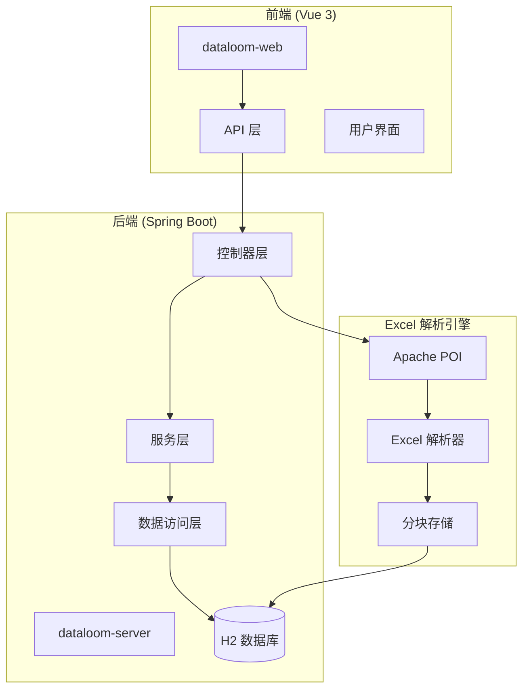
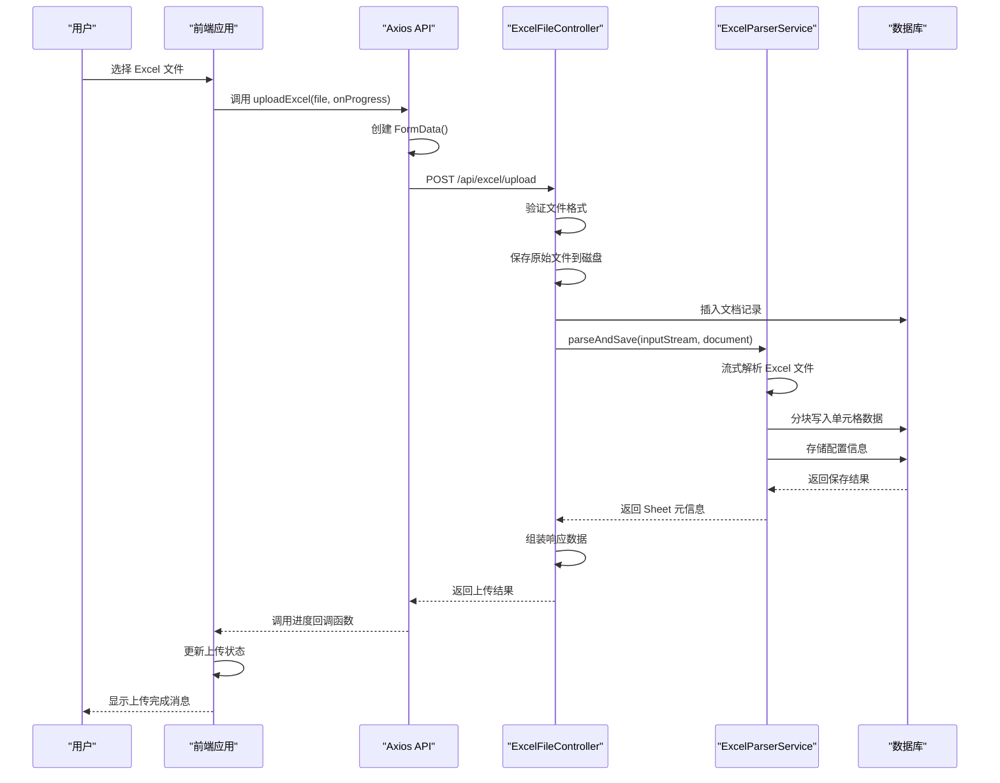
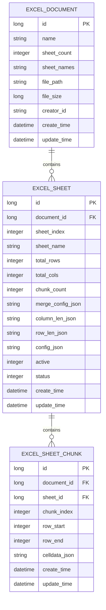
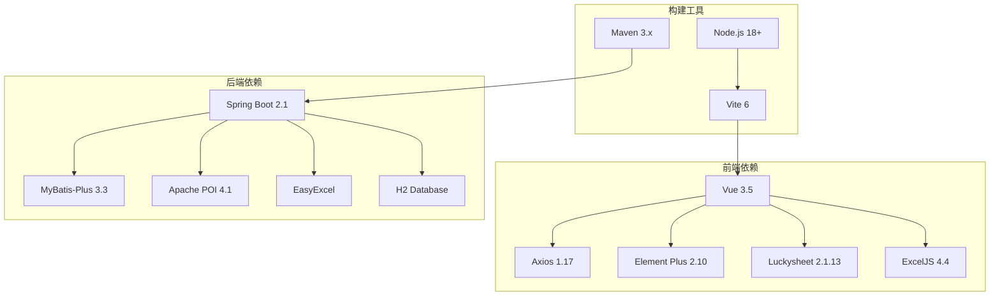
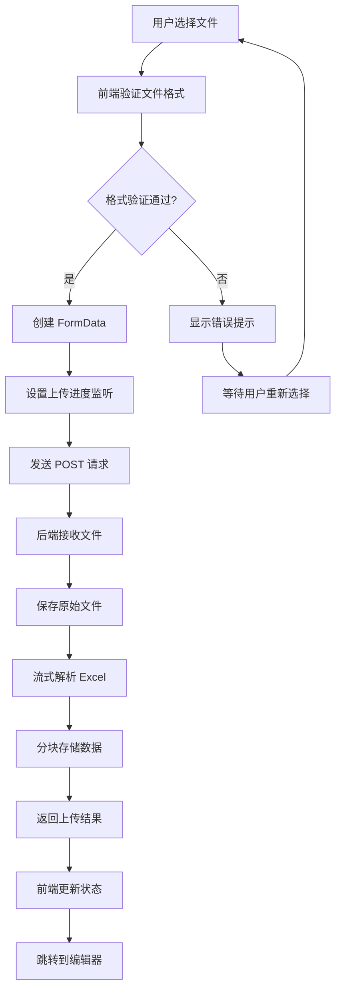

# 文件上传接口

<cite>
**本文档引用的文件**
- [excel.js](file://dataloom-web/src/api/excel.js)
- [ExcelFileController.java](file://dataloom-server/src/main/java/com/demo/excel/controller/ExcelFileController.java)
- [ExcelParserService.java](file://dataloom-server/src/main/java/com/demo/excel/service/ExcelParserService.java)
- [application.yml](file://dataloom-server/src/main/resources/application.yml)
- [ExcelDashboard.vue](file://dataloom-web/src/views/ExcelDashboard.vue)
- [ApiResponse.java](file://dataloom-server/src/main/java/com/demo/excel/common/ApiResponse.java)
- [ExcelDocument.java](file://dataloom-server/src/main/java/com/demo/excel/entity/ExcelDocument.java)
- [ExcelSheet.java](file://dataloom-server/src/main/java/com/demo/excel/entity/ExcelSheet.java)
- [README.md](file://README.md)
</cite>

## 目录
1. [简介](#简介)
2. [项目结构](#项目结构)
3. [核心组件](#核心组件)
4. [架构概览](#架构概览)
5. [详细组件分析](#详细组件分析)
6. [依赖关系分析](#依赖关系分析)
7. [性能考虑](#性能考虑)
8. [故障排除指南](#故障排除指南)
9. [结论](#结论)

## 简介

DataLoom 是一个从零构建的在线 Excel 协作系统，支持上传、解析、在线编辑和导出功能。本文档专注于文件上传接口的实现机制，特别是 Excel 文件上传的完整流程，包括 multipart/form-data 格式的构建、文件数据的序列化、进度回调函数的实现原理以及错误处理机制。

## 项目结构

DataLoom 采用前后端分离架构，主要包含以下关键组件：



**图表来源**
- [excel.js:1-79](file://dataloom-web/src/api/excel.js#L1-L79)
- [ExcelFileController.java:1-141](file://dataloom-server/src/main/java/com/demo/excel/controller/ExcelFileController.java#L1-L141)

**章节来源**
- [README.md:190-242](file://README.md#L190-L242)

## 核心组件

### 前端上传组件

前端使用 Axios 创建 API 客户端，专门处理 Excel 文件上传：

- **基础配置**：设置基础 URL 为 `/api/excel`，超时时间为 300 秒
- **文件上传函数**：`uploadExcel(file, onProgress)` 支持进度回调
- **Multipart 格式**：自动设置 `Content-Type: multipart/form-data`

### 后端控制器

后端控制器负责接收和处理上传的 Excel 文件：

- **路径映射**：`/api/excel/upload`
- **文件验证**：支持 `.xlsx` 和 `.xls` 格式
- **流式解析**：使用 EasyExcel 和 Apache POI 进行流式解析
- **分块存储**：将数据按 1000 行为单位分块存储

### 解析服务

Excel 解析服务实现核心的数据处理逻辑：

- **分块策略**：每 1000 行为一个数据块
- **单元格处理**：支持字符串、数字、日期、布尔值、公式等多种数据类型
- **配置存储**：合并单元格、列宽、行高等配置信息

**章节来源**
- [excel.js:1-79](file://dataloom-web/src/api/excel.js#L1-L79)
- [ExcelFileController.java:1-141](file://dataloom-server/src/main/java/com/demo/excel/controller/ExcelFileController.java#L1-L141)
- [ExcelParserService.java:1-348](file://dataloom-server/src/main/java/com/demo/excel/service/ExcelParserService.java#L1-L348)

## 架构概览

文件上传的整体架构如下：



**图表来源**
- [excel.js:13-25](file://dataloom-web/src/api/excel.js#L13-L25)
- [ExcelFileController.java:70-116](file://dataloom-server/src/main/java/com/demo/excel/controller/ExcelFileController.java#L70-L116)
- [ExcelParserService.java:66-87](file://dataloom-server/src/main/java/com/demo/excel/service/ExcelParserService.java#L66-L87)

## 详细组件分析

### 前端上传实现

#### Multipart/Form-Data 构建

前端使用 FormData 对象构建 multipart/form-data 格式：

```javascript
const formData = new FormData()
formData.append('file', file)
```

这种构建方式的优势：
- 自动设置正确的 Content-Type 头部
- 支持文件流式传输
- 兼容进度监控

#### 进度回调函数实现

进度回调函数的工作原理：

```javascript
onUploadProgress: (event) => {
  if (onProgress && event.total) {
    onProgress(Math.round((event.loaded / event.total) * 100))
  }
}
```

进度计算逻辑：
- `event.loaded`：已传输的字节数
- `event.total`：总字节数
- 百分比计算：`(loaded / total) * 100`

#### 文件格式验证

前端在文件选择时进行格式验证：

```html
<input
  ref="fileInput"
  class="file-input"
  type="file"
  accept=".xlsx,.xls"
  @change="handleFileChange"
/>
```

支持的文件格式：
- `.xlsx`：Office Open XML 格式
- `.xls`：传统 Excel 97-2003 格式

**章节来源**
- [excel.js:13-25](file://dataloom-web/src/api/excel.js#L13-L25)
- [ExcelDashboard.vue:16-22](file://dataloom-web/src/views/ExcelDashboard.vue#L16-L22)

### 后端上传处理

#### 文件接收和验证

后端控制器接收上传文件并进行验证：

```java
@PostMapping("/upload")
public ApiResponse<?> upload(@RequestParam("file") MultipartFile file) {
    // 验证文件类型
    String originalName = file.getOriginalFilename();
    String fileExtension = getFileExtension(originalName);
    
    if (!isValidExcelFormat(fileExtension)) {
        return ApiResponse.fail("不支持的文件格式");
    }
    
    // 验证文件大小
    if (file.getSize() > MAX_FILE_SIZE) {
        return ApiResponse.fail("文件大小超过限制");
    }
}
```

#### 流式解析实现

使用 Apache POI 进行流式解析：

```java
try (Workbook workbook = WorkbookFactory.create(is)) {
    int sheetTotal = workbook.getNumberOfSheets();
    
    for (int si = 0; si < sheetTotal; si++) {
        Sheet sheet = workbook.getSheetAt(si);
        // 处理每个 Sheet
    }
}
```

分块存储策略：
- 每 1000 行为一个数据块
- 单元格数据以 JSON 格式存储
- 配置信息单独存储

#### 错误处理机制

统一的错误处理模式：

```java
try {
    // 主要业务逻辑
} catch (Exception e) {
    log.error("上传失败", e);
    return ApiResponse.fail("上传失败: " + e.getMessage());
}
```

**章节来源**
- [ExcelFileController.java:70-116](file://dataloom-server/src/main/java/com/demo/excel/controller/ExcelFileController.java#L70-L116)
- [ExcelParserService.java:66-87](file://dataloom-server/src/main/java/com/demo/excel/service/ExcelParserService.java#L66-L87)

### 数据模型设计

#### 文档实体



**图表来源**
- [ExcelDocument.java:1-55](file://dataloom-server/src/main/java/com/demo/excel/entity/ExcelDocument.java#L1-L55)
- [ExcelSheet.java:1-77](file://dataloom-server/src/main/java/com/demo/excel/entity/ExcelSheet.java#L1-L77)

**章节来源**
- [ExcelDocument.java:1-55](file://dataloom-server/src/main/java/com/demo/excel/entity/ExcelDocument.java#L1-L55)
- [ExcelSheet.java:1-77](file://dataloom-server/src/main/java/com/demo/excel/entity/ExcelSheet.java#L1-L77)

## 依赖关系分析

### 技术栈依赖



**图表来源**
- [package.json:12-26](file://dataloom-web/package.json#L12-L26)
- [README.md:74-84](file://README.md#L74-L84)

### API 调用流程



**图表来源**
- [excel.js:13-25](file://dataloom-web/src/api/excel.js#L13-L25)
- [ExcelDashboard.vue:146-172](file://dataloom-web/src/views/ExcelDashboard.vue#L146-L172)

**章节来源**
- [README.md:190-215](file://README.md#L190-L215)

## 性能考虑

### 分块存储优化

DataLoom 采用分块存储策略来优化大文件处理：

- **分块大小**：1000 行/块
- **内存占用**：单次只处理 1000 行数据
- **并发处理**：不同块可以并行处理
- **懒加载**：前端只加载需要的块

### 流式解析优势

使用 Apache POI 进行流式解析：

- **内存效率**：避免将整个 Excel 文件加载到内存
- **处理速度**：逐行处理，减少等待时间
- **扩展性**：支持处理大型 Excel 文件

### 前端性能优化

- **进度反馈**：实时显示上传进度
- **状态管理**：合理管理上传状态
- **错误恢复**：提供友好的错误处理

## 故障排除指南

### 常见错误及解决方案

#### 文件格式错误

**问题**：用户选择了不支持的文件格式

**解决方案**：
1. 前端在文件选择时进行格式验证
2. 后端再次验证文件扩展名
3. 显示清晰的错误提示

#### 文件大小超限

**问题**：上传的文件超过大小限制

**解决方案**：
1. 检查 `application.yml` 中的配置
2. 前端显示文件大小限制
3. 提供压缩建议

#### 解析失败

**问题**：Excel 文件解析过程中出现异常

**解决方案**：
1. 检查文件完整性
2. 验证 Excel 文件格式
3. 查看后端日志获取详细错误信息

#### 进度回调无效

**问题**：进度回调函数没有触发

**解决方案**：
1. 确认 `onUploadProgress` 配置正确
2. 检查网络连接稳定性
3. 验证文件大小是否过大

**章节来源**
- [application.yml:19-24](file://dataloom-server/src/main/resources/application.yml#L19-L24)
- [ExcelFileController.java:112-116](file://dataloom-server/src/main/java/com/demo/excel/controller/ExcelFileController.java#L112-L116)

## 结论

DataLoom 的文件上传接口实现了完整的 Excel 文件处理流程，具有以下特点：

1. **完整的文件格式支持**：同时支持 `.xlsx` 和 `.xls` 格式
2. **高效的处理机制**：采用流式解析和分块存储策略
3. **良好的用户体验**：提供实时进度反馈和错误处理
4. **可靠的架构设计**：前后端分离，职责明确
5. **可扩展的性能优化**：支持大规模数据处理

该接口为 DataLoom 的核心功能奠定了坚实基础，使得用户能够高效地上传、处理和编辑大型 Excel 文件，同时保持系统的稳定性和性能表现。