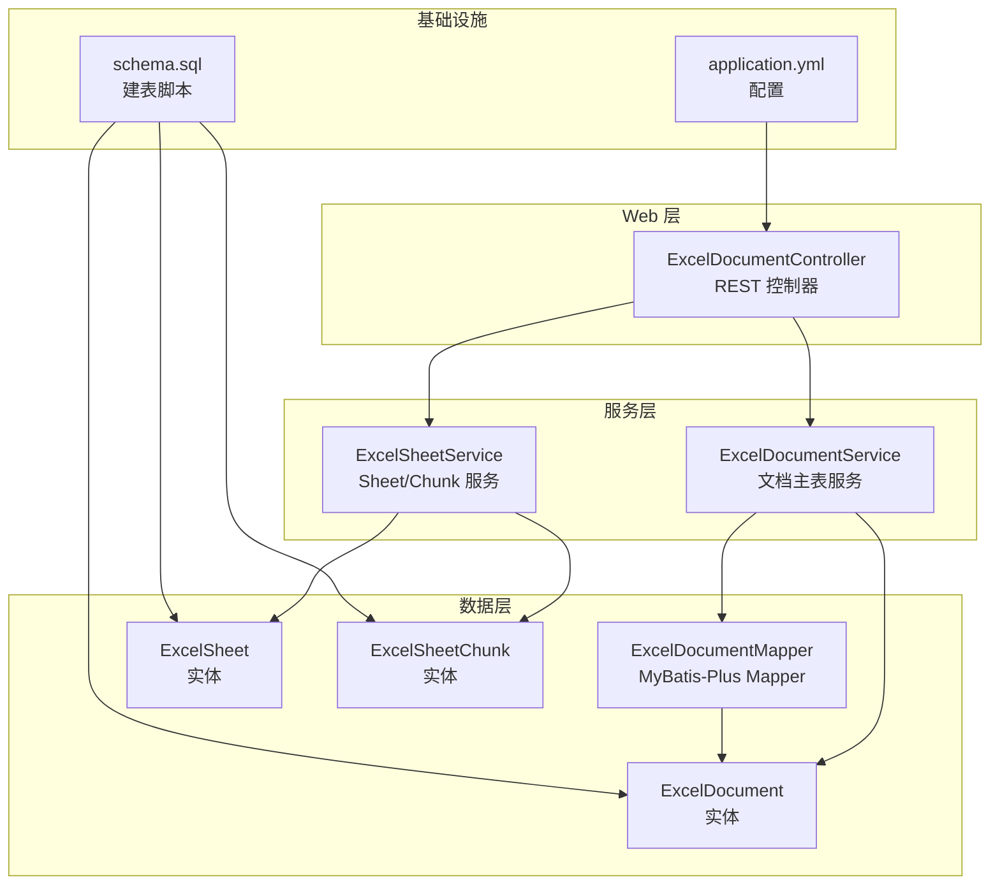
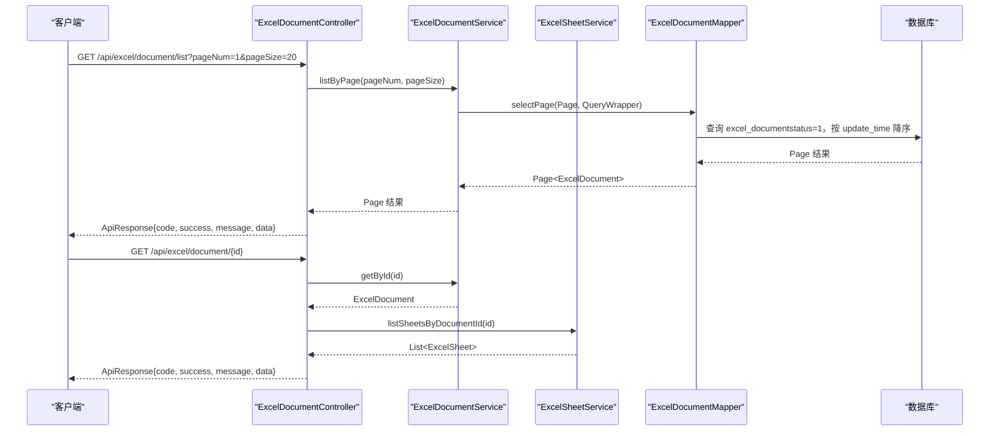
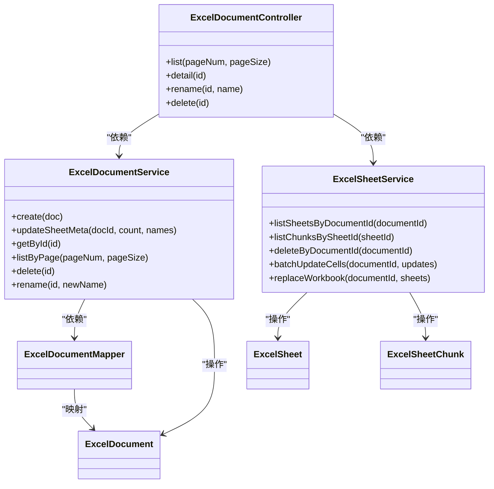
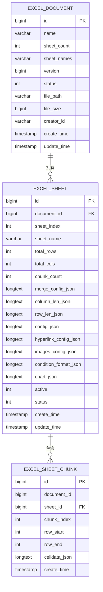

# 文档管理接口

<cite>
**本文引用的文件**
- [ExcelDocumentController.java](file://dataloom-server/src/main/java/com/demo/excel/controller/ExcelDocumentController.java)
- [ExcelDocumentService.java](file://dataloom-server/src/main/java/com/demo/excel/service/ExcelDocumentService.java)
- [ExcelSheetService.java](file://dataloom-server/src/main/java/com/demo/excel/service/ExcelSheetService.java)
- [ExcelDocument.java](file://dataloom-server/src/main/java/com/demo/excel/entity/ExcelDocument.java)
- [ExcelSheet.java](file://dataloom-server/src/main/java/com/demo/excel/entity/ExcelSheet.java)
- [ExcelSheetChunk.java](file://dataloom-server/src/main/java/com/demo/excel/entity/ExcelSheetChunk.java)
- [ExcelDocumentMapper.java](file://dataloom-server/src/main/java/com/demo/excel/mapper/ExcelDocumentMapper.java)
- [ApiResponse.java](file://dataloom-server/src/main/java/com/demo/excel/common/ApiResponse.java)
- [application.yml](file://dataloom-server/src/main/resources/application.yml)
- [schema.sql](file://dataloom-server/src/main/resources/schema.sql)
- [excel.js](file://dataloom-web/src/api/excel.js)
</cite>

## 目录
1. [简介](#简介)
2. [项目结构](#项目结构)
3. [核心组件](#核心组件)
4. [架构概览](#架构概览)
5. [详细组件分析](#详细组件分析)
6. [依赖分析](#依赖分析)
7. [性能考虑](#性能考虑)
8. [故障排查指南](#故障排查指南)
9. [结论](#结论)
10. [附录](#附录)

## 简介
本文件面向“文档管理接口”的使用者与维护者，系统性说明以下接口的实现与使用方式：
- 文档列表查询接口（分页参数传递与数据格式）
- 文档详情获取接口（元数据结构与返回字段）
- 文档重命名接口（参数校验与更新逻辑）
- 文档删除接口（软删除机制与级联清理流程）

同时提供每个接口的完整调用示例（请求参数、响应格式、错误处理），以及分页查询的最佳实践与性能优化建议。

## 项目结构
后端采用 Spring Boot + MyBatis-Plus 架构，接口集中在控制器层，业务逻辑位于服务层，数据模型与映射器分别对应实体类与数据库表。

图示来源
- [ExcelDocumentController.java:22-296](file://dataloom-server/src/main/java/com/demo/excel/controller/ExcelDocumentController.java#L22-L296)
- [ExcelDocumentService.java:19-119](file://dataloom-server/src/main/java/com/demo/excel/service/ExcelDocumentService.java#L19-L119)
- [ExcelSheetService.java:33-443](file://dataloom-server/src/main/java/com/demo/excel/service/ExcelSheetService.java#L33-L443)
- [ExcelDocumentMapper.java:9-10](file://dataloom-server/src/main/java/com/demo/excel/mapper/ExcelDocumentMapper.java#L9-L10)
- [ExcelDocument.java:15-55](file://dataloom-server/src/main/java/com/demo/excel/entity/ExcelDocument.java#L15-L55)
- [ExcelSheet.java:14-77](file://dataloom-server/src/main/java/com/demo/excel/entity/ExcelSheet.java#L14-L77)
- [ExcelSheetChunk.java:18-53](file://dataloom-server/src/main/java/com/demo/excel/entity/ExcelSheetChunk.java#L18-L53)
- [application.yml:1-51](file://dataloom-server/src/main/resources/application.yml#L1-L51)
- [schema.sql:1-124](file://dataloom-server/src/main/resources/schema.sql#L1-L124)

章节来源
- [ExcelDocumentController.java:22-296](file://dataloom-server/src/main/java/com/demo/excel/controller/ExcelDocumentController.java#L22-L296)
- [ExcelDocumentService.java:19-119](file://dataloom-server/src/main/java/com/demo/excel/service/ExcelDocumentService.java#L19-L119)
- [ExcelSheetService.java:33-443](file://dataloom-server/src/main/java/com/demo/excel/service/ExcelSheetService.java#L33-L443)
- [application.yml:1-51](file://dataloom-server/src/main/resources/application.yml#L1-L51)
- [schema.sql:1-124](file://dataloom-server/src/main/resources/schema.sql#L1-L124)

## 核心组件
- 控制器层：集中处理 HTTP 请求，负责参数接收、调用服务层、封装统一响应。
- 服务层：
  - 文档服务：负责文档主表的查询、分页、重命名、软删除。
  - Sheet/Chunk 服务：负责按文档查询 Sheet 元信息、按 Sheet 查询分块、删除时的级联清理。
- 数据模型与映射器：定义实体、表结构与 MyBatis-Plus Mapper 接口。
- 统一响应体：统一封装接口返回结构，便于前端处理。

章节来源
- [ExcelDocumentController.java:22-296](file://dataloom-server/src/main/java/com/demo/excel/controller/ExcelDocumentController.java#L22-L296)
- [ExcelDocumentService.java:19-119](file://dataloom-server/src/main/java/com/demo/excel/service/ExcelDocumentService.java#L19-L119)
- [ExcelSheetService.java:33-443](file://dataloom-server/src/main/java/com/demo/excel/service/ExcelSheetService.java#L33-L443)
- [ExcelDocument.java:15-55](file://dataloom-server/src/main/java/com/demo/excel/entity/ExcelDocument.java#L15-L55)
- [ExcelSheet.java:14-77](file://dataloom-server/src/main/java/com/demo/excel/entity/ExcelSheet.java#L14-L77)
- [ExcelSheetChunk.java:18-53](file://dataloom-server/src/main/java/com/demo/excel/entity/ExcelSheetChunk.java#L18-L53)
- [ExcelDocumentMapper.java:9-10](file://dataloom-server/src/main/java/com/demo/excel/mapper/ExcelDocumentMapper.java#L9-L10)
- [ApiResponse.java:6-52](file://dataloom-server/src/main/java/com/demo/excel/common/ApiResponse.java#L6-L52)

## 架构概览
文档管理接口遵循“控制器-服务-数据访问”的分层架构，通过统一响应体返回标准结构，并结合 MyBatis-Plus 的分页插件实现高效分页查询。

图示来源
- [ExcelDocumentController.java:44-131](file://dataloom-server/src/main/java/com/demo/excel/controller/ExcelDocumentController.java#L44-L131)
- [ExcelDocumentService.java:72-78](file://dataloom-server/src/main/java/com/demo/excel/service/ExcelDocumentService.java#L72-L78)
- [ExcelSheetService.java:51-57](file://dataloom-server/src/main/java/com/demo/excel/service/ExcelSheetService.java#L51-L57)
- [ExcelDocumentMapper.java:9-10](file://dataloom-server/src/main/java/com/demo/excel/mapper/ExcelDocumentMapper.java#L9-L10)

## 详细组件分析

### 文档列表查询接口
- 接口地址：GET /api/excel/document/list
- 功能描述：分页查询文档列表，仅返回元数据（不含单元格数据），按更新时间降序排列。
- 分页参数：
  - pageNum：页码，默认 1
  - pageSize：每页条数，默认 20
- 响应数据结构：
  - total：总记录数
  - pages：总页数
  - current：当前页码
  - records：当前页记录列表，每条记录包含：
    - id：文档 ID
    - name：文档名称
    - sheetCount：Sheet 数量
    - sheetNames：Sheet 名称数组（JSON 字符串）
    - version：乐观锁版本号
    - fileSize：文件大小（字节）
    - createTime：创建时间
    - updateTime：更新时间
- 错误处理：
  - 默认返回统一响应体，成功时 code=200，message="success"；失败时 code=500，message 为错误信息。
- 调用示例（前端封装函数参考）：
  - [getDocumentList:32-36](file://dataloom-web/src/api/excel.js#L32-L36)

章节来源
- [ExcelDocumentController.java:44-69](file://dataloom-server/src/main/java/com/demo/excel/controller/ExcelDocumentController.java#L44-L69)
- [ExcelDocumentService.java:72-78](file://dataloom-server/src/main/java/com/demo/excel/service/ExcelDocumentService.java#L72-L78)
- [ApiResponse.java:13-40](file://dataloom-server/src/main/java/com/demo/excel/common/ApiResponse.java#L13-L40)
- [excel.js:32-36](file://dataloom-web/src/api/excel.js#L32-L36)

### 文档详情获取接口
- 接口地址：GET /api/excel/document/{id}
- 功能描述：返回文档详情，包含各 Sheet 的元信息（config、chart、images、hyperlink 等），不含单元格数据。
- 参数：
  - id：文档 ID（路径变量）
- 响应数据结构：
  - id：文档 ID
  - name：文档名称
  - sheetCount：Sheet 数量
  - version：乐观锁版本号
  - sheets：Sheet 元信息列表，每项包含：
    - sheetId：Sheet ID
    - sheetIndex：Sheet 在工作簿中的索引
    - sheetName：Sheet 名称
    - totalRows：总行数
    - totalCols：总列数
    - chunkCount：分块数量
    - active：是否为活动 Sheet（1=是，0=否）
    - config：完整配置对象（包含 merge、columnlen、rowlen）
    - mergeConfig：合并单元格配置
    - columnLen：列宽配置
    - rowLen：行高配置
    - hyperlink：超链接配置
    - images：图片配置
    - luckysheet_conditionformat_save：条件格式配置
    - chart：图表配置
- 错误处理：
  - 若文档不存在，返回 code=404，message="文档不存在"。
- 调用示例（前端封装函数参考）：
  - [getDocument:39-41](file://dataloom-web/src/api/excel.js#L39-L41)

章节来源
- [ExcelDocumentController.java:77-131](file://dataloom-server/src/main/java/com/demo/excel/controller/ExcelDocumentController.java#L77-L131)
- [ExcelSheetService.java:51-57](file://dataloom-server/src/main/java/com/demo/excel/service/ExcelSheetService.java#L51-L57)
- [ApiResponse.java:28-40](file://dataloom-server/src/main/java/com/demo/excel/common/ApiResponse.java#L28-L40)
- [excel.js:39-41](file://dataloom-web/src/api/excel.js#L39-L41)

### 文档重命名接口
- 接口地址：PUT /api/excel/document/{id}/name
- 功能描述：更新文档名称。
- 参数：
  - id：文档 ID（路径变量）
  - 请求体：{"name": "新名称"}
- 参数校验：
  - name 不能为空字符串（去空白后判断）。
  - 若文档不存在，返回 code=404，message="文档不存在"。
- 更新逻辑：
  - 先查询文档是否存在，存在则更新名称与更新时间，否则返回错误。
- 调用示例（前端封装函数参考）：
  - [renameDocument:70-73](file://dataloom-web/src/api/excel.js#L70-L73)

章节来源
- [ExcelDocumentController.java:238-251](file://dataloom-server/src/main/java/com/demo/excel/controller/ExcelDocumentController.java#L238-L251)
- [ExcelDocumentService.java:111-117](file://dataloom-server/src/main/java/com/demo/excel/service/ExcelDocumentService.java#L111-L117)
- [ApiResponse.java:28-40](file://dataloom-server/src/main/java/com/demo/excel/common/ApiResponse.java#L28-L40)
- [excel.js:70-73](file://dataloom-web/src/api/excel.js#L70-L73)

### 文档删除接口
- 接口地址：DELETE /api/excel/document/{id}
- 功能描述：软删除文档主记录，并进行级联清理（软删除 Sheet，物理删除 Chunk）。
- 参数：
  - id：文档 ID（路径变量）
- 删除机制：
  - 软删除文档主记录：将 status 设为 3。
  - 级联清理：
    - 软删除该文档下的所有 Sheet（status 设为 3）。
    - 物理删除该文档下的所有 Chunk（数据量大，不做逻辑删除）。
  - 文件清理：尝试删除磁盘上对应的原始文件路径（若文件不存在或被占用则忽略）。
- 调用示例（前端封装函数参考）：
  - [deleteDocument:75-78](file://dataloom-web/src/api/excel.js#L75-L78)

章节来源
- [ExcelDocumentController.java:258-264](file://dataloom-server/src/main/java/com/demo/excel/controller/ExcelDocumentController.java#L258-L264)
- [ExcelDocumentService.java:86-103](file://dataloom-server/src/main/java/com/demo/excel/service/ExcelDocumentService.java#L86-L103)
- [ExcelSheetService.java:79-91](file://dataloom-server/src/main/java/com/demo/excel/service/ExcelSheetService.java#L79-L91)
- [ApiResponse.java:13-40](file://dataloom-server/src/main/java/com/demo/excel/common/ApiResponse.java#L13-L40)
- [excel.js:75-78](file://dataloom-web/src/api/excel.js#L75-L78)

## 依赖分析
- 控制器依赖服务层，服务层依赖 Mapper 与实体类。
- 应用配置中启用 MyBatis-Plus 的逻辑删除（status=3 视为已删除），并设置默认逻辑删除值。
- 数据库建表脚本定义了三张核心表：excel_document、excel_sheet、excel_sheet_chunk。

图示来源
- [ExcelDocumentController.java:22-296](file://dataloom-server/src/main/java/com/demo/excel/controller/ExcelDocumentController.java#L22-L296)
- [ExcelDocumentService.java:19-119](file://dataloom-server/src/main/java/com/demo/excel/service/ExcelDocumentService.java#L19-L119)
- [ExcelSheetService.java:33-443](file://dataloom-server/src/main/java/com/demo/excel/service/ExcelSheetService.java#L33-L443)
- [ExcelDocumentMapper.java:9-10](file://dataloom-server/src/main/java/com/demo/excel/mapper/ExcelDocumentMapper.java#L9-L10)
- [ExcelDocument.java:15-55](file://dataloom-server/src/main/java/com/demo/excel/entity/ExcelDocument.java#L15-L55)
- [ExcelSheet.java:14-77](file://dataloom-server/src/main/java/com/demo/excel/entity/ExcelSheet.java#L14-L77)
- [ExcelSheetChunk.java:18-53](file://dataloom-server/src/main/java/com/demo/excel/entity/ExcelSheetChunk.java#L18-L53)

章节来源
- [ExcelDocumentController.java:22-296](file://dataloom-server/src/main/java/com/demo/excel/controller/ExcelDocumentController.java#L22-L296)
- [ExcelDocumentService.java:19-119](file://dataloom-server/src/main/java/com/demo/excel/service/ExcelDocumentService.java#L19-L119)
- [ExcelSheetService.java:33-443](file://dataloom-server/src/main/java/com/demo/excel/service/ExcelSheetService.java#L33-L443)
- [ExcelDocumentMapper.java:9-10](file://dataloom-server/src/main/java/com/demo/excel/mapper/ExcelDocumentMapper.java#L9-L10)
- [ExcelDocument.java:15-55](file://dataloom-server/src/main/java/com/demo/excel/entity/ExcelDocument.java#L15-L55)
- [ExcelSheet.java:14-77](file://dataloom-server/src/main/java/com/demo/excel/entity/ExcelSheet.java#L14-L77)
- [ExcelSheetChunk.java:18-53](file://dataloom-server/src/main/java/com/demo/excel/entity/ExcelSheetChunk.java#L18-L53)

## 性能考虑
- 分页查询最佳实践：
  - 使用 MyBatis-Plus 分页插件，按更新时间降序排序，避免全表扫描。
  - 前端合理设置 pageSize，避免过大导致响应体膨胀与内存压力。
  - 仅在必要时请求全量单元格数据，详情接口默认不返回 celldata，前端可按需再调用全量加载接口。
- 数据分块策略：
  - Sheet 数据按固定行数（默认 1000 行/块）分块存储，降低单行数据体积，提升加载与更新性能。
  - 增量更新单元格时按块分组，减少数据库 I/O 次数。
- 级联清理：
  - 删除文档时软删除 Sheet，物理删除 Chunk，避免逻辑删除带来的查询复杂度。
- 配置建议：
  - application.yml 中已配置逻辑删除值与默认 ID 类型，确保删除行为一致。
  - 文件上传大小限制可根据实际需求调整。

章节来源
- [ExcelDocumentService.java:72-78](file://dataloom-server/src/main/java/com/demo/excel/service/ExcelDocumentService.java#L72-L78)
- [ExcelSheetService.java:103-212](file://dataloom-server/src/main/java/com/demo/excel/service/ExcelSheetService.java#L103-L212)
- [application.yml:32-41](file://dataloom-server/src/main/resources/application.yml#L32-L41)

## 故障排查指南
- 文档不存在：
  - 列表查询：确认文档状态为正常（status=1），并检查 id 是否正确。
  - 详情查询：若返回 404，确认文档 ID 存在且未被软删除。
- 重命名失败：
  - 检查请求体 name 是否为空或仅包含空白字符。
  - 确认文档 ID 存在。
- 删除失败：
  - 检查是否正确传入文档 ID。
  - 查看日志中关于文件删除的异常（如文件被占用或路径无效）。
- 响应格式：
  - 统一使用 ApiResponse 包裹，成功时 code=200，message="success"；失败时 code=500，message 为具体错误信息。

章节来源
- [ExcelDocumentController.java:80-82](file://dataloom-server/src/main/java/com/demo/excel/controller/ExcelDocumentController.java#L80-L82)
- [ExcelDocumentController.java:241-247](file://dataloom-server/src/main/java/com/demo/excel/controller/ExcelDocumentController.java#L241-L247)
- [ExcelDocumentController.java:258-264](file://dataloom-server/src/main/java/com/demo/excel/controller/ExcelDocumentController.java#L258-L264)
- [ApiResponse.java:13-40](file://dataloom-server/src/main/java/com/demo/excel/common/ApiResponse.java#L13-L40)

## 结论
本文档对文档管理接口进行了全面梳理，覆盖了分页查询、详情获取、重命名与删除的实现细节与调用方式。通过合理的分页策略、数据分块与级联清理机制，系统在大数据量场景下仍能保持良好的性能与稳定性。建议在生产环境中结合业务需求进一步优化分页参数与缓存策略。

## 附录
- 数据模型关系图（ER）

图示来源
- [schema.sql:8-66](file://dataloom-server/src/main/resources/schema.sql#L8-L66)
- [ExcelDocument.java:15-55](file://dataloom-server/src/main/java/com/demo/excel/entity/ExcelDocument.java#L15-L55)
- [ExcelSheet.java:14-77](file://dataloom-server/src/main/java/com/demo/excel/entity/ExcelSheet.java#L14-L77)
- [ExcelSheetChunk.java:18-53](file://dataloom-server/src/main/java/com/demo/excel/entity/ExcelSheetChunk.java#L18-L53)