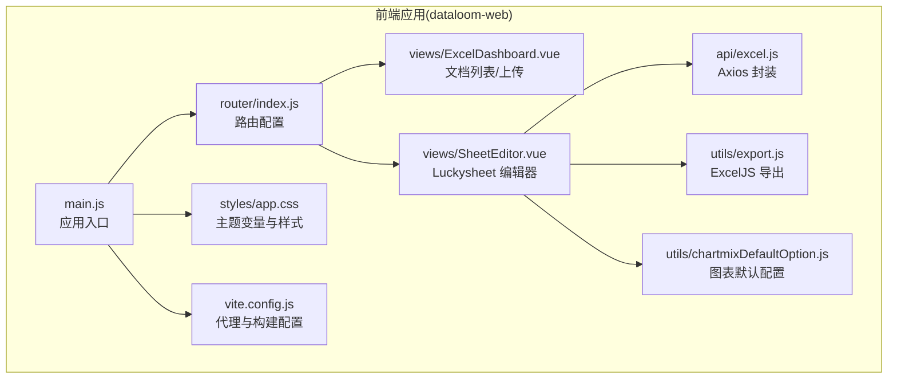
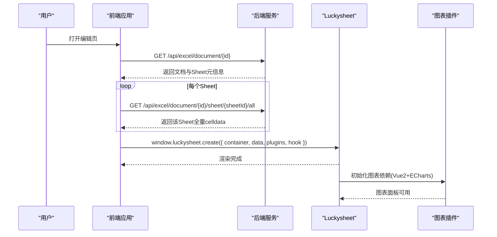
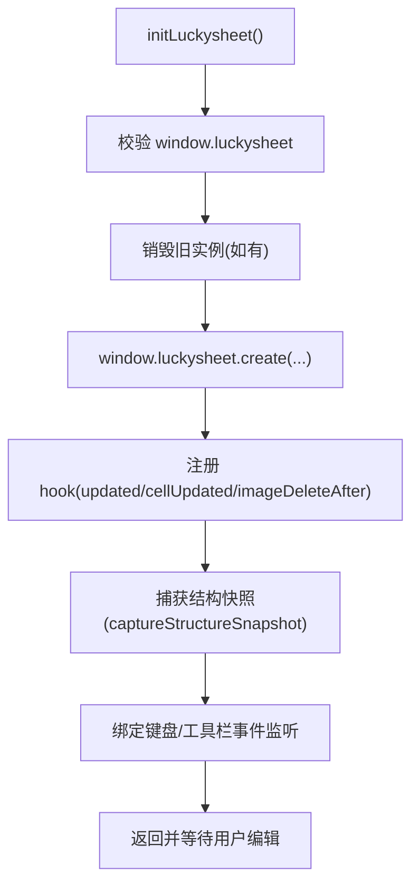
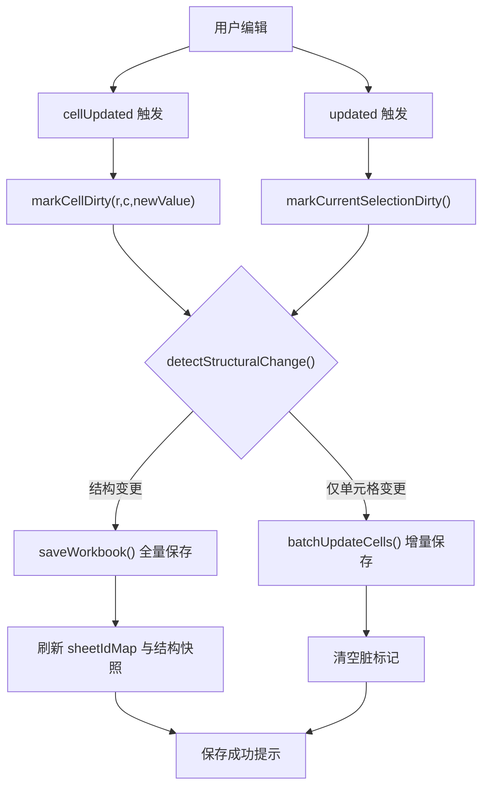
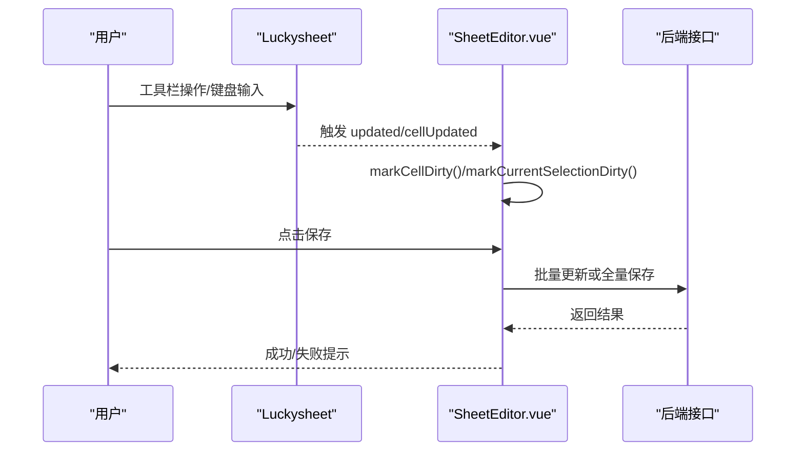
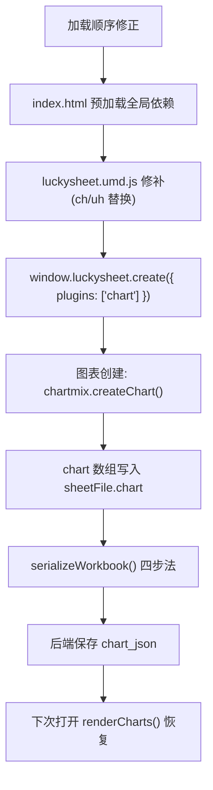
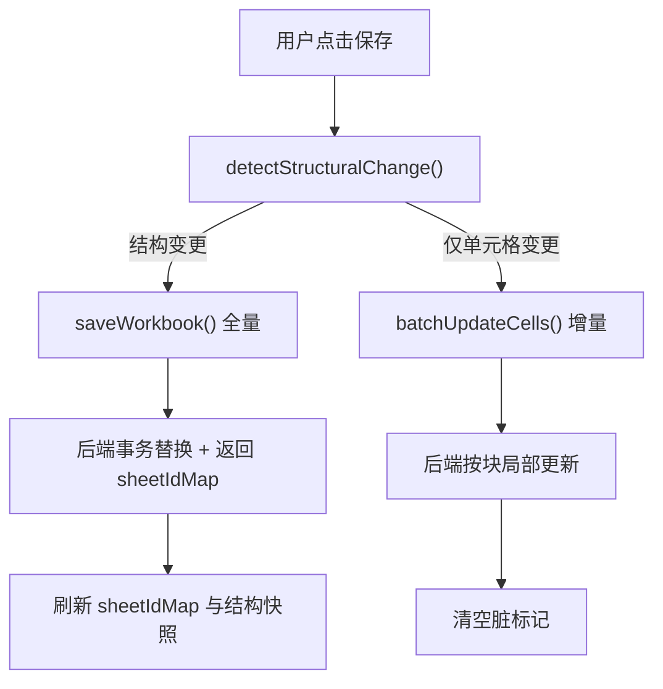
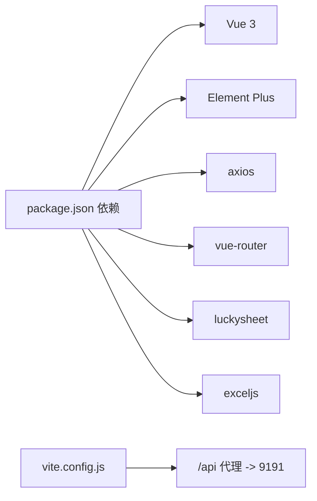

# Luckysheet 编辑器集成

<cite>
**本文引用的文件**
- [SheetEditor.vue](file://dataloom-web/src/views/SheetEditor.vue)
- [main.js](file://dataloom-web/src/main.js)
- [router/index.js](file://dataloom-web/src/router/index.js)
- [api/excel.js](file://dataloom-web/src/api/excel.js)
- [utils/chartmixDefaultOption.js](file://dataloom-web/src/utils/chartmixDefaultOption.js)
- [utils/export.js](file://dataloom-web/src/utils/export.js)
- [styles/app.css](file://dataloom-web/src/styles/app.css)
- [vite.config.js](file://dataloom-web/vite.config.js)
- [ExcelDashboard.vue](file://dataloom-web/src/views/ExcelDashboard.vue)
- [package.json](file://dataloom-web/package.json)
- [README.md](file://README.md)
- [DataLoom-系统架构与技术实践.md](file://docs/DataLoom-系统架构与技术实践.md)
- [从零构建在线Excel.md](file://从零构建在线Excel.md)
</cite>

## 目录
1. [简介](#简介)
2. [项目结构](#项目结构)
3. [核心组件](#核心组件)
4. [架构总览](#架构总览)
5. [详细组件分析](#详细组件分析)
6. [依赖分析](#依赖分析)
7. [性能考虑](#性能考虑)
8. [故障排查指南](#故障排查指南)
9. [结论](#结论)
10. [附录](#附录)

## 简介
本文件面向 Luckysheet 在线编辑器的前端集成，围绕初始化配置、插件系统、单元格数据双向绑定与变更监听、事件处理与自定义扩展、图表插件集成与配置、性能优化与内存管理、样式定制与主题配置、以及与后端数据同步与冲突处理进行系统化说明。文档结合 Vue 3 + Vite + Element Plus 的前端架构，配合 Spring Boot 后端的分块存储与混合保存策略，帮助读者快速理解并扩展 Luckysheet 的在线编辑能力。

## 项目结构
前端采用 Vue 3 + Vite + Element Plus 架构，Luckysheet 作为 UMD 表格引擎通过 CDN/本地修补版加载，图表插件 chartmix 通过独立的 Vue 2 实例与 ECharts 协作。核心页面为“仪表盘”和“表格编辑器”，编辑器页面负责 Luckysheet 的初始化、数据加载、变更追踪与保存。

**图表来源**
- [main.js:1-19](file://dataloom-web/src/main.js#L1-L19)
- [router/index.js:1-21](file://dataloom-web/src/router/index.js#L1-L21)
- [ExcelDashboard.vue:1-386](file://dataloom-web/src/views/ExcelDashboard.vue#L1-L386)
- [SheetEditor.vue:1-970](file://dataloom-web/src/views/SheetEditor.vue#L1-L970)
- [api/excel.js:1-79](file://dataloom-web/src/api/excel.js#L1-L79)
- [utils/export.js:1-239](file://dataloom-web/src/utils/export.js#L1-L239)
- [utils/chartmixDefaultOption.js:1-2](file://dataloom-web/src/utils/chartmixDefaultOption.js#L1-L2)
- [styles/app.css:1-65](file://dataloom-web/src/styles/app.css#L1-L65)
- [vite.config.js:1-26](file://dataloom-web/vite.config.js#L1-L26)

**章节来源**
- [main.js:1-19](file://dataloom-web/src/main.js#L1-L19)
- [router/index.js:1-21](file://dataloom-web/src/router/index.js#L1-L21)
- [ExcelDashboard.vue:1-386](file://dataloom-web/src/views/ExcelDashboard.vue#L1-L386)
- [SheetEditor.vue:1-970](file://dataloom-web/src/views/SheetEditor.vue#L1-L970)
- [api/excel.js:1-79](file://dataloom-web/src/api/excel.js#L1-L79)
- [utils/export.js:1-239](file://dataloom-web/src/utils/export.js#L1-L239)
- [utils/chartmixDefaultOption.js:1-2](file://dataloom-web/src/utils/chartmixDefaultOption.js#L1-L2)
- [styles/app.css:1-65](file://dataloom-web/src/styles/app.css#L1-L65)
- [vite.config.js:1-26](file://dataloom-web/vite.config.js#L1-L26)

## 核心组件
- 应用入口与依赖注入：在入口文件中注册 Element Plus、图标组件、路由与全局样式，挂载应用。
- 路由与页面：Hash 路由管理仪表盘与编辑器页面，编辑器页面承载 Luckysheet 实例。
- 编辑器页面：负责文档元信息加载、各 Sheet 的 celldata 懒加载、Luckysheet 初始化、变更追踪、保存与导出。
- API 封装：统一的 Axios 实例，提供上传、文档查询、数据加载、批量更新、全量保存、重命名、删除等接口。
- 工具模块：图表默认配置、ExcelJS 导出工具。
- 样式与主题：CSS 变量定义主题色系，Element Plus 组件样式覆盖。

**章节来源**
- [main.js:1-19](file://dataloom-web/src/main.js#L1-L19)
- [router/index.js:1-21](file://dataloom-web/src/router/index.js#L1-L21)
- [SheetEditor.vue:1-970](file://dataloom-web/src/views/SheetEditor.vue#L1-L970)
- [api/excel.js:1-79](file://dataloom-web/src/api/excel.js#L1-L79)
- [utils/chartmixDefaultOption.js:1-2](file://dataloom-web/src/utils/chartmixDefaultOption.js#L1-L2)
- [utils/export.js:1-239](file://dataloom-web/src/utils/export.js#L1-L239)
- [styles/app.css:1-65](file://dataloom-web/src/styles/app.css#L1-L65)

## 架构总览
Luckysheet 通过 window.luckysheet.create 初始化，数据来自后端分块加载的 celldata 与结构配置。前端维护“脏数据”集合，保存时根据结构是否变化选择增量或全量策略。图表插件通过独立的 Vue 2 实例与 ECharts 协作，使用本地修补版 Luckysheet UMD 以规避 CDN 不稳定问题。

**图表来源**
- [SheetEditor.vue:134-173](file://dataloom-web/src/views/SheetEditor.vue#L134-L173)
- [SheetEditor.vue:247-416](file://dataloom-web/src/views/SheetEditor.vue#L247-L416)
- [DataLoom-系统架构与技术实践.md:181-284](file://docs/DataLoom-系统架构与技术实践.md#L181-L284)

**章节来源**
- [SheetEditor.vue:134-173](file://dataloom-web/src/views/SheetEditor.vue#L134-L173)
- [SheetEditor.vue:247-416](file://dataloom-web/src/views/SheetEditor.vue#L247-L416)
- [DataLoom-系统架构与技术实践.md:181-284](file://docs/DataLoom-系统架构与技术实践.md#L181-L284)

## 详细组件分析

### Luckysheet 初始化与插件系统集成
- 初始化参数
  - 容器：luckysheet-container
  - 语言：zh
  - 工具栏：显示
  - 信息栏：隐藏
  - 统计栏：显示
  - 允许编辑：true
  - 强制公式计算：true
  - 插件：启用 chart
  - 插件路径：window.location.origin
  - 数据：由后端返回的 sheets 数组，包含 name、index、status、order、celldata、config、hyperlink、images、conditionformat、chart 等
- 钩子函数
  - workbookCreateAfter：初始化完成后回调
  - updated：工具栏操作导致的结构/样式变化，标记工作簿/结构脏
  - cellUpdated：单元格编辑回调，记录具体单元格变更
  - imageDeleteAfter：图片删除后清理内存残留的图片配置
- 销毁与卸载
  - onBeforeUnmount 注销键盘与工具栏点击事件监听，销毁 Luckysheet 实例，避免内存泄漏

**图表来源**
- [SheetEditor.vue:247-416](file://dataloom-web/src/views/SheetEditor.vue#L247-L416)

**章节来源**
- [SheetEditor.vue:247-416](file://dataloom-web/src/views/SheetEditor.vue#L247-L416)

### 单元格数据双向绑定与变更监听机制
- 变更追踪
  - workbookDirty：工作簿级变更标记
  - structureDirty：结构级变更标记
  - dirtyCells：以 sheetId_row_col 为键的响应式集合，记录单元格最新值
- 触发点
  - cellUpdated：记录具体单元格
  - updated：通过 getRange 获取选区，批量标记
  - Delete/Backspace：延时标记当前选区
  - imageDeleteAfter：清理内存图片配置
- 保存策略
  - detectStructuralChange：对比结构快照，判断是否结构变更
  - 若结构变更：全量保存，后端返回 sheetId 映射，刷新映射表
  - 若仅单元格变更：批量增量更新
  - 兜底：若 workbookDirty 但无可追踪变更，兜底全量保存

**图表来源**
- [SheetEditor.vue:439-480](file://dataloom-web/src/views/SheetEditor.vue#L439-L480)
- [SheetEditor.vue:506-531](file://dataloom-web/src/views/SheetEditor.vue#L506-L531)
- [SheetEditor.vue:547-631](file://dataloom-web/src/views/SheetEditor.vue#L547-L631)

**章节来源**
- [SheetEditor.vue:439-480](file://dataloom-web/src/views/SheetEditor.vue#L439-L480)
- [SheetEditor.vue:506-531](file://dataloom-web/src/views/SheetEditor.vue#L506-L531)
- [SheetEditor.vue:547-631](file://dataloom-web/src/views/SheetEditor.vue#L547-L631)

### 事件处理与自定义功能扩展
- 键盘事件：Delete/Backspace 触发延时标记当前选区，确保删除操作纳入变更追踪
- 工具栏点击：延时标记当前选区，覆盖格式、合并等工具栏操作
- 图片删除清理：在 imageDeleteAfter 中清理 luckysheetfile 内存中的图片配置，避免残留
- 文档重命名：支持仪表盘与编辑页顶部内联重命名，调用后端接口并提示结果

**图表来源**
- [SheetEditor.vue:404-416](file://dataloom-web/src/views/SheetEditor.vue#L404-L416)
- [SheetEditor.vue:334-395](file://dataloom-web/src/views/SheetEditor.vue#L334-L395)
- [SheetEditor.vue:547-631](file://dataloom-web/src/views/SheetEditor.vue#L547-L631)

**章节来源**
- [SheetEditor.vue:404-416](file://dataloom-web/src/views/SheetEditor.vue#L404-L416)
- [SheetEditor.vue:334-395](file://dataloom-web/src/views/SheetEditor.vue#L334-L395)
- [SheetEditor.vue:547-631](file://dataloom-web/src/views/SheetEditor.vue#L547-L631)

### 图表插件集成方式与配置选项
- 加载顺序与修补
  - Luckysheet 本地修补版（/lib/luckysheet.umd.js）替换内部硬编码的不稳定 CDN 与相对路径
  - index.html 预加载 Vue 2、Vuex、Element UI 2、ECharts 4.8、chartmix，确保 window.Vue/Vuex/ECharts/chartmix 就绪
- 初始化与配置
  - 插件启用：plugins: ['chart']
  - 插件路径：pluginsUrl: window.location.origin
  - 图表数据结构：chart 数组包含 chart_id、chartOptions、chartType、range 等字段
  - 默认配置：defaultOption 作为兜底，避免 chartmix 初始化失败
- 保存与恢复
  - serializeWorkbook 中四步法：ECharts 实例兜底 → 清理僵尸 chart → 安全刷新 → 序列化
  - 保存时 getluckysheetfile(true) 用 chartmix 原生格式覆盖 chartOptions，提升兼容性

**图表来源**
- [DataLoom-系统架构与技术实践.md:568-800](file://docs/DataLoom-系统架构与技术实践.md#L568-L800)
- [SheetEditor.vue:247-416](file://dataloom-web/src/views/SheetEditor.vue#L247-L416)
- [SheetEditor.vue:633-783](file://dataloom-web/src/views/SheetEditor.vue#L633-L783)
- [utils/chartmixDefaultOption.js:1-2](file://dataloom-web/src/utils/chartmixDefaultOption.js#L1-L2)

**章节来源**
- [DataLoom-系统架构与技术实践.md:568-800](file://docs/DataLoom-系统架构与技术实践.md#L568-L800)
- [SheetEditor.vue:247-416](file://dataloom-web/src/views/SheetEditor.vue#L247-L416)
- [SheetEditor.vue:633-783](file://dataloom-web/src/views/SheetEditor.vue#L633-L783)
- [utils/chartmixDefaultOption.js:1-2](file://dataloom-web/src/utils/chartmixDefaultOption.js#L1-L2)

### 与后端数据同步与冲突处理
- 混合保存策略
  - 结构快照：captureStructureSnapshot 拍摄结构签名，保存时对比决定增量或全量
  - 增量保存：batchUpdateCells 按 (sheetId, chunkIndex) 分组，单 Chunk 读写
  - 全量保存：saveWorkbook 替换整个工作簿，后端返回 sheetIdMap，前端刷新映射
- 冲突处理
  - 当前实现：基于结构快照的“结构变更/单元格变更”双路径，避免无谓全量
  - 未实现：多人协同编辑的实时同步与冲突解决（LWW/OT/CRDT 等）
- 数据一致性
  - 前端仅在结构变更时全量保存，其余场景均走增量，降低数据库压力

**图表来源**
- [SheetEditor.vue:506-531](file://dataloom-web/src/views/SheetEditor.vue#L506-L531)
- [SheetEditor.vue:547-631](file://dataloom-web/src/views/SheetEditor.vue#L547-L631)
- [DataLoom-系统架构与技术实践.md:286-341](file://docs/DataLoom-系统架构与技术实践.md#L286-L341)

**章节来源**
- [SheetEditor.vue:506-531](file://dataloom-web/src/views/SheetEditor.vue#L506-L531)
- [SheetEditor.vue:547-631](file://dataloom-web/src/views/SheetEditor.vue#L547-L631)
- [DataLoom-系统架构与技术实践.md:286-341](file://docs/DataLoom-系统架构与技术实践.md#L286-L341)

### 样式定制与主题配置
- CSS 变量主题
  - 定义品牌色系变量：--dl-bg/--dl-panel/--dl-ink/--dl-muted/--dl-line/--dl-accent/--dl-accent-strong/--dl-warm/--dl-shadow
  - 全局字体与基础排版、Element Plus 组件圆角与卡片阴影等样式覆盖
- 组件样式
  - Element Plus 按钮圆角、卡片圆角、表格头部背景色等定制
- 使用建议
  - 通过 CSS 变量集中管理主题，便于切换与扩展
  - 保持与 Element Plus 默认主题风格一致，避免破坏组件一致性

**章节来源**
- [styles/app.css:1-65](file://dataloom-web/src/styles/app.css#L1-L65)

### 前端导出机制
- 导出流程
  - 从 Luckysheet 的 sheet.data 读取完整渲染矩阵，逐单元格写入 ExcelJS
  - 应用合并、边框、字体、颜色、数字格式等样式，生成 .xlsx Blob
  - 使用 FileSaver 触发下载
- 优势
  - 样式零丢失，前后端一致
  - 无网络传输，速度快

**章节来源**
- [utils/export.js:1-239](file://dataloom-web/src/utils/export.js#L1-L239)
- [DataLoom-系统架构与技术实践.md:341-363](file://docs/DataLoom-系统架构与技术实践.md#L341-L363)

## 依赖分析
- 前端依赖
  - Luckysheet：在线表格引擎（UMD）
  - Vue 3 + Element Plus：页面与组件
  - ExcelJS：前端导出
  - axios：API 调用
  - vue-router：页面路由
- 构建与代理
  - Vite 代理 /api 到后端 9191 端口
  - 生产构建关闭 sourcemap

**图表来源**
- [package.json:1-27](file://dataloom-web/package.json#L1-L27)
- [vite.config.js:1-26](file://dataloom-web/vite.config.js#L1-L26)

**章节来源**
- [package.json:1-27](file://dataloom-web/package.json#L1-L27)
- [vite.config.js:1-26](file://dataloom-web/vite.config.js#L1-L26)

## 性能考虑
- 分块存储与懒加载：按 1000 行/块拆分，编辑时仅更新目标块，显著降低 I/O 与内存占用
- 混合保存策略：结构不变时走增量，极大减少数据库写入
- 前端导出：零网络传输，直接在浏览器内存中生成 .xlsx
- 图表加载：预加载全局依赖并修补 Luckysheet UMD，避免动态加载失败与二次请求
- 内存管理：页面卸载时销毁 Luckysheet 实例与事件监听，防止内存泄漏

**章节来源**
- [README.md:61-70](file://README.md#L61-L70)
- [DataLoom-系统架构与技术实践.md:108-129](file://docs/DataLoom-系统架构与技术实践.md#L108-L129)
- [SheetEditor.vue:119-132](file://dataloom-web/src/views/SheetEditor.vue#L119-L132)

## 故障排查指南
- 图表功能不可用
  - 现象：点击“插入图表”报错 ga.createChart is not a function
  - 原因：Luckysheet 修补版与全局依赖加载顺序问题
  - 处理：确认 index.html 预加载 Vue 2、Vuex、Element UI 2、ECharts 4.8、chartmix；修补 luckysheet.umd.js 的 CDN 与路径
- 编辑器初始化失败
  - 现象：Luckysheet 资源未加载
  - 处理：检查 pluginsUrl 与 Luckysheet 资源路径；确认 window.luckysheet 可用
- 保存异常
  - 现象：全量保存后 sheetId 映射不正确
  - 处理：后端 replaceWorkbook 返回 sheetIdMap，前端刷新 sheetIdMap；确认结构快照未被误判
- 图片删除后内存残留
  - 处理：imageDeleteAfter 中按 id/src/坐标尺寸匹配清理 luckysheetfile.images

**章节来源**
- [DataLoom-系统架构与技术实践.md:568-800](file://docs/DataLoom-系统架构与技术实践.md#L568-L800)
- [SheetEditor.vue:334-395](file://dataloom-web/src/views/SheetEditor.vue#L334-L395)
- [SheetEditor.vue:119-132](file://dataloom-web/src/views/SheetEditor.vue#L119-L132)

## 结论
Luckysheet 在线编辑器集成以 Vue 3 + Vite 为基础，结合分块存储与混合保存策略，实现了大表格的高效编辑与导出。通过严格的变更追踪、结构快照与增量/全量双路径保存，兼顾性能与可靠性。图表插件通过预加载与修补版 UMD 解决了历史兼容问题。未来可在现有基础上扩展实时协作与权限体系，进一步提升团队协作能力。

## 附录
- API 接口清单与说明
  - 上传：multipart/form-data，返回 documentId、sheetCount、sheets
  - 文档列表：分页返回文档元信息
  - 文档详情：返回文档与 Sheet 元信息（不含 celldata）
  - 加载 Sheet 全量 celldata：按块合并返回
  - 批量增量更新单元格：仅写变更涉及的 Chunk
  - 全量快照保存：替换整个工作簿
  - 重命名/删除：文档级管理

**章节来源**
- [api/excel.js:1-79](file://dataloom-web/src/api/excel.js#L1-L79)
- [README.md:190-216](file://README.md#L190-L216)