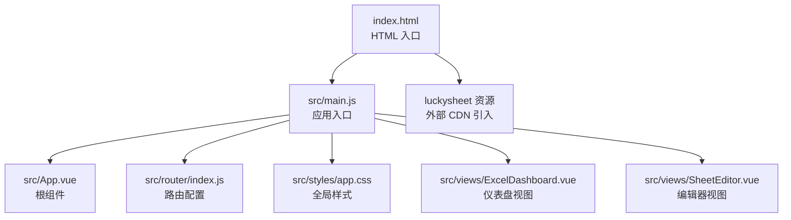
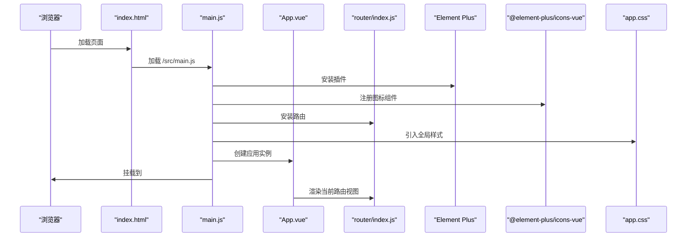
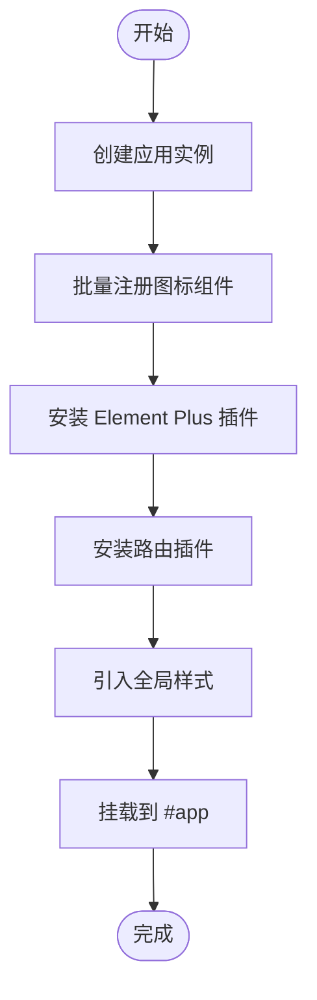
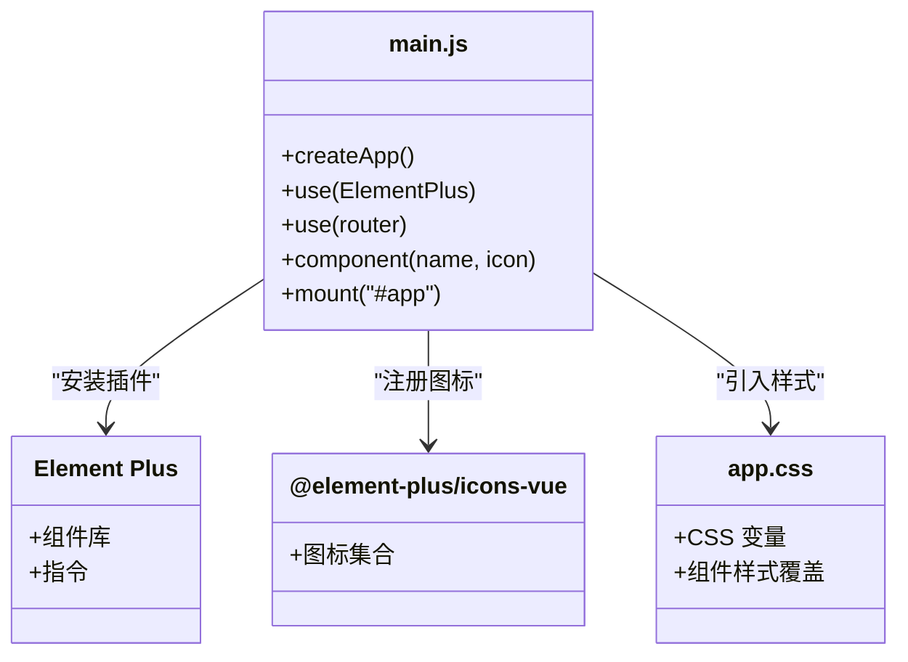
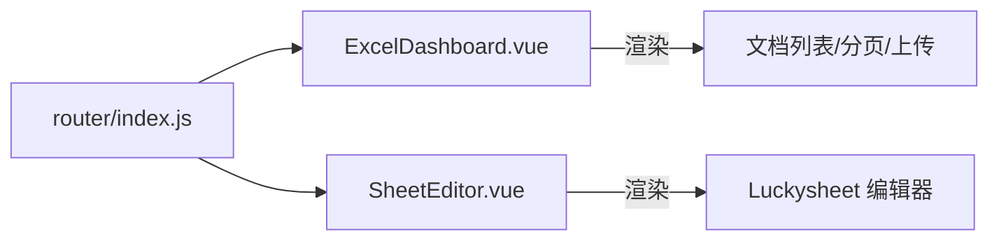
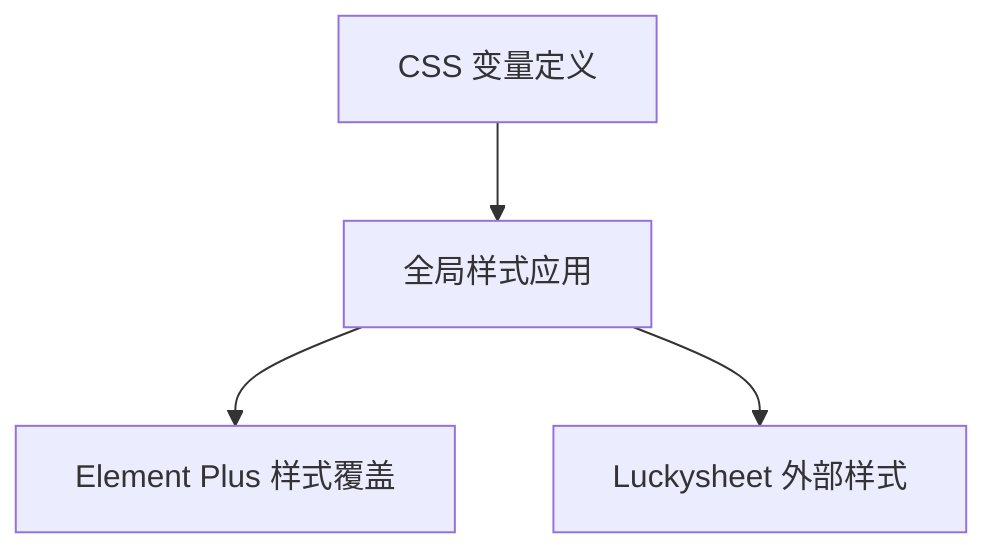
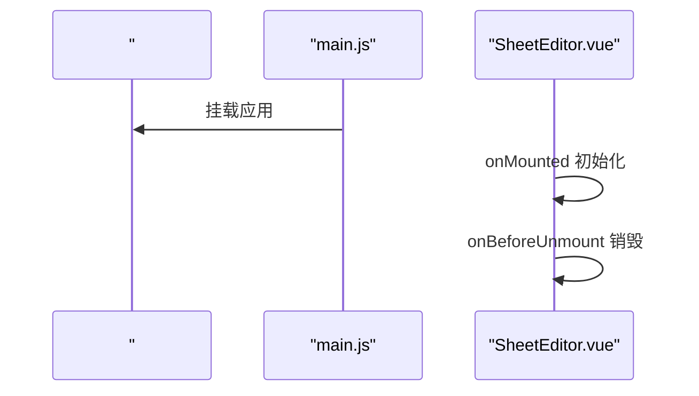

# Vue 应用初始化

<cite>
**本文引用的文件**
- [main.js](file://dataloom-web/src/main.js)
- [package.json](file://dataloom-web/package.json)
- [vite.config.js](file://dataloom-web/vite.config.js)
- [App.vue](file://dataloom-web/src/App.vue)
- [app.css](file://dataloom-web/src/styles/app.css)
- [index.js](file://dataloom-web/src/router/index.js)
- [index.html](file://dataloom-web/index.html)
- [ExcelDashboard.vue](file://dataloom-web/src/views/ExcelDashboard.vue)
- [SheetEditor.vue](file://dataloom-web/src/views/SheetEditor.vue)
</cite>

## 目录
1. [简介](#简介)
2. [项目结构](#项目结构)
3. [核心组件](#核心组件)
4. [架构总览](#架构总览)
5. [详细组件分析](#详细组件分析)
6. [依赖关系分析](#依赖关系分析)
7. [性能考量](#性能考量)
8. [故障排查指南](#故障排查指南)
9. [结论](#结论)
10. [附录](#附录)

## 简介
本文件面向 Vue 3 应用初始化与运行时配置，围绕应用入口文件的初始化流程展开，重点说明：
- 应用实例创建与挂载
- 插件安装与全局配置（Element Plus、路由）
- 图标系统注册机制
- 样式引入与主题配置
- 启动流程与生命周期管理
- 第三方库集成最佳实践与版本兼容性
- 调试方法与常见问题解决

## 项目结构
该 Vue 3 前端项目采用 Vite 构建工具，使用 Vue Router 进行页面路由管理，Element Plus 提供 UI 组件库，Luckysheet 用于在线电子表格编辑。入口文件负责创建应用实例、安装插件、注册图标并挂载到 DOM。

图表来源
- [index.html:1-36](file://dataloom-web/index.html#L1-L36)
- [main.js:1-19](file://dataloom-web/src/main.js#L1-L19)
- [App.vue:1-4](file://dataloom-web/src/App.vue#L1-L4)
- [index.js:1-21](file://dataloom-web/src/router/index.js#L1-L21)
- [app.css:1-65](file://dataloom-web/src/styles/app.css#L1-L65)
- [ExcelDashboard.vue:1-104](file://dataloom-web/src/views/ExcelDashboard.vue#L1-L104)
- [SheetEditor.vue:1-46](file://dataloom-web/src/views/SheetEditor.vue#L1-L46)

章节来源
- [index.html:1-36](file://dataloom-web/index.html#L1-L36)
- [main.js:1-19](file://dataloom-web/src/main.js#L1-L19)
- [App.vue:1-4](file://dataloom-web/src/App.vue#L1-L4)
- [index.js:1-21](file://dataloom-web/src/router/index.js#L1-L21)
- [app.css:1-65](file://dataloom-web/src/styles/app.css#L1-L65)

## 核心组件
- 应用入口与初始化
  - 创建应用实例、安装 Element Plus、注册图标、安装路由、挂载到 DOM。
- 根组件
  - 使用路由视图容器渲染当前路由对应的组件。
- 路由配置
  - 定义首页与编辑器页面的路由规则及懒加载组件。
- 样式与主题
  - 自定义 CSS 变量实现主题色板；覆盖 Element Plus 部分组件样式。

章节来源
- [main.js:1-19](file://dataloom-web/src/main.js#L1-L19)
- [App.vue:1-4](file://dataloom-web/src/App.vue#L1-L4)
- [index.js:1-21](file://dataloom-web/src/router/index.js#L1-L21)
- [app.css:1-65](file://dataloom-web/src/styles/app.css#L1-L65)

## 架构总览
下图展示应用启动的关键步骤与模块交互关系。

图表来源
- [index.html:30-35](file://dataloom-web/index.html#L30-L35)
- [main.js:1-19](file://dataloom-web/src/main.js#L1-L19)
- [App.vue:1-4](file://dataloom-web/src/App.vue#L1-L4)
- [index.js:1-21](file://dataloom-web/src/router/index.js#L1-L21)
- [app.css:1-65](file://dataloom-web/src/styles/app.css#L1-L65)

## 详细组件分析

### 应用入口初始化流程
- 创建应用实例
  - 使用 Vue 的应用工厂函数创建根实例。
- 插件安装
  - 安装 Element Plus 插件，启用其提供的组件与指令。
  - 安装路由插件，建立页面导航能力。
- 图标系统注册
  - 批量注册 Element Plus 图标组件，使图标可在模板中直接使用。
- 样式引入
  - 引入全局样式文件，应用自定义主题变量与组件样式覆盖。
- 挂载应用
  - 将应用挂载到 HTML 中的 #app 容器。

图表来源
- [main.js:1-19](file://dataloom-web/src/main.js#L1-L19)

章节来源
- [main.js:1-19](file://dataloom-web/src/main.js#L1-L19)

### Element Plus 集成与图标系统
- 插件安装
  - 在入口文件中安装 Element Plus 插件，启用其组件与指令。
- 图标注册机制
  - 通过遍历图标包导出的对象，将每个图标组件注册为全局组件，便于在模板中直接使用图标标签。
- 主题与样式覆盖
  - 全局样式文件中定义了主题变量，并对部分 Element Plus 组件样式进行覆盖，如按钮圆角、卡片圆角、表格头部背景等。

图表来源
- [main.js:1-19](file://dataloom-web/src/main.js#L1-L19)
- [app.css:1-65](file://dataloom-web/src/styles/app.css#L1-L65)

章节来源
- [main.js:1-19](file://dataloom-web/src/main.js#L1-L19)
- [app.css:1-65](file://dataloom-web/src/styles/app.css#L1-L65)

### 路由与视图组件
- 路由配置
  - 使用哈希历史模式，定义首页与编辑器页面的路由规则，编辑器路由支持动态参数。
- 视图组件
  - 仪表盘视图：展示文档列表、分页、上传与操作按钮。
  - 编辑器视图：集成 Luckysheet，在容器内渲染电子表格，支持保存、导出、重命名等操作。

图表来源
- [index.js:1-21](file://dataloom-web/src/router/index.js#L1-L21)
- [ExcelDashboard.vue:1-104](file://dataloom-web/src/views/ExcelDashboard.vue#L1-L104)
- [SheetEditor.vue:1-46](file://dataloom-web/src/views/SheetEditor.vue#L1-L46)

章节来源
- [index.js:1-21](file://dataloom-web/src/router/index.js#L1-L21)
- [ExcelDashboard.vue:1-104](file://dataloom-web/src/views/ExcelDashboard.vue#L1-L104)
- [SheetEditor.vue:1-46](file://dataloom-web/src/views/SheetEditor.vue#L1-L46)

### 样式与主题配置
- 自定义主题变量
  - 在全局样式中定义主题变量，统一控制背景、面板、文字、强调色等。
- 组件样式覆盖
  - 对 Element Plus 的按钮、卡片、表格等组件进行样式覆盖，提升视觉一致性。
- 外部资源样式
  - HTML 中引入 Luckysheet 的样式文件，确保第三方编辑器正常显示。

图表来源
- [app.css:1-65](file://dataloom-web/src/styles/app.css#L1-L65)
- [index.html:7-10](file://dataloom-web/index.html#L7-L10)

章节来源
- [app.css:1-65](file://dataloom-web/src/styles/app.css#L1-L65)
- [index.html:7-10](file://dataloom-web/index.html#L7-L10)

### 启动流程与生命周期管理
- 启动流程
  - 浏览器加载 HTML，执行入口脚本，创建应用实例，安装插件与路由，注册图标，引入样式，最后挂载到 DOM。
- 生命周期管理
  - 编辑器组件在挂载时初始化文档与表格，卸载前销毁 Luckysheet 实例，避免内存泄漏与事件残留。

图表来源
- [main.js:10-18](file://dataloom-web/src/main.js#L10-L18)
- [SheetEditor.vue:115-132](file://dataloom-web/src/views/SheetEditor.vue#L115-L132)

章节来源
- [main.js:10-18](file://dataloom-web/src/main.js#L10-L18)
- [SheetEditor.vue:115-132](file://dataloom-web/src/views/SheetEditor.vue#L115-L132)

## 依赖关系分析
- 包管理与版本
  - 依赖声明中包含 Vue 3、Vue Router、Element Plus、@element-plus/icons-vue、Luckysheet、Axios、ExcelJS、FileSaver 等。
  - 开发依赖包含 Vite 与 Vue 插件。
- 构建与开发服务器
  - Vite 配置启用 Vue 插件、路径别名、开发服务器端口与代理，生产构建关闭 Source Map。
- 外部资源
  - HTML 中通过 CDN 引入 Luckysheet 及其依赖（Vue2、Vuex、ElementUI、ECharts），并加载 Luckysheet 的 UMD 版本脚本。

```mermaid
graph TB
P["package.json"] --> V["Vue ^3.5.13"]
P --> VR["Vue Router ^4.5.0"]
P --> EP["Element Plus ^2.10.7"]
P --> ICONS["@element-plus/icons-vue ^2.3.1"]
P --> LS["Luckysheet ^2.1.13"]
P --> AX["Axios ^1.7.9"]
P --> EX["ExcelJS ^4.4.0"]
P --> FS["FileSaver ^2.0.5"]
VC["vite.config.js"] --> PLG["@vitejs/plugin-vue"]
VC --> ALIAS["@: src"]
VC --> DEV["开发服务器: 8081"]
VC --> PROXY["/api -> http://localhost:9191"]
VC --> BUILD["生产构建: 关闭 Source Map"]
HTML["index.html"] --> CDN1["Luckysheet CSS/JS"]
HTML --> CDN2["Vue2/Vuex/ElementUI/ECharts"]
HTML --> UMD["Luckysheet UMD"]
```

图表来源
- [package.json:12-25](file://dataloom-web/package.json#L12-L25)
- [vite.config.js:5-25](file://dataloom-web/vite.config.js#L5-L25)
- [index.html:7-28](file://dataloom-web/index.html#L7-L28)

章节来源
- [package.json:12-25](file://dataloom-web/package.json#L12-L25)
- [vite.config.js:5-25](file://dataloom-web/vite.config.js#L5-L25)
- [index.html:7-28](file://dataloom-web/index.html#L7-L28)

## 性能考量
- 构建优化
  - 生产构建关闭 Source Map，减少体积与调试信息。
  - 启用代码分割与懒加载路由组件，降低首屏加载压力。
- 样式与图标
  - 全局样式集中管理，避免重复引入；图标按需注册，减少全局组件数量。
- 外部资源
  - Luckysheet 通过 CDN 引入，可利用缓存；注意网络稳定性与跨域策略。

## 故障排查指南
- 应用无法挂载到 #app
  - 检查 HTML 是否存在 #app 容器与入口脚本加载顺序。
  - 章节来源
    - [index.html:30-35](file://dataloom-web/index.html#L30-L35)
- 图标不显示或报错
  - 确认图标注册逻辑是否执行，检查图标包版本与导入路径。
  - 章节来源
    - [main.js:12-14](file://dataloom-web/src/main.js#L12-L14)
- 路由跳转无效
  - 检查路由配置与组件懒加载路径，确认路由模式与历史模式设置。
  - 章节来源
    - [index.js:17-20](file://dataloom-web/src/router/index.js#L17-L20)
- 样式冲突或主题不生效
  - 检查全局样式加载顺序与 CSS 优先级，确认变量名与覆盖选择器正确。
  - 章节来源
    - [app.css:1-65](file://dataloom-web/src/styles/app.css#L1-L65)
- 开发服务器代理失败
  - 检查代理目标地址与变更源设置，确认后端服务端口与可用性。
  - 章节来源
    - [vite.config.js:15-20](file://dataloom-web/vite.config.js#L15-L20)
- Luckysheet 初始化异常
  - 确认外部资源加载顺序与全局变量注入，检查容器是否存在且可渲染。
  - 章节来源
    - [index.html:21-28](file://dataloom-web/index.html#L21-L28)
    - [SheetEditor.vue:134-173](file://dataloom-web/src/views/SheetEditor.vue#L134-L173)

## 结论
该 Vue 3 应用通过简洁的入口初始化流程，集成了 Element Plus、路由与图标系统，并结合全局样式与第三方编辑器 Luckysheet，实现了完整的前端功能骨架。遵循本文的配置与最佳实践，可确保应用稳定运行并具备良好的扩展性与维护性。

## 附录
- 第三方库集成建议
  - 统一在入口文件集中安装与注册，避免分散配置导致的遗漏。
  - 对于外部 CDN 资源，明确加载顺序与版本号，必要时提供降级方案。
- 版本兼容性提示
  - Vue 3 与 Element Plus 2.x 兼容良好；@element-plus/icons-vue 与 Element Plus 版本需匹配。
  - Luckysheet 依赖 Vue2/ElementUI/ECharts，需注意与当前项目主框架的隔离与兼容策略。
- 调试技巧
  - 利用浏览器开发者工具检查网络请求与资源加载，定位代理与样式问题。
  - 在组件生命周期钩子中添加日志，验证初始化与销毁流程。