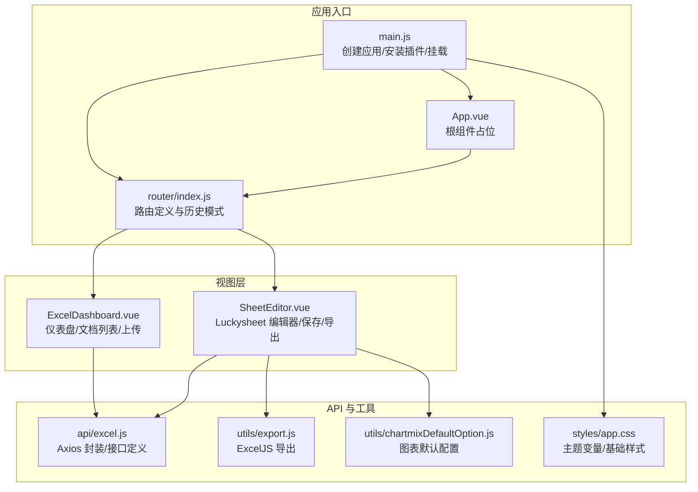
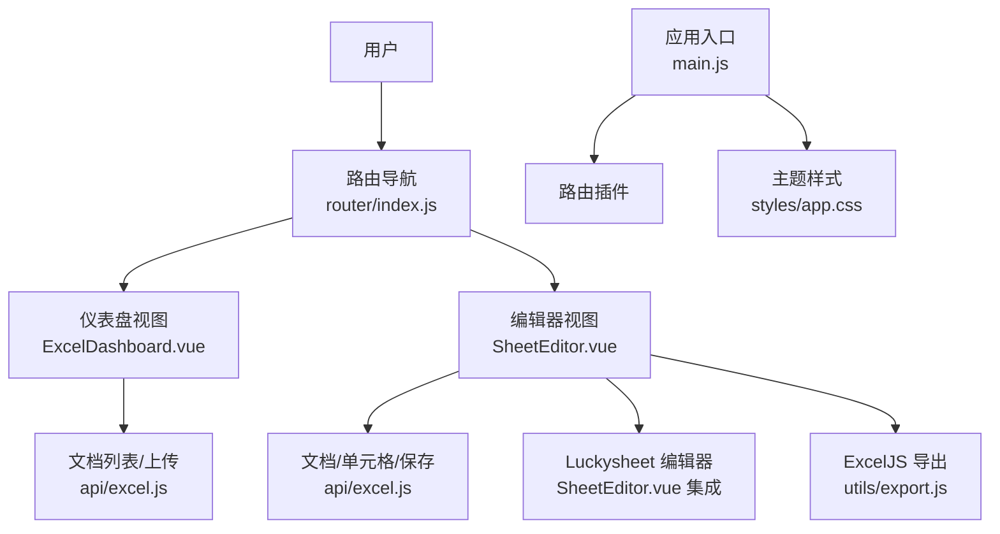
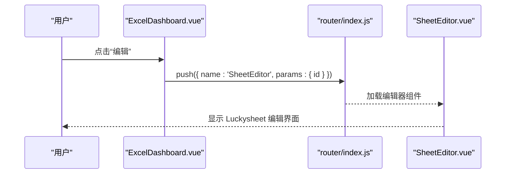
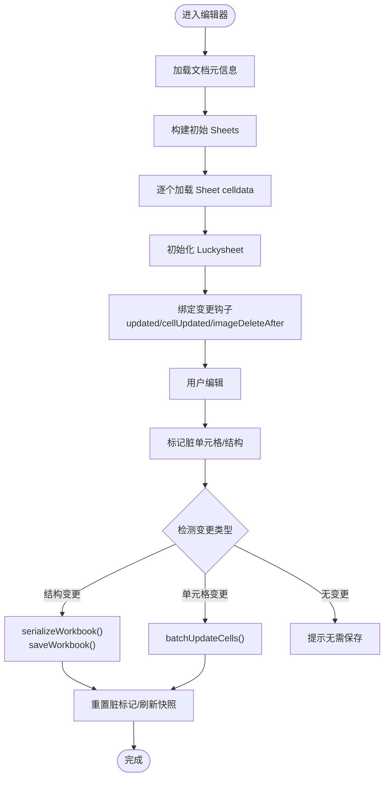
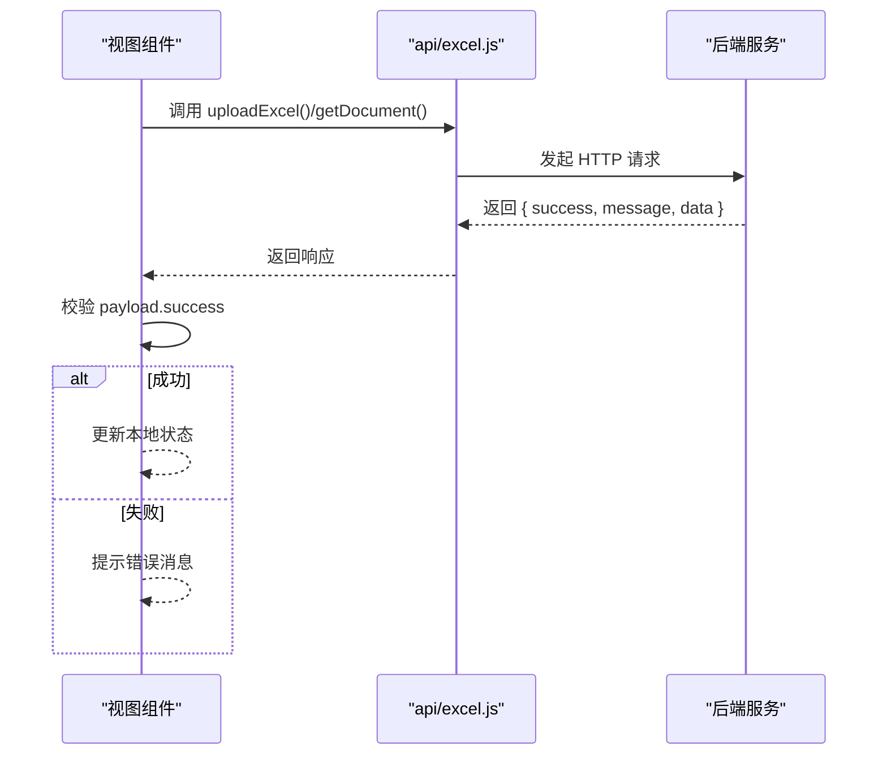
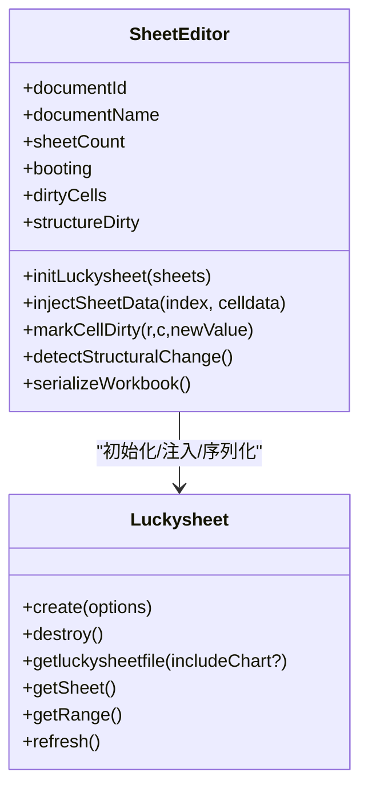
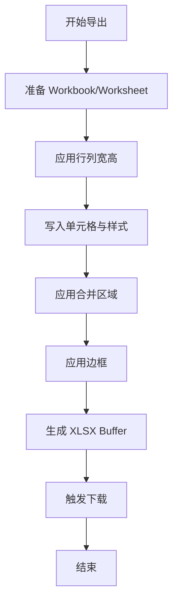
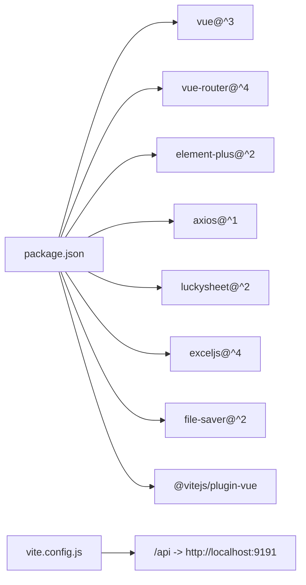

# 前端应用架构

<cite>
**本文引用的文件**   
- [main.js](file://dataloom-web/src/main.js)
- [App.vue](file://dataloom-web/src/App.vue)
- [router/index.js](file://dataloom-web/src/router/index.js)
- [package.json](file://dataloom-web/package.json)
- [vite.config.js](file://dataloom-web/vite.config.js)
- [ExcelDashboard.vue](file://dataloom-web/src/views/ExcelDashboard.vue)
- [SheetEditor.vue](file://dataloom-web/src/views/SheetEditor.vue)
- [api/excel.js](file://dataloom-web/src/api/excel.js)
- [utils/export.js](file://dataloom-web/src/utils/export.js)
- [styles/app.css](file://dataloom-web/src/styles/app.css)
- [utils/chartmixDefaultOption.js](file://dataloom-web/src/utils/chartmixDefaultOption.js)
</cite>

## 目录
1. [引言](#引言)
2. [项目结构](#项目结构)
3. [核心组件](#核心组件)
4. [架构总览](#架构总览)
5. [详细组件分析](#详细组件分析)
6. [依赖关系分析](#依赖关系分析)
7. [性能考量](#性能考量)
8. [故障排查指南](#故障排查指南)
9. [结论](#结论)
10. [附录](#附录)

## 引言
本文件面向 DataLoom 前端应用，系统性梳理基于 Vue 3 Composition API 的组件设计模式、单页应用（SPA）路由与导航机制、组件间通信与状态管理、Axios API 封装与错误处理策略、Luckysheet 编辑器集成与配置、ExcelJS 导出实现与性能优化、以及响应式设计与用户体验最佳实践。文档同时提供组件开发规范与代码组织建议，帮助开发者高效理解与扩展前端功能。

## 项目结构
前端采用 Vue 3 + Vite 架构，核心入口为应用挂载与路由注册；页面由路由驱动，视图组件通过 Composition API 管理状态与副作用；API 层统一封装请求与错误处理；工具模块负责导出等横切能力；样式通过 CSS 变量与媒体查询实现主题与响应式布局。

**图表来源**
- [main.js:1-19](file://dataloom-web/src/main.js#L1-L19)
- [router/index.js:1-21](file://dataloom-web/src/router/index.js#L1-L21)
- [App.vue:1-4](file://dataloom-web/src/App.vue#L1-L4)
- [ExcelDashboard.vue:1-386](file://dataloom-web/src/views/ExcelDashboard.vue#L1-L386)
- [SheetEditor.vue:1-970](file://dataloom-web/src/views/SheetEditor.vue#L1-L970)
- [api/excel.js:1-79](file://dataloom-web/src/api/excel.js#L1-L79)
- [utils/export.js:1-239](file://dataloom-web/src/utils/export.js#L1-L239)
- [styles/app.css:1-65](file://dataloom-web/src/styles/app.css#L1-L65)
- [utils/chartmixDefaultOption.js](file://dataloom-web/src/utils/chartmixDefaultOption.js)

**章节来源**
- [main.js:1-19](file://dataloom-web/src/main.js#L1-L19)
- [router/index.js:1-21](file://dataloom-web/src/router/index.js#L1-L21)
- [package.json:1-27](file://dataloom-web/package.json#L1-L27)
- [vite.config.js:1-26](file://dataloom-web/vite.config.js#L1-L26)

## 核心组件
- 应用入口与插件安装：创建 Vue 应用实例，全局注册 Element Plus 图标组件，安装 Element Plus 与路由插件，挂载根组件。
- 根组件：通过路由视图占位，承载页面切换。
- 路由配置：定义首页仪表盘与编辑器两个异步路由，使用哈希历史模式，支持动态参数传递。
- 视图组件：
  - 仪表盘：展示文档列表、分页、上传、重命名、删除等交互；调用 API 获取文档与上传文件。
  - 编辑器：集成 Luckysheet，按需加载各 Sheet 的单元格数据，维护增量/全量保存策略，支持导出为 Excel。
- API 封装：以 Axios 创建带前缀的基础客户端，统一处理上传进度、超时与接口契约。
- 导出工具：基于 ExcelJS 将工作簿数据转换为 XLSX 并触发下载。
- 样式体系：CSS 变量定义主题色，卡片、表格等组件样式统一；媒体查询适配移动端。

**章节来源**
- [main.js:10-19](file://dataloom-web/src/main.js#L10-L19)
- [App.vue:1-4](file://dataloom-web/src/App.vue#L1-L4)
- [router/index.js:3-20](file://dataloom-web/src/router/index.js#L3-L20)
- [ExcelDashboard.vue:106-229](file://dataloom-web/src/views/ExcelDashboard.vue#L106-L229)
- [SheetEditor.vue:48-132](file://dataloom-web/src/views/SheetEditor.vue#L48-L132)
- [api/excel.js:3-79](file://dataloom-web/src/api/excel.js#L3-L79)
- [utils/export.js:4-28](file://dataloom-web/src/utils/export.js#L4-L28)
- [styles/app.css:1-65](file://dataloom-web/src/styles/app.css#L1-L65)

## 架构总览
前端采用“路由驱动视图 + 组合式 API 状态 + Axios 封装 + 工具函数”的分层架构。路由负责页面导航与参数传递；视图组件通过组合式 API 管理本地状态与副作用；API 层统一处理请求与错误；工具模块提供导出等通用能力；样式层提供主题与响应式支撑。

**图表来源**
- [router/index.js:1-21](file://dataloom-web/src/router/index.js#L1-L21)
- [ExcelDashboard.vue:106-229](file://dataloom-web/src/views/ExcelDashboard.vue#L106-L229)
- [SheetEditor.vue:48-132](file://dataloom-web/src/views/SheetEditor.vue#L48-L132)
- [api/excel.js:1-79](file://dataloom-web/src/api/excel.js#L1-L79)
- [utils/export.js:1-239](file://dataloom-web/src/utils/export.js#L1-L239)
- [main.js:1-19](file://dataloom-web/src/main.js#L1-L19)
- [styles/app.css:1-65](file://dataloom-web/src/styles/app.css#L1-L65)

## 详细组件分析

### 路由与导航机制
- 路由定义：首页路径指向仪表盘组件，编辑器路径支持动态参数 id，并启用懒加载。
- 历史模式：使用哈希历史，避免部署到子路径时的后端路由冲突。
- 页面跳转：仪表盘通过路由名称与参数跳转至编辑器；编辑器提供返回按钮回到仪表盘。

**图表来源**
- [router/index.js:3-14](file://dataloom-web/src/router/index.js#L3-L14)
- [ExcelDashboard.vue:174-176](file://dataloom-web/src/views/ExcelDashboard.vue#L174-L176)
- [SheetEditor.vue:57-58](file://dataloom-web/src/views/SheetEditor.vue#L57-L58)

**章节来源**
- [router/index.js:1-21](file://dataloom-web/src/router/index.js#L1-L21)
- [ExcelDashboard.vue:174-176](file://dataloom-web/src/views/ExcelDashboard.vue#L174-L176)
- [SheetEditor.vue:57-58](file://dataloom-web/src/views/SheetEditor.vue#L57-L58)

### 组件状态管理与数据流
- 仪表盘：使用 ref 管理加载、上传、分页等状态；通过 API 获取文档列表并渲染表格；上传文件后根据返回结果决定刷新或跳转。
- 编辑器：使用 ref/computed/reactive 维护文档元信息、Sheet 映射、脏标记（单元格/结构）、加载进度等；通过 hooks 订阅 Luckysheet 变更事件，实时标记增量；保存时区分结构变更与单元格变更，分别走全量快照或批量增量更新。

**图表来源**
- [SheetEditor.vue:134-173](file://dataloom-web/src/views/SheetEditor.vue#L134-L173)
- [SheetEditor.vue:247-416](file://dataloom-web/src/views/SheetEditor.vue#L247-L416)
- [SheetEditor.vue:547-631](file://dataloom-web/src/views/SheetEditor.vue#L547-L631)
- [SheetEditor.vue:633-783](file://dataloom-web/src/views/SheetEditor.vue#L633-L783)

**章节来源**
- [ExcelDashboard.vue:106-229](file://dataloom-web/src/views/ExcelDashboard.vue#L106-L229)
- [SheetEditor.vue:48-132](file://dataloom-web/src/views/SheetEditor.vue#L48-L132)
- [SheetEditor.vue:247-416](file://dataloom-web/src/views/SheetEditor.vue#L247-L416)
- [SheetEditor.vue:547-631](file://dataloom-web/src/views/SheetEditor.vue#L547-L631)

### 组件间通信与事件处理
- 路由参数：编辑器通过路由参数接收文档 id，避免跨组件传递复杂状态。
- 事件监听：编辑器在挂载时绑定键盘与工具栏点击事件，延时标记当前选区为脏，确保变更被跟踪。
- 生命周期：在组件卸载时销毁 Luckysheet 实例，移除事件监听，防止内存泄漏。

**章节来源**
- [SheetEditor.vue:119-132](file://dataloom-web/src/views/SheetEditor.vue#L119-L132)
- [SheetEditor.vue:404-416](file://dataloom-web/src/views/SheetEditor.vue#L404-L416)

### Axios API 封装与错误处理
- 基础客户端：设置 baseURL 与超时，统一处理上传进度回调。
- 接口契约：约定返回体包含 success/message/data 字段，业务侧统一校验与错误提示。
- 错误策略：对每个异步流程包裹 try/catch，使用消息提示反馈用户；在 finally 中收束 loading 状态。

**图表来源**
- [api/excel.js:3-79](file://dataloom-web/src/api/excel.js#L3-L79)
- [ExcelDashboard.vue:126-140](file://dataloom-web/src/views/ExcelDashboard.vue#L126-L140)
- [SheetEditor.vue:134-173](file://dataloom-web/src/views/SheetEditor.vue#L134-L173)

**章节来源**
- [api/excel.js:3-79](file://dataloom-web/src/api/excel.js#L3-L79)
- [ExcelDashboard.vue:126-140](file://dataloom-web/src/views/ExcelDashboard.vue#L126-L140)
- [SheetEditor.vue:134-173](file://dataloom-web/src/views/SheetEditor.vue#L134-L173)

### Luckysheet 编辑器集成与配置
- 初始化：销毁旧实例，创建 Luckysheet，启用中文、工具栏、统计栏、计算强制；启用图表插件并配置插件 URL。
- 数据注入：按 Sheet 顺序加载 celldata，必要时重建网格数据并刷新当前页。
- 钩子与脏标记：订阅 workbookCreateAfter、updated、cellUpdated、imageDeleteAfter 等事件，维护 workbookDirty/structureDirty 与 dirtyCells。
- 结构快照：保存工作簿结构快照，对比结构变更，决定全量或增量保存。
- 图表兼容：针对 chartmix 插件的 chartOptions 生命周期进行四步修复策略（ECharts 兜底 → 清理僵尸 → 安全刷新 → 序列化）。

**图表来源**
- [SheetEditor.vue:247-416](file://dataloom-web/src/views/SheetEditor.vue#L247-L416)
- [SheetEditor.vue:482-531](file://dataloom-web/src/views/SheetEditor.vue#L482-L531)
- [SheetEditor.vue:633-783](file://dataloom-web/src/views/SheetEditor.vue#L633-L783)

**章节来源**
- [SheetEditor.vue:247-416](file://dataloom-web/src/views/SheetEditor.vue#L247-L416)
- [SheetEditor.vue:482-531](file://dataloom-web/src/views/SheetEditor.vue#L482-L531)
- [SheetEditor.vue:633-783](file://dataloom-web/src/views/SheetEditor.vue#L633-L783)

### ExcelJS 导出实现与性能优化
- 数据准备：遍历 sheets，将二维数组 data 转换为 celldata，应用行列维度、合并区域、边框等配置。
- 样式映射：颜色标准化（RGB/HEX/ARGB），字体族映射，对齐与旋转转换，数字格式兼容。
- 性能策略：仅在存在有效数据时写入工作表；对空工作簿自动补加默认表；最终一次性生成缓冲并触发下载，减少中间对象数量。

**图表来源**
- [utils/export.js:4-28](file://dataloom-web/src/utils/export.js#L4-L28)
- [utils/export.js:30-98](file://dataloom-web/src/utils/export.js#L30-L98)
- [utils/export.js:100-239](file://dataloom-web/src/utils/export.js#L100-L239)

**章节来源**
- [utils/export.js:4-28](file://dataloom-web/src/utils/export.js#L4-L28)
- [utils/export.js:30-98](file://dataloom-web/src/utils/export.js#L30-L98)
- [utils/export.js:100-239](file://dataloom-web/src/utils/export.js#L100-L239)

### 响应式设计与用户体验优化
- 主题变量：通过 CSS 变量统一背景、面板、强调色与阴影，便于主题切换与一致性。
- 布局适配：仪表盘在小屏下调整网格与按钮宽度，确保操作可用性。
- 交互反馈：加载、上传、保存、导出均提供 Loading 状态与消息提示；删除与重命名提供二次确认。
- 键盘与工具栏联动：编辑器对键盘删除键与工具栏点击进行延时标记，提升变更追踪准确性。

**章节来源**
- [styles/app.css:1-65](file://dataloom-web/src/styles/app.css#L1-L65)
- [ExcelDashboard.vue:264-384](file://dataloom-web/src/views/ExcelDashboard.vue#L264-L384)
- [SheetEditor.vue:30-36](file://dataloom-web/src/views/SheetEditor.vue#L30-L36)
- [SheetEditor.vue:404-416](file://dataloom-web/src/views/SheetEditor.vue#L404-L416)

## 依赖关系分析
- 运行时依赖：Vue 3、Vue Router、Element Plus、Axios、Luckysheet、ExcelJS、FileSaver。
- 开发依赖：Vite、@vitejs/plugin-vue。
- 代理与端口：Vite 服务器代理 /api 到后端 9191 端口，开发环境主机与端口配置一致。

**图表来源**
- [package.json:12-25](file://dataloom-web/package.json#L12-L25)
- [vite.config.js:15-20](file://dataloom-web/vite.config.js#L15-L20)

**章节来源**
- [package.json:12-25](file://dataloom-web/package.json#L12-L25)
- [vite.config.js:12-24](file://dataloom-web/vite.config.js#L12-L24)

## 性能考量
- 分页与懒加载：仪表盘分页加载文档列表，编辑器按 Sheet 顺序加载 celldata，避免一次性传输大量数据。
- 增量保存：通过结构快照与脏标记区分增量与全量保存，降低网络与存储压力。
- 导出优化：仅在存在数据时写入，避免空工作簿开销；样式转换集中处理，减少重复计算。
- 资源释放：组件卸载时销毁 Luckysheet，移除事件监听，防止内存泄漏与事件累积。

[本节为通用性能建议，不直接分析具体文件]

## 故障排查指南
- 文档加载失败：检查后端接口返回字段与错误提示；确认路由参数 id 是否正确传递。
- 上传失败：确认文件类型限制与上传进度回调；查看消息提示中的错误原因。
- Luckysheet 初始化失败：检查资源加载与插件 URL 配置；确认容器元素是否存在。
- 保存异常：区分结构变更与单元格变更路径；查看序列化过程中的图表修复日志。
- 导出空白：确认传入的 sheets 数据是否为空；检查样式映射与数值格式转换。

**章节来源**
- [ExcelDashboard.vue:126-140](file://dataloom-web/src/views/ExcelDashboard.vue#L126-L140)
- [SheetEditor.vue:134-173](file://dataloom-web/src/views/SheetEditor.vue#L134-L173)
- [SheetEditor.vue:312-321](file://dataloom-web/src/views/SheetEditor.vue#L312-L321)
- [SheetEditor.vue:547-631](file://dataloom-web/src/views/SheetEditor.vue#L547-L631)
- [utils/export.js:18-28](file://dataloom-web/src/utils/export.js#L18-L28)

## 结论
DataLoom 前端以 Vue 3 Composition API 为核心，结合路由驱动与 Axios 封装，实现了清晰的视图层与稳定的交互体验。Luckysheet 集成通过钩子与快照机制保障数据一致性与性能；ExcelJS 导出提供完整的样式还原与优化策略。整体架构具备良好的可扩展性与可维护性，适合进一步引入状态管理方案与测试体系。

[本节为总结性内容，不直接分析具体文件]

## 附录
- 组件开发规范与代码组织建议
  - 使用 Composition API 管理本地状态与副作用，保持组件职责单一。
  - 将跨组件共享逻辑抽取为 Composables 或工具函数，避免重复。
  - API 层统一错误处理与消息提示，保持 UI 一致性。
  - 样式通过 CSS 变量与媒体查询实现主题与响应式，避免内联样式污染。
  - 导出与编辑等重计算任务尽量延迟到用户显式触发，避免后台阻塞。
  - 为关键流程添加日志与监控埋点，便于问题定位与性能分析。

[本节为通用指导，不直接分析具体文件]