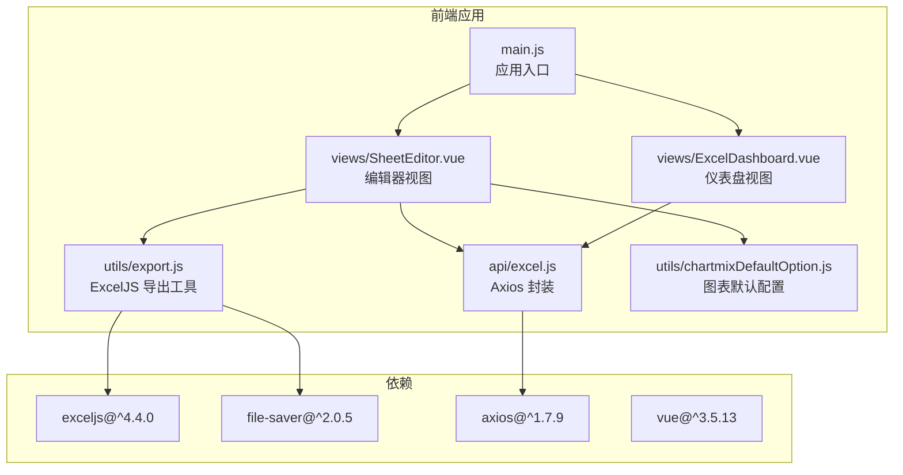
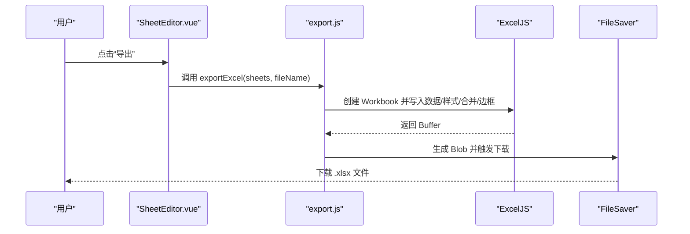
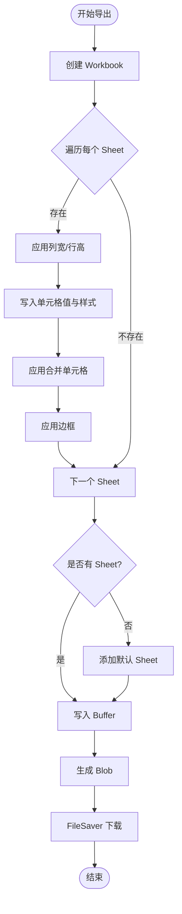
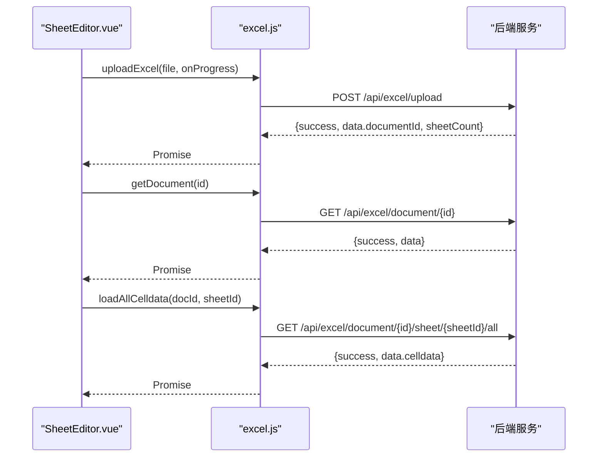
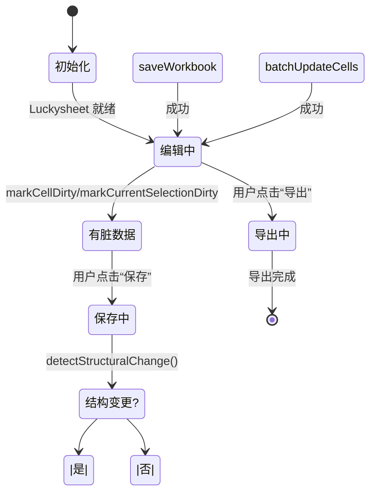
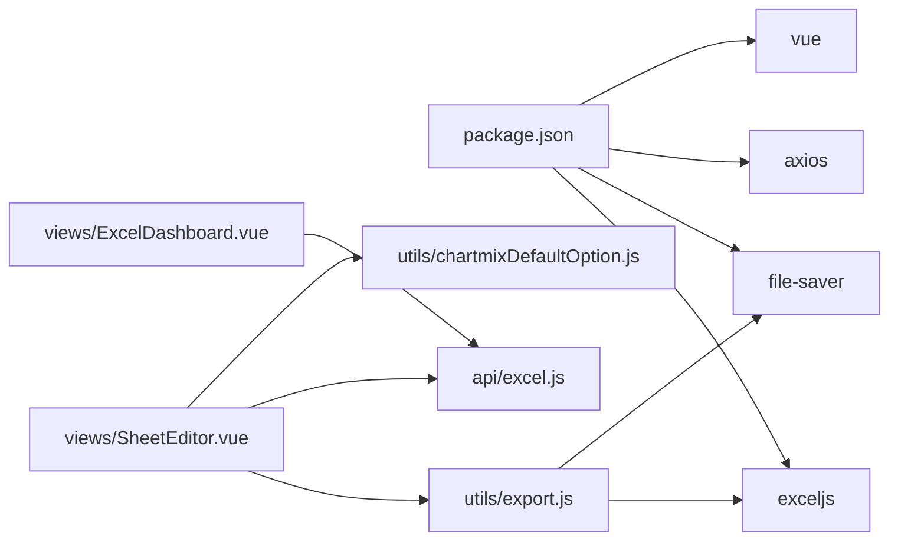

# 工具函数库

<cite>
**本文档引用的文件**
- [export.js](file://dataloom-web/src/utils/export.js)
- [excel.js](file://dataloom-web/src/api/excel.js)
- [package.json](file://dataloom-web/package.json)
- [main.js](file://dataloom-web/src/main.js)
- [ExcelDashboard.vue](file://dataloom-web/src/views/ExcelDashboard.vue)
- [SheetEditor.vue](file://dataloom-web/src/views/SheetEditor.vue)
- [chartmixDefaultOption.js](file://dataloom-web/src/utils/chartmixDefaultOption.js)
- [README.md](file://README.md)
- [从零构建在线Excel.md](file://从零构建在线Excel.md)
</cite>

## 目录
1. [简介](#简介)
2. [项目结构](#项目结构)
3. [核心组件](#核心组件)
4. [架构总览](#架构总览)
5. [详细组件分析](#详细组件分析)
6. [依赖分析](#依赖分析)
7. [性能考虑](#性能考虑)
8. [故障排除指南](#故障排除指南)
9. [结论](#结论)
10. [附录](#附录)

## 简介
本文件面向前端工具函数库，聚焦以下主题：
- Excel 导出功能的实现原理与 ExcelJS 使用方法
- 数据格式转换与类型处理的工具函数
- 通用工具函数的设计模式与复用策略
- 性能优化工具与缓存机制
- 工具函数的测试方法与质量保证措施
- 工具函数的扩展指南与最佳实践
- 工具函数与业务逻辑的解耦设计原则

## 项目结构
前端工具函数库位于 dataloom-web/src/utils，核心导出工具 export.js 与业务视图 SheetEditor.vue 协同工作，通过 API 层 excel.js 与后端交互。

**图表来源**
- [main.js:1-19](file://dataloom-web/src/main.js#L1-L19)
- [SheetEditor.vue:1-120](file://dataloom-web/src/views/SheetEditor.vue#L1-L120)
- [ExcelDashboard.vue:1-120](file://dataloom-web/src/views/ExcelDashboard.vue#L1-L120)
- [excel.js:1-79](file://dataloom-web/src/api/excel.js#L1-L79)
- [export.js:1-239](file://dataloom-web/src/utils/export.js#L1-L239)
- [chartmixDefaultOption.js:1-2](file://dataloom-web/src/utils/chartmixDefaultOption.js#L1-L2)
- [package.json:12-21](file://dataloom-web/package.json#L12-L21)

**章节来源**
- [package.json:12-21](file://dataloom-web/package.json#L12-L21)
- [main.js:1-19](file://dataloom-web/src/main.js#L1-L19)
- [README.md:217-242](file://README.md#L217-L242)

## 核心组件
- ExcelJS 导出工具 export.js：负责将前端 Luckysheet 编辑状态转换为 ExcelJS Workbook，设置样式、合并单元格、边框等，并通过 FileSaver 输出 .xlsx 文件。
- API 封装 excel.js：提供上传、文档查询、数据加载、批量更新、全量保存等接口，统一 baseURL 与超时配置。
- 视图组件 SheetEditor.vue：集成 Luckysheet 编辑器，负责脏数据追踪、结构快照、序列化与保存策略，并调用导出工具进行前端导出。
- 图表默认配置 chartmixDefaultOption.js：为图表插件 chartmix 提供默认选项，保障图表序列化与恢复的稳定性。

**章节来源**
- [export.js:4-28](file://dataloom-web/src/utils/export.js#L4-L28)
- [excel.js:3-79](file://dataloom-web/src/api/excel.js#L3-L79)
- [SheetEditor.vue:547-631](file://dataloom-web/src/views/SheetEditor.vue#L547-L631)
- [chartmixDefaultOption.js:1-2](file://dataloom-web/src/utils/chartmixDefaultOption.js#L1-L2)

## 架构总览
前端导出采用“前端直出”策略：Luckysheet 的编辑状态在浏览器内存中，ExcelJS 直接读取并生成 .xlsx，避免网络传输与样式重建成本，实现样式零丢失与秒级导出。

**图表来源**
- [SheetEditor.vue:32-34](file://dataloom-web/src/views/SheetEditor.vue#L32-L34)
- [export.js:4-28](file://dataloom-web/src/utils/export.js#L4-L28)
- [export.js:22-27](file://dataloom-web/src/utils/export.js#L22-L27)

## 详细组件分析

### ExcelJS 导出工具 export.js
- 导出入口
  - exportExcel(sheets, fileName)：接受单个或多个 Sheet，循环创建 Worksheet，应用维度、单元格、合并、边框等配置，最终生成 .xlsx 并下载。
- 样式转换
  - applyDimensions：将列宽像素值转换为 Excel 列宽，行高像素值转换为 Excel 行高。
  - applyCells：遍历二维数组，设置填充、字体、对齐、值、数字格式。
  - applyMerges：根据合并配置合并单元格。
  - applyBorders：支持范围边框与单个单元格边框，按类型映射到 ExcelJS 边框对象。
- 值与格式转换
  - convertValue：支持公式与富文本拼接。
  - convertNumberFormat：将单元格数字格式标准化，修正年份占位符。
- 颜色与字体
  - stripColor：统一 RGBA/十六进制颜色为 ExcelJS ARGB 格式。
  - convertFont：字体族映射与粗斜下划线/删除线处理。
  - convertAlignment：垂直/水平对齐、自动换行、文本旋转。
- 边框与样式
  - convertBorder/convertCellBorders：将类型枚举映射为 ExcelJS 边框对象。
  - convertBorderStyle：边框样式映射。
- 文件名与安全
  - sanitizeFileName：剔除非法字符，确保文件名可用。

**图表来源**
- [export.js:4-28](file://dataloom-web/src/utils/export.js#L4-L28)
- [export.js:30-98](file://dataloom-web/src/utils/export.js#L30-L98)
- [export.js:100-238](file://dataloom-web/src/utils/export.js#L100-L238)

**章节来源**
- [export.js:4-28](file://dataloom-web/src/utils/export.js#L4-L28)
- [export.js:30-98](file://dataloom-web/src/utils/export.js#L30-L98)
- [export.js:100-238](file://dataloom-web/src/utils/export.js#L100-L238)

### API 封装 excel.js
- 上传与进度
  - uploadExcel(file, onProgress)：FormData 上传，支持进度回调。
- 文档与数据
  - getDocumentList/pageNum, pageSize：分页获取文档列表。
  - getDocument(id)：获取文档元信息与 Sheet 列表。
  - loadAllCelldata(docId, sheetId)：加载 Sheet 全部 celldata。
- 写入策略
  - batchUpdateCells(docId, updates)：批量增量更新单元格。
  - saveWorkbook(docId, sheets)：全量快照保存（结构/图片/图表变更时使用）。
- 文档管理
  - renameDocument(id, newName)/deleteDocument(id)：重命名与软删除。

**图表来源**
- [excel.js:13-25](file://dataloom-web/src/api/excel.js#L13-L25)
- [excel.js:32-41](file://dataloom-web/src/api/excel.js#L32-L41)
- [excel.js:48-50](file://dataloom-web/src/api/excel.js#L48-L50)

**章节来源**
- [excel.js:13-79](file://dataloom-web/src/api/excel.js#L13-L79)

### 视图组件 SheetEditor.vue 的导出与保存
- 导出触发
  - 模板按钮绑定 exportCurrentWorkbook，调用 exportExcel(sheets, fileName)。
- 保存策略
  - 脏数据追踪：cellUpdated 与 updated 事件驱动 markCellDirty/markCurrentSelectionDirty。
  - 结构快照：captureStructureSnapshot/detectStructuralChange 判断是否需要全量保存。
  - 序列化：serializeWorkbook 将 Luckysheet 数据转换为后端可接受的 sheets 格式，包含 celldata、config、chart 等。
  - 保存分支：结构变更走 saveWorkbook，仅单元格变更走 batchUpdateCells。
- 图表处理
  - chartmix 默认配置注入与兜底：优先从 ECharts 实例恢复 chartOptions，清理无效图表，再安全调用 getluckysheetfile(true)。

**图表来源**
- [SheetEditor.vue:547-631](file://dataloom-web/src/views/SheetEditor.vue#L547-L631)
- [SheetEditor.vue:633-783](file://dataloom-web/src/views/SheetEditor.vue#L633-L783)
- [SheetEditor.vue:486-531](file://dataloom-web/src/views/SheetEditor.vue#L486-L531)

**章节来源**
- [SheetEditor.vue:32-34](file://dataloom-web/src/views/SheetEditor.vue#L32-L34)
- [SheetEditor.vue:547-631](file://dataloom-web/src/views/SheetEditor.vue#L547-L631)
- [SheetEditor.vue:633-783](file://dataloom-web/src/views/SheetEditor.vue#L633-L783)
- [SheetEditor.vue:486-531](file://dataloom-web/src/views/SheetEditor.vue#L486-L531)

### 图表默认配置 chartmixDefaultOption.js
- 作用：为 chartmix 插件提供默认的 ECharts 选项，避免 chartOptions 缺失导致序列化崩溃。
- 使用：在 serializeWorkbook 前，为 chart 项补充 defaultOption，确保后续 getluckysheetfile(true) 能正确回填 chartOptions。

**章节来源**
- [chartmixDefaultOption.js:1-2](file://dataloom-web/src/utils/chartmixDefaultOption.js#L1-L2)
- [SheetEditor.vue:288-292](file://dataloom-web/src/views/SheetEditor.vue#L288-L292)

## 依赖分析
- 外部依赖
  - exceljs：ExcelJS 核心库，负责 Workbook/Worksheet/样式/合并/边框等。
  - file-saver：生成 Blob 并触发浏览器下载。
  - axios：HTTP 客户端，封装 API。
  - vue：响应式与组件系统。
- 内部依赖
  - export.js 依赖 exceljs 与 file-saver。
  - SheetEditor.vue 依赖 export.js、excel.js、chartmixDefaultOption.js。
  - ExcelDashboard.vue 依赖 excel.js。

**图表来源**
- [package.json:12-21](file://dataloom-web/package.json#L12-L21)
- [export.js:1-2](file://dataloom-web/src/utils/export.js#L1-L2)
- [SheetEditor.vue:53-55](file://dataloom-web/src/views/SheetEditor.vue#L53-L55)
- [ExcelDashboard.vue:111](file://dataloom-web/src/views/ExcelDashboard.vue#L111)

**章节来源**
- [package.json:12-21](file://dataloom-web/package.json#L12-L21)
- [export.js:1-2](file://dataloom-web/src/utils/export.js#L1-L2)
- [SheetEditor.vue:53-55](file://dataloom-web/src/views/SheetEditor.vue#L53-L55)
- [ExcelDashboard.vue:111](file://dataloom-web/src/views/ExcelDashboard.vue#L111)

## 性能考虑
- 前端直出优势
  - 零网络传输，样式在内存中直接转换，导出速度快、样式还原度高。
- 大文件导出
  - 浏览器内存占用与卡顿风险：建议在导出前提示用户并显示加载动画，避免长时间阻塞 UI。
- 保存策略
  - 增量保存：仅更新变更单元格，降低数据库 IO。
  - 全量快照：结构/图片/图表/超链接/条件格式变更时使用，确保一致性。
- 图表序列化
  - 先从 ECharts 实例恢复 chartOptions，再清理无效图表，最后安全调用 getluckysheetfile(true)，避免崩溃与重复计算。

**章节来源**
- [README.md:67-70](file://README.md#L67-L70)
- [从零构建在线Excel.md:309-342](file://从零构建在线Excel.md#L309-L342)
- [SheetEditor.vue:556-631](file://dataloom-web/src/views/SheetEditor.vue#L556-L631)
- [SheetEditor.vue:658-734](file://dataloom-web/src/views/SheetEditor.vue#L658-L734)

## 故障排除指南
- 导出文件样式缺失
  - 检查 Luckysheet 数据中是否存在字体、颜色、边框等样式字段；确认 convertFont/convertFill/convertAlignment 是否被正确调用。
- 导出文件名非法
  - sanitizeFileName 会替换非法字符，确保文件名可用。
- 颜色格式不兼容
  - stripColor 统一 RGBA/十六进制为 ARGB；若输入异常，将回退为默认黑色。
- 图表序列化崩溃
  - 确保 defaultOption 注入；先恢复 ECharts 实例配置，再清理无效图表，最后调用 getluckysheetfile(true)。
- 保存失败或未生效
  - 检查 detectStructuralChange 与 dirtyCells 脏数据集合；确认 saveWorkbook 与 batchUpdateCells 的分支逻辑。

**章节来源**
- [export.js:236-238](file://dataloom-web/src/utils/export.js#L236-L238)
- [export.js:216-234](file://dataloom-web/src/utils/export.js#L216-L234)
- [SheetEditor.vue:658-734](file://dataloom-web/src/views/SheetEditor.vue#L658-L734)
- [SheetEditor.vue:556-631](file://dataloom-web/src/views/SheetEditor.vue#L556-L631)

## 结论
本工具函数库通过“前端直出”的导出策略，结合完善的样式转换与类型处理，实现了高质量的 Excel 导出能力。配合脏数据追踪与结构快照的保存策略，兼顾性能与一致性。图表序列化的兜底与清理机制进一步提升了稳定性。整体设计遵循解耦原则，便于扩展与维护。

## 附录

### 设计模式与复用策略
- 函数职责单一：applyDimensions/applyCells/applyMerges/applyBorders 等分别处理维度、单元格、合并、边框，便于测试与复用。
- 映射表与常量：convertFont/convertAlignment/convertBorderStyle/stripColor 等通过映射表集中管理，便于扩展与维护。
- 稳定序列化：stableJson 用于结构快照比较，避免对象键顺序差异导致误判。

**章节来源**
- [export.js:30-98](file://dataloom-web/src/utils/export.js#L30-L98)
- [export.js:121-158](file://dataloom-web/src/utils/export.js#L121-L158)
- [export.js:196-214](file://dataloom-web/src/utils/export.js#L196-L214)
- [export.js:216-234](file://dataloom-web/src/utils/export.js#L216-L234)
- [SheetEditor.vue:536-545](file://dataloom-web/src/views/SheetEditor.vue#L536-L545)

### 测试方法与质量保证
- 单元测试建议
  - 对 convertValue/convertNumberFormat/stripColor 等纯函数进行边界值与异常输入测试。
  - 对 applyDimensions/applyCells/applyMerges/applyBorders 进行组合测试，验证样式与布局一致性。
- 端到端测试建议
  - 在 SheetEditor.vue 中模拟编辑行为，断言导出文件的样式与数据正确性。
  - 验证 saveChanges 的分支逻辑：结构变更与增量保存均应通过接口返回校验。
- 质量保障
  - 使用 ESLint/Prettier 统一代码风格。
  - 通过 Git Hooks 在提交前运行 lint 与基础测试。

[本节为通用指导，不直接分析具体文件，故无“章节来源”]

### 扩展指南与最佳实践
- 新增样式支持
  - 在对应转换函数中扩展映射表或新增转换器，保持与现有函数签名一致。
- 性能优化
  - 对大数据集导出增加分片处理与进度反馈；对保存策略增加防抖与批量合并。
- 可靠性
  - 为图表序列化增加重试与降级策略；对颜色与数字格式增加容错与默认值。
- 可维护性
  - 将映射表抽取为独立配置文件；对复杂流程拆分为更细粒度的工具函数。

[本节为通用指导，不直接分析具体文件，故无“章节来源”]

### 与业务逻辑的解耦设计原则
- 导出工具 export.js 仅依赖 Luckysheet 的数据结构，不关心后端存储细节。
- API 封装 excel.js 仅定义接口契约，不包含导出逻辑。
- 视图组件 SheetEditor.vue 负责业务编排与状态管理，导出与保存策略通过工具函数实现，降低耦合度。

**章节来源**
- [README.md:213](file://README.md#L213)
- [SheetEditor.vue:547-631](file://dataloom-web/src/views/SheetEditor.vue#L547-L631)
- [excel.js:3-79](file://dataloom-web/src/api/excel.js#L3-L79)