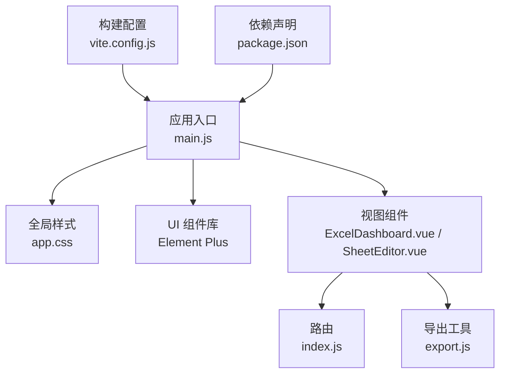
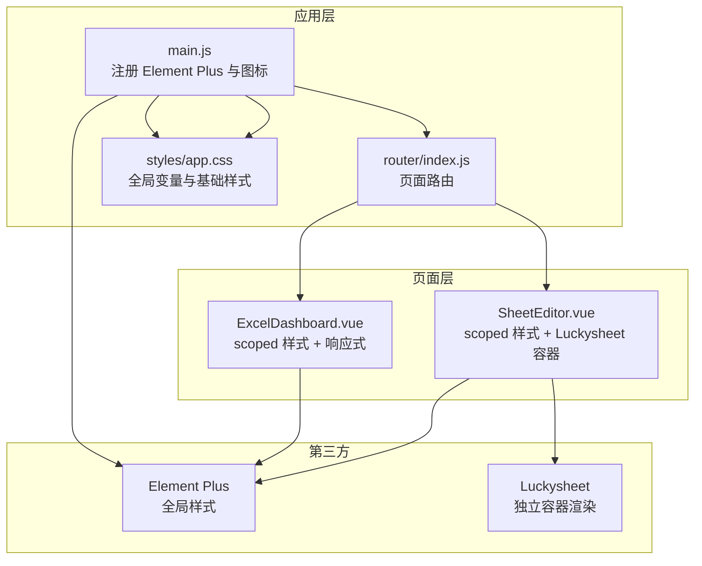
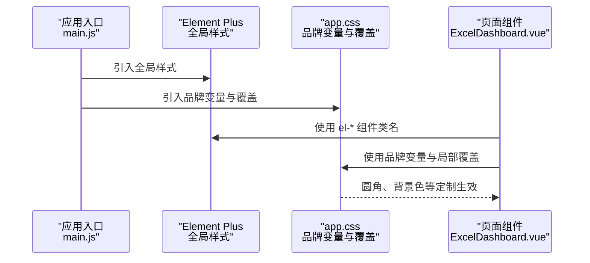
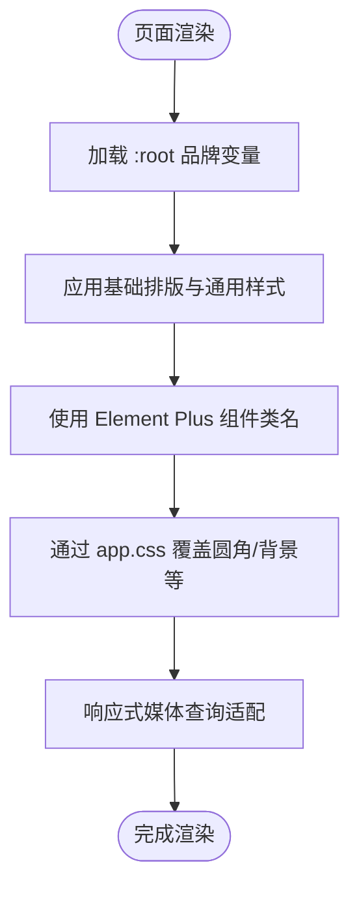
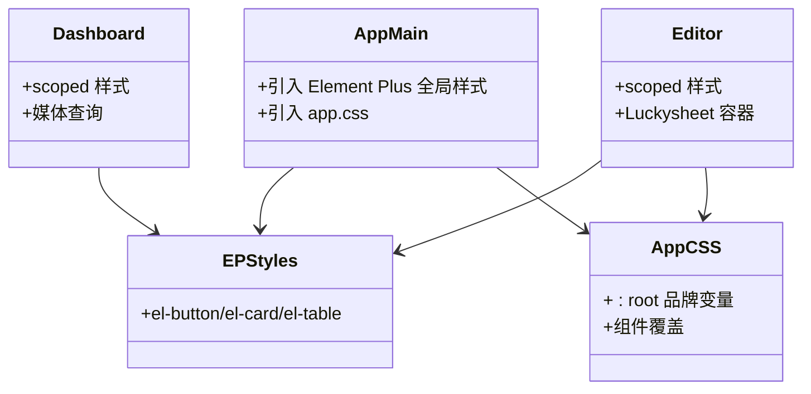
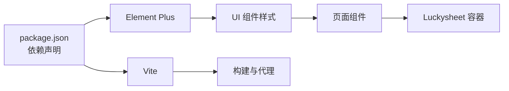

# 样式与主题

<cite>
**本文引用的文件**
- [package.json](file://dataloom-web/package.json)
- [vite.config.js](file://dataloom-web/vite.config.js)
- [main.js](file://dataloom-web/src/main.js)
- [app.css](file://dataloom-web/src/styles/app.css)
- [ExcelDashboard.vue](file://dataloom-web/src/views/ExcelDashboard.vue)
- [SheetEditor.vue](file://dataloom-web/src/views/SheetEditor.vue)
- [index.js](file://dataloom-web/src/router/index.js)
- [export.js](file://dataloom-web/src/utils/export.js)
- [README.md](file://README.md)
</cite>

## 目录
1. [简介](#简介)
2. [项目结构](#项目结构)
3. [核心组件](#核心组件)
4. [架构总览](#架构总览)
5. [详细组件分析](#详细组件分析)
6. [依赖分析](#依赖分析)
7. [性能考虑](#性能考虑)
8. [故障排查指南](#故障排查指南)
9. [结论](#结论)
10. [附录](#附录)

## 简介
本文件聚焦于前端样式系统，围绕以下目标展开：  
- 解释 Element Plus 主题定制与样式覆盖机制  
- 说明 CSS 变量的使用与响应式设计实现  
- 阐述组件样式的隔离与作用域管理  
- 说明主题切换与动态样式更新的可行方案  
- 提供样式性能优化与打包策略建议  
- 提供样式调试工具与浏览器兼容性处理方法  
- 解释自定义样式的开发规范与维护策略  

在当前代码库中，Element Plus 作为主要 UI 组件库，全局引入其基础样式；同时通过自定义 CSS 变量与局部 scoped 样式实现品牌风格与响应式布局。Luckysheet 作为第三方表格引擎，其样式与 Element Plus 样式相互独立，需注意作用域与冲突处理。

## 项目结构
前端位于 dataloom-web，采用 Vue 3 + Vite 构建，Element Plus 作为 UI 组件库，Luckysheet 作为表格编辑器。样式体系由全局 CSS 变量与组件 scoped 样式构成，并通过路由驱动页面切换。

**图表来源**
- [main.js:1-19](file://dataloom-web/src/main.js#L1-L19)
- [app.css:1-65](file://dataloom-web/src/styles/app.css#L1-L65)
- [ExcelDashboard.vue:1-386](file://dataloom-web/src/views/ExcelDashboard.vue#L1-L386)
- [SheetEditor.vue:1-800](file://dataloom-web/src/views/SheetEditor.vue#L1-L800)
- [index.js:1-21](file://dataloom-web/src/router/index.js#L1-L21)
- [export.js:211-238](file://dataloom-web/src/utils/export.js#L211-L238)
- [vite.config.js:1-26](file://dataloom-web/vite.config.js#L1-L26)
- [package.json:1-27](file://dataloom-web/package.json#L1-L27)

**章节来源**
- [main.js:1-19](file://dataloom-web/src/main.js#L1-L19)
- [app.css:1-65](file://dataloom-web/src/styles/app.css#L1-L65)
- [ExcelDashboard.vue:1-386](file://dataloom-web/src/views/ExcelDashboard.vue#L1-L386)
- [SheetEditor.vue:1-800](file://dataloom-web/src/views/SheetEditor.vue#L1-L800)
- [index.js:1-21](file://dataloom-web/src/router/index.js#L1-L21)
- [export.js:211-238](file://dataloom-web/src/utils/export.js#L211-L238)
- [vite.config.js:1-26](file://dataloom-web/vite.config.js#L1-L26)
- [package.json:1-27](file://dataloom-web/package.json#L1-L27)

## 核心组件
- 全局样式与变量：通过 :root 定义品牌色板与通用排版变量，统一 body、按钮、卡片、表格等元素的基础样式。
- Element Plus 样式：在入口处引入 Element Plus 的全局样式，随后通过局部样式覆盖实现圆角、背景色等定制。
- 组件样式：Dashboard 与 Editor 页面均使用 scoped 样式，结合媒体查询实现响应式布局。
- 构建与代理：Vite 配置提供开发服务器、代理与构建参数，影响样式资源加载与产物体积。

**章节来源**
- [app.css:1-65](file://dataloom-web/src/styles/app.css#L1-L65)
- [main.js:1-19](file://dataloom-web/src/main.js#L1-L19)
- [ExcelDashboard.vue:231-385](file://dataloom-web/src/views/ExcelDashboard.vue#L231-L385)
- [SheetEditor.vue:1-46](file://dataloom-web/src/views/SheetEditor.vue#L1-L46)
- [vite.config.js:12-24](file://dataloom-web/vite.config.js#L12-L24)

## 架构总览
下图展示样式系统的整体交互：应用入口引入 Element Plus 与全局样式；页面组件通过 scoped 样式叠加品牌变量；路由驱动页面切换；Luckysheet 以独立容器渲染，其样式与 Element Plus 互不干扰。

**图表来源**
- [main.js:1-19](file://dataloom-web/src/main.js#L1-L19)
- [app.css:1-65](file://dataloom-web/src/styles/app.css#L1-L65)
- [ExcelDashboard.vue:1-386](file://dataloom-web/src/views/ExcelDashboard.vue#L1-L386)
- [SheetEditor.vue:1-46](file://dataloom-web/src/views/SheetEditor.vue#L1-L46)
- [index.js:1-21](file://dataloom-web/src/router/index.js#L1-L21)

## 详细组件分析

### Element Plus 主题定制与样式覆盖
- 全局引入：在入口文件中引入 Element Plus 的全局样式，确保组件默认外观一致。
- 局部覆盖：通过 app.css 对按钮圆角、卡片圆角、表格表头背景等进行定制，避免影响其他组件库样式。
- 组件类名使用：页面中大量使用 el-button、el-card、el-table 等类名，这些样式由 Element Plus 提供，覆盖通过 app.css 生效。

**图表来源**
- [main.js:1-19](file://dataloom-web/src/main.js#L1-L19)
- [app.css:54-64](file://dataloom-web/src/styles/app.css#L54-L64)
- [ExcelDashboard.vue:41-101](file://dataloom-web/src/views/ExcelDashboard.vue#L41-L101)

**章节来源**
- [main.js:1-19](file://dataloom-web/src/main.js#L1-L19)
- [app.css:54-64](file://dataloom-web/src/styles/app.css#L54-L64)
- [ExcelDashboard.vue:41-101](file://dataloom-web/src/views/ExcelDashboard.vue#L41-L101)

### CSS 变量的使用与响应式设计
- 品牌变量：在 :root 定义背景、面板、文字、强调色、阴影等变量，页面通过 var() 使用，便于集中管理与主题切换。
- 基础排版：统一 body 字体、行高、间距，确保一致性。
- 组件变量：针对 Element Plus 组件设置 CSS 变量，如表格表头背景色，提升视觉统一性。
- 响应式布局：Dashboard 页面在 scoped 样式中使用媒体查询，针对小屏设备调整网格与按钮布局。

**图表来源**
- [app.css:1-65](file://dataloom-web/src/styles/app.css#L1-L65)
- [ExcelDashboard.vue:231-385](file://dataloom-web/src/views/ExcelDashboard.vue#L231-L385)

**章节来源**
- [app.css:1-65](file://dataloom-web/src/styles/app.css#L1-L65)
- [ExcelDashboard.vue:231-385](file://dataloom-web/src/views/ExcelDashboard.vue#L231-L385)

### 组件样式的隔离与作用域管理
- scoped 样式：Dashboard 与 Editor 页面均使用 <style scoped>，确保样式仅作用于当前组件，避免污染外部元素。
- 全局样式：app.css 作为全局样式，提供品牌变量与基础覆盖，需谨慎修改以免影响全局。
- Element Plus 样式：通过全局引入与局部覆盖相结合，避免破坏组件库默认行为。
- Luckysheet 容器：Editor 页面将 Luckysheet 渲染到独立容器，其样式与 Element Plus 互不干扰，降低冲突风险。

**图表来源**
- [main.js:1-19](file://dataloom-web/src/main.js#L1-L19)
- [app.css:1-65](file://dataloom-web/src/styles/app.css#L1-L65)
- [ExcelDashboard.vue:231-385](file://dataloom-web/src/views/ExcelDashboard.vue#L231-L385)
- [SheetEditor.vue:1-46](file://dataloom-web/src/views/SheetEditor.vue#L1-L46)

**章节来源**
- [main.js:1-19](file://dataloom-web/src/main.js#L1-L19)
- [app.css:1-65](file://dataloom-web/src/styles/app.css#L1-L65)
- [ExcelDashboard.vue:231-385](file://dataloom-web/src/views/ExcelDashboard.vue#L231-L385)
- [SheetEditor.vue:1-46](file://dataloom-web/src/views/SheetEditor.vue#L1-L46)

### 主题切换与动态样式更新
当前仓库未实现主题切换与动态样式更新。可采用以下方案扩展：
- CSS 变量切换：将品牌变量置于 :root，通过切换根节点的 CSS 变量实现主题切换。
- 动态样式注入：在运行时动态插入/移除样式标签，实现主题切换。
- 组件库主题：Element Plus 支持暗色主题，可通过组件库提供的主题切换能力实现。
- 注意事项：切换时需避免样式闪烁，优先使用 CSS 变量与类名切换，减少重排重绘。

[本节为概念性说明，不直接分析具体文件，故不附“章节来源”]

### 样式性能优化与打包策略
- 构建配置：Vite 默认关闭生产 sourcemap，有助于减小产物体积与提升加载速度。
- 资源加载：通过别名与代理配置，确保开发时静态资源与 API 请求正确转发。
- 样式组织：将品牌变量与覆盖集中在 app.css，减少重复定义，降低样式体积。
- 组件样式：使用 scoped 样式避免全局污染，同时保持样式粒度清晰。

**章节来源**
- [vite.config.js:22-24](file://dataloom-web/vite.config.js#L22-L24)
- [package.json:7-11](file://dataloom-web/package.json#L7-L11)

### 样式调试工具与浏览器兼容性
- 调试工具：使用浏览器开发者工具检查 Element Plus 组件类名与 app.css 覆盖效果；定位 scoped 样式时，可在 Elements 面板查看组件根节点的样式来源。
- 兼容性：关注 CSS 变量在旧版浏览器中的支持情况；必要时提供降级方案或 polyfill。
- 第三方样式：Luckysheet 样式独立，若出现冲突，优先检查其容器层级与 z-index 设置。

[本节为通用指导，不直接分析具体文件，故不附“章节来源”]

### 自定义样式的开发规范与维护策略
- 规范：统一使用品牌变量命名与取值；组件样式尽量通过 scoped 限定作用域；避免深层选择器与 !important。
- 维护：集中管理品牌变量与覆盖规则；建立样式变更审查流程；定期清理未使用的样式。
- 扩展：新增页面时遵循现有命名与结构；如需覆盖 Element Plus 样式，优先在 app.css 中集中处理。

[本节为通用指导，不直接分析具体文件，故不附“章节来源”]

## 依赖分析
- Element Plus：作为 UI 组件库，提供大量可定制的组件类名与默认样式。
- Vite：提供开发服务器、代理与构建能力，影响样式资源加载与产物体积。
- Luckysheet：独立渲染容器，样式与 Element Plus 互不干扰，需注意层级与交互。

**图表来源**
- [package.json:12-21](file://dataloom-web/package.json#L12-L21)
- [vite.config.js:1-26](file://dataloom-web/vite.config.js#L1-L26)
- [main.js:1-19](file://dataloom-web/src/main.js#L1-L19)

**章节来源**
- [package.json:12-21](file://dataloom-web/package.json#L12-L21)
- [vite.config.js:1-26](file://dataloom-web/vite.config.js#L1-L26)
- [main.js:1-19](file://dataloom-web/src/main.js#L1-L19)

## 性能考虑
- 减少全局样式：将品牌变量与覆盖集中在 app.css，避免重复定义。
- 避免深层选择器：减少复杂选择器带来的样式计算成本。
- 控制样式体积：利用 Vite 构建配置，合理启用压缩与去除 sourcemap。
- 组件渲染：Luckysheet 作为重型第三方组件，需关注其渲染时机与容器大小，避免不必要的重绘。

[本节为通用指导，不直接分析具体文件，故不附“章节来源”]

## 故障排查指南
- 样式未生效：检查 app.css 是否正确引入；确认 scoped 样式选择器优先级；核对 Element Plus 类名拼写。
- 品牌变量无效：确认 :root 变量定义与 var() 使用是否一致；检查变量命名与取值。
- 响应式异常：核对媒体查询断点与设备宽度；确认容器宽度计算方式。
- 第三方冲突：检查 Luckysheet 容器层级与 z-index；避免与 Element Plus 样式相互覆盖。

**章节来源**
- [app.css:1-65](file://dataloom-web/src/styles/app.css#L1-L65)
- [ExcelDashboard.vue:231-385](file://dataloom-web/src/views/ExcelDashboard.vue#L231-L385)
- [SheetEditor.vue:1-46](file://dataloom-web/src/views/SheetEditor.vue#L1-L46)

## 结论
本项目通过全局 CSS 变量与 Element Plus 的局部覆盖，实现了统一的品牌风格与基础组件定制；通过 scoped 样式与媒体查询，保障了组件样式隔离与响应式体验。当前未实现主题切换与动态样式更新，建议在不破坏现有结构的前提下，采用 CSS 变量与类名切换的方式扩展主题能力，并持续优化样式体积与渲染性能。

## 附录
- 路由与页面：通过路由驱动页面切换，Dashboard 与 Editor 页面分别承载不同的业务样式需求。
- 导出工具：导出相关工具函数与样式无关，但与前端导出体验密切相关。

**章节来源**
- [index.js:1-21](file://dataloom-web/src/router/index.js#L1-L21)
- [export.js:211-238](file://dataloom-web/src/utils/export.js#L211-L238)
- [README.md:190-215](file://README.md#L190-L215)