# Composition API 使用模式

<cite>
**本文档引用的文件**
- [ExcelDashboard.vue](file://dataloom-web/src/views/ExcelDashboard.vue)
- [SheetEditor.vue](file://dataloom-web/src/views/SheetEditor.vue)
- [excel.js](file://dataloom-web/src/api/excel.js)
- [export.js](file://dataloom-web/src/utils/export.js)
- [chartmixDefaultOption.js](file://dataloom-web/src/utils/chartmixDefaultOption.js)
- [main.js](file://dataloom-web/src/main.js)
- [router/index.js](file://dataloom-web/src/router/index.js)
- [package.json](file://dataloom-web/package.json)
- [vite.config.js](file://dataloom-web/vite.config.js)
</cite>

## 目录
1. [简介](#简介)
2. [项目结构概览](#项目结构概览)
3. [核心组件分析](#核心组件分析)
4. [Composition API 模式详解](#composition-api-模式详解)
5. [响应式数据管理最佳实践](#响应式数据管理最佳实践)
6. [生命周期钩子使用指南](#生命周期钩子使用指南)
7. [组合函数设计模式](#组合函数设计模式)
8. [ExcelDashboard 组件实战](#exceldashboard-组件实战)
9. [SheetEditor 组件实战](#sheeteditor-组件实战)
10. [性能优化策略](#性能优化策略)
11. [常见陷阱与解决方案](#常见陷阱与解决方案)
12. [总结](#总结)

## 简介

DataLoom 是一个基于 Vue 3 Composition API 构建的在线 Excel 协作编辑器。该项目展示了现代前端开发中响应式数据管理、生命周期钩子使用、组合函数设计等最佳实践。系统采用前后端分离架构，前端使用 Vue 3 + Vite + Element Plus，后端使用 Spring Boot，实现了完整的 Excel 文档上传、解析、在线编辑和导出功能。

## 项目结构概览

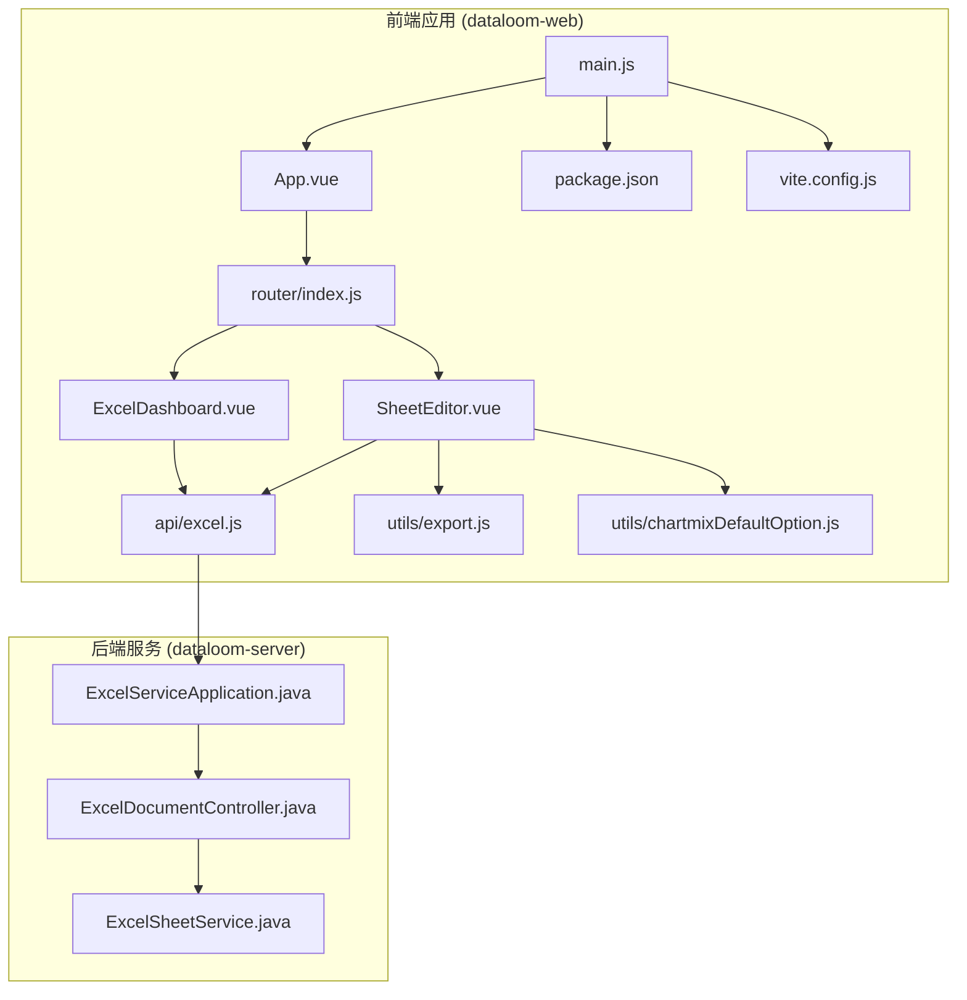

**图表来源**
- [main.js:1-19](file://dataloom-web/src/main.js#L1-L19)
- [router/index.js:1-21](file://dataloom-web/src/router/index.js#L1-L21)
- [ExcelDashboard.vue:1-386](file://dataloom-web/src/views/ExcelDashboard.vue#L1-L386)
- [SheetEditor.vue:1-970](file://dataloom-web/src/views/SheetEditor.vue#L1-L970)

**章节来源**
- [main.js:1-19](file://dataloom-web/src/main.js#L1-L19)
- [package.json:1-27](file://dataloom-web/package.json#L1-L27)
- [vite.config.js:1-26](file://dataloom-web/vite.config.js#L1-L26)

## 核心组件分析

### 应用入口与路由配置

应用采用模块化的组件架构，主要由两个核心组件组成：

1. **ExcelDashboard.vue**: 主仪表板组件，负责文档列表管理和用户交互
2. **SheetEditor.vue**: 工作表编辑器组件，集成 Luckysheet 实现强大的电子表格功能

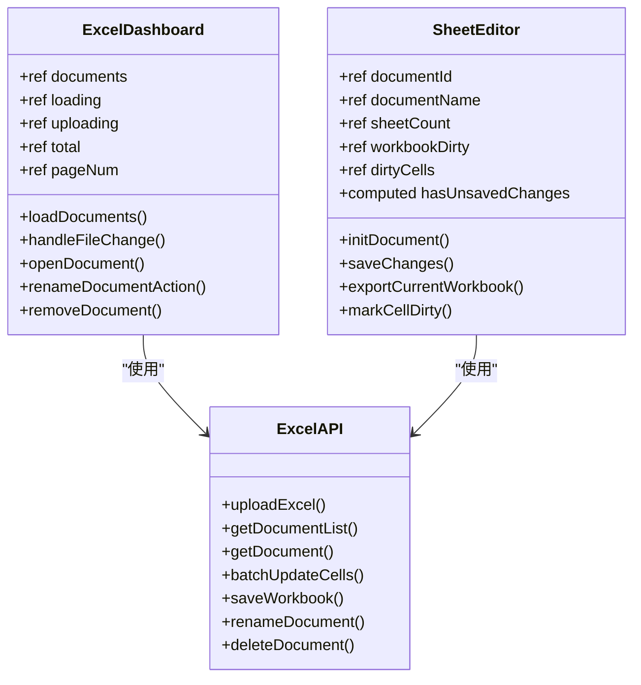

**图表来源**
- [ExcelDashboard.vue:106-229](file://dataloom-web/src/views/ExcelDashboard.vue#L106-L229)
- [SheetEditor.vue:48-844](file://dataloom-web/src/views/SheetEditor.vue#L48-L844)
- [excel.js:1-79](file://dataloom-web/src/api/excel.js#L1-L79)

**章节来源**
- [ExcelDashboard.vue:106-229](file://dataloom-web/src/views/ExcelDashboard.vue#L106-L229)
- [SheetEditor.vue:48-844](file://dataloom-web/src/views/SheetEditor.vue#L48-L844)

## Composition API 模式详解

### setup 函数的使用方法

在 Vue 3 中，setup 函数作为 Composition API 的入口点，提供了声明式响应式状态和生命周期钩子的统一接口。

#### 基础响应式声明

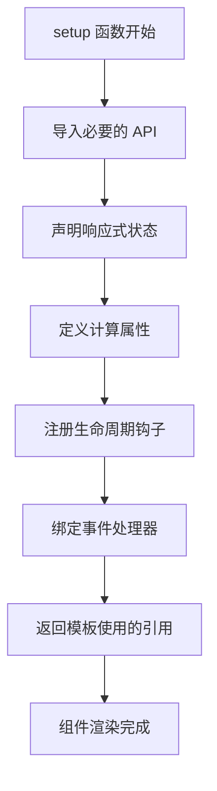

**图表来源**
- [ExcelDashboard.vue:106-124](file://dataloom-web/src/views/ExcelDashboard.vue#L106-L124)
- [SheetEditor.vue:48-82](file://dataloom-web/src/views/SheetEditor.vue#L48-L82)

### 响应式数据类型选择

在实际开发中，需要根据数据特性和使用场景选择合适的响应式类型：

| 数据类型 | 使用场景 | 推荐 API | 特点 |
|---------|----------|----------|------|
| 简单标量 | 页面状态、布尔标志 | `ref` | 基础响应式包装 |
| 对象集合 | 表格数据、复杂状态 | `reactive` | 深度响应式 |
| 计算结果 | 派生状态、格式化数据 | `computed` | 自动缓存依赖 |
| 函数逻辑 | 业务逻辑封装 | 普通函数 | 组合式复用 |

**章节来源**
- [ExcelDashboard.vue:114-120](file://dataloom-web/src/views/ExcelDashboard.vue#L114-L120)
- [SheetEditor.vue:60-72](file://dataloom-web/src/views/SheetEditor.vue#L60-L72)

## 响应式数据管理最佳实践

### ref vs reactive 的选择原则

#### ref 的适用场景

1. **简单标量值**：页面加载状态、布尔标志、计数器
2. **DOM 引用**：文件输入框、编辑器实例
3. **独立状态片段**：每个状态单独管理

#### reactive 的适用场景

1. **复杂对象结构**：表格数据、配置对象
2. **状态聚合**：多个相关状态的组合
3. **深度嵌套数据**：需要深层响应式的对象

### 数据流管理策略

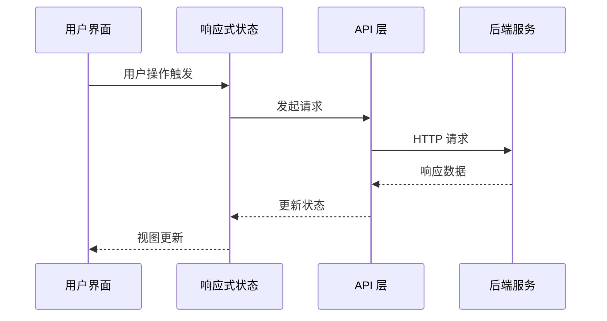

**图表来源**
- [excel.js:13-25](file://dataloom-web/src/api/excel.js#L13-L25)
- [excel.js:32-41](file://dataloom-web/src/api/excel.js#L32-L41)

**章节来源**
- [ExcelDashboard.vue:126-172](file://dataloom-web/src/views/ExcelDashboard.vue#L126-L172)
- [SheetEditor.vue:134-173](file://dataloom-web/src/views/SheetEditor.vue#L134-L173)

## 生命周期钩子使用指南

### onMounted 钩子的最佳实践

#### 初始化时机控制

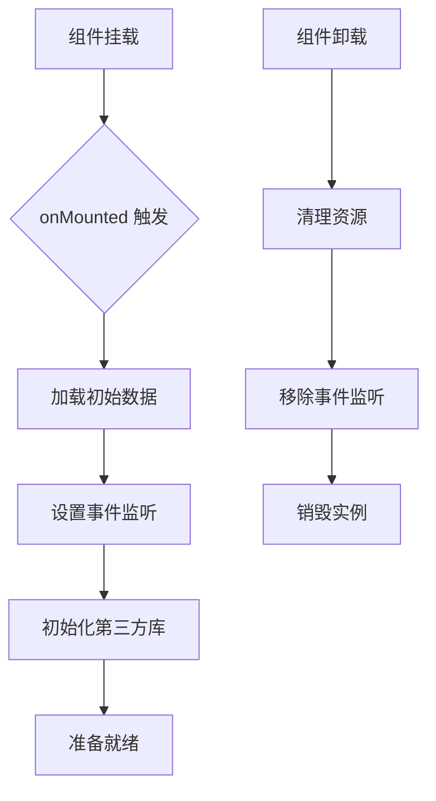

**图表来源**
- [ExcelDashboard.vue:122-124](file://dataloom-web/src/views/ExcelDashboard.vue#L122-L124)
- [SheetEditor.vue:115-117](file://dataloom-web/src/views/SheetEditor.vue#L115-L117)

#### 生命周期钩子在不同组件中的应用

| 组件 | onMounted 用途 | onBeforeUnmount 用途 |
|------|----------------|---------------------|
| ExcelDashboard | 加载文档列表 | 清理文件输入状态 |
| SheetEditor | 初始化工作簿 | 销毁 Luckysheet 实例 |

**章节来源**
- [ExcelDashboard.vue:122-124](file://dataloom-web/src/views/ExcelDashboard.vue#L122-L124)
- [SheetEditor.vue:119-132](file://dataloom-web/src/views/SheetEditor.vue#L119-L132)

## 组合函数设计模式

### 组合函数的定义与实现

组合函数是 Vue 3 Composition API 的核心概念，它允许我们将可复用的逻辑封装成独立的函数。

#### 组合函数设计原则

1. **单一职责**: 每个组合函数专注于特定的功能领域
2. **无副作用**: 组合函数本身不直接操作 DOM
3. **可测试性**: 组合函数应该易于单元测试
4. **类型安全**: 提供清晰的参数和返回值类型

### 组合函数在项目中的应用

#### 状态管理组合函数

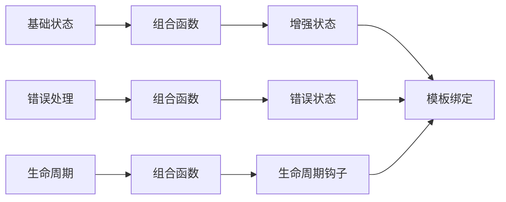

**图表来源**
- [SheetEditor.vue:80-82](file://dataloom-web/src/views/SheetEditor.vue#L80-L82)
- [SheetEditor.vue:486-531](file://dataloom-web/src/views/SheetEditor.vue#L486-L531)

**章节来源**
- [SheetEditor.vue:80-82](file://dataloom-web/src/views/SheetEditor.vue#L80-L82)
- [SheetEditor.vue:486-531](file://dataloom-web/src/views/SheetEditor.vue#L486-L531)

## ExcelDashboard 组件实战

### 组件架构分析

ExcelDashboard 作为主仪表板，采用了典型的 CRUD 操作模式，展示了完整的响应式数据管理模式。

#### 核心状态管理

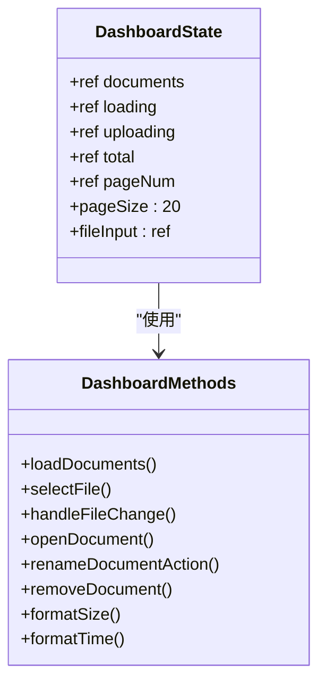

**图表来源**
- [ExcelDashboard.vue:114-120](file://dataloom-web/src/views/ExcelDashboard.vue#L114-L120)
- [ExcelDashboard.vue:126-229](file://dataloom-web/src/views/ExcelDashboard.vue#L126-L229)

#### 文件上传流程

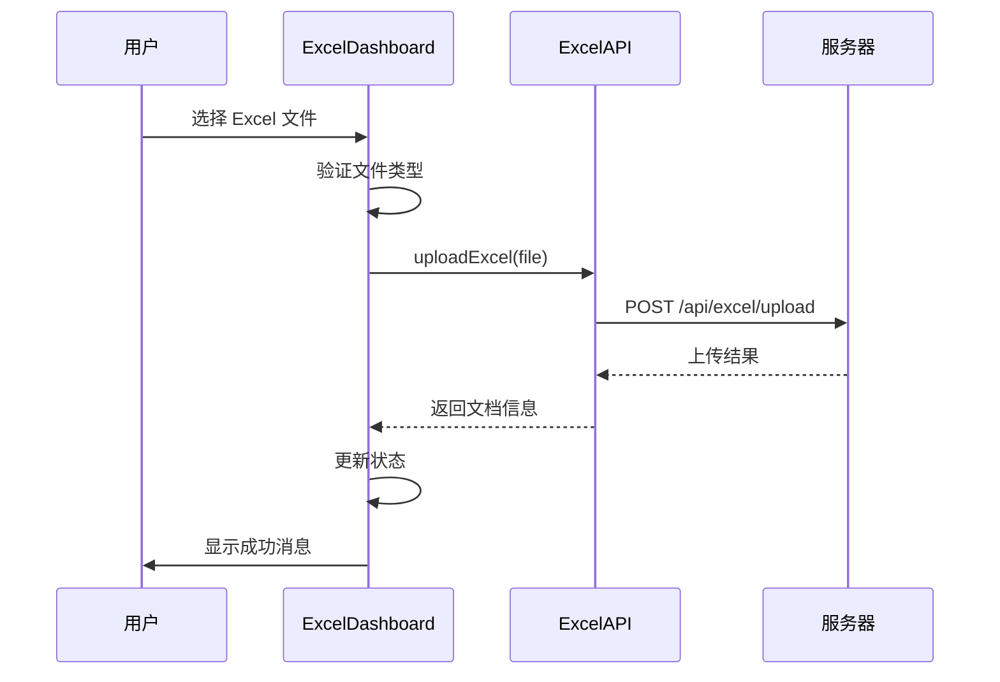

**图表来源**
- [ExcelDashboard.vue:146-172](file://dataloom-web/src/views/ExcelDashboard.vue#L146-L172)
- [excel.js:13-25](file://dataloom-web/src/api/excel.js#L13-L25)

**章节来源**
- [ExcelDashboard.vue:114-229](file://dataloom-web/src/views/ExcelDashboard.vue#L114-L229)

## SheetEditor 组件实战

### 组件架构深度分析

SheetEditor 是项目中最复杂的组件，集成了 Luckysheet 电子表格引擎，展示了高级响应式数据管理技巧。

#### 高级状态管理模式

```mermaid
graph TB
subgraph "工作簿状态"
A[documentId] --> B[documentName]
B --> C[sheetCount]
C --> D[booting]
end
subgraph "编辑状态"
E[workbookDirty] --> F[structureDirty]
F --> G[dirtyCells]
G --> H[hasUnsavedChanges]
end
subgraph "加载状态"
I[loadingSheet] --> J[loadedChunks]
J --> K[totalChunks]
K --> L[saving]
end
subgraph "编辑器状态"
M[nameInput] --> N[editingName]
N --> O[renameValue]
O --> P[structureSnapshot]
end
```

**图表来源**
- [SheetEditor.vue:60-82](file://dataloom-web/src/views/SheetEditor.vue#L60-L82)
- [SheetEditor.vue:48-82](file://dataloom-web/src/views/SheetEditor.vue#L48-L82)

#### 脏数据追踪机制

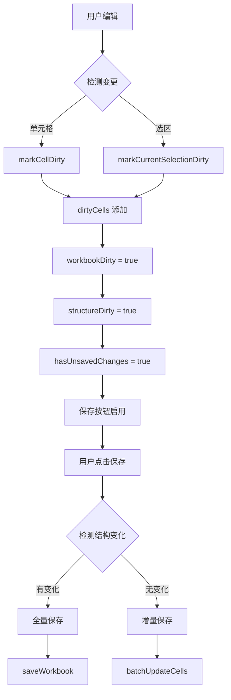

**图表来源**
- [SheetEditor.vue:439-480](file://dataloom-web/src/views/SheetEditor.vue#L439-L480)
- [SheetEditor.vue:547-631](file://dataloom-web/src/views/SheetEditor.vue#L547-L631)

**章节来源**
- [SheetEditor.vue:48-844](file://dataloom-web/src/views/SheetEditor.vue#L48-L844)

### 图表数据处理策略

#### 四步法序列化流程


**图表来源**
- [SheetEditor.vue:633-783](file://dataloom-web/src/views/SheetEditor.vue#L633-L783)
- [chartmixDefaultOption.js:1-2](file://dataloom-web/src/utils/chartmixDefaultOption.js#L1-L2)

**章节来源**
- [SheetEditor.vue:633-783](file://dataloom-web/src/views/SheetEditor.vue#L633-L783)

## 性能优化策略

### 响应式数据优化

#### 计算属性的合理使用

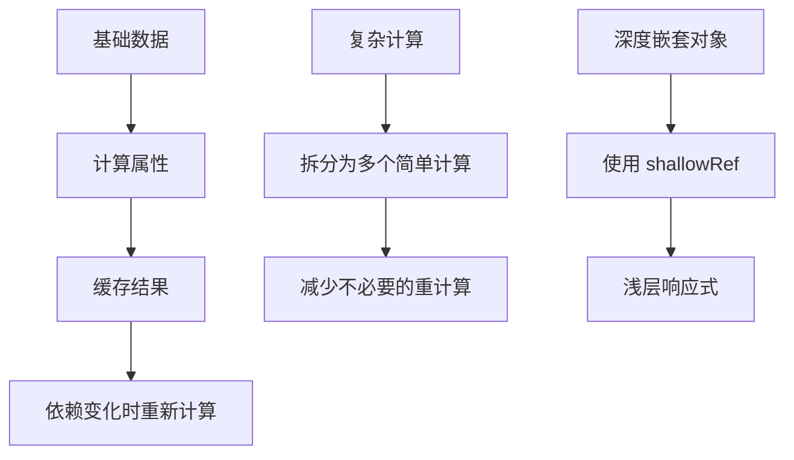

**图表来源**
- [SheetEditor.vue:80-82](file://dataloom-web/src/views/SheetEditor.vue#L80-L82)

#### 事件处理优化

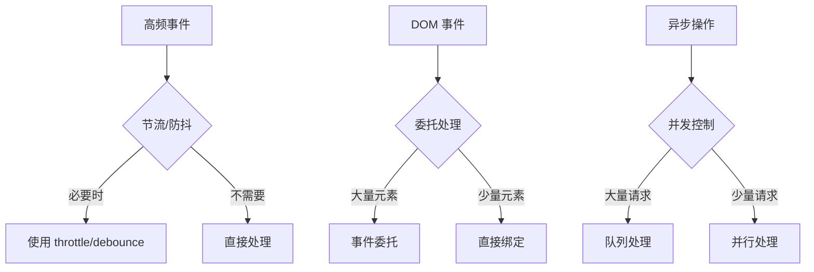

### 内存管理优化

#### 组件生命周期管理

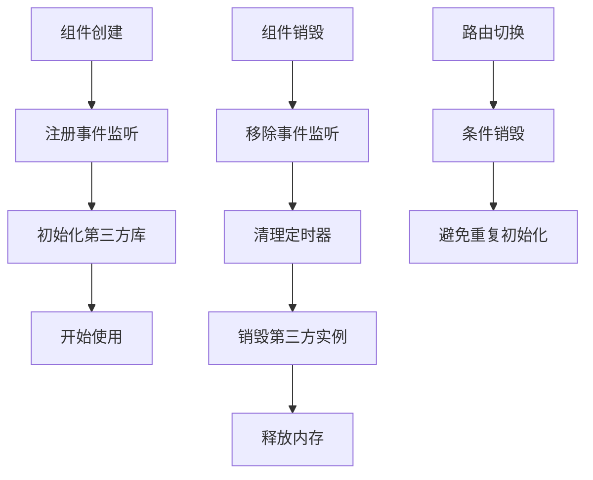

**图表来源**
- [SheetEditor.vue:119-132](file://dataloom-web/src/views/SheetEditor.vue#L119-L132)

**章节来源**
- [SheetEditor.vue:119-132](file://dataloom-web/src/views/SheetEditor.vue#L119-L132)

## 常见陷阱与解决方案

### 响应式数据陷阱

#### 陷阱一：忘记添加 .value 访问器

```javascript
// ❌ 错误做法
const count = ref(0)
console.log(count + 1) // 输出: [object Object]1

// ✅ 正确做法
const count = ref(0)
console.log(count.value + 1) // 输出: 1
```

#### 陷阱二：对象解构丢失响应性

```javascript
// ❌ 错误做法
const state = reactive({ count: 0 })
const { count } = state
count++ // 不会触发视图更新

// ✅ 正确做法
const state = reactive({ count: 0 })
const count = state.count
count++ // 通过原对象访问
```

### 生命周期钩子陷阱

#### 陷阱三：在 setup 中使用 DOM

```javascript
// ❌ 错误做法
setup() {
  const input = ref(null)
  input.value.focus() // DOM 还未挂载
}

// ✅ 正确做法
setup() {
  const input = ref(null)
  
  onMounted(() => {
    input.value.focus() // 在 mounted 后访问
  })
}
```

### 性能陷阱

#### 陷阱四：过度使用计算属性

```javascript
// ❌ 性能问题
computed: {
  expensiveData() {
    return this.data.map(item => expensiveOperation(item))
  }
}

// ✅ 优化方案
computed: {
  expensiveData() {
    return this.data.map(item => expensiveOperation(item))
  }
}
// 或者使用缓存策略
```

**章节来源**
- [ExcelDashboard.vue:106-229](file://dataloom-web/src/views/ExcelDashboard.vue#L106-L229)
- [SheetEditor.vue:48-844](file://dataloom-web/src/views/SheetEditor.vue#L48-L844)

## 总结

DataLoom 项目展示了 Vue 3 Composition API 的最佳实践，包括：

1. **响应式数据管理**: 合理选择 ref 和 reactive，实现高效的状态管理
2. **生命周期钩子**: 正确使用 onMounted、onBeforeUnmount 等钩子
3. **组合函数设计**: 将可复用逻辑封装为组合函数
4. **性能优化**: 通过计算属性缓存、事件委托等方式提升性能
5. **错误处理**: 完善的错误捕获和用户反馈机制

这些模式不仅适用于 Excel 编辑器场景，也可以迁移到其他复杂的前端应用中，为开发者提供可靠的开发指导。