# 状态管理模式

<cite>
**本文档引用的文件**
- [main.js](file://dataloom-web/src/main.js)
- [App.vue](file://dataloom-web/src/App.vue)
- [router/index.js](file://dataloom-web/src/router/index.js)
- [ExcelDashboard.vue](file://dataloom-web/src/views/ExcelDashboard.vue)
- [SheetEditor.vue](file://dataloom-web/src/views/SheetEditor.vue)
- [excel.js](file://dataloom-web/src/api/excel.js)
- [export.js](file://dataloom-web/src/utils/export.js)
- [chartmixDefaultOption.js](file://dataloom-web/src/utils/chartmixDefaultOption.js)
- [vite.config.js](file://dataloom-web/vite.config.js)
- [package.json](file://dataloom-web/package.json)
</cite>

## 目录
1. [引言](#引言)
2. [项目结构](#项目结构)
3. [核心组件](#核心组件)
4. [架构概览](#架构概览)
5. [详细组件分析](#详细组件分析)
6. [依赖关系分析](#依赖关系分析)
7. [性能考虑](#性能考虑)
8. [故障排除指南](#故障排除指南)
9. [结论](#结论)

## 引言

DataLoom是一个基于Vue 3构建的在线Excel编辑器，采用现代化的状态管理模式来处理复杂的异步数据流。该项目展示了如何在单页应用中有效地管理组件内部状态、全局状态以及异步操作状态。

该项目的核心特点包括：
- 使用Vue 3 Composition API进行响应式状态管理
- 实现了完整的Excel文件上传、解析、编辑和导出功能
- 采用Luckysheet作为核心电子表格引擎
- 实现了智能的增量保存机制
- 提供了完整的错误处理和用户体验优化

## 项目结构

DataLoom采用模块化的项目结构，主要分为前端Web应用和后端服务两大部分：

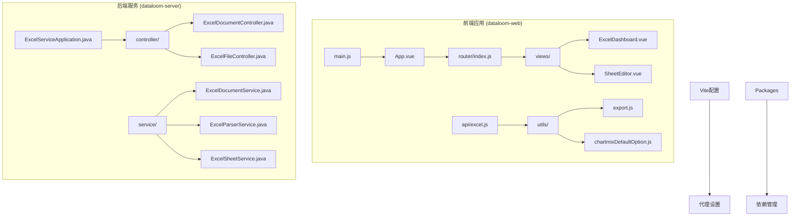

**图表来源**
- [main.js:1-19](file://dataloom-web/src/main.js#L1-L19)
- [router/index.js:1-21](file://dataloom-web/src/router/index.js#L1-L21)
- [package.json:1-27](file://dataloom-web/package.json#L1-L27)

**章节来源**
- [main.js:1-19](file://dataloom-web/src/main.js#L1-L19)
- [router/index.js:1-21](file://dataloom-web/src/router/index.js#L1-L21)
- [package.json:1-27](file://dataloom-web/package.json#L1-L27)

## 核心组件

### 组件内部状态管理最佳实践

DataLoom中的两个核心组件展示了不同的状态管理模式：

#### ExcelDashboard组件状态管理

ExcelDashboard组件负责文档列表的展示和管理，采用了简洁明了的状态管理模式：

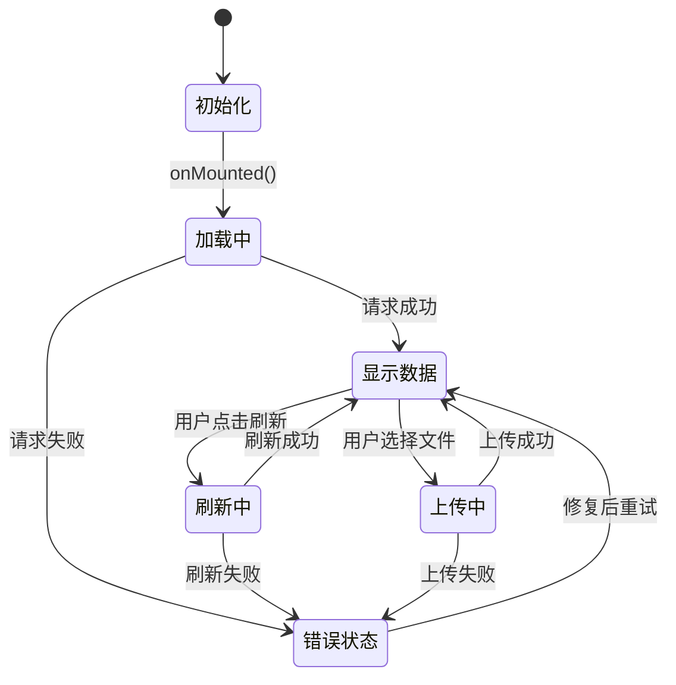

**图表来源**
- [ExcelDashboard.vue:122-140](file://dataloom-web/src/views/ExcelDashboard.vue#L122-L140)
- [ExcelDashboard.vue:146-172](file://dataloom-web/src/views/ExcelDashboard.vue#L146-L172)

#### SheetEditor组件状态管理

SheetEditor组件是整个应用的核心，负责Excel文件的编辑和保存，采用了复杂的状态管理系统：

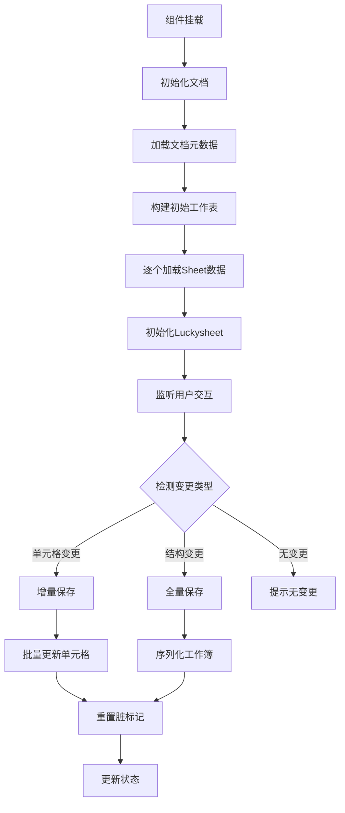

**图表来源**
- [SheetEditor.vue:134-173](file://dataloom-web/src/views/SheetEditor.vue#L134-L173)
- [SheetEditor.vue:547-631](file://dataloom-web/src/views/SheetEditor.vue#L547-L631)

**章节来源**
- [ExcelDashboard.vue:106-229](file://dataloom-web/src/views/ExcelDashboard.vue#L106-L229)
- [SheetEditor.vue:48-844](file://dataloom-web/src/views/SheetEditor.vue#L48-L844)

## 架构概览

DataLoom采用前后端分离的架构设计，前端使用Vue 3 + Vite + Element Plus，后端使用Spring Boot + MyBatis Plus。

```mermaid
graph TB
subgraph "客户端层"
A[浏览器] --> B[Vue 3 应用]
B --> C[Element Plus UI组件]
B --> D[Luckysheet 表格引擎]
end
subgraph "API层"
E[ExcelDashboard.vue] --> F[excel.js API]
G[SheetEditor.vue] --> F
F --> H[/api/excel 端点]
end
subgraph "服务层"
H --> I[ExcelDocumentController]
H --> J[ExcelFileController]
H --> K[ExcelParserService]
H --> L[ExcelSheetService]
end
subgraph "数据层"
M[ExcelDocument] --> N[ExcelSheet]
N --> O[ExcelSheetChunk]
end
subgraph "外部集成"
P[ExcelJS 导出] --> Q[FileSaver]
R[ECharts 图表] --> S[chartmix 插件]
end
F --> M
D --> R
P --> Q
```

**图表来源**
- [excel.js:1-79](file://dataloom-web/src/api/excel.js#L1-L79)
- [SheetEditor.vue:53-55](file://dataloom-web/src/views/SheetEditor.vue#L53-L55)
- [export.js:1-239](file://dataloom-web/src/utils/export.js#L1-L239)

**章节来源**
- [excel.js:1-79](file://dataloom-web/src/api/excel.js#L1-L79)
- [vite.config.js:15-20](file://dataloom-web/vite.config.js#L15-L20)

## 详细组件分析

### ExcelDashboard组件分析

ExcelDashboard组件展示了组件内部状态管理的最佳实践：

#### 响应式数据设计原则

组件使用Vue 3的ref和reactive来管理状态：

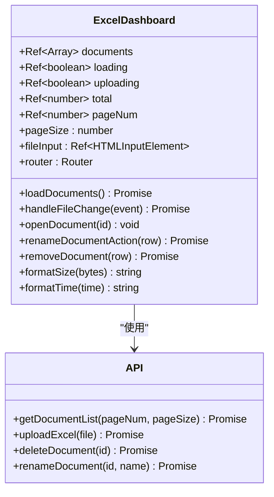

**图表来源**
- [ExcelDashboard.vue:115-120](file://dataloom-web/src/views/ExcelDashboard.vue#L115-L120)
- [ExcelDashboard.vue:109-111](file://dataloom-web/src/views/ExcelDashboard.vue#L109-L111)

#### 异步状态管理

组件实现了完整的异步状态管理：

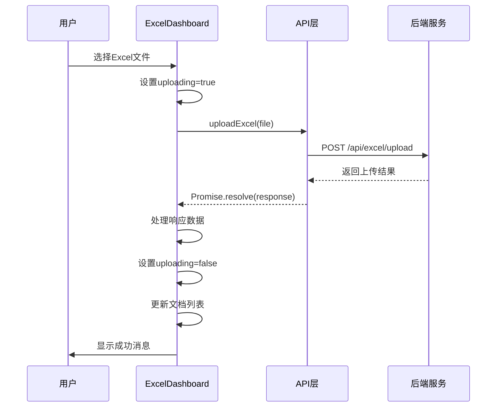

**图表来源**
- [ExcelDashboard.vue:146-172](file://dataloom-web/src/views/ExcelDashboard.vue#L146-L172)
- [excel.js:13-25](file://dataloom-web/src/api/excel.js#L13-L25)

**章节来源**
- [ExcelDashboard.vue:106-229](file://dataloom-web/src/views/ExcelDashboard.vue#L106-L229)
- [excel.js:1-79](file://dataloom-web/src/api/excel.js#L1-L79)

### SheetEditor组件分析

SheetEditor组件是整个应用的核心，展示了复杂状态管理的实现：

#### 脏数据追踪系统

组件实现了智能的脏数据追踪机制：

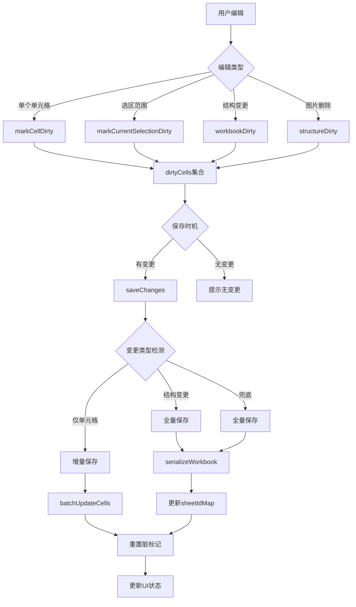

**图表来源**
- [SheetEditor.vue:439-480](file://dataloom-web/src/views/SheetEditor.vue#L439-L480)
- [SheetEditor.vue:547-631](file://dataloom-web/src/views/SheetEditor.vue#L547-L631)

#### 结构快照机制

组件实现了结构快照来优化保存性能：

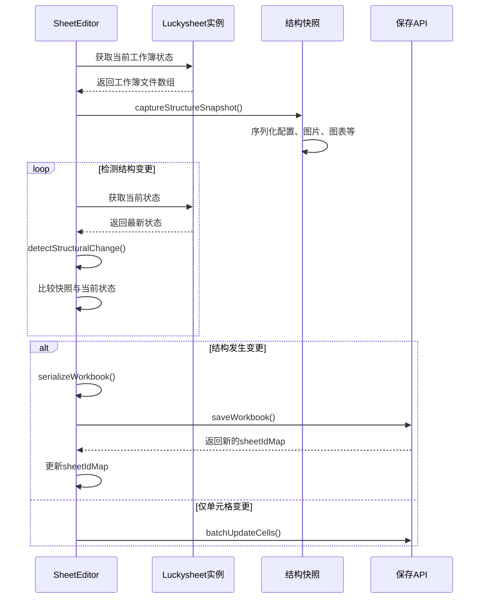

**图表来源**
- [SheetEditor.vue:486-531](file://dataloom-web/src/views/SheetEditor.vue#L486-L531)
- [SheetEditor.vue:633-783](file://dataloom-web/src/views/SheetEditor.vue#L633-L783)

**章节来源**
- [SheetEditor.vue:48-844](file://dataloom-web/src/views/SheetEditor.vue#L48-L844)

### API层设计

API层提供了统一的数据访问接口：

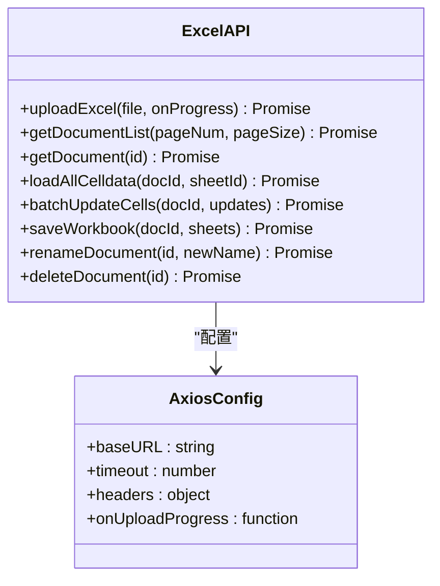

**图表来源**
- [excel.js:3-6](file://dataloom-web/src/api/excel.js#L3-L6)
- [excel.js:13-78](file://dataloom-web/src/api/excel.js#L13-L78)

**章节来源**
- [excel.js:1-79](file://dataloom-web/src/api/excel.js#L1-L79)

## 依赖关系分析

### 技术栈依赖

DataLoom采用了现代化的技术栈组合：

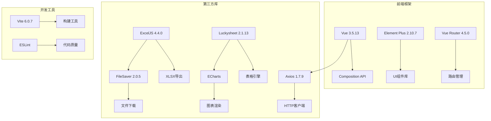

**图表来源**
- [package.json:12-21](file://dataloom-web/package.json#L12-L21)
- [package.json:22-25](file://dataloom-web/package.json#L22-L25)

### 状态管理策略

项目采用多层状态管理策略：

1. **组件内部状态**：使用ref和reactive管理组件本地状态
2. **异步状态**：通过loading、uploading等标志位管理异步操作状态
3. **业务状态**：通过computed属性管理派生状态
4. **持久化状态**：通过后端API实现跨会话状态持久化

**章节来源**
- [package.json:1-27](file://dataloom-web/package.json#L1-L27)
- [vite.config.js:1-26](file://dataloom-web/vite.config.js#L1-L26)

## 性能考虑

### 增量保存优化

SheetEditor组件实现了智能的增量保存机制，避免不必要的全量保存：

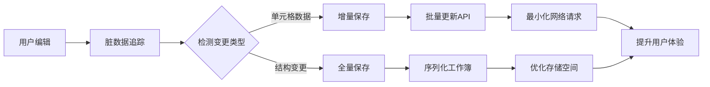

**图表来源**
- [SheetEditor.vue:556-631](file://dataloom-web/src/views/SheetEditor.vue#L556-L631)

### 图表数据处理优化

组件对图表数据进行了特殊处理以确保稳定性：

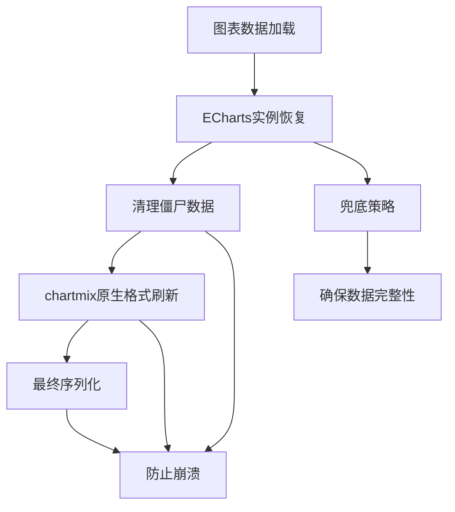

**图表来源**
- [SheetEditor.vue:633-783](file://dataloom-web/src/views/SheetEditor.vue#L633-L783)

## 故障排除指南

### 常见问题及解决方案

#### 幸存者偏差问题

在图表数据处理中，组件实现了多重保护机制：

1. **ECharts实例兜底**：从DOM中恢复图表配置
2. **僵尸数据清理**：移除无效的图表数据
3. **chartmix格式刷新**：使用原生格式覆盖配置
4. **默认配置注入**：确保图表渲染的最低要求

#### 状态同步问题

组件通过以下机制确保状态一致性：

1. **结构快照**：保存工作簿的结构状态
2. **脏标记系统**：精确追踪变更范围
3. **事件驱动更新**：通过Luckysheet钩子函数实时更新状态
4. **回滚机制**：在保存失败时恢复原始状态

**章节来源**
- [SheetEditor.vue:247-416](file://dataloom-web/src/views/SheetEditor.vue#L247-L416)
- [SheetEditor.vue:633-783](file://dataloom-web/src/views/SheetEditor.vue#L633-L783)

## 结论

DataLoom项目展示了Vue 3状态管理模式的最佳实践，特别是在处理复杂异步操作和大型数据集时的状态管理策略。

### 主要成就

1. **智能状态管理**：通过脏数据追踪和结构快照实现了高效的增量保存
2. **用户体验优化**：完善的加载状态、错误状态和空状态处理
3. **性能优化**：通过多种策略减少网络请求和存储开销
4. **稳定性保障**：多重保护机制确保数据完整性和系统稳定性

### 关键设计原则

1. **单一职责**：每个组件专注于特定的功能领域
2. **状态隔离**：避免跨组件的状态耦合
3. **异步状态管理**：清晰地表示异步操作的不同阶段
4. **错误处理**：提供友好的错误反馈和恢复机制
5. **性能优先**：在用户体验和性能之间找到平衡点

这个项目为Vue 3应用的状态管理提供了宝贵的实践经验，特别是在处理复杂业务场景时的状态管理模式设计。