# 组件生命周期

<cite>
**本文档引用的文件**
- [ExcelDashboard.vue](file://dataloom-web/src/views/ExcelDashboard.vue)
- [SheetEditor.vue](file://dataloom-web/src/views/SheetEditor.vue)
- [App.vue](file://dataloom-web/src/App.vue)
- [main.js](file://dataloom-web/src/main.js)
- [excel.js](file://dataloom-web/src/api/excel.js)
- [export.js](file://dataloom-web/src/utils/export.js)
- [index.js](file://dataloom-web/src/router/index.js)
- [package.json](file://dataloom-web/package.json)
</cite>

## 目录
1. [简介](#简介)
2. [项目结构](#项目结构)
3. [核心组件](#核心组件)
4. [架构概览](#架构概览)
5. [详细组件分析](#详细组件分析)
6. [依赖关系分析](#依赖关系分析)
7. [性能考虑](#性能考虑)
8. [故障排除指南](#故障排除指南)
9. [结论](#结论)

## 简介

本文档深入分析了DataLoom项目中Vue 3组件生命周期的使用模式，重点涵盖Excel文件处理和在线编辑场景。DataLoom是一个基于Vue 3 + Vite + Element Plus的技术栈构建的在线Excel协作编辑平台，后端采用Spring Boot技术栈。

项目包含两个主要组件：
- **ExcelDashboard.vue**: Excel文档管理仪表板，负责文档列表展示、上传和管理功能
- **SheetEditor.vue**: 在线Excel编辑器，集成了Luckysheet表格引擎，支持实时编辑、保存和导出

## 项目结构

DataLoom项目采用典型的Vue 3单页应用架构，主要由以下层次组成：

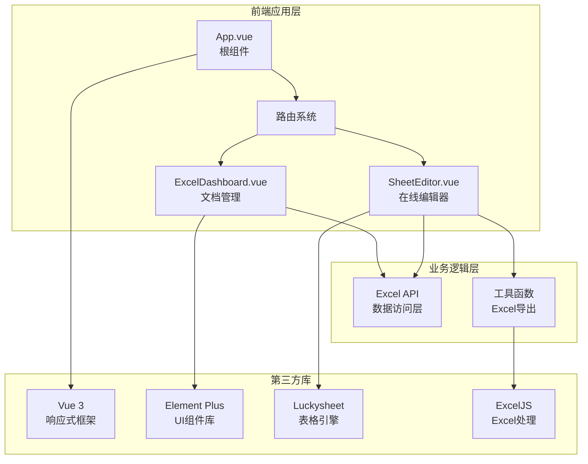

**图表来源**
- [main.js:1-19](file://dataloom-web/src/main.js#L1-L19)
- [index.js:1-21](file://dataloom-web/src/router/index.js#L1-L21)
- [package.json:12-21](file://dataloom-web/package.json#L12-L21)

**章节来源**
- [main.js:1-19](file://dataloom-web/src/main.js#L1-L19)
- [index.js:1-21](file://dataloom-web/src/router/index.js#L1-L21)
- [package.json:12-21](file://dataloom-web/package.json#L12-L21)

## 核心组件

### ExcelDashboard组件生命周期分析

ExcelDashboard组件展示了标准的Vue 3生命周期使用模式，主要集中在组件挂载阶段的数据初始化：

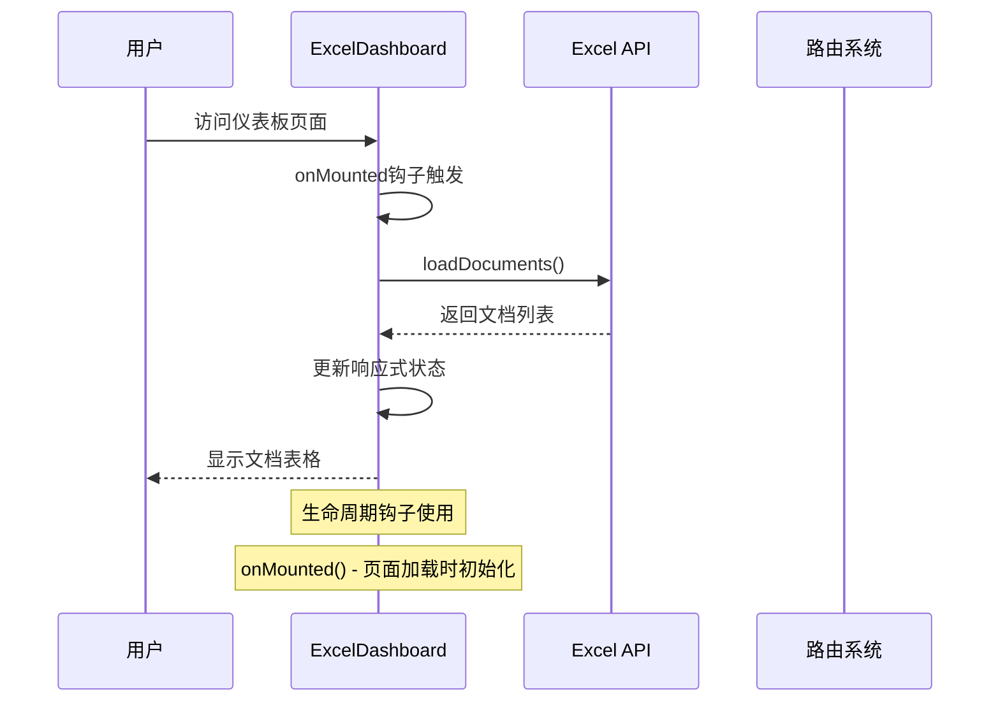

**图表来源**
- [ExcelDashboard.vue:122-140](file://dataloom-web/src/views/ExcelDashboard.vue#L122-L140)

该组件使用`onMounted`钩子在组件挂载后自动加载文档列表，确保用户首次访问时能够立即看到数据。

### SheetEditor组件生命周期分析

SheetEditor组件展现了复杂的生命周期管理，特别是在集成外部表格引擎时的资源管理和清理：

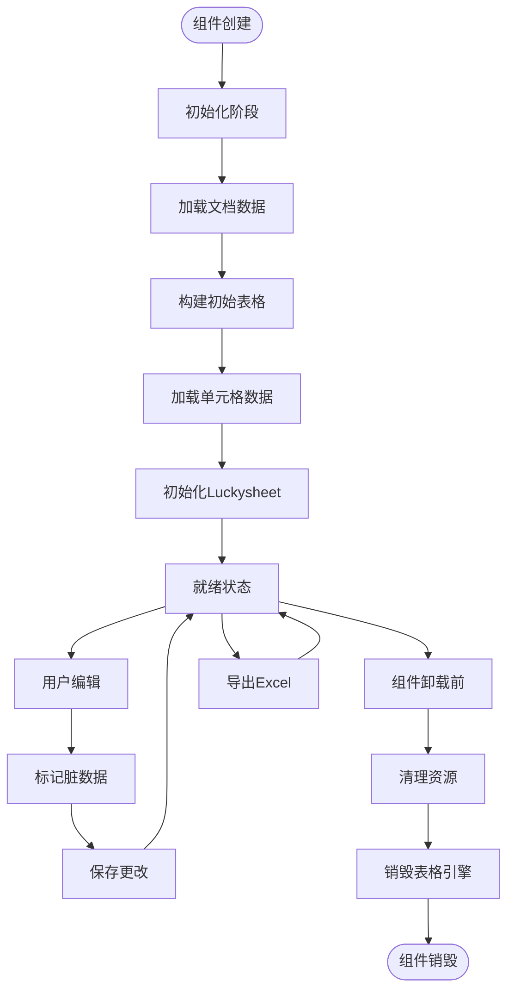

**图表来源**
- [SheetEditor.vue:115-132](file://dataloom-web/src/views/SheetEditor.vue#L115-L132)
- [SheetEditor.vue:134-173](file://dataloom-web/src/views/SheetEditor.vue#L134-L173)

**章节来源**
- [ExcelDashboard.vue:106-140](file://dataloom-web/src/views/ExcelDashboard.vue#L106-L140)
- [SheetEditor.vue:48-132](file://dataloom-web/src/views/SheetEditor.vue#L48-L132)

## 架构概览

DataLoom的生命周期架构体现了现代Vue 3应用的最佳实践：

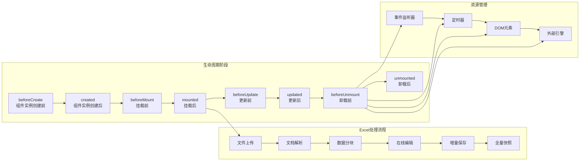

**图表来源**
- [SheetEditor.vue:119-132](file://dataloom-web/src/views/SheetEditor.vue#L119-L132)
- [excel.js:13-25](file://dataloom-web/src/api/excel.js#L13-L25)

## 详细组件分析

### ExcelDashboard组件生命周期详解

#### 生命周期钩子使用

ExcelDashboard组件主要使用了`onMounted`钩子，这是最常用的生命周期钩子之一：

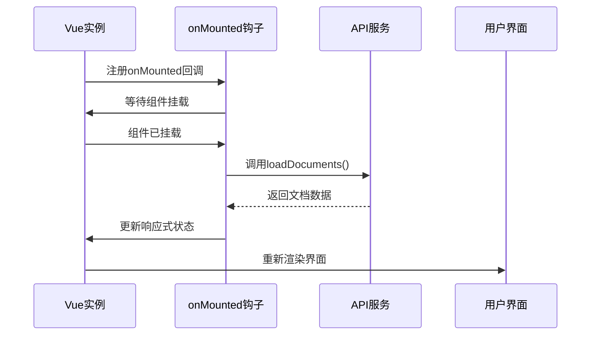

**图表来源**
- [ExcelDashboard.vue:122-124](file://dataloom-web/src/views/ExcelDashboard.vue#L122-L124)

#### 数据流管理

组件展示了标准的异步数据加载模式：

1. **状态初始化**: 使用`ref`和`reactive`创建响应式状态
2. **异步加载**: 在`onMounted`中调用API获取数据
3. **错误处理**: 使用try-catch捕获和处理异常
4. **状态更新**: 在finally块中重置加载状态

**章节来源**
- [ExcelDashboard.vue:106-140](file://dataloom-web/src/views/ExcelDashboard.vue#L106-L140)

### SheetEditor组件生命周期详解

#### 复杂生命周期管理

SheetEditor组件展现了Vue 3生命周期在复杂场景下的最佳实践：

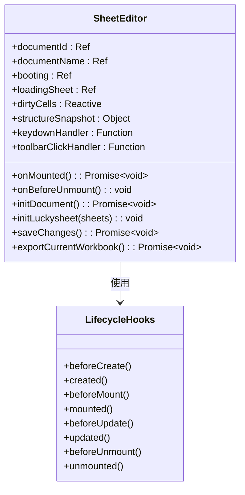

**图表来源**
- [SheetEditor.vue:48-82](file://dataloom-web/src/views/SheetEditor.vue#L48-L82)
- [SheetEditor.vue:115-132](file://dataloom-web/src/views/SheetEditor.vue#L115-L132)

#### 资源清理最佳实践

组件在`onBeforeUnmount`钩子中实现了完整的资源清理：

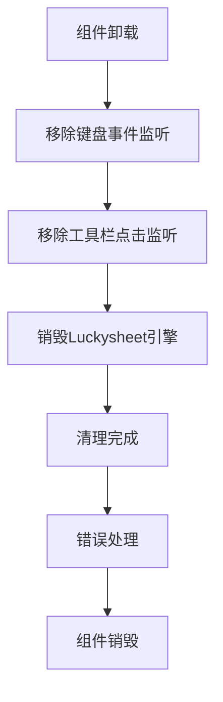

**图表来源**
- [SheetEditor.vue:119-132](file://dataloom-web/src/views/SheetEditor.vue#L119-L132)

#### Excel文件处理生命周期

组件展示了完整的Excel文件处理生命周期：

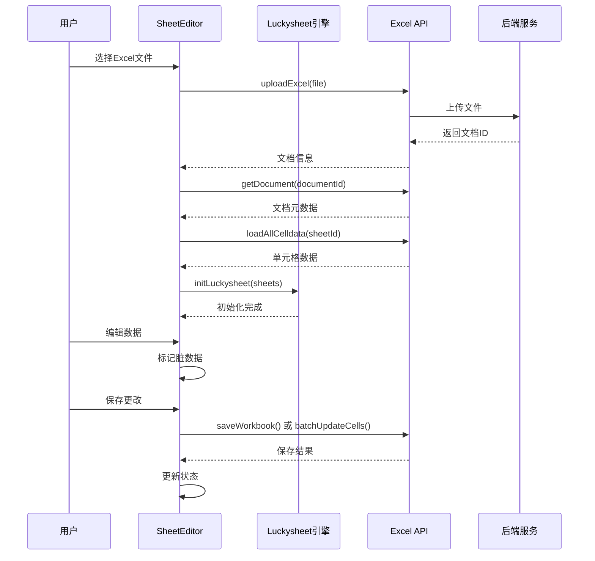

**图表来源**
- [SheetEditor.vue:134-173](file://dataloom-web/src/views/SheetEditor.vue#L134-L173)
- [excel.js:13-64](file://dataloom-web/src/api/excel.js#L13-L64)

**章节来源**
- [SheetEditor.vue:48-132](file://dataloom-web/src/views/SheetEditor.vue#L48-L132)
- [excel.js:13-64](file://dataloom-web/src/api/excel.js#L13-L64)

### 在线编辑场景的生命周期优化

#### 实时编辑状态管理

组件实现了智能的状态跟踪机制：

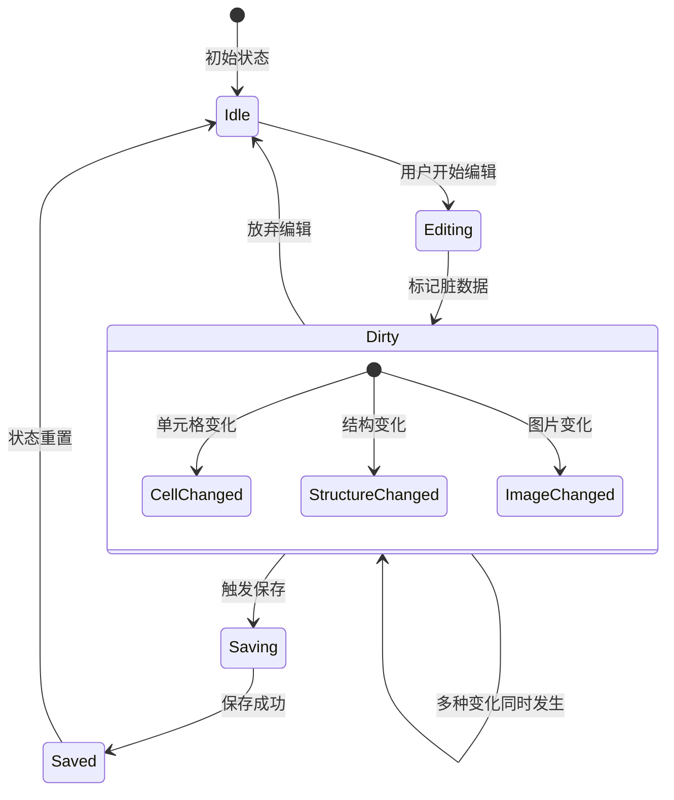

**图表来源**
- [SheetEditor.vue:486-531](file://dataloom-web/src/views/SheetEditor.vue#L486-L531)

#### 性能优化策略

组件采用了多种性能优化策略：

1. **增量保存**: 仅保存发生变化的单元格数据
2. **结构快照**: 比较工作簿结构变化决定保存策略
3. **懒加载**: 分块加载大型Excel文件
4. **事件去抖**: 合并频繁的用户操作

**章节来源**
- [SheetEditor.vue:547-631](file://dataloom-web/src/views/SheetEditor.vue#L547-L631)

## 依赖关系分析

### 组件间依赖关系

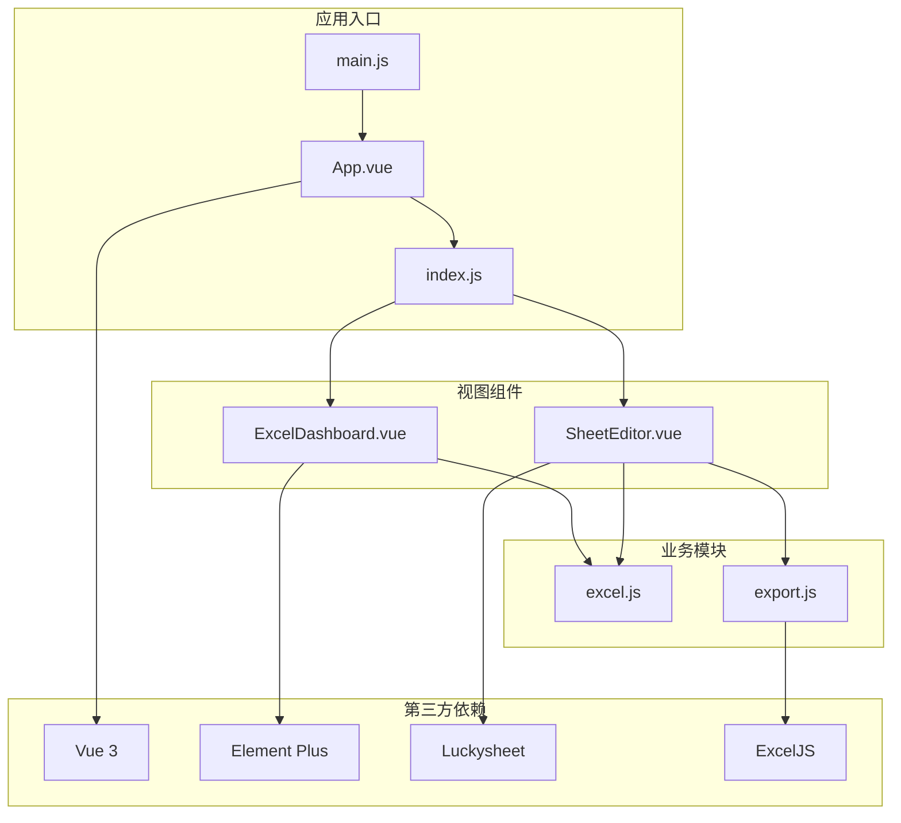

**图表来源**
- [main.js:1-19](file://dataloom-web/src/main.js#L1-L19)
- [index.js:1-21](file://dataloom-web/src/router/index.js#L1-L21)
- [package.json:12-21](file://dataloom-web/package.json#L12-L21)

### 生命周期钩子依赖分析

组件对生命周期钩子的依赖关系：

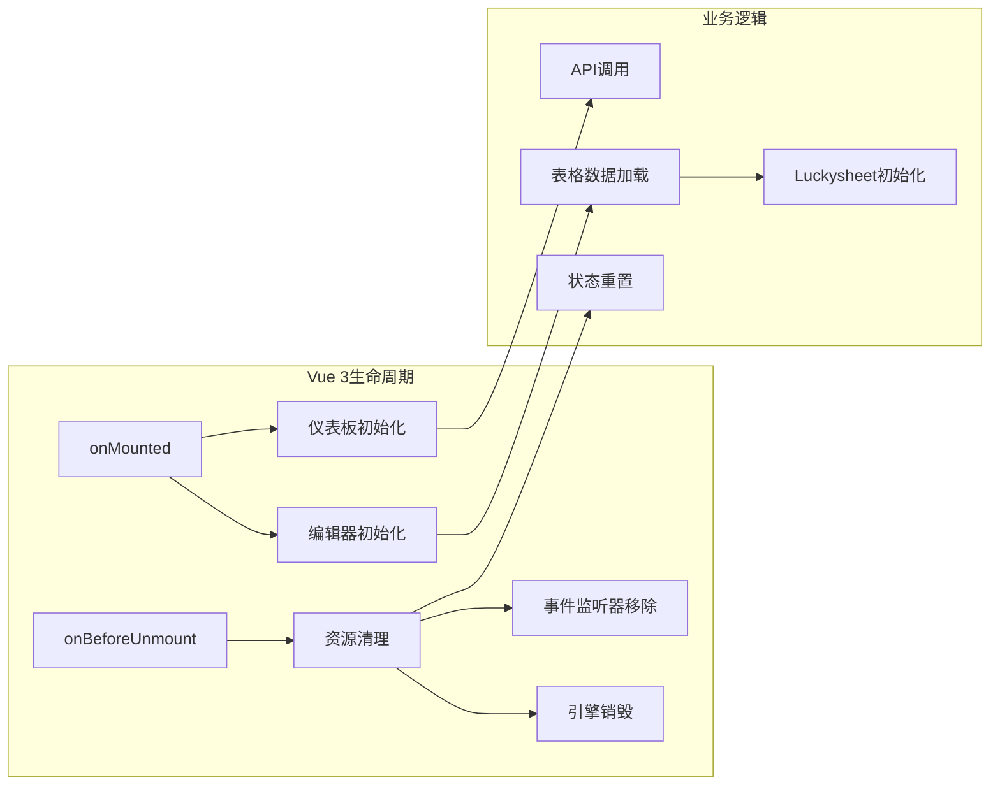

**图表来源**
- [ExcelDashboard.vue:122-124](file://dataloom-web/src/views/ExcelDashboard.vue#L122-L124)
- [SheetEditor.vue:115-132](file://dataloom-web/src/views/SheetEditor.vue#L115-L132)

**章节来源**
- [ExcelDashboard.vue:122-124](file://dataloom-web/src/views/ExcelDashboard.vue#L122-L124)
- [SheetEditor.vue:115-132](file://dataloom-web/src/views/SheetEditor.vue#L115-L132)

## 性能考虑

### 生命周期性能优化

1. **延迟初始化**: 在`onMounted`中进行昂贵的操作，避免阻塞首屏渲染
2. **异步加载**: 使用`nextTick`确保DOM更新完成后再进行DOM操作
3. **资源管理**: 在`onBeforeUnmount`中及时清理资源，防止内存泄漏
4. **状态优化**: 使用`computed`和`watch`优化响应式状态更新

### Excel处理性能优化

1. **分块加载**: 大型Excel文件采用分块加载策略
2. **增量保存**: 仅保存发生变化的数据
3. **结构快照**: 避免不必要的全量保存
4. **缓存策略**: 对常用数据进行缓存

## 故障排除指南

### 常见生命周期问题

#### 组件未正确卸载

**问题症状**:
- 控制台出现内存泄漏警告
- 事件监听器仍在响应用户操作
- 页面切换时出现异常行为

**解决方案**:
- 确保在`onBeforeUnmount`中移除所有事件监听器
- 销毁外部JavaScript引擎实例
- 清理定时器和异步操作

#### 异步操作竞态条件

**问题症状**:
- 组件卸载后仍执行异步操作
- 状态更新到已销毁的组件实例

**解决方案**:
- 在组件卸载时取消所有正在进行的异步操作
- 使用标志位检测组件是否仍处于激活状态
- 在`onBeforeUnmount`中设置清理标志

#### Excel引擎初始化失败

**问题症状**:
- Luckysheet引擎无法正常工作
- 页面空白或报错

**解决方案**:
- 检查CDN资源加载状态
- 确保在DOM元素存在后再初始化引擎
- 添加适当的错误处理和降级方案

**章节来源**
- [SheetEditor.vue:119-132](file://dataloom-web/src/views/SheetEditor.vue#L119-L132)
- [SheetEditor.vue:312-321](file://dataloom-web/src/views/SheetEditor.vue#L312-L321)

## 结论

DataLoom项目展示了Vue 3组件生命周期在复杂应用场景中的最佳实践。通过合理使用生命周期钩子，项目实现了：

1. **清晰的初始化流程**: 使用`onMounted`确保组件在正确时机加载数据
2. **完善的资源管理**: 通过`onBeforeUnmount`实现完整的资源清理
3. **高效的性能优化**: 采用增量保存和结构快照等策略提升性能
4. **健壮的错误处理**: 提供完善的异常处理和降级机制

这些实践为开发复杂的在线Excel编辑应用提供了宝贵的参考，特别是在处理大型数据集和集成第三方JavaScript引擎方面。

对于类似的应用开发，建议遵循以下原则：
- 在合适的生命周期钩子中执行相应的操作
- 始终在组件卸载时清理资源
- 优化异步操作的执行时机
- 提供良好的错误处理和用户体验