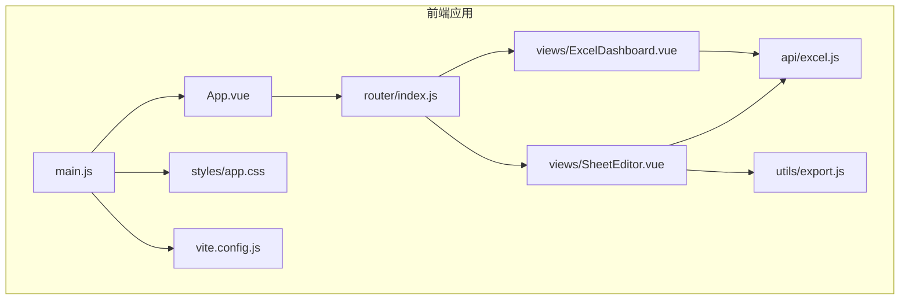
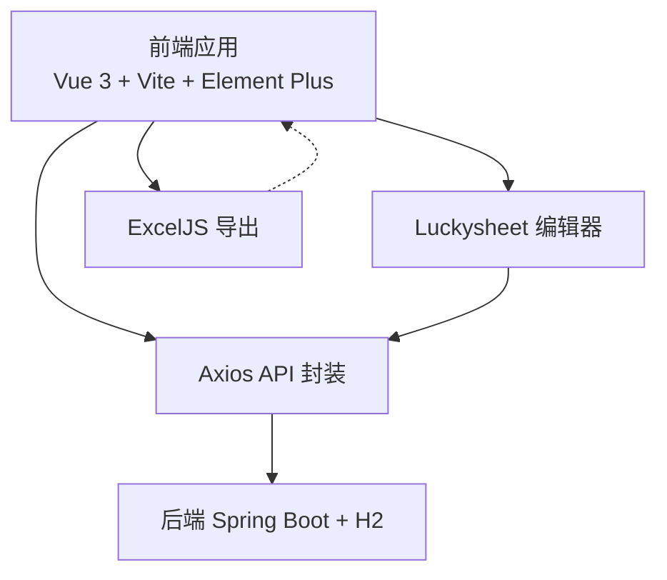
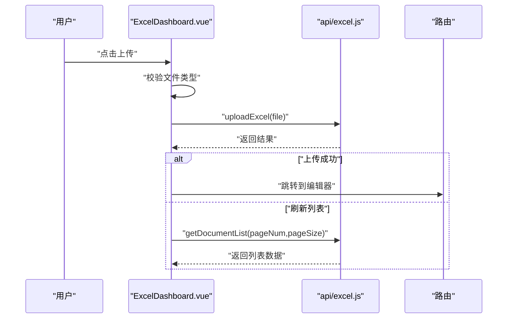
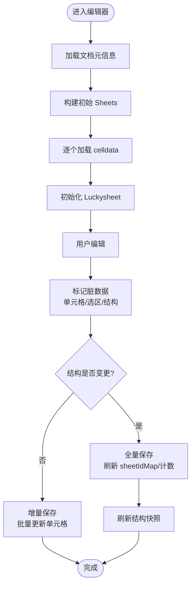
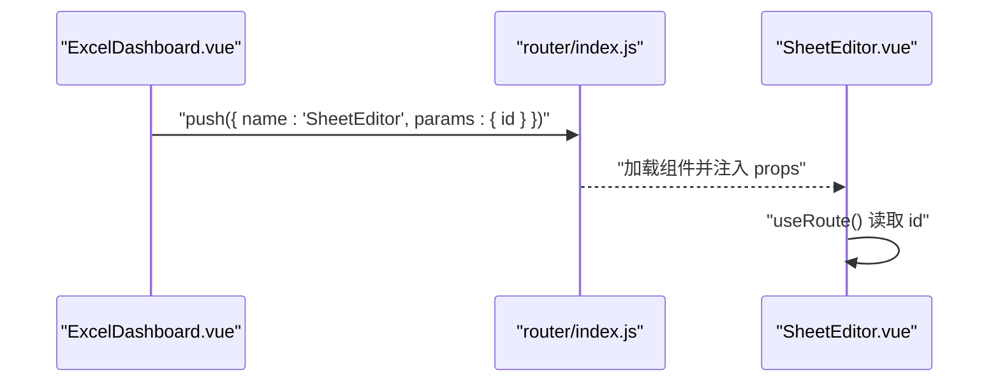
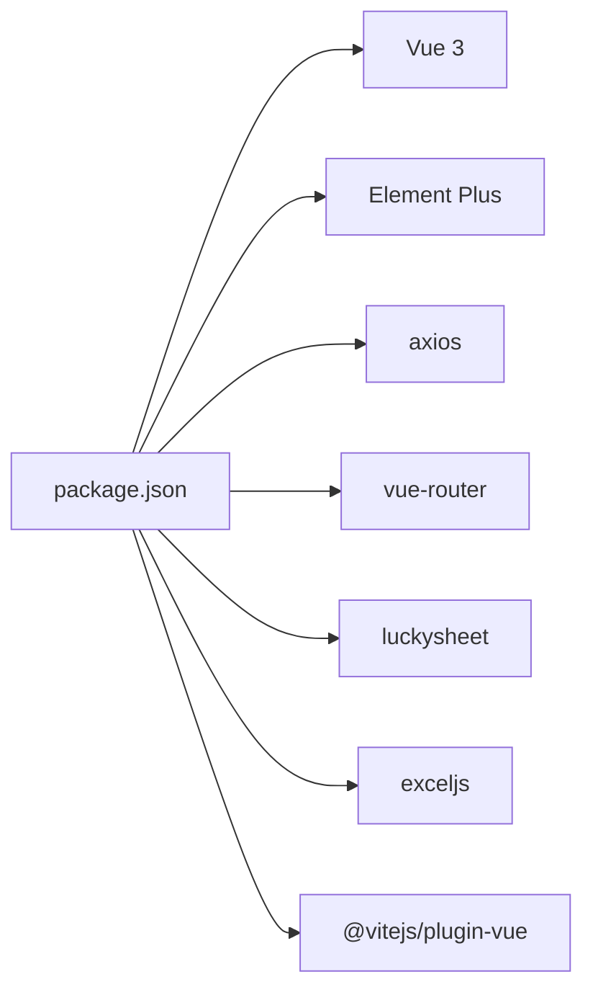

# 组件设计模式

<cite>
**本文引用的文件**
- [App.vue](file://dataloom-web/src/App.vue)
- [main.js](file://dataloom-web/src/main.js)
- [ExcelDashboard.vue](file://dataloom-web/src/views/ExcelDashboard.vue)
- [SheetEditor.vue](file://dataloom-web/src/views/SheetEditor.vue)
- [router/index.js](file://dataloom-web/src/router/index.js)
- [api/excel.js](file://dataloom-web/src/api/excel.js)
- [utils/export.js](file://dataloom-web/src/utils/export.js)
- [vite.config.js](file://dataloom-web/vite.config.js)
- [styles/app.css](file://dataloom-web/src/styles/app.css)
- [package.json](file://dataloom-web/package.json)
- [README.md](file://README.md)
</cite>

## 目录
1. [简介](#简介)
2. [项目结构](#项目结构)
3. [核心组件](#核心组件)
4. [架构总览](#架构总览)
5. [组件详解](#组件详解)
6. [依赖关系分析](#依赖关系分析)
7. [性能考量](#性能考量)
8. [故障排查指南](#故障排查指南)
9. [结论](#结论)
10. [附录](#附录)

## 简介
本文件围绕 Vue 3 组件设计模式，结合项目中的实际实现，系统阐述 Composition API 的使用方式、响应式数据管理、生命周期钩子与状态管理模式、父子组件通信机制（props、事件、插槽）、组件复用与可维护性设计原则，并给出开发规范、命名约定、代码组织结构建议以及测试与调试策略。目标是帮助开发者编写高质量、可扩展的 Vue 3 组件。

## 项目结构
前端采用 Vue 3 + Vite + Element Plus 架构，路由采用 Vue Router 4，Axios 封装 API，Luckysheet 作为在线表格编辑器，ExcelJS 用于前端导出。核心页面由仪表盘与编辑器两个视图组成，配合路由与 API 层共同完成“上传—解析—在线编辑—分块存储—导出”的闭环。

**图示来源**
- [App.vue:1-4](file://dataloom-web/src/App.vue#L1-L4)
- [main.js:1-19](file://dataloom-web/src/main.js#L1-L19)
- [router/index.js:1-21](file://dataloom-web/src/router/index.js#L1-L21)
- [ExcelDashboard.vue:1-104](file://dataloom-web/src/views/ExcelDashboard.vue#L1-L104)
- [SheetEditor.vue:1-46](file://dataloom-web/src/views/SheetEditor.vue#L1-L46)
- [api/excel.js:1-79](file://dataloom-web/src/api/excel.js#L1-L79)
- [utils/export.js:1-239](file://dataloom-web/src/utils/export.js#L1-L239)
- [vite.config.js:1-26](file://dataloom-web/vite.config.js#L1-L26)
- [styles/app.css:1-65](file://dataloom-web/src/styles/app.css#L1-L65)

**章节来源**
- [main.js:1-19](file://dataloom-web/src/main.js#L1-L19)
- [router/index.js:1-21](file://dataloom-web/src/router/index.js#L1-L21)
- [vite.config.js:1-26](file://dataloom-web/vite.config.js#L1-L26)
- [package.json:1-27](file://dataloom-web/package.json#L1-L27)

## 核心组件
- 应用入口与全局装配：在入口文件中注册 Element Plus 图标组件、安装 Element Plus 与路由，挂载应用。
- 路由与页面：路由定义两个页面：仪表盘（文档列表）与编辑器（在线表格编辑）。
- 仪表盘组件：负责文档列表展示、分页、上传、重命名、删除等交互；使用 Composition API 管理响应式状态与生命周期。
- 编辑器组件：负责文档加载、Luckysheet 初始化、单元格与结构变更追踪、增量/全量保存、前端导出等复杂逻辑；大量使用 Composition API 与响应式数据结构。

**章节来源**
- [main.js:10-18](file://dataloom-web/src/main.js#L10-L18)
- [router/index.js:3-14](file://dataloom-web/src/router/index.js#L3-L14)
- [ExcelDashboard.vue:106-229](file://dataloom-web/src/views/ExcelDashboard.vue#L106-L229)
- [SheetEditor.vue:48-132](file://dataloom-web/src/views/SheetEditor.vue#L48-L132)

## 架构总览
前端与后端通过 Axios API 交互，Luckysheet 作为第三方编辑器集成，ExcelJS 用于前端导出。编辑器内部通过“脏数据追踪”实现增量保存，避免全量写入带来的性能问题。

**图示来源**
- [SheetEditor.vue:247-416](file://dataloom-web/src/views/SheetEditor.vue#L247-L416)
- [api/excel.js:1-79](file://dataloom-web/src/api/excel.js#L1-L79)
- [utils/export.js:1-28](file://dataloom-web/src/utils/export.js#L1-L28)
- [README.md:88-130](file://README.md#L88-L130)

## 组件详解

### 仪表盘组件（ExcelDashboard）
- 使用 Composition API：通过 ref 管理上传、加载、分页等状态；通过 onMounted 触发初始数据加载。
- 生命周期与状态管理：在 mounted 阶段调用加载文档列表；loading 与 uploading 控制加载态与按钮状态。
- 交互流程：选择文件 -> 校验类型 -> 上传 -> 成功后跳转编辑器或刷新列表；支持重命名与删除，删除前二次确认。
- UI 组件：Element Plus 的 Button、Table、Pagination、Tag、MessageBox、Message 等。

**图示来源**
- [ExcelDashboard.vue:142-172](file://dataloom-web/src/views/ExcelDashboard.vue#L142-L172)
- [ExcelDashboard.vue:126-140](file://dataloom-web/src/views/ExcelDashboard.vue#L126-L140)
- [api/excel.js:13-25](file://dataloom-web/src/api/excel.js#L13-L25)
- [router/index.js:9-14](file://dataloom-web/src/router/index.js#L9-L14)

**章节来源**
- [ExcelDashboard.vue:106-229](file://dataloom-web/src/views/ExcelDashboard.vue#L106-L229)
- [api/excel.js:32-41](file://dataloom-web/src/api/excel.js#L32-L41)

### 编辑器组件（SheetEditor）
- 响应式数据与状态管理：
  - ref：文档 ID、名称、Sheet 数量、加载态、保存/导出/上传中状态、是否未保存等。
  - reactive：脏单元格集合、sheetId 映射、结构变更标记。
  - computed：根据脏数据与标记计算是否有未保存更改。
- 生命周期钩子：onMounted 初始化文档；onBeforeUnmount 销毁编辑器实例与事件监听，避免内存泄漏。
- 复杂逻辑：
  - 文档加载：获取文档元信息，构建初始 Sheet 列表，逐个加载 celldata，最后初始化 Luckysheet。
  - 脏数据追踪：cellUpdated 与 updated 钩子配合，记录单元格变更；选区变更时批量标记。
  - 结构快照与保存策略：对比结构快照决定全量保存还是增量保存；全量保存后刷新映射与计数。
  - 前端导出：使用 ExcelJS 将编辑器状态转换为 .xlsx 下载。

**图示来源**
- [SheetEditor.vue:134-173](file://dataloom-web/src/views/SheetEditor.vue#L134-L173)
- [SheetEditor.vue:439-480](file://dataloom-web/src/views/SheetEditor.vue#L439-L480)
- [SheetEditor.vue:547-631](file://dataloom-web/src/views/SheetEditor.vue#L547-L631)
- [SheetEditor.vue:486-531](file://dataloom-web/src/views/SheetEditor.vue#L486-L531)

**章节来源**
- [SheetEditor.vue:48-132](file://dataloom-web/src/views/SheetEditor.vue#L48-L132)
- [SheetEditor.vue:439-480](file://dataloom-web/src/views/SheetEditor.vue#L439-L480)
- [SheetEditor.vue:547-631](file://dataloom-web/src/views/SheetEditor.vue#L547-L631)

### 组件间通信与路由参数
- 路由参数：编辑器路由使用动态参数 id，组件通过 useRoute 读取；props: true 使路由参数透传为组件 props。
- 事件与导航：仪表盘通过 router.push 跳转编辑器；编辑器通过 goBack 返回列表。
- 插槽与自定义：组件模板中使用 Element Plus 的默认插槽与具名插槽进行布局与内容定制。

**图示来源**
- [router/index.js:9-14](file://dataloom-web/src/router/index.js#L9-L14)
- [ExcelDashboard.vue:174-176](file://dataloom-web/src/views/ExcelDashboard.vue#L174-L176)

**章节来源**
- [router/index.js:3-14](file://dataloom-web/src/router/index.js#L3-L14)
- [ExcelDashboard.vue:174-176](file://dataloom-web/src/views/ExcelDashboard.vue#L174-L176)

### 响应式数据与状态管理最佳实践
- 使用 ref 管理简单状态（布尔、数字、字符串），使用 reactive 管理复杂对象与集合（如脏单元格集合）。
- 使用 computed 计算派生状态，避免重复计算与副作用。
- 在 onBeforeUnmount 中清理外部资源（如 DOM 事件、第三方实例销毁），防止内存泄漏。
- 将长流程拆分为小函数，职责单一，便于测试与维护。

**章节来源**
- [SheetEditor.vue:48-82](file://dataloom-web/src/views/SheetEditor.vue#L48-L82)
- [SheetEditor.vue:119-132](file://dataloom-web/src/views/SheetEditor.vue#L119-L132)

### 组件复用性与可维护性设计原则
- 单一职责：仪表盘专注列表与上传，编辑器专注加载、保存与导出。
- 可测试性：将复杂逻辑拆分为纯函数（如序列化、快照对比、导出转换），便于单元测试。
- 可扩展性：通过 API 层抽象网络请求，统一错误处理与加载态；通过工具模块封装导出逻辑。
- 可读性：使用语义化变量名与注释，保持模板与脚本分离，合理划分作用域。

**章节来源**
- [api/excel.js:1-79](file://dataloom-web/src/api/excel.js#L1-L79)
- [utils/export.js:1-239](file://dataloom-web/src/utils/export.js#L1-L239)

## 依赖关系分析
- 运行时依赖：Vue 3、Element Plus、Luckysheet、ExcelJS、axios、vue-router。
- 构建与开发：Vite、@vitejs/plugin-vue。
- 代理与端口：前端 Vite 代理 /api 到后端 9191 端口。

**图示来源**
- [package.json:12-25](file://dataloom-web/package.json#L12-L25)

**章节来源**
- [package.json:1-27](file://dataloom-web/package.json#L1-L27)
- [vite.config.js:15-20](file://dataloom-web/vite.config.js#L15-L20)

## 性能考量
- 分块加载与懒加载：后端按 1000 行分块存储，前端按需加载，降低首屏与编辑时的内存占用。
- 增量保存：仅保存变更单元格，减少网络与数据库压力。
- 结构快照：在结构未变时避免全量保存，进一步优化性能。
- 导出策略：前端导出避免后端样式丢失，同时利用 ExcelJS 的高效序列化。

**章节来源**
- [README.md:108-129](file://README.md#L108-L129)
- [SheetEditor.vue:547-631](file://dataloom-web/src/views/SheetEditor.vue#L547-L631)

## 故障排查指南
- 上传失败：检查文件类型与后端接口；关注 Message 与 MessageBox 的错误提示。
- 文档加载失败：确认路由参数 id 是否存在；检查 getDocument 接口返回；必要时回退到列表页。
- 编辑器初始化失败：确认 Luckysheet 资源是否加载；检查容器是否存在；查看控制台警告。
- 保存失败：区分结构变更与单元格变更；查看后端返回；必要时兜底全量保存。
- 导出失败：确认 ExcelJS 依赖与工作簿数据非空；检查文件名合法性。

**章节来源**
- [ExcelDashboard.vue:146-172](file://dataloom-web/src/views/ExcelDashboard.vue#L146-L172)
- [SheetEditor.vue:134-173](file://dataloom-web/src/views/SheetEditor.vue#L134-L173)
- [SheetEditor.vue:547-631](file://dataloom-web/src/views/SheetEditor.vue#L547-L631)
- [utils/export.js:4-28](file://dataloom-web/src/utils/export.js#L4-L28)

## 结论
本项目以 Vue 3 Composition API 为核心，结合 Element Plus、Luckysheet 与 ExcelJS，实现了从上传、解析、在线编辑到导出的完整链路。通过分块存储与增量保存策略，兼顾性能与可用性；通过清晰的组件职责与状态管理，提升了可维护性与可测试性。遵循本文的设计原则与规范，有助于持续迭代高质量的 Vue 3 组件。

## 附录

### 开发规范与命名约定
- 组件命名：采用帕斯卡命名（如 ExcelDashboard.vue、SheetEditor.vue）。
- 响应式变量：ref 用于简单状态，reactive 用于对象集合；computed 用于派生状态。
- 生命周期钩子：在 <script setup> 中使用 onMounted/onBeforeUnmount 等。
- API 层：统一在 api 目录下管理，按功能模块拆分。
- 工具函数：将导出、格式化等逻辑抽取为独立模块，便于复用与测试。

**章节来源**
- [ExcelDashboard.vue:106-229](file://dataloom-web/src/views/ExcelDashboard.vue#L106-L229)
- [SheetEditor.vue:48-132](file://dataloom-web/src/views/SheetEditor.vue#L48-L132)
- [api/excel.js:1-79](file://dataloom-web/src/api/excel.js#L1-L79)
- [utils/export.js:1-239](file://dataloom-web/src/utils/export.js#L1-L239)

### 代码组织结构建议
- views：页面级组件，承载路由与业务流程。
- api：网络请求封装，集中处理错误与加载态。
- utils：通用工具函数，如导出、格式化、序列化等。
- styles：全局样式与主题变量。
- router：路由配置与导航守卫。
- main.js：应用入口与全局插件注册。

**章节来源**
- [main.js:1-19](file://dataloom-web/src/main.js#L1-L19)
- [router/index.js:1-21](file://dataloom-web/src/router/index.js#L1-L21)
- [styles/app.css:1-65](file://dataloom-web/src/styles/app.css#L1-L65)

### 组件测试策略与调试技巧
- 单元测试：针对纯函数（如序列化、快照对比、导出转换）编写测试用例，模拟输入输出。
- 集成测试：通过路由与组件快照验证页面渲染与交互流程。
- 调试技巧：利用浏览器控制台与日志输出定位问题；在编辑器中打印结构快照与脏数据集合；使用 Element Plus 的 Message/MessageBox 提供用户反馈。
- 性能监控：观察保存耗时与网络请求次数，评估增量保存效果。

**章节来源**
- [SheetEditor.vue:633-783](file://dataloom-web/src/views/SheetEditor.vue#L633-L783)
- [utils/export.js:1-239](file://dataloom-web/src/utils/export.js#L1-L239)