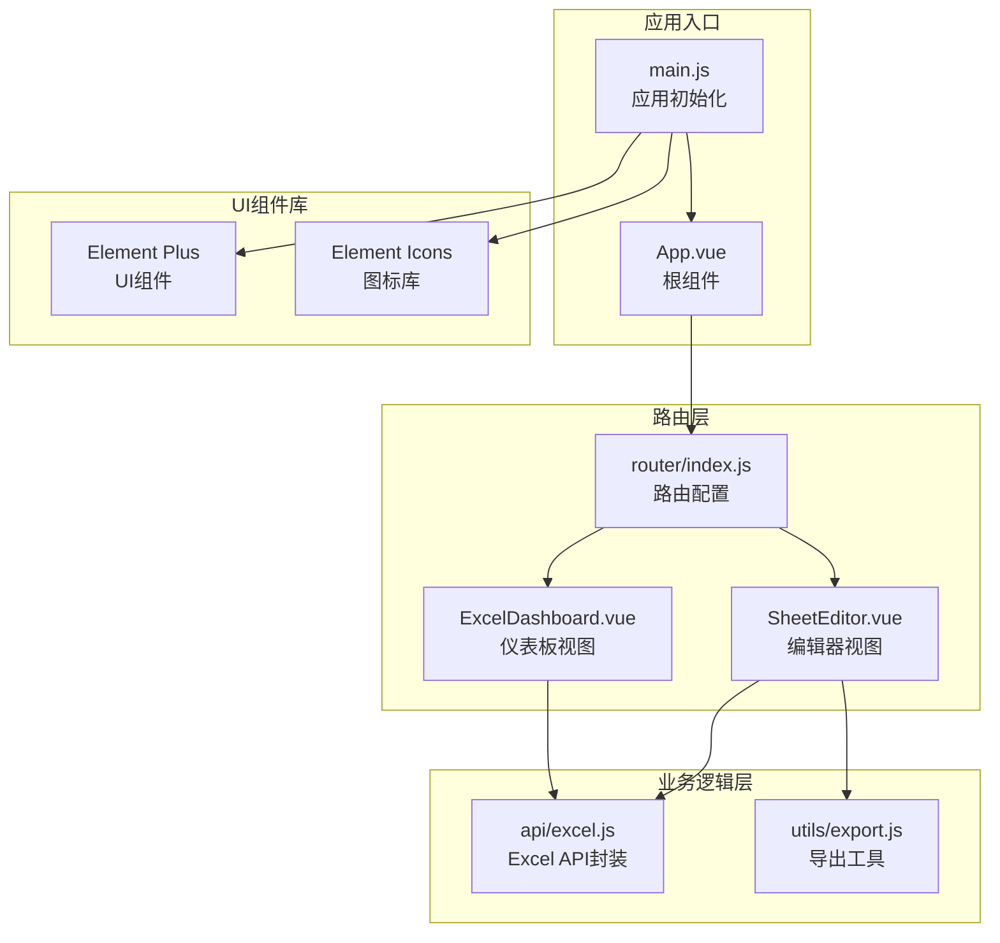
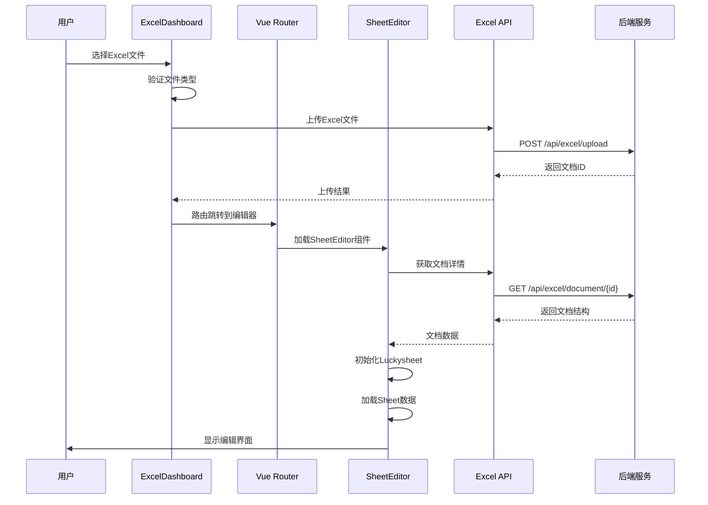
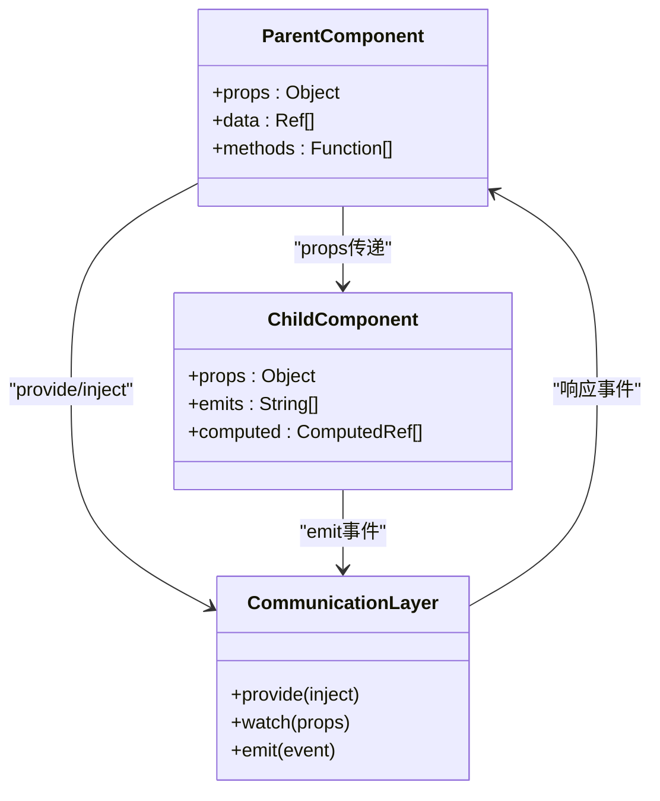
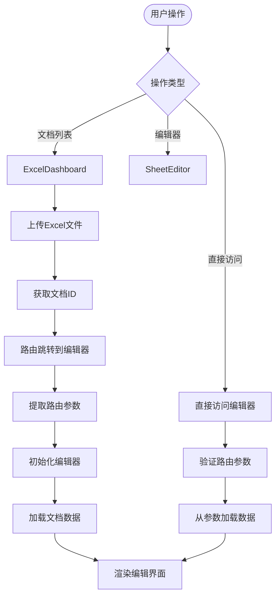
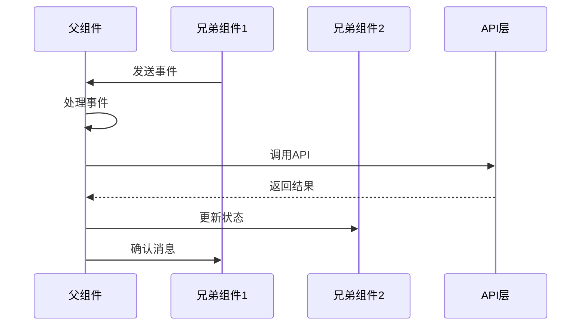
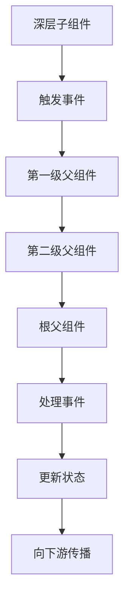
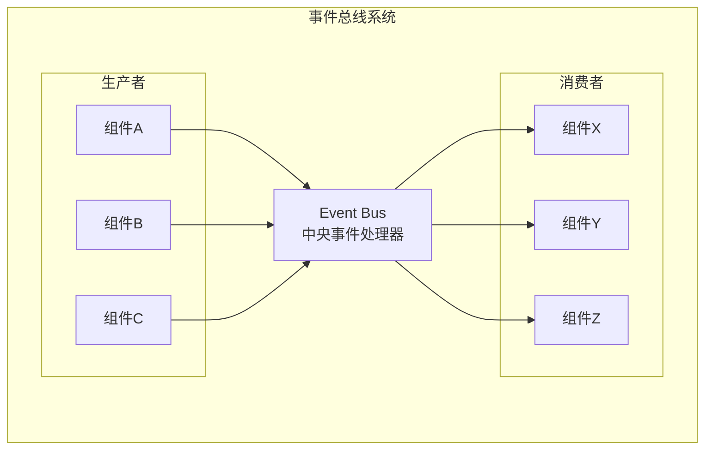
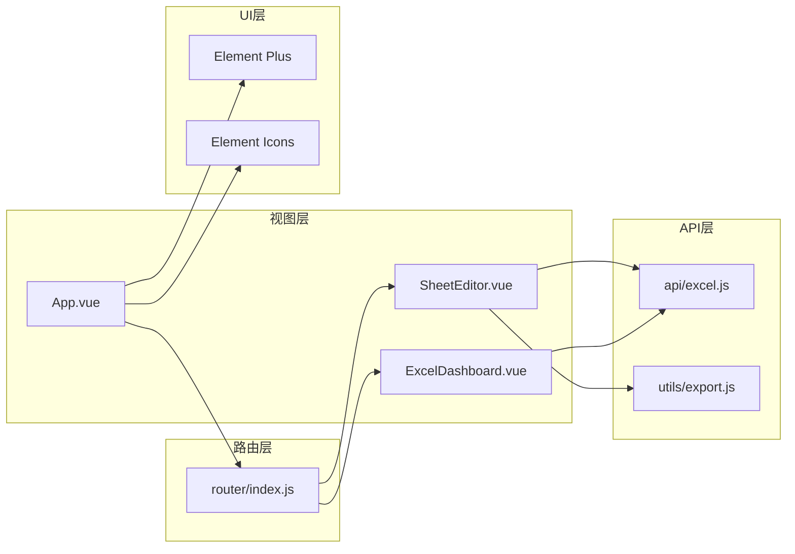

# 组件通信机制

<cite>
**本文档引用的文件**
- [ExcelDashboard.vue](file://dataloom-web/src/views/ExcelDashboard.vue)
- [SheetEditor.vue](file://dataloom-web/src/views/SheetEditor.vue)
- [App.vue](file://dataloom-web/src/App.vue)
- [main.js](file://dataloom-web/src/main.js)
- [router/index.js](file://dataloom-web/src/router/index.js)
- [api/excel.js](file://dataloom-web/src/api/excel.js)
- [utils/export.js](file://dataloom-web/src/utils/export.js)
- [package.json](file://dataloom-web/package.json)
</cite>

## 目录
1. [引言](#引言)
2. [项目结构](#项目结构)
3. [核心组件](#核心组件)
4. [架构概览](#架构概览)
5. [详细组件分析](#详细组件分析)
6. [依赖关系分析](#依赖关系分析)
7. [性能考虑](#性能考虑)
8. [故障排除指南](#故障排除指南)
9. [结论](#结论)

## 引言

DataLoom 是一个基于 Vue 3 + Vite + Element Plus 构建的在线 Excel 协作编辑器。该项目展示了现代前端应用中组件通信的各种模式，包括父子组件通信、兄弟组件通信、跨层级组件通信以及路由参数传递等。本文档将深入分析 ExcelDashboard 和 SheetEditor 两个核心组件之间的通信机制，并提供最佳实践和性能优化建议。

## 项目结构

DataLoom 采用典型的 Vue 3 单页应用架构，主要由以下层次组成：



**图表来源**
- [App.vue:1-4](file://dataloom-web/src/App.vue#L1-L4)
- [main.js:1-19](file://dataloom-web/src/main.js#L1-L19)
- [router/index.js:1-21](file://dataloom-web/src/router/index.js#L1-L21)

**章节来源**
- [main.js:1-19](file://dataloom-web/src/main.js#L1-L19)
- [router/index.js:1-21](file://dataloom-web/src/router/index.js#L1-L21)

## 核心组件

### ExcelDashboard 组件

ExcelDashboard 是应用的主界面组件，负责文档列表的展示和管理。该组件实现了完整的 CRUD 操作，包括文档上传、查看、重命名和删除功能。

**主要功能特性：**
- 文档列表展示和分页
- Excel 文件上传和解析
- 文档元数据管理
- 用户交互反馈

### SheetEditor 组件

SheetEditor 是核心编辑器组件，基于 Luckysheet 提供强大的电子表格编辑功能。该组件负责：
- 文档结构初始化
- Sheet 数据加载和管理
- 实时数据变更跟踪
- 工作簿保存和导出

**章节来源**
- [ExcelDashboard.vue:106-229](file://dataloom-web/src/views/ExcelDashboard.vue#L106-L229)
- [SheetEditor.vue:48-844](file://dataloom-web/src/views/SheetEditor.vue#L48-L844)

## 架构概览

DataLoom 采用了清晰的分层架构设计，实现了组件间的松耦合通信：



**图表来源**
- [ExcelDashboard.vue:146-176](file://dataloom-web/src/views/ExcelDashboard.vue#L146-L176)
- [router/index.js:10-14](file://dataloom-web/src/router/index.js#L10-L14)
- [api/excel.js:13-25](file://dataloom-web/src/api/excel.js#L13-L25)

## 详细组件分析

### 父子组件通信机制

#### Props 传递模式

在 DataLoom 中，父子组件通信主要通过 props 实现。虽然当前项目中主要使用路由参数进行组件间通信，但 props 模式同样重要：



#### 事件触发模式

组件间通过自定义事件进行异步通信：

**ExcelDashboard 中的事件处理：**
- 文件选择事件处理
- 文档操作按钮点击事件
- 分页组件事件监听

**SheetEditor 中的事件处理：**
- Luckysheet 生命周期钩子
- 单元格变更事件
- 图片删除事件

### 路由参数传递

DataLoom 使用 Vue Router 实现组件间的参数传递：



**图表来源**
- [router/index.js:3-15](file://dataloom-web/src/router/index.js#L3-L15)
- [ExcelDashboard.vue:146-176](file://dataloom-web/src/views/ExcelDashboard.vue#L146-L176)

### 依赖注入模式

虽然 DataLoom 主要使用 props 和事件进行通信，但 Vue 3 的 provide/inject 机制同样重要：

```mermaid
graph LR
subgraph "提供者层"
Provider[Provider Component<br/>provide()方法]
State[全局状态<br/>响应式数据]
end
subgraph "消费者层"
Consumer1[Consumer Component 1<br/>inject()接收]
Consumer2[Consumer Component 2<br/>inject()接收]
Consumer3[Consumer Component 3<br/>inject()接收]
end
Provider --> State
State --> Consumer1
State --> Consumer2
State --> Consumer3
Consumer1 -.->|"事件"| Provider
Consumer2 -.->|"事件"| Provider
Consumer3 -.->|"事件"| Provider
```

### 兄弟组件通信策略

在 DataLoom 中，兄弟组件通信主要通过以下几种方式实现：

#### 1. 通过共同父组件协调



#### 2. 通过全局状态管理

虽然当前项目使用相对简单的状态管理，但可以扩展为：
- 全局响应式状态
- 组件间共享的数据
- 统一的错误处理机制

### 跨层级组件通信

对于深层嵌套的组件树，DataLoom 采用以下策略：

#### 1. 事件冒泡模式



#### 2. 中央事件总线



## 依赖关系分析

### 技术栈依赖

DataLoom 的技术栈具有清晰的层次结构：

```mermaid
graph TB
subgraph "运行时依赖"
Vue[Vue 3.5.13<br/>核心框架]
Router[vue-router 4.5.0<br/>路由管理]
ElementPlus[element-plus 2.10.7<br/>UI组件库]
Axios[axios 1.7.9<br/>HTTP客户端]
end
subgraph "开发工具"
Vite[Vite 6.0.7<br/>构建工具]
PluginVue[@vitejs/plugin-vue<br/>Vue插件]
end
subgraph "业务相关"
Luckysheet[luckysheet 2.1.13<br/>电子表格引擎]
ExcelJS[exceljs 4.4.0<br/>Excel处理]
FileSaver[file-saver 2.0.5<br/>文件下载]
end
Vue --> Router
Vue --> ElementPlus
Vue --> Axios
Vue --> Luckysheet
Vue --> ExcelJS
Vue --> FileSaver
Vite --> PluginVue
Vite --> Vue
```

**图表来源**
- [package.json:12-26](file://dataloom-web/package.json#L12-L26)

### 组件间依赖关系



**图表来源**
- [router/index.js:1-21](file://dataloom-web/src/router/index.js#L1-L21)
- [api/excel.js:1-79](file://dataloom-web/src/api/excel.js#L1-L79)

**章节来源**
- [package.json:1-27](file://dataloom-web/package.json#L1-L27)

## 性能考虑

### 1. 组件懒加载

DataLoom 使用动态导入实现组件懒加载，减少初始包体积：

```javascript
// 路由配置中的懒加载
{
  path: '/edit/:id',
  name: 'SheetEditor',
  component: () => import('@/views/SheetEditor.vue'),
  props: true
}
```

### 2. 数据加载优化

#### 分块加载策略
- 使用 `chunkCount` 实现分块数据加载
- 支持进度显示和错误处理
- 避免一次性加载大量数据

#### 增量更新机制
- 仅更新发生变化的单元格
- 使用 `dirtyCells` 标记变更
- 减少不必要的 API 调用

### 3. 内存管理

#### 组件生命周期管理
- 在 `onBeforeUnmount` 中清理事件监听器
- 销毁 Luckysheet 实例避免内存泄漏
- 移除 DOM 事件绑定

#### 图表数据处理
- 使用 `stableJson` 进行结构对比
- 清理无效的图表数据
- 避免僵尸数据占用内存

### 4. 渲染性能优化

#### 计算属性缓存
- 使用 `computed` 属性缓存复杂计算
- 避免重复的 DOM 查询
- 优化响应式更新

#### 事件处理优化
- 使用防抖和节流
- 合理的事件委托
- 避免频繁的状态更新

## 故障排除指南

### 1. 路由参数问题

**常见问题：** 路由参数为空或不正确

**解决方案：**
- 检查路由配置中的 `props: true`
- 验证参数类型转换
- 添加参数验证逻辑

### 2. 数据同步问题

**常见问题：** 编辑器与仪表板数据不同步

**解决方案：**
- 实现数据变更通知机制
- 使用统一的数据源
- 添加冲突解决策略

### 3. 性能问题

**常见症状：** 页面卡顿、内存泄漏

**诊断步骤：**
- 检查组件销毁逻辑
- 监控事件监听器数量
- 分析内存使用情况

**优化措施：**
- 及时清理事件监听器
- 使用 `onBeforeUnmount` 进行资源回收
- 优化大数据量的渲染

### 4. 错误处理

**统一错误处理策略：**
- 使用 `try-catch` 包装异步操作
- 提供用户友好的错误提示
- 实现错误日志记录

**章节来源**
- [SheetEditor.vue:119-132](file://dataloom-web/src/views/SheetEditor.vue#L119-L132)
- [ExcelDashboard.vue:135-137](file://dataloom-web/src/views/ExcelDashboard.vue#L135-L137)

## 结论

DataLoom 项目展示了 Vue 3 组件通信的完整生态系统，包括：

### 核心通信模式总结

1. **路由参数传递** - 适用于页面级数据传递
2. **Props 传递** - 适用于父子组件数据传递
3. **事件触发** - 适用于组件间异步通信
4. **依赖注入** - 适用于跨层级数据共享
5. **状态管理** - 适用于复杂应用的状态协调

### 最佳实践建议

1. **明确通信边界** - 根据数据流向选择合适的通信方式
2. **保持组件独立性** - 避免过度耦合
3. **实现健壮的错误处理** - 提供良好的用户体验
4. **关注性能优化** - 特别是大数据量场景
5. **文档化通信协议** - 便于团队协作和维护

### 未来改进方向

1. **引入状态管理库** - 如 Pinia，处理更复杂的全局状态
2. **实现组件测试** - 提高代码质量和可靠性
3. **优化移动端体验** - 适配不同设备和屏幕尺寸
4. **增强实时协作功能** - 支持多用户同时编辑

通过合理运用这些通信机制，DataLoom 为在线 Excel 编辑器提供了稳定、高效的组件通信基础，为类似的应用开发提供了宝贵的参考经验。