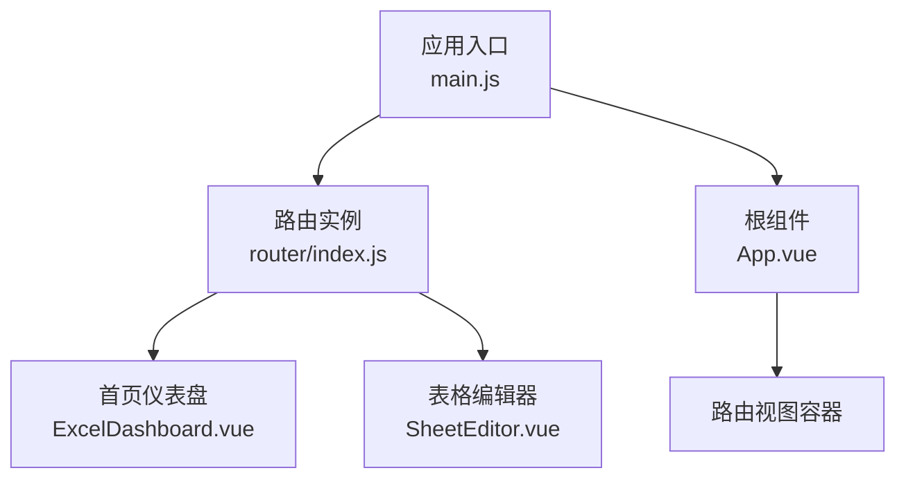
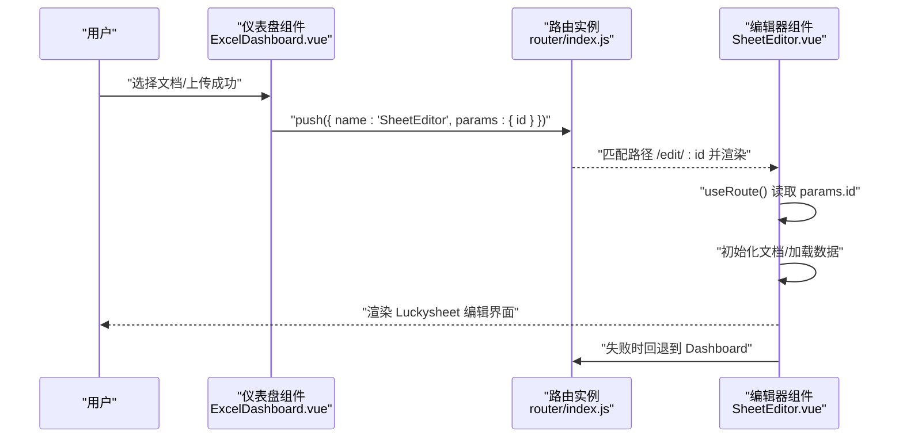
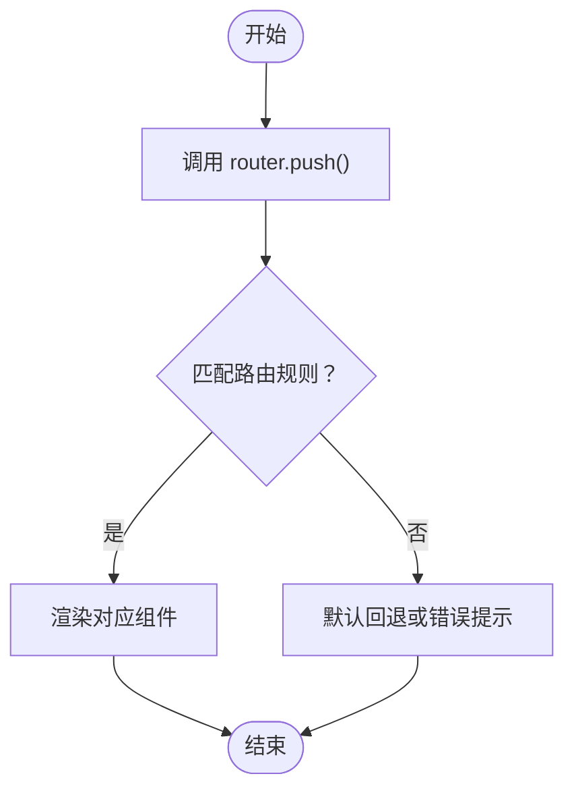
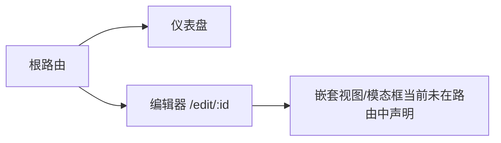
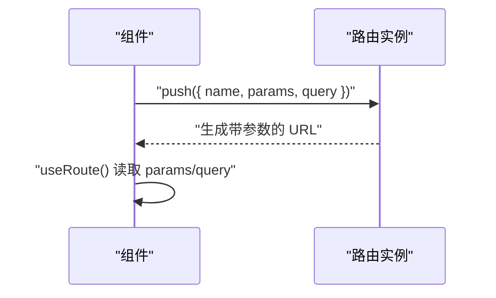
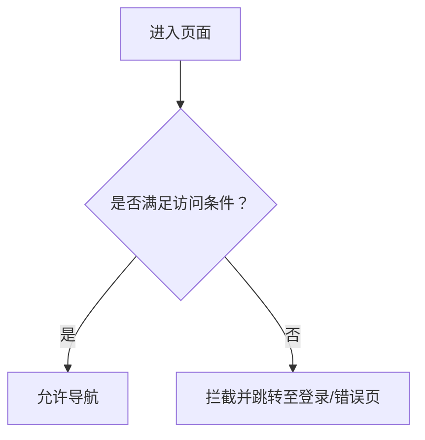
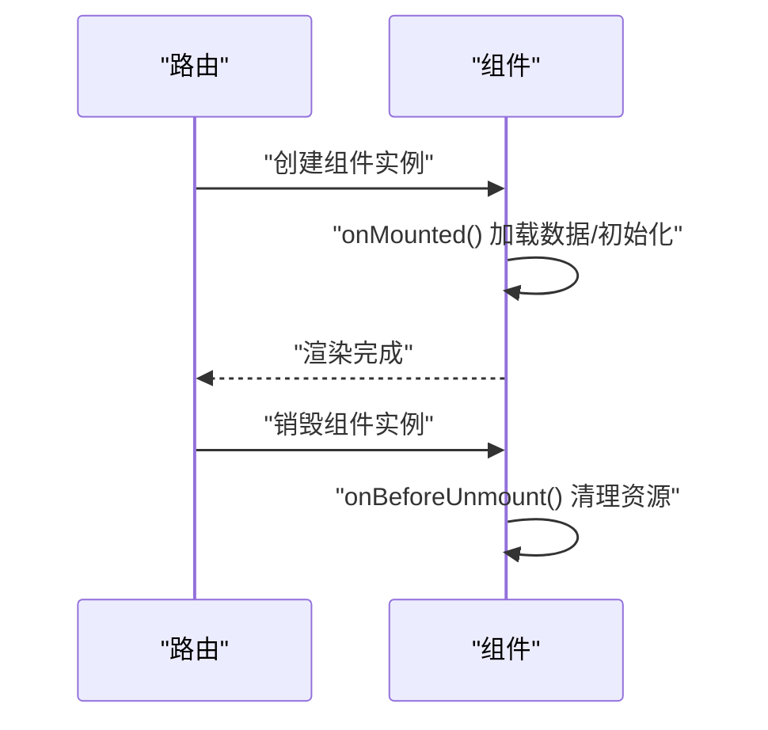
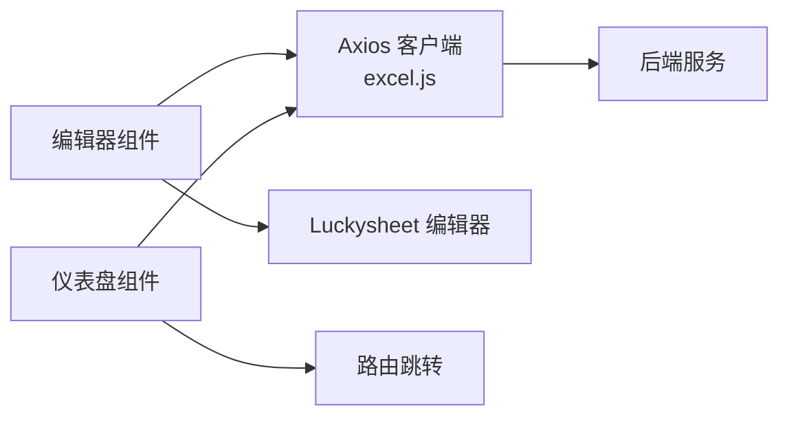
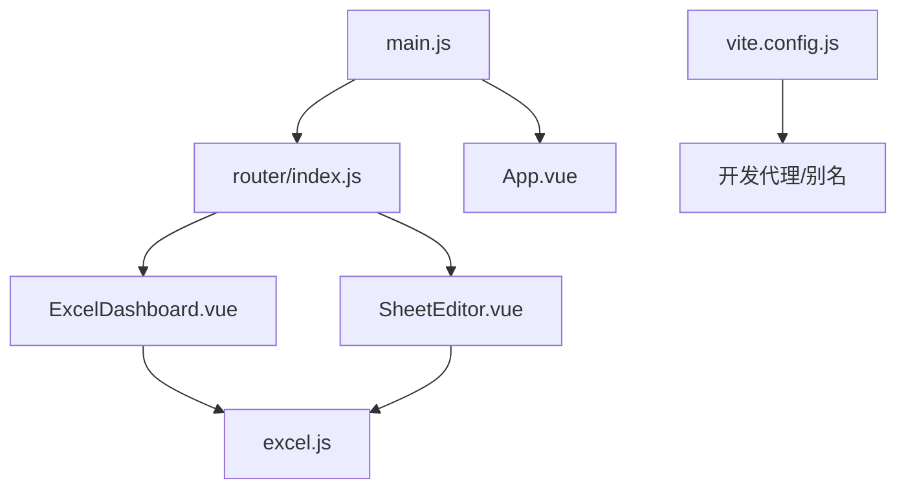

# 路由与导航

<cite>
**本文引用的文件**
- [router/index.js](file://dataloom-web/src/router/index.js)
- [main.js](file://dataloom-web/src/main.js)
- [App.vue](file://dataloom-web/src/App.vue)
- [ExcelDashboard.vue](file://dataloom-web/src/views/ExcelDashboard.vue)
- [SheetEditor.vue](file://dataloom-web/src/views/SheetEditor.vue)
- [excel.js](file://dataloom-web/src/api/excel.js)
- [vite.config.js](file://dataloom-web/vite.config.js)
- [package.json](file://dataloom-web/package.json)
</cite>

## 目录
1. [简介](#简介)
2. [项目结构](#项目结构)
3. [核心组件](#核心组件)
4. [架构总览](#架构总览)
5. [详细组件分析](#详细组件分析)
6. [依赖分析](#依赖分析)
7. [性能考虑](#性能考虑)
8. [故障排查指南](#故障排查指南)
9. [结论](#结论)
10. [附录](#附录)

## 简介
本文件围绕 Vue Router 路由系统进行深入说明，结合仓库中的实际代码，解释路由配置结构、页面导航机制、动态路由与嵌套路由设计模式、路由参数传递与查询字符串处理、导航拦截与页面跳转最佳实践、路由性能优化策略与懒加载实现方案，以及路由与组件的绑定关系与生命周期管理。

## 项目结构
- 路由定义集中在路由模块中，采用 Hash 模式，使用异步组件实现按需加载。
- 应用入口注册路由插件并挂载根组件，根组件通过路由视图容器承载页面切换。
- 页面组件通过路由钩子读取参数并驱动业务逻辑，同时在交互中进行页面跳转。

**图示来源**
- [main.js:1-19](file://dataloom-web/src/main.js#L1-L19)
- [router/index.js:1-21](file://dataloom-web/src/router/index.js#L1-L21)
- [App.vue:1-4](file://dataloom-web/src/App.vue#L1-L4)

**章节来源**
- [main.js:1-19](file://dataloom-web/src/main.js#L1-L19)
- [router/index.js:1-21](file://dataloom-web/src/router/index.js#L1-L21)
- [App.vue:1-4](file://dataloom-web/src/App.vue#L1-L4)

## 核心组件
- 路由配置与历史模式
  - 使用 Hash 历史模式，避免部署到静态服务器时的回退问题。
  - 定义两条路由：首页仪表盘与表格编辑器，后者为动态路由，携带文档 ID 参数。
- 应用入口与插件注册
  - 在应用入口注册 Element Plus、图标组件与路由插件，确保全局可用。
- 根组件与视图容器
  - 根组件以路由视图容器承载当前路由对应的组件，实现页面切换。

**章节来源**
- [router/index.js:1-21](file://dataloom-web/src/router/index.js#L1-L21)
- [main.js:1-19](file://dataloom-web/src/main.js#L1-L19)
- [App.vue:1-4](file://dataloom-web/src/App.vue#L1-L4)

## 架构总览
下图展示从用户交互到页面渲染与数据请求的整体流程，包括路由跳转、组件挂载、数据加载与错误回退等环节。

**图示来源**
- [ExcelDashboard.vue:163-176](file://dataloom-web/src/views/ExcelDashboard.vue#L163-L176)
- [router/index.js:9-14](file://dataloom-web/src/router/index.js#L9-L14)
- [SheetEditor.vue:56-58](file://dataloom-web/src/views/SheetEditor.vue#L56-L58)
- [SheetEditor.vue:168-169](file://dataloom-web/src/views/SheetEditor.vue#L168-L169)

## 详细组件分析

### 路由配置与导航机制
- 路由定义
  - 首页路由：根路径，组件为异步加载的仪表盘。
  - 编辑器路由：路径含动态段，组件为异步加载的编辑器，开启 props 透传。
- 历史模式
  - 使用 Hash 模式，利于静态部署。
- 导航触发
  - 仪表盘组件在上传成功或点击文档时，通过命名路由与参数进行跳转。
  - 编辑器组件在初始化失败时回退到仪表盘。

**图示来源**
- [router/index.js:3-14](file://dataloom-web/src/router/index.js#L3-L14)
- [ExcelDashboard.vue:163-176](file://dataloom-web/src/views/ExcelDashboard.vue#L163-L176)
- [SheetEditor.vue:168-169](file://dataloom-web/src/views/SheetEditor.vue#L168-L169)

**章节来源**
- [router/index.js:1-21](file://dataloom-web/src/router/index.js#L1-L21)
- [ExcelDashboard.vue:163-176](file://dataloom-web/src/views/ExcelDashboard.vue#L163-L176)
- [SheetEditor.vue:168-169](file://dataloom-web/src/views/SheetEditor.vue#L168-L169)

### 动态路由与嵌套路由设计模式
- 动态路由
  - 编辑器路由使用动态段接收文档 ID，组件通过路由参数读取并驱动数据加载。
- 嵌套路由
  - 当前路由配置未显式声明子路由，但组件内部可通过子视图或模态框实现“嵌套”效果（如工具栏、侧边面板等）。若需严格嵌套路由，可在路由配置中扩展子路由数组。

**图示来源**
- [router/index.js:9-14](file://dataloom-web/src/router/index.js#L9-L14)
- [SheetEditor.vue:48-46](file://dataloom-web/src/views/SheetEditor.vue#L48-L46)

**章节来源**
- [router/index.js:9-14](file://dataloom-web/src/router/index.js#L9-L14)
- [SheetEditor.vue:48-46](file://dataloom-web/src/views/SheetEditor.vue#L48-L46)

### 路由参数传递与查询字符串处理
- 路由参数
  - 使用命名路由与 params 传递动态参数（如文档 ID），组件通过路由钩子读取。
- 查询参数
  - 当前示例主要使用 params；如需查询参数，可在 push 时传入 query 字段，组件通过路由钩子读取。

**图示来源**
- [ExcelDashboard.vue:163-176](file://dataloom-web/src/views/ExcelDashboard.vue#L163-L176)
- [SheetEditor.vue:56-58](file://dataloom-web/src/views/SheetEditor.vue#L56-L58)

**章节来源**
- [ExcelDashboard.vue:163-176](file://dataloom-web/src/views/ExcelDashboard.vue#L163-L176)
- [SheetEditor.vue:56-58](file://dataloom-web/src/views/SheetEditor.vue#L56-L58)

### 导航拦截与页面跳转最佳实践
- 导航拦截
  - 当前项目未实现全局前置/后置守卫。若需实现权限校验、登录拦截或访问统计，可在路由实例上添加相应守卫。
- 页面跳转
  - 推荐统一使用命名路由与参数传递，提升可维护性。
  - 错误或异常时及时回退到安全页面（如仪表盘）。

**图示来源**
- [SheetEditor.vue:168-169](file://dataloom-web/src/views/SheetEditor.vue#L168-L169)

**章节来源**
- [SheetEditor.vue:168-169](file://dataloom-web/src/views/SheetEditor.vue#L168-L169)

### 路由与组件绑定关系及生命周期管理
- 组件绑定
  - 路由与组件通过路径与组件函数绑定，组件通过路由视图容器渲染。
- 生命周期
  - 仪表盘组件在挂载时加载文档列表。
  - 编辑器组件在挂载时初始化文档与数据，卸载时销毁编辑器实例，避免内存泄漏。

**图示来源**
- [ExcelDashboard.vue:122-124](file://dataloom-web/src/views/ExcelDashboard.vue#L122-L124)
- [SheetEditor.vue:115-117](file://dataloom-web/src/views/SheetEditor.vue#L115-L117)
- [SheetEditor.vue:119-132](file://dataloom-web/src/views/SheetEditor.vue#L119-L132)

**章节来源**
- [ExcelDashboard.vue:122-124](file://dataloom-web/src/views/ExcelDashboard.vue#L122-L124)
- [SheetEditor.vue:115-117](file://dataloom-web/src/views/SheetEditor.vue#L115-L117)
- [SheetEditor.vue:119-132](file://dataloom-web/src/views/SheetEditor.vue#L119-L132)

### 数据流与 API 集成
- API 客户端
  - 基于 Axios 创建带基础路径的客户端，集中处理文档列表、详情、单元格数据、保存与重命名等接口。
- 组件数据流
  - 仪表盘组件负责上传与跳转，编辑器组件负责加载与保存数据。

**图示来源**
- [excel.js:1-79](file://dataloom-web/src/api/excel.js#L1-L79)
- [SheetEditor.vue:134-173](file://dataloom-web/src/views/SheetEditor.vue#L134-L173)
- [ExcelDashboard.vue:156-172](file://dataloom-web/src/views/ExcelDashboard.vue#L156-L172)

**章节来源**
- [excel.js:1-79](file://dataloom-web/src/api/excel.js#L1-L79)
- [SheetEditor.vue:134-173](file://dataloom-web/src/views/SheetEditor.vue#L134-L173)
- [ExcelDashboard.vue:156-172](file://dataloom-web/src/views/ExcelDashboard.vue#L156-L172)

## 依赖分析
- 路由与应用
  - 应用入口注册路由插件，根组件通过路由视图容器承载页面。
- 构建与代理
  - Vite 配置设置别名与开发代理，便于前后端联调。
- 依赖版本
  - 项目使用 Vue 3 与 Vue Router 4，Element Plus 提供 UI 组件生态。

**图示来源**
- [main.js:1-19](file://dataloom-web/src/main.js#L1-L19)
- [router/index.js:1-21](file://dataloom-web/src/router/index.js#L1-L21)
- [vite.config.js:1-26](file://dataloom-web/vite.config.js#L1-L26)
- [excel.js:1-79](file://dataloom-web/src/api/excel.js#L1-L79)

**章节来源**
- [main.js:1-19](file://dataloom-web/src/main.js#L1-L19)
- [router/index.js:1-21](file://dataloom-web/src/router/index.js#L1-L21)
- [vite.config.js:1-26](file://dataloom-web/vite.config.js#L1-L26)
- [excel.js:1-79](file://dataloom-web/src/api/excel.js#L1-L79)

## 性能考虑
- 懒加载与代码分割
  - 路由组件采用异步导入，实现按需加载，减少首屏体积。
- 资源释放
  - 编辑器组件在卸载时销毁实例，避免内存泄漏。
- 请求优化
  - 使用批量更新接口进行增量保存，降低网络开销。
- 构建优化
  - 生产构建关闭 Source Map，减小包体与调试成本。

**章节来源**
- [router/index.js:7-12](file://dataloom-web/src/router/index.js#L7-L12)
- [SheetEditor.vue:119-132](file://dataloom-web/src/views/SheetEditor.vue#L119-L132)
- [excel.js:56-64](file://dataloom-web/src/api/excel.js#L56-L64)
- [vite.config.js:22-24](file://dataloom-web/vite.config.js#L22-L24)

## 故障排查指南
- 路由跳转无效
  - 检查命名路由与参数是否正确传递，确认路由表中存在对应配置。
- 动态参数读取不到
  - 确认组件内使用路由钩子读取参数，且路径与动态段一致。
- 编辑器初始化失败
  - 查看组件内的错误回退逻辑，确认是否回退到仪表盘。
- 开发环境跨域
  - 检查 Vite 代理配置是否指向正确的后端地址。

**章节来源**
- [router/index.js:9-14](file://dataloom-web/src/router/index.js#L9-L14)
- [SheetEditor.vue:168-169](file://dataloom-web/src/views/SheetEditor.vue#L168-L169)
- [vite.config.js:15-20](file://dataloom-web/vite.config.js#L15-L20)

## 结论
本项目基于 Vue Router 4 实现了简洁高效的前端路由体系：通过 Hash 历史模式与异步组件实现快速首屏与按需加载；通过命名路由与参数传递实现清晰的页面导航；通过组件生命周期与资源释放保障运行时稳定性；通过批量更新接口与构建优化提升整体性能。若需进一步增强权限控制与访问统计，可在路由层引入全局守卫以实现统一拦截与处理。

## 附录
- 关键实现位置参考
  - 路由配置与历史模式：[router/index.js:1-21](file://dataloom-web/src/router/index.js#L1-L21)
  - 应用入口与插件注册：[main.js:1-19](file://dataloom-web/src/main.js#L1-L19)
  - 根组件与视图容器：[App.vue:1-4](file://dataloom-web/src/App.vue#L1-L4)
  - 仪表盘导航与参数传递：[ExcelDashboard.vue:163-176](file://dataloom-web/src/views/ExcelDashboard.vue#L163-L176)
  - 编辑器参数读取与回退：[SheetEditor.vue:56-58](file://dataloom-web/src/views/SheetEditor.vue#L56-L58), [SheetEditor.vue:168-169](file://dataloom-web/src/views/SheetEditor.vue#L168-L169)
  - API 客户端与接口：[excel.js:1-79](file://dataloom-web/src/api/excel.js#L1-L79)
  - 构建与代理配置：[vite.config.js:1-26](file://dataloom-web/vite.config.js#L1-L26)
  - 依赖版本信息：[package.json:1-27](file://dataloom-web/package.json#L1-L27)