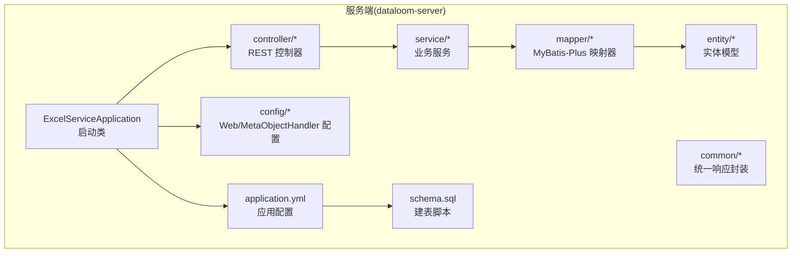
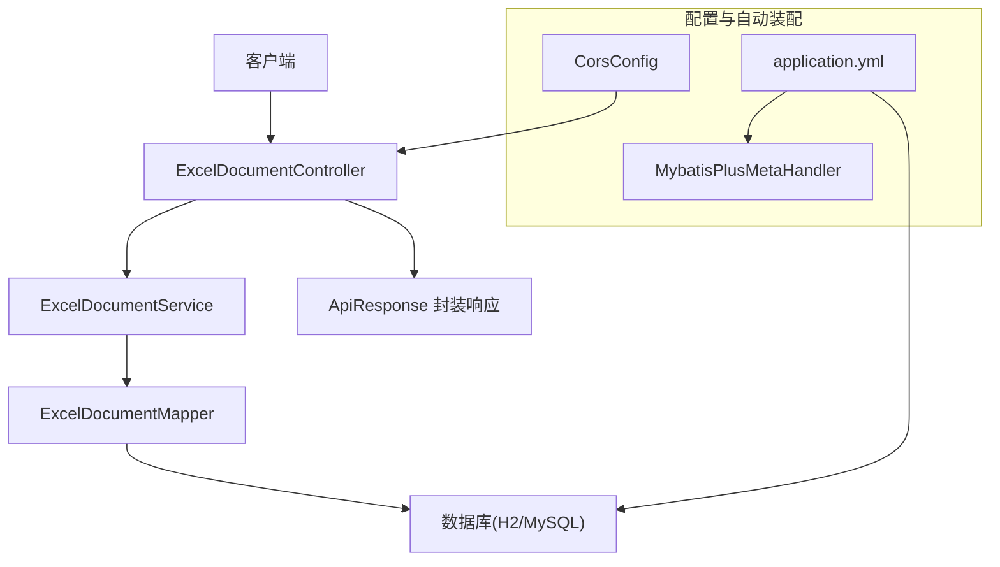
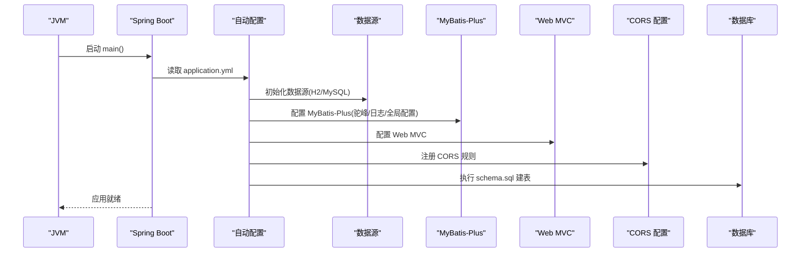
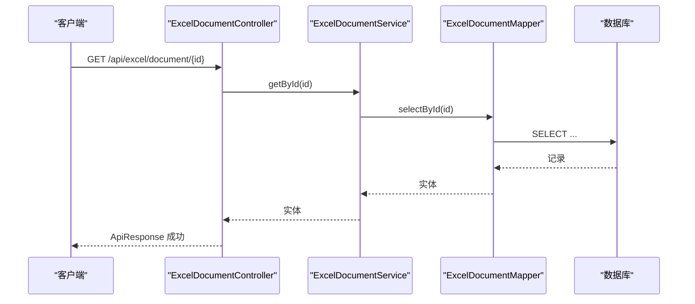
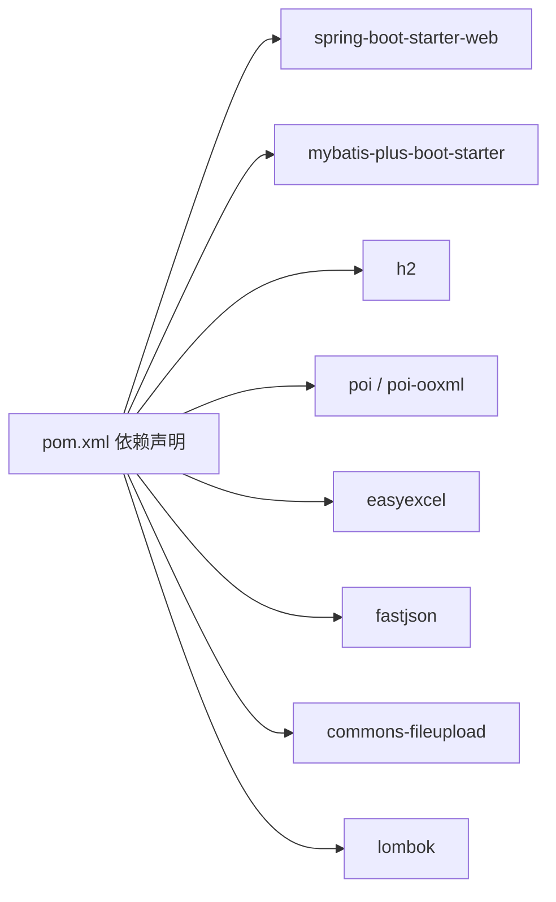

# Spring Boot 应用启动

<cite>
**本文引用的文件**
- [ExcelServiceApplication.java](file://dataloom-server/src/main/java/com/demo/excel/ExcelServiceApplication.java)
- [application.yml](file://dataloom-server/src/main/resources/application.yml)
- [CorsConfig.java](file://dataloom-server/src/main/java/com/demo/excel/config/CorsConfig.java)
- [MybatisPlusMetaHandler.java](file://dataloom-server/src/main/java/com/demo/excel/config/MybatisPlusMetaHandler.java)
- [schema.sql](file://dataloom-server/src/main/resources/schema.sql)
- [pom.xml](file://dataloom-server/pom.xml)
- [ExcelDocumentController.java](file://dataloom-server/src/main/java/com/demo/excel/controller/ExcelDocumentController.java)
- [ExcelDocumentService.java](file://dataloom-server/src/main/java/com/demo/excel/service/ExcelDocumentService.java)
- [ExcelDocument.java](file://dataloom-server/src/main/java/com/demo/excel/entity/ExcelDocument.java)
- [ExcelDocumentMapper.java](file://dataloom-server/src/main/java/com/demo/excel/mapper/ExcelDocumentMapper.java)
- [ApiResponse.java](file://dataloom-server/src/main/java/com/demo/excel/common/ApiResponse.java)
</cite>

## 目录
1. [简介](#简介)
2. [项目结构](#项目结构)
3. [核心组件](#核心组件)
4. [架构概览](#架构概览)
5. [详细组件分析](#详细组件分析)
6. [依赖分析](#依赖分析)
7. [性能考虑](#性能考虑)
8. [故障排查指南](#故障排查指南)
9. [结论](#结论)
10. [附录](#附录)

## 简介
本文件面向 Spring Boot 应用启动与配置，围绕 ExcelServiceApplication 启动类与 application.yml 配置展开，系统性说明：
- 启动类注解与扫描机制的作用与意义
- application.yml 中数据库、服务器、CORS、MyBatis-Plus、日志等关键配置项
- Spring Boot 自动配置原理及如何通过配置文件定制
- 应用启动流程（初始化顺序、Bean 创建过程）
- 实际配置示例与常见问题解决方案

## 项目结构
该工程采用标准 Maven 多模块风格组织，核心服务位于 dataloom-server 模块中，包含启动类、配置、控制器、服务层、持久层、实体与资源文件。启动类位于包 com.demo.excel 下，配置文件位于 resources 目录，数据库建表脚本也放置在 resources 下。

图示来源
- [ExcelServiceApplication.java:1-21](file://dataloom-server/src/main/java/com/demo/excel/ExcelServiceApplication.java#L1-L21)
- [application.yml:1-51](file://dataloom-server/src/main/resources/application.yml#L1-L51)
- [schema.sql:1-124](file://dataloom-server/src/main/resources/schema.sql#L1-L124)

章节来源
- [ExcelServiceApplication.java:1-21](file://dataloom-server/src/main/java/com/demo/excel/ExcelServiceApplication.java#L1-L21)
- [application.yml:1-51](file://dataloom-server/src/main/resources/application.yml#L1-L51)
- [schema.sql:1-124](file://dataloom-server/src/main/resources/schema.sql#L1-L124)

## 核心组件
- 启动类与注解
  - @SpringBootApplication：组合注解，启用自动配置、组件扫描与条件装配，通常指向包含 main 方法的类所在包。
  - @MapperScan：指定 MyBatis-Plus Mapper 接口扫描的基础包，确保接口被注册为 Bean 并生成代理实现。
- 配置文件
  - server.port：设置 HTTP 服务监听端口。
  - spring.datasource.*：数据源驱动、URL、用户名、密码等。
  - spring.sql.init.*：启动时执行建表脚本，支持指定 SQL 资源位置与执行模式。
  - mybatis-plus.*：MyBatis-Plus 的驼峰映射、日志输出、全局配置（ID 类型、逻辑删除值）。
  - logging.level.*：日志级别控制，便于开发调试。
  - excel.upload.path：自定义业务配置项，用于上传目录。
- Web 配置
  - CORS：允许跨域访问，开放 /api/** 路径的来源、方法与头。
  - MyBatis-Plus 自动填充：MetaObjectHandler 在插入/更新时自动填充时间字段。

章节来源
- [ExcelServiceApplication.java:13-14](file://dataloom-server/src/main/java/com/demo/excel/ExcelServiceApplication.java#L13-L14)
- [application.yml:1-51](file://dataloom-server/src/main/resources/application.yml#L1-L51)
- [CorsConfig.java:10-21](file://dataloom-server/src/main/java/com/demo/excel/config/CorsConfig.java#L10-L21)
- [MybatisPlusMetaHandler.java:16-36](file://dataloom-server/src/main/java/com/demo/excel/config/MybatisPlusMetaHandler.java#L16-L36)

## 架构概览
应用采用典型的 Spring MVC + MyBatis-Plus 架构：
- 控制器接收请求，调用服务层处理业务
- 服务层操作 Mapper 访问数据库
- 实体模型映射到数据库表
- 自动配置负责加载数据源、MyBatis-Plus、Web MVC、CORS 等组件

图示来源
- [ExcelDocumentController.java:22-296](file://dataloom-server/src/main/java/com/demo/excel/controller/ExcelDocumentController.java#L22-L296)
- [ExcelDocumentService.java:19-119](file://dataloom-server/src/main/java/com/demo/excel/service/ExcelDocumentService.java#L19-L119)
- [ExcelDocumentMapper.java:9-11](file://dataloom-server/src/main/java/com/demo/excel/mapper/ExcelDocumentMapper.java#L9-L11)
- [ExcelDocument.java:15-54](file://dataloom-server/src/main/java/com/demo/excel/entity/ExcelDocument.java#L15-L54)
- [ApiResponse.java:6-51](file://dataloom-server/src/main/java/com/demo/excel/common/ApiResponse.java#L6-L51)
- [application.yml:1-51](file://dataloom-server/src/main/resources/application.yml#L1-L51)
- [CorsConfig.java:10-21](file://dataloom-server/src/main/java/com/demo/excel/config/CorsConfig.java#L10-L21)
- [MybatisPlusMetaHandler.java:16-36](file://dataloom-server/src/main/java/com/demo/excel/config/MybatisPlusMetaHandler.java#L16-L36)

## 详细组件分析

### 启动类与自动配置
- @SpringBootApplication
  - 开启组件扫描，扫描启动类所在包及其子包下的组件（@Service、@Controller、@Configuration 等）
  - 启用 Spring Boot 自动配置，根据类路径与配置推断加载合适的 Starter 组件
- @MapperScan("com.demo.excel.mapper")
  - 指定 MyBatis-Plus Mapper 接口扫描范围，确保 BaseMapper 子接口被注册为 Bean
- 启动流程要点
  - Spring Boot 启动时会读取 application.yml，完成数据源、MyBatis-Plus、Web、CORS 等自动配置
  - 执行 schema.sql 建表脚本（spring.sql.init.mode=always）
  - 初始化控制器、服务、Mapper、实体、自动填充处理器等 Bean

图示来源
- [ExcelServiceApplication.java:13-19](file://dataloom-server/src/main/java/com/demo/excel/ExcelServiceApplication.java#L13-L19)
- [application.yml:1-51](file://dataloom-server/src/main/resources/application.yml#L1-L51)
- [schema.sql:1-124](file://dataloom-server/src/main/resources/schema.sql#L1-L124)

章节来源
- [ExcelServiceApplication.java:13-19](file://dataloom-server/src/main/java/com/demo/excel/ExcelServiceApplication.java#L13-L19)
- [application.yml:1-51](file://dataloom-server/src/main/resources/application.yml#L1-L51)

### application.yml 配置详解
- 服务器配置
  - server.port：HTTP 服务监听端口
- 应用元信息
  - spring.application.name：应用名称
- 数据源（H2 内存数据库，Demo 使用）
  - spring.datasource.driver-class-name：数据库驱动
  - spring.datasource.url：数据库连接 URL（H2 文件模式）
  - spring.datasource.username/password：用户名与密码
  - h2.console.enabled/path：H2 控制台开关与访问路径
- 文件上传
  - spring.servlet.multipart.max-file-size/max-request-size：单文件与请求总大小限制
- 启动初始化
  - spring.sql.init.mode：启动模式（always/never/embedded）
  - spring.sql.init.schema-locations：SQL 资源位置（classpath:schema.sql）
- MyBatis-Plus
  - mybatis-plus.configuration.map-underscore-to-camel-case：开启下划线转驼峰
  - mybatis-plus.configuration.log-impl：日志实现（StdOutImpl 输出到控制台）
  - mybatis-plus.global-config.db-config.id-type：主键策略（auto）
  - mybatis-plus.global-config.db-config.logic-delete-value/not-delete-value：逻辑删除值
- 自定义配置
  - excel.upload.path：上传目录（业务自定义）
- 日志
  - logging.level.com.demo.excel：设置包级日志级别为 DEBUG

章节来源
- [application.yml:1-51](file://dataloom-server/src/main/resources/application.yml#L1-L51)

### CORS 跨域配置
- CorsConfig 实现 WebMvcConfigurer，对 /api/** 路径开放：
  - 允许任意来源（*）
  - 允许 GET/POST/PUT/DELETE/OPTIONS 方法
  - 允许任意请求头
  - 缓存预检请求 3600 秒

章节来源
- [CorsConfig.java:10-21](file://dataloom-server/src/main/java/com/demo/excel/config/CorsConfig.java#L10-L21)

### MyBatis-Plus 自动填充
- MybatisPlusMetaHandler 实现 MetaObjectHandler，在插入与更新时自动填充 createTime、updateTime 字段，减少重复代码

章节来源
- [MybatisPlusMetaHandler.java:16-36](file://dataloom-server/src/main/java/com/demo/excel/config/MybatisPlusMetaHandler.java#L16-L36)

### 控制器与服务层交互
- ExcelDocumentController 提供文档列表、详情、全量保存、单元格批量更新、重命名、删除等接口
- ExcelDocumentService 负责文档的创建、分页查询、软删除、重命名等业务逻辑
- 二者通过 @Autowired 注入，遵循 Spring 依赖注入原则

图示来源
- [ExcelDocumentController.java:77-131](file://dataloom-server/src/main/java/com/demo/excel/controller/ExcelDocumentController.java#L77-L131)
- [ExcelDocumentService.java:61-63](file://dataloom-server/src/main/java/com/demo/excel/service/ExcelDocumentService.java#L61-L63)
- [ExcelDocumentMapper.java:9-11](file://dataloom-server/src/main/java/com/demo/excel/mapper/ExcelDocumentMapper.java#L9-L11)

章节来源
- [ExcelDocumentController.java:22-296](file://dataloom-server/src/main/java/com/demo/excel/controller/ExcelDocumentController.java#L22-L296)
- [ExcelDocumentService.java:19-119](file://dataloom-server/src/main/java/com/demo/excel/service/ExcelDocumentService.java#L19-L119)
- [ExcelDocumentMapper.java:9-11](file://dataloom-server/src/main/java/com/demo/excel/mapper/ExcelDocumentMapper.java#L9-L11)

### 实体模型与表结构
- ExcelDocument 实体映射 excel_document 表，包含主键、名称、Sheet 数量与名称列表、版本、状态、文件路径与大小、创建者、时间戳等字段
- 通过 @TableId、@TableName、@TableField(fill=...) 等注解与 MyBatis-Plus 集成

章节来源
- [ExcelDocument.java:15-54](file://dataloom-server/src/main/java/com/demo/excel/entity/ExcelDocument.java#L15-L54)

### 建表脚本与数据库切换
- schema.sql 定义三张核心表：excel_document、excel_sheet、excel_sheet_chunk
- H2 兼容语法，生产环境可直接替换 application.yml 中的数据源为 MySQL 并注释 H2 依赖

章节来源
- [schema.sql:1-124](file://dataloom-server/src/main/resources/schema.sql#L1-L124)
- [application.yml:8-29](file://dataloom-server/src/main/resources/application.yml#L8-L29)

## 依赖分析
- Spring Boot Web：提供 Web MVC、Tomcat 等运行时
- MyBatis-Plus：简化数据库访问，提供自动填充、逻辑删除、分页插件等能力
- H2：Demo 数据库，支持内存与文件模式
- Apache POI/EasyExcel：Excel 解析与导出
- FastJSON：JSON 工具
- commons-fileupload：文件上传支持
- Lombok：简化实体类代码

图示来源
- [pom.xml:32-106](file://dataloom-server/pom.xml#L32-L106)

章节来源
- [pom.xml:15-106](file://dataloom-server/pom.xml#L15-L106)

## 性能考虑
- 数据库选择
  - Demo 使用 H2，生产建议切换为 MySQL，并调整连接参数与连接池配置
- 逻辑删除
  - 使用 MyBatis-Plus 的逻辑删除，避免物理删除带来的性能与数据安全问题
- 分页与缓存
  - 控制器与服务层结合分页插件，合理设置分页大小，避免一次性加载大量数据
- 日志输出
  - 开发阶段开启 DEBUG，生产建议调整为 INFO 或 WARN，降低日志开销

## 故障排查指南
- 启动失败（找不到数据源或无法建立连接）
  - 检查 spring.datasource.* 配置是否正确，确认数据库驱动与 URL 是否匹配
  - 若使用 MySQL，请注释 H2 依赖并引入 MySQL Connector/J
- 建表失败或表不存在
  - 确认 spring.sql.init.mode 与 schema-locations 配置正确，确保 schema.sql 可被 classpath 正确加载
- CORS 报错
  - 检查 CorsConfig 是否生效，确认请求路径是否匹配 /api/**
- 单元格数据过大导致内存压力
  - 采用分块加载策略（ExcelDocumentController 中已提供按分块加载与合并的逻辑），避免一次性合并所有分块
- 上传文件过大
  - 调整 spring.servlet.multipart.max-file-size 与 max-request-size，确保满足业务需求

章节来源
- [application.yml:8-29](file://dataloom-server/src/main/resources/application.yml#L8-L29)
- [CorsConfig.java:14-20](file://dataloom-server/src/main/java/com/demo/excel/config/CorsConfig.java#L14-L20)
- [ExcelDocumentController.java:139-161](file://dataloom-server/src/main/java/com/demo/excel/controller/ExcelDocumentController.java#L139-L161)

## 结论
本项目以最小化方式展示了 Spring Boot 的启动与配置实践：
- 启动类通过 @SpringBootApplication 与 @MapperScan 简化了组件扫描与 MyBatis-Plus Mapper 注册
- application.yml 提供了数据库、Web、MyBatis-Plus、CORS、日志等关键配置，便于快速搭建与扩展
- 通过自动配置与约定优于配置的原则，开发者可以专注于业务逻辑实现
- 建议在生产环境中替换数据源为 MySQL，并完善连接池、监控与日志策略

## 附录
- 启动命令参考
  - 使用 Maven 插件打包并启动：mvn spring-boot:run 或 mvn package && java -jar target/dataloom-server-1.0.0.jar
- 生产环境迁移要点
  - 替换数据源为 MySQL，调整连接参数
  - 关闭 H2 控制台，启用生产日志级别
  - 配置文件上传目录与权限
  - 引入连接池与监控组件（如 HikariCP、Actuator）