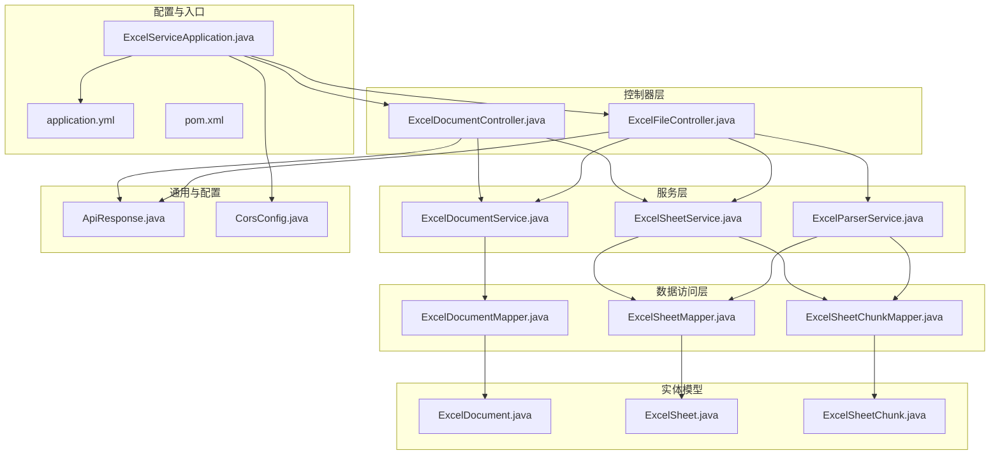
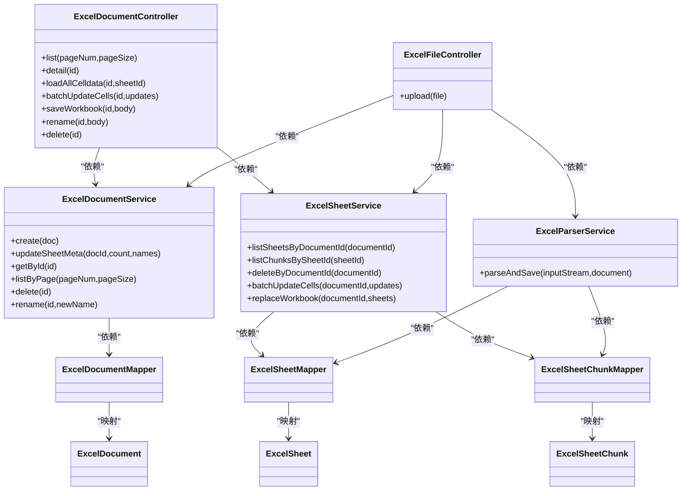
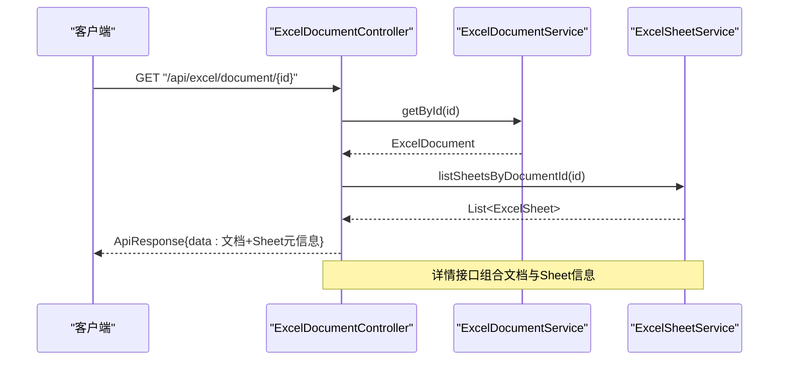
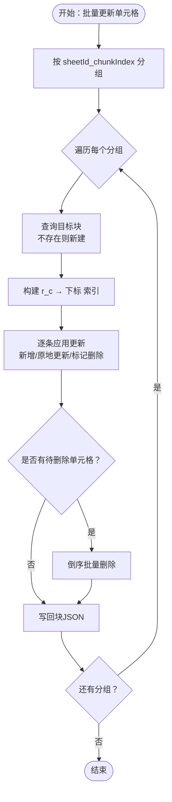
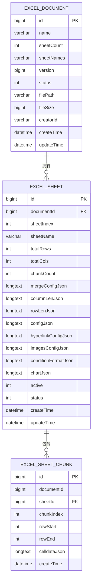
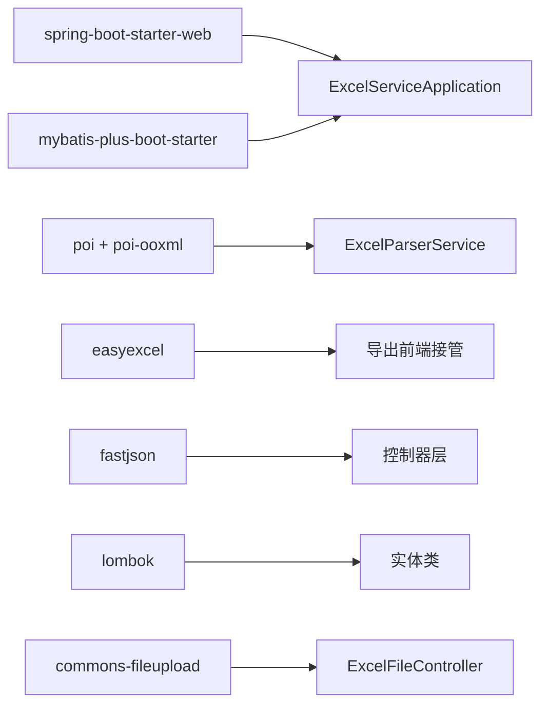

# 后端服务架构

<cite>
**本文引用的文件**
- [ExcelServiceApplication.java](file://dataloom-server/src/main/java/com/demo/excel/ExcelServiceApplication.java)
- [application.yml](file://dataloom-server/src/main/resources/application.yml)
- [pom.xml](file://dataloom-server/pom.xml)
- [ApiResponse.java](file://dataloom-server/src/main/java/com/demo/excel/common/ApiResponse.java)
- [CorsConfig.java](file://dataloom-server/src/main/java/com/demo/excel/config/CorsConfig.java)
- [ExcelDocumentController.java](file://dataloom-server/src/main/java/com/demo/excel/controller/ExcelDocumentController.java)
- [ExcelFileController.java](file://dataloom-server/src/main/java/com/demo/excel/controller/ExcelFileController.java)
- [ExcelDocumentService.java](file://dataloom-server/src/main/java/com/demo/excel/service/ExcelDocumentService.java)
- [ExcelParserService.java](file://dataloom-server/src/main/java/com/demo/excel/service/ExcelParserService.java)
- [ExcelSheetService.java](file://dataloom-server/src/main/java/com/demo/excel/service/ExcelSheetService.java)
- [ExcelDocumentMapper.java](file://dataloom-server/src/main/java/com/demo/excel/mapper/ExcelDocumentMapper.java)
- [ExcelSheetMapper.java](file://dataloom-server/src/main/java/com/demo/excel/mapper/ExcelSheetMapper.java)
- [ExcelSheetChunkMapper.java](file://dataloom-server/src/main/java/com/demo/excel/mapper/ExcelSheetChunkMapper.java)
- [ExcelDocument.java](file://dataloom-server/src/main/java/com/demo/excel/entity/ExcelDocument.java)
- [ExcelSheet.java](file://dataloom-server/src/main/java/com/demo/excel/entity/ExcelSheet.java)
- [ExcelSheetChunk.java](file://dataloom-server/src/main/java/com/demo/excel/entity/ExcelSheetChunk.java)
</cite>

## 目录
1. [简介](#简介)
2. [项目结构](#项目结构)
3. [核心组件](#核心组件)
4. [架构总览](#架构总览)
5. [详细组件分析](#详细组件分析)
6. [依赖分析](#依赖分析)
7. [性能考虑](#性能考虑)
8. [故障排查指南](#故障排查指南)
9. [结论](#结论)
10. [附录](#附录)

## 简介
本文件面向 DataLoom 后端服务，系统性梳理基于 Spring Boot 的 MVC 分层架构与 MyBatis-Plus 集成方案。重点覆盖：
- 控制器层（Controller）职责与 REST API 设计
- 服务层（Service）事务与业务编排
- 数据访问层（Mapper）与 MyBatis-Plus 使用
- 统一响应体、跨域配置、文件上传与解析流程
- 代码级交互关系图与最佳实践建议

## 项目结构
后端采用标准 Spring Boot 目录组织，按“实体-映射-服务-控制器”分层，配合通用响应体与跨域配置。

**图表来源**
- [ExcelServiceApplication.java:1-21](file://dataloom-server/src/main/java/com/demo/excel/ExcelServiceApplication.java#L1-L21)
- [application.yml:1-51](file://dataloom-server/src/main/resources/application.yml#L1-L51)
- [pom.xml:1-127](file://dataloom-server/pom.xml#L1-L127)
- [ExcelDocumentController.java:1-296](file://dataloom-server/src/main/java/com/demo/excel/controller/ExcelDocumentController.java#L1-L296)
- [ExcelFileController.java:1-141](file://dataloom-server/src/main/java/com/demo/excel/controller/ExcelFileController.java#L1-L141)
- [ExcelDocumentService.java:1-119](file://dataloom-server/src/main/java/com/demo/excel/service/ExcelDocumentService.java#L1-L119)
- [ExcelSheetService.java:1-443](file://dataloom-server/src/main/java/com/demo/excel/service/ExcelSheetService.java#L1-L443)
- [ExcelParserService.java:1-348](file://dataloom-server/src/main/java/com/demo/excel/service/ExcelParserService.java#L1-L348)
- [ExcelDocumentMapper.java:1-11](file://dataloom-server/src/main/java/com/demo/excel/mapper/ExcelDocumentMapper.java#L1-L11)
- [ExcelSheetMapper.java:1-13](file://dataloom-server/src/main/java/com/demo/excel/mapper/ExcelSheetMapper.java#L1-L13)
- [ExcelSheetChunkMapper.java:1-13](file://dataloom-server/src/main/java/com/demo/excel/mapper/ExcelSheetChunkMapper.java#L1-L13)
- [ExcelDocument.java:1-55](file://dataloom-server/src/main/java/com/demo/excel/entity/ExcelDocument.java#L1-L55)
- [ExcelSheet.java:1-77](file://dataloom-server/src/main/java/com/demo/excel/entity/ExcelSheet.java#L1-L77)
- [ExcelSheetChunk.java:1-53](file://dataloom-server/src/main/java/com/demo/excel/entity/ExcelSheetChunk.java#L1-L53)
- [ApiResponse.java:1-52](file://dataloom-server/src/main/java/com/demo/excel/common/ApiResponse.java#L1-L52)
- [CorsConfig.java:1-22](file://dataloom-server/src/main/java/com/demo/excel/config/CorsConfig.java#L1-L22)

**章节来源**
- [ExcelServiceApplication.java:1-21](file://dataloom-server/src/main/java/com/demo/excel/ExcelServiceApplication.java#L1-L21)
- [application.yml:1-51](file://dataloom-server/src/main/resources/application.yml#L1-L51)
- [pom.xml:1-127](file://dataloom-server/pom.xml#L1-L127)

## 核心组件
- 启动类与扫描：应用启动类启用组件扫描与 MyBatis-Plus Mapper 扫描，确保服务与映射接口被容器管理。
- 配置中心：application.yml 提供服务器端口、数据源（H2 内存数据库）、文件上传大小、SQL 初始化脚本、MyBatis-Plus 全局配置（驼峰映射、逻辑删除、日志输出）以及自定义上传目录。
- 依赖管理：pom.xml 引入 Spring Web、MyBatis-Plus、POI（解析 Excel）、EasyExcel（导出，但本阶段由前端接管）、FastJSON、Lombok、文件上传、测试等依赖。

**章节来源**
- [ExcelServiceApplication.java:13-14](file://dataloom-server/src/main/java/com/demo/excel/ExcelServiceApplication.java#L13-L14)
- [application.yml:1-51](file://dataloom-server/src/main/resources/application.yml#L1-L51)
- [pom.xml:32-106](file://dataloom-server/pom.xml#L32-L106)

## 架构总览
系统遵循经典的 MVC 分层：
- 控制器层负责接收请求、参数校验、封装响应
- 服务层承载业务逻辑、事务控制与跨表协调
- 数据访问层通过 MyBatis-Plus 的 BaseMapper 提供基础 CRUD
- 实体层以注解驱动映射数据库表字段

**图表来源**
- [ExcelDocumentController.java:22-296](file://dataloom-server/src/main/java/com/demo/excel/controller/ExcelDocumentController.java#L22-L296)
- [ExcelFileController.java:35-141](file://dataloom-server/src/main/java/com/demo/excel/controller/ExcelFileController.java#L35-L141)
- [ExcelDocumentService.java:19-119](file://dataloom-server/src/main/java/com/demo/excel/service/ExcelDocumentService.java#L19-L119)
- [ExcelSheetService.java:33-443](file://dataloom-server/src/main/java/com/demo/excel/service/ExcelSheetService.java#L33-L443)
- [ExcelParserService.java:38-348](file://dataloom-server/src/main/java/com/demo/excel/service/ExcelParserService.java#L38-L348)
- [ExcelDocumentMapper.java:9-10](file://dataloom-server/src/main/java/com/demo/excel/mapper/ExcelDocumentMapper.java#L9-L10)
- [ExcelSheetMapper.java:11-12](file://dataloom-server/src/main/java/com/demo/excel/mapper/ExcelSheetMapper.java#L11-L12)
- [ExcelSheetChunkMapper.java:11-12](file://dataloom-server/src/main/java/com/demo/excel/mapper/ExcelSheetChunkMapper.java#L11-L12)
- [ExcelDocument.java:15-55](file://dataloom-server/src/main/java/com/demo/excel/entity/ExcelDocument.java#L15-L55)
- [ExcelSheet.java:14-77](file://dataloom-server/src/main/java/com/demo/excel/entity/ExcelSheet.java#L14-L77)
- [ExcelSheetChunk.java:18-53](file://dataloom-server/src/main/java/com/demo/excel/entity/ExcelSheetChunk.java#L18-L53)

## 详细组件分析

### 控制器层（Controller）
- ExcelDocumentController：提供文档列表、详情、全量单元格加载、批量单元格更新、工作簿全量保存、重命名、删除等接口。统一返回 ApiResponse 包裹结果，并在解析 JSON 时提供安全兜底。
- ExcelFileController：提供 Excel 文件上传接口，保存原始文件至本地，调用解析服务进行流式解析与分块入库，最后返回文档与 Sheet 元信息列表。

**图表来源**
- [ExcelDocumentController.java:77-131](file://dataloom-server/src/main/java/com/demo/excel/controller/ExcelDocumentController.java#L77-L131)
- [ExcelDocumentService.java:61-63](file://dataloom-server/src/main/java/com/demo/excel/service/ExcelDocumentService.java#L61-L63)
- [ExcelSheetService.java:51-57](file://dataloom-server/src/main/java/com/demo/excel/service/ExcelSheetService.java#L51-L57)

**章节来源**
- [ExcelDocumentController.java:22-296](file://dataloom-server/src/main/java/com/demo/excel/controller/ExcelDocumentController.java#L22-L296)
- [ExcelFileController.java:35-141](file://dataloom-server/src/main/java/com/demo/excel/controller/ExcelFileController.java#L35-L141)

### 服务层（Service）
- ExcelDocumentService：负责文档主表的创建、分页查询、元信息更新、软删除（同时清理磁盘文件）、重命名等。
- ExcelSheetService：负责 Sheet 元信息查询、按 Sheet 加载分块、按文档删除级联清理、批量增量更新单元格（按块分组、原地更新/新增/延迟删除）、全量替换工作簿（事务内重建）。
- ExcelParserService：使用 POI 流式解析 Excel，按固定行数分块构建 celldata JSON，逐块写入数据库，同时保存 Sheet 元信息（合并、列宽、行高等）。

**图表来源**
- [ExcelSheetService.java:103-212](file://dataloom-server/src/main/java/com/demo/excel/service/ExcelSheetService.java#L103-L212)

**章节来源**
- [ExcelDocumentService.java:19-119](file://dataloom-server/src/main/java/com/demo/excel/service/ExcelDocumentService.java#L19-L119)
- [ExcelSheetService.java:33-443](file://dataloom-server/src/main/java/com/demo/excel/service/ExcelSheetService.java#L33-L443)
- [ExcelParserService.java:38-348](file://dataloom-server/src/main/java/com/demo/excel/service/ExcelParserService.java#L38-L348)

### 数据访问层（Mapper）与 MyBatis-Plus
- Mapper 接口均继承 MyBatis-Plus 的 BaseMapper，天然具备常用 CRUD 能力；复杂查询在 Service 层通过 QueryWrapper 组合。
- 实体类使用注解映射表与字段，包含自动填充（创建/更新时间）、乐观锁（版本号）、逻辑删除（状态字段）等。

**图表来源**
- [ExcelDocument.java:15-55](file://dataloom-server/src/main/java/com/demo/excel/entity/ExcelDocument.java#L15-L55)
- [ExcelSheet.java:14-77](file://dataloom-server/src/main/java/com/demo/excel/entity/ExcelSheet.java#L14-L77)
- [ExcelSheetChunk.java:18-53](file://dataloom-server/src/main/java/com/demo/excel/entity/ExcelSheetChunk.java#L18-L53)

**章节来源**
- [ExcelDocumentMapper.java:9-10](file://dataloom-server/src/main/java/com/demo/excel/mapper/ExcelDocumentMapper.java#L9-L10)
- [ExcelSheetMapper.java:11-12](file://dataloom-server/src/main/java/com/demo/excel/mapper/ExcelSheetMapper.java#L11-L12)
- [ExcelSheetChunkMapper.java:11-12](file://dataloom-server/src/main/java/com/demo/excel/mapper/ExcelSheetChunkMapper.java#L11-L12)
- [ExcelDocument.java:15-55](file://dataloom-server/src/main/java/com/demo/excel/entity/ExcelDocument.java#L15-L55)
- [ExcelSheet.java:14-77](file://dataloom-server/src/main/java/com/demo/excel/entity/ExcelSheet.java#L14-L77)
- [ExcelSheetChunk.java:18-53](file://dataloom-server/src/main/java/com/demo/excel/entity/ExcelSheetChunk.java#L18-L53)

### REST API 设计与实现要点
- 统一响应体：所有接口返回 ApiResponse，包含 code、success、message、data，便于前端统一处理。
- 跨域配置：开发阶段允许任意来源跨域访问，路径前缀为 /api/**。
- 请求处理与错误处理：控制器内对空参、不存在资源、解析异常等情况进行显式判断与日志记录，返回友好提示。
- 文件上传：限制单文件与请求总大小，保存到自定义目录，解析完成后更新文档的 sheet 元信息。

**章节来源**
- [ApiResponse.java:6-52](file://dataloom-server/src/main/java/com/demo/excel/common/ApiResponse.java#L6-L52)
- [CorsConfig.java:11-21](file://dataloom-server/src/main/java/com/demo/excel/config/CorsConfig.java#L11-L21)
- [ExcelFileController.java:70-116](file://dataloom-server/src/main/java/com/demo/excel/controller/ExcelFileController.java#L70-L116)
- [ExcelDocumentController.java:44-69](file://dataloom-server/src/main/java/com/demo/excel/controller/ExcelDocumentController.java#L44-L69)

### 依赖注入、事务管理与异常处理
- 依赖注入：通过 @Service、@RestController、@Autowired 实现组件装配，控制器依赖服务，服务依赖 Mapper。
- 事务管理：批量更新与全量替换工作簿使用 @Transactional，确保原子性；解析服务同样声明事务。
- 异常处理：控制器层捕获运行时异常并记录日志，返回统一失败响应；解析层对单个单元格异常进行吞吐，避免中断整体流程。

**章节来源**
- [ExcelDocumentController.java:28-32](file://dataloom-server/src/main/java/com/demo/excel/controller/ExcelDocumentController.java#L28-L32)
- [ExcelSheetService.java:103-103](file://dataloom-server/src/main/java/com/demo/excel/service/ExcelSheetService.java#L103-L103)
- [ExcelSheetService.java:221-221](file://dataloom-server/src/main/java/com/demo/excel/service/ExcelSheetService.java#L221-L221)
- [ExcelParserService.java:66-66](file://dataloom-server/src/main/java/com/demo/excel/service/ExcelParserService.java#L66-L66)

## 依赖分析
- Spring Boot Web：提供 Web MVC、Tomcat、文件上传能力
- MyBatis-Plus：简化数据库操作，提供逻辑删除、自动填充、驼峰映射
- Apache POI：解析 Excel（.xls/.xlsx），流式读取降低内存占用
- EasyExcel：导出能力（本阶段由前端接管）
- FastJSON：高性能 JSON 工具
- Lombok：减少样板代码
- Commons FileUpload：文件上传支持

**图表来源**
- [pom.xml:34-106](file://dataloom-server/pom.xml#L34-L106)

**章节来源**
- [pom.xml:21-30](file://dataloom-server/pom.xml#L21-L30)
- [pom.xml:34-106](file://dataloom-server/pom.xml#L34-L106)

## 性能考虑
- 分块存储：将 Sheet 的 celldata 按固定行数切分为块，显著降低单行数据体量，提升读写与网络传输效率。
- 延迟删除：批量更新时先标记删除，再统一倒序删除，避免频繁索引重建带来的开销。
- 流式解析：使用 POI 工作簿工厂逐行读取，避免将整张表加载到内存。
- 缓存与索引：按 r_c 构建索引，将查找复杂度从 O(n) 降至 O(1)，提升更新性能。
- 事务粒度：将同一块内的多次更新合并为单次写入，减少 I/O 次数。

**章节来源**
- [ExcelParserService.java:44](file://dataloom-server/src/main/java/com/demo/excel/service/ExcelParserService.java#L44)
- [ExcelSheetService.java:146-195](file://dataloom-server/src/main/java/com/demo/excel/service/ExcelSheetService.java#L146-L195)

## 故障排查指南
- 上传失败：检查文件大小是否超过配置上限、上传目录是否存在且可写、磁盘空间是否充足。
- 解析异常：查看日志中单元格解析失败的警告，确认 Excel 格式与版本兼容性。
- 数据不一致：核对事务边界，确保批量更新与全量替换工作簿的事务未提前提交或回滚。
- 跨域问题：确认 CORS 配置是否生效，路径前缀是否匹配 /api/**
- 统一响应体：前端统一处理 ApiResponse 的 code 与 message 字段，便于定位错误原因。

**章节来源**
- [application.yml:19-23](file://dataloom-server/src/main/resources/application.yml#L19-L23)
- [CorsConfig.java:14-20](file://dataloom-server/src/main/java/com/demo/excel/config/CorsConfig.java#L14-L20)
- [ExcelDocumentController.java:151-153](file://dataloom-server/src/main/java/com/demo/excel/controller/ExcelDocumentController.java#L151-L153)
- [ExcelFileController.java:112-115](file://dataloom-server/src/main/java/com/demo/excel/controller/ExcelFileController.java#L112-L115)

## 结论
本后端服务以清晰的 MVC 分层与 MyBatis-Plus 集成为基础，结合分块存储与流式解析策略，有效支撑大规模 Excel 数据的高效读写与协作编辑场景。通过统一响应体与跨域配置，提升了前后端对接的一致性与易用性。建议在生产环境中替换 H2 为 MySQL 并完善监控与日志体系，持续优化事务边界与缓存策略。

## 附录
- 最佳实践
  - 控制器仅做参数校验与响应封装，复杂逻辑下沉至服务层
  - 使用 QueryWrapper 在服务层组装查询条件，保持 Mapper 的简洁
  - 对大对象操作（如全量替换工作簿）务必置于事务内
  - 对外暴露的接口统一返回 ApiResponse，便于前端统一处理
  - 生产环境禁用通配跨域，限定来源与方法
  - 对上传文件进行白名单与大小限制，定期清理临时目录