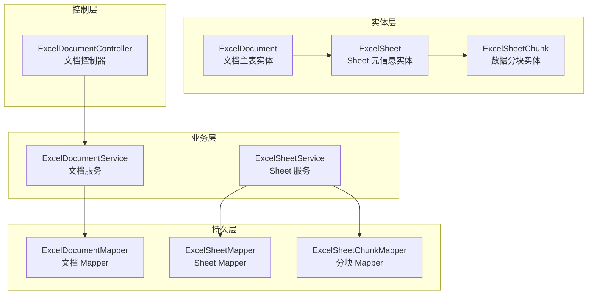
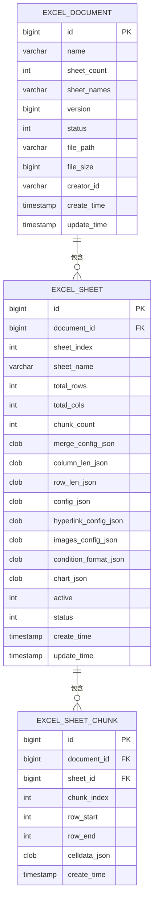
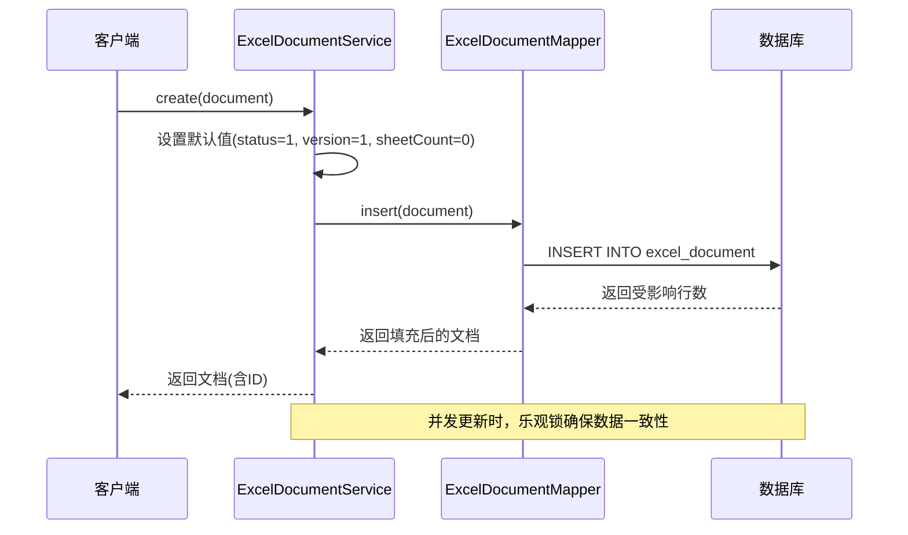
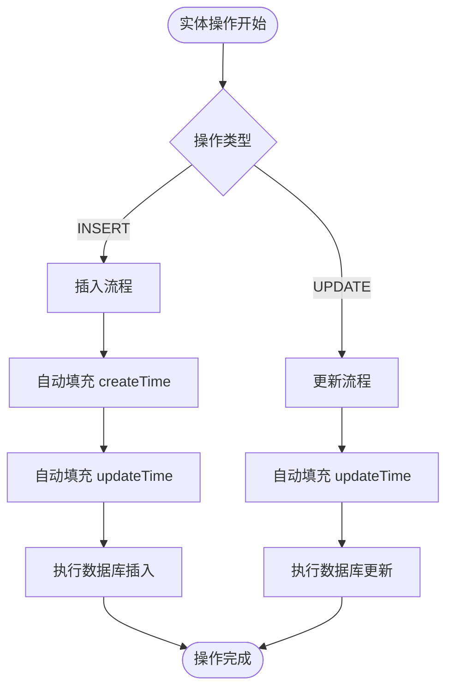
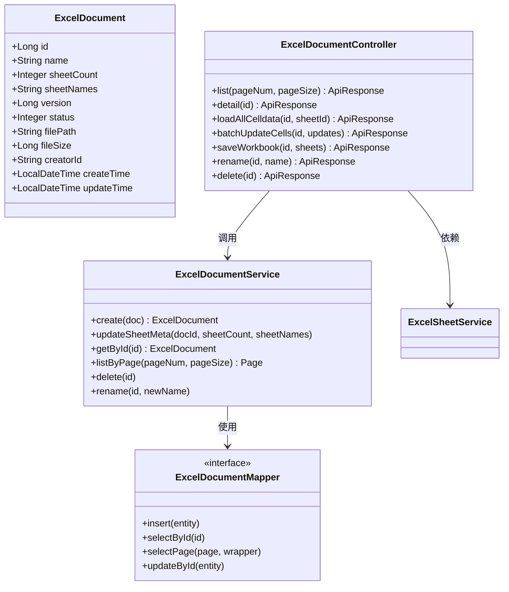

# ExcelDocument 实体

<cite>
**本文引用的文件**
- [ExcelDocument.java](file://dataloom-server/src/main/java/com/demo/excel/entity/ExcelDocument.java)
- [ExcelDocumentMapper.java](file://dataloom-server/src/main/java/com/demo/excel/mapper/ExcelDocumentMapper.java)
- [ExcelDocumentService.java](file://dataloom-server/src/main/java/com/demo/excel/service/ExcelDocumentService.java)
- [ExcelDocumentController.java](file://dataloom-server/src/main/java/com/demo/excel/controller/ExcelDocumentController.java)
- [ExcelSheet.java](file://dataloom-server/src/main/java/com/demo/excel/entity/ExcelSheet.java)
- [ExcelSheetChunk.java](file://dataloom-server/src/main/java/com/demo/excel/entity/ExcelSheetChunk.java)
- [MybatisPlusMetaHandler.java](file://dataloom-server/src/main/java/com/demo/excel/config/MybatisPlusMetaHandler.java)
- [schema.sql](file://dataloom-server/src/main/resources/schema.sql)
</cite>

## 目录
1. [简介](#简介)
2. [项目结构](#项目结构)
3. [核心组件](#核心组件)
4. [架构概览](#架构概览)
5. [详细组件分析](#详细组件分析)
6. [依赖分析](#依赖分析)
7. [性能考虑](#性能考虑)
8. [故障排除指南](#故障排除指南)
9. [结论](#结论)
10. [附录](#附录)

## 简介
ExcelDocument 实体类是 DataLoom 项目中 Excel 文档系统的核心数据模型。该实体采用"文档主表仅存储元数据"的设计理念，专门用于存储 Excel 文档的基本信息而非单元格数据。通过将单元格数据分离到 ExcelSheet 和 ExcelSheetChunk 实体中，系统能够有效处理大规模数据（十万级行数）而不会出现单行存储过大的问题。

该设计的核心优势在于：
- **分层存储架构**：文档元数据、Sheet 元信息、单元格数据分层存储
- **高性能分块机制**：将大表格按行范围切分为 1000 行左右的数据块
- **灵活的并发控制**：通过乐观锁版本号实现并发安全
- **自动化的生命周期管理**：创建和更新时间的自动填充

## 项目结构
DataLoom 项目采用标准的 Spring Boot 分层架构，ExcelDocument 实体位于 entity 包中，配合对应的 Mapper、Service 和 Controller 层实现完整的 CRUD 功能。



**图表来源**
- [ExcelDocument.java:15-54](file://dataloom-server/src/main/java/com/demo/excel/entity/ExcelDocument.java#L15-L54)
- [ExcelSheet.java:14-76](file://dataloom-server/src/main/java/com/demo/excel/entity/ExcelSheet.java#L14-L76)
- [ExcelSheetChunk.java:18-52](file://dataloom-server/src/main/java/com/demo/excel/entity/ExcelSheetChunk.java#L18-L52)

**章节来源**
- [ExcelDocument.java:1-55](file://dataloom-server/src/main/java/com/demo/excel/entity/ExcelDocument.java#L1-L55)
- [ExcelSheet.java:1-77](file://dataloom-server/src/main/java/com/demo/excel/entity/ExcelSheet.java#L1-L77)
- [ExcelSheetChunk.java:1-53](file://dataloom-server/src/main/java/com/demo/excel/entity/ExcelSheetChunk.java#L1-L53)

## 核心组件
ExcelDocument 实体类是整个 Excel 文档系统的核心，它继承了 MyBatis-Plus 的设计思想，通过注解驱动的方式实现数据库映射和自动填充功能。

### 主要特性
- **数据库映射**：通过 @TableName 注解明确映射到 excel_document 表
- **主键策略**：使用自增主键 IdType.AUTO
- **乐观锁支持**：通过 @Version 注解实现并发控制
- **自动填充**：通过 @TableField 注解配置创建和更新时间的自动填充
- **字段约束**：通过数据库层面的约束保证数据完整性

### 设计哲学
该实体体现了"关注点分离"的设计原则：
- 专注于文档元数据的存储和管理
- 将复杂的单元格数据处理委托给专门的实体类
- 通过分层架构实现系统的可扩展性和可维护性

**章节来源**
- [ExcelDocument.java:8-14](file://dataloom-server/src/main/java/com/demo/excel/entity/ExcelDocument.java#L8-L14)
- [ExcelDocument.java:15-54](file://dataloom-server/src/main/java/com/demo/excel/entity/ExcelDocument.java#L15-L54)

## 架构概览
ExcelDocument 实体在整个数据模型中扮演着"文档主表"的角色，与 ExcelSheet 和 ExcelSheetChunk 形成 1:N:N 的层次关系。



**图表来源**
- [schema.sql:8-20](file://dataloom-server/src/main/resources/schema.sql#L8-L20)
- [schema.sql:25-45](file://dataloom-server/src/main/resources/schema.sql#L25-L45)
- [schema.sql:57-66](file://dataloom-server/src/main/resources/schema.sql#L57-L66)

**章节来源**
- [schema.sql:1-124](file://dataloom-server/src/main/resources/schema.sql#L1-L124)

## 详细组件分析

### 字段详解

#### 基础标识字段
- **id**：主键，使用数据库自增策略，确保每个文档的唯一标识
- **name**：文档名称，用于用户界面显示和搜索
- **creatorId**：创建者标识，支持多用户协作场景

#### 元数据统计字段
- **sheetCount**：Sheet 数量统计，反映文档的复杂程度
- **sheetNames**：Sheet 名称列表的 JSON 序列化存储，便于快速检索

#### 状态管理字段
- **status**：文档状态，采用 1=正常、2=回收站、3=已删除 的状态机设计
- **version**：乐观锁版本号，实现并发控制和数据一致性

#### 文件信息字段
- **filePath**：原始文件的本地存储路径，支持文件备份和重新解析
- **fileSize**：文件大小（字节），用于存储空间管理和性能优化

#### 时间戳字段
- **createTime**：创建时间，通过 MyBatis-Plus 自动填充
- **updateTime**：更新时间，支持插入和更新时的自动刷新

### 并发控制机制



**图表来源**
- [ExcelDocumentService.java:31-37](file://dataloom-server/src/main/java/com/demo/excel/service/ExcelDocumentService.java#L31-L37)
- [ExcelDocument.java:32-34](file://dataloom-server/src/main/java/com/demo/excel/entity/ExcelDocument.java#L32-L34)

### 自动填充机制



**图表来源**
- [MybatisPlusMetaHandler.java:22-35](file://dataloom-server/src/main/java/com/demo/excel/config/MybatisPlusMetaHandler.java#L22-L35)
- [ExcelDocument.java:48-52](file://dataloom-server/src/main/java/com/demo/excel/entity/ExcelDocument.java#L48-L52)

**章节来源**
- [ExcelDocumentService.java:31-37](file://dataloom-server/src/main/java/com/demo/excel/service/ExcelDocumentService.java#L31-L37)
- [MybatisPlusMetaHandler.java:16-36](file://dataloom-server/src/main/java/com/demo/excel/config/MybatisPlusMetaHandler.java#L16-L36)

### 数据库映射关系

ExcelDocument 实体通过 MyBatis-Plus 注解与数据库表建立映射关系：

- **@TableName("excel_document")**：明确指定映射到 excel_document 表
- **@TableId(type = IdType.AUTO)**：配置自增主键策略
- **@TableField(fill = FieldFill.INSERT)**：创建时间自动填充
- **@TableField(fill = FieldFill.INSERT_UPDATE)**：更新时间自动填充
- **@Version**：启用乐观锁机制

**章节来源**
- [ExcelDocument.java:15-54](file://dataloom-server/src/main/java/com/demo/excel/entity/ExcelDocument.java#L15-L54)
- [schema.sql:8-20](file://dataloom-server/src/main/resources/schema.sql#L8-L20)

## 依赖分析

### 类关系图



**图表来源**
- [ExcelDocument.java:17-54](file://dataloom-server/src/main/java/com/demo/excel/entity/ExcelDocument.java#L17-L54)
- [ExcelDocumentMapper.java:9](file://dataloom-server/src/main/java/com/demo/excel/mapper/ExcelDocumentMapper.java#L9)
- [ExcelDocumentService.java:20-118](file://dataloom-server/src/main/java/com/demo/excel/service/ExcelDocumentService.java#L20-L118)
- [ExcelDocumentController.java:24-295](file://dataloom-server/src/main/java/com/demo/excel/controller/ExcelDocumentController.java#L24-L295)

### 依赖关系分析

ExcelDocument 实体的依赖关系体现了清晰的分层架构：

1. **实体层依赖**：仅依赖 MyBatis-Plus 注解框架
2. **持久层依赖**：通过 BaseMapper 接口获得数据库操作能力
3. **业务层依赖**：提供完整的 CRUD 业务逻辑
4. **控制层依赖**：暴露 RESTful API 接口

这种设计确保了：
- **低耦合**：各层职责明确，相互独立
- **高内聚**：每层专注于特定的功能领域
- **可测试性**：便于单元测试和集成测试

**章节来源**
- [ExcelDocumentMapper.java:1-11](file://dataloom-server/src/main/java/com/demo/excel/mapper/ExcelDocumentMapper.java#L1-L11)
- [ExcelDocumentService.java:1-119](file://dataloom-server/src/main/java/com/demo/excel/service/ExcelDocumentService.java#L1-L119)
- [ExcelDocumentController.java:1-296](file://dataloom-server/src/main/java/com/demo/excel/controller/ExcelDocumentController.java#L1-L296)

## 性能考虑

### 存储优化策略

ExcelDocument 实体的设计充分考虑了性能优化：

1. **分层存储架构**：文档元数据与单元格数据分离存储
2. **数据分块机制**：每块约 1000 行，单块大小控制在几百 KB 以内
3. **索引优化**：关键字段建立适当的数据库索引
4. **懒加载策略**：默认只加载元数据，需要时再加载具体数据

### 并发性能

- **乐观锁机制**：通过版本号避免悲观锁带来的性能损耗
- **批量操作支持**：提供批量更新接口减少网络往返
- **缓存友好**：合理的数据结构设计便于缓存利用

## 故障排除指南

### 常见问题及解决方案

#### 乐观锁冲突
**问题描述**：多个客户端同时更新同一文档导致冲突
**解决方案**：检查版本号是否发生变化，重新获取最新数据后重试

#### 自动填充失效
**问题描述**：创建时间或更新时间未正确设置
**解决方案**：确认 MyBatis-Plus 元对象处理器已正确配置

#### 数据库连接问题
**问题描述**：CRUD 操作失败
**解决方案**：检查数据库连接配置和表结构是否匹配

**章节来源**
- [ExcelDocumentService.java:86-103](file://dataloom-server/src/main/java/com/demo/excel/service/ExcelDocumentService.java#L86-L103)
- [MybatisPlusMetaHandler.java:16-36](file://dataloom-server/src/main/java/com/demo/excel/config/MybatisPlusMetaHandler.java#L16-L36)

## 结论
ExcelDocument 实体类通过精心设计的分层架构和优化策略，成功解决了大规模 Excel 文档存储的技术挑战。其核心价值体现在：

1. **架构创新**：通过"文档主表仅存储元数据"的设计，实现了系统的可扩展性
2. **性能卓越**：数据分块机制有效处理了十万级数据的存储和访问
3. **并发安全**：乐观锁机制确保了多用户环境下的数据一致性
4. **易于维护**：清晰的分层设计便于系统的长期维护和发展

该实体类为整个 DataLoom 项目的稳定运行奠定了坚实的基础，是现代企业级应用中 Excel 文档处理的最佳实践范例。

## 附录

### 使用示例

#### 创建文档记录
```java
// 创建 ExcelDocument 实例
ExcelDocument doc = new ExcelDocument();
doc.setName("示例文档");
doc.setFilePath("/path/to/file.xlsx");
doc.setFileSize(file.length());
doc.setCreatorId("user001");

// 通过服务层创建
ExcelDocument createdDoc = documentService.create(doc);
```

#### 更新文档元数据
```java
// 更新 Sheet 元信息
documentService.updateSheetMeta(docId, sheetCount, sheetNamesJson);
```

#### 查询文档列表
```java
// 分页查询文档列表
Page<ExcelDocument> page = documentService.listByPage(1, 20);
```

### 最佳实践

1. **合理使用分层架构**：遵循"元数据在主表，数据在分表"的设计原则
2. **注意并发控制**：在高并发场景下充分利用乐观锁机制
3. **优化查询性能**：为常用查询字段建立合适的数据库索引
4. **监控存储使用**：定期检查文件大小和分块数量，避免存储空间不足

**章节来源**
- [ExcelDocumentService.java:31-78](file://dataloom-server/src/main/java/com/demo/excel/service/ExcelDocumentService.java#L31-L78)
- [ExcelDocumentController.java:44-69](file://dataloom-server/src/main/java/com/demo/excel/controller/ExcelDocumentController.java#L44-L69)