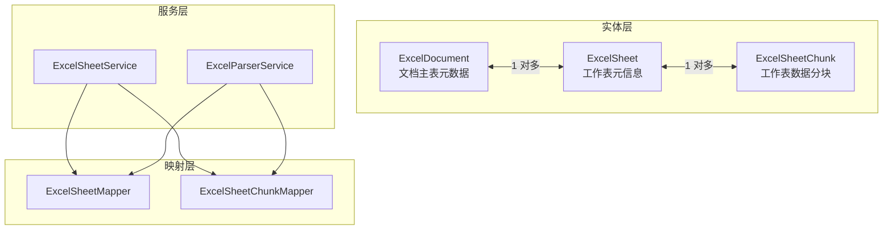
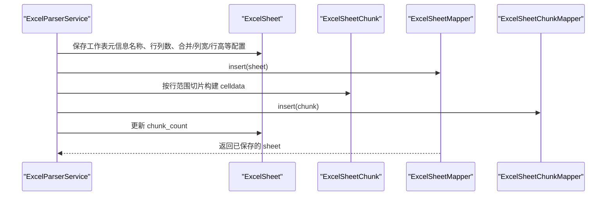
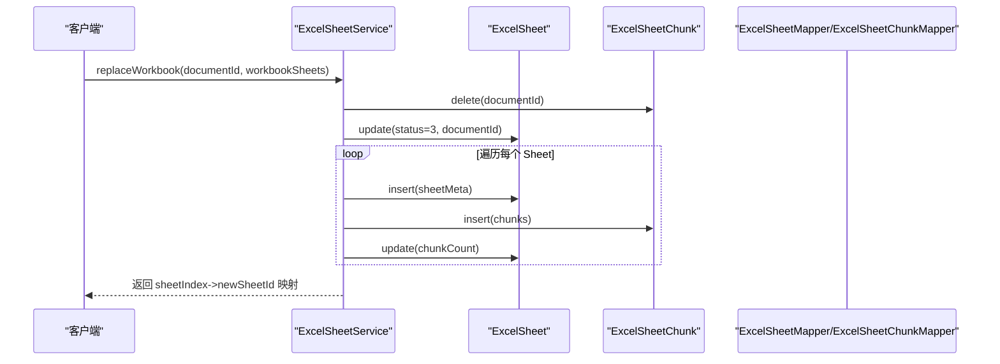
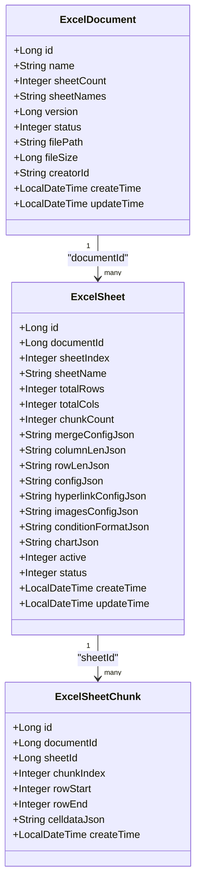

# ExcelSheet 实体

<cite>
**本文引用的文件**
- [ExcelSheet.java](file://dataloom-server/src/main/java/com/demo/excel/entity/ExcelSheet.java)
- [ExcelDocument.java](file://dataloom-server/src/main/java/com/demo/excel/entity/ExcelDocument.java)
- [ExcelSheetChunk.java](file://dataloom-server/src/main/java/com/demo/excel/entity/ExcelSheetChunk.java)
- [ExcelSheetMapper.java](file://dataloom-server/src/main/java/com/demo/excel/mapper/ExcelSheetMapper.java)
- [ExcelSheetChunkMapper.java](file://dataloom-server/src/main/java/com/demo/excel/mapper/ExcelSheetChunkMapper.java)
- [ExcelSheetService.java](file://dataloom-server/src/main/java/com/demo/excel/service/ExcelSheetService.java)
- [ExcelParserService.java](file://dataloom-server/src/main/java/com/demo/excel/service/ExcelParserService.java)
- [schema.sql](file://dataloom-server/src/main/resources/schema.sql)
- [ExcelSheetServiceTest.java](file://dataloom-server/src/test/java/com/demo/excel/service/ExcelSheetServiceTest.java)
</cite>

## 目录
1. [简介](#简介)
2. [项目结构](#项目结构)
3. [核心组件](#核心组件)
4. [架构概览](#架构概览)
5. [详细组件分析](#详细组件分析)
6. [依赖分析](#依赖分析)
7. [性能考量](#性能考量)
8. [故障排查指南](#故障排查指南)
9. [结论](#结论)
10. [附录](#附录)

## 简介
本文件围绕 ExcelSheet 实体类进行系统化文档化，重点阐释其作为“Excel 工作表元信息存储”的设计目标与实现要点。ExcelSheet 与 ExcelDocument 构成“一对多”关系：一个文档可包含多个工作表；同时，ExcelSheet 与 ExcelSheetChunk 之间形成“一对多”的分块存储关系，以应对大规模数据场景下的性能与内存压力。文档将逐项解释实体字段的含义与用途，说明注解配置（如 @TableName、@TableId、字段填充等），并结合服务层与解析器层展示实体在数据流转中的关键作用与优化策略。

## 项目结构
本项目采用分层与按职责划分的组织方式：
- 实体层：ExcelSheet、ExcelDocument、ExcelSheetChunk
- 映射层：ExcelSheetMapper、ExcelSheetChunkMapper
- 服务层：ExcelSheetService、ExcelParserService
- 资源层：schema.sql（数据库建表脚本）

图表来源
- [ExcelSheet.java:14-76](file://dataloom-server/src/main/java/com/demo/excel/entity/ExcelSheet.java#L14-L76)
- [ExcelDocument.java:15-54](file://dataloom-server/src/main/java/com/demo/excel/entity/ExcelDocument.java#L15-L54)
- [ExcelSheetChunk.java:18-52](file://dataloom-server/src/main/java/com/demo/excel/entity/ExcelSheetChunk.java#L18-L52)
- [ExcelSheetMapper.java:11](file://dataloom-server/src/main/java/com/demo/excel/mapper/ExcelSheetMapper.java#L11)
- [ExcelSheetChunkMapper.java:11](file://dataloom-server/src/main/java/com/demo/excel/mapper/ExcelSheetChunkMapper.java#L11)
- [ExcelSheetService.java:34](file://dataloom-server/src/main/java/com/demo/excel/service/ExcelSheetService.java#L34)
- [ExcelParserService.java:39](file://dataloom-server/src/main/java/com/demo/excel/service/ExcelParserService.java#L39)

章节来源
- [ExcelSheet.java:14-76](file://dataloom-server/src/main/java/com/demo/excel/entity/ExcelSheet.java#L14-L76)
- [ExcelDocument.java:15-54](file://dataloom-server/src/main/java/com/demo/excel/entity/ExcelDocument.java#L15-L54)
- [ExcelSheetChunk.java:18-52](file://dataloom-server/src/main/java/com/demo/excel/entity/ExcelSheetChunk.java#L18-L52)
- [ExcelSheetMapper.java:11](file://dataloom-server/src/main/java/com/demo/excel/mapper/ExcelSheetMapper.java#L11)
- [ExcelSheetChunkMapper.java:11](file://dataloom-server/src/main/java/com/demo/excel/mapper/ExcelSheetChunkMapper.java#L11)
- [ExcelSheetService.java:34](file://dataloom-server/src/main/java/com/demo/excel/service/ExcelSheetService.java#L34)
- [ExcelParserService.java:39](file://dataloom-server/src/main/java/com/demo/excel/service/ExcelParserService.java#L39)

## 核心组件
- ExcelSheet：工作表元信息与样式配置的载体，不直接存储单元格数据，而是通过 ExcelSheetChunk 分块存储 celldata。
- ExcelDocument：文档主表，仅存元数据（名称、Sheet 数量、Sheet 名称列表、状态、文件路径与大小等）。
- ExcelSheetChunk：按行范围切片的工作表数据块，承载 Luckysheet 兼容的 celldata JSON 数组。

章节来源
- [ExcelSheet.java:8-13](file://dataloom-server/src/main/java/com/demo/excel/entity/ExcelSheet.java#L8-L13)
- [ExcelDocument.java:8-14](file://dataloom-server/src/main/java/com/demo/excel/entity/ExcelDocument.java#L8-L14)
- [ExcelSheetChunk.java:9-17](file://dataloom-server/src/main/java/com/demo/excel/entity/ExcelSheetChunk.java#L9-L17)

## 架构概览
ExcelSheet 在整体架构中承担“元信息+样式配置”的角色，并与分块存储协同工作，确保大规模数据的高效读写与按需加载。

图表来源
- [ExcelParserService.java:96-133](file://dataloom-server/src/main/java/com/demo/excel/service/ExcelParserService.java#L96-L133)
- [ExcelParserService.java:142-200](file://dataloom-server/src/main/java/com/demo/excel/service/ExcelParserService.java#L142-L200)
- [ExcelSheetMapper.java:11](file://dataloom-server/src/main/java/com/demo/excel/mapper/ExcelSheetMapper.java#L11)
- [ExcelSheetChunkMapper.java:11](file://dataloom-server/src/main/java/com/demo/excel/mapper/ExcelSheetChunkMapper.java#L11)

## 详细组件分析

### ExcelSheet 实体字段详解
- 主键 id：自增主键，唯一标识工作表元信息记录。
- 所属文档 ID documentId：与 ExcelDocument 的外键关联，标识该工作表属于哪个文档。
- 原始下标 sheetIndex：工作表在工作簿中的顺序索引（0 起始）。
- 名称 sheetName：工作表显示名称。
- 总行数 totalRows：包含表头在内的总行数。
- 总列数 totalCols：总列数。
- 分块数量 chunkCount：该工作表被切分为多少个数据块。
- 合并单元格配置 mergeConfigJson：Luckysheet 合并区域配置 JSON。
- 列宽配置 columnLenJson：列宽配置 JSON。
- 行高配置 rowLenJson：行高配置 JSON。
- Luckysheet 完整 config configJson：整合后的配置 JSON（包含 merge、columnlen、rowlen）。
- 超链接 hyperlinks：单元格与超链接映射关系 JSON。
- 图片 images：插入的图片信息（如 Base64）JSON。
- 条件格式 conditionFormatJson：条件格式配置 JSON。
- 图表 chartJson：图表配置 JSON。
- 激活状态 active：1 表示当前活动工作表，0 表示非活动。
- 状态 status：1 正常，3 已删除（软删除）。
- 创建时间 createTime：自动填充。
- 更新时间 updateTime：自动填充。

章节来源
- [ExcelSheet.java:18-76](file://dataloom-server/src/main/java/com/demo/excel/entity/ExcelSheet.java#L18-L76)

### 注解配置说明
- @TableName("excel_sheet")：指定实体对应的数据库表名为 excel_sheet。
- @TableId(type = IdType.AUTO)：主键自增策略。
- @TableField(fill = FieldFill.INSERT)：创建时自动填充 createTime。
- @TableField(fill = FieldFill.INSERT_UPDATE)：创建与更新时自动填充 updateTime。
- 其他字段未标注 @TableId/@TableField，默认按字段名映射到表列。

章节来源
- [ExcelSheet.java:14-16](file://dataloom-server/src/main/java/com/demo/excel/entity/ExcelSheet.java#L14-L16)
- [ExcelSheet.java:70-74](file://dataloom-server/src/main/java/com/demo/excel/entity/ExcelSheet.java#L70-L74)

### 与 ExcelDocument 的关系映射
- 关系性质：ExcelSheet 与 ExcelDocument 为“一对多”关系。一个文档可包含多个工作表。
- 外键约束：ExcelSheet.documentId 引用 ExcelDocument.id。
- 索引建议：在数据库层面为 document_id 添加索引，以提升按文档查询效率。

章节来源
- [ExcelSheet.java:22-23](file://dataloom-server/src/main/java/com/demo/excel/entity/ExcelSheet.java#L22-L23)
- [ExcelDocument.java:19-21](file://dataloom-server/src/main/java/com/demo/excel/entity/ExcelDocument.java#L19-L21)
- [schema.sql:25-45](file://dataloom-server/src/main/resources/schema.sql#L25-L45)

### 与 ExcelSheetChunk 的关联关系
- 关系性质：ExcelSheet 与 ExcelSheetChunk 为“一对多”。一个工作表包含多个数据块。
- 外键约束：ExcelSheetChunk.sheet_id 引用 ExcelSheet.id；同时保留冗余字段 document_id 便于按文档级联删除。
- 分块策略：按行范围切片（默认每块约 1000 行），chunk_index 与 row_start/row_end 明确块边界。
- 一致性：ExcelSheet.chunk_count 与实际写入的块数保持一致。

章节来源
- [ExcelSheetChunk.java:29-30](file://dataloom-server/src/main/java/com/demo/excel/entity/ExcelSheetChunk.java#L29-L30)
- [ExcelSheetChunk.java:32-39](file://dataloom-server/src/main/java/com/demo/excel/entity/ExcelSheetChunk.java#L32-L39)
- [ExcelSheetChunk.java:47](file://dataloom-server/src/main/java/com/demo/excel/entity/ExcelSheetChunk.java#L47)
- [ExcelSheet.java:37-38](file://dataloom-server/src/main/java/com/demo/excel/entity/ExcelSheet.java#L37-L38)
- [schema.sql:57-66](file://dataloom-server/src/main/resources/schema.sql#L57-L66)

### 分块存储架构中的作用与重要性
- 解决单行过大问题：将 celldata JSON 按行范围切分为多个小块，避免单条记录过大导致的读写性能下降与内存溢出。
- 支持按需加载：前端可按需请求特定块，降低网络传输与渲染压力。
- 事务与一致性：解析器与服务层在事务内完成元信息与分块的写入，并同步更新 chunk_count，保证一致性。
- 兼容 Luckysheet：分块数据格式与 Luckysheet celldata 完全兼容，便于前后端协作。

章节来源
- [ExcelSheetChunk.java:9-17](file://dataloom-server/src/main/java/com/demo/excel/entity/ExcelSheetChunk.java#L9-L17)
- [ExcelParserService.java:43-44](file://dataloom-server/src/main/java/com/demo/excel/service/ExcelParserService.java#L43-L44)
- [ExcelParserService.java:142-200](file://dataloom-server/src/main/java/com/demo/excel/service/ExcelParserService.java#L142-L200)
- [ExcelSheetService.java:318-346](file://dataloom-server/src/main/java/com/demo/excel/service/ExcelSheetService.java#L318-L346)

### 使用示例与数据流转过程
- 示例一：解析并保存工作簿
  - 输入：Excel 文件流与已持久化的 ExcelDocument。
  - 流程：解析每个 Sheet → 保存 ExcelSheet 元信息 → 按行范围切片保存 ExcelSheetChunk → 更新 ExcelSheet.chunk_count。
  - 输出：返回各 Sheet 的元信息列表（不含 celldata）。
- 示例二：全量替换工作簿
  - 输入：文档 ID 与新的工作簿 Sheets 列表。
  - 流程：删除旧分块 → 软删除旧 Sheet → 逐 Sheet 重建元信息与分块 → 更新文档 Sheet 元信息。
  - 输出：返回 sheetIndex → 新 SheetId 的映射，便于后续增量保存。
- 示例三：按需加载分块
  - 输入：Sheet ID。
  - 流程：按 chunk_index 升序查询 ExcelSheetChunk 列表，前端可选择性加载所需块。

图表来源
- [ExcelSheetService.java:221-316](file://dataloom-server/src/main/java/com/demo/excel/service/ExcelSheetService.java#L221-L316)
- [ExcelSheetService.java:318-346](file://dataloom-server/src/main/java/com/demo/excel/service/ExcelSheetService.java#L318-L346)
- [ExcelSheetMapper.java:11](file://dataloom-server/src/main/java/com/demo/excel/mapper/ExcelSheetMapper.java#L11)
- [ExcelSheetChunkMapper.java:11](file://dataloom-server/src/main/java/com/demo/excel/mapper/ExcelSheetChunkMapper.java#L11)

章节来源
- [ExcelSheetService.java:46-72](file://dataloom-server/src/main/java/com/demo/excel/service/ExcelSheetService.java#L46-L72)
- [ExcelSheetService.java:221-316](file://dataloom-server/src/main/java/com/demo/excel/service/ExcelSheetService.java#L221-L316)
- [ExcelSheetService.java:318-346](file://dataloom-server/src/main/java/com/demo/excel/service/ExcelSheetService.java#L318-L346)

### 字段与样式配置的落地
- 合并单元格：通过 mergeConfigJson 存储 Luckysheet merge 格式，便于前端渲染与编辑。
- 列宽/行高：columnLenJson 与 rowLenJson 分别存储列宽与行高的 JSON 配置。
- Luckysheet 完整配置：configJson 整合 merge、columnlen、rowlen，便于一次性读取。
- 超链接/图片/条件格式/图表：分别以 JSON 存储，便于前端渲染与交互。

章节来源
- [ExcelSheet.java:40-62](file://dataloom-server/src/main/java/com/demo/excel/entity/ExcelSheet.java#L40-L62)
- [ExcelParserService.java:299-340](file://dataloom-server/src/main/java/com/demo/excel/service/ExcelParserService.java#L299-L340)

## 依赖分析
- 实体间依赖
  - ExcelSheet 依赖 ExcelDocument（外键 documentId）。
  - ExcelSheetChunk 依赖 ExcelSheet（外键 sheet_id），同时冗余保存 document_id。
- 映射层依赖
  - ExcelSheetMapper 与 ExcelSheetChunkMapper 继承 MyBatis-Plus 基础 CRUD 接口。
- 服务层依赖
  - ExcelSheetService 依赖 ExcelSheetMapper、ExcelSheetChunkMapper、ExcelDocumentService。
  - ExcelParserService 依赖 ExcelSheetMapper、ExcelSheetChunkMapper，负责解析与分块写入。
- 数据库依赖
  - schema.sql 定义了三张表及其索引与列定义，支撑实体与分块存储。

图表来源
- [ExcelDocument.java:19-52](file://dataloom-server/src/main/java/com/demo/excel/entity/ExcelDocument.java#L19-L52)
- [ExcelSheet.java:19-74](file://dataloom-server/src/main/java/com/demo/excel/entity/ExcelSheet.java#L19-L74)
- [ExcelSheetChunk.java:23-50](file://dataloom-server/src/main/java/com/demo/excel/entity/ExcelSheetChunk.java#L23-L50)

章节来源
- [ExcelSheet.java:19-74](file://dataloom-server/src/main/java/com/demo/excel/entity/ExcelSheet.java#L19-L74)
- [ExcelSheetChunk.java:23-50](file://dataloom-server/src/main/java/com/demo/excel/entity/ExcelSheetChunk.java#L23-L50)
- [ExcelDocument.java:19-52](file://dataloom-server/src/main/java/com/demo/excel/entity/ExcelDocument.java#L19-L52)

## 性能考量
- 分块大小：默认每块约 1000 行，单块 JSON 通常在数百 KB 以内，兼顾吞吐与内存占用。
- 索引设计：建议为 excel_sheet(document_id)、excel_sheet_chunk(sheet_id)、excel_sheet_chunk(document_id)、excel_sheet_chunk(sheet_id, chunk_index) 建立索引，以优化查询与删除性能。
- 批量写入：服务层在批量更新单元格时按 (sheetId_chunkIndex) 分组，减少数据库 I/O。
- 按需加载：前端仅加载需要的块，避免一次性加载全部数据。
- 软删除：删除文档时软删除 Sheet，物理删除 Chunk，平衡一致性与性能。

章节来源
- [ExcelParserService.java:43-44](file://dataloom-server/src/main/java/com/demo/excel/service/ExcelParserService.java#L43-L44)
- [ExcelSheetService.java:103-212](file://dataloom-server/src/main/java/com/demo/excel/service/ExcelSheetService.java#L103-L212)
- [schema.sql:108-123](file://dataloom-server/src/main/resources/schema.sql#L108-L123)

## 故障排查指南
- 现象：分块边界不正确或空行导致块错位
  - 原因：chunkIndex 由行号直接决定，确保解析与更新时使用相同的 r / CHUNK_SIZE 规则。
  - 处理：检查 ExcelParserService 与 ExcelSheetService 的分块定位逻辑是否一致。
- 现象：查询不到分块或分块缺失
  - 原因：chunkCount 未正确更新或索引缺失。
  - 处理：确认写入完成后更新了 ExcelSheet.chunk_count，并检查索引是否存在。
- 现象：删除文档后仍有残留数据
  - 原因：未执行按文档删除的逻辑。
  - 处理：调用 ExcelSheetService.deleteByDocumentId，确保软删除 Sheet 并物理删除 Chunk。

章节来源
- [ExcelParserService.java:135-200](file://dataloom-server/src/main/java/com/demo/excel/service/ExcelParserService.java#L135-L200)
- [ExcelSheetService.java:79-91](file://dataloom-server/src/main/java/com/demo/excel/service/ExcelSheetService.java#L79-L91)
- [ExcelSheetService.java:221-316](file://dataloom-server/src/main/java/com/demo/excel/service/ExcelSheetService.java#L221-L316)

## 结论
ExcelSheet 实体通过“元信息+样式配置”与“分块存储”的组合，有效解决了大规模 Excel 数据的存储与访问难题。它与 ExcelDocument 的“一对多”关系清晰，与 ExcelSheetChunk 的“一对多”分块关系紧密衔接，配合服务层的批处理与按需加载策略，在性能与可维护性之间取得良好平衡。通过合理的索引与事务控制，系统能够在高并发与大数据量场景下稳定运行。

## 附录
- 数据库建表脚本参考：schema.sql
- 单元测试参考：ExcelSheetServiceTest（验证全量替换流程与分块写入行为）

章节来源
- [schema.sql:1-124](file://dataloom-server/src/main/resources/schema.sql#L1-L124)
- [ExcelSheetServiceTest.java:44-107](file://dataloom-server/src/test/java/com/demo/excel/service/ExcelSheetServiceTest.java#L44-L107)