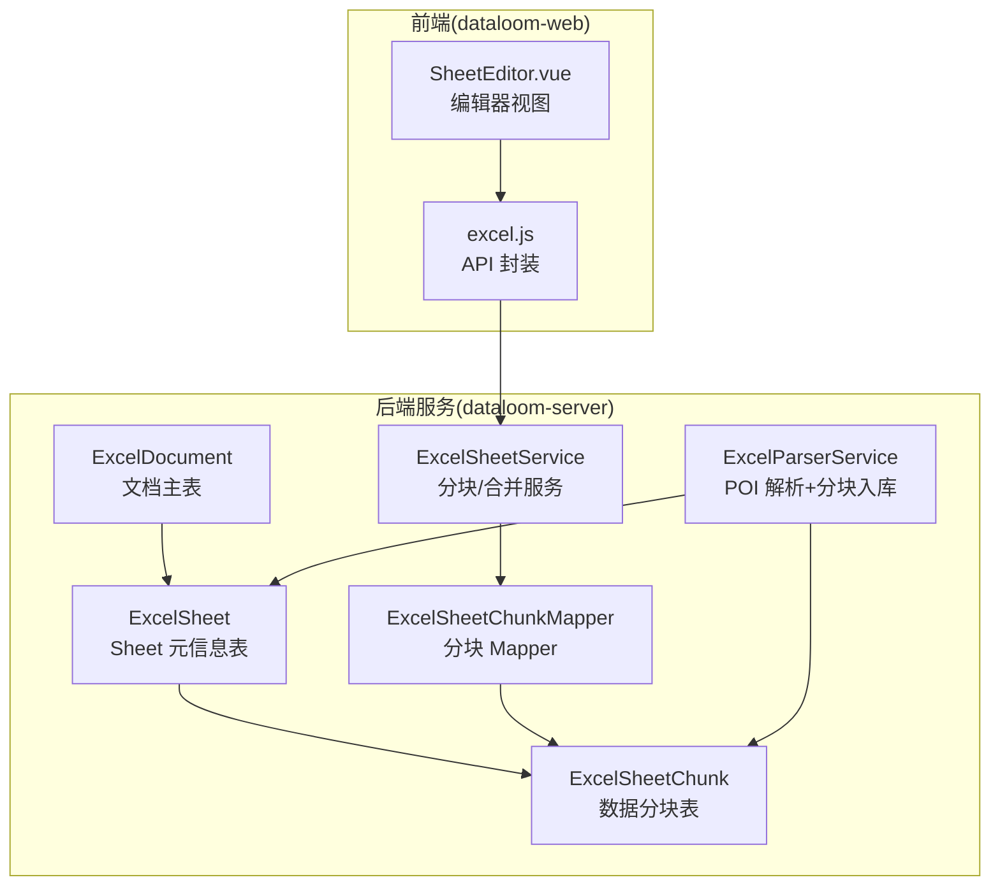
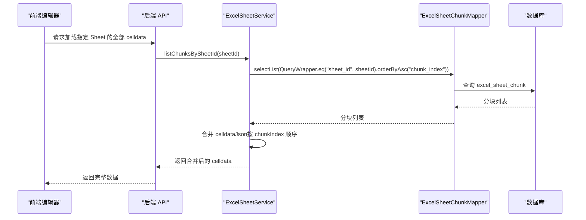
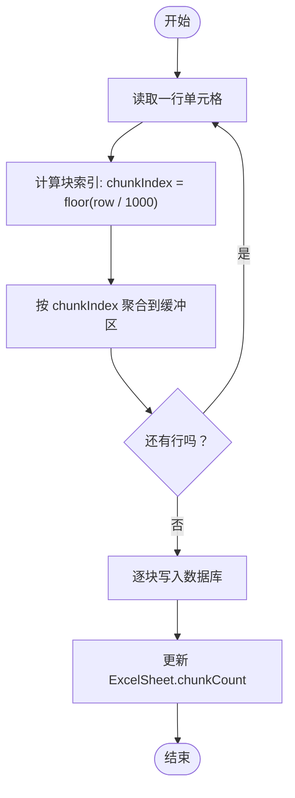
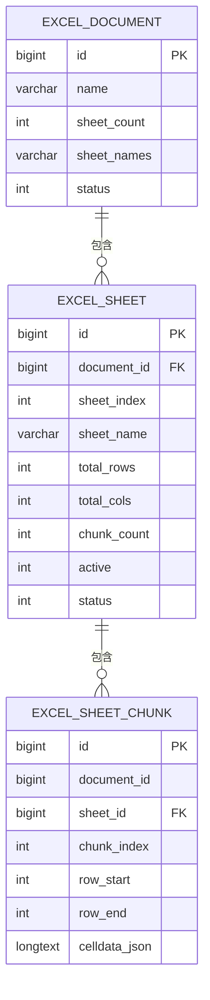
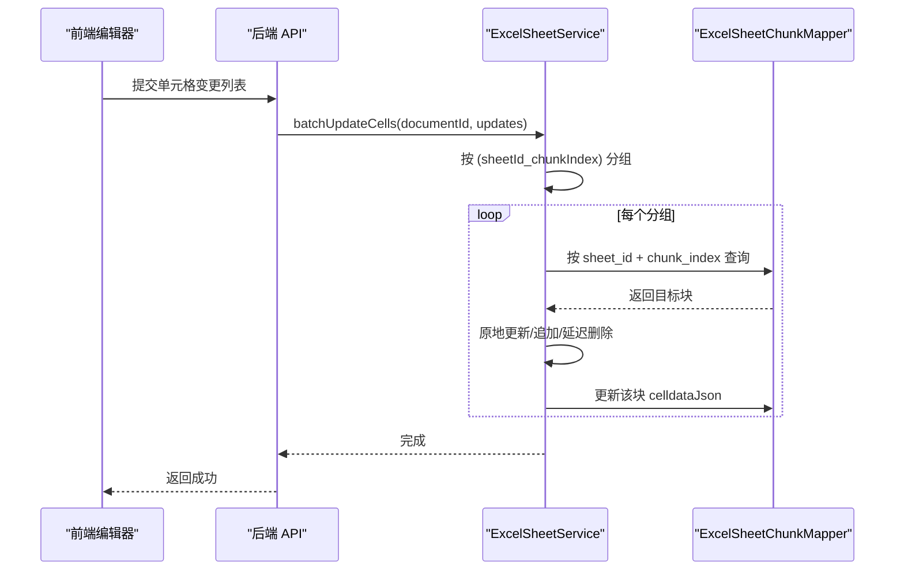
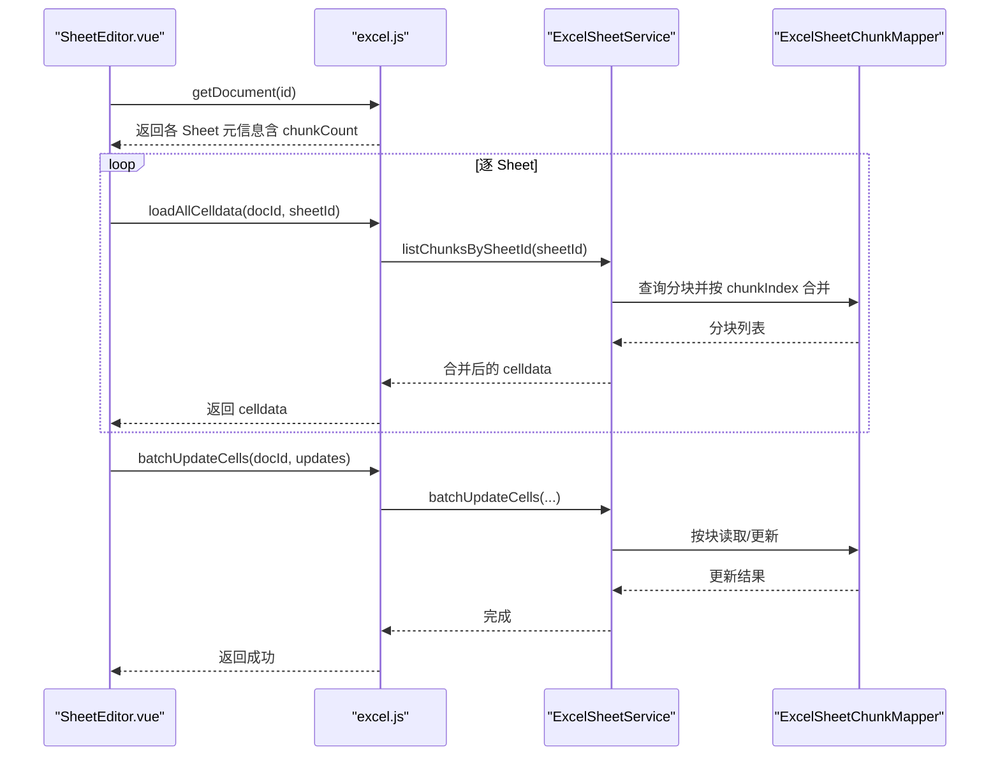
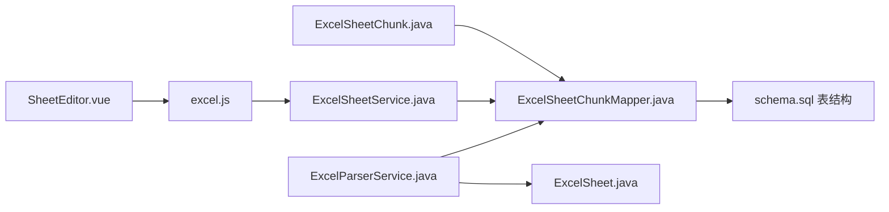

# ExcelSheetChunk 实体

<cite>
**本文引用的文件**
- [ExcelSheetChunk.java](file://dataloom-server/src/main/java/com/demo/excel/entity/ExcelSheetChunk.java)
- [ExcelSheet.java](file://dataloom-server/src/main/java/com/demo/excel/entity/ExcelSheet.java)
- [ExcelSheetChunkMapper.java](file://dataloom-server/src/main/java/com/demo/excel/mapper/ExcelSheetChunkMapper.java)
- [ExcelSheetService.java](file://dataloom-server/src/main/java/com/demo/excel/service/ExcelSheetService.java)
- [ExcelParserService.java](file://dataloom-server/src/main/java/com/demo/excel/service/ExcelParserService.java)
- [schema.sql](file://dataloom-server/src/main/resources/schema.sql)
- [SheetEditor.vue](file://dataloom-web/src/views/SheetEditor.vue)
- [excel.js](file://dataloom-web/src/api/excel.js)
</cite>

## 目录
1. [简介](#简介)
2. [项目结构](#项目结构)
3. [核心组件](#核心组件)
4. [架构概览](#架构概览)
5. [详细组件分析](#详细组件分析)
6. [依赖分析](#依赖分析)
7. [性能考量](#性能考量)
8. [故障排查指南](#故障排查指南)
9. [结论](#结论)
10. [附录](#附录)

## 简介
本文件围绕 ExcelSheetChunk 实体类进行系统化技术文档编写，重点阐释其在 Excel 数据分块存储中的核心作用与设计原理。文档将从实体字段语义、分块策略（1000 行/块）、与 ExcelSheet 的关系映射、数据分片与合并机制、大数据处理性能优势与内存优化、查询优化策略，以及与前端编辑器的数据交互方式等方面展开，帮助读者全面理解该实体的设计思想与工程实践。

## 项目结构
本项目采用前后端分离架构，后端基于 Spring Boot + MyBatis-Plus，前端基于 Vue 3 + Element Plus + Luckysheet。ExcelSheetChunk 位于后端 Java 服务模块中，负责承载单元格数据的分块存储；ExcelSheet 作为元信息载体，二者通过多对多关系（文档 → Sheet → Chunk）协同工作。

**图表来源**
- [ExcelSheetChunk.java:18-52](file://dataloom-server/src/main/java/com/demo/excel/entity/ExcelSheetChunk.java#L18-L52)
- [ExcelSheet.java:14-76](file://dataloom-server/src/main/java/com/demo/excel/entity/ExcelSheet.java#L14-L76)
- [ExcelSheetChunkMapper.java:11](file://dataloom-server/src/main/java/com/demo/excel/mapper/ExcelSheetChunkMapper.java#L11)
- [ExcelSheetService.java:33-212](file://dataloom-server/src/main/java/com/demo/excel/service/ExcelSheetService.java#L33-L212)
- [ExcelParserService.java:39-200](file://dataloom-server/src/main/java/com/demo/excel/service/ExcelParserService.java#L39-L200)
- [SheetEditor.vue:134-234](file://dataloom-web/src/views/SheetEditor.vue#L134-L234)
- [excel.js:47-64](file://dataloom-web/src/api/excel.js#L47-L64)

**章节来源**
- [ExcelSheetChunk.java:18-52](file://dataloom-server/src/main/java/com/demo/excel/entity/ExcelSheetChunk.java#L18-L52)
- [ExcelSheet.java:14-76](file://dataloom-server/src/main/java/com/demo/excel/entity/ExcelSheet.java#L14-L76)
- [ExcelSheetChunkMapper.java:11](file://dataloom-server/src/main/java/com/demo/excel/mapper/ExcelSheetChunkMapper.java#L11)
- [ExcelSheetService.java:33-212](file://dataloom-server/src/main/java/com/demo/excel/service/ExcelSheetService.java#L33-L212)
- [ExcelParserService.java:39-200](file://dataloom-server/src/main/java/com/demo/excel/service/ExcelParserService.java#L39-L200)
- [schema.sql:57-66](file://dataloom-server/src/main/resources/schema.sql#L57-L66)
- [SheetEditor.vue:134-234](file://dataloom-web/src/views/SheetEditor.vue#L134-L234)
- [excel.js:47-64](file://dataloom-web/src/api/excel.js#L47-L64)

## 核心组件
- ExcelSheetChunk：单元格数据分块实体，承载 Luckysheet 格式的 celldata JSON 数组，按行范围切片存储，便于按需加载与增量更新。
- ExcelSheet：Sheet 元信息实体，记录总行数、总列数、分块数量等，不直接存储单元格数据。
- ExcelSheetChunkMapper：MyBatis-Plus 基础 Mapper，提供分块 CRUD 能力。
- ExcelSheetService：分块查询、批量增量更新、全量替换工作簿等业务逻辑。
- ExcelParserService：Apache POI 流式解析 Excel，按 1000 行/块策略写入分块表，并同步更新 ExcelSheet 的 chunkCount。

**章节来源**
- [ExcelSheetChunk.java:18-52](file://dataloom-server/src/main/java/com/demo/excel/entity/ExcelSheetChunk.java#L18-L52)
- [ExcelSheet.java:14-76](file://dataloom-server/src/main/java/com/demo/excel/entity/ExcelSheet.java#L14-L76)
- [ExcelSheetChunkMapper.java:11](file://dataloom-server/src/main/java/com/demo/excel/mapper/ExcelSheetChunkMapper.java#L11)
- [ExcelSheetService.java:33-212](file://dataloom-server/src/main/java/com/demo/excel/service/ExcelSheetService.java#L33-L212)
- [ExcelParserService.java:39-200](file://dataloom-server/src/main/java/com/demo/excel/service/ExcelParserService.java#L39-L200)

## 架构概览
ExcelSheetChunk 的引入解决了“单行 CLOB/TEXT 存储百万级单元格”的性能瓶颈。通过 1000 行/块的分片策略，将原本数十 MB 的单条记录拆分为数百 KB 的小块，显著降低读写延迟、HTTP 响应体积与内存占用。前端编辑器按需加载分块，实现滚动加载与快速响应。

**图表来源**
- [ExcelSheetService.java:67-72](file://dataloom-server/src/main/java/com/demo/excel/service/ExcelSheetService.java#L67-L72)
- [ExcelSheetChunkMapper.java:11](file://dataloom-server/src/main/java/com/demo/excel/mapper/ExcelSheetChunkMapper.java#L11)
- [schema.sql:111-123](file://dataloom-server/src/main/resources/schema.sql#L111-L123)
- [excel.js:47-50](file://dataloom-web/src/api/excel.js#L47-L50)
- [SheetEditor.vue:216-234](file://dataloom-web/src/views/SheetEditor.vue#L216-L234)

## 详细组件分析

### ExcelSheetChunk 实体字段详解
- id：自增主键，唯一标识每一块数据。
- documentId：所属文档 ID（冗余字段），便于按文档删除时快速清理。
- sheetId：所属 Sheet ID，建立与 ExcelSheet 的关联。
- chunkIndex：块序号（0 起始），与行号直接映射，确保分块边界稳定。
- rowStart：该块包含的起始行号（含，0 起始）。
- rowEnd：该块包含的结束行号（含，0 起始）。
- celldataJson：该块的 Luckysheet celldata JSON 数组，格式与前端兼容。
- createTime：自动填充创建时间。

上述字段共同构成“按行范围切片”的分块模型，确保分块定位与合并的确定性与高效性。

**章节来源**
- [ExcelSheetChunk.java:22-52](file://dataloom-server/src/main/java/com/demo/excel/entity/ExcelSheetChunk.java#L22-L52)

### 分块策略与实现原理
- 分块大小：固定为 1000 行/块，来源于解析与更新服务中的常量定义。
- 分块定位：chunkIndex = row / 1000，行号直接决定块归属，避免空行导致的边界偏移。
- 写入策略：解析阶段按行扫描，按 chunkIndex 聚合后批量写入；更新阶段按 (sheetId_chunkIndex) 分组，逐块事务写入。
- 合并策略：按 chunkIndex 升序拼接 celldataJson，形成完整 Sheet 数据。

**图表来源**
- [ExcelParserService.java:142-200](file://dataloom-server/src/main/java/com/demo/excel/service/ExcelParserService.java#L142-L200)
- [ExcelSheetService.java:103-212](file://dataloom-server/src/main/java/com/demo/excel/service/ExcelSheetService.java#L103-L212)

**章节来源**
- [ExcelParserService.java:44](file://dataloom-server/src/main/java/com/demo/excel/service/ExcelParserService.java#L44)
- [ExcelParserService.java:142-200](file://dataloom-server/src/main/java/com/demo/excel/service/ExcelParserService.java#L142-L200)
- [ExcelSheetService.java:103-212](file://dataloom-server/src/main/java/com/demo/excel/service/ExcelSheetService.java#L103-L212)

### 与 ExcelSheet 的关系映射
- 关系描述：ExcelDocument → ExcelSheet → ExcelSheetChunk（1:N:N）。每个文档包含多个 Sheet，每个 Sheet 包含多个分块。
- 元信息与数据分离：ExcelSheet 存放合并单元格、列宽、行高、配置等小型 JSON，不参与分块；单元格数据集中在 ExcelSheetChunk。
- 索引与约束：分块表包含 sheet_id、document_id、(sheet_id, chunk_index) 等索引，支撑按需加载与快速定位。

**图表来源**
- [schema.sql:8-45](file://dataloom-server/src/main/resources/schema.sql#L8-L45)
- [schema.sql:57-66](file://dataloom-server/src/main/resources/schema.sql#L57-L66)

**章节来源**
- [ExcelSheetChunk.java:16](file://dataloom-server/src/main/java/com/demo/excel/entity/ExcelSheetChunk.java#L16)
- [ExcelSheet.java:14-76](file://dataloom-server/src/main/java/com/demo/excel/entity/ExcelSheet.java#L14-L76)
- [schema.sql:57-66](file://dataloom-server/src/main/resources/schema.sql#L57-L66)

### 数据分片与合并机制
- 分片：解析阶段按 1000 行/块聚合并写入；更新阶段按 (sheetId_chunkIndex) 分组，逐块读取/更新。
- 合并：前端请求加载时，后端按 chunkIndex 升序拼接 celldataJson，返回完整数据。
- 增量更新：前端仅提交变更单元格，后端按块定位，原地更新或追加/删除，避免全量替换。

**图表来源**
- [ExcelSheetService.java:103-212](file://dataloom-server/src/main/java/com/demo/excel/service/ExcelSheetService.java#L103-L212)
- [ExcelSheetChunkMapper.java:11](file://dataloom-server/src/main/java/com/demo/excel/mapper/ExcelSheetChunkMapper.java#L11)

**章节来源**
- [ExcelSheetService.java:103-212](file://dataloom-server/src/main/java/com/demo/excel/service/ExcelSheetService.java#L103-L212)

### 大数据处理的性能优势与内存优化
- I/O 优化：单块约 1000 行，JSON 控制在数百 KB，远小于单条 CLOB/TEXT 的数十 MB，显著降低数据库 I/O 压力。
- 内存优化：前端按需加载分块，避免一次性加载百万级单元格导致内存溢出。
- 并发与事务：按块分组更新，减少锁竞争与回滚成本；全量替换时先清空分块再重建，保证一致性。
- 索引与查询：分块表具备按 sheet_id、document_id、(sheet_id, chunk_index) 的索引，支撑高效查询与分页加载。

**章节来源**
- [ExcelParserService.java:44](file://dataloom-server/src/main/java/com/demo/excel/service/ExcelParserService.java#L44)
- [ExcelSheetService.java:103-212](file://dataloom-server/src/main/java/com/demo/excel/service/ExcelSheetService.java#L103-L212)
- [schema.sql:111-123](file://dataloom-server/src/main/resources/schema.sql#L111-L123)

### 查询优化策略
- 按需加载：前端展示时仅请求当前可视区域或滚动区域的分块，避免全量加载。
- 索引利用：查询分块时使用 sheet_id + chunk_index 排序，命中复合索引，提升合并效率。
- 缓存与去重：对相同分块的请求进行缓存，避免重复 I/O；对空块进行短路处理。
- 批量更新：按块分组减少数据库往返次数，提升吞吐。

**章节来源**
- [ExcelSheetService.java:67-72](file://dataloom-server/src/main/java/com/demo/excel/service/ExcelSheetService.java#L67-L72)
- [ExcelSheetService.java:103-212](file://dataloom-server/src/main/java/com/demo/excel/service/ExcelSheetService.java#L103-L212)
- [schema.sql:111-123](file://dataloom-server/src/main/resources/schema.sql#L111-L123)

### 与前端编辑器的数据交互
- 文档加载：前端获取文档元信息后，逐 Sheet 请求加载 celldata，后端按 chunkIndex 合并返回。
- 单元格变更：前端检测到用户编辑，收集变更单元格，按 (sheetId,r,c,v) 形式提交，后端按块定位更新。
- 全量保存：当结构/图片/图表/超链接/条件格式发生变更时，前端发起全量保存，后端替换工作簿并重建分块。
- 进度反馈：前端显示加载进度（已加载分块/总分块），提升用户体验。

**图表来源**
- [SheetEditor.vue:134-234](file://dataloom-web/src/views/SheetEditor.vue#L134-L234)
- [excel.js:47-64](file://dataloom-web/src/api/excel.js#L47-L64)
- [ExcelSheetService.java:67-72](file://dataloom-server/src/main/java/com/demo/excel/service/ExcelSheetService.java#L67-L72)
- [ExcelSheetService.java:103-212](file://dataloom-server/src/main/java/com/demo/excel/service/ExcelSheetService.java#L103-L212)

**章节来源**
- [SheetEditor.vue:134-234](file://dataloom-web/src/views/SheetEditor.vue#L134-L234)
- [excel.js:47-64](file://dataloom-web/src/api/excel.js#L47-L64)
- [ExcelSheetService.java:67-72](file://dataloom-server/src/main/java/com/demo/excel/service/ExcelSheetService.java#L67-L72)
- [ExcelSheetService.java:103-212](file://dataloom-server/src/main/java/com/demo/excel/service/ExcelSheetService.java#L103-L212)

## 依赖分析
- 实体与 Mapper：ExcelSheetChunk 通过 MyBatis-Plus 注解映射到 excel_sheet_chunk 表，Mapper 提供基础 CRUD。
- 服务层耦合：ExcelSheetService 依赖 ExcelSheetChunkMapper 进行分块查询与更新，同时协调 ExcelSheet 的元信息维护。
- 解析器耦合：ExcelParserService 在解析阶段写入 ExcelSheetChunk，并更新 ExcelSheet 的 chunkCount。
- 前端依赖：SheetEditor.vue 通过 excel.js 发起加载与保存请求，依赖后端提供的分块查询与批量更新接口。

**图表来源**
- [ExcelSheetChunk.java:18-52](file://dataloom-server/src/main/java/com/demo/excel/entity/ExcelSheetChunk.java#L18-L52)
- [ExcelSheetChunkMapper.java:11](file://dataloom-server/src/main/java/com/demo/excel/mapper/ExcelSheetChunkMapper.java#L11)
- [schema.sql:57-66](file://dataloom-server/src/main/resources/schema.sql#L57-L66)
- [ExcelSheetService.java:33-212](file://dataloom-server/src/main/java/com/demo/excel/service/ExcelSheetService.java#L33-L212)
- [ExcelParserService.java:39-200](file://dataloom-server/src/main/java/com/demo/excel/service/ExcelParserService.java#L39-L200)
- [SheetEditor.vue:134-234](file://dataloom-web/src/views/SheetEditor.vue#L134-L234)
- [excel.js:47-64](file://dataloom-web/src/api/excel.js#L47-L64)

**章节来源**
- [ExcelSheetChunk.java:18-52](file://dataloom-server/src/main/java/com/demo/excel/entity/ExcelSheetChunk.java#L18-L52)
- [ExcelSheetChunkMapper.java:11](file://dataloom-server/src/main/java/com/demo/excel/mapper/ExcelSheetChunkMapper.java#L11)
- [schema.sql:57-66](file://dataloom-server/src/main/resources/schema.sql#L57-L66)
- [ExcelSheetService.java:33-212](file://dataloom-server/src/main/java/com/demo/excel/service/ExcelSheetService.java#L33-L212)
- [ExcelParserService.java:39-200](file://dataloom-server/src/main/java/com/demo/excel/service/ExcelParserService.java#L39-L200)
- [SheetEditor.vue:134-234](file://dataloom-web/src/views/SheetEditor.vue#L134-L234)
- [excel.js:47-64](file://dataloom-web/src/api/excel.js#L47-L64)

## 性能考量
- 分块大小权衡：1000 行/块在 I/O 与内存之间取得平衡，既避免单条记录过大，又减少分块数量带来的查询开销。
- 索引设计：(sheet_id, chunk_index) 复合索引确保按块顺序访问与合并高效。
- 事务与批处理：批量更新按块分组，减少锁粒度与回滚成本。
- 前端懒加载：仅加载可视区域分块，结合进度提示，改善首屏与滚动体验。

[本节为通用性能讨论，不直接分析具体文件]

## 故障排查指南
- 分块缺失：若 chunkCount 与实际分块数量不符，检查解析阶段是否正确写入分块并更新 chunkCount。
- 合并异常：确认分块查询按 chunkIndex 升序排列，避免顺序错误导致数据错位。
- 增量更新失败：核对 (sheetId_chunkIndex) 分组是否正确，以及 celldataJson 的 JSON 结构是否符合 Luckysheet 格式。
- 前端加载卡顿：检查分块索引与查询条件，确保命中索引；必要时增加前端缓存与分页加载。

**章节来源**
- [ExcelParserService.java:192-198](file://dataloom-server/src/main/java/com/demo/excel/service/ExcelParserService.java#L192-L198)
- [ExcelSheetService.java:67-72](file://dataloom-server/src/main/java/com/demo/excel/service/ExcelSheetService.java#L67-L72)
- [ExcelSheetService.java:103-212](file://dataloom-server/src/main/java/com/demo/excel/service/ExcelSheetService.java#L103-L212)
- [schema.sql:111-123](file://dataloom-server/src/main/resources/schema.sql#L111-L123)

## 结论
ExcelSheetChunk 通过“1000 行/块”的分片策略，将海量单元格数据以可控体积存储于数据库，并配合高效的查询与合并机制，实现了在线 Excel 编辑器在大数据场景下的高性能与低内存占用。其与 ExcelSheet 的职责分离、与前端的按需交互，共同构成了稳定可靠的分块存储体系。

[本节为总结性内容，不直接分析具体文件]

## 附录
- 分块存储数据结构示例（示意）
  - 块 0：rowStart=0, rowEnd=999, celldataJson=[{"r":0,"c":0,"v":{...}},...]
  - 块 1：rowStart=1000, rowEnd=1999, celldataJson=[{"r":1000,"c":0,"v":{...}},...]
  - ...
- 查询优化建议
  - 使用 (sheet_id, chunk_index) 复合索引进行分块查询与合并。
  - 前端按可视区域分页加载，避免一次性请求过多分块。
  - 对空分块进行短路处理，减少无效 I/O。

[本节为概念性补充，不直接分析具体文件]