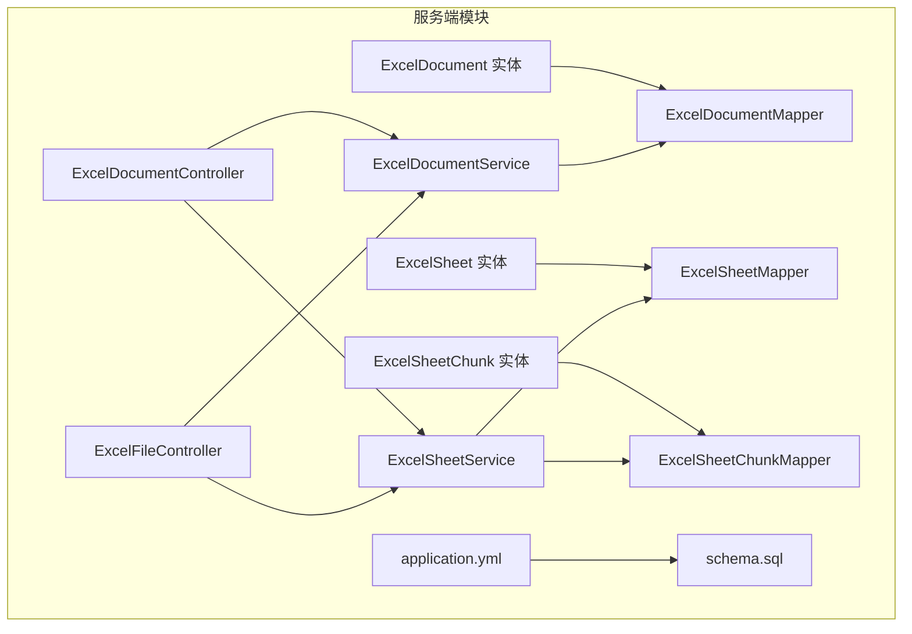
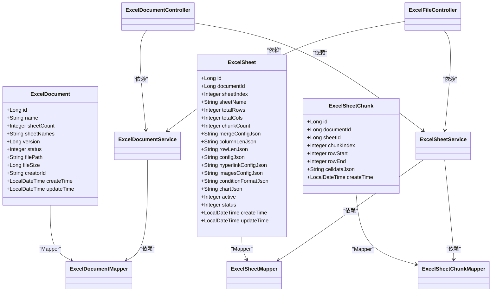
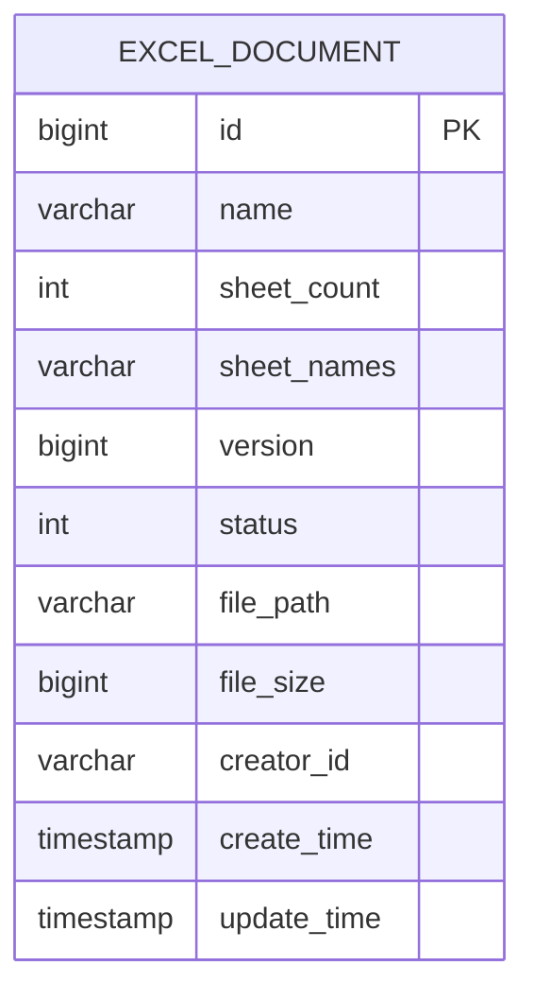
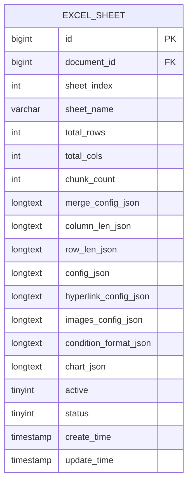
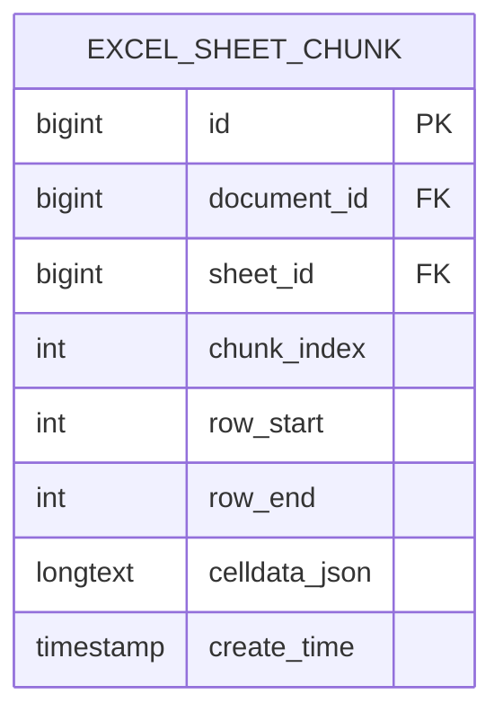
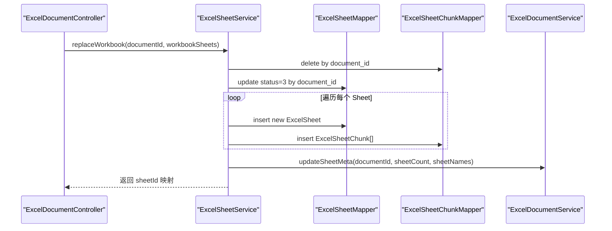
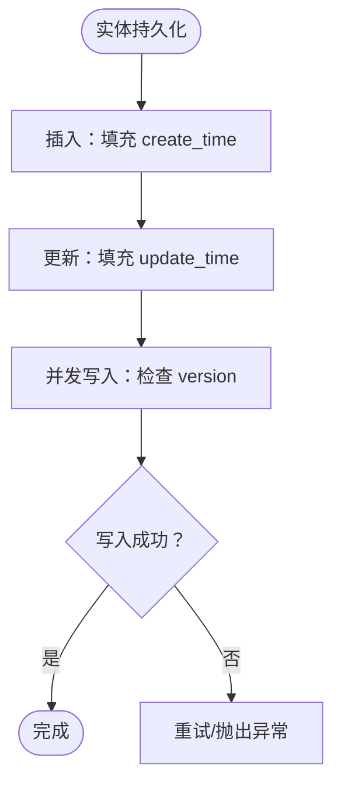
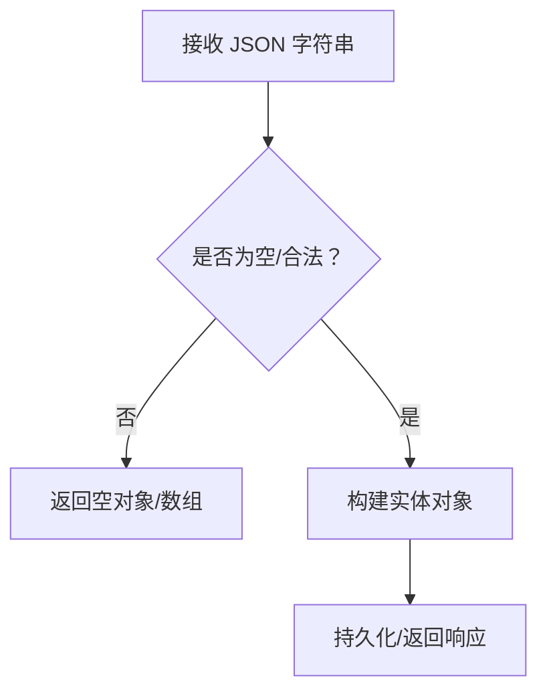
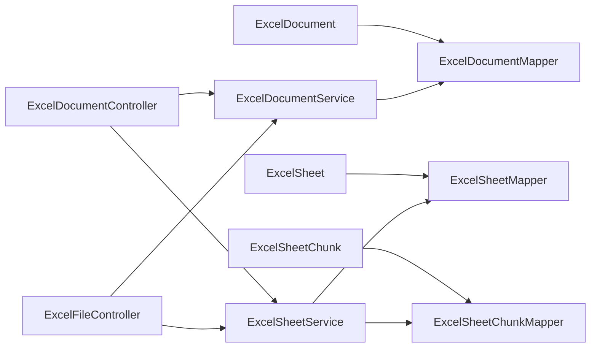

# 实体模型（Entity）

<cite>
**本文引用的文件**
- [ExcelDocument.java](file://dataloom-server/src/main/java/com/demo/excel/entity/ExcelDocument.java)
- [ExcelSheet.java](file://dataloom-server/src/main/java/com/demo/excel/entity/ExcelSheet.java)
- [ExcelSheetChunk.java](file://dataloom-server/src/main/java/com/demo/excel/entity/ExcelSheetChunk.java)
- [ExcelDocumentMapper.java](file://dataloom-server/src/main/java/com/demo/excel/mapper/ExcelDocumentMapper.java)
- [ExcelSheetMapper.java](file://dataloom-server/src/main/java/com/demo/excel/mapper/ExcelSheetMapper.java)
- [ExcelSheetChunkMapper.java](file://dataloom-server/src/main/java/com/demo/excel/mapper/ExcelSheetChunkMapper.java)
- [ExcelDocumentService.java](file://dataloom-server/src/main/java/com/demo/excel/service/ExcelDocumentService.java)
- [ExcelSheetService.java](file://dataloom-server/src/main/java/com/demo/excel/service/ExcelSheetService.java)
- [ExcelDocumentController.java](file://dataloom-server/src/main/java/com/demo/excel/controller/ExcelDocumentController.java)
- [ExcelFileController.java](file://dataloom-server/src/main/java/com/demo/excel/controller/ExcelFileController.java)
- [application.yml](file://dataloom-server/src/main/resources/application.yml)
- [schema.sql](file://dataloom-server/src/main/resources/schema.sql)
</cite>

## 目录
1. [简介](#简介)
2. [项目结构](#项目结构)
3. [核心组件](#核心组件)
4. [架构总览](#架构总览)
5. [详细组件分析](#详细组件分析)
6. [依赖关系分析](#依赖关系分析)
7. [性能考量](#性能考量)
8. [故障排查指南](#故障排查指南)
9. [结论](#结论)
10. [附录](#附录)

## 简介
本文件系统性梳理数据模型层（实体模型）的设计与实现，重点覆盖：
- JPA/MyBatis-Plus 注解的使用与配置要点（如 @TableName、@TableId、@TableField、@Version 等）
- ExcelDocument、ExcelSheet、ExcelSheetChunk 三类实体的设计理念、字段定义与职责边界
- 实体间关系映射（一对一、一对多、分块存储策略）
- 生命周期回调、审计字段、版本控制等高级特性
- 实体的序列化与反序列化处理（JSON）
- 设计原则与最佳实践，以及与数据库表结构的对应关系

## 项目结构
实体模型位于服务端模块 dataloom-server 的 entity 包中，并配套 Mapper、Service、Controller 层进行读写与业务编排。数据库建表脚本位于 resources/schema.sql，ORM 配置位于 application.yml。

**图示来源**
- [ExcelDocument.java:1-55](file://dataloom-server/src/main/java/com/demo/excel/entity/ExcelDocument.java#L1-L55)
- [ExcelSheet.java:1-77](file://dataloom-server/src/main/java/com/demo/excel/entity/ExcelSheet.java#L1-L77)
- [ExcelSheetChunk.java:1-53](file://dataloom-server/src/main/java/com/demo/excel/entity/ExcelSheetChunk.java#L1-L53)
- [ExcelDocumentMapper.java:1-11](file://dataloom-server/src/main/java/com/demo/excel/mapper/ExcelDocumentMapper.java#L1-L11)
- [ExcelSheetMapper.java:1-13](file://dataloom-server/src/main/java/com/demo/excel/mapper/ExcelSheetMapper.java#L1-L13)
- [ExcelSheetChunkMapper.java:1-13](file://dataloom-server/src/main/java/com/demo/excel/mapper/ExcelSheetChunkMapper.java#L1-L13)
- [ExcelDocumentService.java:1-119](file://dataloom-server/src/main/java/com/demo/excel/service/ExcelDocumentService.java#L1-L119)
- [ExcelSheetService.java:1-443](file://dataloom-server/src/main/java/com/demo/excel/service/ExcelSheetService.java#L1-L443)
- [ExcelDocumentController.java:1-296](file://dataloom-server/src/main/java/com/demo/excel/controller/ExcelDocumentController.java#L1-L296)
- [ExcelFileController.java:1-141](file://dataloom-server/src/main/java/com/demo/excel/controller/ExcelFileController.java#L1-L141)
- [application.yml:1-51](file://dataloom-server/src/main/resources/application.yml#L1-L51)
- [schema.sql:1-124](file://dataloom-server/src/main/resources/schema.sql#L1-L124)

**章节来源**
- [ExcelDocument.java:1-55](file://dataloom-server/src/main/java/com/demo/excel/entity/ExcelDocument.java#L1-L55)
- [ExcelSheet.java:1-77](file://dataloom-server/src/main/java/com/demo/excel/entity/ExcelSheet.java#L1-L77)
- [ExcelSheetChunk.java:1-53](file://dataloom-server/src/main/java/com/demo/excel/entity/ExcelSheetChunk.java#L1-L53)
- [schema.sql:1-124](file://dataloom-server/src/main/resources/schema.sql#L1-L124)
- [application.yml:1-51](file://dataloom-server/src/main/resources/application.yml#L1-L51)

## 核心组件
本项目采用 MyBatis-Plus 的注解驱动方式，实体类通过注解映射数据库表结构，配合 Mapper 进行基础 CRUD，Service 层负责业务编排与事务控制，Controller 提供对外接口。

- 注解使用概览
  - @TableName：声明实体对应的数据库表名
  - @TableId：声明主键字段及主键生成策略
  - @TableField：声明非主键字段，支持插入/更新时填充审计字段
  - @Version：声明乐观锁版本号字段
  - Lombok @Data：自动生成 getter/setter/toString 等

- 三类实体职责
  - ExcelDocument：仅存储文档元数据（名称、Sheet 数量、文件路径、大小、创建者、版本、状态等）
  - ExcelSheet：存储每个 Sheet 的元信息（索引、名称、行列总数、分块数量、各类配置 JSON 等）
  - ExcelSheetChunk：按行范围分块存储单元格数据 JSON（celldata），解决超大数据单行过大问题

**章节来源**
- [ExcelDocument.java:15-54](file://dataloom-server/src/main/java/com/demo/excel/entity/ExcelDocument.java#L15-L54)
- [ExcelSheet.java:14-76](file://dataloom-server/src/main/java/com/demo/excel/entity/ExcelSheet.java#L14-L76)
- [ExcelSheetChunk.java:18-52](file://dataloom-server/src/main/java/com/demo/excel/entity/ExcelSheetChunk.java#L18-L52)

## 架构总览
实体模型与上层服务、控制器的关系如下：

**图示来源**
- [ExcelDocument.java:1-55](file://dataloom-server/src/main/java/com/demo/excel/entity/ExcelDocument.java#L1-L55)
- [ExcelSheet.java:1-77](file://dataloom-server/src/main/java/com/demo/excel/entity/ExcelSheet.java#L1-L77)
- [ExcelSheetChunk.java:1-53](file://dataloom-server/src/main/java/com/demo/excel/entity/ExcelSheetChunk.java#L1-L53)
- [ExcelDocumentMapper.java:1-11](file://dataloom-server/src/main/java/com/demo/excel/mapper/ExcelDocumentMapper.java#L1-L11)
- [ExcelSheetMapper.java:1-13](file://dataloom-server/src/main/java/com/demo/excel/mapper/ExcelSheetMapper.java#L1-L13)
- [ExcelSheetChunkMapper.java:1-13](file://dataloom-server/src/main/java/com/demo/excel/mapper/ExcelSheetChunkMapper.java#L1-L13)
- [ExcelDocumentService.java:1-119](file://dataloom-server/src/main/java/com/demo/excel/service/ExcelDocumentService.java#L1-L119)
- [ExcelSheetService.java:1-443](file://dataloom-server/src/main/java/com/demo/excel/service/ExcelSheetService.java#L1-L443)
- [ExcelDocumentController.java:1-296](file://dataloom-server/src/main/java/com/demo/excel/controller/ExcelDocumentController.java#L1-L296)
- [ExcelFileController.java:1-141](file://dataloom-server/src/main/java/com/demo/excel/controller/ExcelFileController.java#L1-L141)

## 详细组件分析

### ExcelDocument 实体
- 设计理念
  - 仅存储文档元数据，不包含单元格数据，避免单行过大导致的性能与内存问题
  - 通过版本号与状态字段支持乐观锁与软删除
- 关键字段
  - 主键与自增策略：@TableId(type = IdType.AUTO)
  - 乐观锁版本号：@Version
  - 审计字段：@TableField(fill = FieldFill.INSERT)、@TableField(fill = FieldFill.INSERT_UPDATE)
  - 状态字段：status（1 正常；3 已删除）
  - 文件元信息：filePath、fileSize、creatorId
- 与数据库表的对应
  - 表名：excel_document
  - 字段：id、name、sheet_count、sheet_names、version、status、file_path、file_size、creator_id、create_time、update_time

**图示来源**
- [schema.sql:8-20](file://dataloom-server/src/main/resources/schema.sql#L8-L20)
- [ExcelDocument.java:15-54](file://dataloom-server/src/main/java/com/demo/excel/entity/ExcelDocument.java#L15-L54)

**章节来源**
- [ExcelDocument.java:15-54](file://dataloom-server/src/main/java/com/demo/excel/entity/ExcelDocument.java#L15-L54)
- [schema.sql:8-20](file://dataloom-server/src/main/resources/schema.sql#L8-L20)

### ExcelSheet 实体
- 设计理念
  - 存储每个 Sheet 的元信息，不直接存储单元格数据
  - 通过 chunkCount 记录分块数量，便于按需加载
  - 多个配置 JSON 字段承载样式、合并、超链接、图片、条件格式、图表等信息
- 关键字段
  - 外键：documentId（与 ExcelDocument 关联）
  - 元信息：sheetIndex、sheetName、totalRows、totalCols、chunkCount
  - 配置 JSON：mergeConfigJson、columnLenJson、rowLenJson、configJson、hyperlinkConfigJson、imagesConfigJson、conditionFormatJson、chartJson
  - 审计字段：@TableField(fill = FieldFill.INSERT)、@TableField(fill = FieldFill.INSERT_UPDATE)
- 与数据库表的对应
  - 表名：excel_sheet
  - 字段：id、document_id、sheet_index、sheet_name、total_rows、total_cols、chunk_count、merge_config_json、column_len_json、row_len_json、config_json、hyperlink_config_json、images_config_json、condition_format_json、chart_json、active、status、create_time、update_time

**图示来源**
- [schema.sql:25-45](file://dataloom-server/src/main/resources/schema.sql#L25-L45)
- [ExcelSheet.java:14-76](file://dataloom-server/src/main/java/com/demo/excel/entity/ExcelSheet.java#L14-L76)

**章节来源**
- [ExcelSheet.java:14-76](file://dataloom-server/src/main/java/com/demo/excel/entity/ExcelSheet.java#L14-L76)
- [schema.sql:25-45](file://dataloom-server/src/main/resources/schema.sql#L25-L45)

### ExcelSheetChunk 实体
- 设计理念
  - 将 Sheet 的 celldata 按行范围切分为若干块，每块约 1000 行，降低单行体积，提升按需加载能力
  - 通过 rowStart/rowEnd 标识块内行范围，chunkIndex 标识块序号
- 关键字段
  - 外键：documentId、sheetId
  - 块标识：chunkIndex、rowStart、rowEnd
  - 数据：celldataJson（与 Luckysheet celldata 格式兼容）
  - 审计字段：@TableField(fill = FieldFill.INSERT)
- 与数据库表的对应
  - 表名：excel_sheet_chunk
  - 字段：id、document_id、sheet_id、chunk_index、row_start、row_end、celldata_json、create_time

**图示来源**
- [schema.sql:57-66](file://dataloom-server/src/main/resources/schema.sql#L57-L66)
- [ExcelSheetChunk.java:18-52](file://dataloom-server/src/main/java/com/demo/excel/entity/ExcelSheetChunk.java#L18-L52)

**章节来源**
- [ExcelSheetChunk.java:18-52](file://dataloom-server/src/main/java/com/demo/excel/entity/ExcelSheetChunk.java#L18-L52)
- [schema.sql:57-66](file://dataloom-server/src/main/resources/schema.sql#L57-L66)

### 关系映射与业务流程
- 关系类型
  - ExcelDocument 与 ExcelSheet：一对多（一个文档包含多个 Sheet）
  - ExcelSheet 与 ExcelSheetChunk：一对多（一个 Sheet 包含多个分块）
- 业务流程（以“全量保存工作簿”为例）
  - 删除旧 Chunk → 软删除旧 Sheet → 逐 Sheet 插入新记录并保存 celldata → 更新文档 sheet 元信息

**图示来源**
- [ExcelDocumentController.java:204-226](file://dataloom-server/src/main/java/com/demo/excel/controller/ExcelDocumentController.java#L204-L226)
- [ExcelSheetService.java:221-316](file://dataloom-server/src/main/java/com/demo/excel/service/ExcelSheetService.java#L221-L316)
- [ExcelDocumentService.java:46-53](file://dataloom-server/src/main/java/com/demo/excel/service/ExcelDocumentService.java#L46-L53)

**章节来源**
- [ExcelDocumentController.java:204-226](file://dataloom-server/src/main/java/com/demo/excel/controller/ExcelDocumentController.java#L204-L226)
- [ExcelSheetService.java:221-316](file://dataloom-server/src/main/java/com/demo/excel/service/ExcelSheetService.java#L221-L316)
- [ExcelDocumentService.java:46-53](file://dataloom-server/src/main/java/com/demo/excel/service/ExcelDocumentService.java#L46-L53)

### 生命周期回调、审计字段与版本控制
- 审计字段
  - 插入时自动填充：@TableField(fill = FieldFill.INSERT)
  - 插入/更新时自动填充：@TableField(fill = FieldFill.INSERT_UPDATE)
- 乐观锁
  - 使用 @Version 字段进行并发控制
- 软删除
  - 通过 status 字段模拟软删除（MyBatis-Plus 全局配置逻辑删除值与未删除值）

**图示来源**
- [ExcelDocument.java:48-52](file://dataloom-server/src/main/java/com/demo/excel/entity/ExcelDocument.java#L48-L52)
- [ExcelSheet.java:70-74](file://dataloom-server/src/main/java/com/demo/excel/entity/ExcelSheet.java#L70-L74)
- [ExcelSheetChunk.java:49-50](file://dataloom-server/src/main/java/com/demo/excel/entity/ExcelSheetChunk.java#L49-L50)
- [application.yml:36-40](file://dataloom-server/src/main/resources/application.yml#L36-L40)

**章节来源**
- [ExcelDocument.java:33-52](file://dataloom-server/src/main/java/com/demo/excel/entity/ExcelDocument.java#L33-L52)
- [ExcelSheet.java:70-74](file://dataloom-server/src/main/java/com/demo/excel/entity/ExcelSheet.java#L70-L74)
- [ExcelSheetChunk.java:49-50](file://dataloom-server/src/main/java/com/demo/excel/entity/ExcelSheetChunk.java#L49-L50)
- [application.yml:36-40](file://dataloom-server/src/main/resources/application.yml#L36-L40)

### 序列化与反序列化（JSON）
- 实体字段中存在大量 JSON 字符串字段（如 configJson、mergeConfigJson、celldataJson 等），用于承载复杂配置与单元格数据
- 控制器层对 JSON 的安全解析与容错处理，避免空值与解析异常导致的错误传播
- 建议在应用层统一使用成熟的 JSON 库（如 FastJSON）进行序列化与反序列化，并确保字段命名风格与数据库映射一致

**图示来源**
- [ExcelDocumentController.java:270-294](file://dataloom-server/src/main/java/com/demo/excel/controller/ExcelDocumentController.java#L270-L294)
- [ExcelSheetService.java:348-386](file://dataloom-server/src/main/java/com/demo/excel/service/ExcelSheetService.java#L348-L386)

**章节来源**
- [ExcelDocumentController.java:270-294](file://dataloom-server/src/main/java/com/demo/excel/controller/ExcelDocumentController.java#L270-L294)
- [ExcelSheetService.java:348-386](file://dataloom-server/src/main/java/com/demo/excel/service/ExcelSheetService.java#L348-L386)

## 依赖关系分析
- 实体与 Mapper
  - 每个实体均对应一个基础 Mapper 接口，继承 MyBatis-Plus 的 BaseMapper，获得通用 CRUD 能力
- 实体与 Service
  - Service 层组合多个 Mapper，负责跨实体的业务编排与事务控制
- 实体与 Controller
  - Controller 作为对外接口，调用 Service 完成业务操作，并将结果封装为 ApiResponse

**图示来源**
- [ExcelDocumentMapper.java:1-11](file://dataloom-server/src/main/java/com/demo/excel/mapper/ExcelDocumentMapper.java#L1-L11)
- [ExcelSheetMapper.java:1-13](file://dataloom-server/src/main/java/com/demo/excel/mapper/ExcelSheetMapper.java#L1-L13)
- [ExcelSheetChunkMapper.java:1-13](file://dataloom-server/src/main/java/com/demo/excel/mapper/ExcelSheetChunkMapper.java#L1-L13)
- [ExcelDocumentService.java:1-119](file://dataloom-server/src/main/java/com/demo/excel/service/ExcelDocumentService.java#L1-L119)
- [ExcelSheetService.java:1-443](file://dataloom-server/src/main/java/com/demo/excel/service/ExcelSheetService.java#L1-L443)
- [ExcelDocumentController.java:1-296](file://dataloom-server/src/main/java/com/demo/excel/controller/ExcelDocumentController.java#L1-L296)
- [ExcelFileController.java:1-141](file://dataloom-server/src/main/java/com/demo/excel/controller/ExcelFileController.java#L1-L141)

**章节来源**
- [ExcelDocumentMapper.java:1-11](file://dataloom-server/src/main/java/com/demo/excel/mapper/ExcelDocumentMapper.java#L1-L11)
- [ExcelSheetMapper.java:1-13](file://dataloom-server/src/main/java/com/demo/excel/mapper/ExcelSheetMapper.java#L1-L13)
- [ExcelSheetChunkMapper.java:1-13](file://dataloom-server/src/main/java/com/demo/excel/mapper/ExcelSheetChunkMapper.java#L1-L13)
- [ExcelDocumentService.java:1-119](file://dataloom-server/src/main/java/com/demo/excel/service/ExcelDocumentService.java#L1-L119)
- [ExcelSheetService.java:1-443](file://dataloom-server/src/main/java/com/demo/excel/service/ExcelSheetService.java#L1-L443)
- [ExcelDocumentController.java:1-296](file://dataloom-server/src/main/java/com/demo/excel/controller/ExcelDocumentController.java#L1-L296)
- [ExcelFileController.java:1-141](file://dataloom-server/src/main/java/com/demo/excel/controller/ExcelFileController.java#L1-L141)

## 性能考量
- 分块存储策略
  - 将 Sheet 的 celldata 按行范围切分，单块 JSON 通常在数百 KB 以内，显著降低单行体积与网络传输开销
- 按需加载
  - 控制器与服务层支持仅加载必要的分块，避免一次性加载整张 Sheet 的海量数据
- 事务与批处理
  - 批量增量更新单元格时，按 Chunk 分组并逐块写入，减少 I/O 次数与索引重建成本
- 索引与查询
  - 建表脚本为关键字段建立索引（如 status、document_id、sheet_id 等），提升查询效率

**章节来源**
- [ExcelSheetChunk.java:10-16](file://dataloom-server/src/main/java/com/demo/excel/entity/ExcelSheetChunk.java#L10-L16)
- [ExcelSheetService.java:103-212](file://dataloom-server/src/main/java/com/demo/excel/service/ExcelSheetService.java#L103-L212)
- [schema.sql:84-123](file://dataloom-server/src/main/resources/schema.sql#L84-L123)

## 故障排查指南
- JSON 解析异常
  - 控制器层对 JSON 字段提供安全解析方法，遇到空值或解析异常会返回空对象/数组，避免服务崩溃
- 乐观锁冲突
  - 当并发写入导致版本号不匹配时，应重试或提示用户刷新页面后重试
- 软删除与清理
  - 删除文档时，先软删除文档与 Sheet，再物理删除 Chunk；确保磁盘文件也被清理，避免空间泄漏
- 分块一致性
  - 批量更新时，按 (sheetId_chunkIndex) 分组处理，确保同一分块内的更新原子性

**章节来源**
- [ExcelDocumentController.java:270-294](file://dataloom-server/src/main/java/com/demo/excel/controller/ExcelDocumentController.java#L270-L294)
- [ExcelDocumentService.java:86-103](file://dataloom-server/src/main/java/com/demo/excel/service/ExcelDocumentService.java#L86-L103)
- [ExcelSheetService.java:103-212](file://dataloom-server/src/main/java/com/demo/excel/service/ExcelSheetService.java#L103-L212)

## 结论
本实体模型通过“文档元数据 + Sheet 元信息 + 分块数据”的三层结构，有效解决了超大规模 Excel 数据的存储与访问问题。结合 MyBatis-Plus 的注解与自动填充机制，实现了简洁而强大的数据持久化能力。配合服务层的事务控制与控制器层的安全解析，整体具备良好的扩展性与稳定性。

## 附录
- 数据库建表脚本与字段说明参见 schema.sql
- ORM 与全局配置参见 application.yml
- 实体与 Mapper、Service、Controller 的对应关系参见各文件

**章节来源**
- [schema.sql:1-124](file://dataloom-server/src/main/resources/schema.sql#L1-L124)
- [application.yml:1-51](file://dataloom-server/src/main/resources/application.yml#L1-L51)