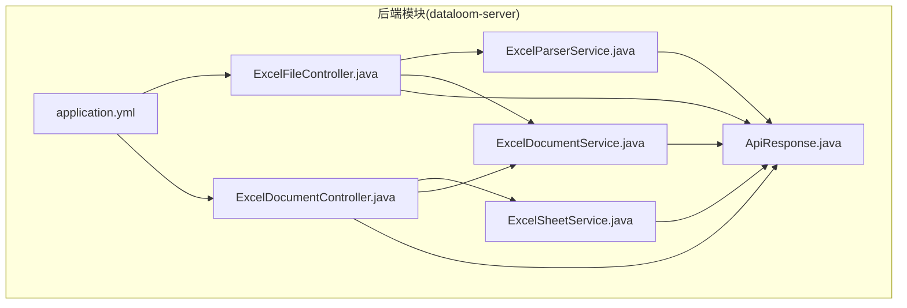
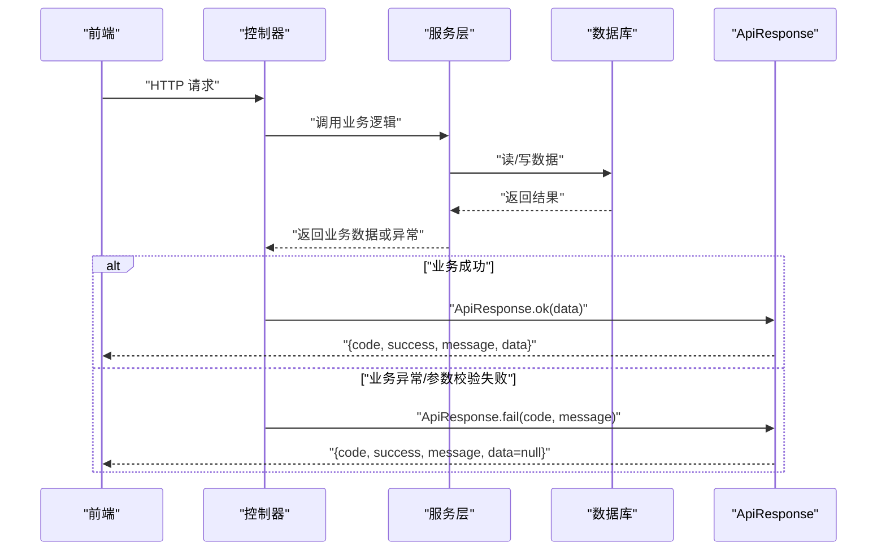
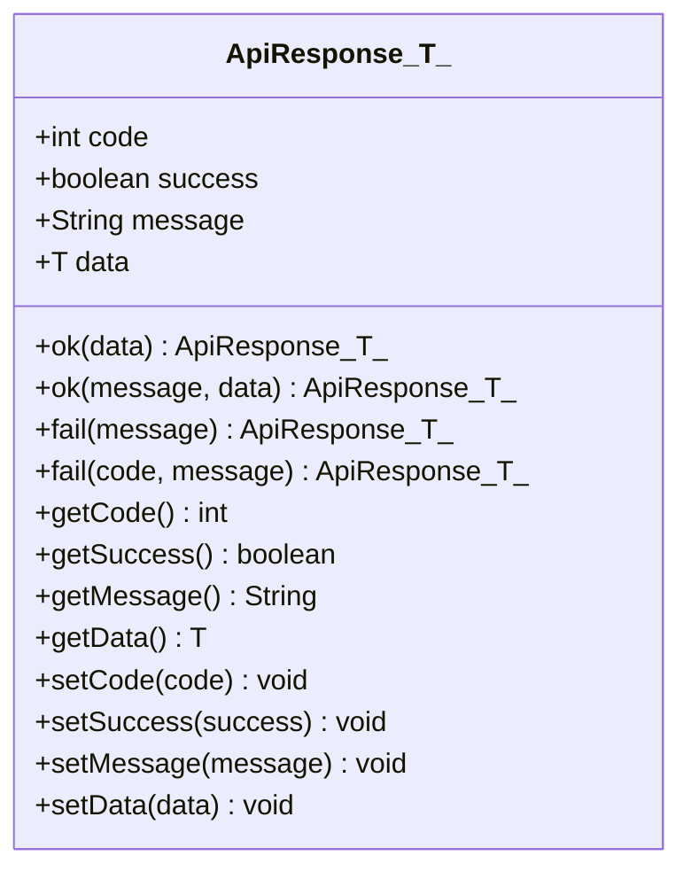
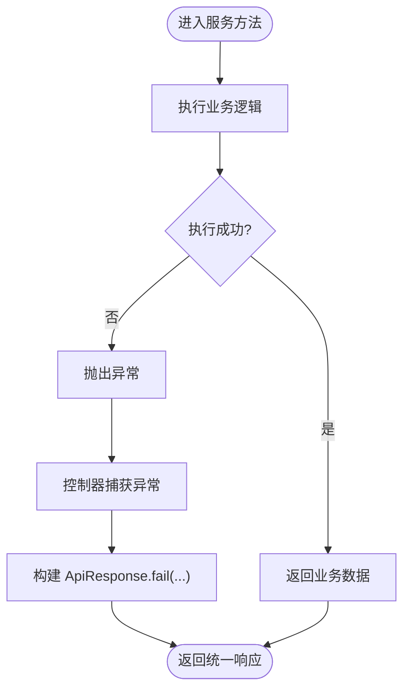
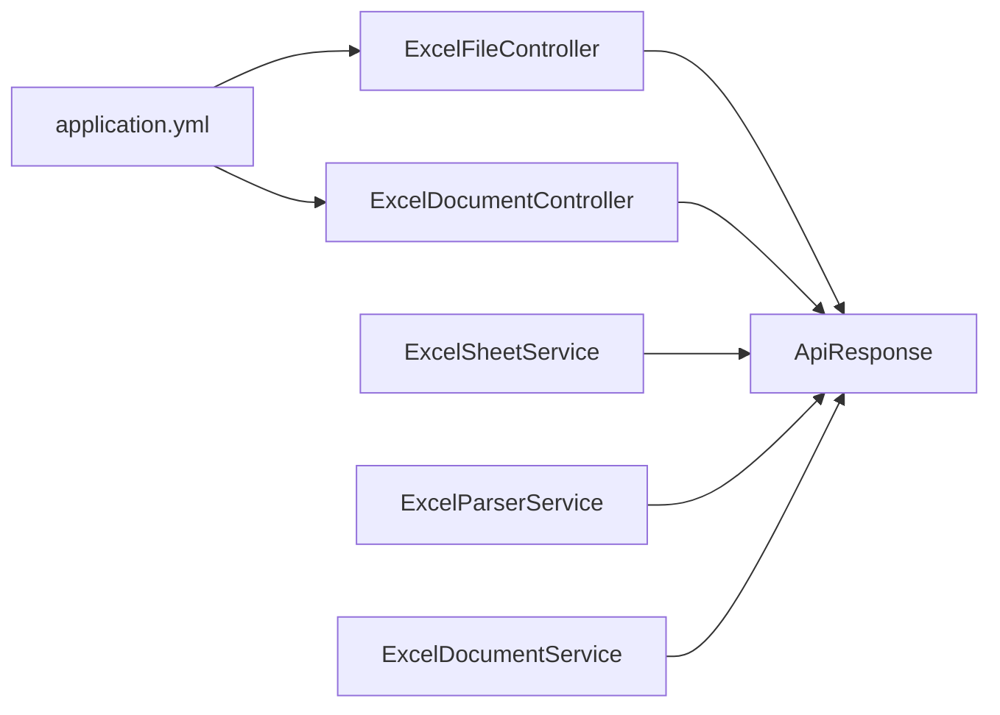

# ApiResponse 统一响应格式

<cite>
**本文引用的文件**
- [ApiResponse.java](file://dataloom-server/src/main/java/com/demo/excel/common/ApiResponse.java)
- [ExcelDocumentController.java](file://dataloom-server/src/main/java/com/demo/excel/controller/ExcelDocumentController.java)
- [ExcelFileController.java](file://dataloom-server/src/main/java/com/demo/excel/controller/ExcelFileController.java)
- [ExcelSheetService.java](file://dataloom-server/src/main/java/com/demo/excel/service/ExcelSheetService.java)
- [ExcelParserService.java](file://dataloom-server/src/main/java/com/demo/excel/service/ExcelParserService.java)
- [ExcelDocumentService.java](file://dataloom-server/src/main/java/com/demo/excel/service/ExcelDocumentService.java)
- [application.yml](file://dataloom-server/src/main/resources/application.yml)
- [README.md](file://README.md)
</cite>

## 目录
1. [简介](#简介)
2. [项目结构](#项目结构)
3. [核心组件](#核心组件)
4. [架构总览](#架构总览)
5. [详细组件分析](#详细组件分析)
6. [依赖分析](#依赖分析)
7. [性能考虑](#性能考虑)
8. [故障排查指南](#故障排查指南)
9. [结论](#结论)
10. [附录](#附录)

## 简介
本文件围绕后端统一响应格式类 ApiResponse 展开，系统性阐述其设计理念、实现原理与使用规范，覆盖成功响应与错误响应的标准结构、静态工厂方法的参数与行为、字段语义与数据类型、典型业务场景下的响应策略，以及前后端交互中的价值与优势。文中结合控制器与服务层的实际使用案例，帮助开发者准确理解并正确应用统一响应格式。

## 项目结构
DataLoom 后端采用标准的 Spring Boot 分层架构：
- controller：对外暴露 REST 接口，负责接收请求、组织业务数据并返回统一响应
- service：封装业务逻辑，必要时进行异常捕获并返回统一响应
- common：存放通用工具与模型，其中包含统一响应类 ApiResponse
- resources：配置文件与数据库初始化脚本

**图表来源**
- [ExcelFileController.java:1-141](file://dataloom-server/src/main/java/com/demo/excel/controller/ExcelFileController.java#L1-L141)
- [ExcelDocumentController.java:1-296](file://dataloom-server/src/main/java/com/demo/excel/controller/ExcelDocumentController.java#L1-L296)
- [ExcelSheetService.java:1-443](file://dataloom-server/src/main/java/com/demo/excel/service/ExcelSheetService.java#L1-L443)
- [ExcelParserService.java:1-348](file://dataloom-server/src/main/java/com/demo/excel/service/ExcelParserService.java#L1-L348)
- [ExcelDocumentService.java:1-119](file://dataloom-server/src/main/java/com/demo/excel/service/ExcelDocumentService.java#L1-L119)
- [ApiResponse.java:1-52](file://dataloom-server/src/main/java/com/demo/excel/common/ApiResponse.java#L1-L52)
- [application.yml:1-51](file://dataloom-server/src/main/resources/application.yml#L1-L51)

**章节来源**
- [README.md:190-216](file://README.md#L190-L216)

## 核心组件
- ApiResponse<T>：统一响应载体，包含状态码、成功标志、消息与泛型数据体
- 静态工厂方法：
  - ok(T data)：成功响应，code=200，success=true，message="success"
  - ok(String message, T data)：成功响应，自定义消息
  - fail(String message)：失败响应，code=500，success=false
  - fail(int code, String message)：失败响应，自定义 code 与 message

字段语义与类型：
- code：整型，HTTP 状态码风格的业务状态码
- success：布尔值，表示本次请求是否成功
- message：字符串，人类可读的提示信息
- data：泛型对象，承载业务数据

使用原则：
- 成功场景优先使用 ok(...)，携带业务数据
- 失败场景使用 fail(...)，明确错误原因
- 控制器层直接返回 ApiResponse，避免直接抛出异常给前端造成不可预期的错误形态

**章节来源**
- [ApiResponse.java:13-40](file://dataloom-server/src/main/java/com/demo/excel/common/ApiResponse.java#L13-L40)

## 架构总览
统一响应贯穿“控制器 → 服务 → 数据库”的调用链路，确保前后端交互的一致性与可预测性。

**图表来源**
- [ExcelFileController.java:70-116](file://dataloom-server/src/main/java/com/demo/excel/controller/ExcelFileController.java#L70-L116)
- [ExcelDocumentController.java:44-69](file://dataloom-server/src/main/java/com/demo/excel/controller/ExcelDocumentController.java#L44-L69)
- [ExcelSheetService.java:103-212](file://dataloom-server/src/main/java/com/demo/excel/service/ExcelSheetService.java#L103-L212)
- [ApiResponse.java:13-40](file://dataloom-server/src/main/java/com/demo/excel/common/ApiResponse.java#L13-L40)

## 详细组件分析

### ApiResponse 类与静态工厂方法
- ok(T data)：构造成功响应，设置 code=200，success=true，message="success"，并将 data 设为传入对象
- ok(String message, T data)：复用 ok(data)，随后将 message 替换为自定义消息
- fail(String message)：构造失败响应，设置 code=500，success=false，并设置 message
- fail(int code, String message)：复用 fail(message)，随后将 code 替换为自定义业务码

这些方法均以静态泛型形式返回 ApiResponse<T>，便于在不同控制器与服务中复用，保持响应结构一致。

**图表来源**
- [ApiResponse.java:6-51](file://dataloom-server/src/main/java/com/demo/excel/common/ApiResponse.java#L6-L51)

**章节来源**
- [ApiResponse.java:13-40](file://dataloom-server/src/main/java/com/demo/excel/common/ApiResponse.java#L13-L40)

### 控制器层的统一响应实践
- ExcelFileController.upload：上传成功返回 ok("上传成功", result)，失败通过 fail("上传失败: ...") 返回
- ExcelDocumentController：
  - list/detail/loadAllCelldata：成功返回 ok(result)
  - batchUpdateCells/saveWorkbook/rename/delete：根据业务逻辑与异常捕获返回 ok(...) 或 fail(...)

这些用例展示了：
- 正常业务响应：ok(data) 或 ok("消息", data)
- 参数校验失败：直接返回 fail("具体原因")
- 系统异常：try/catch 包裹，异常时返回 fail("失败原因")

```mermaid
sequenceDiagram
participant FE as "前端"
participant CTRL as "ExcelDocumentController"
participant SVC as "ExcelSheetService"
participant RESP as "ApiResponse"
FE->>CTRL : "PUT /api/excel/document/{id}/cells/batch"
CTRL->>SVC : "batchUpdateCells(id, updates)"
SVC-->>CTRL : "执行成功/异常"
alt "执行成功"
CTRL->>RESP : "ApiResponse.ok('保存成功')"
RESP-->>FE : "{code=200, success=true, message='保存成功', data=null}"
else "执行异常"
CTRL->>RESP : "ApiResponse.fail('保存失败 : ...')"
RESP-->>FE : "{code=500, success=false, message='保存失败 : ...', data=null}"
end
```

**图表来源**
- [ExcelDocumentController.java:176-190](file://dataloom-server/src/main/java/com/demo/excel/controller/ExcelDocumentController.java#L176-L190)
- [ExcelSheetService.java:103-212](file://dataloom-server/src/main/java/com/demo/excel/service/ExcelSheetService.java#L103-L212)
- [ApiResponse.java:13-40](file://dataloom-server/src/main/java/com/demo/excel/common/ApiResponse.java#L13-L40)

**章节来源**
- [ExcelFileController.java:70-116](file://dataloom-server/src/main/java/com/demo/excel/controller/ExcelFileController.java#L70-L116)
- [ExcelDocumentController.java:44-69](file://dataloom-server/src/main/java/com/demo/excel/controller/ExcelDocumentController.java#L44-L69)
- [ExcelDocumentController.java:176-190](file://dataloom-server/src/main/java/com/demo/excel/controller/ExcelDocumentController.java#L176-L190)
- [ExcelDocumentController.java:204-226](file://dataloom-server/src/main/java/com/demo/excel/controller/ExcelDocumentController.java#L204-L226)
- [ExcelDocumentController.java:238-264](file://dataloom-server/src/main/java/com/demo/excel/controller/ExcelDocumentController.java#L238-L264)

### 服务层的统一响应策略
- ExcelSheetService.batchUpdateCells：对批量更新进行分组与事务处理，异常时由调用方（控制器）捕获并返回 fail(...)
- ExcelSheetService.replaceWorkbook：全量替换工作簿，异常时由调用方返回 fail(...)
- ExcelParserService.parseAndSave：解析与分块持久化，异常时由调用方返回 fail(...)
- ExcelDocumentService.delete：软删除文档并清理文件，异常时由调用方返回 fail(...)

服务层不直接返回 ApiResponse，而是将异常向上抛出或返回业务数据，由控制器层统一包装为 ApiResponse，确保响应格式一致性。

**图表来源**
- [ExcelSheetService.java:103-212](file://dataloom-server/src/main/java/com/demo/excel/service/ExcelSheetService.java#L103-L212)
- [ExcelParserService.java:66-87](file://dataloom-server/src/main/java/com/demo/excel/service/ExcelParserService.java#L66-L87)
- [ExcelDocumentService.java:86-103](file://dataloom-server/src/main/java/com/demo/excel/service/ExcelDocumentService.java#L86-L103)

**章节来源**
- [ExcelSheetService.java:103-212](file://dataloom-server/src/main/java/com/demo/excel/service/ExcelSheetService.java#L103-L212)
- [ExcelParserService.java:66-87](file://dataloom-server/src/main/java/com/demo/excel/service/ExcelParserService.java#L66-L87)
- [ExcelDocumentService.java:86-103](file://dataloom-server/src/main/java/com/demo/excel/service/ExcelDocumentService.java#L86-L103)

### 响应数据标准化格式
- code：整型，业务状态码，成功通常为 200，失败默认 500，也可自定义
- success：布尔值，true 表示成功，false 表示失败
- message：字符串，面向用户的提示信息，可自定义
- data：任意对象，承载业务数据；成功时填充，失败时通常为空或由调用方决定

字段作用与类型：
- code：用于前端判断请求是否成功，便于统一错误处理与状态提示
- success：简化前端判断逻辑，避免依赖 code 值
- message：人类可读的提示，便于调试与用户反馈
- data：承载业务数据，支持复杂结构（如对象、数组）

**章节来源**
- [ApiResponse.java:8-11](file://dataloom-server/src/main/java/com/demo/excel/common/ApiResponse.java#L8-L11)

### 不同场景下的响应策略
- 正常业务响应：使用 ok(data) 或 ok("消息", data)，返回业务数据
- 参数验证失败：在控制器层直接返回 fail("具体原因")
- 业务逻辑错误：在服务层捕获异常或返回错误状态，由控制器包装为 fail(...)
- 系统异常：在控制器层 try/catch，返回 fail("失败原因")

示例场景映射：
- 上传成功：ExcelFileController.upload 返回 ok("上传成功", result)
- 上传失败：ExcelFileController.upload 返回 fail("上传失败: ...")
- 文档不存在：ExcelDocumentController.detail 返回 fail(404, "文档不存在")
- 批量保存失败：ExcelDocumentController.batchUpdateCells 返回 fail("保存失败: ...")
- 全量保存失败：ExcelDocumentController.saveWorkbook 返回 fail("保存失败: ...")

**章节来源**
- [ExcelFileController.java:112-115](file://dataloom-server/src/main/java/com/demo/excel/controller/ExcelFileController.java#L112-L115)
- [ExcelDocumentController.java:80-82](file://dataloom-server/src/main/java/com/demo/excel/controller/ExcelDocumentController.java#L80-L82)
- [ExcelDocumentController.java:186-189](file://dataloom-server/src/main/java/com/demo/excel/controller/ExcelDocumentController.java#L186-L189)
- [ExcelDocumentController.java:222-225](file://dataloom-server/src/main/java/com/demo/excel/controller/ExcelDocumentController.java#L222-L225)

### 前后端交互中的价值与优势
- 统一性：前后端约定一致的响应结构，降低对接成本
- 可读性：success 与 message 提升前端提示与错误处理的直观性
- 可扩展性：code 支持自定义业务码，便于精细化错误分类
- 一致性：控制器与服务层均遵循 ApiResponse，避免响应格式碎片化

**章节来源**
- [README.md:190-216](file://README.md#L190-L216)

## 依赖分析
- 控制器依赖 ApiResponse 进行响应包装
- 服务层不直接依赖 ApiResponse，避免污染业务层
- 配置文件 application.yml 提供基础运行参数，间接影响控制器行为（如文件上传大小限制）

**图表来源**
- [ExcelFileController.java:6](file://dataloom-server/src/main/java/com/demo/excel/controller/ExcelFileController.java#L6)
- [ExcelDocumentController.java:6](file://dataloom-server/src/main/java/com/demo/excel/controller/ExcelDocumentController.java#L6)
- [ExcelSheetService.java:1-34](file://dataloom-server/src/main/java/com/demo/excel/service/ExcelSheetService.java#L1-L34)
- [ExcelParserService.java:1-38](file://dataloom-server/src/main/java/com/demo/excel/service/ExcelParserService.java#L1-L38)
- [ExcelDocumentService.java:1-20](file://dataloom-server/src/main/java/com/demo/excel/service/ExcelDocumentService.java#L1-L20)
- [application.yml:19-23](file://dataloom-server/src/main/resources/application.yml#L19-L23)

**章节来源**
- [application.yml:19-23](file://dataloom-server/src/main/resources/application.yml#L19-L23)

## 性能考虑
- 统一响应本身不引入额外性能开销，但建议：
  - 控制器层尽量避免在响应体中返回超大数据（如全量 celldata），可参考现有实现仅返回元信息
  - 对于大文件上传与解析，采用分块策略，减少单次响应体积
  - 异常处理集中在控制器层，避免服务层频繁 try/catch 影响性能

[本节为通用指导，不直接分析具体文件]

## 故障排查指南
- 响应结构不符：检查控制器是否使用 ApiResponse.ok(...) 或 ApiResponse.fail(...) 包装
- 错误码不一致：确认是否使用 fail(code, message) 自定义 code
- 前端无法识别成功状态：确认 success 字段是否正确设置
- 大响应体导致前端卡顿：检查是否在响应中携带了不必要的大字段

**章节来源**
- [ExcelDocumentController.java:44-69](file://dataloom-server/src/main/java/com/demo/excel/controller/ExcelDocumentController.java#L44-L69)
- [ExcelDocumentController.java:176-190](file://dataloom-server/src/main/java/com/demo/excel/controller/ExcelDocumentController.java#L176-L190)

## 结论
ApiResponse 作为统一响应载体，通过静态工厂方法实现了成功与失败响应的标准化，配合控制器层的集中包装，确保前后端交互的一致性与可维护性。在实际开发中，建议：
- 成功场景使用 ok(...) 返回业务数据
- 失败场景使用 fail(...) 返回明确的错误信息
- 控制器层负责异常捕获与响应包装，服务层专注于业务逻辑
- 避免在响应体中传输超大数据，提升前端体验与系统性能

[本节为总结性内容，不直接分析具体文件]

## 附录
- API 参考（来自项目文档）
  - 上传接口：POST /api/excel/upload
  - 文档列表：GET /api/excel/document/list
  - 文档详情：GET /api/excel/document/{id}
  - 批量保存单元格：PUT /api/excel/document/{id}/cells/batch
  - 全量保存工作簿：PUT /api/excel/document/{id}/workbook
  - 重命名文档：PUT /api/excel/document/{id}/name
  - 删除文档：DELETE /api/excel/document/{id}

**章节来源**
- [README.md:190-216](file://README.md#L190-L216)