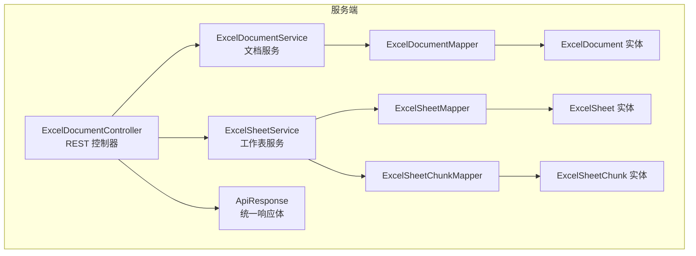
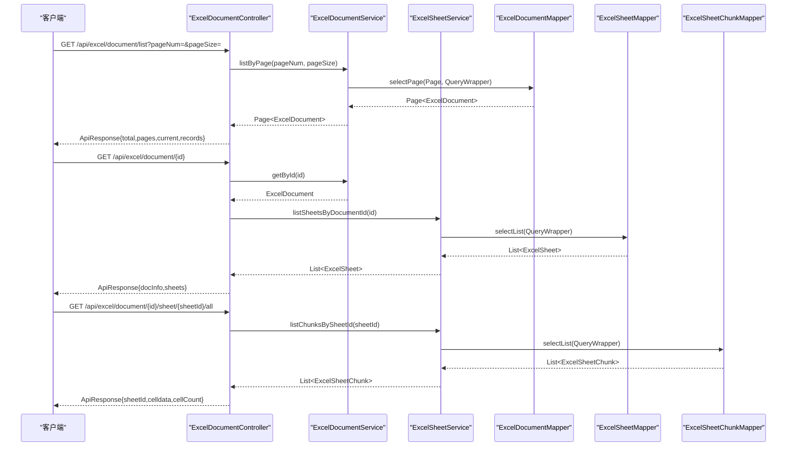
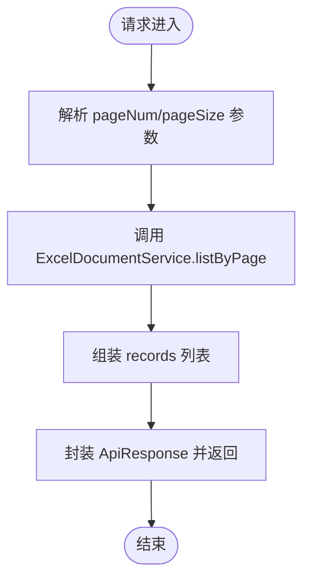
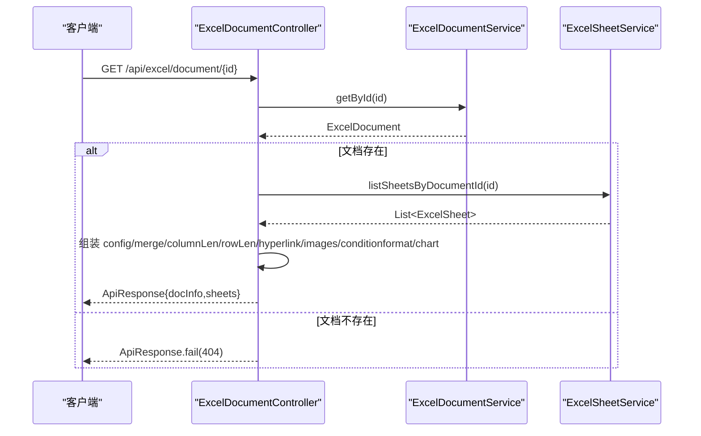
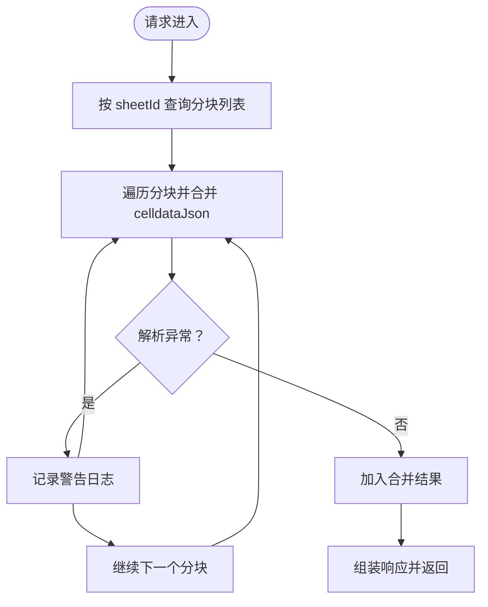
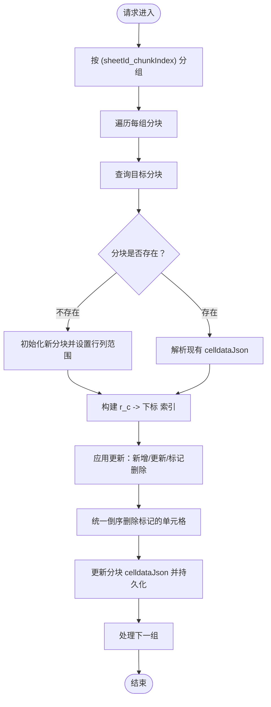
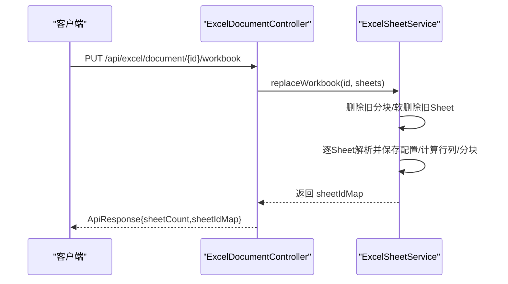
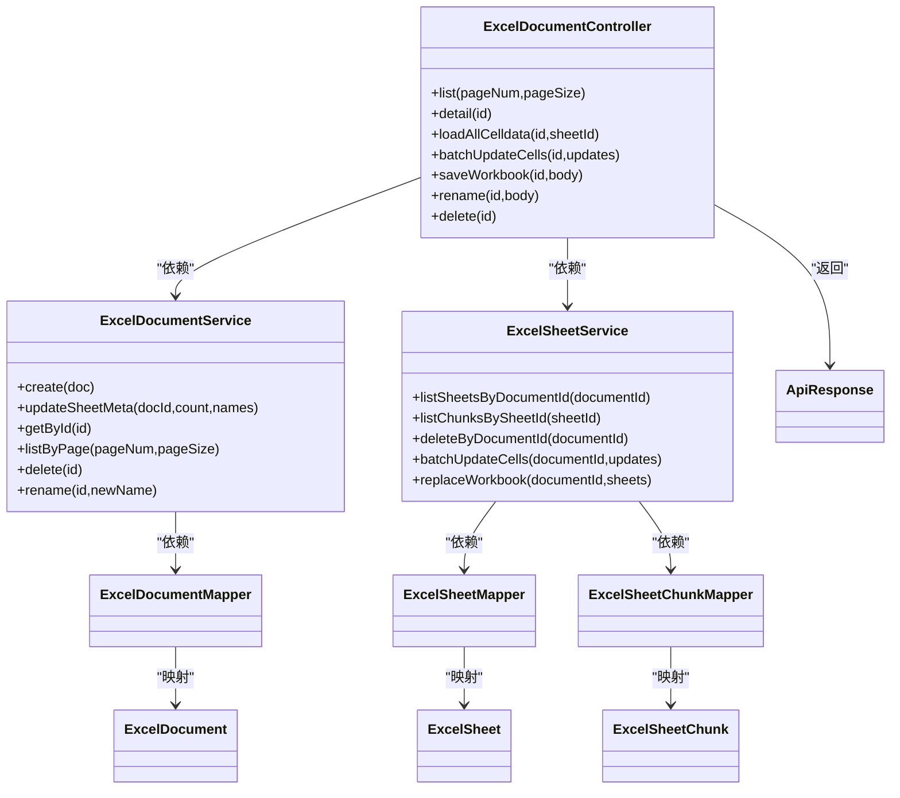

# ExcelDocumentController

<cite>
**本文引用的文件**
- [ExcelDocumentController.java](file://dataloom-server/src/main/java/com/demo/excel/controller/ExcelDocumentController.java)
- [ExcelDocumentService.java](file://dataloom-server/src/main/java/com/demo/excel/service/ExcelDocumentService.java)
- [ExcelSheetService.java](file://dataloom-server/src/main/java/com/demo/excel/service/ExcelSheetService.java)
- [ExcelDocument.java](file://dataloom-server/src/main/java/com/demo/excel/entity/ExcelDocument.java)
- [ExcelSheet.java](file://dataloom-server/src/main/java/com/demo/excel/entity/ExcelSheet.java)
- [ExcelSheetChunk.java](file://dataloom-server/src/main/java/com/demo/excel/entity/ExcelSheetChunk.java)
- [ExcelDocumentMapper.java](file://dataloom-server/src/main/java/com/demo/excel/mapper/ExcelDocumentMapper.java)
- [ExcelSheetMapper.java](file://dataloom-server/src/main/java/com/demo/excel/mapper/ExcelSheetMapper.java)
- [ExcelSheetChunkMapper.java](file://dataloom-server/src/main/java/com/demo/excel/mapper/ExcelSheetChunkMapper.java)
- [ApiResponse.java](file://dataloom-server/src/main/java/com/demo/excel/common/ApiResponse.java)
- [application.yml](file://dataloom-server/src/main/resources/application.yml)
- [schema.sql](file://dataloom-server/src/main/resources/schema.sql)
</cite>

## 目录
1. [简介](#简介)
2. [项目结构](#项目结构)
3. [核心组件](#核心组件)
4. [架构概览](#架构概览)
5. [详细组件分析](#详细组件分析)
6. [依赖分析](#依赖分析)
7. [性能考量](#性能考量)
8. [故障排查指南](#故障排查指南)
9. [结论](#结论)
10. [附录](#附录)

## 简介
本文件面向 ExcelDocumentController 控制器，系统性梳理其核心能力与接口规范，覆盖文档列表查询、文档详情获取、工作表数据加载、单元格批量更新、工作簿全量保存、文档重命名与删除等。重点解释分页查询实现、工作表配置信息组装（merge、columnlen、rowlen、hyperlink、images、conditionformat、chart 等）、单元格批量更新的增量保存机制与全量快照保存的区别，并提供 API 调用示例与响应格式说明，帮助前后端协作与集成。

## 项目结构
- 控制器位于 dataloom-server 模块的 controller 包中，负责对外暴露 REST API。
- 服务层位于 service 包，封装业务逻辑与事务控制。
- 实体与 Mapper 位于 entity 与 mapper 包，采用 MyBatis-Plus 进行数据访问。
- 统一响应体封装在 common 包中，便于前后端约定一致的返回格式。
- 应用配置与数据库建表脚本分别位于 resources 目录。

**图示来源**
- [ExcelDocumentController.java:22-24](file://dataloom-server/src/main/java/com/demo/excel/controller/ExcelDocumentController.java#L22-L24)
- [ExcelDocumentService.java:19-23](file://dataloom-server/src/main/java/com/demo/excel/service/ExcelDocumentService.java#L19-L23)
- [ExcelSheetService.java:33-43](file://dataloom-server/src/main/java/com/demo/excel/service/ExcelSheetService.java#L33-L43)
- [ExcelDocumentMapper.java:9-10](file://dataloom-server/src/main/java/com/demo/excel/mapper/ExcelDocumentMapper.java#L9-L10)
- [ExcelSheetMapper.java:11-12](file://dataloom-server/src/main/java/com/demo/excel/mapper/ExcelSheetMapper.java#L11-L12)
- [ExcelSheetChunkMapper.java:11-12](file://dataloom-server/src/main/java/com/demo/excel/mapper/ExcelSheetChunkMapper.java#L11-L12)
- [ExcelDocument.java:15-17](file://dataloom-server/src/main/java/com/demo/excel/entity/ExcelDocument.java#L15-L17)
- [ExcelSheet.java:14-16](file://dataloom-server/src/main/java/com/demo/excel/entity/ExcelSheet.java#L14-L16)
- [ExcelSheetChunk.java:18-20](file://dataloom-server/src/main/java/com/demo/excel/entity/ExcelSheetChunk.java#L18-L20)
- [ApiResponse.java:6-11](file://dataloom-server/src/main/java/com/demo/excel/common/ApiResponse.java#L6-L11)

**章节来源**
- [ExcelDocumentController.java:1-296](file://dataloom-server/src/main/java/com/demo/excel/controller/ExcelDocumentController.java#L1-L296)
- [application.yml:1-51](file://dataloom-server/src/main/resources/application.yml#L1-L51)
- [schema.sql:1-124](file://dataloom-server/src/main/resources/schema.sql#L1-L124)

## 核心组件
- ExcelDocumentController：提供文档与工作表相关 REST 接口，负责参数校验、调用服务层、组装统一响应。
- ExcelDocumentService：封装文档主表的 CRUD 与分页查询，负责软删除与元信息更新。
- ExcelSheetService：封装工作表与分块的查询、删除、批量增量更新与全量快照保存。
- 实体与 Mapper：定义数据模型与数据库访问接口，支持 MyBatis-Plus 的分页与条件查询。
- ApiResponse：统一返回体，包含 code、success、message、data 字段，便于前后端约定。

**章节来源**
- [ExcelDocumentController.java:22-33](file://dataloom-server/src/main/java/com/demo/excel/controller/ExcelDocumentController.java#L22-L33)
- [ExcelDocumentService.java:19-118](file://dataloom-server/src/main/java/com/demo/excel/service/ExcelDocumentService.java#L19-L118)
- [ExcelSheetService.java:33-442](file://dataloom-server/src/main/java/com/demo/excel/service/ExcelSheetService.java#L33-L442)
- [ApiResponse.java:6-51](file://dataloom-server/src/main/java/com/demo/excel/common/ApiResponse.java#L6-L51)

## 架构概览
控制器通过服务层协调实体与 Mapper，实现以下关键流程：
- 文档列表查询：服务层基于 MyBatis-Plus 分页插件完成分页查询。
- 文档详情获取：服务层查询工作表列表，组装配置信息（含 merge、columnlen、rowlen、hyperlink、images、conditionformat、chart）。
- 工作表数据加载：按 sheetId 查询分块列表，合并 celldata 返回。
- 单元格批量更新：按分块粒度进行增量写入，提升性能。
- 工作簿全量保存：删除旧数据后重建，返回 sheetId 映射。
- 文档重命名与删除：软删除文档并清理关联资源。

**图示来源**
- [ExcelDocumentController.java:44-69](file://dataloom-server/src/main/java/com/demo/excel/controller/ExcelDocumentController.java#L44-L69)
- [ExcelDocumentController.java:77-131](file://dataloom-server/src/main/java/com/demo/excel/controller/ExcelDocumentController.java#L77-L131)
- [ExcelDocumentController.java:139-161](file://dataloom-server/src/main/java/com/demo/excel/controller/ExcelDocumentController.java#L139-L161)
- [ExcelDocumentService.java:72-78](file://dataloom-server/src/main/java/com/demo/excel/service/ExcelDocumentService.java#L72-L78)
- [ExcelSheetService.java:51-72](file://dataloom-server/src/main/java/com/demo/excel/service/ExcelSheetService.java#L51-L72)

**章节来源**
- [ExcelDocumentController.java:34-161](file://dataloom-server/src/main/java/com/demo/excel/controller/ExcelDocumentController.java#L34-L161)
- [ExcelDocumentService.java:65-78](file://dataloom-server/src/main/java/com/demo/excel/service/ExcelDocumentService.java#L65-L78)
- [ExcelSheetService.java:46-72](file://dataloom-server/src/main/java/com/demo/excel/service/ExcelSheetService.java#L46-L72)

## 详细组件分析

### 文档列表查询（分页）
- 接口定义
  - 方法：GET
  - 路径：/api/excel/document/list
  - 请求参数：
    - pageNum：页码，默认 1
    - pageSize：每页条数，默认 20
  - 响应体：包含 total、pages、current、records 字段
    - records：每条记录包含 id、name、sheetCount、sheetNames、version、fileSize、createTime、updateTime
- 实现要点
  - 服务层使用 MyBatis-Plus Page 与 QueryWrapper 实现分页与排序
  - 仅返回文档元数据，不含单元格数据
- 错误处理
  - 未找到文档时返回统一错误响应

**图示来源**
- [ExcelDocumentController.java:44-69](file://dataloom-server/src/main/java/com/demo/excel/controller/ExcelDocumentController.java#L44-L69)
- [ExcelDocumentService.java:72-78](file://dataloom-server/src/main/java/com/demo/excel/service/ExcelDocumentService.java#L72-L78)

**章节来源**
- [ExcelDocumentController.java:38-69](file://dataloom-server/src/main/java/com/demo/excel/controller/ExcelDocumentController.java#L38-L69)
- [ExcelDocumentService.java:65-78](file://dataloom-server/src/main/java/com/demo/excel/service/ExcelDocumentService.java#L65-L78)

### 文档详情获取（含工作表配置）
- 接口定义
  - 方法：GET
  - 路径：/api/excel/document/{id}
  - 路径参数：id（文档 ID）
  - 响应体：包含文档基本信息与 sheets 列表
    - 文档字段：id、name、sheetCount、version
    - sheets：每个元素包含 sheetId、sheetIndex、sheetName、totalRows、totalCols、chunkCount、active、config、mergeConfig、columnLen、rowLen、hyperlink、images、luckysheet_conditionformat_save、chart
- 配置信息组装
  - config：若为空，则将 merge、columnlen、rowlen 合并到 config 中
  - mergeConfig：合并单元格配置
  - columnLen：列宽配置
  - rowLen：行高配置
  - hyperlink：超链接配置
  - images：图片配置
  - luckysheet_conditionformat_save：条件格式配置
  - chart：图表配置
- 错误处理
  - 文档不存在时返回 404

**图示来源**
- [ExcelDocumentController.java:77-131](file://dataloom-server/src/main/java/com/demo/excel/controller/ExcelDocumentController.java#L77-L131)
- [ExcelSheetService.java:51-57](file://dataloom-server/src/main/java/com/demo/excel/service/ExcelSheetService.java#L51-L57)

**章节来源**
- [ExcelDocumentController.java:71-131](file://dataloom-server/src/main/java/com/demo/excel/controller/ExcelDocumentController.java#L71-L131)

### 工作表数据加载（全量 celldata）
- 接口定义
  - 方法：GET
  - 路径：/api/excel/document/{id}/sheet/{sheetId}/all
  - 路径参数：id（文档 ID）、sheetId（工作表 ID）
  - 响应体：包含 sheetId、celldata（合并后的单元格数据数组）、cellCount
- 实现要点
  - 按 sheetId 查询所有分块，按 chunkIndex 升序合并 celldataJson
  - 异常分块解析会被安全忽略并记录日志
- 适用场景
  - 前端打开文档后一次性拉取整个 Sheet 的单元格数据
  - 对于超大 Sheet（10 万行以上），建议评估性能后再使用

**图示来源**
- [ExcelDocumentController.java:139-161](file://dataloom-server/src/main/java/com/demo/excel/controller/ExcelDocumentController.java#L139-L161)
- [ExcelSheetService.java:67-72](file://dataloom-server/src/main/java/com/demo/excel/service/ExcelSheetService.java#L67-L72)

**章节来源**
- [ExcelDocumentController.java:133-161](file://dataloom-server/src/main/java/com/demo/excel/controller/ExcelDocumentController.java#L133-L161)

### 单元格批量更新（增量保存）
- 接口定义
  - 方法：PUT
  - 路径：/api/excel/document/{id}/cells/batch
  - 路径参数：id（文档 ID）
  - 请求体：List<Map<String,Object>>，元素包含 sheetId、r（行）、c（列）、v（单元格值）
  - 响应体：统一 ApiResponse
- 实现要点
  - 按 (sheetId_chunkIndex) 分组，每组只读/写一次对应分块，降低 I/O
  - 使用索引将查找从 O(n) 降为 O(1)，支持原地更新与新增/删除
  - 事务保护，失败回滚
- 适用场景
  - 前端保存时仅有单元格内容变化（无结构/图片/图表变更）

**图示来源**
- [ExcelDocumentController.java:176-190](file://dataloom-server/src/main/java/com/demo/excel/controller/ExcelDocumentController.java#L176-L190)
- [ExcelSheetService.java:103-212](file://dataloom-server/src/main/java/com/demo/excel/service/ExcelSheetService.java#L103-L212)

**章节来源**
- [ExcelDocumentController.java:167-190](file://dataloom-server/src/main/java/com/demo/excel/controller/ExcelDocumentController.java#L167-L190)
- [ExcelSheetService.java:94-212](file://dataloom-server/src/main/java/com/demo/excel/service/ExcelSheetService.java#L94-L212)

### 工作簿全量保存（快照替换）
- 接口定义
  - 方法：PUT
  - 路径：/api/excel/document/{id}/workbook
  - 路径参数：id（文档 ID）
  - 请求体：Map<String,Object>，包含 sheets（luckysheet 格式的快照数组）
  - 响应体：包含 sheetCount 与 sheetIdMap（旧索引 -> 新 sheetId 的映射）
- 实现要点
  - 事务保护：先删除旧分块，再软删除旧 Sheet，最后逐 Sheet 重建
  - 解析并标准化 celldata，计算 totalRows/totalCols，按 CHUNK_SIZE 分块存储
  - 返回 sheetId 映射，供前端后续增量保存使用
- 适用场景
  - Sheet 结构变化（增删 Sheet、改名、合并单元格、列宽/行高）、图片/图表/超链接/条件格式变更

**图示来源**
- [ExcelDocumentController.java:204-226](file://dataloom-server/src/main/java/com/demo/excel/controller/ExcelDocumentController.java#L204-L226)
- [ExcelSheetService.java:221-316](file://dataloom-server/src/main/java/com/demo/excel/service/ExcelSheetService.java#L221-L316)

**章节来源**
- [ExcelDocumentController.java:192-226](file://dataloom-server/src/main/java/com/demo/excel/controller/ExcelDocumentController.java#L192-L226)
- [ExcelSheetService.java:214-316](file://dataloom-server/src/main/java/com/demo/excel/service/ExcelSheetService.java#L214-L316)

### 文档重命名
- 接口定义
  - 方法：PUT
  - 路径：/api/excel/document/{id}/name
  - 路径参数：id（文档 ID）
  - 请求体：Map<String,String>，包含 name（新名称）
  - 响应体：统一 ApiResponse
- 实现要点
  - 校验名称非空
  - 文档不存在时返回 404
  - 成功后更新文档名称与更新时间

**章节来源**
- [ExcelDocumentController.java:238-251](file://dataloom-server/src/main/java/com/demo/excel/controller/ExcelDocumentController.java#L238-L251)
- [ExcelDocumentService.java:105-117](file://dataloom-server/src/main/java/com/demo/excel/service/ExcelDocumentService.java#L105-L117)

### 文档删除
- 接口定义
  - 方法：DELETE
  - 路径：/api/excel/document/{id}
  - 路径参数：id（文档 ID）
  - 响应体：统一 ApiResponse
- 实现要点
  - 软删除文档（status 改为 3）
  - 删除磁盘上的原始文件（若存在）
  - 清理关联的 Sheet（软删除）与 Chunk（物理删除）

**章节来源**
- [ExcelDocumentController.java:258-264](file://dataloom-server/src/main/java/com/demo/excel/controller/ExcelDocumentController.java#L258-L264)
- [ExcelDocumentService.java:86-103](file://dataloom-server/src/main/java/com/demo/excel/service/ExcelDocumentService.java#L86-L103)
- [ExcelSheetService.java:79-91](file://dataloom-server/src/main/java/com/demo/excel/service/ExcelSheetService.java#L79-L91)

## 依赖分析
- 控制器依赖服务层，服务层依赖 Mapper 与实体。
- 分页查询依赖 MyBatis-Plus Page 与 QueryWrapper。
- 增量保存依赖分块索引与事务控制。
- 全量保存依赖事务保护与分块重建。

**图示来源**
- [ExcelDocumentController.java:22-33](file://dataloom-server/src/main/java/com/demo/excel/controller/ExcelDocumentController.java#L22-L33)
- [ExcelDocumentService.java:19-23](file://dataloom-server/src/main/java/com/demo/excel/service/ExcelDocumentService.java#L19-L23)
- [ExcelSheetService.java:33-43](file://dataloom-server/src/main/java/com/demo/excel/service/ExcelSheetService.java#L33-L43)
- [ExcelDocumentMapper.java:9-10](file://dataloom-server/src/main/java/com/demo/excel/mapper/ExcelDocumentMapper.java#L9-L10)
- [ExcelSheetMapper.java:11-12](file://dataloom-server/src/main/java/com/demo/excel/mapper/ExcelSheetMapper.java#L11-L12)
- [ExcelSheetChunkMapper.java:11-12](file://dataloom-server/src/main/java/com/demo/excel/mapper/ExcelSheetChunkMapper.java#L11-L12)
- [ExcelDocument.java:15-17](file://dataloom-server/src/main/java/com/demo/excel/entity/ExcelDocument.java#L15-L17)
- [ExcelSheet.java:14-16](file://dataloom-server/src/main/java/com/demo/excel/entity/ExcelSheet.java#L14-L16)
- [ExcelSheetChunk.java:18-20](file://dataloom-server/src/main/java/com/demo/excel/entity/ExcelSheetChunk.java#L18-L20)
- [ApiResponse.java:6-11](file://dataloom-server/src/main/java/com/demo/excel/common/ApiResponse.java#L6-L11)

**章节来源**
- [ExcelDocumentController.java:22-33](file://dataloom-server/src/main/java/com/demo/excel/controller/ExcelDocumentController.java#L22-L33)
- [ExcelDocumentService.java:19-23](file://dataloom-server/src/main/java/com/demo/excel/service/ExcelDocumentService.java#L19-L23)
- [ExcelSheetService.java:33-43](file://dataloom-server/src/main/java/com/demo/excel/service/ExcelSheetService.java#L33-L43)

## 性能考量
- 分块存储
  - 每块约 1000 行，单块 JSON 通常在几百 KB 以内，便于按需加载与传输。
  - 通过 rowStart/rowEnd 精确控制分块范围，避免超大数据导致内存压力。
- 增量保存
  - 按 (sheetId_chunkIndex) 分组，每组只读/写一次对应分块，显著降低 I/O。
  - 使用索引将查找从 O(n) 降为 O(1)，支持高效原地更新与新增/删除。
- 全量快照
  - 事务保护，先删除旧数据再重建，确保一致性。
  - 重建时按 CHUNK_SIZE 分块写入，避免单次写入过大。
- 分页查询
  - 使用 MyBatis-Plus Page 与 QueryWrapper，按更新时间降序，仅返回正常状态文档。

**章节来源**
- [ExcelSheetService.java:44-44](file://dataloom-server/src/main/java/com/demo/excel/service/ExcelSheetService.java#L44-L44)
- [ExcelSheetService.java:103-212](file://dataloom-server/src/main/java/com/demo/excel/service/ExcelSheetService.java#L103-L212)
- [ExcelSheetService.java:221-316](file://dataloom-server/src/main/java/com/demo/excel/service/ExcelSheetService.java#L221-L316)
- [ExcelDocumentService.java:72-78](file://dataloom-server/src/main/java/com/demo/excel/service/ExcelDocumentService.java#L72-L78)

## 故障排查指南
- 常见错误与处理
  - 文档不存在：返回 404，检查 id 是否正确
  - 请求体格式错误：如 sheets 非数组、updates 缺失字段，返回统一错误响应
  - 解析异常：分块 celldata 解析失败会记录警告日志并跳过分块
  - 文件删除异常：软删除文档时尝试删除磁盘文件，若失败会忽略并继续清理数据库
- 日志定位
  - 控制器与服务层均记录操作日志，便于定位问题
- 建议
  - 前端在调用全量保存后，使用返回的 sheetIdMap 进行后续增量保存
  - 对于超大 Sheet，优先使用分块加载策略

**章节来源**
- [ExcelDocumentController.java:80-82](file://dataloom-server/src/main/java/com/demo/excel/controller/ExcelDocumentController.java#L80-L82)
- [ExcelDocumentController.java:210-211](file://dataloom-server/src/main/java/com/demo/excel/controller/ExcelDocumentController.java#L210-L211)
- [ExcelDocumentController.java:151-153](file://dataloom-server/src/main/java/com/demo/excel/controller/ExcelDocumentController.java#L151-L153)
- [ExcelDocumentService.java:88-96](file://dataloom-server/src/main/java/com/demo/excel/service/ExcelDocumentService.java#L88-L96)

## 结论
ExcelDocumentController 提供了完整的文档与工作表管理能力，结合分块存储与事务保护，既能满足日常单元格编辑的高效增量保存，也能应对结构变更的全量快照保存需求。通过清晰的 API 设计与统一响应体，为前端提供了稳定可靠的集成接口。

## 附录

### API 定义与示例

- 文档列表（分页）
  - 方法：GET
  - 路径：/api/excel/document/list
  - 请求参数：pageNum（默认 1）、pageSize（默认 20）
  - 响应体：ApiResponse{total,pages,current,records}
  - 示例响应字段：records[].id、name、sheetCount、sheetNames、version、fileSize、createTime、updateTime

- 文档详情
  - 方法：GET
  - 路径：/api/excel/document/{id}
  - 路径参数：id
  - 响应体：ApiResponse{docInfo,sheets}
  - 示例响应字段：sheets[].sheetId、sheetIndex、sheetName、totalRows、totalCols、chunkCount、active、config、mergeConfig、columnLen、rowLen、hyperlink、images、luckysheet_conditionformat_save、chart

- 加载工作表全量 celldata
  - 方法：GET
  - 路径：/api/excel/document/{id}/sheet/{sheetId}/all
  - 路径参数：id、sheetId
  - 响应体：ApiResponse{sheetId,celldata[],cellCount}

- 单元格批量更新（增量）
  - 方法：PUT
  - 路径：/api/excel/document/{id}/cells/batch
  - 路径参数：id
  - 请求体：List<Map<String,Object>>，元素包含 sheetId、r、c、v
  - 响应体：ApiResponse

- 工作簿全量保存（快照）
  - 方法：PUT
  - 路径：/api/excel/document/{id}/workbook
  - 路径参数：id
  - 请求体：Map<String,Object>，包含 sheets[]
  - 响应体：ApiResponse{sheetCount,sheetIdMap}

- 文档重命名
  - 方法：PUT
  - 路径：/api/excel/document/{id}/name
  - 路径参数：id
  - 请求体：Map<String,String>，包含 name
  - 响应体：ApiResponse

- 文档删除
  - 方法：DELETE
  - 路径：/api/excel/document/{id}
  - 路径参数：id
  - 响应体：ApiResponse

### 响应格式说明
- 统一响应体：ApiResponse
  - 字段：code（状态码）、success（是否成功）、message（消息）、data（数据）
  - 成功：code=200、success=true
  - 失败：code=500、success=false

**章节来源**
- [ExcelDocumentController.java:44-264](file://dataloom-server/src/main/java/com/demo/excel/controller/ExcelDocumentController.java#L44-L264)
- [ApiResponse.java:6-51](file://dataloom-server/src/main/java/com/demo/excel/common/ApiResponse.java#L6-L51)