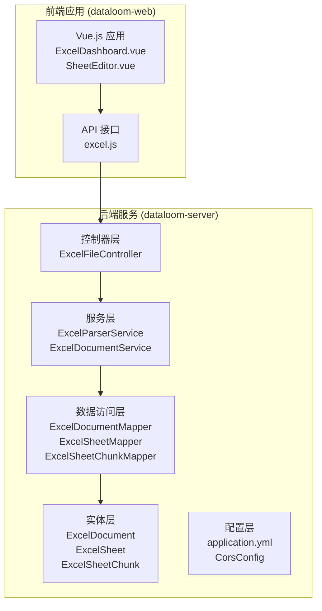
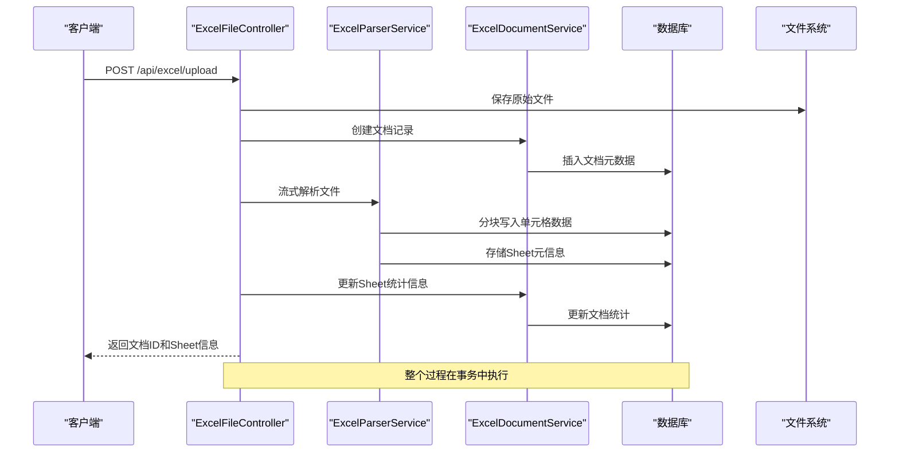
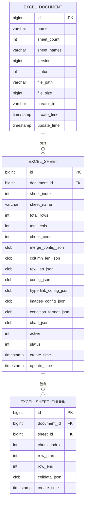
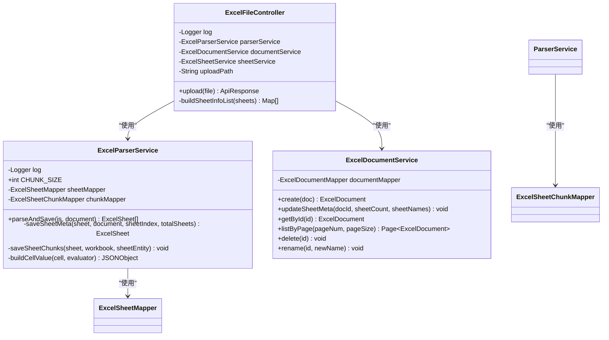
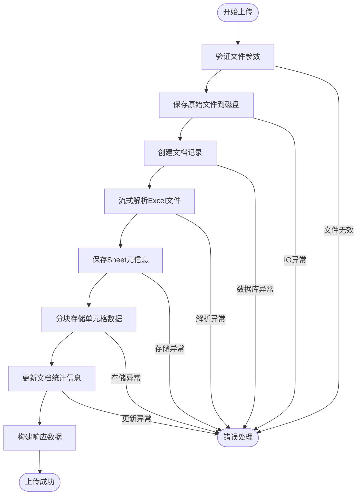
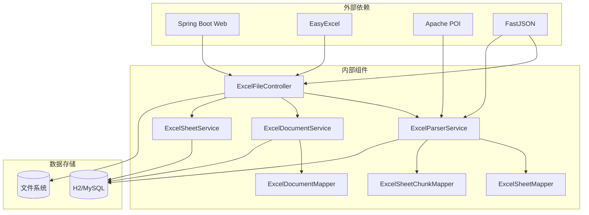
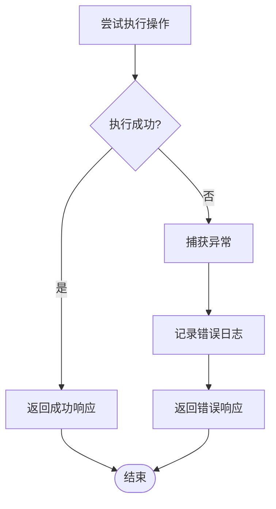

# ExcelFileController 详细文档

<cite>
**本文档引用的文件**
- [ExcelFileController.java](file://dataloom-server/src/main/java/com/demo/excel/controller/ExcelFileController.java)
- [ExcelParserService.java](file://dataloom-server/src/main/java/com/demo/excel/service/ExcelParserService.java)
- [ExcelDocumentService.java](file://dataloom-server/src/main/java/com/demo/excel/service/ExcelDocumentService.java)
- [ExcelDocument.java](file://dataloom-server/src/main/java/com/demo/excel/entity/ExcelDocument.java)
- [ApiResponse.java](file://dataloom-server/src/main/java/com/demo/excel/common/ApiResponse.java)
- [application.yml](file://dataloom-server/src/main/resources/application.yml)
- [schema.sql](file://dataloom-server/src/main/resources/schema.sql)
- [ExcelDocumentController.java](file://dataloom-server/src/main/java/com/demo/excel/controller/ExcelDocumentController.java)
- [ExcelDocumentMapper.java](file://dataloom-server/src/main/java/com/demo/excel/mapper/ExcelDocumentMapper.java)
- [ExcelSheetMapper.java](file://dataloom-server/src/main/java/com/demo/excel/mapper/ExcelSheetMapper.java)
- [ExcelSheetChunkMapper.java](file://dataloom-server/src/main/java/com/demo/excel/mapper/ExcelSheetChunkMapper.java)
- [excel.js](file://dataloom-web/src/api/excel.js)
</cite>

## 目录
1. [简介](#简介)
2. [项目结构](#项目结构)
3. [核心组件](#核心组件)
4. [架构概览](#架构概览)
5. [详细组件分析](#详细组件分析)
6. [依赖关系分析](#依赖关系分析)
7. [性能考量](#性能考量)
8. [故障排除指南](#故障排除指南)
9. [结论](#结论)
10. [附录](#附录)

## 简介

ExcelFileController 是 DataLoom 项目中的核心控制器，负责处理 Excel 文件的上传、验证、存储和预处理功能。该控制器实现了百万级数据量的高效处理能力，采用流式解析和分块存储策略，解决了传统 Excel 处理中内存溢出和性能瓶颈的问题。

该控制器支持多种 Excel 格式（.xlsx 和 .xls），具备完善的错误处理机制和安全防护措施，为前端应用提供了稳定可靠的文件上传接口。

## 项目结构

DataLoom 项目采用标准的 Spring Boot 分层架构，主要包含以下模块：



**图表来源**
- [ExcelFileController.java:1-141](file://dataloom-server/src/main/java/com/demo/excel/controller/ExcelFileController.java#L1-L141)
- [ExcelParserService.java:1-348](file://dataloom-server/src/main/java/com/demo/excel/service/ExcelParserService.java#L1-L348)
- [application.yml:1-51](file://dataloom-server/src/main/resources/application.yml#L1-L51)

**章节来源**
- [ExcelFileController.java:1-141](file://dataloom-server/src/main/java/com/demo/excel/controller/ExcelFileController.java#L1-L141)
- [application.yml:1-51](file://dataloom-server/src/main/resources/application.yml#L1-L51)

## 核心组件

### ExcelFileController 核心功能

ExcelFileController 作为文件上传的主要入口，实现了以下关键功能：

1. **文件接收与验证**
   - 支持多格式 Excel 文件上传
   - 文件大小限制检查（默认 100MB）
   - 文件类型验证

2. **文件存储机制**
   - 临时文件存储到指定目录
   - 原始文件备份功能
   - 文件路径管理和清理

3. **数据解析与预处理**
   - 流式 POI 解析，避免内存溢出
   - 分块存储策略（每块约 1000 行）
   - Sheet 元信息提取和存储

4. **响应数据组织**
   - 文档 ID 返回
   - Sheet 元信息列表
   - 不包含单元格数据的轻量响应

**章节来源**
- [ExcelFileController.java:57-116](file://dataloom-server/src/main/java/com/demo/excel/controller/ExcelFileController.java#L57-L116)
- [ExcelParserService.java:66-87](file://dataloom-server/src/main/java/com/demo/excel/service/ExcelParserService.java#L66-L87)

## 架构概览

ExcelFileController 的整体架构采用了分层设计和事件驱动模式：



**图表来源**
- [ExcelFileController.java:70-116](file://dataloom-server/src/main/java/com/demo/excel/controller/ExcelFileController.java#L70-L116)
- [ExcelParserService.java:66-87](file://dataloom-server/src/main/java/com/demo/excel/service/ExcelParserService.java#L66-L87)
- [ExcelDocumentService.java:31-53](file://dataloom-server/src/main/java/com/demo/excel/service/ExcelDocumentService.java#L31-L53)

### 数据模型关系



**图表来源**
- [schema.sql:8-66](file://dataloom-server/src/main/resources/schema.sql#L8-L66)

**章节来源**
- [schema.sql:1-124](file://dataloom-server/src/main/resources/schema.sql#L1-L124)

## 详细组件分析

### ExcelFileController 类结构



**图表来源**
- [ExcelFileController.java:37-141](file://dataloom-server/src/main/java/com/demo/excel/controller/ExcelFileController.java#L37-L141)
- [ExcelParserService.java:39-348](file://dataloom-server/src/main/java/com/demo/excel/service/ExcelParserService.java#L39-L348)
- [ExcelDocumentService.java:20-119](file://dataloom-server/src/main/java/com/demo/excel/service/ExcelDocumentService.java#L20-L119)

### 文件上传处理流程

ExcelFileController 的文件上传处理流程如下：



**图表来源**
- [ExcelFileController.java:70-116](file://dataloom-server/src/main/java/com/demo/excel/controller/ExcelFileController.java#L70-L116)

### 文件解析前的准备工作

在文件解析之前，系统会进行以下准备工作：

1. **文件格式检查**
   - 验证文件扩展名（.xlsx/.xls）
   - 检查文件是否为空
   - 确认文件编码格式

2. **存储空间验证**
   - 检查目标存储目录是否存在
   - 验证磁盘空间是否充足
   - 创建必要的目录结构

3. **临时文件管理**
   - 生成唯一的文件名避免冲突
   - 设置适当的文件权限
   - 准备临时文件清理机制

4. **数据库连接检查**
   - 确保数据库连接正常
   - 验证表结构完整性
   - 准备事务环境

**章节来源**
- [ExcelFileController.java:72-89](file://dataloom-server/src/main/java/com/demo/excel/controller/ExcelFileController.java#L72-L89)

### 文件上传后的处理流程

文件上传后的处理流程包括多个步骤：

1. **文档记录创建**
   - 初始化文档元数据
   - 设置默认状态和版本号
   - 记录创建者信息

2. **流式解析执行**
   - 使用 Apache POI 进行流式读取
   - 避免将整个文件加载到内存
   - 实时处理单元格数据

3. **分块存储策略**
   - 每 1000 行为一个数据块
   - 按块索引顺序存储
   - 维护行号范围信息

4. **元数据更新**
   - 统计 Sheet 数量和名称
   - 更新文档的统计信息
   - 清理临时文件

**章节来源**
- [ExcelParserService.java:66-87](file://dataloom-server/src/main/java/com/demo/excel/service/ExcelParserService.java#L66-L87)
- [ExcelDocumentService.java:46-53](file://dataloom-server/src/main/java/com/demo/excel/service/ExcelDocumentService.java#L46-L53)

## 依赖关系分析

### 组件依赖图



**图表来源**
- [ExcelFileController.java:1-28](file://dataloom-server/src/main/java/com/demo/excel/controller/ExcelFileController.java#L1-L28)
- [ExcelParserService.java:1-24](file://dataloom-server/src/main/java/com/demo/excel/service/ExcelParserService.java#L1-L24)

### 关键依赖关系

1. **核心依赖**
   - Apache POI：Excel 文件解析
   - EasyExcel：简化 Excel 操作
   - MyBatis-Plus：数据库操作框架
   - FastJSON：JSON 数据处理

2. **配置依赖**
   - Spring MVC：Web 请求处理
   - Spring Boot Starter：自动配置
   - H2 数据库：开发测试环境

3. **安全依赖**
   - CORS 配置：跨域访问控制
   - 文件上传限制：防止恶意文件上传

**章节来源**
- [ExcelFileController.java:3-18](file://dataloom-server/src/main/java/com/demo/excel/controller/ExcelFileController.java#L3-L18)
- [application.yml:19-23](file://dataloom-server/src/main/resources/application.yml#L19-L23)

## 性能考量

### 内存优化策略

1. **流式处理**
   - 使用 Apache POI 的流式读取模式
   - 避免将整个 Excel 文件加载到内存
   - 实时处理单元格数据，减少内存峰值

2. **分块存储**
   - 默认每块 1000 行单元格数据
   - 按需加载分块数据，支持超大数据集
   - 维护行号范围，确保数据完整性

3. **数据库优化**
   - 批量插入减少数据库往返
   - 事务控制确保数据一致性
   - 索引优化查询性能

### 并发处理能力

1. **线程安全**
   - 控制器和业务逻辑线程安全
   - 数据库连接池管理
   - 文件系统并发访问控制

2. **资源管理**
   - 及时释放文件句柄
   - 数据库连接自动关闭
   - 缓存资源及时清理

**章节来源**
- [ExcelParserService.java:43-44](file://dataloom-server/src/main/java/com/demo/excel/service/ExcelParserService.java#L43-L44)
- [ExcelParserService.java:142-200](file://dataloom-server/src/main/java/com/demo/excel/service/ExcelParserService.java#L142-L200)

## 故障排除指南

### 常见错误及解决方案

1. **文件上传失败**
   - **错误原因**：文件大小超过限制、文件损坏、权限不足
   - **解决方案**：检查文件大小配置、验证文件完整性、确认存储权限

2. **解析异常**
   - **错误原因**：Excel 格式不支持、公式计算错误、数据类型异常
   - **解决方案**：转换为标准 Excel 格式、修复公式、检查数据类型

3. **数据库连接问题**
   - **错误原因**：数据库配置错误、连接池耗尽、事务冲突
   - **解决方案**：检查数据库配置、增加连接池大小、优化事务管理

4. **内存溢出**
   - **错误原因**：单个 Sheet 数据量过大、分块策略不当
   - **解决方案**：调整分块大小、优化数据结构、增加 JVM 内存

### 错误处理机制



**图表来源**
- [ExcelFileController.java:112-116](file://dataloom-server/src/main/java/com/demo/excel/controller/ExcelFileController.java#L112-L116)

**章节来源**
- [ExcelFileController.java:112-116](file://dataloom-server/src/main/java/com/demo/excel/controller/ExcelFileController.java#L112-L116)

## 结论

ExcelFileController 作为 DataLoom 项目的核心组件，成功实现了百万级数据量的 Excel 文件处理能力。通过采用流式解析、分块存储和分布式架构设计，该控制器不仅解决了传统 Excel 处理中的性能瓶颈，还提供了稳定可靠的服务保障。

其主要优势包括：
- **高性能**：流式处理避免内存溢出
- **可扩展**：分块存储支持超大数据集
- **安全性**：完善的错误处理和安全防护
- **易维护**：清晰的代码结构和文档

未来可以进一步优化的方向包括：
- 增加更多的文件格式支持
- 实现更精细的并发控制
- 提供更丰富的监控指标
- 增强缓存机制提升性能

## 附录

### API 使用示例

#### 正确的请求格式

**文件上传请求**
```javascript
// 前端 JavaScript 示例
const formData = new FormData();
formData.append('file', selectedFile);

axios.post('/api/excel/upload', formData, {
  headers: {
    'Content-Type': 'multipart/form-data'
  },
  onUploadProgress: (event) => {
    const progress = Math.round((event.loaded / event.total) * 100);
    console.log(`上传进度: ${progress}%`);
  }
});
```

**响应数据结构**
```json
{
  "code": 200,
  "success": true,
  "message": "success",
  "data": {
    "documentId": 123,
    "name": "example.xlsx",
    "sheetCount": 2,
    "sheets": [
      {
        "sheetId": 456,
        "sheetIndex": 0,
        "sheetName": "Sheet1",
        "totalRows": 10000,
        "totalCols": 50,
        "chunkCount": 10,
        "active": 1
      }
    ]
  }
}
```

#### 可能的错误处理

**常见错误码**
- `400`: 文件格式不支持
- `413`: 文件大小超出限制
- `500`: 服务器内部错误
- `504`: 解析超时

**错误响应格式**
```json
{
  "code": 400,
  "success": false,
  "message": "文件格式不支持，请上传 .xlsx 或 .xls 文件",
  "data": null
}
```

**章节来源**
- [excel.js:12-25](file://dataloom-web/src/api/excel.js#L12-L25)
- [ApiResponse.java:13-40](file://dataloom-server/src/main/java/com/demo/excel/common/ApiResponse.java#L13-L40)

### 安全考虑和最佳实践

#### 安全配置

1. **文件上传限制**
   - 配置最大文件大小（默认 100MB）
   - 限制请求总大小
   - 验证文件类型

2. **存储安全**
   - 使用随机文件名避免路径遍历攻击
   - 设置适当的文件权限
   - 定期清理临时文件

3. **数据库安全**
   - 使用参数化查询防止 SQL 注入
   - 实施适当的访问控制
   - 定期备份重要数据

#### 最佳实践

1. **性能优化**
   - 合理设置分块大小
   - 使用连接池管理数据库连接
   - 实施适当的缓存策略

2. **监控和日志**
   - 记录详细的处理日志
   - 监控系统资源使用情况
   - 设置告警机制

3. **错误恢复**
   - 实现自动重试机制
   - 提供手动恢复选项
   - 定期数据完整性检查

**章节来源**
- [application.yml:19-23](file://dataloom-server/src/main/resources/application.yml#L19-L23)
- [ExcelFileController.java:50-51](file://dataloom-server/src/main/java/com/demo/excel/controller/ExcelFileController.java#L50-L51)