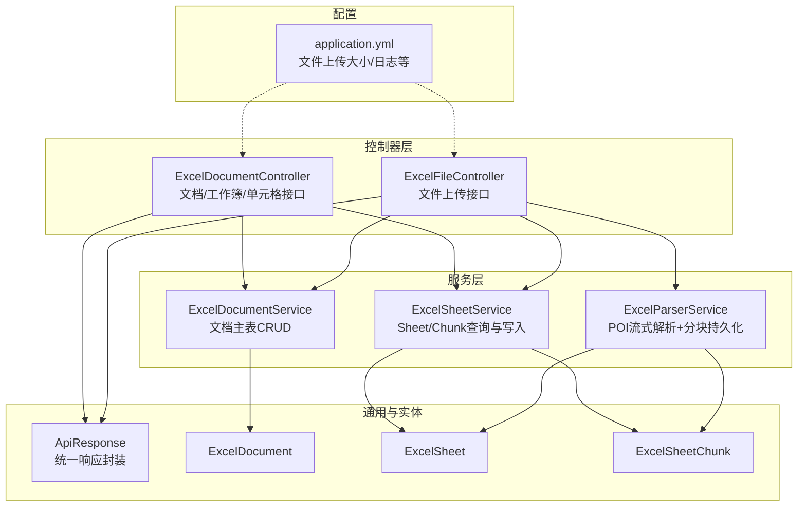
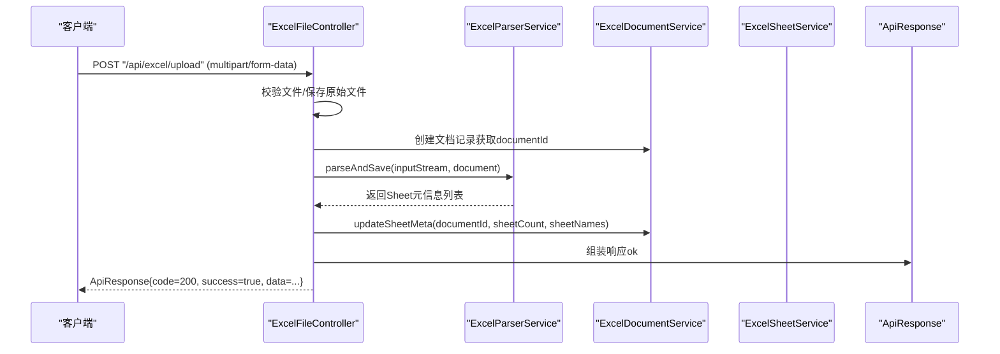
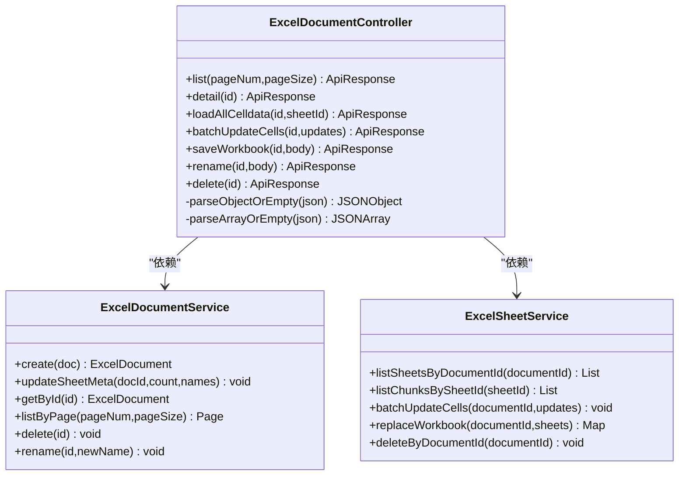
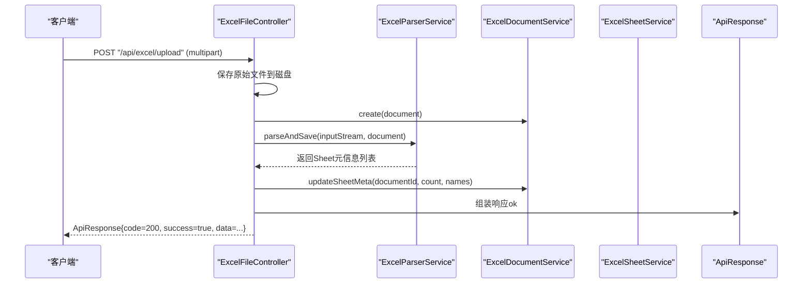
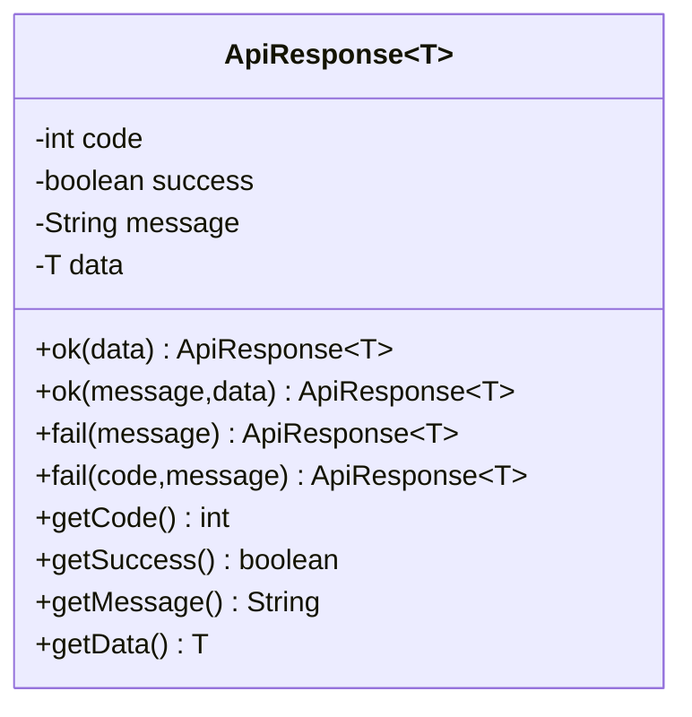
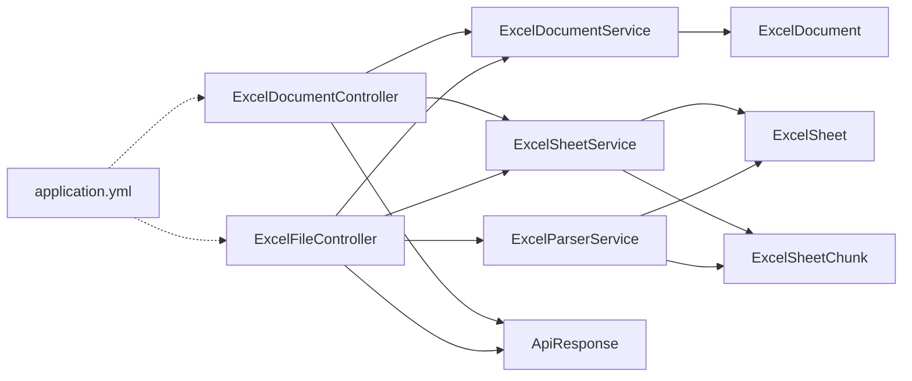

# 控制器层（Controller）

<cite>
**本文引用的文件**
- [ExcelDocumentController.java](file://dataloom-server/src/main/java/com/demo/excel/controller/ExcelDocumentController.java)
- [ExcelFileController.java](file://dataloom-server/src/main/java/com/demo/excel/controller/ExcelFileController.java)
- [ApiResponse.java](file://dataloom-server/src/main/java/com/demo/excel/common/ApiResponse.java)
- [ExcelDocumentService.java](file://dataloom-server/src/main/java/com/demo/excel/service/ExcelDocumentService.java)
- [ExcelSheetService.java](file://dataloom-server/src/main/java/com/demo/excel/service/ExcelSheetService.java)
- [ExcelParserService.java](file://dataloom-server/src/main/java/com/demo/excel/service/ExcelParserService.java)
- [ExcelDocument.java](file://dataloom-server/src/main/java/com/demo/excel/entity/ExcelDocument.java)
- [ExcelSheet.java](file://dataloom-server/src/main/java/com/demo/excel/entity/ExcelSheet.java)
- [ExcelSheetChunk.java](file://dataloom-server/src/main/java/com/demo/excel/entity/ExcelSheetChunk.java)
- [application.yml](file://dataloom-server/src/main/resources/application.yml)
</cite>

## 目录
1. [简介](#简介)
2. [项目结构](#项目结构)
3. [核心组件](#核心组件)
4. [架构总览](#架构总览)
5. [详细组件分析](#详细组件分析)
6. [依赖关系分析](#依赖关系分析)
7. [性能考量](#性能考量)
8. [故障排查指南](#故障排查指南)
9. [结论](#结论)
10. [附录](#附录)

## 简介
本章节面向控制器层（Controller）的实现与设计，重点覆盖以下目标：
- 解释 MVC 架构中控制器层的职责边界：请求验证、参数绑定、异常处理、统一响应封装。
- 深入说明 ExcelDocumentController 与 ExcelFileController 的功能边界与 REST API 设计原则。
- 阐述 ApiResponse 统一响应格式的设计理念与实现方式。
- 提供 API 使用示例与响应格式说明，涵盖成功与错误响应标准。
- 总结最佳实践与常见问题解决方案。

## 项目结构
控制器层位于 dataloom-server 模块的 controller 包中，配合 service、entity、mapper、common 等包协同工作，遵循 Spring MVC 的典型分层架构。

图示来源
- [ExcelDocumentController.java:1-296](file://dataloom-server/src/main/java/com/demo/excel/controller/ExcelDocumentController.java#L1-L296)
- [ExcelFileController.java:1-141](file://dataloom-server/src/main/java/com/demo/excel/controller/ExcelFileController.java#L1-L141)
- [ExcelDocumentService.java:1-119](file://dataloom-server/src/main/java/com/demo/excel/service/ExcelDocumentService.java#L1-L119)
- [ExcelSheetService.java:1-443](file://dataloom-server/src/main/java/com/demo/excel/service/ExcelSheetService.java#L1-L443)
- [ExcelParserService.java:1-348](file://dataloom-server/src/main/java/com/demo/excel/service/ExcelParserService.java#L1-L348)
- [ExcelDocument.java:1-55](file://dataloom-server/src/main/java/com/demo/excel/entity/ExcelDocument.java#L1-L55)
- [ExcelSheet.java:1-77](file://dataloom-server/src/main/java/com/demo/excel/entity/ExcelSheet.java#L1-L77)
- [ExcelSheetChunk.java:1-53](file://dataloom-server/src/main/java/com/demo/excel/entity/ExcelSheetChunk.java#L1-L53)
- [application.yml:1-51](file://dataloom-server/src/main/resources/application.yml#L1-L51)

章节来源
- [ExcelDocumentController.java:1-296](file://dataloom-server/src/main/java/com/demo/excel/controller/ExcelDocumentController.java#L1-L296)
- [ExcelFileController.java:1-141](file://dataloom-server/src/main/java/com/demo/excel/controller/ExcelFileController.java#L1-L141)
- [application.yml:1-51](file://dataloom-server/src/main/resources/application.yml#L1-L51)

## 核心组件
- ExcelDocumentController：负责文档 CRUD、工作簿全量保存、单元格批量更新、按 Sheet 加载全量 celldata 等。
- ExcelFileController：负责 Excel 文件上传、保存原始文件、流式解析并分块持久化。
- ApiResponse：统一响应封装，提供 ok/fail 多种静态工厂方法，确保前后端交互一致性。
- 服务层：ExcelDocumentService、ExcelSheetService、ExcelParserService，分别承担文档主表、Sheet/Chunk 查询与写入、POI 流式解析与分块落库。
- 实体层：ExcelDocument、ExcelSheet、ExcelSheetChunk，承载数据模型与字段定义。

章节来源
- [ExcelDocumentController.java:1-296](file://dataloom-server/src/main/java/com/demo/excel/controller/ExcelDocumentController.java#L1-L296)
- [ExcelFileController.java:1-141](file://dataloom-server/src/main/java/com/demo/excel/controller/ExcelFileController.java#L1-L141)
- [ApiResponse.java:1-52](file://dataloom-server/src/main/java/com/demo/excel/common/ApiResponse.java#L1-L52)
- [ExcelDocumentService.java:1-119](file://dataloom-server/src/main/java/com/demo/excel/service/ExcelDocumentService.java#L1-L119)
- [ExcelSheetService.java:1-443](file://dataloom-server/src/main/java/com/demo/excel/service/ExcelSheetService.java#L1-L443)
- [ExcelParserService.java:1-348](file://dataloom-server/src/main/java/com/demo/excel/service/ExcelParserService.java#L1-L348)
- [ExcelDocument.java:1-55](file://dataloom-server/src/main/java/com/demo/excel/entity/ExcelDocument.java#L1-L55)
- [ExcelSheet.java:1-77](file://dataloom-server/src/main/java/com/demo/excel/entity/ExcelSheet.java#L1-L77)
- [ExcelSheetChunk.java:1-53](file://dataloom-server/src/main/java/com/demo/excel/entity/ExcelSheetChunk.java#L1-L53)

## 架构总览
控制器层通过注解驱动的 REST API 暴露功能，内部委托服务层完成业务处理，并以 ApiResponse 统一封装响应体。文件上传流程引入 ExcelParserService 进行流式解析与分块持久化，避免一次性加载超大数据集。

图示来源
- [ExcelFileController.java:70-116](file://dataloom-server/src/main/java/com/demo/excel/controller/ExcelFileController.java#L70-L116)
- [ExcelParserService.java:66-87](file://dataloom-server/src/main/java/com/demo/excel/service/ExcelParserService.java#L66-L87)
- [ExcelDocumentService.java:46-53](file://dataloom-server/src/main/java/com/demo/excel/service/ExcelDocumentService.java#L46-L53)

## 详细组件分析

### ExcelDocumentController：文档/工作簿/单元格控制器
职责边界
- 文档列表与详情：分页查询文档元数据；按文档 ID 返回包含 Sheet 元信息的工作簿概览。
- Sheet 全量 celldata 加载：按 chunk 合并返回 celldata，适用于小规模 Sheet 或一次性加载场景。
- 单元格批量更新：按 chunk 分组进行增量写入，避免全量重建，提升性能。
- 工作簿全量保存：删除旧 Sheet/Chunk 后重建，返回 sheetId 映射供前端后续增量保存。
- 文档管理：重命名、删除（软删除文档 + 清理 Sheet/Chunk）。

REST API 设计原则
- HTTP 方法映射：GET（查询）、PUT（更新）、DELETE（删除）。
- URL 路径设计：采用层级化路径，清晰表达资源关系与操作意图。
- 请求参数处理：路径变量（@PathVariable）、查询参数（@RequestParam）、请求体（@RequestBody）合理搭配。

统一响应封装
- 成功响应：使用 ApiResponse.ok(...)，默认 code=200，success=true。
- 错误响应：使用 ApiResponse.fail(...)，默认 code=500，success=false。

图示来源
- [ExcelDocumentController.java:1-296](file://dataloom-server/src/main/java/com/demo/excel/controller/ExcelDocumentController.java#L1-L296)
- [ExcelDocumentService.java:1-119](file://dataloom-server/src/main/java/com/demo/excel/service/ExcelDocumentService.java#L1-L119)
- [ExcelSheetService.java:1-443](file://dataloom-server/src/main/java/com/demo/excel/service/ExcelSheetService.java#L1-L443)

章节来源
- [ExcelDocumentController.java:1-296](file://dataloom-server/src/main/java/com/demo/excel/controller/ExcelDocumentController.java#L1-L296)
- [ExcelDocumentService.java:1-119](file://dataloom-server/src/main/java/com/demo/excel/service/ExcelDocumentService.java#L1-L119)
- [ExcelSheetService.java:1-443](file://dataloom-server/src/main/java/com/demo/excel/service/ExcelSheetService.java#L1-L443)

### ExcelFileController：文件上传控制器
职责边界
- 文件上传：接收 Excel 文件，保存至本地目录，便于备份与二次导出。
- 流式解析与分块持久化：委托 ExcelParserService 进行 POI 流式解析，按固定行数分块写入数据库。
- 元信息返回：返回文档 ID、名称、Sheet 数量与各 Sheet 元信息（不含 celldata）。

REST API 设计原则
- HTTP 方法映射：POST（上传）。
- URL 路径设计："/api/excel/upload"，语义明确。
- 请求参数处理：@RequestParam("file") MultipartFile，结合 application.yml 的文件大小限制。

图示来源
- [ExcelFileController.java:70-116](file://dataloom-server/src/main/java/com/demo/excel/controller/ExcelFileController.java#L70-L116)
- [ExcelParserService.java:66-87](file://dataloom-server/src/main/java/com/demo/excel/service/ExcelParserService.java#L66-L87)
- [ExcelDocumentService.java:46-53](file://dataloom-server/src/main/java/com/demo/excel/service/ExcelDocumentService.java#L46-L53)

章节来源
- [ExcelFileController.java:1-141](file://dataloom-server/src/main/java/com/demo/excel/controller/ExcelFileController.java#L1-L141)
- [ExcelParserService.java:1-348](file://dataloom-server/src/main/java/com/demo/excel/service/ExcelParserService.java#L1-L348)
- [ExcelDocumentService.java:1-119](file://dataloom-server/src/main/java/com/demo/excel/service/ExcelDocumentService.java#L1-L119)
- [ExcelSheetService.java:1-443](file://dataloom-server/src/main/java/com/demo/excel/service/ExcelSheetService.java#L1-L443)

### ApiResponse 统一响应格式
设计理念
- 规范化响应结构：统一 code、success、message、data 字段，便于前端统一处理。
- 工厂方法：提供 ok(...) 与 fail(...) 多种重载，简化调用侧代码。
- 类型安全：泛型 ApiResponse<T> 支持任意数据类型返回。

实现要点
- 成功响应：默认 code=200，success=true，message="success"。
- 失败响应：默认 code=500，success=false，message 由调用方传入。
- 可扩展性：支持自定义 code 与 message，满足不同业务场景。

图示来源
- [ApiResponse.java:1-52](file://dataloom-server/src/main/java/com/demo/excel/common/ApiResponse.java#L1-L52)

章节来源
- [ApiResponse.java:1-52](file://dataloom-server/src/main/java/com/demo/excel/common/ApiResponse.java#L1-L52)

### 请求验证、参数绑定与异常处理
- 参数绑定：@PathVariable、@RequestParam、@RequestBody 合理使用，确保路径、查询与请求体参数正确解析。
- 请求验证：对关键参数进行校验（如 rename 的名称非空、saveWorkbook 的 sheets 类型检查），不符合要求时返回 ApiResponse.fail(...)。
- 异常处理：控制器层捕获运行期异常，记录日志并返回统一错误响应，避免泄露内部异常细节。
- JSON 安全解析：提供 parseObjectOrEmpty 与 parseArrayOrEmpty 辅助方法，容错空串与解析异常，保障系统稳定性。

章节来源
- [ExcelDocumentController.java:77-131](file://dataloom-server/src/main/java/com/demo/excel/controller/ExcelDocumentController.java#L77-L131)
- [ExcelDocumentController.java:176-190](file://dataloom-server/src/main/java/com/demo/excel/controller/ExcelDocumentController.java#L176-L190)
- [ExcelDocumentController.java:204-226](file://dataloom-server/src/main/java/com/demo/excel/controller/ExcelDocumentController.java#L204-L226)
- [ExcelDocumentController.java:258-264](file://dataloom-server/src/main/java/com/demo/excel/controller/ExcelDocumentController.java#L258-L264)
- [ExcelDocumentController.java:270-294](file://dataloom-server/src/main/java/com/demo/excel/controller/ExcelDocumentController.java#L270-L294)

### API 使用示例与响应格式说明
以下示例基于控制器暴露的端点，展示典型请求与响应模式（仅描述行为与结构，不包含具体代码）。

- 文档列表（分页）
  - 请求：GET /api/excel/document/list?pageNum=1&pageSize=20
  - 成功响应：ApiResponse{code=200, success=true, data={total, pages, current, records:[{id,name,sheetCount,sheetNames,...}]}}
  - 失败响应：ApiResponse{code=500, success=false, message=...}

- 文档详情
  - 请求：GET /api/excel/document/{id}
  - 成功响应：ApiResponse{code=200, success=true, data={id,name,sheetCount,version,sheets:[{sheetId,sheetIndex,sheetName,totalRows,totalCols,chunkCount,active,config:{merge,columnlen,rowlen},hyperlink,images,luckysheet_conditionformat_save,chart}]}}
  - 失败响应：ApiResponse{code=404/500, success=false, message=...}

- 加载指定 Sheet 的全部 celldata
  - 请求：GET /api/excel/document/{id}/sheet/{sheetId}/all
  - 成功响应：ApiResponse{code=200, success=true, data={sheetId,celldata:[...],cellCount}}

- 批量增量更新单元格
  - 请求：PUT /api/excel/document/{id}/cells/batch
  - 请求体：[{sheetId,r,c,v:{...}}, ...]
  - 成功响应：ApiResponse{code=200, success=true, message="保存成功"}

- 全量快照保存工作簿
  - 请求：PUT /api/excel/document/{id}/workbook
  - 请求体：{sheets:[{...luckysheet格式的sheet快照...}]}
  - 成功响应：ApiResponse{code=200, success=true, message="保存成功", data={sheetCount,sheetIdMap:{...}}}

- 重命名文档
  - 请求：PUT /api/excel/document/{id}/name
  - 请求体：{name:"新名称"}
  - 成功响应：ApiResponse{code=200, success=true, message="重命名成功"}

- 删除文档
  - 请求：DELETE /api/excel/document/{id}
  - 成功响应：ApiResponse{code=200, success=true, message="删除成功"}

- 文件上传
  - 请求：POST /api/excel/upload
  - 请求体：multipart/form-data，字段名为 file
  - 成功响应：ApiResponse{code=200, success=true, message="上传成功", data={documentId,name,sheetCount,sheets:[{sheetId,sheetIndex,sheetName,totalRows,totalCols,chunkCount,active}]}}
  - 失败响应：ApiResponse{code=500, success=false, message="上传失败: ..."}

章节来源
- [ExcelDocumentController.java:44-69](file://dataloom-server/src/main/java/com/demo/excel/controller/ExcelDocumentController.java#L44-L69)
- [ExcelDocumentController.java:77-131](file://dataloom-server/src/main/java/com/demo/excel/controller/ExcelDocumentController.java#L77-L131)
- [ExcelDocumentController.java:139-161](file://dataloom-server/src/main/java/com/demo/excel/controller/ExcelDocumentController.java#L139-L161)
- [ExcelDocumentController.java:176-190](file://dataloom-server/src/main/java/com/demo/excel/controller/ExcelDocumentController.java#L176-L190)
- [ExcelDocumentController.java:204-226](file://dataloom-server/src/main/java/com/demo/excel/controller/ExcelDocumentController.java#L204-L226)
- [ExcelDocumentController.java:238-251](file://dataloom-server/src/main/java/com/demo/excel/controller/ExcelDocumentController.java#L238-L251)
- [ExcelDocumentController.java:258-264](file://dataloom-server/src/main/java/com/demo/excel/controller/ExcelDocumentController.java#L258-L264)
- [ExcelFileController.java:70-116](file://dataloom-server/src/main/java/com/demo/excel/controller/ExcelFileController.java#L70-L116)

## 依赖关系分析
- 控制器依赖服务层：ExcelDocumentController 依赖 ExcelDocumentService 与 ExcelSheetService；ExcelFileController 依赖 ExcelParserService、ExcelDocumentService、ExcelSheetService。
- 服务层依赖实体与 Mapper：ExcelDocumentService、ExcelSheetService、ExcelParserService 分别依赖对应的实体与 Mapper。
- 统一响应：控制器层统一使用 ApiResponse 封装响应，降低前后端耦合度。
- 配置依赖：application.yml 提供文件上传大小限制、数据库连接、MyBatis-Plus 配置等，间接影响控制器行为（如上传容量限制）。

图示来源
- [ExcelDocumentController.java:1-296](file://dataloom-server/src/main/java/com/demo/excel/controller/ExcelDocumentController.java#L1-L296)
- [ExcelFileController.java:1-141](file://dataloom-server/src/main/java/com/demo/excel/controller/ExcelFileController.java#L1-L141)
- [ExcelDocumentService.java:1-119](file://dataloom-server/src/main/java/com/demo/excel/service/ExcelDocumentService.java#L1-L119)
- [ExcelSheetService.java:1-443](file://dataloom-server/src/main/java/com/demo/excel/service/ExcelSheetService.java#L1-L443)
- [ExcelParserService.java:1-348](file://dataloom-server/src/main/java/com/demo/excel/service/ExcelParserService.java#L1-L348)
- [ExcelDocument.java:1-55](file://dataloom-server/src/main/java/com/demo/excel/entity/ExcelDocument.java#L1-L55)
- [ExcelSheet.java:1-77](file://dataloom-server/src/main/java/com/demo/excel/entity/ExcelSheet.java#L1-L77)
- [ExcelSheetChunk.java:1-53](file://dataloom-server/src/main/java/com/demo/excel/entity/ExcelSheetChunk.java#L1-L53)
- [application.yml:1-51](file://dataloom-server/src/main/resources/application.yml#L1-L51)

章节来源
- [ExcelDocumentController.java:1-296](file://dataloom-server/src/main/java/com/demo/excel/controller/ExcelDocumentController.java#L1-L296)
- [ExcelFileController.java:1-141](file://dataloom-server/src/main/java/com/demo/excel/controller/ExcelFileController.java#L1-L141)
- [ExcelDocumentService.java:1-119](file://dataloom-server/src/main/java/com/demo/excel/service/ExcelDocumentService.java#L1-L119)
- [ExcelSheetService.java:1-443](file://dataloom-server/src/main/java/com/demo/excel/service/ExcelSheetService.java#L1-L443)
- [ExcelParserService.java:1-348](file://dataloom-server/src/main/java/com/demo/excel/service/ExcelParserService.java#L1-L348)
- [ExcelDocument.java:1-55](file://dataloom-server/src/main/java/com/demo/excel/entity/ExcelDocument.java#L1-L55)
- [ExcelSheet.java:1-77](file://dataloom-server/src/main/java/com/demo/excel/entity/ExcelSheet.java#L1-L77)
- [ExcelSheetChunk.java:1-53](file://dataloom-server/src/main/java/com/demo/excel/entity/ExcelSheetChunk.java#L1-L53)
- [application.yml:1-51](file://dataloom-server/src/main/resources/application.yml#L1-L51)

## 性能考量
- 分块存储与按需加载：ExcelSheetChunk 将 celldata 拆分为固定行数的块，单块体积可控，支持按需加载，避免超大规模响应体。
- 批量增量更新：ExcelSheetService 的 batchUpdateCells 按 chunk 分组，减少数据库 I/O 次数，提升写入性能。
- 流式解析：ExcelParserService 使用 Apache POI 流式读取，避免一次性加载整张表，降低内存压力。
- 事务保护：全量保存与批量更新均使用 @Transactional，确保数据一致性。
- 日志与监控：控制器与服务层广泛使用日志记录关键操作与异常，便于性能分析与问题定位。

章节来源
- [ExcelSheetChunk.java:1-53](file://dataloom-server/src/main/java/com/demo/excel/entity/ExcelSheetChunk.java#L1-L53)
- [ExcelSheetService.java:103-212](file://dataloom-server/src/main/java/com/demo/excel/service/ExcelSheetService.java#L103-L212)
- [ExcelParserService.java:66-87](file://dataloom-server/src/main/java/com/demo/excel/service/ExcelParserService.java#L66-L87)
- [ExcelDocumentController.java:176-190](file://dataloom-server/src/main/java/com/demo/excel/controller/ExcelDocumentController.java#L176-L190)
- [ExcelDocumentController.java:204-226](file://dataloom-server/src/main/java/com/demo/excel/controller/ExcelDocumentController.java#L204-L226)

## 故障排查指南
- 上传失败
  - 现象：返回 ApiResponse{code=500, success=false, message="上传失败: ..."}。
  - 排查：检查 application.yml 中文件上传大小限制、磁盘空间、Excel 文件格式是否受支持。
  - 参考路径：[ExcelFileController.java:112-115](file://dataloom-server/src/main/java/com/demo/excel/controller/ExcelFileController.java#L112-L115)

- 文档不存在
  - 现象：detail 接口返回 ApiResponse{code=404, success=false, message="文档不存在"}。
  - 排查：确认文档 ID 是否正确、是否存在软删除状态。
  - 参考路径：[ExcelDocumentController.java:80-82](file://dataloom-server/src/main/java/com/demo/excel/controller/ExcelDocumentController.java#L80-L82)

- 保存失败
  - 现象：批量更新或全量保存返回 ApiResponse{code=500, success=false, message="保存失败: ..."}。
  - 排查：查看日志中具体异常堆栈，确认事务边界与数据一致性；检查 sheets 参数格式。
  - 参考路径：[ExcelDocumentController.java:186-189](file://dataloom-server/src/main/java/com/demo/excel/controller/ExcelDocumentController.java#L186-L189)
  - 参考路径：[ExcelDocumentController.java:222-225](file://dataloom-server/src/main/java/com/demo/excel/controller/ExcelDocumentController.java#L222-L225)

- JSON 解析异常
  - 现象：解析 chunk 或配置 JSON 出错。
  - 排查：使用 parseObjectOrEmpty/parseArrayOrEmpty 容错处理，检查数据源完整性。
  - 参考路径：[ExcelDocumentController.java:270-294](file://dataloom-server/src/main/java/com/demo/excel/controller/ExcelDocumentController.java#L270-L294)

章节来源
- [ExcelFileController.java:112-115](file://dataloom-server/src/main/java/com/demo/excel/controller/ExcelFileController.java#L112-L115)
- [ExcelDocumentController.java:80-82](file://dataloom-server/src/main/java/com/demo/excel/controller/ExcelDocumentController.java#L80-L82)
- [ExcelDocumentController.java:186-189](file://dataloom-server/src/main/java/com/demo/excel/controller/ExcelDocumentController.java#L186-L189)
- [ExcelDocumentController.java:222-225](file://dataloom-server/src/main/java/com/demo/excel/controller/ExcelDocumentController.java#L222-L225)
- [ExcelDocumentController.java:270-294](file://dataloom-server/src/main/java/com/demo/excel/controller/ExcelDocumentController.java#L270-L294)

## 结论
控制器层通过清晰的职责划分与统一的响应封装，实现了 Excel 文档与文件上传的核心能力。结合服务层的分块存储与流式解析策略，系统在处理大规模数据时具备良好的性能与可维护性。建议在生产环境中进一步完善参数校验、限流与缓存策略，并持续优化日志与监控体系。

## 附录
- 最佳实践
  - 统一使用 ApiResponse 封装响应，保持前后端契约稳定。
  - 对关键参数进行显式校验，提前返回错误响应。
  - 对超大规模数据采用分块加载与按需加载策略。
  - 使用事务保护关键写入流程，确保数据一致性。
  - 严格区分控制器、服务层与实体层职责，避免跨层耦合。

- 常见问题
  - 上传文件过大：调整 application.yml 中的文件大小限制。
  - Sheet 数据量巨大：优先使用分块加载与增量更新接口。
  - JSON 解析异常：使用容错解析方法，检查数据源格式。