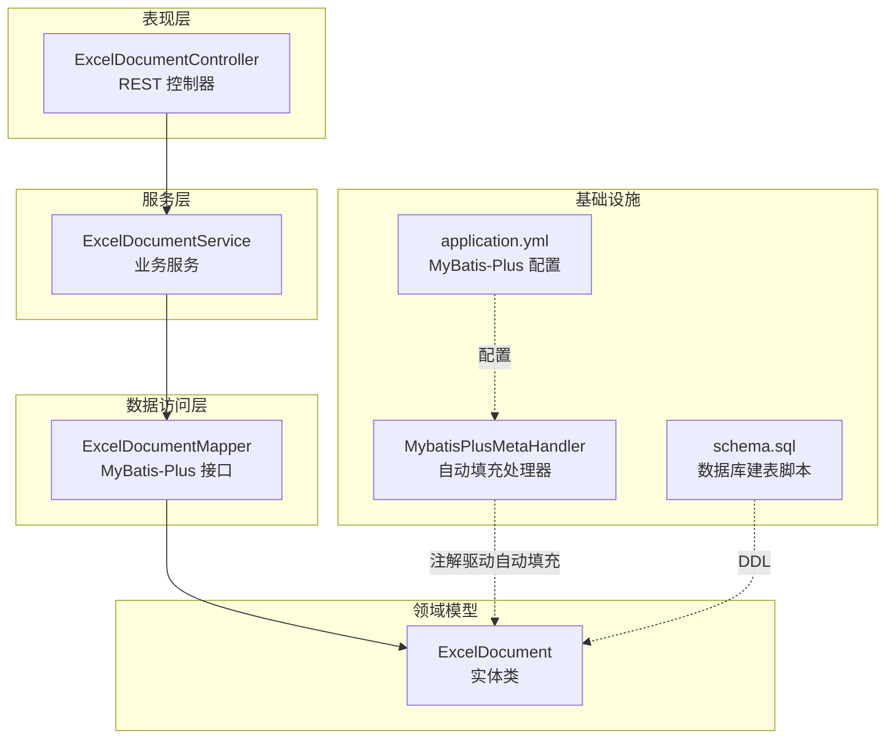
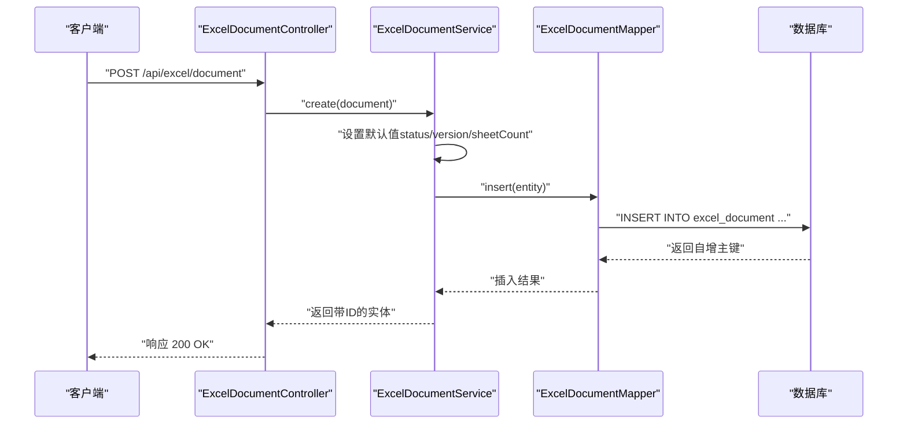
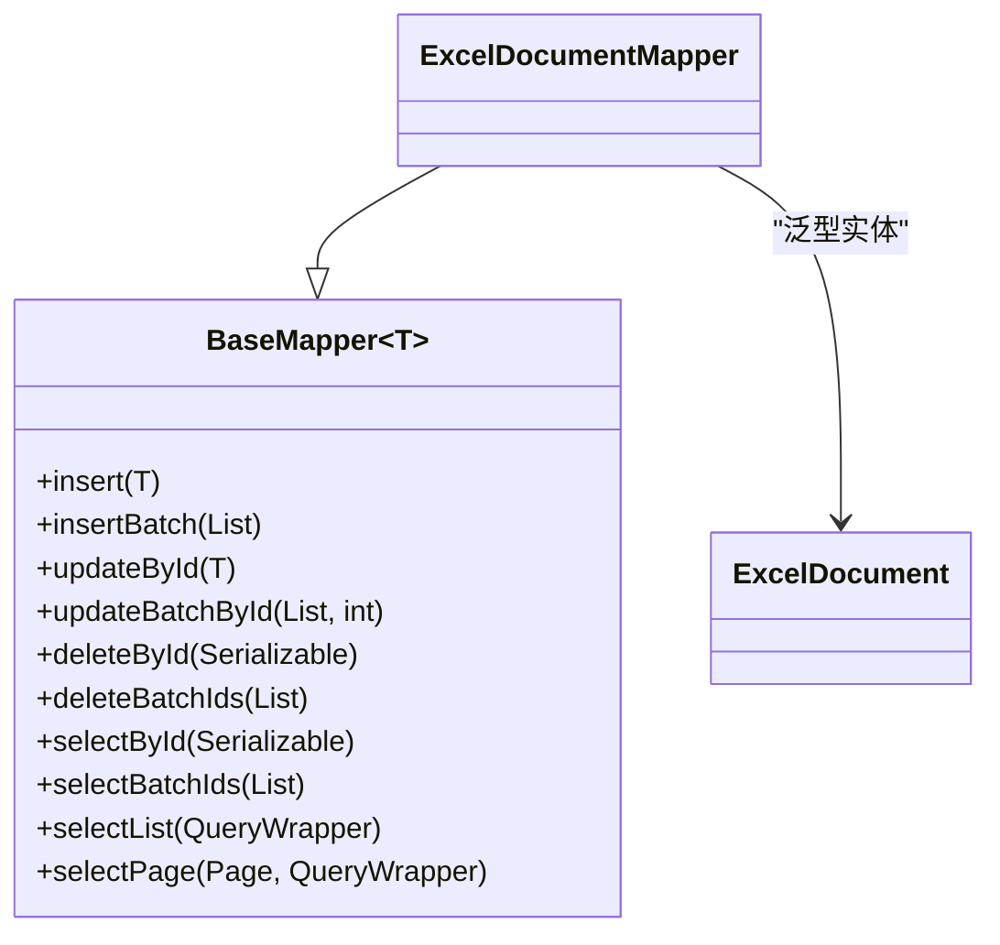
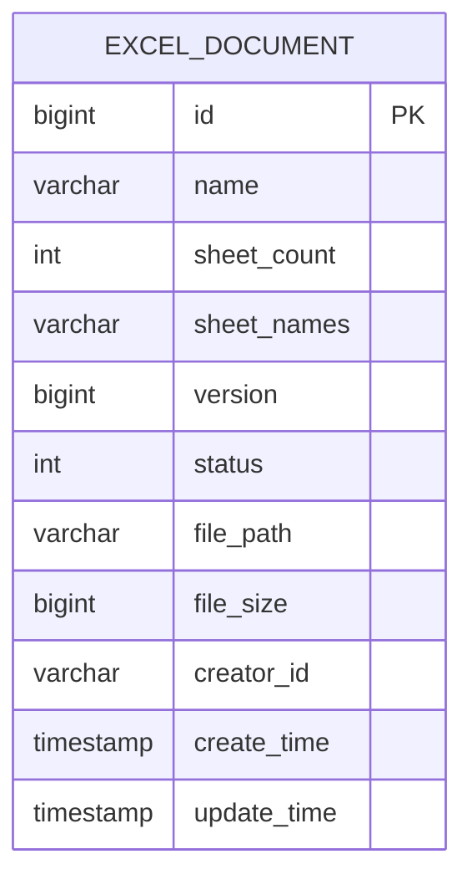
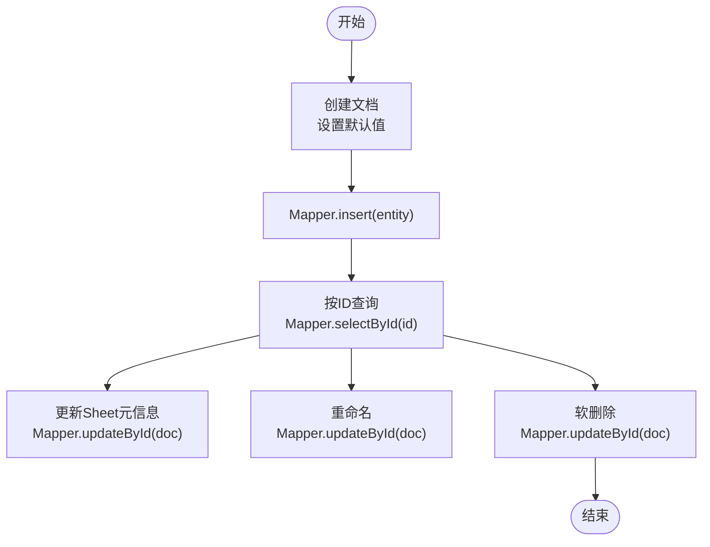
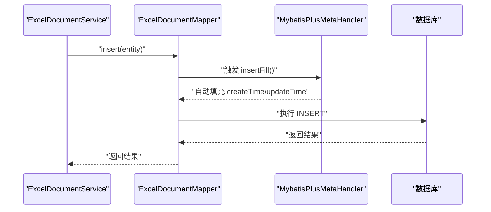
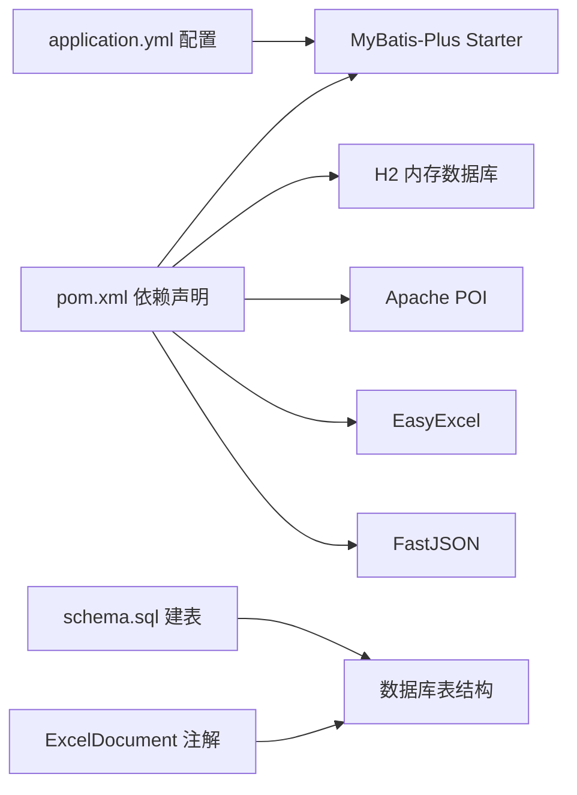

# ExcelDocumentMapper 文档映射器

<cite>
**本文引用的文件**
- [ExcelDocument.java](file://dataloom-server/src/main/java/com/demo/excel/entity/ExcelDocument.java)
- [ExcelDocumentMapper.java](file://dataloom-server/src/main/java/com/demo/excel/mapper/ExcelDocumentMapper.java)
- [ExcelDocumentService.java](file://dataloom-server/src/main/java/com/demo/excel/service/ExcelDocumentService.java)
- [ExcelDocumentController.java](file://dataloom-server/src/main/java/com/demo/excel/controller/ExcelDocumentController.java)
- [MybatisPlusMetaHandler.java](file://dataloom-server/src/main/java/com/demo/excel/config/MybatisPlusMetaHandler.java)
- [application.yml](file://dataloom-server/src/main/resources/application.yml)
- [schema.sql](file://dataloom-server/src/main/resources/schema.sql)
- [pom.xml](file://dataloom-server/pom.xml)
</cite>

## 目录
1. [简介](#简介)
2. [项目结构](#项目结构)
3. [核心组件](#核心组件)
4. [架构总览](#架构总览)
5. [详细组件分析](#详细组件分析)
6. [依赖分析](#依赖分析)
7. [性能考虑](#性能考虑)
8. [故障排查指南](#故障排查指南)
9. [结论](#结论)
10. [附录](#附录)

## 简介
本文件围绕 ExcelDocumentMapper 进行系统化文档化说明，重点涵盖：
- Mapper 接口的继承关系与 MyBatis-Plus 基础能力
- ExcelDocument 实体与数据库表的映射关系（表名、字段、主键策略、逻辑删除、乐观锁）
- 通过 BaseMapper 获得的通用 CRUD 方法使用方式与参数说明
- Service 层对 Mapper 的调用模式与常见数据访问模式（单条、批量）
- MyBatis-Plus 自动填充配置与使用
- 性能优化建议与常见问题解决方案

## 项目结构
本项目采用分层架构：Controller -> Service -> Mapper -> Entity，ExcelDocumentMapper 作为 MyBatis-Plus 的数据访问层接口，位于服务层之下，实体层之上。

图示来源
- [ExcelDocumentController.java:1-296](file://dataloom-server/src/main/java/com/demo/excel/controller/ExcelDocumentController.java#L1-L296)
- [ExcelDocumentService.java:1-119](file://dataloom-server/src/main/java/com/demo/excel/service/ExcelDocumentService.java#L1-L119)
- [ExcelDocumentMapper.java:1-11](file://dataloom-server/src/main/java/com/demo/excel/mapper/ExcelDocumentMapper.java#L1-L11)
- [ExcelDocument.java:1-55](file://dataloom-server/src/main/java/com/demo/excel/entity/ExcelDocument.java#L1-L55)
- [MybatisPlusMetaHandler.java:1-37](file://dataloom-server/src/main/java/com/demo/excel/config/MybatisPlusMetaHandler.java#L1-L37)
- [application.yml:1-51](file://dataloom-server/src/main/resources/application.yml#L1-L51)
- [schema.sql:1-124](file://dataloom-server/src/main/resources/schema.sql#L1-L124)

章节来源
- [ExcelDocumentController.java:1-296](file://dataloom-server/src/main/java/com/demo/excel/controller/ExcelDocumentController.java#L1-L296)
- [ExcelDocumentService.java:1-119](file://dataloom-server/src/main/java/com/demo/excel/service/ExcelDocumentService.java#L1-L119)
- [ExcelDocumentMapper.java:1-11](file://dataloom-server/src/main/java/com/demo/excel/mapper/ExcelDocumentMapper.java#L1-L11)
- [ExcelDocument.java:1-55](file://dataloom-server/src/main/java/com/demo/excel/entity/ExcelDocument.java#L1-L55)
- [MybatisPlusMetaHandler.java:1-37](file://dataloom-server/src/main/java/com/demo/excel/config/MybatisPlusMetaHandler.java#L1-L37)
- [application.yml:1-51](file://dataloom-server/src/main/resources/application.yml#L1-L51)
- [schema.sql:1-124](file://dataloom-server/src/main/resources/schema.sql#L1-L124)

## 核心组件
- ExcelDocumentMapper：继承 MyBatis-Plus 的 BaseMapper，天然具备通用 CRUD 能力，无需手写 SQL。
- ExcelDocument：实体类，标注 @TableName、@TableId、@TableField、@Version 等注解，完成与数据库表字段的映射与行为控制。
- ExcelDocumentService：封装业务逻辑，调用 Mapper 执行数据操作，并处理软删除、分页、状态过滤等。
- MybatisPlusMetaHandler：实现 MetaObjectHandler，在插入/更新时自动填充时间字段，减少重复代码。
- application.yml：启用 MyBatis-Plus 全局配置，包括驼峰映射、日志输出、ID 类型、逻辑删除值等。
- schema.sql：定义 excel_document 表结构，包含主键、默认值、索引等。

章节来源
- [ExcelDocumentMapper.java:1-11](file://dataloom-server/src/main/java/com/demo/excel/mapper/ExcelDocumentMapper.java#L1-L11)
- [ExcelDocument.java:1-55](file://dataloom-server/src/main/java/com/demo/excel/entity/ExcelDocument.java#L1-L55)
- [ExcelDocumentService.java:1-119](file://dataloom-server/src/main/java/com/demo/excel/service/ExcelDocumentService.java#L1-L119)
- [MybatisPlusMetaHandler.java:1-37](file://dataloom-server/src/main/java/com/demo/excel/config/MybatisPlusMetaHandler.java#L1-L37)
- [application.yml:1-51](file://dataloom-server/src/main/resources/application.yml#L1-L51)
- [schema.sql:1-124](file://dataloom-server/src/main/resources/schema.sql#L1-L124)

## 架构总览
下面的序列图展示了典型“创建文档”流程中，控制器、服务与映射器之间的交互。

图示来源
- [ExcelDocumentController.java:238-251](file://dataloom-server/src/main/java/com/demo/excel/controller/ExcelDocumentController.java#L238-L251)
- [ExcelDocumentService.java:31-37](file://dataloom-server/src/main/java/com/demo/excel/service/ExcelDocumentService.java#L31-L37)
- [ExcelDocumentMapper.java:1-11](file://dataloom-server/src/main/java/com/demo/excel/mapper/ExcelDocumentMapper.java#L1-L11)
- [schema.sql:8-20](file://dataloom-server/src/main/resources/schema.sql#L8-L20)

## 详细组件分析

### ExcelDocumentMapper 接口与继承关系
- 继承关系：ExcelDocumentMapper 接口直接继承 MyBatis-Plus 的 BaseMapper<ExcelDocument>，从而获得通用 CRUD 能力。
- 作用：作为数据访问入口，无需编写 SQL，即可完成插入、查询、更新、删除等操作。
- 使用建议：Mapper 层保持“薄层”，复杂查询统一在 Service 层通过 QueryWrapper 组装，Mapper 仅负责基础 CRUD。

图示来源
- [ExcelDocumentMapper.java:1-11](file://dataloom-server/src/main/java/com/demo/excel/mapper/ExcelDocumentMapper.java#L1-L11)

章节来源
- [ExcelDocumentMapper.java:1-11](file://dataloom-server/src/main/java/com/demo/excel/mapper/ExcelDocumentMapper.java#L1-L11)

### ExcelDocument 实体与数据库映射
- 表名映射：@TableName("excel_document") 将实体映射到 excel_document 表。
- 主键策略：@TableId(type = IdType.AUTO) 使用数据库自增主键。
- 字段映射：实体字段与表列通过默认的下划线转驼峰映射（application.yml 已开启 map-underscore-to-camel-case）。
- 默认值与约束：schema.sql 定义了多个默认值与非空约束，确保数据一致性。
- 乐观锁：@Version(version) 字段用于并发控制，配合 Service 层的更新策略使用。
- 逻辑删除：application.yml 配置了逻辑删除值与未删除值，便于软删除。
- 自动填充：@TableField(fill = FieldFill.INSERT) 与 @TableField(fill = FieldFill.INSERT_UPDATE) 配合 MybatisPlusMetaHandler 实现插入/更新时的时间字段自动赋值。

图示来源
- [ExcelDocument.java:15-54](file://dataloom-server/src/main/java/com/demo/excel/entity/ExcelDocument.java#L15-L54)
- [schema.sql:8-20](file://dataloom-server/src/main/resources/schema.sql#L8-L20)

章节来源
- [ExcelDocument.java:15-54](file://dataloom-server/src/main/java/com/demo/excel/entity/ExcelDocument.java#L15-L54)
- [schema.sql:8-20](file://dataloom-server/src/main/resources/schema.sql#L8-L20)
- [application.yml:32-41](file://dataloom-server/src/main/resources/application.yml#L32-L41)

### 通用 CRUD 方法使用与参数说明
以下方法来自 BaseMapper，ExcelDocumentMapper 直接继承使用：
- insert(entity)：插入一条记录，返回受影响行数。适用于创建文档。
- selectById(id)：根据主键查询单条记录，适用于按 ID 获取文档元数据。
- updateById(entity)：根据主键更新记录，适用于重命名、更新 Sheet 元信息、更新时间等。
- deleteById(id)：根据主键删除记录，适用于软删除（结合逻辑删除配置）。
- selectPage(page, wrapper)：分页查询，适用于列表分页。
- selectList(wrapper)：查询列表，适用于条件筛选。
- deleteBatchIds(ids)：批量删除，适用于批量软删除或清理。

章节来源
- [ExcelDocumentService.java:31-37](file://dataloom-server/src/main/java/com/demo/excel/service/ExcelDocumentService.java#L31-L37)
- [ExcelDocumentService.java:61-63](file://dataloom-server/src/main/java/com/demo/excel/service/ExcelDocumentService.java#L61-L63)
- [ExcelDocumentService.java:46-53](file://dataloom-server/src/main/java/com/demo/excel/service/ExcelDocumentService.java#L46-L53)
- [ExcelDocumentService.java:72-78](file://dataloom-server/src/main/java/com/demo/excel/service/ExcelDocumentService.java#L72-L78)
- [ExcelDocumentService.java:86-103](file://dataloom-server/src/main/java/com/demo/excel/service/ExcelDocumentService.java#L86-L103)

### Service 层调用模式与常见数据访问模式
- 单条记录操作
  - 创建：设置默认值后调用 insert，返回带主键的实体。
  - 查询：调用 selectById 获取文档元数据。
  - 更新：构造实体（仅需主键与待更新字段），调用 updateById。
  - 删除：软删除（更新 status），必要时删除物理文件。
- 分页查询：使用 Page 与 QueryWrapper 组装条件（如 status=1、按 update_time 降序）。
- 批量操作：可结合 insertBatch、updateBatchById 等批量方法（Mapper 提供），但通常在 Service 层按批处理业务逻辑。

图示来源
- [ExcelDocumentService.java:31-37](file://dataloom-server/src/main/java/com/demo/excel/service/ExcelDocumentService.java#L31-L37)
- [ExcelDocumentService.java:46-53](file://dataloom-server/src/main/java/com/demo/excel/service/ExcelDocumentService.java#L46-L53)
- [ExcelDocumentService.java:61-63](file://dataloom-server/src/main/java/com/demo/excel/service/ExcelDocumentService.java#L61-L63)
- [ExcelDocumentService.java:86-103](file://dataloom-server/src/main/java/com/demo/excel/service/ExcelDocumentService.java#L86-L103)

章节来源
- [ExcelDocumentService.java:31-37](file://dataloom-server/src/main/java/com/demo/excel/service/ExcelDocumentService.java#L31-L37)
- [ExcelDocumentService.java:46-53](file://dataloom-server/src/main/java/com/demo/excel/service/ExcelDocumentService.java#L46-L53)
- [ExcelDocumentService.java:61-63](file://dataloom-server/src/main/java/com/demo/excel/service/ExcelDocumentService.java#L61-L63)
- [ExcelDocumentService.java:72-78](file://dataloom-server/src/main/java/com/demo/excel/service/ExcelDocumentService.java#L72-L78)
- [ExcelDocumentService.java:86-103](file://dataloom-server/src/main/java/com/demo/excel/service/ExcelDocumentService.java#L86-L103)
- [ExcelDocumentService.java:111-117](file://dataloom-server/src/main/java/com/demo/excel/service/ExcelDocumentService.java#L111-L117)

### MyBatis-Plus 自动填充配置与使用
- 配置位置：MybatisPlusMetaHandler 实现 MetaObjectHandler，在插入与更新时自动填充时间字段。
- 字段映射：实体中通过 @TableField(fill = FieldFill.INSERT) 与 @TableField(fill = FieldFill.INSERT_UPDATE) 标注需要自动填充的字段。
- 全局配置：application.yml 开启 map-underscore-to-camel-case 并设置日志输出，便于调试。
- 使用效果：业务代码无需手动 set createTime/updateTime，提升开发效率与一致性。

图示来源
- [MybatisPlusMetaHandler.java:22-35](file://dataloom-server/src/main/java/com/demo/excel/config/MybatisPlusMetaHandler.java#L22-L35)
- [ExcelDocument.java:48-52](file://dataloom-server/src/main/java/com/demo/excel/entity/ExcelDocument.java#L48-L52)
- [ExcelDocumentService.java:31-37](file://dataloom-server/src/main/java/com/demo/excel/service/ExcelDocumentService.java#L31-L37)

章节来源
- [MybatisPlusMetaHandler.java:1-37](file://dataloom-server/src/main/java/com/demo/excel/config/MybatisPlusMetaHandler.java#L1-L37)
- [ExcelDocument.java:48-52](file://dataloom-server/src/main/java/com/demo/excel/entity/ExcelDocument.java#L48-L52)
- [application.yml:32-36](file://dataloom-server/src/main/resources/application.yml#L32-L36)

## 依赖分析
- Maven 依赖：MyBatis-Plus Starter 提供 ORM 能力与自动配置；H2 用于演示环境；POI/EasyExcel 用于 Excel 解析与导出；FastJSON 用于 JSON 处理。
- 配置依赖：application.yml 中 mybatis-plus.global-config.db-config.id-type、logic-delete-value 等与实体注解共同决定主键策略与逻辑删除行为。
- 实体依赖：ExcelDocument 的注解与 schema.sql 的 DDL 共同决定映射关系与约束。

图示来源
- [pom.xml:32-106](file://dataloom-server/pom.xml#L32-L106)
- [application.yml:31-41](file://dataloom-server/src/main/resources/application.yml#L31-L41)
- [schema.sql:8-20](file://dataloom-server/src/main/resources/schema.sql#L8-L20)
- [ExcelDocument.java:15-54](file://dataloom-server/src/main/java/com/demo/excel/entity/ExcelDocument.java#L15-L54)

章节来源
- [pom.xml:32-106](file://dataloom-server/pom.xml#L32-L106)
- [application.yml:31-41](file://dataloom-server/src/main/resources/application.yml#L31-L41)
- [schema.sql:8-20](file://dataloom-server/src/main/resources/schema.sql#L8-L20)
- [ExcelDocument.java:15-54](file://dataloom-server/src/main/java/com/demo/excel/entity/ExcelDocument.java#L15-L54)

## 性能考虑
- 分页查询：使用 Page 与 QueryWrapper，合理设置排序与过滤条件，避免全表扫描。
- 字段选择：仅查询所需字段，避免 selectList/selectPage 返回过多无关数据。
- 批量操作：对于大量更新/删除，可在 Service 层按批次处理，减少事务时间。
- 索引设计：根据查询模式在 schema.sql 中补充索引（如 status、creator_id、document_id 等），提升查询性能。
- 自动填充：利用自动填充减少业务代码中的时间赋值，降低出错概率。
- 乐观锁：结合 @Version 使用，避免并发覆盖导致的数据不一致。

## 故障排查指南
- 插入后主键为空
  - 检查实体注解 @TableId(type = IdType.AUTO) 是否正确配置。
  - 确认数据库表主键为自增类型。
- 时间字段未自动填充
  - 确认实体字段标注 @TableField(fill = FieldFill.INSERT/INSERT_UPDATE)。
  - 检查 MybatisPlusMetaHandler 是否被 Spring 扫描并注册。
- 逻辑删除无效
  - 检查 application.yml 中 mybatis-plus.global-config.db-config.logic-delete-value 与未删除值配置。
  - 确认实体未显式设置 status 字段覆盖逻辑删除语义。
- 分页查询结果异常
  - 检查 QueryWrapper 条件与排序是否正确。
  - 确认 Page 参数 pageNum/pageSize 合理。
- 软删除后仍可查询到数据
  - 确认 Service 层使用的是 updateById 而非 deleteById（软删除应更新 status）。
  - 检查数据库是否支持逻辑删除（H2/MySQL 配置不同）。

章节来源
- [ExcelDocument.java:15-54](file://dataloom-server/src/main/java/com/demo/excel/entity/ExcelDocument.java#L15-L54)
- [MybatisPlusMetaHandler.java:16-36](file://dataloom-server/src/main/java/com/demo/excel/config/MybatisPlusMetaHandler.java#L16-L36)
- [application.yml:32-41](file://dataloom-server/src/main/resources/application.yml#L32-L41)
- [ExcelDocumentService.java:86-103](file://dataloom-server/src/main/java/com/demo/excel/service/ExcelDocumentService.java#L86-L103)

## 结论
ExcelDocumentMapper 通过继承 MyBatis-Plus 的 BaseMapper，获得了强大的通用 CRUD 能力。结合实体注解与全局配置，实现了表结构与实体的清晰映射、自动填充与逻辑删除等关键特性。Service 层通过封装业务逻辑，将复杂查询与事务控制集中在上层，使数据访问层保持简洁高效。遵循本文的使用规范与性能建议，可稳定支撑大规模数据访问与并发场景。

## 附录
- 常用方法速查
  - 创建：insert(entity)
  - 查询：selectById(id)、selectList(wrapper)、selectPage(page, wrapper)
  - 更新：updateById(entity)
  - 删除：deleteById(id)、deleteBatchIds(ids)
- 配置要点
  - application.yml 中开启驼峰映射与日志输出
  - 全局 ID 类型与逻辑删除值配置
  - 实体注解与 DDL 的一致性校验