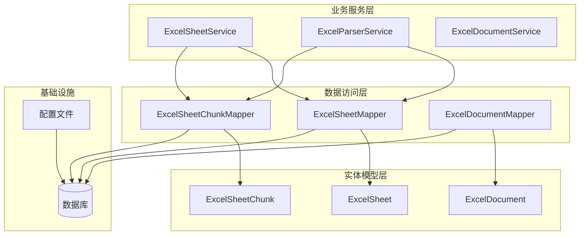
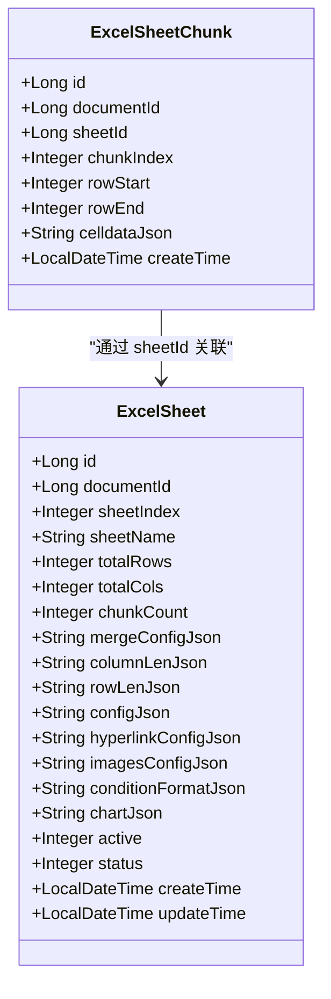
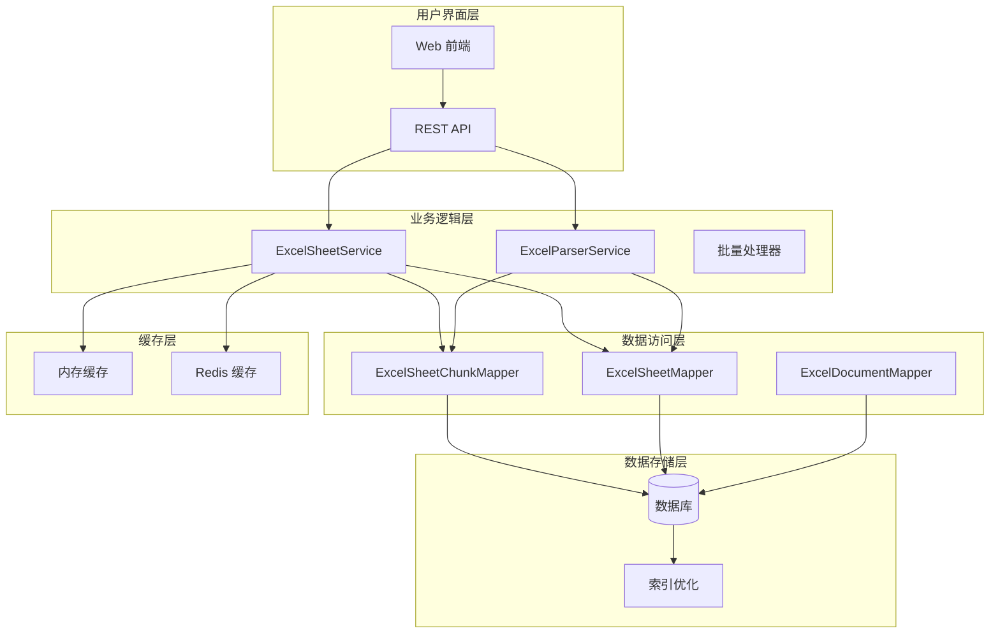
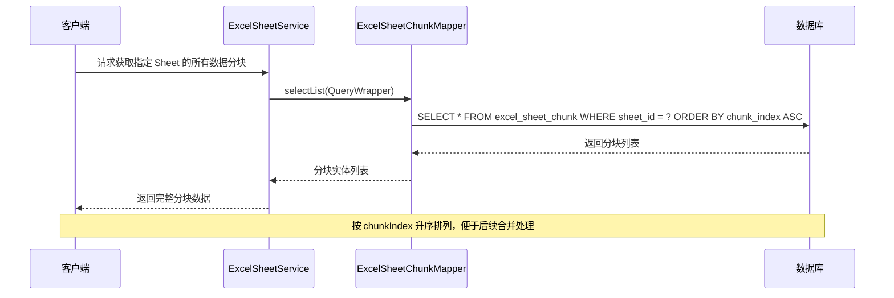
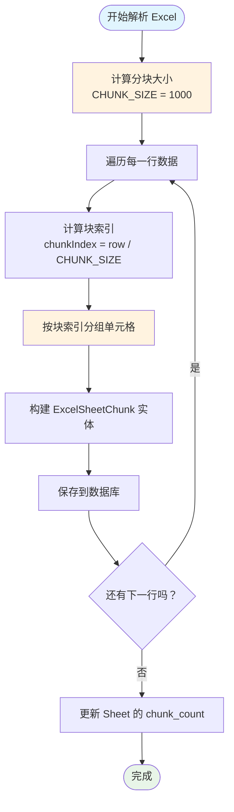
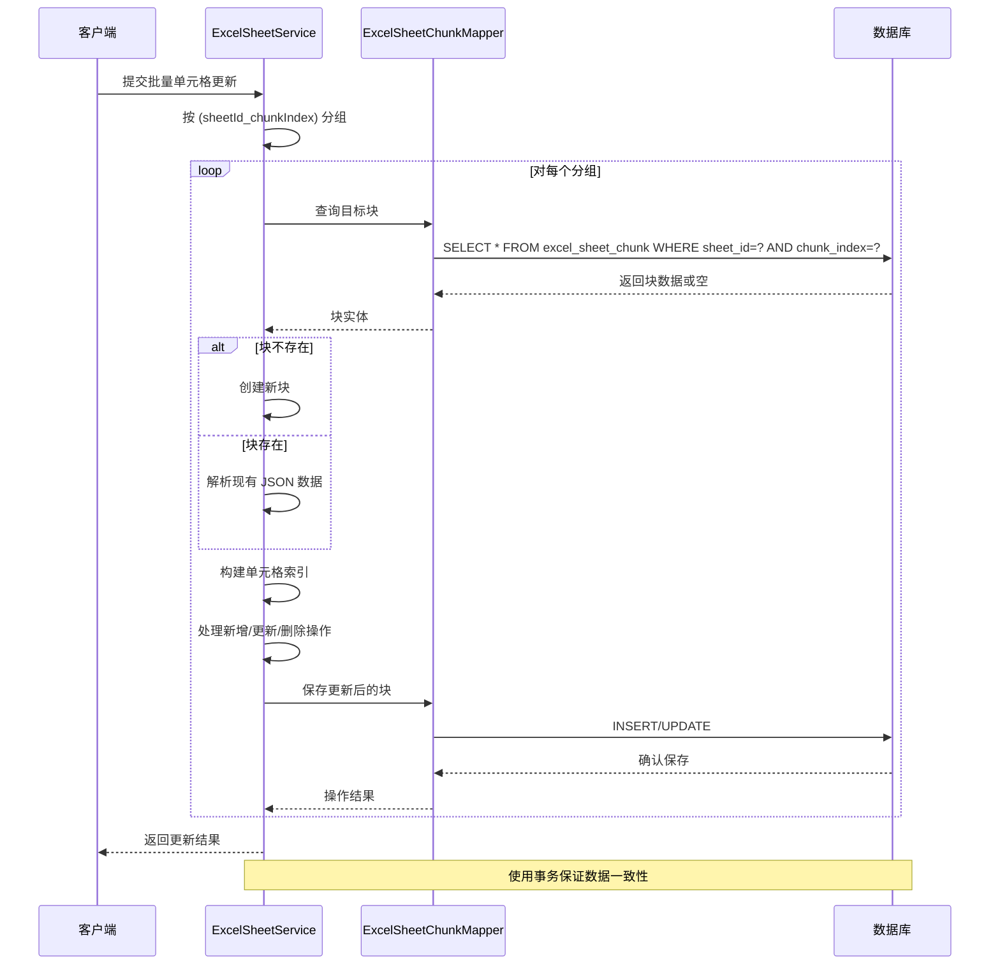
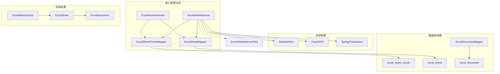

# ExcelSheetChunkMapper 数据块映射器

<cite>
**本文引用的文件**
- [ExcelSheetChunk.java](file://dataloom-server/src/main/java/com/demo/excel/entity/ExcelSheetChunk.java)
- [ExcelSheetChunkMapper.java](file://dataloom-server/src/main/java/com/demo/excel/mapper/ExcelSheetChunkMapper.java)
- [ExcelSheetService.java](file://dataloom-server/src/main/java/com/demo/excel/service/ExcelSheetService.java)
- [ExcelParserService.java](file://dataloom-server/src/main/java/com/demo/excel/service/ExcelParserService.java)
- [ExcelSheet.java](file://dataloom-server/src/main/java/com/demo/excel/entity/ExcelSheet.java)
- [ExcelSheetMapper.java](file://dataloom-server/src/main/java/com/demo/excel/mapper/ExcelSheetMapper.java)
- [schema.sql](file://dataloom-server/src/main/resources/schema.sql)
- [application.yml](file://dataloom-server/src/main/resources/application.yml)
- [ExcelSheetServiceTest.java](file://dataloom-server/src/test/java/com/demo/excel/service/ExcelSheetServiceTest.java)
</cite>

## 目录
1. [简介](#简介)
2. [项目结构](#项目结构)
3. [核心组件](#核心组件)
4. [架构概览](#架构概览)
5. [详细组件分析](#详细组件分析)
6. [依赖关系分析](#依赖关系分析)
7. [性能考虑](#性能考虑)
8. [故障排除指南](#故障排除指南)
9. [结论](#结论)
10. [附录](#附录)

## 简介

ExcelSheetChunkMapper 是 DataLoom 项目中负责 Excel Sheet 数据分块存储的核心组件。该项目采用创新的分块存储策略，将大型 Excel 工作表按行范围切分为多个数据块，每个块包含约 1000 行单元格数据，从而解决了传统单行存储方式在处理十万级数据时遇到的性能瓶颈问题。

该实现基于 MyBatis-Plus 框架，通过数据分块技术实现了高效的大数据量 Excel 处理能力，支持按需加载、增量更新、块级事务处理等高级功能。

## 项目结构

DataLoom 项目采用标准的 Spring Boot 分层架构，主要包含以下模块：



**图表来源**
- [ExcelSheetChunkMapper.java:1-13](file://dataloom-server/src/main/java/com/demo/excel/mapper/ExcelSheetChunkMapper.java#L1-L13)
- [ExcelSheetService.java:34-443](file://dataloom-server/src/main/java/com/demo/excel/service/ExcelSheetService.java#L34-L443)

**章节来源**
- [ExcelSheetChunkMapper.java:1-13](file://dataloom-server/src/main/java/com/demo/excel/mapper/ExcelSheetChunkMapper.java#L1-L13)
- [ExcelSheetService.java:34-443](file://dataloom-server/src/main/java/com/demo/excel/service/ExcelSheetService.java#L34-L443)

## 核心组件

### ExcelSheetChunk 实体类

ExcelSheetChunk 是数据分块存储的核心实体，采用 MyBatis-Plus 注解进行数据库映射：



**图表来源**
- [ExcelSheetChunk.java:20-52](file://dataloom-server/src/main/java/com/demo/excel/entity/ExcelSheetChunk.java#L20-L52)
- [ExcelSheet.java:16-76](file://dataloom-server/src/main/java/com/demo/excel/entity/ExcelSheet.java#L16-L76)

### 数据库表结构

系统采用三表分离的设计模式，通过外键关系实现数据完整性：

| 表名 | 字段 | 类型 | 约束 | 说明 |
|------|------|------|------|------|
| excel_document | id | BIGINT | PRIMARY KEY | 文档主键 |
| excel_document | name | VARCHAR(255) | NOT NULL | 文档名称 |
| excel_sheet | id | BIGINT | PRIMARY KEY | Sheet 主键 |
| excel_sheet | document_id | BIGINT | NOT NULL | 外键关联文档 |
| excel_sheet | sheet_index | INT | DEFAULT 0 | Sheet 下标 |
| excel_sheet | total_rows | INT | DEFAULT 0 | 总行数 |
| excel_sheet | total_cols | INT | DEFAULT 0 | 总列数 |
| excel_sheet | chunk_count | INT | DEFAULT 0 | 分块数量 |
| excel_sheet_chunk | id | BIGINT | PRIMARY KEY | 分块主键 |
| excel_sheet_chunk | sheet_id | BIGINT | NOT NULL | 外键关联 Sheet |
| excel_sheet_chunk | chunk_index | INT | DEFAULT 0 | 块序号 |
| excel_sheet_chunk | row_start | INT | DEFAULT 0 | 起始行号 |
| excel_sheet_chunk | row_end | INT | DEFAULT 0 | 结束行号 |
| excel_sheet_chunk | celldata_json | CLOB | NOT NULL | 单元格数据 JSON |

**章节来源**
- [schema.sql:57-66](file://dataloom-server/src/main/resources/schema.sql#L57-L66)
- [ExcelSheetChunk.java:22-47](file://dataloom-server/src/main/java/com/demo/excel/entity/ExcelSheetChunk.java#L22-L47)

## 架构概览

DataLoom 采用了三层架构设计，通过数据分块策略实现了高效的 Excel 处理能力：



**图表来源**
- [ExcelSheetService.java:34-443](file://dataloom-server/src/main/java/com/demo/excel/service/ExcelSheetService.java#L34-L443)
- [ExcelParserService.java:39-348](file://dataloom-server/src/main/java/com/demo/excel/service/ExcelParserService.java#L39-L348)

## 详细组件分析

### ExcelSheetChunkMapper 接口实现

ExcelSheetChunkMapper 继承自 MyBatis-Plus 的 BaseMapper 接口，提供了基础的 CRUD 操作：



**图表来源**
- [ExcelSheetService.java:67-72](file://dataloom-server/src/main/java/com/demo/excel/service/ExcelSheetService.java#L67-L72)
- [ExcelSheetChunkMapper.java:11](file://dataloom-server/src/main/java/com/demo/excel/mapper/ExcelSheetChunkMapper.java#L11)

### 数据分块存储策略

系统采用基于行号的分块算法，确保数据存储和检索的一致性：



**图表来源**
- [ExcelParserService.java:142-200](file://dataloom-server/src/main/java/com/demo/excel/service/ExcelParserService.java#L142-L200)
- [ExcelSheetService.java:318-346](file://dataloom-server/src/main/java/com/demo/excel/service/ExcelSheetService.java#L318-L346)

### 增量更新机制

系统实现了高效的增量更新功能，支持按块事务处理：



**图表来源**
- [ExcelSheetService.java:104-212](file://dataloom-server/src/main/java/com/demo/excel/service/ExcelSheetService.java#L104-L212)

### 块大小限制和性能优化

系统通过以下机制实现块大小控制和性能优化：

| 参数 | 默认值 | 说明 | 性能影响 |
|------|--------|------|----------|
| CHUNK_SIZE | 1000 | 每块行数 | 影响内存使用和查询性能 |
| celldata_json | CLOB/LONGTEXT | JSON 数据存储 | 影响磁盘空间和网络传输 |
| chunk_index | INT | 块序号 | 影响排序和索引效率 |
| row_start/row_end | INT | 行范围标识 | 影响范围查询性能 |

**章节来源**
- [ExcelParserService.java:44](file://dataloom-server/src/main/java/com/demo/excel/service/ExcelParserService.java#L44)
- [ExcelSheetChunk.java:32-39](file://dataloom-server/src/main/java/com/demo/excel/entity/ExcelSheetChunk.java#L32-L39)

## 依赖关系分析

### 组件耦合度分析



**图表来源**
- [ExcelSheetService.java:36-43](file://dataloom-server/src/main/java/com/demo/excel/service/ExcelSheetService.java#L36-L43)
- [ExcelParserService.java:46-50](file://dataloom-server/src/main/java/com/demo/excel/service/ExcelParserService.java#L46-L50)

### 数据流分析

系统的关键数据流包括：

1. **解析流程**：Excel 文件 → POI 解析 → 分块存储 → 数据库
2. **查询流程**：客户端请求 → 服务层查询 → 分块聚合 → 响应数据
3. **更新流程**：增量更新 → 分块定位 → 原地修改 → 事务提交

**章节来源**
- [ExcelParserService.java:66-87](file://dataloom-server/src/main/java/com/demo/excel/service/ExcelParserService.java#L66-L87)
- [ExcelSheetService.java:103-212](file://dataloom-server/src/main/java/com/demo/excel/service/ExcelSheetService.java#L103-L212)

## 性能考虑

### 索引设计策略

系统在关键字段上建立了复合索引以优化查询性能：

```sql
-- Sheet 级联删除优化
INDEX idx_sheet_id (sheet_id)

-- 文档级联删除优化  
INDEX idx_document_id (document_id)

-- 分块定位优化
INDEX idx_chunk_index (sheet_id, chunk_index)
```

### 内存管理优化

1. **流式处理**：使用 Apache POI 的流式读取避免内存溢出
2. **分块加载**：按需加载数据块，支持懒加载机制
3. **对象复用**：重用 JSON 解析器和缓冲区
4. **垃圾回收**：及时释放临时对象引用

### 查询优化策略

1. **范围查询**：支持按行范围快速定位数据块
2. **批量操作**：批量插入和更新减少数据库往返
3. **索引利用**：合理使用复合索引提高查询效率
4. **缓存策略**：热点数据缓存减少数据库压力

**章节来源**
- [schema.sql:120-123](file://dataloom-server/src/main/resources/schema.sql#L120-L123)
- [ExcelParserService.java:142-200](file://dataloom-server/src/main/java/com/demo/excel/service/ExcelParserService.java#L142-L200)

## 故障排除指南

### 常见问题及解决方案

| 问题类型 | 症状 | 可能原因 | 解决方案 |
|----------|------|----------|----------|
| 内存溢出 | OutOfMemoryError | 单次加载过多数据块 | 调整 CHUNK_SIZE，启用懒加载 |
| 查询缓慢 | 响应时间过长 | 缺少必要索引 | 添加复合索引，优化查询条件 |
| 数据不一致 | 更新丢失 | 事务未正确提交 | 检查事务配置，确认异常处理 |
| 存储不足 | 磁盘空间耗尽 | JSON 数据过大 | 优化数据压缩，定期清理历史数据 |

### 错误处理机制

系统采用多层次的错误处理策略：

1. **事务回滚**：数据库操作失败自动回滚
2. **异常捕获**：单个单元格解析异常不影响整体处理
3. **日志记录**：详细记录错误信息便于调试
4. **降级策略**：部分功能降级保证系统稳定性

**章节来源**
- [ExcelParserService.java:274-277](file://dataloom-server/src/main/java/com/demo/excel/service/ExcelParserService.java#L274-L277)
- [ExcelSheetService.java:103-212](file://dataloom-server/src/main/java/com/demo/excel/service/ExcelSheetService.java#L103-L212)

## 结论

ExcelSheetChunkMapper 作为 DataLoom 项目的核心组件，通过创新的数据分块存储策略成功解决了大规模 Excel 数据处理的技术难题。该实现具有以下优势：

1. **高性能**：通过分块存储和索引优化，支持十万级数据的高效处理
2. **可扩展**：模块化设计便于功能扩展和维护
3. **可靠性**：完善的事务管理和错误处理机制确保数据一致性
4. **易用性**：简洁的 API 设计降低使用复杂度

该系统为类似的大数据处理场景提供了优秀的参考实现，特别是在需要平衡存储效率、查询性能和内存占用的应用场景中具有重要价值。

## 附录

### 配置参数说明

| 参数名 | 默认值 | 说明 | 建议值 |
|--------|--------|------|--------|
| CHUNK_SIZE | 1000 | 每块行数 | 500-2000（根据数据密度调整） |
| 数据库驱动 | H2 | 开发环境默认 | MySQL/PostgreSQL（生产环境） |
| 最大文件大小 | 100MB | 文件上传限制 | 根据业务需求调整 |
| 乐观锁版本 | 1 | 逻辑删除状态 | 1=正常，3=已删除 |

### 最佳实践建议

1. **监控指标**：关注分块大小分布、查询响应时间和内存使用率
2. **容量规划**：根据预期数据量预留足够的存储空间
3. **备份策略**：定期备份重要数据，建立灾难恢复机制
4. **性能测试**：在生产环境部署前进行充分的压力测试
5. **运维监控**：建立完善的监控告警体系