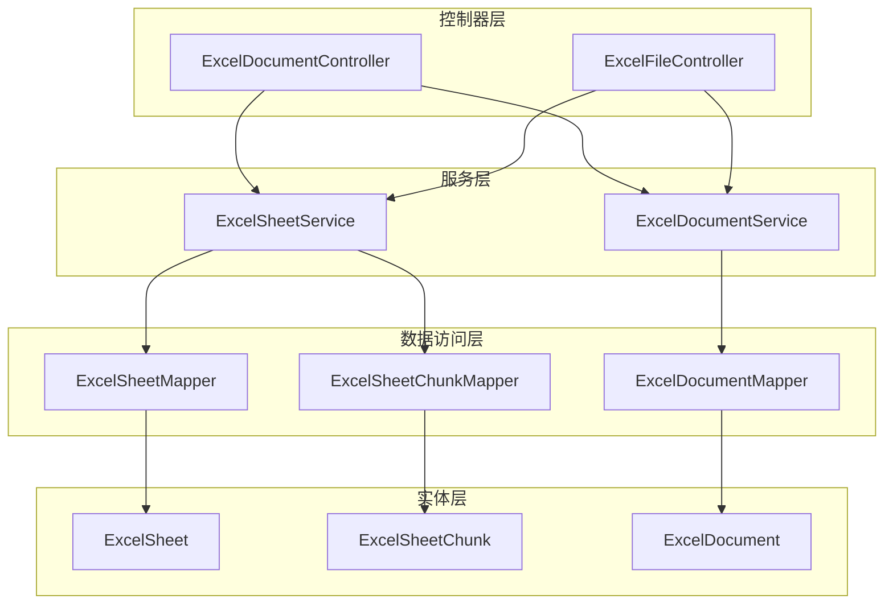
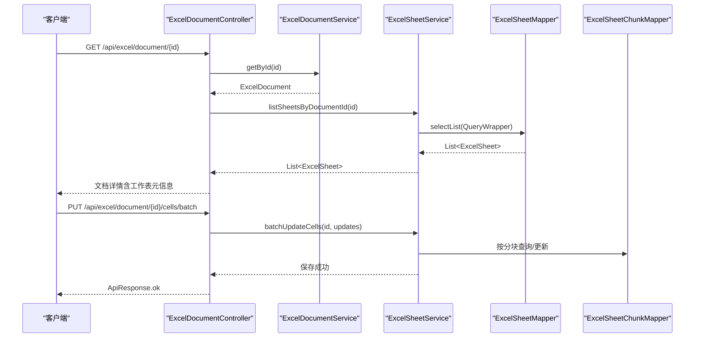
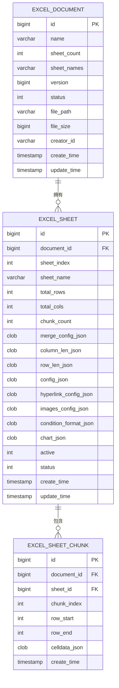
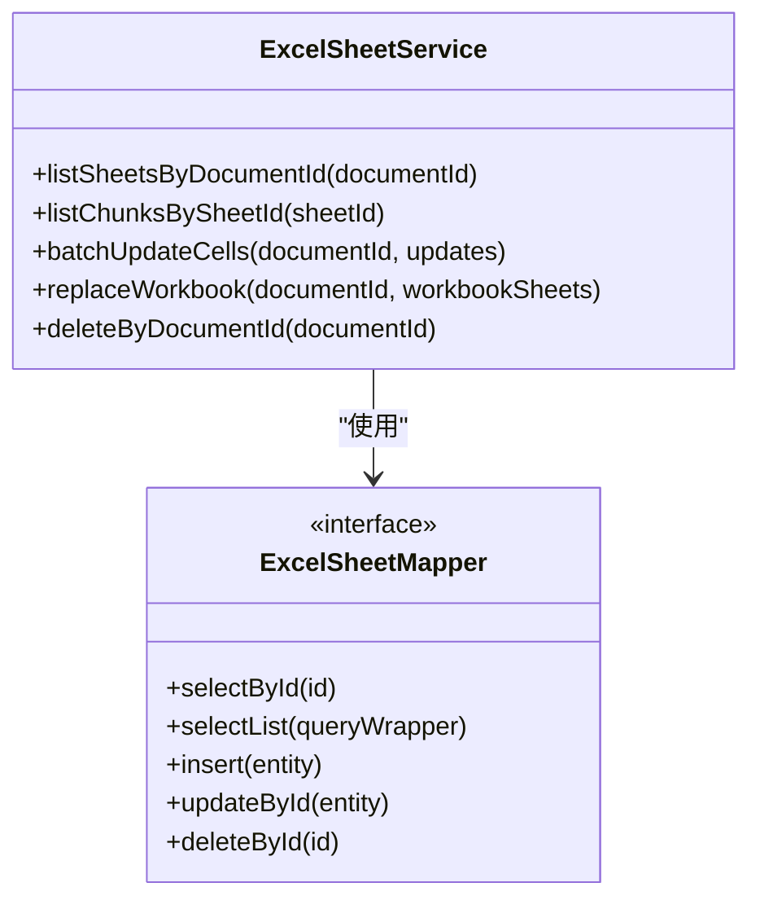
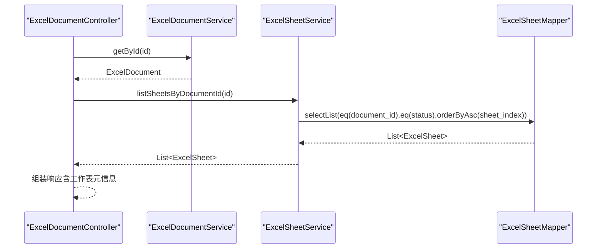
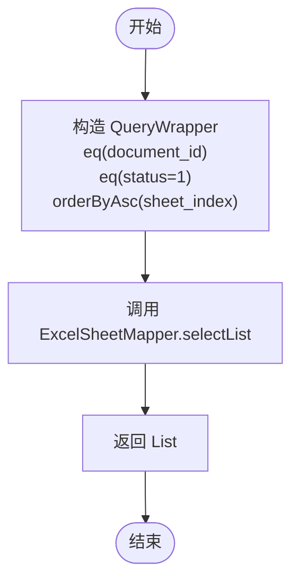
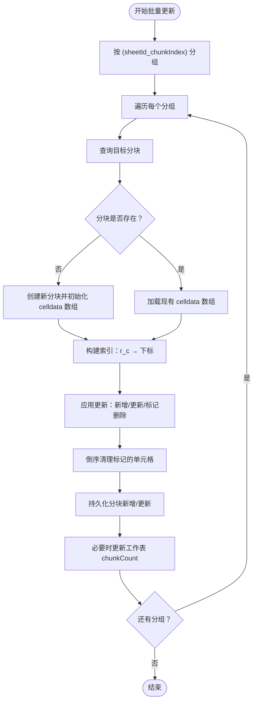
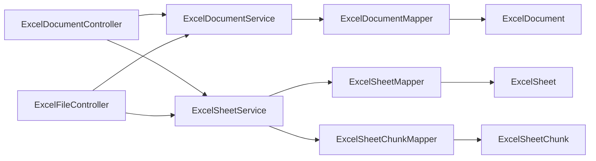

# ExcelSheetMapper 工作表映射器

<cite>
**本文引用的文件**
- [ExcelSheet.java](file://dataloom-server/src/main/java/com/demo/excel/entity/ExcelSheet.java)
- [ExcelSheetMapper.java](file://dataloom-server/src/main/java/com/demo/excel/mapper/ExcelSheetMapper.java)
- [ExcelSheetService.java](file://dataloom-server/src/main/java/com/demo/excel/service/ExcelSheetService.java)
- [ExcelSheetChunk.java](file://dataloom-server/src/main/java/com/demo/excel/entity/ExcelSheetChunk.java)
- [ExcelSheetChunkMapper.java](file://dataloom-server/src/main/java/com/demo/excel/mapper/ExcelSheetChunkMapper.java)
- [ExcelDocument.java](file://dataloom-server/src/main/java/com/demo/excel/entity/ExcelDocument.java)
- [ExcelDocumentMapper.java](file://dataloom-server/src/main/java/com/demo/excel/mapper/ExcelDocumentMapper.java)
- [ExcelDocumentService.java](file://dataloom-server/src/main/java/com/demo/excel/service/ExcelDocumentService.java)
- [ExcelDocumentController.java](file://dataloom-server/src/main/java/com/demo/excel/controller/ExcelDocumentController.java)
- [ExcelFileController.java](file://dataloom-server/src/main/java/com/demo/excel/controller/ExcelFileController.java)
- [schema.sql](file://dataloom-server/src/main/resources/schema.sql)
- [application.yml](file://dataloom-server/src/main/resources/application.yml)
- [ExcelServiceApplication.java](file://dataloom-server/src/main/java/com/demo/excel/ExcelServiceApplication.java)
- [ExcelSheetServiceTest.java](file://dataloom-server/src/test/java/com/demo/excel/service/ExcelSheetServiceTest.java)
</cite>

## 目录
1. [简介](#简介)
2. [项目结构](#项目结构)
3. [核心组件](#核心组件)
4. [架构概览](#架构概览)
5. [详细组件分析](#详细组件分析)
6. [依赖关系分析](#依赖关系分析)
7. [性能考量](#性能考量)
8. [故障排查指南](#故障排查指南)
9. [结论](#结论)
10. [附录](#附录)

## 简介
本文件围绕 ExcelSheetMapper 的设计与实现进行深入说明，重点涵盖：
- 工作表数据访问层的设计思路与实现方式
- ExcelSheet 实体类与数据库表的映射关系（基本信息、元数据字段、索引策略）
- 通过 BaseMapper 接口提供的通用操作方法在工作表场景下的具体应用
- 工作表与文档之间的关联关系及通过 Mapper 实现的相关查询
- 复杂查询示例（按文档 ID 查询所有工作表、工作表排序、分页查询）
- 工作表数据的增删改查最佳实践
- 查询性能优化策略与缓存机制的应用

## 项目结构
该项目采用 Spring Boot + MyBatis-Plus 的分层架构，核心模块包括：
- 实体层：ExcelSheet、ExcelSheetChunk、ExcelDocument
- Mapper 层：ExcelSheetMapper、ExcelSheetChunkMapper、ExcelDocumentMapper
- Service 层：ExcelSheetService、ExcelDocumentService
- 控制器层：ExcelDocumentController、ExcelFileController
- 配置与资源：application.yml、schema.sql

**图表来源**
- [ExcelDocumentController.java:1-296](file://dataloom-server/src/main/java/com/demo/excel/controller/ExcelDocumentController.java#L1-L296)
- [ExcelFileController.java:1-141](file://dataloom-server/src/main/java/com/demo/excel/controller/ExcelFileController.java#L1-L141)
- [ExcelSheetService.java:1-443](file://dataloom-server/src/main/java/com/demo/excel/service/ExcelSheetService.java#L1-L443)
- [ExcelDocumentService.java:1-119](file://dataloom-server/src/main/java/com/demo/excel/service/ExcelDocumentService.java#L1-L119)
- [ExcelSheetMapper.java:1-13](file://dataloom-server/src/main/java/com/demo/excel/mapper/ExcelSheetMapper.java#L1-L13)
- [ExcelSheetChunkMapper.java:1-13](file://dataloom-server/src/main/java/com/demo/excel/mapper/ExcelSheetChunkMapper.java#L1-L13)
- [ExcelDocumentMapper.java:1-11](file://dataloom-server/src/main/java/com/demo/excel/mapper/ExcelDocumentMapper.java#L1-L11)
- [ExcelSheet.java:1-77](file://dataloom-server/src/main/java/com/demo/excel/entity/ExcelSheet.java#L1-L77)
- [ExcelSheetChunk.java:1-53](file://dataloom-server/src/main/java/com/demo/excel/entity/ExcelSheetChunk.java#L1-L53)
- [ExcelDocument.java:1-55](file://dataloom-server/src/main/java/com/demo/excel/entity/ExcelDocument.java#L1-L55)

**章节来源**
- [ExcelServiceApplication.java:1-21](file://dataloom-server/src/main/java/com/demo/excel/ExcelServiceApplication.java#L1-L21)
- [application.yml:1-51](file://dataloom-server/src/main/resources/application.yml#L1-L51)

## 核心组件
- ExcelSheetMapper：继承 MyBatis-Plus 的 BaseMapper，提供工作表实体的基础 CRUD 能力；业务查询统一在 Service 层通过 QueryWrapper 组装，Mapper 层保持最小职责。
- ExcelSheetService：封装工作表与数据分块的复杂业务逻辑，包括按文档查询工作表、按工作表查询分块、批量增量更新单元格、全量替换工作簿等。
- ExcelSheet：工作表元信息实体，映射 excel_sheet 表，包含工作表基本信息、Luckysheet 配置 JSON 字段、状态与时间戳等。
- ExcelSheetChunk：工作表数据分块实体，映射 excel_sheet_chunk 表，按行范围切片存储 celldata，解决大规模数据存储与性能问题。
- ExcelDocument：文档主表实体，仅存元数据，包含 sheetCount、sheetNames 等字段，与工作表形成一对多关系。

**章节来源**
- [ExcelSheetMapper.java:1-13](file://dataloom-server/src/main/java/com/demo/excel/mapper/ExcelSheetMapper.java#L1-L13)
- [ExcelSheetService.java:1-443](file://dataloom-server/src/main/java/com/demo/excel/service/ExcelSheetService.java#L1-L443)
- [ExcelSheet.java:1-77](file://dataloom-server/src/main/java/com/demo/excel/entity/ExcelSheet.java#L1-L77)
- [ExcelSheetChunk.java:1-53](file://dataloom-server/src/main/java/com/demo/excel/entity/ExcelSheetChunk.java#L1-L53)
- [ExcelDocument.java:1-55](file://dataloom-server/src/main/java/com/demo/excel/entity/ExcelDocument.java#L1-L55)

## 架构概览
系统采用“文档-工作表-分块”的三层数据模型，通过 Service 层协调 Mapper 层完成复杂查询与事务性写入。控制器层负责对外暴露 API，服务层负责业务编排与性能优化。

**图表来源**
- [ExcelDocumentController.java:70-190](file://dataloom-server/src/main/java/com/demo/excel/controller/ExcelDocumentController.java#L70-L190)
- [ExcelSheetService.java:45-212](file://dataloom-server/src/main/java/com/demo/excel/service/ExcelSheetService.java#L45-L212)
- [ExcelSheetMapper.java:1-13](file://dataloom-server/src/main/java/com/demo/excel/mapper/ExcelSheetMapper.java#L1-L13)
- [ExcelSheetChunkMapper.java:1-13](file://dataloom-server/src/main/java/com/demo/excel/mapper/ExcelSheetChunkMapper.java#L1-L13)

## 详细组件分析

### ExcelSheet 实体与数据库映射
- 表名映射：@TableName("excel_sheet") 映射到 excel_sheet 表。
- 主键策略：@TableId(type = IdType.AUTO) 使用自增主键。
- 关系字段：documentId 表示所属文档 ID，与 ExcelDocument 建立一对多关系。
- 元信息字段：sheetIndex、sheetName、totalRows、totalCols、chunkCount 等。
- Luckysheet 配置 JSON 字段：mergeConfigJson、columnLenJson、rowLenJson、configJson、hyperlinkConfigJson、imagesConfigJson、conditionFormatJson、chartJson。
- 状态与时间戳：status（1 正常，3 已删除），createTime、updateTime 使用 MyBatis-Plus 的自动填充注解。

**图表来源**
- [schema.sql:25-66](file://dataloom-server/src/main/resources/schema.sql#L25-L66)
- [ExcelSheet.java:14-76](file://dataloom-server/src/main/java/com/demo/excel/entity/ExcelSheet.java#L14-L76)
- [ExcelSheetChunk.java:18-52](file://dataloom-server/src/main/java/com/demo/excel/entity/ExcelSheetChunk.java#L18-L52)
- [ExcelDocument.java:15-54](file://dataloom-server/src/main/java/com/demo/excel/entity/ExcelDocument.java#L15-L54)

**章节来源**
- [ExcelSheet.java:1-77](file://dataloom-server/src/main/java/com/demo/excel/entity/ExcelSheet.java#L1-L77)
- [schema.sql:25-66](file://dataloom-server/src/main/resources/schema.sql#L25-L66)

### ExcelSheetMapper 接口与 BaseMapper 应用
- 接口定义：ExcelSheetMapper 继承 BaseMapper<ExcelSheet>，获得标准 CRUD 能力（selectById、selectList、insert、updateById、deleteById 等）。
- 查询策略：业务查询统一在 Service 层通过 QueryWrapper 组装，Mapper 层保持最小职责，避免在 Mapper 中编写复杂 SQL。
- 事务边界：复杂写入操作（如批量增量更新、全量替换）在 Service 层以事务包裹，确保一致性。

**图表来源**
- [ExcelSheetMapper.java:1-13](file://dataloom-server/src/main/java/com/demo/excel/mapper/ExcelSheetMapper.java#L1-L13)
- [ExcelSheetService.java:45-91](file://dataloom-server/src/main/java/com/demo/excel/service/ExcelSheetService.java#L45-L91)

**章节来源**
- [ExcelSheetMapper.java:1-13](file://dataloom-server/src/main/java/com/demo/excel/mapper/ExcelSheetMapper.java#L1-L13)
- [ExcelSheetService.java:45-91](file://dataloom-server/src/main/java/com/demo/excel/service/ExcelSheetService.java#L45-L91)

### 工作表与文档的关联关系
- 一对多关系：ExcelDocument 与 ExcelSheet 通过 documentId 关联，一个文档可包含多个工作表。
- 控制器交互：控制器在获取文档详情时，先查询文档元数据，再通过 Service 查询该文档下的所有工作表元信息。
- 索引策略：数据库层面为 excel_sheet 添加了基于 document_id 的索引，便于按文档 ID 查询工作表。

**图表来源**
- [ExcelDocumentController.java:77-131](file://dataloom-server/src/main/java/com/demo/excel/controller/ExcelDocumentController.java#L77-L131)
- [ExcelSheetService.java:51-57](file://dataloom-server/src/main/java/com/demo/excel/service/ExcelSheetService.java#L51-L57)
- [ExcelSheetMapper.java:1-13](file://dataloom-server/src/main/java/com/demo/excel/mapper/ExcelSheetMapper.java#L1-L13)
- [schema.sql:108-109](file://dataloom-server/src/main/resources/schema.sql#L108-L109)

**章节来源**
- [ExcelDocumentController.java:77-131](file://dataloom-server/src/main/java/com/demo/excel/controller/ExcelDocumentController.java#L77-L131)
- [ExcelSheetService.java:51-57](file://dataloom-server/src/main/java/com/demo/excel/service/ExcelSheetService.java#L51-L57)
- [schema.sql:108-109](file://dataloom-server/src/main/resources/schema.sql#L108-L109)

### 复杂查询实现示例

#### 示例一：根据文档 ID 查询所有工作表
- 查询逻辑：在 Service 层构造 QueryWrapper，限定 status=1，按 sheet_index 升序排列，调用 Mapper 的 selectList。
- 返回结果：工作表元信息列表，不含 celldata，避免响应体过大。

**图表来源**
- [ExcelSheetService.java:51-57](file://dataloom-server/src/main/java/com/demo/excel/service/ExcelSheetService.java#L51-L57)
- [ExcelSheetMapper.java:1-13](file://dataloom-server/src/main/java/com/demo/excel/mapper/ExcelSheetMapper.java#L1-L13)

**章节来源**
- [ExcelSheetService.java:51-57](file://dataloom-server/src/main/java/com/demo/excel/service/ExcelSheetService.java#L51-L57)

#### 示例二：工作表排序
- 排序依据：按 sheet_index 升序，确保工作表顺序与源文件一致。
- 实现位置：在 listSheetsByDocumentId 方法中通过 orderByAsc("sheet_index") 实现。

**章节来源**
- [ExcelSheetService.java:51-57](file://dataloom-server/src/main/java/com/demo/excel/service/ExcelSheetService.java#L51-L57)

#### 示例三：分页查询（基于文档列表）
- 文档分页：ExcelDocumentService 提供分页查询文档列表，按更新时间降序排列。
- 工作表分页：当前工作表查询未提供分页参数，如需分页可在 Service 层扩展分页逻辑。

**章节来源**
- [ExcelDocumentService.java:72-78](file://dataloom-server/src/main/java/com/demo/excel/service/ExcelDocumentService.java#L72-L78)

### 增删改查最佳实践

#### 读取工作表元信息
- 使用 listSheetsByDocumentId 获取工作表元信息，避免一次性加载 celldata。
- 控制器在文档详情接口中仅返回必要的元信息，提高响应速度。

**章节来源**
- [ExcelSheetService.java:51-57](file://dataloom-server/src/main/java/com/demo/excel/service/ExcelSheetService.java#L51-L57)
- [ExcelDocumentController.java:77-131](file://dataloom-server/src/main/java/com/demo/excel/controller/ExcelDocumentController.java#L77-L131)

#### 批量增量更新单元格
- 分块策略：按行范围（默认 1000 行/块）分组，减少数据库 I/O。
- 索引优化：在内存中维护 "r_c" → 数组下标的索引，将查找从 O(n) 降至 O(1)。
- 事务保护：在 Service 层以事务包裹，确保批量更新的一致性。

**图表来源**
- [ExcelSheetService.java:103-212](file://dataloom-server/src/main/java/com/demo/excel/service/ExcelSheetService.java#L103-L212)

**章节来源**
- [ExcelSheetService.java:103-212](file://dataloom-server/src/main/java/com/demo/excel/service/ExcelSheetService.java#L103-L212)

#### 全量替换工作簿
- 流程：物理删除所有分块 → 软删除所有工作表 → 逐工作表插入新记录并保存 celldata → 更新文档 sheet 元信息。
- 返回 sheetIndex → 新 SheetId 的映射，供前端后续增量保存。

**章节来源**
- [ExcelSheetService.java:221-316](file://dataloom-server/src/main/java/com/demo/excel/service/ExcelSheetService.java#L221-L316)

#### 删除文档下的工作表与分块
- 软删除工作表：将 status 设为 3。
- 物理删除分块：由于分块数量可能很大，直接物理删除以避免逻辑删除带来的复杂性。

**章节来源**
- [ExcelSheetService.java:79-91](file://dataloom-server/src/main/java/com/demo/excel/service/ExcelSheetService.java#L79-L91)

## 依赖关系分析

**图表来源**
- [ExcelDocumentController.java:1-296](file://dataloom-server/src/main/java/com/demo/excel/controller/ExcelDocumentController.java#L1-L296)
- [ExcelFileController.java:1-141](file://dataloom-server/src/main/java/com/demo/excel/controller/ExcelFileController.java#L1-L141)
- [ExcelSheetService.java:1-443](file://dataloom-server/src/main/java/com/demo/excel/service/ExcelSheetService.java#L1-L443)
- [ExcelDocumentService.java:1-119](file://dataloom-server/src/main/java/com/demo/excel/service/ExcelDocumentService.java#L1-L119)
- [ExcelSheetMapper.java:1-13](file://dataloom-server/src/main/java/com/demo/excel/mapper/ExcelSheetMapper.java#L1-L13)
- [ExcelSheetChunkMapper.java:1-13](file://dataloom-server/src/main/java/com/demo/excel/mapper/ExcelSheetChunkMapper.java#L1-L13)
- [ExcelDocumentMapper.java:1-11](file://dataloom-server/src/main/java/com/demo/excel/mapper/ExcelDocumentMapper.java#L1-L11)
- [ExcelSheet.java:1-77](file://dataloom-server/src/main/java/com/demo/excel/entity/ExcelSheet.java#L1-L77)
- [ExcelSheetChunk.java:1-53](file://dataloom-server/src/main/java/com/demo/excel/entity/ExcelSheetChunk.java#L1-L53)
- [ExcelDocument.java:1-55](file://dataloom-server/src/main/java/com/demo/excel/entity/ExcelDocument.java#L1-L55)

**章节来源**
- [ExcelDocumentController.java:1-296](file://dataloom-server/src/main/java/com/demo/excel/controller/ExcelDocumentController.java#L1-L296)
- [ExcelFileController.java:1-141](file://dataloom-server/src/main/java/com/demo/excel/controller/ExcelFileController.java#L1-L141)
- [ExcelSheetService.java:1-443](file://dataloom-server/src/main/java/com/demo/excel/service/ExcelSheetService.java#L1-L443)
- [ExcelDocumentService.java:1-119](file://dataloom-server/src/main/java/com/demo/excel/service/ExcelDocumentService.java#L1-L119)

## 性能考量
- 分块存储：将 celldata 按 1000 行/块切分，单块 JSON 通常在几百 KB 以内，支持按需加载，显著降低内存占用与网络传输压力。
- 索引优化：在 Service 层构建内存索引（r_c → 下标），将查找复杂度从 O(n) 降至 O(1)，提升批量更新性能。
- 事务批处理：按分块分组后逐块写入，减少数据库往返次数，提高吞吐量。
- 数据库索引：为 excel_sheet 的 document_id 字段建立索引，加速按文档 ID 查询工作表。
- 配置优化：MyBatis-Plus 开启驼峰命名映射与日志输出，便于调试与性能观察。

**章节来源**
- [ExcelSheetChunk.java:9-17](file://dataloom-server/src/main/java/com/demo/excel/entity/ExcelSheetChunk.java#L9-L17)
- [ExcelSheetService.java:103-212](file://dataloom-server/src/main/java/com/demo/excel/service/ExcelSheetService.java#L103-L212)
- [schema.sql:108-122](file://dataloom-server/src/main/resources/schema.sql#L108-L122)
- [application.yml:32-41](file://dataloom-server/src/main/resources/application.yml#L32-L41)

## 故障排查指南
- 单元格更新失败：检查 updates 参数格式是否符合要求（包含 sheetId、r、c、v），确认 Service 层的分组与索引构建逻辑。
- 全量替换异常：确认传入的 workbookSheets 不为空且结构正确，关注事务回滚点与分块插入顺序。
- 文档删除后仍残留数据：确认删除流程中是否正确执行了软删除工作表与物理删除分块。
- 性能问题：核对分块大小设置、索引构建与倒序清理策略，避免频繁重建索引导致性能下降。

**章节来源**
- [ExcelSheetService.java:103-212](file://dataloom-server/src/main/java/com/demo/excel/service/ExcelSheetService.java#L103-L212)
- [ExcelSheetServiceTest.java:44-107](file://dataloom-server/src/test/java/com/demo/excel/service/ExcelSheetServiceTest.java#L44-L107)

## 结论
ExcelSheetMapper 通过继承 BaseMapper 提供了简洁的 CRUD 能力，结合 Service 层的复杂业务逻辑与分块存储策略，实现了对大规模工作表数据的高效管理。通过合理的索引设计与事务批处理，系统在保证一致性的同时提升了性能与可维护性。建议在实际生产环境中进一步完善工作表分页查询与缓存策略，并持续监控数据库索引与查询计划以优化性能。

## 附录
- 数据库建表脚本与索引参考：schema.sql
- 应用配置参考：application.yml
- 单元测试参考：ExcelSheetServiceTest

**章节来源**
- [schema.sql:1-124](file://dataloom-server/src/main/resources/schema.sql#L1-L124)
- [application.yml:1-51](file://dataloom-server/src/main/resources/application.yml#L1-L51)
- [ExcelSheetServiceTest.java:1-109](file://dataloom-server/src/test/java/com/demo/excel/service/ExcelSheetServiceTest.java#L1-L109)