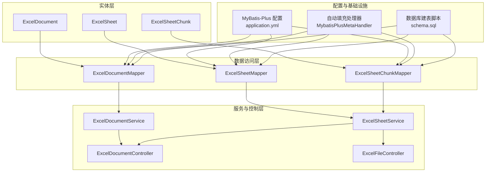
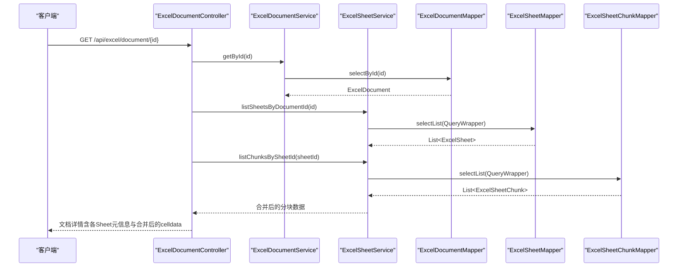
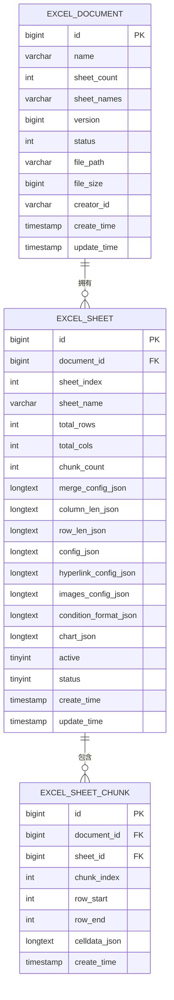
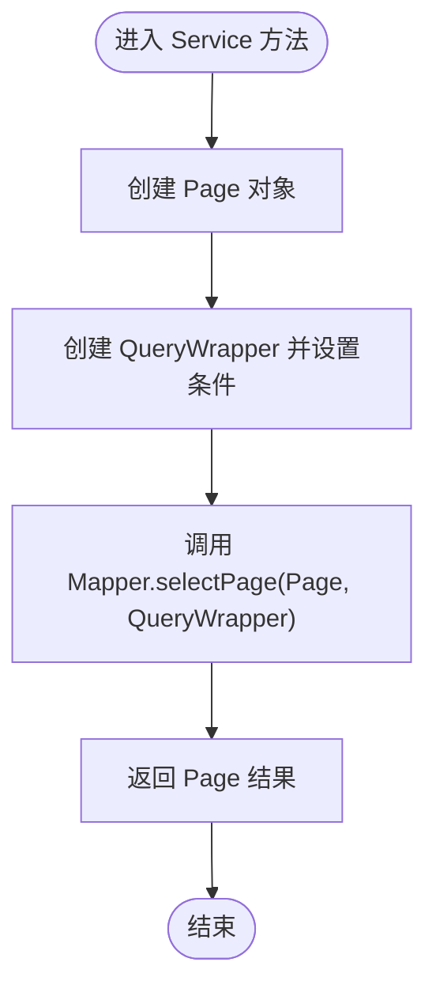
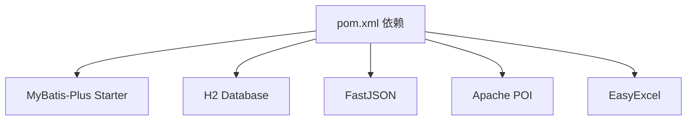

# 数据访问层（Mapper）

<cite>
**本文引用的文件**
- [ExcelDocumentMapper.java](file://dataloom-server/src/main/java/com/demo/excel/mapper/ExcelDocumentMapper.java)
- [ExcelSheetMapper.java](file://dataloom-server/src/main/java/com/demo/excel/mapper/ExcelSheetMapper.java)
- [ExcelSheetChunkMapper.java](file://dataloom-server/src/main/java/com/demo/excel/mapper/ExcelSheetChunkMapper.java)
- [ExcelDocument.java](file://dataloom-server/src/main/java/com/demo/excel/entity/ExcelDocument.java)
- [ExcelSheet.java](file://dataloom-server/src/main/java/com/demo/excel/entity/ExcelSheet.java)
- [ExcelSheetChunk.java](file://dataloom-server/src/main/java/com/demo/excel/entity/ExcelSheetChunk.java)
- [MybatisPlusMetaHandler.java](file://dataloom-server/src/main/java/com/demo/excel/config/MybatisPlusMetaHandler.java)
- [application.yml](file://dataloom-server/src/main/resources/application.yml)
- [schema.sql](file://dataloom-server/src/main/resources/schema.sql)
- [ExcelDocumentService.java](file://dataloom-server/src/main/java/com/demo/excel/service/ExcelDocumentService.java)
- [ExcelSheetService.java](file://dataloom-server/src/main/java/com/demo/excel/service/ExcelSheetService.java)
- [ExcelDocumentController.java](file://dataloom-server/src/main/java/com/demo/excel/controller/ExcelDocumentController.java)
- [ExcelFileController.java](file://dataloom-server/src/main/java/com/demo/excel/controller/ExcelFileController.java)
- [pom.xml](file://dataloom-server/pom.xml)
</cite>

## 目录
1. [简介](#简介)
2. [项目结构](#项目结构)
3. [核心组件](#核心组件)
4. [架构总览](#架构总览)
5. [详细组件分析](#详细组件分析)
6. [依赖分析](#依赖分析)
7. [性能考虑](#性能考虑)
8. [故障排查指南](#故障排查指南)
9. [结论](#结论)
10. [附录](#附录)

## 简介
本章节面向数据访问层（Mapper）的设计与实现，围绕 MyBatis-Plus 框架的集成与使用进行系统性说明。重点覆盖：
- Mapper 接口的定义与职责边界
- 实体类与数据库表的映射关系（字段映射、主键策略、自动填充）
- 条件构造器 QueryWrapper 的使用范式
- 分页查询与软删除策略
- 复杂查询（联表查询、聚合统计、动态 SQL）的实现思路
- 性能优化策略与最佳实践

## 项目结构
数据访问层位于服务端模块中，采用“实体 + Mapper + Service + Controller”的分层架构。Mapper 层基于 MyBatis-Plus 的 BaseMapper 提供通用 CRUD 能力，业务查询在 Service 层通过 QueryWrapper 组装，确保 Mapper 层保持最小职责。

图示来源
- [ExcelDocumentMapper.java:1-11](file://dataloom-server/src/main/java/com/demo/excel/mapper/ExcelDocumentMapper.java#L1-L11)
- [ExcelSheetMapper.java:1-13](file://dataloom-server/src/main/java/com/demo/excel/mapper/ExcelSheetMapper.java#L1-L13)
- [ExcelSheetChunkMapper.java:1-13](file://dataloom-server/src/main/java/com/demo/excel/mapper/ExcelSheetChunkMapper.java#L1-L13)
- [ExcelDocument.java:1-55](file://dataloom-server/src/main/java/com/demo/excel/entity/ExcelDocument.java#L1-L55)
- [ExcelSheet.java:1-77](file://dataloom-server/src/main/java/com/demo/excel/entity/ExcelSheet.java#L1-L77)
- [ExcelSheetChunk.java:1-53](file://dataloom-server/src/main/java/com/demo/excel/entity/ExcelSheetChunk.java#L1-L53)
- [application.yml:31-41](file://dataloom-server/src/main/resources/application.yml#L31-L41)
- [MybatisPlusMetaHandler.java:16-36](file://dataloom-server/src/main/java/com/demo/excel/config/MybatisPlusMetaHandler.java#L16-L36)
- [schema.sql:8-66](file://dataloom-server/src/main/resources/schema.sql#L8-L66)
- [ExcelDocumentService.java:19-118](file://dataloom-server/src/main/java/com/demo/excel/service/ExcelDocumentService.java#L19-L118)
- [ExcelSheetService.java:34-442](file://dataloom-server/src/main/java/com/demo/excel/service/ExcelSheetService.java#L34-L442)
- [ExcelDocumentController.java:24-295](file://dataloom-server/src/main/java/com/demo/excel/controller/ExcelDocumentController.java#L24-295)
- [ExcelFileController.java:37-140](file://dataloom-server/src/main/java/com/demo/excel/controller/ExcelFileController.java#L37-140)

章节来源
- [ExcelDocumentMapper.java:1-11](file://dataloom-server/src/main/java/com/demo/excel/mapper/ExcelDocumentMapper.java#L1-L11)
- [ExcelSheetMapper.java:1-13](file://dataloom-server/src/main/java/com/demo/excel/mapper/ExcelSheetMapper.java#L1-L13)
- [ExcelSheetChunkMapper.java:1-13](file://dataloom-server/src/main/java/com/demo/excel/mapper/ExcelSheetChunkMapper.java#L1-L13)
- [application.yml:31-41](file://dataloom-server/src/main/resources/application.yml#L31-L41)
- [schema.sql:8-66](file://dataloom-server/src/main/resources/schema.sql#L8-L66)

## 核心组件
- ExcelDocumentMapper：继承 MyBatis-Plus 的 BaseMapper，提供 ExcelDocument 实体的通用 CRUD 能力。
- ExcelSheetMapper：继承 MyBatis-Plus 的 BaseMapper，提供 ExcelSheet 实体的通用 CRUD 能力。
- ExcelSheetChunkMapper：继承 MyBatis-Plus 的 BaseMapper，提供 ExcelSheetChunk 实体的通用 CRUD 能力。
- MybatisPlusMetaHandler：实现 MetaObjectHandler，在插入/更新时自动填充 createTime、updateTime 等字段。
- application.yml：配置 MyBatis-Plus 的全局行为（驼峰映射、日志、主键策略、逻辑删除值）。
- schema.sql：定义三张核心表（excel_document、excel_sheet、excel_sheet_chunk）及字段类型与索引。

章节来源
- [ExcelDocumentMapper.java:9-10](file://dataloom-server/src/main/java/com/demo/excel/mapper/ExcelDocumentMapper.java#L9-L10)
- [ExcelSheetMapper.java:11-12](file://dataloom-server/src/main/java/com/demo/excel/mapper/ExcelSheetMapper.java#L11-L12)
- [ExcelSheetChunkMapper.java:11-12](file://dataloom-server/src/main/java/com/demo/excel/mapper/ExcelSheetChunkMapper.java#L11-L12)
- [MybatisPlusMetaHandler.java:16-36](file://dataloom-server/src/main/java/com/demo/excel/config/MybatisPlusMetaHandler.java#L16-L36)
- [application.yml:31-41](file://dataloom-server/src/main/resources/application.yml#L31-L41)
- [schema.sql:8-66](file://dataloom-server/src/main/resources/schema.sql#L8-L66)

## 架构总览
数据访问层遵循“Mapper 最小职责 + Service 组合查询 + Controller 业务编排”的设计原则。Service 层负责组装 QueryWrapper、分页、事务与复杂业务逻辑，Mapper 层仅提供基础 CRUD。

图示来源
- [ExcelDocumentController.java:77-131](file://dataloom-server/src/main/java/com/demo/excel/controller/ExcelDocumentController.java#L77-L131)
- [ExcelDocumentService.java:61-63](file://dataloom-server/src/main/java/com/demo/excel/service/ExcelDocumentService.java#L61-L63)
- [ExcelSheetService.java:51-72](file://dataloom-server/src/main/java/com/demo/excel/service/ExcelSheetService.java#L51-L72)
- [ExcelDocumentMapper.java:9](file://dataloom-server/src/main/java/com/demo/excel/mapper/ExcelDocumentMapper.java#L9)
- [ExcelSheetMapper.java:11](file://dataloom-server/src/main/java/com/demo/excel/mapper/ExcelSheetMapper.java#L11)
- [ExcelSheetChunkMapper.java:11](file://dataloom-server/src/main/java/com/demo/excel/mapper/ExcelSheetChunkMapper.java#L11)

## 详细组件分析

### 实体与表映射关系
- ExcelDocument：文档主表，仅存储元数据（名称、Sheet 数量、文件路径、大小、版本、状态等）。主键自增，乐观锁版本号用于并发控制。
- ExcelSheet：Sheet 元信息表，记录每个 Sheet 的索引、名称、行列总数、分块数量以及各类配置 JSON（合并、列宽、行高、Luckysheet 配置等）。
- ExcelSheetChunk：数据分块表，按固定行数（默认 1000 行）切分单元格数据，避免单行过大导致的性能与内存问题。

图示来源
- [ExcelDocument.java:15-54](file://dataloom-server/src/main/java/com/demo/excel/entity/ExcelDocument.java#L15-L54)
- [ExcelSheet.java:14-76](file://dataloom-server/src/main/java/com/demo/excel/entity/ExcelSheet.java#L14-L76)
- [ExcelSheetChunk.java:18-52](file://dataloom-server/src/main/java/com/demo/excel/entity/ExcelSheetChunk.java#L18-L52)
- [schema.sql:8-66](file://dataloom-server/src/main/resources/schema.sql#L8-L66)

章节来源
- [ExcelDocument.java:15-54](file://dataloom-server/src/main/java/com/demo/excel/entity/ExcelDocument.java#L15-L54)
- [ExcelSheet.java:14-76](file://dataloom-server/src/main/java/com/demo/excel/entity/ExcelSheet.java#L14-L76)
- [ExcelSheetChunk.java:18-52](file://dataloom-server/src/main/java/com/demo/excel/entity/ExcelSheetChunk.java#L18-L52)
- [schema.sql:8-66](file://dataloom-server/src/main/resources/schema.sql#L8-L66)

### Mapper 接口与 CRUD 使用
- ExcelDocumentMapper：继承 BaseMapper，提供 insert、selectById、selectPage、updateById 等通用方法。
- ExcelSheetMapper：继承 BaseMapper，提供通用 CRUD 方法；复杂查询在 Service 层通过 QueryWrapper 组装。
- ExcelSheetChunkMapper：继承 BaseMapper，提供通用 CRUD 方法；复杂查询在 Service 层通过 QueryWrapper 组装。

章节来源
- [ExcelDocumentMapper.java:9-10](file://dataloom-server/src/main/java/com/demo/excel/mapper/ExcelDocumentMapper.java#L9-L10)
- [ExcelSheetMapper.java:11-12](file://dataloom-server/src/main/java/com/demo/excel/mapper/ExcelSheetMapper.java#L11-L12)
- [ExcelSheetChunkMapper.java:11-12](file://dataloom-server/src/main/java/com/demo/excel/mapper/ExcelSheetChunkMapper.java#L11-L12)

### 条件构造器与分页查询
- 分页查询：Service 层创建 Page 对象，并通过 QueryWrapper 设置过滤条件与排序，再调用 Mapper 的 selectPage 完成分页。
- 过滤与排序：通过 eq、orderByDesc 等方法组合查询条件，确保只返回正常状态的记录并按更新时间倒序排列。

图示来源
- [ExcelDocumentService.java:72-78](file://dataloom-server/src/main/java/com/demo/excel/service/ExcelDocumentService.java#L72-L78)

章节来源
- [ExcelDocumentService.java:72-78](file://dataloom-server/src/main/java/com/demo/excel/service/ExcelDocumentService.java#L72-L78)

### 自动填充与主键策略
- 自动填充：MybatisPlusMetaHandler 在插入与更新时自动填充 createTime、updateTime 字段，实体中通过 @TableField(fill = FieldFill.*) 注解声明。
- 主键策略：application.yml 中配置全局 id-type 为自增；实体中 ExcelDocument、ExcelSheet、ExcelSheetChunk 使用 @TableId(type = IdType.AUTO)。

章节来源
- [MybatisPlusMetaHandler.java:16-36](file://dataloom-server/src/main/java/com/demo/excel/config/MybatisPlusMetaHandler.java#L16-L36)
- [ExcelDocument.java:20](file://dataloom-server/src/main/java/com/demo/excel/entity/ExcelDocument.java#L20)
- [ExcelSheet.java:19](file://dataloom-server/src/main/java/com/demo/excel/entity/ExcelSheet.java#L19)
- [ExcelSheetChunk.java:23](file://dataloom-server/src/main/java/com/demo/excel/entity/ExcelSheetChunk.java#L23)
- [application.yml:37-38](file://dataloom-server/src/main/resources/application.yml#L37-L38)

### 软删除与状态管理
- 软删除：通过 status 字段标识状态（1 正常、3 已删除），删除操作仅更新状态而不物理删除。
- 逻辑删除：application.yml 中配置逻辑删除值与未删除值，便于后续扩展。

章节来源
- [ExcelDocument.java:36-37](file://dataloom-server/src/main/java/com/demo/excel/entity/ExcelDocument.java#L36-L37)
- [ExcelSheet.java:67](file://dataloom-server/src/main/java/com/demo/excel/entity/ExcelSheet.java#L67)
- [application.yml:39-40](file://dataloom-server/src/main/resources/application.yml#L39-L40)

### 复杂查询与动态 SQL
- 联表查询：Service 层通过多次 Mapper 调用组合查询（先查 Sheet，再查 Chunk），避免一次性跨多表复杂关联。
- 动态 SQL：通过 QueryWrapper 动态拼接条件（如按文档 ID、状态、索引排序），满足不同业务场景。
- 聚合查询：当前实现以简单条件过滤为主，如需复杂聚合可在 Mapper 层补充自定义 SQL 或使用 MyBatis-Plus 的聚合函数能力。

章节来源
- [ExcelSheetService.java:51-72](file://dataloom-server/src/main/java/com/demo/excel/service/ExcelSheetService.java#L51-L72)
- [ExcelSheetService.java:103-212](file://dataloom-server/src/main/java/com/demo/excel/service/ExcelSheetService.java#L103-L212)

### ExcelDocumentMapper、ExcelSheetMapper、ExcelSheetChunkMapper 的具体实现与查询方法
- ExcelDocumentMapper：提供文档级别的 CRUD，典型查询包括按 ID 查询、分页查询正常状态文档、更新文档元信息（如 Sheet 数量与名称列表）。
- ExcelSheetMapper：提供 Sheet 元信息的 CRUD，典型查询包括按文档 ID 查询所有 Sheet（按索引升序）、按 Sheet ID 查询所有分块。
- ExcelSheetChunkMapper：提供分块的 CRUD，典型查询包括按 Sheet ID 查询所有分块（按分块索引升序）。

章节来源
- [ExcelDocumentService.java:31-53](file://dataloom-server/src/main/java/com/demo/excel/service/ExcelDocumentService.java#L31-L53)
- [ExcelDocumentService.java:61-78](file://dataloom-server/src/main/java/com/demo/excel/service/ExcelDocumentService.java#L61-L78)
- [ExcelSheetService.java:51-72](file://dataloom-server/src/main/java/com/demo/excel/service/ExcelSheetService.java#L51-L72)

## 依赖分析
- MyBatis-Plus 版本：3.3.2，提供 BaseMapper、QueryWrapper、分页插件等能力。
- 数据源：H2 内存数据库（演示环境），可通过 application.yml 切换至 MySQL。
- JSON 处理：FastJSON 用于解析与序列化配置 JSON 字段。
- 文件上传：Spring MVC Multipart，配合文件大小限制配置。

图示来源
- [pom.xml:39-85](file://dataloom-server/pom.xml#L39-L85)

章节来源
- [pom.xml:39-85](file://dataloom-server/pom.xml#L39-L85)

## 性能考虑
- 分块存储：将 Sheet 的单元格数据按固定行数切分为多个分块，降低单行数据体积，提升读写性能与内存占用可控性。
- 批量写入优化：在批量更新单元格时，按 (sheetId_chunkIndex) 分组，减少数据库 I/O 次数；在同一批次内统一删除标记的单元格，避免频繁重建索引。
- 索引设计：根据 schema.sql 中的索引建议（如 document_id、sheet_id、chunk_index 组合索引），在高并发场景下进一步优化查询性能。
- 自动填充与日志：开启 MyBatis-Plus 日志输出有助于定位慢查询，但生产环境建议关闭或调整级别以降低开销。
- 事务边界：批量更新与全量替换工作簿均使用 @Transactional，确保一致性与原子性。

章节来源
- [ExcelSheetService.java:103-212](file://dataloom-server/src/main/java/com/demo/excel/service/ExcelSheetService.java#L103-L212)
- [schema.sql:108-123](file://dataloom-server/src/main/resources/schema.sql#L108-L123)
- [application.yml:33-35](file://dataloom-server/src/main/resources/application.yml#L33-L35)

## 故障排查指南
- 自动填充未生效：检查 MybatisPlusMetaHandler 是否注册为组件，确认实体字段是否标注 @TableField(fill = ...)。
- 分页查询结果为空：确认 QueryWrapper 条件是否正确（如 status=1），以及排序字段是否存在。
- 删除失败或文件未清理：检查删除逻辑中对文件路径的判断与异常处理，确保即使文件不存在也不影响数据库清理。
- 批量更新异常：关注分组与索引构建逻辑，确保相同 (sheetId_chunkIndex) 的更新在同一事务内处理，避免并发冲突。

章节来源
- [MybatisPlusMetaHandler.java:16-36](file://dataloom-server/src/main/java/com/demo/excel/config/MybatisPlusMetaHandler.java#L16-L36)
- [ExcelDocumentService.java:86-103](file://dataloom-server/src/main/java/com/demo/excel/service/ExcelDocumentService.java#L86-L103)
- [ExcelSheetService.java:103-212](file://dataloom-server/src/main/java/com/demo/excel/service/ExcelSheetService.java#L103-L212)

## 结论
本数据访问层通过 MyBatis-Plus 的 BaseMapper 提供通用 CRUD 能力，结合 Service 层的 QueryWrapper 组合查询与事务控制，实现了对 Excel 文档、Sheet 元信息与数据分块的高效管理。通过分块存储与批量写入优化，有效解决了大规模数据场景下的性能瓶颈；通过软删除与自动填充机制，提升了系统的可维护性与一致性。建议在生产环境中进一步完善索引设计、监控慢查询，并根据业务需求扩展复杂查询与聚合统计能力。

## 附录
- 建议的索引优化：为 document_id、sheet_id、chunk_index 等高频查询字段建立合适索引，减少全表扫描。
- 配置项参考：驼峰映射、日志实现、主键策略、逻辑删除值均可在 application.yml 中集中配置。
- 数据库迁移：H2 与 MySQL 语法差异较小，切换时仅需调整数据源配置即可。

章节来源
- [schema.sql:108-123](file://dataloom-server/src/main/resources/schema.sql#L108-L123)
- [application.yml:33-40](file://dataloom-server/src/main/resources/application.yml#L33-L40)