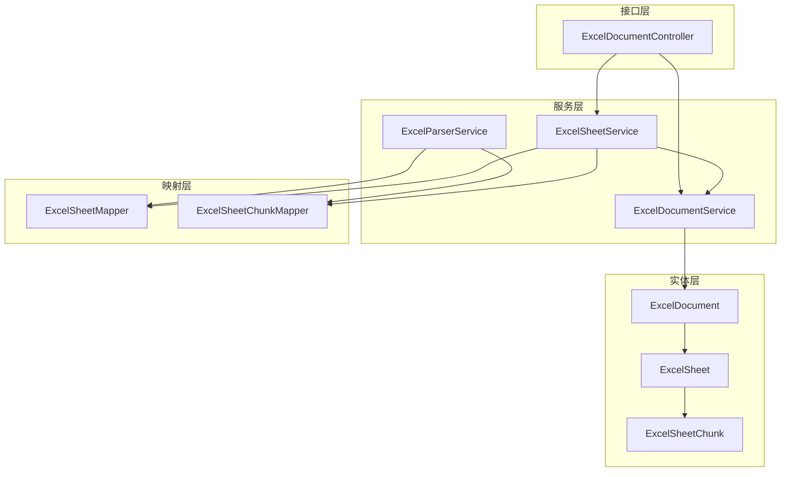
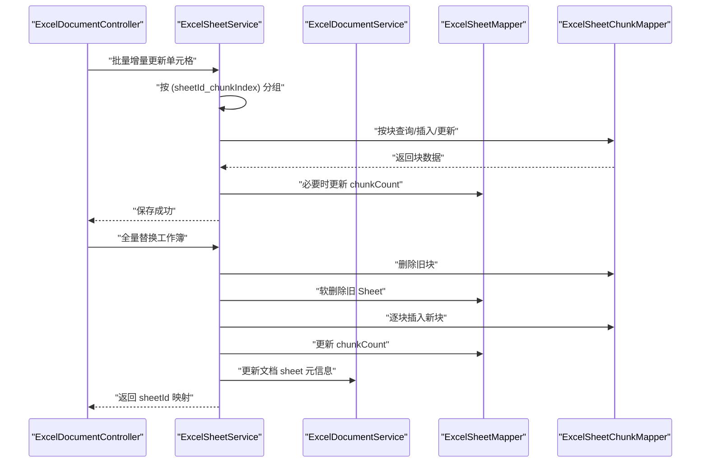
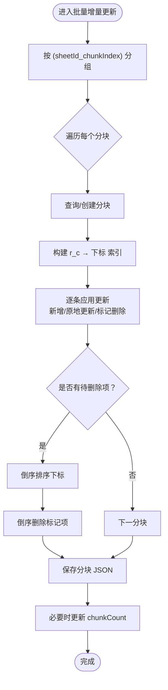
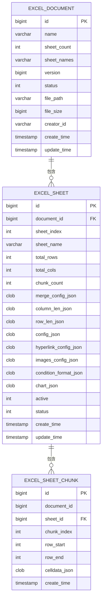

# Excel 工作表服务

<cite>
**本文引用的文件**
- [ExcelSheetService.java](file://dataloom-server/src/main/java/com/demo/excel/service/ExcelSheetService.java)
- [ExcelParserService.java](file://dataloom-server/src/main/java/com/demo/excel/service/ExcelParserService.java)
- [ExcelDocumentService.java](file://dataloom-server/src/main/java/com/demo/excel/service/ExcelDocumentService.java)
- [ExcelSheet.java](file://dataloom-server/src/main/java/com/demo/excel/entity/ExcelSheet.java)
- [ExcelSheetChunk.java](file://dataloom-server/src/main/java/com/demo/excel/entity/ExcelSheetChunk.java)
- [ExcelDocument.java](file://dataloom-server/src/main/java/com/demo/excel/entity/ExcelDocument.java)
- [ExcelSheetMapper.java](file://dataloom-server/src/main/java/com/demo/excel/mapper/ExcelSheetMapper.java)
- [ExcelSheetChunkMapper.java](file://dataloom-server/src/main/java/com/demo/excel/mapper/ExcelSheetChunkMapper.java)
- [ExcelDocumentController.java](file://dataloom-server/src/main/java/com/demo/excel/controller/ExcelDocumentController.java)
- [schema.sql](file://dataloom-server/src/main/resources/schema.sql)
- [ExcelSheetServiceTest.java](file://dataloom-server/src/test/java/com/demo/excel/service/ExcelSheetServiceTest.java)
</cite>

## 目录
1. [简介](#简介)
2. [项目结构](#项目结构)
3. [核心组件](#核心组件)
4. [架构概览](#架构概览)
5. [详细组件分析](#详细组件分析)
6. [依赖分析](#依赖分析)
7. [性能考虑](#性能考虑)
8. [故障排查指南](#故障排查指南)
9. [结论](#结论)
10. [附录](#附录)

## 简介
本文件围绕 ExcelSheetService 的复杂业务逻辑进行系统性梳理，重点覆盖以下方面：
- 工作表的增删改查与数据块管理
- 懒加载机制与分块索引、数据合并、增量更新
- 工作表切换、单元格读取与写入实现
- 数据块缓存策略与内存管理
- 工作表元数据维护（行列数统计、格式信息）
- 并发访问控制、事务管理与一致性保障
- 具体操作流程与性能优化技巧

## 项目结构
本项目采用分层架构，核心围绕“文档-工作表-数据分块”三层模型展开，配合解析器与控制器完成从文件解析到接口暴露的完整链路。



图示来源
- [ExcelSheetService.java:33-44](file://dataloom-server/src/main/java/com/demo/excel/service/ExcelSheetService.java#L33-L44)
- [ExcelParserService.java:38-50](file://dataloom-server/src/main/java/com/demo/excel/service/ExcelParserService.java#L38-L50)
- [ExcelDocumentService.java:19-23](file://dataloom-server/src/main/java/com/demo/excel/service/ExcelDocumentService.java#L19-L23)
- [ExcelDocumentController.java:22-32](file://dataloom-server/src/main/java/com/demo/excel/controller/ExcelDocumentController.java#L22-L32)

章节来源
- [ExcelSheetService.java:23-34](file://dataloom-server/src/main/java/com/demo/excel/service/ExcelSheetService.java#L23-L34)
- [ExcelParserService.java:25-37](file://dataloom-server/src/main/java/com/demo/excel/service/ExcelParserService.java#L25-L37)
- [ExcelDocumentController.java:19-33](file://dataloom-server/src/main/java/com/demo/excel/controller/ExcelDocumentController.java#L19-L33)

## 核心组件
- ExcelSheetService：负责工作表元信息查询、分块查询、批量增量更新、全量替换工作簿等核心业务。
- ExcelParserService：负责将 Excel 文件流式解析并按固定行数分块持久化到数据库。
- ExcelDocumentService：负责文档主表的 CRUD 与元数据维护。
- ExcelDocument/ExcelSheet/ExcelSheetChunk：三张表分别承载文档元数据、工作表元信息与数据分块。
- ExcelSheetMapper/ExcelSheetChunkMapper：MyBatis-Plus 基础 CRUD 映射。
- ExcelDocumentController：对外提供文档列表、详情、全量/增量保存、删除等接口。

章节来源
- [ExcelSheetService.java:33-44](file://dataloom-server/src/main/java/com/demo/excel/service/ExcelSheetService.java#L33-L44)
- [ExcelParserService.java:38-50](file://dataloom-server/src/main/java/com/demo/excel/service/ExcelParserService.java#L38-L50)
- [ExcelDocumentService.java:19-23](file://dataloom-server/src/main/java/com/demo/excel/service/ExcelDocumentService.java#L19-L23)
- [ExcelSheet.java:8-16](file://dataloom-server/src/main/java/com/demo/excel/entity/ExcelSheet.java#L8-L16)
- [ExcelSheetChunk.java:9-18](file://dataloom-server/src/main/java/com/demo/excel/entity/ExcelSheetChunk.java#L9-L18)
- [ExcelDocument.java:8-15](file://dataloom-server/src/main/java/com/demo/excel/entity/ExcelDocument.java#L8-L15)

## 架构概览
ExcelSheetService 作为核心协调者，向上承接控制器请求，向下协调解析器与文档服务，同时与分块映射器协作完成数据的懒加载与增量更新。



图示来源
- [ExcelDocumentController.java:167-226](file://dataloom-server/src/main/java/com/demo/excel/controller/ExcelDocumentController.java#L167-L226)
- [ExcelSheetService.java:103-212](file://dataloom-server/src/main/java/com/demo/excel/service/ExcelSheetService.java#L103-L212)
- [ExcelSheetService.java:221-316](file://dataloom-server/src/main/java/com/demo/excel/service/ExcelSheetService.java#L221-L316)

## 详细组件分析

### 工作表与数据分块的关系
- 分块策略：以固定行数（默认 1000 行）为单位，通过行号直接计算块索引，确保解析与增量更新的定位逻辑一致。
- 关系模型：文档 → 工作表 → 数据分块（1:N:N）。工作表仅存元信息与少量配置 JSON，单元格数据以 JSON 数组形式分块存储。
- 索引与边界：每个分块记录 rowStart/rowEnd，chunkIndex 与行号一一对应，便于快速定位与懒加载。

章节来源
- [ExcelParserService.java:135-200](file://dataloom-server/src/main/java/com/demo/excel/service/ExcelParserService.java#L135-L200)
- [ExcelSheetChunk.java:9-18](file://dataloom-server/src/main/java/com/demo/excel/entity/ExcelSheetChunk.java#L9-L18)
- [ExcelSheet.java:8-16](file://dataloom-server/src/main/java/com/demo/excel/entity/ExcelSheet.java#L8-L16)

### 懒加载机制与数据合并
- 懒加载：控制器在获取文档详情时仅返回工作表元信息与分块数量；当需要全量单元格数据时，再调用“加载全部 celldata”接口，按块合并返回。
- 数据合并：将同一工作表的所有分块 celldata JSON 数组合并为单一数组，供前端 Luckysheet 使用。

章节来源
- [ExcelDocumentController.java:76-161](file://dataloom-server/src/main/java/com/demo/excel/controller/ExcelDocumentController.java#L76-L161)
- [ExcelSheetService.java:67-72](file://dataloom-server/src/main/java/com/demo/excel/service/ExcelSheetService.java#L67-L72)

### 增量更新与数据块索引
- 分组策略：将所有更新按 (sheetId_chunkIndex) 分组，每组仅读写一次对应分块，降低 I/O。
- 索引优化：在块内构建“r_c → 数组下标”的哈希索引，将查找复杂度从 O(n) 降至 O(1)，支持原地更新与新增。
- 延迟删除：先收集待删除下标，最后统一倒序删除，避免索引错位与多次重建索引。



图示来源
- [ExcelSheetService.java:103-212](file://dataloom-server/src/main/java/com/demo/excel/service/ExcelSheetService.java#L103-L212)

章节来源
- [ExcelSheetService.java:103-212](file://dataloom-server/src/main/java/com/demo/excel/service/ExcelSheetService.java#L103-L212)

### 全量替换工作簿
- 流程：删除旧块 → 软删除旧 Sheet → 逐 Sheet 插入新记录并保存 celldata → 更新文档 sheet 元信息 → 返回 sheetIndex → 新 SheetId 映射。
- 元信息：合并单元格、列宽、行高、超链接、图片、条件格式、图表等配置均以 JSON 存储在工作表记录中，便于全量快照恢复。

章节来源
- [ExcelSheetService.java:221-316](file://dataloom-server/src/main/java/com/demo/excel/service/ExcelSheetService.java#L221-L316)

### 工作表切换与单元格读取/写入
- 切换：前端根据文档详情中的 sheetId 列表与 chunkCount，选择性加载目标工作表的分块数据。
- 读取：控制器提供“加载全部 celldata”接口，将所有分块合并后返回。
- 写入：提供“批量增量更新单元格”接口，优先使用增量更新以减少 I/O；当结构或配置发生变更时使用“全量替换”。

章节来源
- [ExcelDocumentController.java:76-190](file://dataloom-server/src/main/java/com/demo/excel/controller/ExcelDocumentController.java#L76-L190)

### 数据块缓存策略与内存管理
- 缓存策略：未实现应用层缓存；分块粒度（约 1000 行）与 JSON 大小（通常数百 KB）控制在合理范围内，适合按需加载。
- 内存管理：解析阶段使用 LinkedHashMap 有序收集分块缓冲，避免重复分配；增量更新阶段仅在内存中维护索引与待删除集合，结束后统一序列化保存。

章节来源
- [ExcelParserService.java:142-200](file://dataloom-server/src/main/java/com/demo/excel/service/ExcelParserService.java#L142-L200)
- [ExcelSheetService.java:146-195](file://dataloom-server/src/main/java/com/demo/excel/service/ExcelSheetService.java#L146-L195)

### 工作表元数据维护
- 行列数统计：基于解析阶段的行/列扫描与 celldata 最大索引推导，确保 totalRows/totalCols 准确。
- 格式信息：合并单元格、列宽、行高、Luckysheet 完整 config、超链接、图片、条件格式、图表等配置以 JSON 存储在工作表记录中。
- 文档元信息：由 ExcelDocumentService 维护 sheetCount 与 sheetNames，并在解析完成后更新。

章节来源
- [ExcelParserService.java:96-133](file://dataloom-server/src/main/java/com/demo/excel/service/ExcelParserService.java#L96-L133)
- [ExcelSheetService.java:395-414](file://dataloom-server/src/main/java/com/demo/excel/service/ExcelSheetService.java#L395-L414)
- [ExcelDocumentService.java:46-53](file://dataloom-server/src/main/java/com/demo/excel/service/ExcelDocumentService.java#L46-L53)

### 并发访问控制、事务管理与一致性
- 事务管理：批量增量更新与全量替换工作簿均使用 @Transactional，确保跨多步数据库操作的一致性。
- 并发控制：未实现显式的行级锁或乐观锁；通过事务边界与分块粒度降低冲突概率；建议在应用层结合业务场景引入版本号或行锁策略。

章节来源
- [ExcelSheetService.java:103-104](file://dataloom-server/src/main/java/com/demo/excel/service/ExcelSheetService.java#L103-L104)
- [ExcelSheetService.java:221-222](file://dataloom-server/src/main/java/com/demo/excel/service/ExcelSheetService.java#L221-L222)
- [ExcelDocumentService.java:86-103](file://dataloom-server/src/main/java/com/demo/excel/service/ExcelDocumentService.java#L86-L103)

### 具体操作流程与性能优化
- 文件解析到数据库：流式解析 + 分块持久化，避免整体加载内存；分块索引与边界与增量更新保持一致。
- 增量保存：按块分组 + 哈希索引 + 延迟删除，显著降低 I/O 与索引重建成本。
- 全量保存：删除旧数据后重建，适用于结构/配置变更场景。

章节来源
- [ExcelParserService.java:66-87](file://dataloom-server/src/main/java/com/demo/excel/service/ExcelParserService.java#L66-L87)
- [ExcelSheetService.java:103-212](file://dataloom-server/src/main/java/com/demo/excel/service/ExcelSheetService.java#L103-L212)
- [ExcelSheetService.java:221-316](file://dataloom-server/src/main/java/com/demo/excel/service/ExcelSheetService.java#L221-L316)

## 依赖分析
- 组件耦合：ExcelSheetService 依赖 ExcelSheetMapper、ExcelSheetChunkMapper 与 ExcelDocumentService；ExcelParserService 依赖相同映射器；控制器依赖服务层。
- 外部依赖：MyBatis-Plus 提供基础 CRUD；FastJSON 用于 JSON 序列化/反序列化；Apache POI 用于 Excel 流式解析。

```mermaid
classDiagram
class ExcelSheetService
class ExcelParserService
class ExcelDocumentService
class ExcelSheetMapper
class ExcelSheetChunkMapper
class ExcelSheet
class ExcelSheetChunk
class ExcelDocument
ExcelSheetService --> ExcelSheetMapper : "查询/更新"
ExcelSheetService --> ExcelSheetChunkMapper : "查询/插入/更新"
ExcelSheetService --> ExcelDocumentService : "更新文档元信息"
ExcelParserService --> ExcelSheetMapper : "插入元信息"
ExcelParserService --> ExcelSheetChunkMapper : "插入分块"
ExcelDocumentController --> ExcelSheetService : "调用"
ExcelDocumentController --> ExcelDocumentService : "调用"
ExcelSheet --> ExcelSheetChunk : "1 : N"
ExcelDocument --> ExcelSheet : "1 : N"
```

图示来源
- [ExcelSheetService.java:36-43](file://dataloom-server/src/main/java/com/demo/excel/service/ExcelSheetService.java#L36-L43)
- [ExcelParserService.java:46-50](file://dataloom-server/src/main/java/com/demo/excel/service/ExcelParserService.java#L46-L50)
- [ExcelDocumentController.java:28-32](file://dataloom-server/src/main/java/com/demo/excel/controller/ExcelDocumentController.java#L28-L32)

章节来源
- [ExcelSheetService.java:36-43](file://dataloom-server/src/main/java/com/demo/excel/service/ExcelSheetService.java#L36-L43)
- [ExcelParserService.java:46-50](file://dataloom-server/src/main/java/com/demo/excel/service/ExcelParserService.java#L46-L50)
- [ExcelDocumentController.java:28-32](file://dataloom-server/src/main/java/com/demo/excel/controller/ExcelDocumentController.java#L28-L32)

## 性能考虑
- 分块大小：默认 1000 行，兼顾 I/O 与内存占用；可根据实际数据密度调整。
- 增量更新：按块分组 + 哈希索引 + 延迟删除，显著降低数据库往返与索引重建开销。
- 懒加载：仅在需要时合并所有分块，避免超大响应体与内存压力。
- 解析阶段：流式读取，避免整体加载，提升吞吐与稳定性。

## 故障排查指南
- 增量更新失败：检查更新参数格式（sheetId/r/c/v），确认分块索引计算一致；查看日志输出定位异常块。
- 全量保存失败：确认传入的 sheets 结构与字段；关注软删除与物理删除的顺序。
- 文档删除异常：确认文件路径存在且可删除；数据库软删除与级联清理是否执行。

章节来源
- [ExcelDocumentController.java:176-226](file://dataloom-server/src/main/java/com/demo/excel/controller/ExcelDocumentController.java#L176-L226)
- [ExcelSheetService.java:79-91](file://dataloom-server/src/main/java/com/demo/excel/service/ExcelSheetService.java#L79-L91)
- [ExcelDocumentService.java:86-103](file://dataloom-server/src/main/java/com/demo/excel/service/ExcelDocumentService.java#L86-L103)

## 结论
ExcelSheetService 通过“文档-工作表-数据分块”的三层模型，实现了对大规模 Excel 数据的高效存储与访问。其核心优势在于：
- 明确的分块策略与懒加载机制，有效控制内存与网络开销；
- 增量更新的索引优化与延迟删除，显著提升写入性能；
- 全量替换流程清晰，便于结构/配置变更场景；
- 事务管理保障一致性，控制器接口明确，便于前后端协同。

## 附录

### 数据模型图


图示来源
- [schema.sql:8-66](file://dataloom-server/src/main/resources/schema.sql#L8-L66)

### 接口定义（关键）
- GET /api/excel/document/{id}：返回文档详情（含各工作表元信息与 chunkCount）
- GET /api/excel/document/{id}/sheet/{sheetId}/all：合并所有分块返回 celldata
- PUT /api/excel/document/{id}/cells/batch：批量增量更新单元格
- PUT /api/excel/document/{id}/workbook：全量替换工作簿
- DELETE /api/excel/document/{id}：删除文档（软删除 + 级联清理）

章节来源
- [ExcelDocumentController.java:76-264](file://dataloom-server/src/main/java/com/demo/excel/controller/ExcelDocumentController.java#L76-L264)