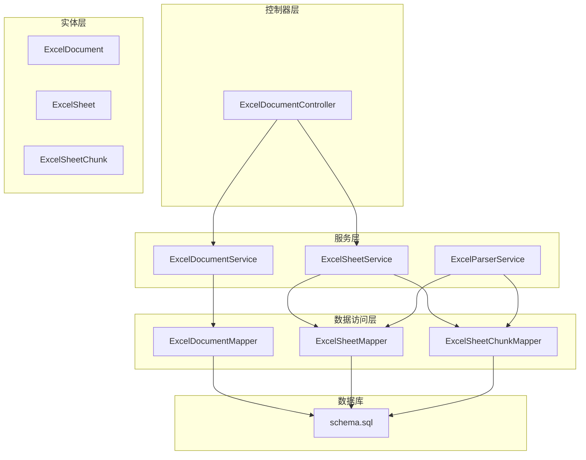
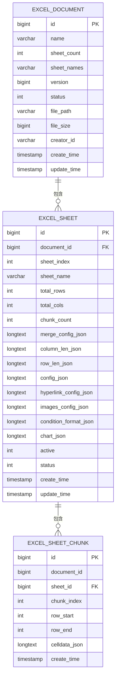
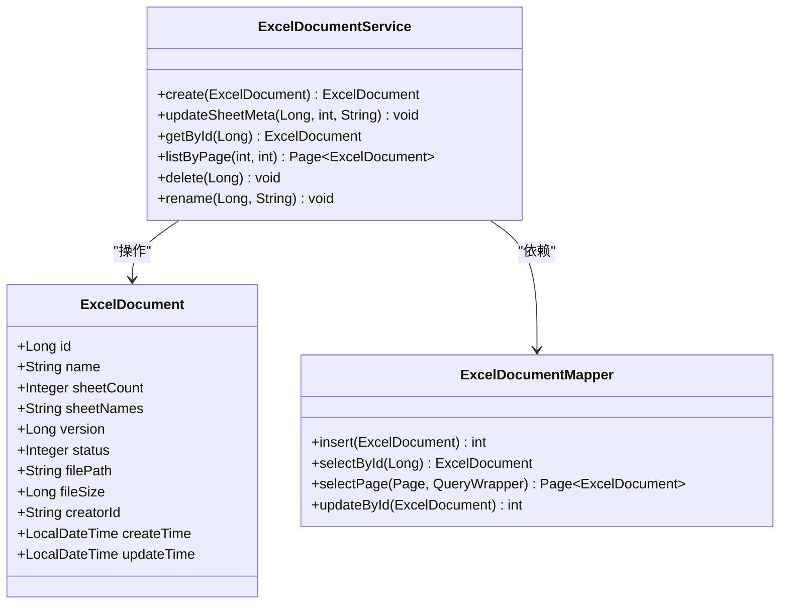
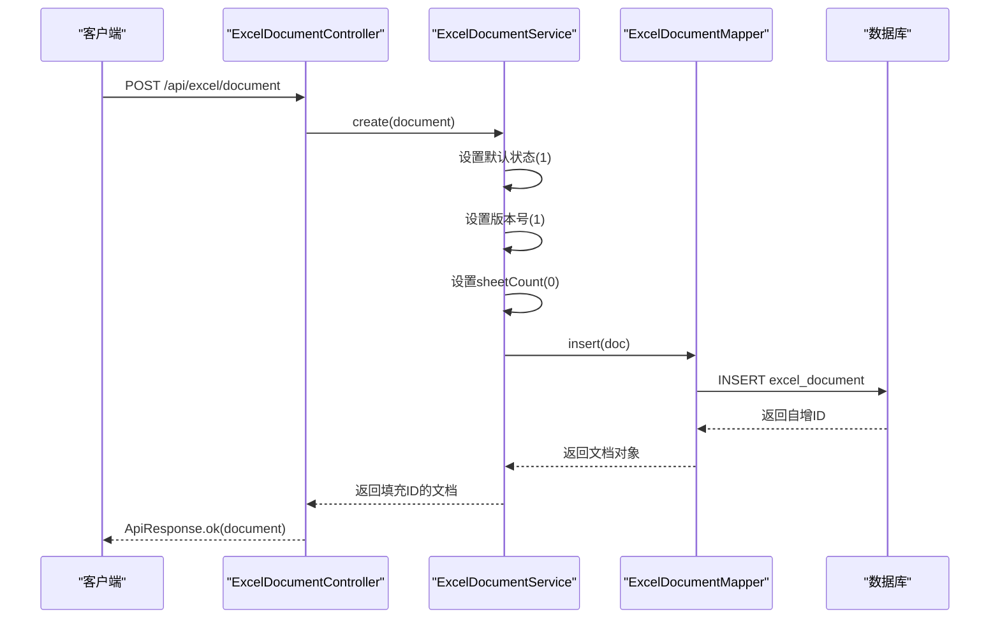
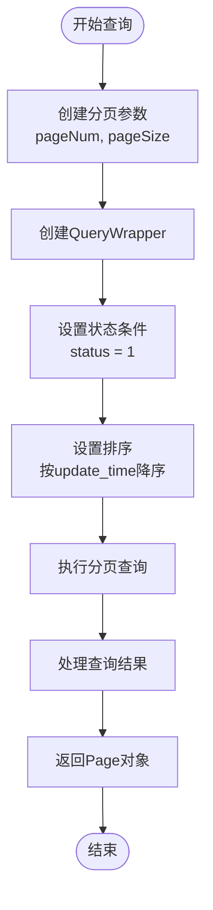
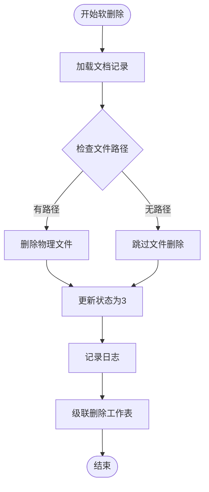
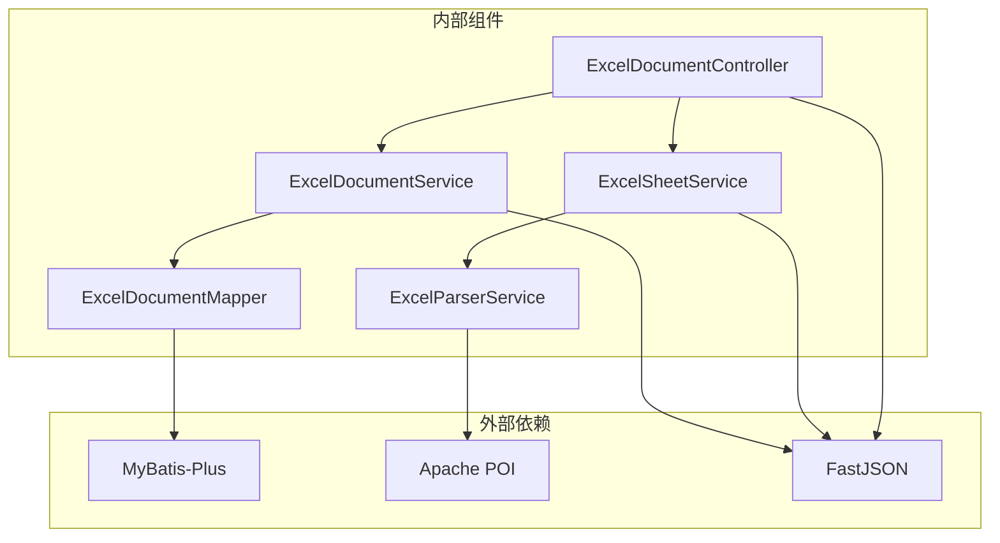

# Excel 文档服务

<cite>
**本文引用的文件**
- [ExcelDocumentService.java](file://dataloom-server/src/main/java/com/demo/excel/service/ExcelDocumentService.java)
- [ExcelDocument.java](file://dataloom-server/src/main/java/com/demo/excel/entity/ExcelDocument.java)
- [ExcelDocumentMapper.java](file://dataloom-server/src/main/java/com/demo/excel/mapper/ExcelDocumentMapper.java)
- [ExcelDocumentController.java](file://dataloom-server/src/main/java/com/demo/excel/controller/ExcelDocumentController.java)
- [ExcelSheetService.java](file://dataloom-server/src/main/java/com/demo/excel/service/ExcelSheetService.java)
- [ExcelSheet.java](file://dataloom-server/src/main/java/com/demo/excel/entity/ExcelSheet.java)
- [ExcelSheetChunk.java](file://dataloom-server/src/main/java/com/demo/excel/entity/ExcelSheetChunk.java)
- [ExcelParserService.java](file://dataloom-server/src/main/java/com/demo/excel/service/ExcelParserService.java)
- [schema.sql](file://dataloom-server/src/main/resources/schema.sql)
- [ApiResponse.java](file://dataloom-server/src/main/java/com/demo/excel/common/ApiResponse.java)
- [ExcelSheetServiceTest.java](file://dataloom-server/src/test/java/com/demo/excel/service/ExcelSheetServiceTest.java)
</cite>

## 目录
1. [简介](#简介)
2. [项目结构](#项目结构)
3. [核心组件](#核心组件)
4. [架构概览](#架构概览)
5. [详细组件分析](#详细组件分析)
6. [依赖分析](#依赖分析)
7. [性能考虑](#性能考虑)
8. [故障排除指南](#故障排除指南)
9. [结论](#结论)
10. [附录](#附录)

## 简介
ExcelDocumentService 是 DataLoom 在线 Excel 应用中的核心文档服务，负责 Excel 文档的生命周期管理。该服务采用"文档表仅存储元数据"的设计理念，将单元格数据通过分块机制存储在独立的表中，从而解决大规模数据存储和性能问题。

本服务提供了完整的文档 CRUD 操作，包括文档创建、查询、分页列表、软删除和重命名功能，同时实现了完善的元数据管理机制，包括状态管理、版本控制和更新时间戳跟踪。

## 项目结构
DataLoom 项目采用标准的 Spring Boot 分层架构，主要包含以下模块：
- **控制器层**：处理 HTTP 请求和响应
- **服务层**：实现业务逻辑和数据操作
- **实体层**：定义数据模型和数据库映射
- **映射器层**：MyBatis-Plus 数据访问接口
- **配置层**：应用配置和数据库连接设置

**图表来源**
- [ExcelDocumentController.java:1-296](file://dataloom-server/src/main/java/com/demo/excel/controller/ExcelDocumentController.java#L1-L296)
- [ExcelDocumentService.java:1-119](file://dataloom-server/src/main/java/com/demo/excel/service/ExcelDocumentService.java#L1-L119)
- [ExcelSheetService.java:1-443](file://dataloom-server/src/main/java/com/demo/excel/service/ExcelSheetService.java#L1-L443)
- [ExcelParserService.java:1-348](file://dataloom-server/src/main/java/com/demo/excel/service/ExcelParserService.java#L1-L348)
- [schema.sql:1-124](file://dataloom-server/src/main/resources/schema.sql#L1-L124)

**章节来源**
- [ExcelDocumentController.java:1-296](file://dataloom-server/src/main/java/com/demo/excel/controller/ExcelDocumentController.java#L1-L296)
- [ExcelDocumentService.java:1-119](file://dataloom-server/src/main/java/com/demo/excel/service/ExcelDocumentService.java#L1-L119)
- [schema.sql:1-124](file://dataloom-server/src/main/resources/schema.sql#L1-L124)

## 核心组件
ExcelDocumentService 作为文档管理的核心服务，承担着以下关键职责：

### 文档生命周期管理
- **创建文档**：初始化文档元数据，设置默认状态和版本号
- **查询文档**：支持按 ID 查询单个文档的完整元数据
- **分页查询**：提供高效的文档列表分页查询功能
- **软删除**：实现文档的软删除机制，确保数据安全
- **重命名**：支持文档名称的动态更新

### 元数据管理机制
- **状态管理**：使用状态字段区分正常、回收站和已删除状态
- **版本控制**：通过乐观锁版本号实现并发控制
- **时间戳跟踪**：自动维护创建和更新时间戳
- **文件关联**：记录原始文件路径和大小信息

**章节来源**
- [ExcelDocumentService.java:13-119](file://dataloom-server/src/main/java/com/demo/excel/service/ExcelDocumentService.java#L13-L119)
- [ExcelDocument.java:8-55](file://dataloom-server/src/main/java/com/demo/excel/entity/ExcelDocument.java#L8-L55)

## 架构概览
ExcelDocumentService 采用分层架构设计，实现了文档表仅存储元数据的理念。整个系统围绕三个核心表展开：文档表、工作表表和数据分块表。

**图表来源**
- [schema.sql:8-66](file://dataloom-server/src/main/resources/schema.sql#L8-L66)
- [ExcelDocument.java:19-52](file://dataloom-server/src/main/java/com/demo/excel/entity/ExcelDocument.java#L19-L52)
- [ExcelSheet.java:18-74](file://dataloom-server/src/main/java/com/demo/excel/entity/ExcelSheet.java#L18-L74)
- [ExcelSheetChunk.java:22-51](file://dataloom-server/src/main/java/com/demo/excel/entity/ExcelSheetChunk.java#L22-L51)

### 设计理念
该架构采用"元数据+分块存储"的设计理念，具有以下优势：

1. **性能优化**：将大型单元格数据分块存储，避免单行数据过大
2. **扩展性**：支持百万级数据量的高效存储和查询
3. **灵活性**：按需加载数据分块，提高内存利用率
4. **安全性**：软删除机制确保数据可恢复性

**章节来源**
- [schema.sql:2-4](file://dataloom-server/src/main/resources/schema.sql#L2-L4)
- [ExcelSheetChunk.java:9-17](file://dataloom-server/src/main/java/com/demo/excel/entity/ExcelSheetChunk.java#L9-L17)

## 详细组件分析

### ExcelDocumentService 详细分析

#### 核心业务方法

**图表来源**
- [ExcelDocumentService.java:20-119](file://dataloom-server/src/main/java/com/demo/excel/service/ExcelDocumentService.java#L20-L119)
- [ExcelDocument.java:17-54](file://dataloom-server/src/main/java/com/demo/excel/entity/ExcelDocument.java#L17-L54)
- [ExcelDocumentMapper.java:9](file://dataloom-server/src/main/java/com/demo/excel/mapper/ExcelDocumentMapper.java#L9)

#### 文档创建流程

**图表来源**
- [ExcelDocumentService.java:31-37](file://dataloom-server/src/main/java/com/demo/excel/service/ExcelDocumentService.java#L31-L37)
- [ExcelDocumentController.java:38-69](file://dataloom-server/src/main/java/com/demo/excel/controller/ExcelDocumentController.java#L38-L69)

#### 分页查询实现

**图表来源**
- [ExcelDocumentService.java:72-78](file://dataloom-server/src/main/java/com/demo/excel/service/ExcelDocumentService.java#L72-L78)

#### 软删除策略

**图表来源**
- [ExcelDocumentService.java:86-103](file://dataloom-server/src/main/java/com/demo/excel/service/ExcelDocumentService.java#L86-L103)

**章节来源**
- [ExcelDocumentService.java:25-119](file://dataloom-server/src/main/java/com/demo/excel/service/ExcelDocumentService.java#L25-L119)

### 元数据管理机制

#### 状态管理系统
文档状态采用三态设计：
- **1 正常**：文档处于可用状态
- **2 回收站**：文档被移动到回收站
- **3 已删除**：文档被永久删除

#### 版本控制机制
通过 MyBatis-Plus 的 `@Version` 注解实现乐观锁：
- 默认版本号为 1
- 每次更新时版本号递增
- 防止并发更新冲突

#### 时间戳管理
- `create_time`：文档创建时间，自动设置
- `update_time`：文档最后更新时间，自动更新
- 支持精确到秒的时间追踪

**章节来源**
- [ExcelDocument.java:32-52](file://dataloom-server/src/main/java/com/demo/excel/entity/ExcelDocument.java#L32-L52)
- [ExcelDocumentService.java:32-52](file://dataloom-server/src/main/java/com/demo/excel/service/ExcelDocumentService.java#L32-L52)

### 文档与工作表的关系

#### 关系设计
- **一对多关系**：一个文档包含多个工作表
- **外键约束**：工作表通过 `document_id` 关联到文档
- **独立存储**：工作表元数据和单元格数据分离存储

#### 工作表元信息
工作表表存储以下关键信息：
- **基础信息**：名称、索引、行列数统计
- **配置信息**：合并单元格、列宽、行高等配置
- **状态信息**：活动状态和删除状态

**章节来源**
- [ExcelSheet.java:22-68](file://dataloom-server/src/main/java/com/demo/excel/entity/ExcelSheet.java#L22-L68)
- [ExcelSheetService.java:46-57](file://dataloom-server/src/main/java/com/demo/excel/service/ExcelSheetService.java#L46-L57)

### 分页查询实现

#### 查询条件过滤
分页查询默认包含以下过滤条件：
- **状态过滤**：仅返回状态为 1 的正常文档
- **排序规则**：按 `update_time` 字段降序排列
- **分页参数**：支持自定义页码和页面大小

#### 性能优化
- **索引设计**：数据库层面为状态字段建立索引
- **懒加载**：分页查询不包含单元格数据，仅返回元数据
- **缓存友好**：按更新时间排序便于缓存命中

**章节来源**
- [ExcelDocumentService.java:72-78](file://dataloom-server/src/main/java/com/demo/excel/service/ExcelDocumentService.java#L72-L78)
- [schema.sql:84-86](file://dataloom-server/src/main/resources/schema.sql#L84-L86)

### 文件系统清理机制

#### 软删除策略
软删除是通过状态字段实现的逻辑删除：
- **数据库层面**：状态字段更新为 3
- **文件层面**：删除对应的物理文件
- **数据完整性**：保留关联数据便于审计

#### 磁盘空间管理
- **及时清理**：删除操作会同步清理物理文件
- **异常处理**：文件删除失败不影响数据库状态
- **资源释放**：确保操作系统资源正确释放

**章节来源**
- [ExcelDocumentService.java:86-103](file://dataloom-server/src/main/java/com/demo/excel/service/ExcelDocumentService.java#L86-L103)

## 依赖分析

### 组件耦合关系

**图表来源**
- [ExcelDocumentController.java:10-15](file://dataloom-server/src/main/java/com/demo/excel/controller/ExcelDocumentController.java#L10-L15)
- [ExcelDocumentService.java:3-8](file://dataloom-server/src/main/java/com/demo/excel/service/ExcelDocumentService.java#L3-L8)
- [ExcelParserService.java:3-16](file://dataloom-server/src/main/java/com/demo/excel/service/ExcelParserService.java#L3-L16)

### 数据访问模式
服务层采用 MyBatis-Plus 的标准 DAO 模式：
- **Mapper 接口**：继承 BaseMapper 提供通用 CRUD 方法
- **Service 层**：封装业务逻辑和复杂查询
- **实体映射**：通过注解实现数据库字段映射

**章节来源**
- [ExcelDocumentMapper.java:6-10](file://dataloom-server/src/main/java/com/demo/excel/mapper/ExcelDocumentMapper.java#L6-L10)
- [ExcelDocumentService.java:22-23](file://dataloom-server/src/main/java/com/demo/excel/service/ExcelDocumentService.java#L22-L23)

## 性能考虑

### 存储优化策略

#### 分块存储设计
- **块大小**：每块约 1000 行数据
- **内存控制**：单块 JSON 数据通常在几百 KB 以内
- **按需加载**：支持按块分页加载，避免全量数据传输

#### 查询性能优化
- **索引策略**：为常用查询字段建立数据库索引
- **分页限制**：默认页面大小 20，避免大数据量查询
- **懒加载原则**：分页查询不包含单元格数据

### 并发控制机制
- **乐观锁**：通过版本号防止并发更新冲突
- **事务管理**：关键操作使用事务保证数据一致性
- **异常处理**：完善的异常捕获和回滚机制

**章节来源**
- [ExcelParserService.java:43-44](file://dataloom-server/src/main/java/com/demo/excel/service/ExcelParserService.java#L43-L44)
- [ExcelSheetService.java:103-212](file://dataloom-server/src/main/java/com/demo/excel/service/ExcelSheetService.java#L103-L212)

## 故障排除指南

### 常见问题及解决方案

#### 文档删除失败
**问题描述**：软删除操作后物理文件未被删除
**可能原因**：
- 文件路径为空或无效
- 文件被其他进程占用
- 权限不足

**解决方案**：
- 检查文档记录的 `file_path` 字段
- 确认文件权限和可用性
- 查看系统日志获取详细错误信息

#### 分页查询性能问题
**问题描述**：大量文档时分页查询响应缓慢
**优化建议**：
- 为 `status` 和 `update_time` 字段添加数据库索引
- 调整页面大小参数
- 考虑添加更多过滤条件

#### 并发更新冲突
**问题描述**：多个用户同时更新同一文档导致版本冲突
**解决方案**：
- 检查版本号是否正确递增
- 实现重试机制处理乐观锁冲突
- 提示用户重新加载最新数据

**章节来源**
- [ExcelDocumentService.java:90-96](file://dataloom-server/src/main/java/com/demo/excel/service/ExcelDocumentService.java#L90-L96)
- [ExcelSheetService.java:103-212](file://dataloom-server/src/main/java/com/demo/excel/service/ExcelSheetService.java#L103-L212)

### 日志监控
服务层实现了完善的日志记录：
- **操作日志**：记录重要业务操作的执行情况
- **错误日志**：捕获并记录异常信息
- **性能日志**：记录关键操作的执行时间和参数

**章节来源**
- [ExcelDocumentController.java:26-27](file://dataloom-server/src/main/java/com/demo/excel/controller/ExcelDocumentController.java#L26-L27)
- [ExcelSheetService.java:103-212](file://dataloom-server/src/main/java/com/demo/excel/service/ExcelSheetService.java#L103-L212)

## 结论
ExcelDocumentService 通过精心设计的分层架构和优化的数据存储策略，成功解决了大规模 Excel 数据的存储和管理问题。其核心特点包括：

1. **设计理念先进**：采用"元数据+分块存储"的创新设计，有效解决了大数据量存储瓶颈
2. **功能完整**：提供了完整的文档生命周期管理功能，包括创建、查询、分页、软删除和重命名
3. **性能优异**：通过分块存储和索引优化，实现了高效的查询和数据加载
4. **安全可靠**：软删除机制和版本控制确保了数据的安全性和可恢复性
5. **易于扩展**：清晰的分层架构和模块化设计便于功能扩展和维护

该服务为在线 Excel 应用提供了坚实的技术基础，能够支持从简单文档到百万级数据的广泛应用场景。

## 附录

### API 接口规范

#### 文档列表查询
- **URL**：`GET /api/excel/document/list`
- **参数**：`pageNum`(默认1)、`pageSize`(默认20)
- **返回**：分页的文档元数据列表

#### 文档详情查询
- **URL**：`GET /api/excel/document/{id}`
- **参数**：文档 ID
- **返回**：文档元数据和工作表配置信息

#### 文档重命名
- **URL**：`PUT /api/excel/document/{id}/name`
- **参数**：新的文档名称
- **返回**：重命名操作结果

#### 文档删除
- **URL**：`DELETE /api/excel/document/{id}`
- **参数**：文档 ID
- **返回**：删除操作结果

**章节来源**
- [ExcelDocumentController.java:37-264](file://dataloom-server/src/main/java/com/demo/excel/controller/ExcelDocumentController.java#L37-L264)

### 数据模型说明

#### ExcelDocument 表结构
| 字段名 | 类型 | 描述 | 默认值 |
|--------|------|------|--------|
| id | BIGINT | 主键 | 自增 |
| name | VARCHAR(255) | 文档名称 | 必填 |
| sheet_count | INT | 工作表数量 | 0 |
| sheet_names | VARCHAR(2000) | 工作表名称列表 | NULL |
| version | BIGINT | 乐观锁版本号 | 1 |
| status | INT | 状态(1/2/3) | 1 |
| file_path | VARCHAR(500) | 原始文件路径 | NULL |
| file_size | BIGINT | 文件大小(字节) | 0 |
| creator_id | VARCHAR(64) | 创建者ID | 'demo-user' |
| create_time | TIMESTAMP | 创建时间 | 当前时间 |
| update_time | TIMESTAMP | 更新时间 | 当前时间 |

#### ExcelSheet 表结构
| 字段名 | 类型 | 描述 | 默认值 |
|--------|------|------|--------|
| id | BIGINT | 主键 | 自增 |
| document_id | BIGINT | 所属文档ID | 必填 |
| sheet_index | INT | 工作表索引 | 0 |
| sheet_name | VARCHAR(255) | 工作表名称 | 必填 |
| total_rows | INT | 总行数 | 0 |
| total_cols | INT | 总列数 | 0 |
| chunk_count | INT | 分块数量 | 0 |
| merge_config_json | CLOB | 合并单元格配置 | NULL |
| column_len_json | CLOB | 列宽配置 | NULL |
| row_len_json | CLOB | 行高配置 | NULL |
| config_json | CLOB | 完整配置 | NULL |
| hyperlink_config_json | CLOB | 超链接配置 | NULL |
| images_config_json | CLOB | 图片配置 | NULL |
| condition_format_json | CLOB | 条件格式配置 | NULL |
| chart_json | CLOB | 图表配置 | NULL |
| active | INT | 活动状态(0/1) | 0 |
| status | INT | 状态(1/3) | 1 |
| create_time | TIMESTAMP | 创建时间 | 当前时间 |
| update_time | TIMESTAMP | 更新时间 | 当前时间 |

**章节来源**
- [schema.sql:8-66](file://dataloom-server/src/main/resources/schema.sql#L8-L66)