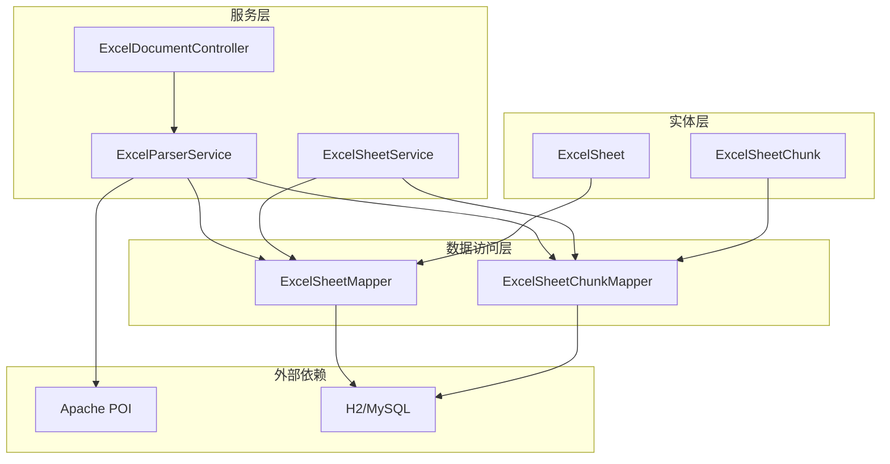
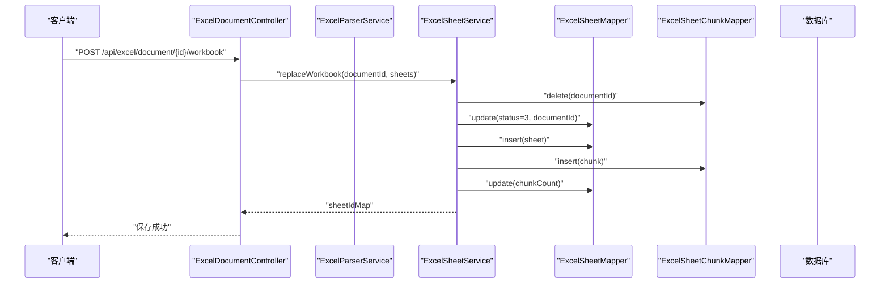
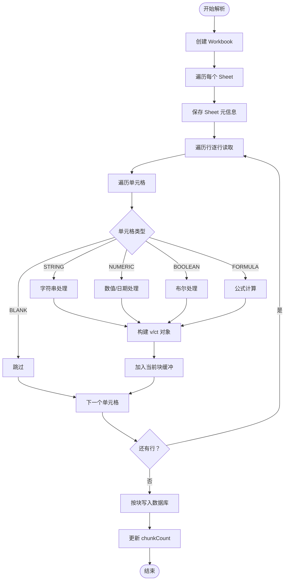
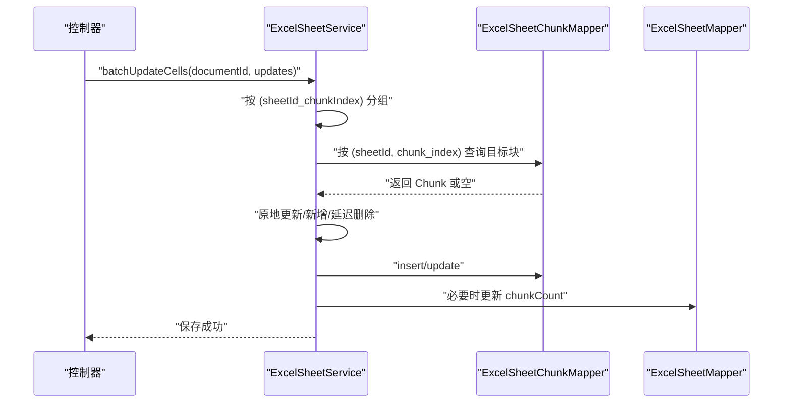
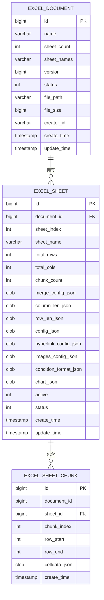
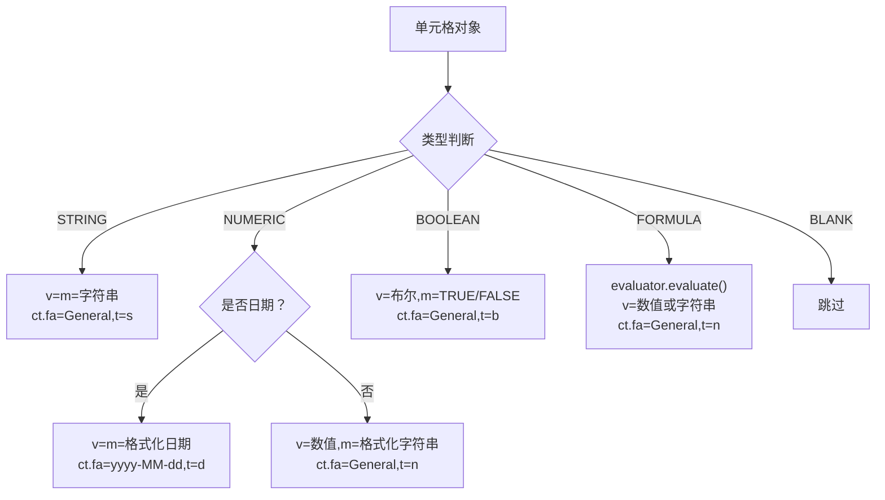
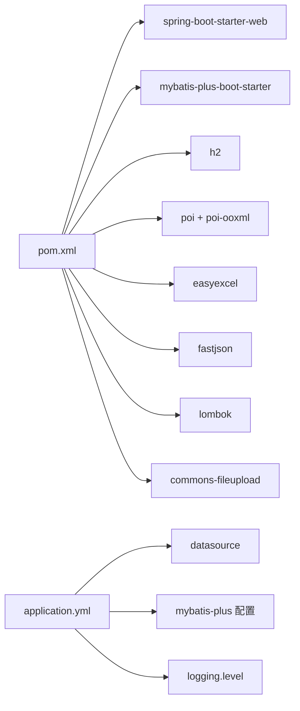

# Excel 解析服务

<cite>
**本文引用的文件**
- [ExcelParserService.java](file://dataloom-server/src/main/java/com/demo/excel/service/ExcelParserService.java)
- [ExcelSheetChunk.java](file://dataloom-server/src/main/java/com/demo/excel/entity/ExcelSheetChunk.java)
- [ExcelSheet.java](file://dataloom-server/src/main/java/com/demo/excel/entity/ExcelSheet.java)
- [ExcelSheetChunkMapper.java](file://dataloom-server/src/main/java/com/demo/excel/mapper/ExcelSheetChunkMapper.java)
- [ExcelSheetMapper.java](file://dataloom-server/src/main/java/com/demo/excel/mapper/ExcelSheetMapper.java)
- [ExcelSheetService.java](file://dataloom-server/src/main/java/com/demo/excel/service/ExcelSheetService.java)
- [ExcelDocumentController.java](file://dataloom-server/src/main/java/com/demo/excel/controller/ExcelDocumentController.java)
- [application.yml](file://dataloom-server/src/main/resources/application.yml)
- [schema.sql](file://dataloom-server/src/main/resources/schema.sql)
- [pom.xml](file://dataloom-server/pom.xml)
</cite>

## 目录
1. [简介](#简介)
2. [项目结构](#项目结构)
3. [核心组件](#核心组件)
4. [架构概览](#架构概览)
5. [详细组件分析](#详细组件分析)
6. [依赖分析](#依赖分析)
7. [性能考量](#性能考量)
8. [故障排查指南](#故障排查指南)
9. [结论](#结论)
10. [附录](#附录)

## 简介
本文件围绕 ExcelParserService 的实现进行深入解析，涵盖以下关键主题：
- Apache POI 的集成使用与流式解析策略
- 分块存储（1000 行/块）的设计与实现
- 单元格数据提取、格式处理与数据类型转换
- 内存管理与性能优化技巧
- 错误处理与异常恢复机制
- 解析进度跟踪、并发处理与资源释放最佳实践
- 解析流程与代码实现示例（以源码路径形式呈现）

## 项目结构
该项目采用 Spring Boot + MyBatis-Plus + H2 的最小化演示架构，核心解析逻辑集中在服务层，数据模型与持久化通过实体类与 Mapper 接口完成。ExcelParserService 作为解析引擎，负责将 Excel 文件按 Sheet 逐行读取并分块持久化至数据库。

**图表来源**
- [ExcelParserService.java:66-87](file://dataloom-server/src/main/java/com/demo/excel/service/ExcelParserService.java#L66-L87)
- [ExcelSheetService.java:103-212](file://dataloom-server/src/main/java/com/demo/excel/service/ExcelSheetService.java#L103-L212)
- [ExcelSheetMapper.java:11-12](file://dataloom-server/src/main/java/com/demo/excel/mapper/ExcelSheetMapper.java#L11-L12)
- [ExcelSheetChunkMapper.java:11-12](file://dataloom-server/src/main/java/com/demo/excel/mapper/ExcelSheetChunkMapper.java#L11-L12)
- [ExcelSheet.java:14-76](file://dataloom-server/src/main/java/com/demo/excel/entity/ExcelSheet.java#L14-L76)
- [ExcelSheetChunk.java:18-52](file://dataloom-server/src/main/java/com/demo/excel/entity/ExcelSheetChunk.java#L18-L52)

**章节来源**
- [ExcelParserService.java:1-348](file://dataloom-server/src/main/java/com/demo/excel/service/ExcelParserService.java#L1-L348)
- [ExcelSheetService.java:1-443](file://dataloom-server/src/main/java/com/demo/excel/service/ExcelSheetService.java#L1-L443)
- [ExcelDocumentController.java:1-296](file://dataloom-server/src/main/java/com/demo/excel/controller/ExcelDocumentController.java#L1-L296)

## 核心组件
- ExcelParserService：流式解析 Excel，按 1000 行/块分块持久化，支持公式计算与日期识别。
- ExcelSheetService：提供分块查询、批量增量更新、全量工作簿替换等能力。
- 实体与 Mapper：ExcelSheet、ExcelSheetChunk 及其 Mapper，支撑分块存储与查询。
- 控制器：ExcelDocumentController 提供文档与 Sheet 的查询、全量保存、增量保存等接口。

**章节来源**
- [ExcelParserService.java:43-44](file://dataloom-server/src/main/java/com/demo/excel/service/ExcelParserService.java#L43-L44)
- [ExcelSheetService.java:33-34](file://dataloom-server/src/main/java/com/demo/excel/service/ExcelSheetService.java#L33-L34)
- [ExcelSheet.java:14-76](file://dataloom-server/src/main/java/com/demo/excel/entity/ExcelSheet.java#L14-L76)
- [ExcelSheetChunk.java:18-52](file://dataloom-server/src/main/java/com/demo/excel/entity/ExcelSheetChunk.java#L18-L52)

## 架构概览
解析流程自上而下分为三层：
- 控制层：接收请求，调用服务层完成解析与保存。
- 服务层：ExcelParserService 负责解析与分块持久化；ExcelSheetService 负责查询与增量/全量写入。
- 数据访问层：通过 MyBatis-Plus 的 Mapper 接口与数据库交互。

**图表来源**
- [ExcelDocumentController.java:204-226](file://dataloom-server/src/main/java/com/demo/excel/controller/ExcelDocumentController.java#L204-L226)
- [ExcelSheetService.java:221-316](file://dataloom-server/src/main/java/com/demo/excel/service/ExcelSheetService.java#L221-L316)
- [ExcelSheetMapper.java:11-12](file://dataloom-server/src/main/java/com/demo/excel/mapper/ExcelSheetMapper.java#L11-L12)
- [ExcelSheetChunkMapper.java:11-12](file://dataloom-server/src/main/java/com/demo/excel/mapper/ExcelSheetChunkMapper.java#L11-L12)

## 详细组件分析

### ExcelParserService：流式解析与分块存储
- 流式解析：使用 WorkbookFactory 创建 Workbook，并逐 Sheet、逐行、逐单元格读取，避免一次性将整个文件加载到内存。
- 分块策略：按 1000 行/块（CHUNK_SIZE=1000）进行分块，块索引由行号直接决定，确保与批量更新时的定位逻辑一致。
- 单元格类型处理：字符串、数值、日期、布尔、公式、空白分别处理，公式通过 FormulaEvaluator 计算，日期通过 DateUtil 判断。
- 配置持久化：合并单元格、列宽、行高等配置作为 JSON 存储在 ExcelSheet 中，celldata 仅存分块数据。

**图表来源**
- [ExcelParserService.java:66-87](file://dataloom-server/src/main/java/com/demo/excel/service/ExcelParserService.java#L66-L87)
- [ExcelParserService.java:142-200](file://dataloom-server/src/main/java/com/demo/excel/service/ExcelParserService.java#L142-L200)
- [ExcelParserService.java:205-281](file://dataloom-server/src/main/java/com/demo/excel/service/ExcelParserService.java#L205-L281)

**章节来源**
- [ExcelParserService.java:43-44](file://dataloom-server/src/main/java/com/demo/excel/service/ExcelParserService.java#L43-L44)
- [ExcelParserService.java:66-87](file://dataloom-server/src/main/java/com/demo/excel/service/ExcelParserService.java#L66-L87)
- [ExcelParserService.java:142-200](file://dataloom-server/src/main/java/com/demo/excel/service/ExcelParserService.java#L142-L200)
- [ExcelParserService.java:205-281](file://dataloom-server/src/main/java/com/demo/excel/service/ExcelParserService.java#L205-L281)

### ExcelSheetService：分块查询与批量更新
- 分块查询：按 sheetId 查询所有分块，按 chunkIndex 升序返回，便于前端按需加载。
- 批量增量更新：按 (sheetId_chunkIndex) 分组，每组只读/写一次对应 Chunk，降低 I/O 并提升性能。
- 全量替换：删除旧数据后重建，返回 sheetIndex → 新 sheetId 的映射，便于后续增量保存。

**图表来源**
- [ExcelSheetService.java:103-212](file://dataloom-server/src/main/java/com/demo/excel/service/ExcelSheetService.java#L103-L212)
- [ExcelSheetChunkMapper.java:11-12](file://dataloom-server/src/main/java/com/demo/excel/mapper/ExcelSheetChunkMapper.java#L11-L12)
- [ExcelSheetMapper.java:11-12](file://dataloom-server/src/main/java/com/demo/excel/mapper/ExcelSheetMapper.java#L11-L12)

**章节来源**
- [ExcelSheetService.java:67-72](file://dataloom-server/src/main/java/com/demo/excel/service/ExcelSheetService.java#L67-L72)
- [ExcelSheetService.java:103-212](file://dataloom-server/src/main/java/com/demo/excel/service/ExcelSheetService.java#L103-L212)
- [ExcelSheetService.java:221-316](file://dataloom-server/src/main/java/com/demo/excel/service/ExcelSheetService.java#L221-L316)

### 数据模型与持久化
- ExcelSheet：存储 Sheet 元信息与少量配置（合并单元格、列宽、行高等），不包含 celldata。
- ExcelSheetChunk：按块存储 celldata，每块约 1000 行，块内 JSON 便于按需加载。
- Mapper：继承 MyBatis-Plus 基础 CRUD，业务查询通过 QueryWrapper 在 Service 层组装。

**图表来源**
- [schema.sql:8-45](file://dataloom-server/src/main/resources/schema.sql#L8-L45)
- [schema.sql:57-66](file://dataloom-server/src/main/resources/schema.sql#L57-L66)
- [ExcelSheet.java:14-76](file://dataloom-server/src/main/java/com/demo/excel/entity/ExcelSheet.java#L14-L76)
- [ExcelSheetChunk.java:18-52](file://dataloom-server/src/main/java/com/demo/excel/entity/ExcelSheetChunk.java#L18-L52)

**章节来源**
- [ExcelSheet.java:14-76](file://dataloom-server/src/main/java/com/demo/excel/entity/ExcelSheet.java#L14-L76)
- [ExcelSheetChunk.java:18-52](file://dataloom-server/src/main/java/com/demo/excel/entity/ExcelSheetChunk.java#L18-L52)
- [schema.sql:8-45](file://dataloom-server/src/main/resources/schema.sql#L8-L45)
- [schema.sql:57-66](file://dataloom-server/src/main/resources/schema.sql#L57-L66)

### 单元格数据提取、格式处理与类型转换
- 字符串：保留原始字符串与显示值，格式标记为 General，类型为 s。
- 数值：区分普通数值与日期。日期通过 DateUtil 判断，格式化为 yyyy-MM-dd；普通数值保留数值与显示值。
- 布尔：转换为布尔值与显示字符串（TRUE/FALSE），格式标记为 General，类型为 b。
- 公式：使用 FormulaEvaluator 计算，若计算失败则降级为字符串（=公式），格式标记为 General，类型为 n。
- 空白：跳过不入库。

**图表来源**
- [ExcelParserService.java:205-281](file://dataloom-server/src/main/java/com/demo/excel/service/ExcelParserService.java#L205-L281)

**章节来源**
- [ExcelParserService.java:205-281](file://dataloom-server/src/main/java/com/demo/excel/service/ExcelParserService.java#L205-L281)

### 错误处理与异常恢复
- 单元格级别异常：单个单元格解析异常时跳过该单元格，不中断整体解析。
- 公式计算异常：公式计算失败时降级为字符串（=公式），保证数据完整性。
- JSON 解析异常：控制器加载全量 celldata 时对单个分块解析失败进行日志告警并跳过，避免影响整体返回。

**章节来源**
- [ExcelParserService.java:260-277](file://dataloom-server/src/main/java/com/demo/excel/service/ExcelParserService.java#L260-L277)
- [ExcelDocumentController.java:142-160](file://dataloom-server/src/main/java/com/demo/excel/controller/ExcelDocumentController.java#L142-L160)

### 解析进度跟踪、并发处理与资源释放
- 进度跟踪：日志输出文档与 Sheet 的解析状态，以及分块写入的行范围与单元格数量。
- 并发处理：解析与保存在单线程事务中执行，避免并发写入导致的分块错位；批量更新按块分组，减少 I/O。
- 资源释放：使用 try-with-resources 确保 Workbook 被及时关闭；公式求值器随 Workbook 生命周期管理。

**章节来源**
- [ExcelParserService.java:66-87](file://dataloom-server/src/main/java/com/demo/excel/service/ExcelParserService.java#L66-L87)
- [ExcelSheetService.java:103-212](file://dataloom-server/src/main/java/com/demo/excel/service/ExcelSheetService.java#L103-L212)

## 依赖分析
- 外部依赖：Spring Boot Web、MyBatis-Plus、H2/MySQL、Apache POI、EasyExcel、FastJSON、Lombok、commons-fileupload。
- 关键版本：Java 1.8、MyBatis-Plus 3.3.2、POI 4.1.2、EasyExcel 2.2.11、FastJSON 1.2.68。
- 配置要点：文件上传大小限制、MyBatis-Plus 下划线转驼峰、日志级别等。

**图表来源**
- [pom.xml:32-106](file://dataloom-server/pom.xml#L32-L106)
- [application.yml:4-50](file://dataloom-server/src/main/resources/application.yml#L4-L50)

**章节来源**
- [pom.xml:21-30](file://dataloom-server/pom.xml#L21-L30)
- [application.yml:4-50](file://dataloom-server/src/main/resources/application.yml#L4-L50)

## 性能考量
- 分块存储：每块约 1000 行，单块 JSON 通常在数百 KB 以内，便于按需加载与缓存。
- I/O 优化：批量增量更新按块分组，每块只读/写一次，避免重复 I/O。
- 内存控制：流式逐行读取，避免整体加载；分块持久化减少单次写入数据量。
- 类型转换：针对日期与公式的特殊处理，减少前端二次转换成本。
- 索引建议：根据 schema.sql 中的索引定义，确保按 sheet_id、document_id、chunk_index 的查询高效。

**章节来源**
- [ExcelParserService.java:43-44](file://dataloom-server/src/main/java/com/demo/excel/service/ExcelParserService.java#L43-L44)
- [ExcelSheetService.java:103-212](file://dataloom-server/src/main/java/com/demo/excel/service/ExcelSheetService.java#L103-L212)
- [schema.sql:118-123](file://dataloom-server/src/main/resources/schema.sql#L118-L123)

## 故障排查指南
- 解析失败或卡顿：检查日志中“开始解析”、“Sheet 元信息已保存”、“Chunk 已写入”等节点，定位具体阶段。
- 公式计算异常：确认 FormulaEvaluator 的可用性与公式引用范围；必要时降级为字符串。
- JSON 解析异常：控制器对单个分块解析失败进行告警并跳过，检查 celldata_json 格式一致性。
- 数据库连接问题：确认 application.yml 中的 datasource 配置与数据库连通性。
- 文件上传限制：确认 multipart 的大小限制满足大文件需求。

**章节来源**
- [ExcelDocumentController.java:142-160](file://dataloom-server/src/main/java/com/demo/excel/controller/ExcelDocumentController.java#L142-L160)
- [application.yml:19-23](file://dataloom-server/src/main/resources/application.yml#L19-L23)

## 结论
ExcelParserService 通过 Apache POI 的流式解析与 1000 行/块的分块存储策略，实现了对大型 Excel 文件的高效解析与持久化。结合 ExcelSheetService 的分块查询与批量更新能力，系统在内存占用、I/O 性能与数据一致性方面取得良好平衡。配合完善的错误处理与日志跟踪，能够稳定支撑在线协作编辑场景。

## 附录
- 示例：解析流程与代码实现示例（以源码路径代替具体代码）
  - 解析入口与事务控制：[ExcelParserService.java:66-87](file://dataloom-server/src/main/java/com/demo/excel/service/ExcelParserService.java#L66-L87)
  - 分块写入与 chunkCount 更新：[ExcelParserService.java:142-200](file://dataloom-server/src/main/java/com/demo/excel/service/ExcelParserService.java#L142-L200)
  - 单元格类型处理与公式计算：[ExcelParserService.java:205-281](file://dataloom-server/src/main/java/com/demo/excel/service/ExcelParserService.java#L205-L281)
  - 批量增量更新按块分组与原地更新：[ExcelSheetService.java:103-212](file://dataloom-server/src/main/java/com/demo/excel/service/ExcelSheetService.java#L103-L212)
  - 全量替换工作簿与分块重建：[ExcelSheetService.java:221-316](file://dataloom-server/src/main/java/com/demo/excel/service/ExcelSheetService.java#L221-L316)
  - 数据模型与建表脚本：[ExcelSheet.java:14-76](file://dataloom-server/src/main/java/com/demo/excel/entity/ExcelSheet.java#L14-L76)、[ExcelSheetChunk.java:18-52](file://dataloom-server/src/main/java/com/demo/excel/entity/ExcelSheetChunk.java#L18-L52)、[schema.sql:8-45](file://dataloom-server/src/main/resources/schema.sql#L8-L45)、[schema.sql:57-66](file://dataloom-server/src/main/resources/schema.sql#L57-L66)
  - 外部依赖与配置：[pom.xml:32-106](file://dataloom-server/pom.xml#L32-L106)、[application.yml:4-50](file://dataloom-server/src/main/resources/application.yml#L4-L50)