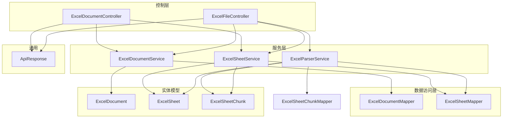
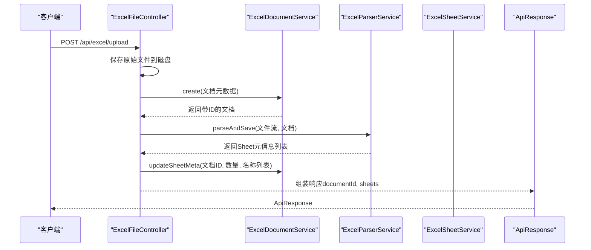
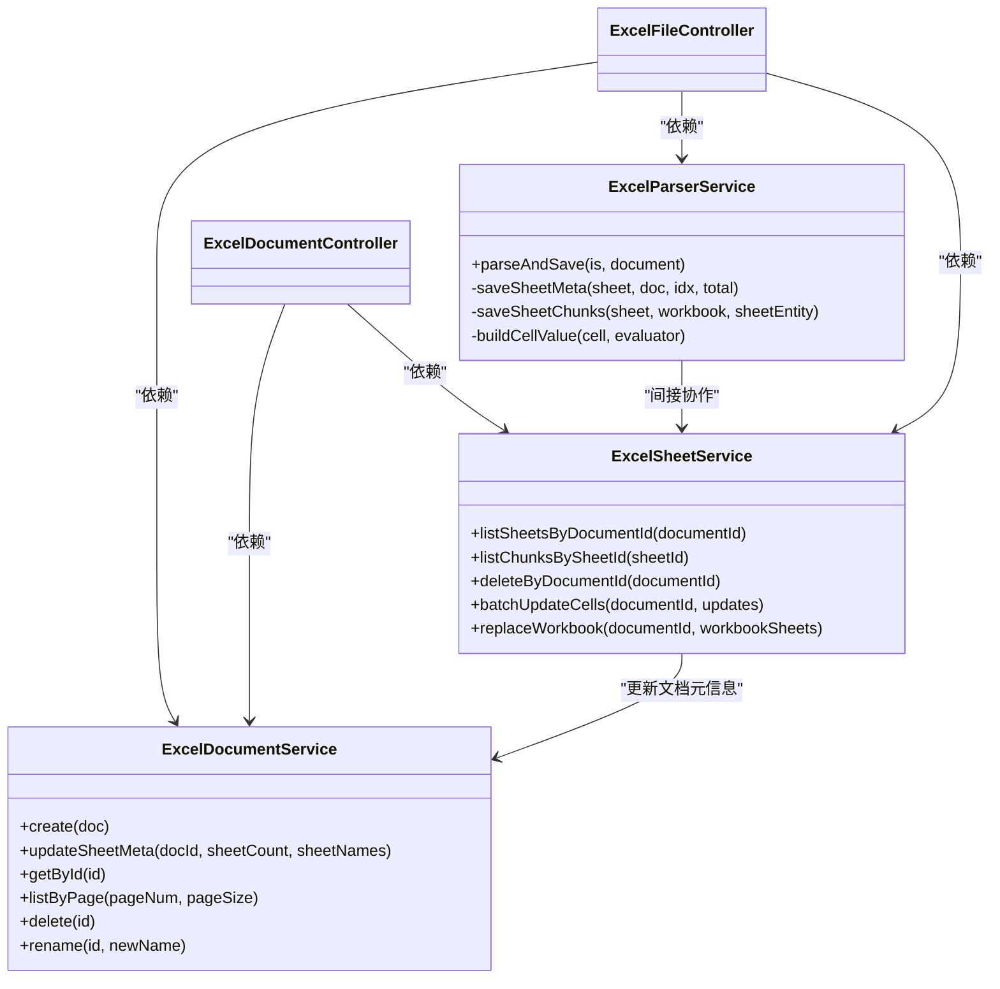
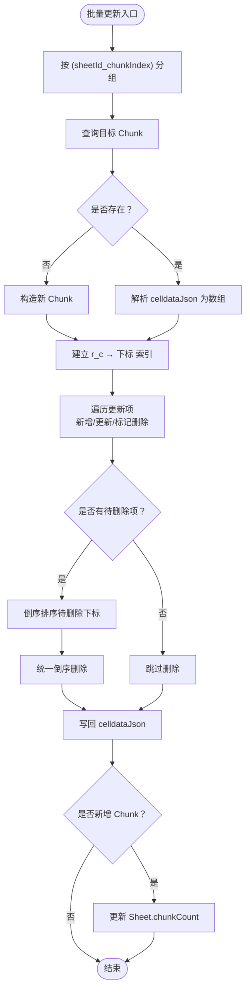

# 服务层（Service）

<cite>
**本文引用的文件**
- [ExcelDocumentService.java](file://dataloom-server/src/main/java/com/demo/excel/service/ExcelDocumentService.java)
- [ExcelParserService.java](file://dataloom-server/src/main/java/com/demo/excel/service/ExcelParserService.java)
- [ExcelSheetService.java](file://dataloom-server/src/main/java/com/demo/excel/service/ExcelSheetService.java)
- [ExcelDocumentController.java](file://dataloom-server/src/main/java/com/demo/excel/controller/ExcelDocumentController.java)
- [ExcelFileController.java](file://dataloom-server/src/main/java/com/demo/excel/controller/ExcelFileController.java)
- [ExcelDocument.java](file://dataloom-server/src/main/java/com/demo/excel/entity/ExcelDocument.java)
- [ExcelSheet.java](file://dataloom-server/src/main/java/com/demo/excel/entity/ExcelSheet.java)
- [ExcelSheetChunk.java](file://dataloom-server/src/main/java/com/demo/excel/entity/ExcelSheetChunk.java)
- [ExcelDocumentMapper.java](file://dataloom-server/src/main/java/com/demo/excel/mapper/ExcelDocumentMapper.java)
- [ExcelSheetMapper.java](file://dataloom-server/src/main/java/com/demo/excel/mapper/ExcelSheetMapper.java)
- [ExcelSheetServiceTest.java](file://dataloom-server/src/test/java/com/demo/excel/service/ExcelSheetServiceTest.java)
- [ApiResponse.java](file://dataloom-server/src/main/java/com/demo/excel/common/ApiResponse.java)
</cite>

## 目录
1. [简介](#简介)
2. [项目结构](#项目结构)
3. [核心组件](#核心组件)
4. [架构总览](#架构总览)
5. [组件详解](#组件详解)
6. [依赖关系分析](#依赖关系分析)
7. [性能与并发](#性能与并发)
8. [故障排查指南](#故障排查指南)
9. [结论](#结论)
10. [附录](#附录)

## 简介
本文件系统性梳理服务层在 MVC 架构中的角色与实现，重点覆盖以下方面：
- 业务逻辑封装：围绕 Excel 文档生命周期与 Sheet 数据分块的完整业务闭环
- 事务管理：基于注解的事务边界划分与回滚策略
- 服务协调：控制器如何编排三个服务协作，完成上传、解析、持久化、查询与更新
- 设计模式：单例（Spring 容器默认）、工厂（POI WorkbookFactory 使用）、分块策略（策略模式思想）
- 依赖关系与调用流程：参数传递、返回值处理、异常传播
- 异常处理与事务机制：日志记录、失败回滚、幂等与容错
- 性能优化与并发：分块存储、批量写入、索引加速、批量更新分组
- 代码示例路径：以“文件路径+行号范围”形式给出关键实现位置

## 项目结构
服务层位于 dataloom-server 模块的 service 包中，配合 controller、entity、mapper、common 等包协同工作。核心文件如下：
- 控制器：ExcelDocumentController、ExcelFileController
- 服务：ExcelDocumentService、ExcelParserService、ExcelSheetService
- 实体：ExcelDocument、ExcelSheet、ExcelSheetChunk
- 映射器：ExcelDocumentMapper、ExcelSheetMapper
- 统一响应：ApiResponse
- 测试：ExcelSheetServiceTest

图示来源
- [ExcelDocumentController.java:22-296](file://dataloom-server/src/main/java/com/demo/excel/controller/ExcelDocumentController.java#L22-L296)
- [ExcelFileController.java:35-141](file://dataloom-server/src/main/java/com/demo/excel/controller/ExcelFileController.java#L35-L141)
- [ExcelDocumentService.java:19-119](file://dataloom-server/src/main/java/com/demo/excel/service/ExcelDocumentService.java#L19-L119)
- [ExcelParserService.java:38-348](file://dataloom-server/src/main/java/com/demo/excel/service/ExcelParserService.java#L38-L348)
- [ExcelSheetService.java:33-443](file://dataloom-server/src/main/java/com/demo/excel/service/ExcelSheetService.java#L33-L443)
- [ExcelDocumentMapper.java:9-10](file://dataloom-server/src/main/java/com/demo/excel/mapper/ExcelDocumentMapper.java#L9-L10)
- [ExcelSheetMapper.java:11-12](file://dataloom-server/src/main/java/com/demo/excel/mapper/ExcelSheetMapper.java#L11-L12)
- [ExcelDocument.java:15-55](file://dataloom-server/src/main/java/com/demo/excel/entity/ExcelDocument.java#L15-L55)
- [ExcelSheet.java:14-77](file://dataloom-server/src/main/java/com/demo/excel/entity/ExcelSheet.java#L14-L77)
- [ExcelSheetChunk.java:18-53](file://dataloom-server/src/main/java/com/demo/excel/entity/ExcelSheetChunk.java#L18-L53)
- [ApiResponse.java:6-52](file://dataloom-server/src/main/java/com/demo/excel/common/ApiResponse.java#L6-L52)

章节来源
- [ExcelDocumentController.java:22-296](file://dataloom-server/src/main/java/com/demo/excel/controller/ExcelDocumentController.java#L22-L296)
- [ExcelFileController.java:35-141](file://dataloom-server/src/main/java/com/demo/excel/controller/ExcelFileController.java#L35-L141)
- [ExcelDocumentService.java:19-119](file://dataloom-server/src/main/java/com/demo/excel/service/ExcelDocumentService.java#L19-L119)
- [ExcelParserService.java:38-348](file://dataloom-server/src/main/java/com/demo/excel/service/ExcelParserService.java#L38-L348)
- [ExcelSheetService.java:33-443](file://dataloom-server/src/main/java/com/demo/excel/service/ExcelSheetService.java#L33-L443)

## 核心组件
- ExcelDocumentService：负责文档主表的创建、查询、分页、重命名、软删除；软删除时同步清理磁盘文件
- ExcelParserService：负责流式解析 Excel（POI）、构建 Sheet 元信息、按固定行数分块持久化 celldata
- ExcelSheetService：负责查询 Sheet 元信息、列出分块、按文档批量删除、批量增量更新单元格、全量替换工作簿并维护文档元信息

章节来源
- [ExcelDocumentService.java:19-119](file://dataloom-server/src/main/java/com/demo/excel/service/ExcelDocumentService.java#L19-L119)
- [ExcelParserService.java:38-348](file://dataloom-server/src/main/java/com/demo/excel/service/ExcelParserService.java#L38-L348)
- [ExcelSheetService.java:33-443](file://dataloom-server/src/main/java/com/demo/excel/service/ExcelSheetService.java#L33-L443)

## 架构总览
服务层在 MVC 中承担“业务编排”的职责，控制器负责请求接入与响应封装，服务层负责领域逻辑与事务边界，数据访问层负责与数据库交互。

图示来源
- [ExcelFileController.java:70-116](file://dataloom-server/src/main/java/com/demo/excel/controller/ExcelFileController.java#L70-L116)
- [ExcelDocumentService.java:31-53](file://dataloom-server/src/main/java/com/demo/excel/service/ExcelDocumentService.java#L31-L53)
- [ExcelParserService.java:66-87](file://dataloom-server/src/main/java/com/demo/excel/service/ExcelParserService.java#L66-L87)
- [ExcelDocumentService.java:46-53](file://dataloom-server/src/main/java/com/demo/excel/service/ExcelDocumentService.java#L46-L53)
- [ApiResponse.java:13-40](file://dataloom-server/src/main/java/com/demo/excel/common/ApiResponse.java#L13-L40)

## 组件详解

### ExcelDocumentService：文档主表服务
职责
- 创建文档记录（初始化状态、版本、sheetCount）
- 解析完成后更新文档的 sheetCount 与 sheetNames
- 按 ID 查询文档（不含单元格数据）
- 分页查询正常状态文档（按更新时间降序）
- 软删除文档并清理磁盘原始文件
- 重命名文档

事务与异常
- 无显式事务注解，删除时进行文件删除与数据库状态更新，文件删除异常被吞掉，不影响数据库清理

复杂度与性能
- CRUD 基于 MyBatis-Plus，分页查询使用 Page + QueryWrapper，时间复杂度 O(n) 遍历分页结果

章节来源
- [ExcelDocumentService.java:19-119](file://dataloom-server/src/main/java/com/demo/excel/service/ExcelDocumentService.java#L19-L119)
- [ExcelDocumentMapper.java:9-10](file://dataloom-server/src/main/java/com/demo/excel/mapper/ExcelDocumentMapper.java#L9-L10)
- [ExcelDocument.java:15-55](file://dataloom-server/src/main/java/com/demo/excel/entity/ExcelDocument.java#L15-L55)

### ExcelParserService：Excel 解析与分块持久化
职责
- 流式解析 Excel（支持 .xlsx/.xls），逐行读取避免内存峰值
- 为每个 Sheet 写入元信息（合并区域、列宽、行高、配置）
- 按固定行数（CHUNK_SIZE）将 celldata JSON 分块写入 excel_sheet_chunk
- 单元格值转换为 Luckysheet 兼容的 v 对象（含显示值 m、格式 ct）

事务与异常
- 使用 @Transactional(rollbackFor = Exception.class)，整体解析失败回滚
- 单个单元格解析异常会被吞掉，不影响整体流程

分块策略
- chunkIndex = rowIdx / CHUNK_SIZE，确保与批量更新时的定位一致
- 每块 JSON 通常数百 KB，便于按需加载

章节来源
- [ExcelParserService.java:38-348](file://dataloom-server/src/main/java/com/demo/excel/service/ExcelParserService.java#L38-L348)
- [ExcelSheet.java:14-77](file://dataloom-server/src/main/java/com/demo/excel/entity/ExcelSheet.java#L14-L77)
- [ExcelSheetChunk.java:18-53](file://dataloom-server/src/main/java/com/demo/excel/entity/ExcelSheetChunk.java#L18-L53)

### ExcelSheetService：Sheet 与分块查询/更新服务
职责
- 查询文档下所有 Sheet 元信息（按 sheetIndex 升序）
- 列出指定 Sheet 的全部分块（按 chunkIndex 升序）
- 按文档 ID 删除所有 Sheet（软删除）与 Chunk（物理删除）
- 批量增量更新单元格：按 (sheetId_chunkIndex) 分组，逐块回写，避免重复 I/O
- 全量替换工作簿：删除旧数据后重建，维护文档 sheetCount/sheetNames

事务与异常
- 批量更新与全量替换均使用 @Transactional(rollbackFor = Exception.class)
- replaceWorkbook 中对空 sheets 参数进行校验，抛出非法参数异常

批量更新算法
- 分组：按 sheetId 与行号所在块索引分组
- 索引：构建 “r_c” → 数组下标 的哈希索引，查找 O(1)
- 延迟删除：先收集待删除下标，最后统一倒序删除，避免索引错位
- 新增/更新：原地更新或追加，保持 JSON 数组紧凑

章节来源
- [ExcelSheetService.java:33-443](file://dataloom-server/src/main/java/com/demo/excel/service/ExcelSheetService.java#L33-L443)
- [ExcelSheetMapper.java:11-12](file://dataloom-server/src/main/java/com/demo/excel/mapper/ExcelSheetMapper.java#L11-L12)
- [ExcelSheet.java:14-77](file://dataloom-server/src/main/java/com/demo/excel/entity/ExcelSheet.java#L14-L77)
- [ExcelSheetChunk.java:18-53](file://dataloom-server/src/main/java/com/demo/excel/entity/ExcelSheetChunk.java#L18-L53)

### 控制器编排：上传、解析、持久化与查询
- ExcelFileController.upload：保存文件 → 创建文档 → 流式解析 → 更新文档元信息 → 返回响应
- ExcelDocumentController：提供文档列表、详情（含 Sheet 元信息与配置）、全量加载 celldata、批量更新单元格、全量保存工作簿、重命名、删除

章节来源
- [ExcelFileController.java:70-116](file://dataloom-server/src/main/java/com/demo/excel/controller/ExcelFileController.java#L70-L116)
- [ExcelDocumentController.java:44-264](file://dataloom-server/src/main/java/com/demo/excel/controller/ExcelDocumentController.java#L44-L264)

## 依赖关系分析

图示来源
- [ExcelDocumentService.java:19-119](file://dataloom-server/src/main/java/com/demo/excel/service/ExcelDocumentService.java#L19-L119)
- [ExcelParserService.java:38-348](file://dataloom-server/src/main/java/com/demo/excel/service/ExcelParserService.java#L38-L348)
- [ExcelSheetService.java:33-443](file://dataloom-server/src/main/java/com/demo/excel/service/ExcelSheetService.java#L33-L443)
- [ExcelDocumentController.java:24-33](file://dataloom-server/src/main/java/com/demo/excel/controller/ExcelDocumentController.java#L24-L33)
- [ExcelFileController.java:37-49](file://dataloom-server/src/main/java/com/demo/excel/controller/ExcelFileController.java#L37-L49)

## 性能与并发

- 分块存储（CHUNK_SIZE=1000）
  - 将百万级单元格拆分为数百 KB 的 JSON 块，降低单次读写与网络传输压力
  - 与批量更新的定位逻辑一致，避免空行导致的分块边界偏移

- 批量更新分组
  - 按 (sheetId_chunkIndex) 分组，每组仅读/写一次对应 Chunk，显著减少 I/O
  - 使用哈希索引将查找从 O(n) 降到 O(1)，延迟删除避免频繁重建索引

- 流式解析
  - 使用 WorkbookFactory 逐行读取，避免一次性加载整个工作簿到内存

- 并发与事务
  - 事务边界明确：解析、批量更新、全量替换均在事务内执行
  - 并发冲突：文档与 Sheet 的软删除采用状态字段隔离，避免级联删除带来的阻塞

- 缓存与索引
  - 批量更新中使用 Map 建立 “r_c” 到数组下标的索引，提升更新效率

图示来源
- [ExcelSheetService.java:103-212](file://dataloom-server/src/main/java/com/demo/excel/service/ExcelSheetService.java#L103-L212)

## 故障排查指南

常见问题与处理
- 上传失败
  - 检查文件保存目录权限与磁盘空间
  - 查看解析日志，确认 POI 解析是否抛出异常
  - 参考：[ExcelFileController.java:112-115](file://dataloom-server/src/main/java/com/demo/excel/controller/ExcelFileController.java#L112-L115)

- 批量更新失败
  - 确认请求体格式正确（包含 sheetId、r、c、v）
  - 检查事务日志，定位具体 Chunk 写入失败原因
  - 参考：[ExcelDocumentController.java:176-190](file://dataloom-server/src/main/java/com/demo/excel/controller/ExcelDocumentController.java#L176-L190)

- 全量保存失败
  - 确保 sheets 参数非空且为数组
  - 检查 Sheet 元信息与 celldata 规范性
  - 参考：[ExcelDocumentController.java:204-226](file://dataloom-server/src/main/java/com/demo/excel/controller/ExcelDocumentController.java#L204-L226)

- 软删除后磁盘残留
  - 文件删除异常被吞掉，不影响数据库状态
  - 建议定期巡检 upload 目录，清理孤儿文件
  - 参考：[ExcelDocumentService.java:86-103](file://dataloom-server/src/main/java/com/demo/excel/service/ExcelDocumentService.java#L86-L103)

- 单元格解析异常
  - 单个单元格异常会被忽略，不影响整体解析
  - 可通过日志定位具体行列
  - 参考：[ExcelParserService.java:274-277](file://dataloom-server/src/main/java/com/demo/excel/service/ExcelParserService.java#L274-L277)

章节来源
- [ExcelFileController.java:112-115](file://dataloom-server/src/main/java/com/demo/excel/controller/ExcelFileController.java#L112-L115)
- [ExcelDocumentController.java:176-190](file://dataloom-server/src/main/java/com/demo/excel/controller/ExcelDocumentController.java#L176-L190)
- [ExcelDocumentController.java:204-226](file://dataloom-server/src/main/java/com/demo/excel/controller/ExcelDocumentController.java#L204-L226)
- [ExcelDocumentService.java:86-103](file://dataloom-server/src/main/java/com/demo/excel/service/ExcelDocumentService.java#L86-L103)
- [ExcelParserService.java:274-277](file://dataloom-server/src/main/java/com/demo/excel/service/ExcelParserService.java#L274-L277)

## 结论
服务层通过清晰的职责划分与事务边界，实现了从上传解析到持久化、从查询到增量更新的完整闭环。分块存储与批量更新策略有效支撑了大规模数据场景，结合 Spring 的声明式事务与统一响应封装，提升了系统的稳定性与可维护性。

## 附录

### 服务层设计模式应用
- 单例模式：Spring 默认容器单例，服务实例全局共享
- 工厂模式：POI 使用 WorkbookFactory 创建工作簿实例
- 策略模式：分块大小（CHUNK_SIZE）作为策略参数，贯穿解析与更新两端
- 分块策略：以行号直接决定块归属，保证一致性与可扩展性

### 关键实现路径参考
- 文档创建与更新元信息
  - [ExcelDocumentService.create:31-37](file://dataloom-server/src/main/java/com/demo/excel/service/ExcelDocumentService.java#L31-L37)
  - [ExcelDocumentService.updateSheetMeta:46-53](file://dataloom-server/src/main/java/com/demo/excel/service/ExcelDocumentService.java#L46-L53)
- 流式解析与分块持久化
  - [ExcelParserService.parseAndSave:66-87](file://dataloom-server/src/main/java/com/demo/excel/service/ExcelParserService.java#L66-L87)
  - [ExcelParserService.saveSheetChunks:142-200](file://dataloom-server/src/main/java/com/demo/excel/service/ExcelParserService.java#L142-L200)
- 批量增量更新
  - [ExcelSheetService.batchUpdateCells:103-212](file://dataloom-server/src/main/java/com/demo/excel/service/ExcelSheetService.java#L103-L212)
- 全量替换工作簿
  - [ExcelSheetService.replaceWorkbook:221-316](file://dataloom-server/src/main/java/com/demo/excel/service/ExcelSheetService.java#L221-L316)
- 控制器编排
  - [ExcelFileController.upload:70-116](file://dataloom-server/src/main/java/com/demo/excel/controller/ExcelFileController.java#L70-L116)
  - [ExcelDocumentController.detail:77-131](file://dataloom-server/src/main/java/com/demo/excel/controller/ExcelDocumentController.java#L77-L131)