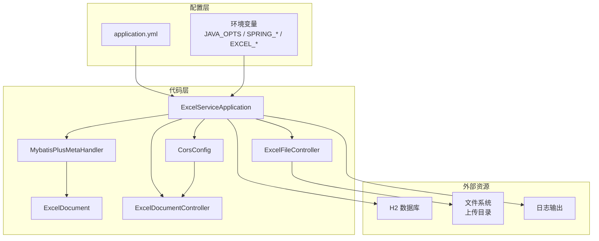
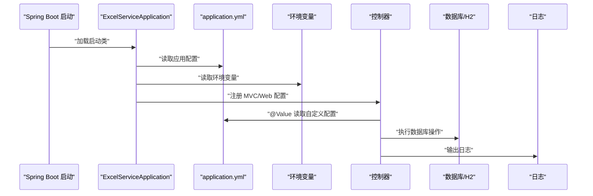
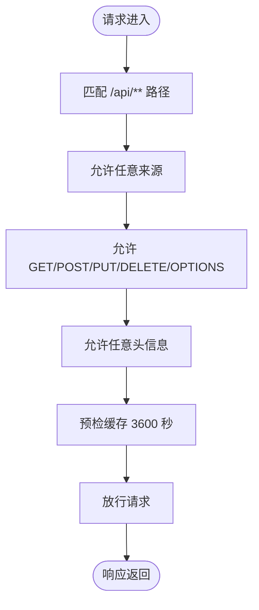
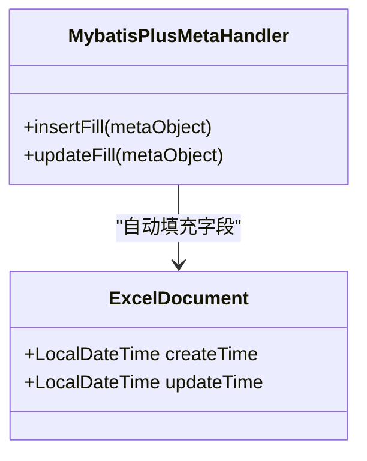
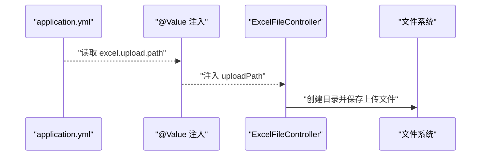
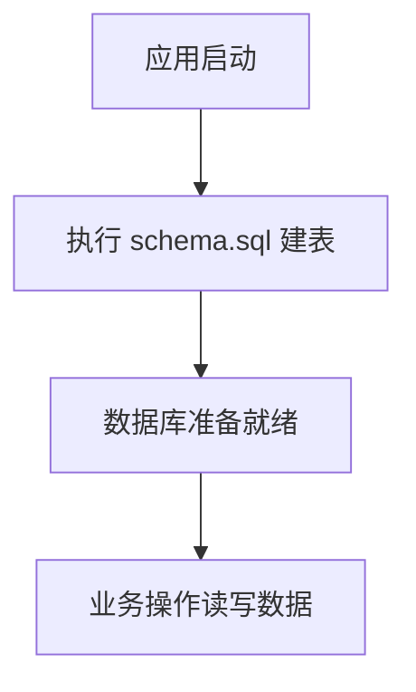
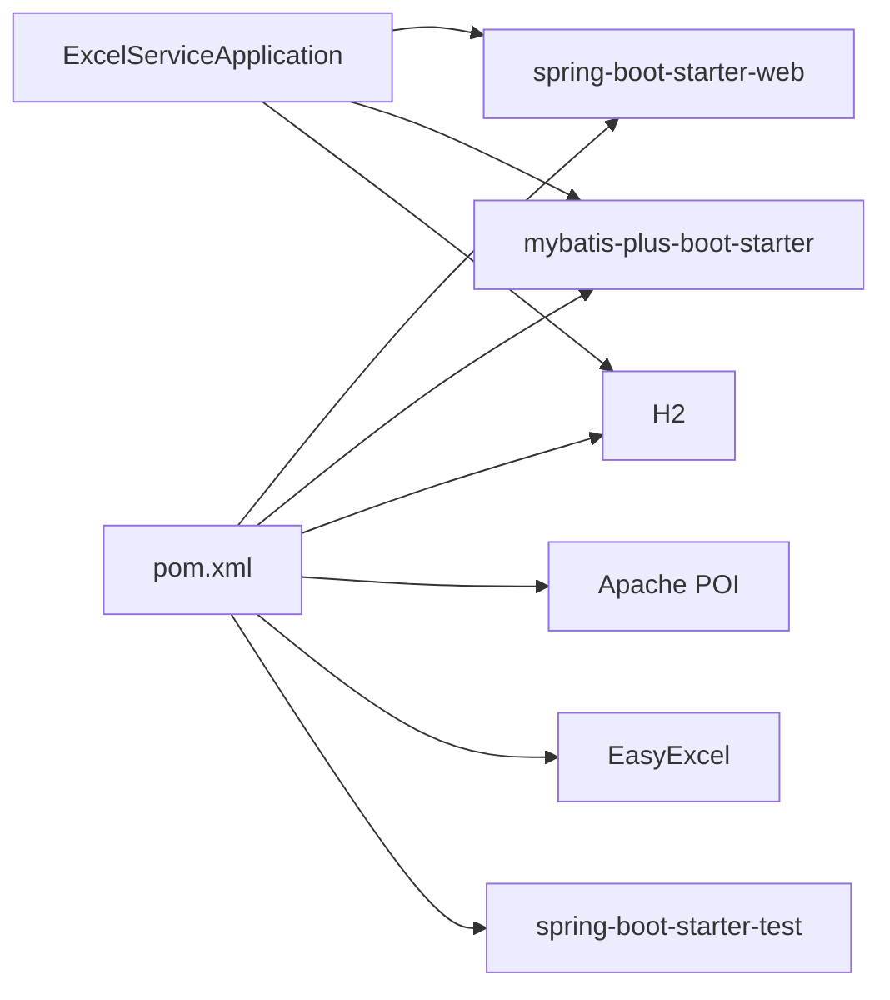

# 配置管理

<cite>
**本文引用的文件**
- [CorsConfig.java](file://dataloom-server/src/main/java/com/demo/excel/config/CorsConfig.java)
- [MybatisPlusMetaHandler.java](file://dataloom-server/src/main/java/com/demo/excel/config/MybatisPlusMetaHandler.java)
- [application.yml](file://dataloom-server/src/main/resources/application.yml)
- [ExcelDocument.java](file://dataloom-server/src/main/java/com/demo/excel/entity/ExcelDocument.java)
- [ExcelFileController.java](file://dataloom-server/src/main/java/com/demo/excel/controller/ExcelFileController.java)
- [ExcelDocumentController.java](file://dataloom-server/src/main/java/com/demo/excel/controller/ExcelDocumentController.java)
- [ExcelServiceApplication.java](file://dataloom-server/src/main/java/com/demo/excel/ExcelServiceApplication.java)
- [schema.sql](file://dataloom-server/src/main/resources/schema.sql)
- [pom.xml](file://dataloom-server/pom.xml)
- [docker-compose.yml](file://deplay/docker-compose.yml)
</cite>

## 目录
1. [简介](#简介)
2. [项目结构](#项目结构)
3. [核心组件](#核心组件)
4. [架构概览](#架构概览)
5. [详细组件分析](#详细组件分析)
6. [依赖分析](#依赖分析)
7. [性能考虑](#性能考虑)
8. [故障排除指南](#故障排除指南)
9. [结论](#结论)
10. [附录](#附录)

## 简介
本文件系统性梳理 Spring Boot 应用中的配置管理实践，重点围绕以下主题：
- Spring Boot 配置方式与优先级：XML 配置、注解配置、属性文件配置、环境变量、命令行参数等
- CORS 跨域配置的实现原理与可调参数
- MyBatis-Plus 元数据处理器的自动填充机制与字段映射
- 配置文件优先级与覆盖规则（含环境变量与容器部署）
- 配置最佳实践：分类、敏感信息保护、环境隔离
- 配置调试与故障排除方法

本项目采用 Spring Boot 2.1.15.RELEASE + MyBatis-Plus，配置集中在 application.yml 中，并通过注解与组件扫描完成自动装配。

## 项目结构
后端服务位于 dataloom-server，核心配置与实体分布如下：
- 配置类：CorsConfig（CORS）、MybatisPlusMetaHandler（自动填充）
- 配置文件：application.yml（应用、数据库、MyBatis-Plus、自定义配置、日志）
- 实体类：ExcelDocument（演示自动填充字段）
- 控制器：ExcelFileController（读取自定义配置）、ExcelDocumentController（REST 接口）
- 启动类：ExcelServiceApplication（组件扫描与启动）
- 构建文件：pom.xml（依赖与插件）
- 部署：docker-compose.yml（环境变量注入）

**图示来源**
- [ExcelServiceApplication.java:13-20](file://dataloom-server/src/main/java/com/demo/excel/ExcelServiceApplication.java#L13-L20)
- [CorsConfig.java:10-21](file://dataloom-server/src/main/java/com/demo/excel/config/CorsConfig.java#L10-L21)
- [MybatisPlusMetaHandler.java:16-36](file://dataloom-server/src/main/java/com/demo/excel/config/MybatisPlusMetaHandler.java#L16-L36)
- [ExcelDocument.java:48-52](file://dataloom-server/src/main/java/com/demo/excel/entity/ExcelDocument.java#L48-L52)
- [ExcelFileController.java:50-51](file://dataloom-server/src/main/java/com/demo/excel/controller/ExcelFileController.java#L50-L51)
- [application.yml:1-51](file://dataloom-server/src/main/resources/application.yml#L1-L51)

**章节来源**
- [ExcelServiceApplication.java:13-20](file://dataloom-server/src/main/java/com/demo/excel/ExcelServiceApplication.java#L13-L20)
- [application.yml:1-51](file://dataloom-server/src/main/resources/application.yml#L1-L51)

## 核心组件
- CORS 跨域配置：通过 WebMvcConfigurer 实现，对 /api/** 路径开放跨域访问，允许任意来源、方法与头信息，缓存有效期 1 小时。
- MyBatis-Plus 元数据处理器：实现 MetaObjectHandler，在插入与更新时自动填充 createTime、updateTime 字段，减少业务代码重复。
- 自定义配置：excel.upload.path 用于控制文件上传目录，通过 @Value 注入到控制器中。
- 数据源与初始化：H2 内存数据库，启用 H2 Console，启动时执行 schema.sql 建表。
- 日志级别：设置 com.demo.excel 包为 DEBUG 级别，便于开发调试。

**章节来源**
- [CorsConfig.java:10-21](file://dataloom-server/src/main/java/com/demo/excel/config/CorsConfig.java#L10-L21)
- [MybatisPlusMetaHandler.java:16-36](file://dataloom-server/src/main/java/com/demo/excel/config/MybatisPlusMetaHandler.java#L16-L36)
- [ExcelFileController.java:50-51](file://dataloom-server/src/main/java/com/demo/excel/controller/ExcelFileController.java#L50-L51)
- [application.yml:8-29](file://dataloom-server/src/main/resources/application.yml#L8-L29)
- [application.yml:42-46](file://dataloom-server/src/main/resources/application.yml#L42-L46)
- [application.yml:48-51](file://dataloom-server/src/main/resources/application.yml#L48-L51)

## 架构概览
下图展示配置在系统中的作用与交互关系：启动类负责组件扫描与装配；配置文件驱动应用行为；控制器读取自定义配置；元数据处理器在持久化阶段自动填充字段；CORS 配置保障前后端跨域通信。

**图示来源**
- [ExcelServiceApplication.java:13-20](file://dataloom-server/src/main/java/com/demo/excel/ExcelServiceApplication.java#L13-L20)
- [application.yml:1-51](file://dataloom-server/src/main/resources/application.yml#L1-L51)
- [ExcelFileController.java:50-51](file://dataloom-server/src/main/java/com/demo/excel/controller/ExcelFileController.java#L50-L51)

## 详细组件分析

### CORS 跨域配置（CorsConfig）
- 实现原理：实现 WebMvcConfigurer 接口，重写 addCorsMappings 方法，注册 /api/** 路径的跨域策略。
- 关键配置项：
  - 路径匹配：/api/**
  - 允许来源：*（开发阶段）
  - 允许方法：GET、POST、PUT、DELETE、OPTIONS
  - 允许头信息：*（开发阶段）
  - 预检请求缓存：3600 秒
- 使用场景：前端 Web 应用与后端 API 之间的跨域请求处理。

**图示来源**
- [CorsConfig.java:14-19](file://dataloom-server/src/main/java/com/demo/excel/config/CorsConfig.java#L14-L19)

**章节来源**
- [CorsConfig.java:10-21](file://dataloom-server/src/main/java/com/demo/excel/config/CorsConfig.java#L10-L21)

### MyBatis-Plus 元数据处理器（MybatisPlusMetaHandler）
- 作用：在实体对象插入或更新时，自动填充 createTime、updateTime 字段，减少业务层重复代码。
- 实现细节：
  - 插入时：同时填充 createTime 与 updateTime
  - 更新时：仅填充 updateTime
  - 字段映射：严格模式下按字段名与类型进行填充
- 与实体类配合：ExcelDocument 实体中通过注解声明需要自动填充的字段，处理器据此执行填充逻辑。

**图示来源**
- [MybatisPlusMetaHandler.java:16-36](file://dataloom-server/src/main/java/com/demo/excel/config/MybatisPlusMetaHandler.java#L16-L36)
- [ExcelDocument.java:48-52](file://dataloom-server/src/main/java/com/demo/excel/entity/ExcelDocument.java#L48-L52)

**章节来源**
- [MybatisPlusMetaHandler.java:16-36](file://dataloom-server/src/main/java/com/demo/excel/config/MybatisPlusMetaHandler.java#L16-L36)
- [ExcelDocument.java:48-52](file://dataloom-server/src/main/java/com/demo/excel/entity/ExcelDocument.java#L48-L52)

### 自定义配置（excel.upload.path）
- 配置位置：application.yml 中的 excel.upload.path
- 注入方式：@Value 注解注入到 ExcelFileController
- 用途：控制文件上传目录，确保上传文件落盘到指定路径
- 默认值：./upload（可通过环境变量覆盖）

**图示来源**
- [application.yml:42-46](file://dataloom-server/src/main/resources/application.yml#L42-L46)
- [ExcelFileController.java:50-51](file://dataloom-server/src/main/java/com/demo/excel/controller/ExcelFileController.java#L50-L51)

**章节来源**
- [application.yml:42-46](file://dataloom-server/src/main/resources/application.yml#L42-L46)
- [ExcelFileController.java:50-51](file://dataloom-server/src/main/java/com/demo/excel/controller/ExcelFileController.java#L50-L51)

### 数据源与初始化（H2 + schema.sql）
- 数据源：H2 内存数据库，启用 H2 Console，便于开发调试
- 初始化：启动时执行 schema.sql 建表脚本，确保数据库结构就绪
- 可替换：生产环境可切换至 MySQL，仅需调整 application.yml 中的数据源配置

**图示来源**
- [application.yml:8-29](file://dataloom-server/src/main/resources/application.yml#L8-L29)
- [schema.sql:1-124](file://dataloom-server/src/main/resources/schema.sql#L1-L124)

**章节来源**
- [application.yml:8-29](file://dataloom-server/src/main/resources/application.yml#L8-L29)
- [schema.sql:1-124](file://dataloom-server/src/main/resources/schema.sql#L1-L124)

### 日志配置
- 日志级别：将 com.demo.excel 包的日志级别设为 DEBUG，便于开发调试
- 输出方式：StdOutImpl 输出到标准输出

**章节来源**
- [application.yml:48-51](file://dataloom-server/src/main/resources/application.yml#L48-L51)

## 依赖分析
- 启动类组件扫描：@MapperScan 指定 Mapper 扫描包，确保 MyBatis-Plus 能发现 Mapper 接口
- 依赖管理：pom.xml 中引入 spring-boot-starter-web、mybatis-plus-boot-starter、H2、POI、EasyExcel 等
- 构建插件：spring-boot-maven-plugin 用于打包与运行

**图示来源**
- [pom.xml:32-106](file://dataloom-server/pom.xml#L32-L106)
- [ExcelServiceApplication.java:13-14](file://dataloom-server/src/main/java/com/demo/excel/ExcelServiceApplication.java#L13-L14)

**章节来源**
- [pom.xml:32-106](file://dataloom-server/pom.xml#L32-L106)
- [ExcelServiceApplication.java:13-14](file://dataloom-server/src/main/java/com/demo/excel/ExcelServiceApplication.java#L13-L14)

## 性能考虑
- 文件上传大小限制：application.yml 中限制单文件与请求总大小为 100MB，避免内存溢出
- 数据库连接与初始化：H2 适合 Demo，生产建议使用 MySQL 并优化连接池配置
- 日志输出：DEBUG 级别会带来额外开销，生产环境建议调整为 INFO 或更高

**章节来源**
- [application.yml:19-23](file://dataloom-server/src/main/resources/application.yml#L19-L23)
- [application.yml:48-51](file://dataloom-server/src/main/resources/application.yml#L48-L51)

## 故障排除指南
- CORS 跨域问题
  - 症状：浏览器报跨域错误
  - 排查：确认请求路径是否匹配 /api/**；检查 allowedOrigins、allowedMethods、allowedHeaders 是否符合预期
  - 参考：[CorsConfig.java:14-19](file://dataloom-server/src/main/java/com/demo/excel/config/CorsConfig.java#L14-L19)
- 文件上传失败
  - 症状：上传接口报错或文件未保存
  - 排查：确认 excel.upload.path 是否存在且可写；检查 multipart 大小限制；查看日志输出
  - 参考：[ExcelFileController.java:70-116](file://dataloom-server/src/main/java/com/demo/excel/controller/ExcelFileController.java#L70-L116)，[application.yml:19-23](file://dataloom-server/src/main/resources/application.yml#L19-L23)
- 数据库初始化失败
  - 症状：启动时报建表错误
  - 排查：确认 schema.sql 语法与数据库兼容性；检查 H2 Console 是否可用；确认数据源配置正确
  - 参考：[application.yml:25-29](file://dataloom-server/src/main/resources/application.yml#L25-L29)，[schema.sql:1-124](file://dataloom-server/src/main/resources/schema.sql#L1-L124)
- 自动填充字段为空
  - 症状：createTime/updateTime 为空
  - 排查：确认实体类字段标注了自动填充注解；检查处理器是否被 Spring 扫描；验证数据库字段类型
  - 参考：[ExcelDocument.java:48-52](file://dataloom-server/src/main/java/com/demo/excel/entity/ExcelDocument.java#L48-L52)，[MybatisPlusMetaHandler.java:16-36](file://dataloom-server/src/main/java/com/demo/excel/config/MybatisPlusMetaHandler.java#L16-L36)
- 环境变量覆盖问题
  - 症状：配置未生效
  - 排查：确认环境变量前缀（SPRING_APPLICATION_NAME、SPRING_DATASOURCE_URL、EXCEL_UPLOAD_PATH）；检查 docker-compose.yml 中的 environment 配置
  - 参考：[docker-compose.yml:8-12](file://deplay/docker-compose.yml#L8-L12)

**章节来源**
- [CorsConfig.java:14-19](file://dataloom-server/src/main/java/com/demo/excel/config/CorsConfig.java#L14-L19)
- [ExcelFileController.java:70-116](file://dataloom-server/src/main/java/com/demo/excel/controller/ExcelFileController.java#L70-L116)
- [application.yml:19-29](file://dataloom-server/src/main/resources/application.yml#L19-L29)
- [schema.sql:1-124](file://dataloom-server/src/main/resources/schema.sql#L1-L124)
- [ExcelDocument.java:48-52](file://dataloom-server/src/main/java/com/demo/excel/entity/ExcelDocument.java#L48-L52)
- [MybatisPlusMetaHandler.java:16-36](file://dataloom-server/src/main/java/com/demo/excel/config/MybatisPlusMetaHandler.java#L16-L36)
- [docker-compose.yml:8-12](file://deplay/docker-compose.yml#L8-L12)

## 结论
本项目通过简洁的配置实现了完整的后端能力：跨域访问、自动填充、文件上传、数据库初始化与日志输出。建议在生产环境中：
- 严格限制 CORS 策略，明确允许来源与方法
- 使用 MySQL 替代 H2，并配置连接池与监控
- 将敏感配置放入环境变量或密钥管理服务
- 将日志级别调整为生产友好级别
- 对上传目录与文件大小进行更严格的校验与配额控制

## 附录

### 配置优先级与覆盖规则（Spring Boot 2.x）
- 命令行参数 > 环境变量 > application.yml > 默认值
- 环境变量命名规范：SPRING_APPLICATION_NAME、SPRING_DATASOURCE_URL、EXCEL_UPLOAD_PATH 等
- 容器部署：docker-compose.yml 中通过 environment 注入环境变量，覆盖 application.yml 中的默认值

**章节来源**
- [docker-compose.yml:8-12](file://deplay/docker-compose.yml#L8-L12)
- [application.yml:42-46](file://dataloom-server/src/main/resources/application.yml#L42-L46)

### 配置最佳实践清单
- 配置分类
  - 应用基础：server.port、spring.application.name
  - 数据库：spring.datasource.*、h2.console.*
  - 文件上传：multipart 大小限制
  - MyBatis-Plus：map-underscore-to-camel-case、db-config.*
  - 自定义配置：excel.upload.path
  - 日志：logging.level.*
- 敏感信息保护
  - 数据库密码、密钥等放入环境变量或配置中心
  - 不要将敏感信息提交到版本库
- 环境隔离
  - 开发：H2 + 本地文件系统
  - 测试：独立数据库实例
  - 生产：MySQL + 远程存储 + 严格的 CORS 与安全策略