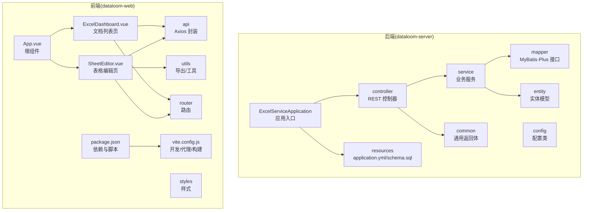
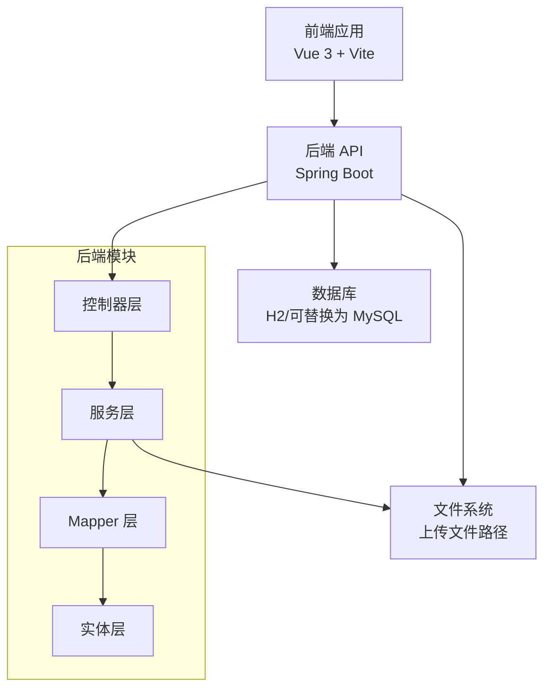
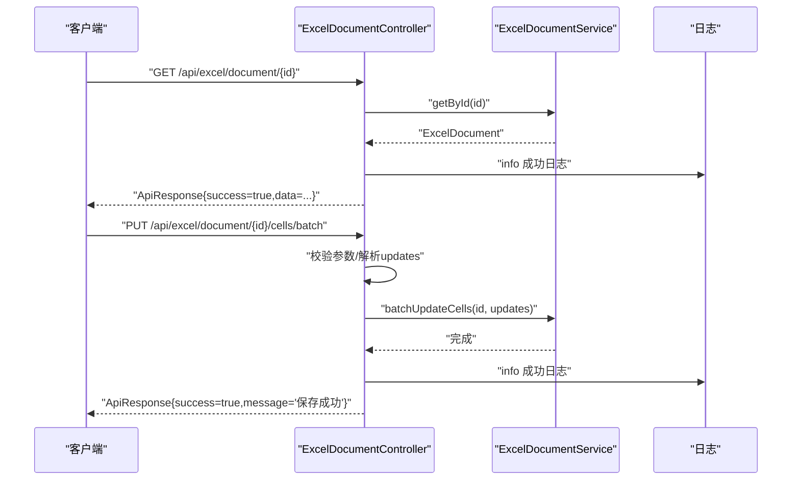
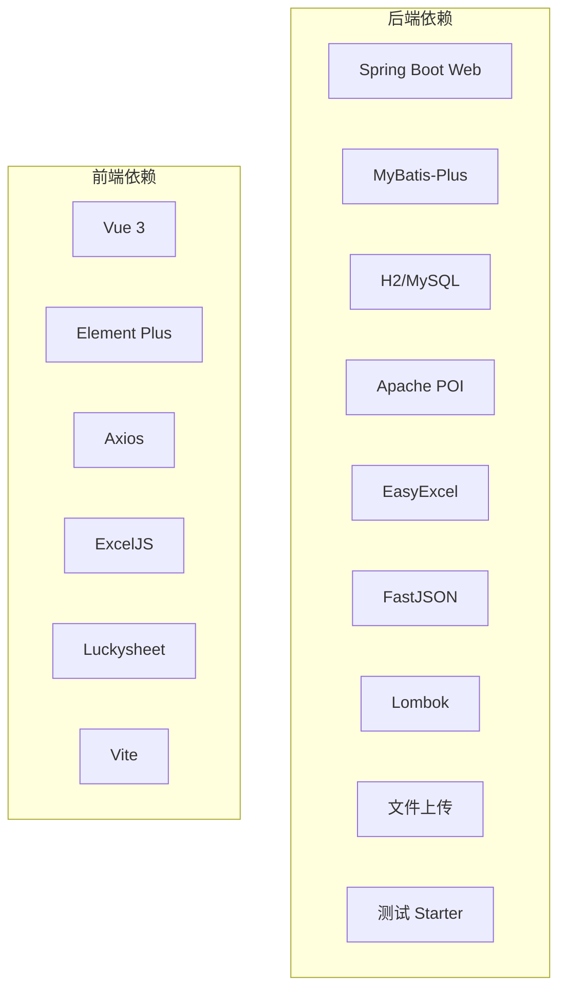

# 代码规范

<cite>
**本文引用的文件**
- [ExcelServiceApplication.java](file://dataloom-server/src/main/java/com/demo/excel/ExcelServiceApplication.java)
- [ApiResponse.java](file://dataloom-server/src/main/java/com/demo/excel/common/ApiResponse.java)
- [ExcelDocumentController.java](file://dataloom-server/src/main/java/com/demo/excel/controller/ExcelDocumentController.java)
- [ExcelDocumentService.java](file://dataloom-server/src/main/java/com/demo/excel/service/ExcelDocumentService.java)
- [ExcelDocument.java](file://dataloom-server/src/main/java/com/demo/excel/entity/ExcelDocument.java)
- [ExcelSheet.java](file://dataloom-server/src/main/java/com/demo/excel/entity/ExcelSheet.java)
- [ExcelSheetChunk.java](file://dataloom-server/src/main/java/com/demo/excel/entity/ExcelSheetChunk.java)
- [application.yml](file://dataloom-server/src/main/resources/application.yml)
- [pom.xml](file://dataloom-server/pom.xml)
- [ExcelDashboard.vue](file://dataloom-web/src/views/ExcelDashboard.vue)
- [SheetEditor.vue](file://dataloom-web/src/views/SheetEditor.vue)
- [App.vue](file://dataloom-web/src/App.vue)
- [package.json](file://dataloom-web/package.json)
- [vite.config.js](file://dataloom-web/vite.config.js)
- [README.md](file://README.md)
</cite>

## 目录
1. [简介](#简介)
2. [项目结构](#项目结构)
3. [核心组件](#核心组件)
4. [架构总览](#架构总览)
5. [详细组件分析](#详细组件分析)
6. [依赖分析](#依赖分析)
7. [性能考虑](#性能考虑)
8. [故障排查指南](#故障排查指南)
9. [结论](#结论)
10. [附录](#附录)

## 简介
本文件为 DataLoom 项目的代码规范文档，面向 Java 后端与 Vue.js 前端团队，统一命名、注释、错误处理、日志与 Lombok 使用规范，并给出前后端一致的代码风格与 IDE 自动格式化建议。文档以现有代码为依据，提炼最佳实践，便于新成员快速上手与长期维护。

## 项目结构
DataLoom 采用前后端分离架构：
- 后端：Spring Boot + MyBatis-Plus，模块按职责划分为 controller、service、mapper、entity、common、config。
- 前端：Vue 3 + Vite + Element Plus，采用 Composition API 与单文件组件组织页面与功能模块。

**图表来源**
- [ExcelServiceApplication.java:1-21](file://dataloom-server/src/main/java/com/demo/excel/ExcelServiceApplication.java#L1-L21)
- [ExcelDocumentController.java:1-296](file://dataloom-server/src/main/java/com/demo/excel/controller/ExcelDocumentController.java#L1-L296)
- [ExcelDocumentService.java:1-119](file://dataloom-server/src/main/java/com/demo/excel/service/ExcelDocumentService.java#L1-L119)
- [ExcelDocument.java:1-55](file://dataloom-server/src/main/java/com/demo/excel/entity/ExcelDocument.java#L1-L55)
- [ExcelSheet.java:1-77](file://dataloom-server/src/main/java/com/demo/excel/entity/ExcelSheet.java#L1-L77)
- [ExcelSheetChunk.java:1-53](file://dataloom-server/src/main/java/com/demo/excel/entity/ExcelSheetChunk.java#L1-L53)
- [ApiResponse.java:1-52](file://dataloom-server/src/main/java/com/demo/excel/common/ApiResponse.java#L1-L52)
- [application.yml:1-51](file://dataloom-server/src/main/resources/application.yml#L1-L51)
- [App.vue:1-4](file://dataloom-web/src/App.vue#L1-L4)
- [ExcelDashboard.vue:1-386](file://dataloom-web/src/views/ExcelDashboard.vue#L1-L386)
- [SheetEditor.vue:1-970](file://dataloom-web/src/views/SheetEditor.vue#L1-L970)
- [package.json:1-27](file://dataloom-web/package.json#L1-L27)
- [vite.config.js:1-26](file://dataloom-web/vite.config.js#L1-L26)

**章节来源**
- [README.md:217-242](file://README.md#L217-L242)
- [pom.xml:1-127](file://dataloom-server/pom.xml#L1-L127)

## 核心组件
- 应用入口与扫描：应用入口类负责组件扫描与启动，统一在包路径 com.demo.excel 下进行。
- 统一返回体：ApiResponse 提供统一的响应结构，包含状态码、成功标志、消息与数据泛型字段，配套静态工厂方法。
- 控制器：REST 控制器集中暴露业务接口，使用注解声明请求路径与方法，内部进行参数校验与异常捕获。
- 服务层：封装业务逻辑，调用 Mapper 访问数据库，必要时进行文件系统清理。
- 实体层：使用 Lombok @Data 简化 getter/setter，配合 MyBatis-Plus 注解完成表映射与字段填充。
- 配置：application.yml 定义端口、数据源、MyBatis-Plus 全局配置与日志级别。

**章节来源**
- [ExcelServiceApplication.java:1-21](file://dataloom-server/src/main/java/com/demo/excel/ExcelServiceApplication.java#L1-L21)
- [ApiResponse.java:1-52](file://dataloom-server/src/main/java/com/demo/excel/common/ApiResponse.java#L1-L52)
- [ExcelDocumentController.java:1-296](file://dataloom-server/src/main/java/com/demo/excel/controller/ExcelDocumentController.java#L1-L296)
- [ExcelDocumentService.java:1-119](file://dataloom-server/src/main/java/com/demo/excel/service/ExcelDocumentService.java#L1-L119)
- [ExcelDocument.java:1-55](file://dataloom-server/src/main/java/com/demo/excel/entity/ExcelDocument.java#L1-L55)
- [ExcelSheet.java:1-77](file://dataloom-server/src/main/java/com/demo/excel/entity/ExcelSheet.java#L1-L77)
- [ExcelSheetChunk.java:1-53](file://dataloom-server/src/main/java/com/demo/excel/entity/ExcelSheetChunk.java#L1-L53)
- [application.yml:1-51](file://dataloom-server/src/main/resources/application.yml#L1-L51)

## 架构总览
后端采用分层架构，控制器负责请求接入与参数校验，服务层承载业务，实体与 Mapper 完成数据持久化。前端通过 Axios 调用后端 API，编辑器 Luckysheet 与导出工具 ExcelJS 在前端侧完成交互与产物生成。

**图表来源**
- [ExcelDocumentController.java:1-296](file://dataloom-server/src/main/java/com/demo/excel/controller/ExcelDocumentController.java#L1-L296)
- [ExcelDocumentService.java:1-119](file://dataloom-server/src/main/java/com/demo/excel/service/ExcelDocumentService.java#L1-L119)
- [ExcelDocument.java:1-55](file://dataloom-server/src/main/java/com/demo/excel/entity/ExcelDocument.java#L1-L55)
- [application.yml:1-51](file://dataloom-server/src/main/resources/application.yml#L1-L51)
- [vite.config.js:1-26](file://dataloom-web/vite.config.js#L1-L26)

## 详细组件分析

### Java 后端编码规范

#### 包命名规范
- 建议采用反向域名 + 功能域的层级结构，如 com.demo.excel.controller、com.demo.excel.service、com.demo.excel.entity、com.demo.excel.common、com.demo.excel.config。
- 当前项目已遵循该规范，保持一致性。

**章节来源**
- [ExcelServiceApplication.java:1-21](file://dataloom-server/src/main/java/com/demo/excel/ExcelServiceApplication.java#L1-L21)
- [ExcelDocumentController.java:1-296](file://dataloom-server/src/main/java/com/demo/excel/controller/ExcelDocumentController.java#L1-L296)
- [ExcelDocumentService.java:1-119](file://dataloom-server/src/main/java/com/demo/excel/service/ExcelDocumentService.java#L1-L119)
- [ExcelDocument.java:1-55](file://dataloom-server/src/main/java/com/demo/excel/entity/ExcelDocument.java#L1-L55)

#### 类与接口命名约定
- 类名使用帕斯卡命名法，抽象类与接口使用名词或形容词，如 ExcelDocument、ExcelDocumentService、ExcelDocumentMapper。
- 建议控制器类名以 Controller 结尾，服务类以 Service 结尾，Mapper 接口以 Mapper 结尾，保持职责清晰。

**章节来源**
- [ExcelDocumentController.java:1-296](file://dataloom-server/src/main/java/com/demo/excel/controller/ExcelDocumentController.java#L1-L296)
- [ExcelDocumentService.java:1-119](file://dataloom-server/src/main/java/com/demo/excel/service/ExcelDocumentService.java#L1-L119)
- [ExcelDocument.java:1-55](file://dataloom-server/src/main/java/com/demo/excel/entity/ExcelDocument.java#L1-L55)

#### 方法命名规则
- 方法名使用动词短语，体现行为，如 create、updateSheetMeta、delete、batchUpdateCells、saveWorkbook。
- 参数命名清晰表达意图，如 id、pageNum、pageSize、updates、body。

**章节来源**
- [ExcelDocumentService.java:25-117](file://dataloom-server/src/main/java/com/demo/excel/service/ExcelDocumentService.java#L25-L117)
- [ExcelDocumentController.java:37-226](file://dataloom-server/src/main/java/com/demo/excel/controller/ExcelDocumentController.java#L37-L226)

#### 变量命名习惯
- 局部变量采用小驼峰，避免缩写；集合与列表使用复数形式；布尔变量以 is/has/should 等前缀增强可读性。
- 常量使用全大写加下划线分隔。

**章节来源**
- [ExcelDocumentController.java:44-68](file://dataloom-server/src/main/java/com/demo/excel/controller/ExcelDocumentController.java#L44-L68)
- [ExcelDocumentService.java:72-77](file://dataloom-server/src/main/java/com/demo/excel/service/ExcelDocumentService.java#L72-L77)

#### 注释规范
- 类注释：简述职责与注意事项，必要时说明设计权衡与边界。
- 方法注释：说明用途、输入输出、异常与副作用；参数注释使用标准标签。
- 字段注释：简述含义与约束；复杂字段补充默认值与取值范围。

示例参考：
- 类注释：见 [ExcelDocumentController.java:19-21](file://dataloom-server/src/main/java/com/demo/excel/controller/ExcelDocumentController.java#L19-L21)、[ExcelDocumentService.java:13-18](file://dataloom-server/src/main/java/com/demo/excel/service/ExcelDocumentService.java#L13-L18)、[ExcelDocument.java:8-14](file://dataloom-server/src/main/java/com/demo/excel/entity/ExcelDocument.java#L8-L14)。
- 方法注释：见 [ExcelDocumentController.java:38-131](file://dataloom-server/src/main/java/com/demo/excel/controller/ExcelDocumentController.java#L38-L131)、[ExcelDocumentService.java:25-117](file://dataloom-server/src/main/java/com/demo/excel/service/ExcelDocumentService.java#L25-L117)。
- 字段注释：见 [ExcelSheet.java:8-77](file://dataloom-server/src/main/java/com/demo/excel/entity/ExcelSheet.java#L8-L77)、[ExcelSheetChunk.java:9-53](file://dataloom-server/src/main/java/com/demo/excel/entity/ExcelSheetChunk.java#L9-L53)。

**章节来源**
- [ExcelDocumentController.java:19-131](file://dataloom-server/src/main/java/com/demo/excel/controller/ExcelDocumentController.java#L19-L131)
- [ExcelDocumentService.java:13-117](file://dataloom-server/src/main/java/com/demo/excel/service/ExcelDocumentService.java#L13-L117)
- [ExcelDocument.java:8-55](file://dataloom-server/src/main/java/com/demo/excel/entity/ExcelDocument.java#L8-L55)
- [ExcelSheet.java:8-77](file://dataloom-server/src/main/java/com/demo/excel/entity/ExcelSheet.java#L8-L77)
- [ExcelSheetChunk.java:9-53](file://dataloom-server/src/main/java/com/demo/excel/entity/ExcelSheetChunk.java#L9-L53)

#### 错误处理最佳实践
- 统一返回体：使用 ApiResponse 提供统一结构，静态工厂方法简化成功与失败响应。
- 异常类型选择：业务异常使用通用失败响应；IO/解析异常捕获后记录日志并返回明确提示。
- 异常信息格式：对外提示简洁明确，内部记录堆栈与上下文；避免泄露敏感信息。
- 日志记录规范：使用 SLF4J 记录关键流程与错误，结合参数占位符输出上下文。

示例参考：
- 统一返回体：见 [ApiResponse.java:13-40](file://dataloom-server/src/main/java/com/demo/excel/common/ApiResponse.java#L13-L40)。
- 日志记录：见 [ExcelDocumentController.java:26-188](file://dataloom-server/src/main/java/com/demo/excel/controller/ExcelDocumentController.java#L26-L188)、[ExcelDocumentService.java:88-102](file://dataloom-server/src/main/java/com/demo/excel/service/ExcelDocumentService.java#L88-L102)。
- 配置日志级别：见 [application.yml:48-51](file://dataloom-server/src/main/resources/application.yml#L48-L51)。

**章节来源**
- [ApiResponse.java:1-52](file://dataloom-server/src/main/java/com/demo/excel/common/ApiResponse.java#L1-L52)
- [ExcelDocumentController.java:26-188](file://dataloom-server/src/main/java/com/demo/excel/controller/ExcelDocumentController.java#L26-L188)
- [ExcelDocumentService.java:88-102](file://dataloom-server/src/main/java/com/demo/excel/service/ExcelDocumentService.java#L88-L102)
- [application.yml:48-51](file://dataloom-server/src/main/resources/application.yml#L48-L51)

#### Lombok 注解使用规范
- @Data：用于实体类，自动生成 getter、setter、toString、equals、hashCode，提升可读性与减少样板代码。
- @TableName/@TableId/@TableField：与 MyBatis-Plus 配合完成表映射与字段填充。
- @NoArgsConstructor/@AllArgsConstructor：按需提供构造函数，避免无参构造缺失导致的序列化问题。
- @Version：乐观锁版本号，配合数据库字段实现并发控制。

示例参考：
- 实体类注解：见 [ExcelDocument.java:15-16](file://dataloom-server/src/main/java/com/demo/excel/entity/ExcelDocument.java#L15-L16)、[ExcelSheet.java:14-15](file://dataloom-server/src/main/java/com/demo/excel/entity/ExcelSheet.java#L14-L15)、[ExcelSheetChunk.java:18-19](file://dataloom-server/src/main/java/com/demo/excel/entity/ExcelSheetChunk.java#L18-L19)。
- 依赖声明：见 [pom.xml:87-92](file://dataloom-server/pom.xml#L87-L92)。

**章节来源**
- [ExcelDocument.java:15-16](file://dataloom-server/src/main/java/com/demo/excel/entity/ExcelDocument.java#L15-L16)
- [ExcelSheet.java:14-15](file://dataloom-server/src/main/java/com/demo/excel/entity/ExcelSheet.java#L14-L15)
- [ExcelSheetChunk.java:18-19](file://dataloom-server/src/main/java/com/demo/excel/entity/ExcelSheetChunk.java#L18-L19)
- [pom.xml:87-92](file://dataloom-server/pom.xml#L87-L92)

#### 控制器与服务调用时序

**图表来源**
- [ExcelDocumentController.java:77-190](file://dataloom-server/src/main/java/com/demo/excel/controller/ExcelDocumentController.java#L77-L190)
- [ExcelDocumentService.java:61-117](file://dataloom-server/src/main/java/com/demo/excel/service/ExcelDocumentService.java#L61-L117)

### Vue.js 前端编码规范

#### 组件命名与组织
- 组件文件采用帕斯卡命名，如 ExcelDashboard.vue、SheetEditor.vue；根组件 App.vue。
- 页面组件放置于 views 目录，公共工具与导出逻辑置于 utils，API 封装位于 api，路由配置在 router。

**章节来源**
- [App.vue:1-4](file://dataloom-web/src/App.vue#L1-L4)
- [ExcelDashboard.vue:1-386](file://dataloom-web/src/views/ExcelDashboard.vue#L1-L386)
- [SheetEditor.vue:1-970](file://dataloom-web/src/views/SheetEditor.vue#L1-L970)
- [package.json:1-27](file://dataloom-web/package.json#L1-L27)

#### 属性与事件命名
- 属性使用 kebab-case，如 el-button、el-table-column；在模板中绑定属性时保持一致。
- 事件监听使用 camelCase，如 @click、@current-change；与 Element Plus 组件交互时遵循其事件规范。

**章节来源**
- [ExcelDashboard.vue:52-99](file://dataloom-web/src/views/ExcelDashboard.vue#L52-L99)
- [SheetEditor.vue:3-36](file://dataloom-web/src/views/SheetEditor.vue#L3-L36)

#### API 调用与错误处理
- 统一通过 axios 封装的 API 方法调用后端接口，对响应体进行结构校验与错误提示。
- 使用 ElMessage/ElMessageBox 提供用户反馈，区分警告、错误与成功信息。

**章节来源**
- [ExcelDashboard.vue:126-140](file://dataloom-web/src/views/ExcelDashboard.vue#L126-L140)
- [SheetEditor.vue:547-631](file://dataloom-web/src/views/SheetEditor.vue#L547-L631)

#### 代码格式化与 IDE 设置
- 前端使用 Vite 作为构建与开发服务器，配置了代理将 /api 请求转发至后端 9191 端口。
- 建议在 IDE 中启用 Prettier/Volar 等插件，统一 Vue 模板、Script 与 CSS 格式。
- 后端使用 Maven 编译，建议在 IDE 中启用 Maven 自动导入与格式化（如 SpotBugs/Checkstyle 可选）。

**章节来源**
- [vite.config.js:1-26](file://dataloom-web/vite.config.js#L1-L26)
- [pom.xml:109-125](file://dataloom-server/pom.xml#L109-L125)

## 依赖分析
- 后端依赖：Spring Boot Web、MyBatis-Plus、H2/MySQL、Apache POI、EasyExcel、FastJSON、Lombok、文件上传、测试 Starter。
- 前端依赖：Vue 3、Element Plus、Axios、ExcelJS、Luckysheet、Vite。

**图表来源**
- [pom.xml:32-106](file://dataloom-server/pom.xml#L32-L106)
- [package.json:12-25](file://dataloom-web/package.json#L12-L25)

**章节来源**
- [pom.xml:32-106](file://dataloom-server/pom.xml#L32-L106)
- [package.json:12-25](file://dataloom-web/package.json#L12-L25)

## 性能考虑
- 分块存储：将 Sheet 的单元格数据按 1000 行切分为多个块，降低单次读写与传输压力，提升大表编辑性能。
- 懒加载：前端仅在需要时加载对应块，避免一次性拉取大量数据。
- 增量保存：仅当结构未变更时进行单元格增量更新，减少数据库写入与网络传输。
- 导出优化：前端使用 ExcelJS 直接从编辑器状态导出，避免后端重复解析与转换。

**章节来源**
- [README.md:108-129](file://README.md#L108-L129)
- [SheetEditor.vue:547-631](file://dataloom-web/src/views/SheetEditor.vue#L547-L631)

## 故障排查指南
- 启动与连接
  - 后端端口与数据库：确认 application.yml 中 server.port、datasource.url、logging.level。
  - 前端代理：确认 vite.config.js 中 /api 代理指向后端 9191 端口。
- 常见问题
  - 上传失败：检查文件大小限制与后端日志；确认前端文件类型校验与消息提示。
  - 文档加载失败：检查后端日志与 ApiResponse 返回体；确认文档是否存在与权限。
  - 保存失败：区分增量保存与全量保存路径，查看控制器日志与服务层异常信息。
- 日志定位
  - 后端：使用 SLF4J 输出 info/warn/error；根据日志上下文定位问题。
  - 前端：使用 ElMessage 提示错误；在浏览器控制台查看网络请求与响应。

**章节来源**
- [application.yml:1-51](file://dataloom-server/src/main/resources/application.yml#L1-L51)
- [vite.config.js:12-21](file://dataloom-web/vite.config.js#L12-L21)
- [ExcelDocumentController.java:146-189](file://dataloom-server/src/main/java/com/demo/excel/controller/ExcelDocumentController.java#L146-L189)
- [ExcelDashboard.vue:146-172](file://dataloom-web/src/views/ExcelDashboard.vue#L146-L172)
- [SheetEditor.vue:547-631](file://dataloom-web/src/views/SheetEditor.vue#L547-L631)

## 结论
本规范以现有代码为基础，总结了 DataLoom 在 Java 后端与 Vue.js 前端的命名、注释、错误处理、日志与 Lombok 使用等方面的最佳实践。建议团队在开发过程中严格遵循，持续改进，确保代码质量与可维护性。

## 附录

### API 定义概览（后端）
- 文档管理
  - GET /api/excel/document/list：分页获取文档列表
  - GET /api/excel/document/{id}：获取文档元信息与 Sheet 列表
  - PUT /api/excel/document/{id}/name：重命名文档
  - DELETE /api/excel/document/{id}：软删除文档
- 数据读写
  - GET /api/excel/document/{id}/sheet/{sheetId}/all：加载 Sheet 全部 celldata
  - PUT /api/excel/document/{id}/cells/batch：批量更新单元格
  - PUT /api/excel/document/{id}/workbook：全量快照保存

**章节来源**
- [README.md:190-215](file://README.md#L190-L215)

### 统一返回体结构
- 字段：code、success、message、data
- 成功/失败：通过静态工厂方法生成标准响应

**章节来源**
- [ApiResponse.java:13-40](file://dataloom-server/src/main/java/com/demo/excel/common/ApiResponse.java#L13-L40)