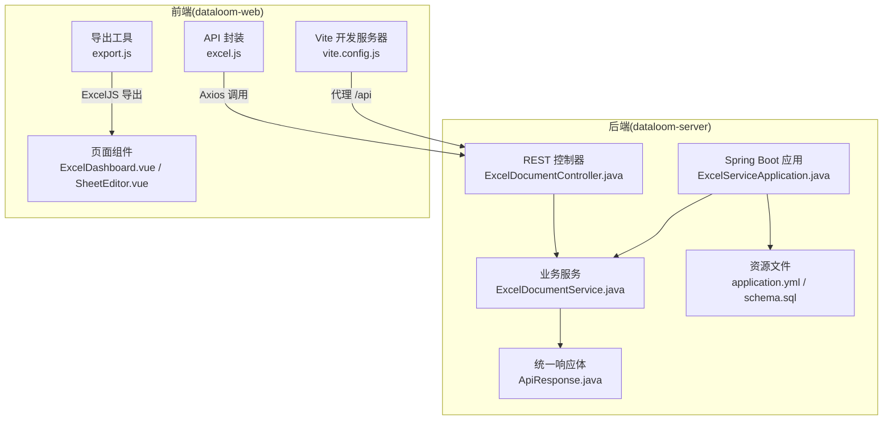
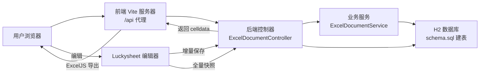
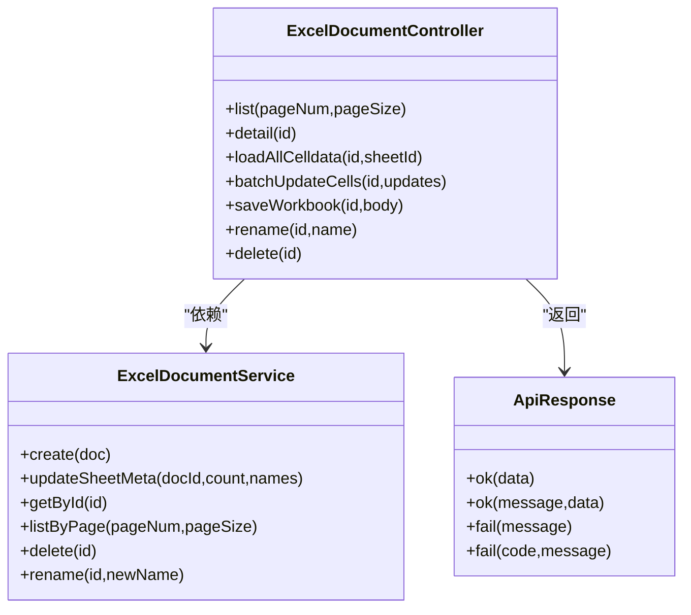
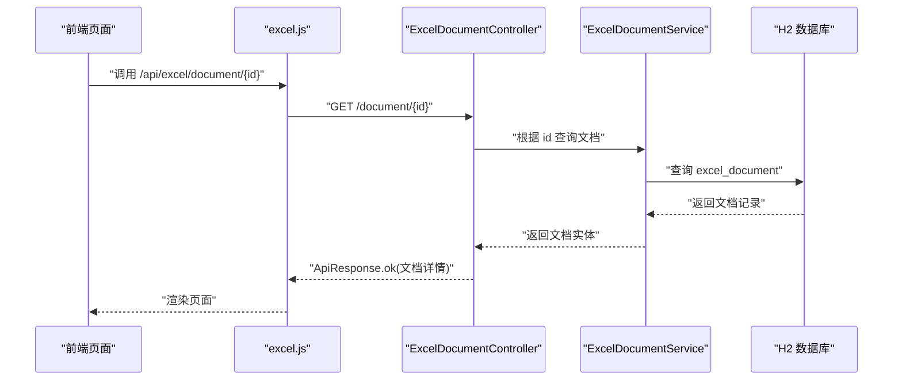
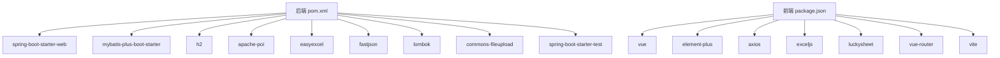

# 开发指南

<cite>
**本文引用的文件**
- [README.md](file://README.md)
- [pom.xml](file://dataloom-server/pom.xml)
- [application.yml](file://dataloom-server/src/main/resources/application.yml)
- [schema.sql](file://dataloom-server/src/main/resources/schema.sql)
- [ExcelServiceApplication.java](file://dataloom-server/src/main/java/com/demo/excel/ExcelServiceApplication.java)
- [ExcelDocumentController.java](file://dataloom-server/src/main/java/com/demo/excel/controller/ExcelDocumentController.java)
- [ExcelDocumentService.java](file://dataloom-server/src/main/java/com/demo/excel/service/ExcelDocumentService.java)
- [ExcelDocument.java](file://dataloom-server/src/main/java/com/demo/excel/entity/ExcelDocument.java)
- [ApiResponse.java](file://dataloom-server/src/main/java/com/demo/excel/common/ApiResponse.java)
- [ExcelSheetServiceTest.java](file://dataloom-server/src/test/java/com/demo/excel/service/ExcelSheetServiceTest.java)
- [package.json](file://dataloom-web/package.json)
- [vite.config.js](file://dataloom-web/vite.config.js)
- [excel.js](file://dataloom-web/src/api/excel.js)
- [export.js](file://dataloom-web/src/utils/export.js)
</cite>

## 目录
1. [简介](#简介)
2. [项目结构](#项目结构)
3. [核心组件](#核心组件)
4. [架构总览](#架构总览)
5. [详细组件分析](#详细组件分析)
6. [依赖关系分析](#依赖关系分析)
7. [性能考量](#性能考量)
8. [故障排查指南](#故障排查指南)
9. [结论](#结论)
10. [附录](#附录)

## 简介
本开发指南面向新加入 DataLoom 项目的开发者，目标是帮助你在最短时间内完成开发环境搭建、理解项目架构与代码规范、掌握测试策略与调试方法，并建立标准化的版本控制与代码审查流程。DataLoom 是一个前后端分离的在线 Excel 协作系统，采用 Spring Boot + Vue 3 + Luckysheet 技术栈，通过“分块存储”与“懒加载”实现对十万级数据的高效处理。

## 项目结构
DataLoom 采用双子仓结构：后端 dataloom-server（Spring Boot + MyBatis-Plus）与前端 dataloom-web（Vue 3 + Vite）。后端负责 Excel 文件解析、分块存储与 API 提供；前端负责 Luckysheet 编辑器渲染、单元格变更与导出。

**图表来源**
- [ExcelServiceApplication.java:1-21](file://dataloom-server/src/main/java/com/demo/excel/ExcelServiceApplication.java#L1-L21)
- [ExcelDocumentController.java:1-296](file://dataloom-server/src/main/java/com/demo/excel/controller/ExcelDocumentController.java#L1-L296)
- [ExcelDocumentService.java:1-119](file://dataloom-server/src/main/java/com/demo/excel/service/ExcelDocumentService.java#L1-L119)
- [ApiResponse.java:1-52](file://dataloom-server/src/main/java/com/demo/excel/common/ApiResponse.java#L1-L52)
- [application.yml:1-51](file://dataloom-server/src/main/resources/application.yml#L1-L51)
- [schema.sql:1-124](file://dataloom-server/src/main/resources/schema.sql#L1-L124)
- [vite.config.js:1-26](file://dataloom-web/vite.config.js#L1-L26)
- [excel.js:1-79](file://dataloom-web/src/api/excel.js#L1-L79)
- [export.js:1-239](file://dataloom-web/src/utils/export.js#L1-L239)

**章节来源**
- [README.md:217-242](file://README.md#L217-L242)
- [pom.xml:1-127](file://dataloom-server/pom.xml#L1-L127)
- [package.json:1-27](file://dataloom-web/package.json#L1-L27)

## 核心组件
- 启动入口与扫描
  - 后端启动类负责扫描 Mapper 包并启动 Spring Boot 应用。
  - 参考路径：[ExcelServiceApplication.java:1-21](file://dataloom-server/src/main/java/com/demo/excel/ExcelServiceApplication.java#L1-L21)
- 统一响应体
  - 统一返回体封装 code、success、message、data，便于前端一致处理。
  - 参考路径：[ApiResponse.java:1-52](file://dataloom-server/src/main/java/com/demo/excel/common/ApiResponse.java#L1-L52)
- 控制器层
  - 提供文档列表、详情、全量/增量保存、重命名、删除等接口。
  - 参考路径：[ExcelDocumentController.java:1-296](file://dataloom-server/src/main/java/com/demo/excel/controller/ExcelDocumentController.java#L1-L296)
- 业务服务层
  - 文档主表 CRUD、分页查询、软删除、重命名、更新 Sheet 元信息。
  - 参考路径：[ExcelDocumentService.java:1-119](file://dataloom-server/src/main/java/com/demo/excel/service/ExcelDocumentService.java#L1-L119)
- 实体与数据源
  - 文档实体标注 MyBatis-Plus 注解，启用自动填充与乐观锁。
  - 数据源配置与建表脚本位于资源文件。
  - 参考路径：
    - [ExcelDocument.java:1-55](file://dataloom-server/src/main/java/com/demo/excel/entity/ExcelDocument.java#L1-L55)
    - [application.yml:1-51](file://dataloom-server/src/main/resources/application.yml#L1-L51)
    - [schema.sql:1-124](file://dataloom-server/src/main/resources/schema.sql#L1-L124)
- 前端 API 与导出
  - Axios 封装统一前缀与超时；ExcelJS 导出工具负责样式还原。
  - 参考路径：
    - [excel.js:1-79](file://dataloom-web/src/api/excel.js#L1-L79)
    - [export.js:1-239](file://dataloom-web/src/utils/export.js#L1-L239)

**章节来源**
- [ExcelServiceApplication.java:1-21](file://dataloom-server/src/main/java/com/demo/excel/ExcelServiceApplication.java#L1-L21)
- [ApiResponse.java:1-52](file://dataloom-server/src/main/java/com/demo/excel/common/ApiResponse.java#L1-L52)
- [ExcelDocumentController.java:1-296](file://dataloom-server/src/main/java/com/demo/excel/controller/ExcelDocumentController.java#L1-L296)
- [ExcelDocumentService.java:1-119](file://dataloom-server/src/main/java/com/demo/excel/service/ExcelDocumentService.java#L1-L119)
- [ExcelDocument.java:1-55](file://dataloom-server/src/main/java/com/demo/excel/entity/ExcelDocument.java#L1-L55)
- [application.yml:1-51](file://dataloom-server/src/main/resources/application.yml#L1-L51)
- [schema.sql:1-124](file://dataloom-server/src/main/resources/schema.sql#L1-L124)
- [excel.js:1-79](file://dataloom-web/src/api/excel.js#L1-L79)
- [export.js:1-239](file://dataloom-web/src/utils/export.js#L1-L239)

## 架构总览
DataLoom 的数据流以“分块存储 + 懒加载”为核心，后端使用 H2 嵌入式数据库与 MyBatis-Plus，前端使用 Luckysheet 与 ExcelJS。整体交互如下：

**图表来源**
- [ExcelDocumentController.java:1-296](file://dataloom-server/src/main/java/com/demo/excel/controller/ExcelDocumentController.java#L1-L296)
- [ExcelDocumentService.java:1-119](file://dataloom-server/src/main/java/com/demo/excel/service/ExcelDocumentService.java#L1-L119)
- [schema.sql:1-124](file://dataloom-server/src/main/resources/schema.sql#L1-L124)
- [vite.config.js:1-26](file://dataloom-web/vite.config.js#L1-L26)
- [excel.js:1-79](file://dataloom-web/src/api/excel.js#L1-L79)
- [export.js:1-239](file://dataloom-web/src/utils/export.js#L1-L239)

## 详细组件分析

### 后端应用与配置
- 启动类与包扫描
  - 启动类启用 Spring Boot 并扫描 Mapper 包，确保 MyBatis-Plus 正常工作。
  - 参考路径：[ExcelServiceApplication.java:1-21](file://dataloom-server/src/main/java/com/demo/excel/ExcelServiceApplication.java#L1-L21)
- 数据源与 MyBatis-Plus
  - H2 数据源配置、文件上传大小限制、SQL 初始化、MyBatis-Plus 全局配置（驼峰映射、日志、逻辑删除值）。
  - 参考路径：[application.yml:1-51](file://dataloom-server/src/main/resources/application.yml#L1-L51)
- 建表脚本
  - 文档、Sheet、Chunk 三表设计，明确字段含义与索引建议（MySQL 参考注释）。
  - 参考路径：[schema.sql:1-124](file://dataloom-server/src/main/resources/schema.sql#L1-L124)

**章节来源**
- [ExcelServiceApplication.java:1-21](file://dataloom-server/src/main/java/com/demo/excel/ExcelServiceApplication.java#L1-L21)
- [application.yml:1-51](file://dataloom-server/src/main/resources/application.yml#L1-L51)
- [schema.sql:1-124](file://dataloom-server/src/main/resources/schema.sql#L1-L124)

### 控制器与业务服务
- 控制器职责
  - 文档列表、详情、全量/增量保存、重命名、删除；对 JSON 解析进行安全兜底。
  - 参考路径：[ExcelDocumentController.java:1-296](file://dataloom-server/src/main/java/com/demo/excel/controller/ExcelDocumentController.java#L1-L296)
- 业务服务职责
  - 文档主表 CRUD、分页查询、软删除（含物理文件清理）、重命名、更新 Sheet 元信息。
  - 参考路径：[ExcelDocumentService.java:1-119](file://dataloom-server/src/main/java/com/demo/excel/service/ExcelDocumentService.java#L1-L119)
- 统一响应体
  - ok/fail 工厂方法，统一返回结构。
  - 参考路径：[ApiResponse.java:1-52](file://dataloom-server/src/main/java/com/demo/excel/common/ApiResponse.java#L1-L52)

**图表来源**
- [ExcelDocumentController.java:1-296](file://dataloom-server/src/main/java/com/demo/excel/controller/ExcelDocumentController.java#L1-L296)
- [ExcelDocumentService.java:1-119](file://dataloom-server/src/main/java/com/demo/excel/service/ExcelDocumentService.java#L1-L119)
- [ApiResponse.java:1-52](file://dataloom-server/src/main/java/com/demo/excel/common/ApiResponse.java#L1-L52)

**章节来源**
- [ExcelDocumentController.java:1-296](file://dataloom-server/src/main/java/com/demo/excel/controller/ExcelDocumentController.java#L1-L296)
- [ExcelDocumentService.java:1-119](file://dataloom-server/src/main/java/com/demo/excel/service/ExcelDocumentService.java#L1-L119)
- [ApiResponse.java:1-52](file://dataloom-server/src/main/java/com/demo/excel/common/ApiResponse.java#L1-L52)

### 前端 API 与导出
- API 封装
  - Axios 实例设置基础路径与超时；上传进度回调；文档/数据/写入/管理接口。
  - 参考路径：[excel.js:1-79](file://dataloom-web/src/api/excel.js#L1-L79)
- 导出工具
  - ExcelJS 导出，还原列宽/行高/合并单元格/边框/字体/数字格式等样式。
  - 参考路径：[export.js:1-239](file://dataloom-web/src/utils/export.js#L1-L239)
- Vite 配置
  - 代理 /api 到后端 9191；别名 @ 指向 src；开发端口 8081。
  - 参考路径：[vite.config.js:1-26](file://dataloom-web/vite.config.js#L1-L26)

**图表来源**
- [excel.js:1-79](file://dataloom-web/src/api/excel.js#L1-L79)
- [ExcelDocumentController.java:1-296](file://dataloom-server/src/main/java/com/demo/excel/controller/ExcelDocumentController.java#L1-L296)
- [ExcelDocumentService.java:1-119](file://dataloom-server/src/main/java/com/demo/excel/service/ExcelDocumentService.java#L1-L119)
- [schema.sql:1-124](file://dataloom-server/src/main/resources/schema.sql#L1-L124)

**章节来源**
- [excel.js:1-79](file://dataloom-web/src/api/excel.js#L1-L79)
- [export.js:1-239](file://dataloom-web/src/utils/export.js#L1-L239)
- [vite.config.js:1-26](file://dataloom-web/vite.config.js#L1-L26)

### 测试策略与示例
- 单元测试
  - 使用 JUnit + Mockito 对业务服务进行行为验证，模拟 Mapper 与服务交互，断言插入/更新/删除行为与参数。
  - 示例参考：[ExcelSheetServiceTest.java:1-109](file://dataloom-server/src/test/java/com/demo/excel/service/ExcelSheetServiceTest.java#L1-L109)
- 测试建议
  - 为每个 Service 方法编写最小可验证用例，覆盖正常路径与边界条件。
  - 使用 @Mock/@InjectMocks 组合，隔离外部依赖，提升稳定性与速度。

**章节来源**
- [ExcelSheetServiceTest.java:1-109](file://dataloom-server/src/test/java/com/demo/excel/service/ExcelSheetServiceTest.java#L1-L109)

## 依赖关系分析
- 后端依赖
  - Spring Boot Web、MyBatis-Plus、H2、POI、EasyExcel、FastJSON、Lombok、文件上传、测试 Starter。
  - 参考路径：[pom.xml:1-127](file://dataloom-server/pom.xml#L1-L127)
- 前端依赖
  - Vue 3、Element Plus、Axios、ExcelJS、Luckysheet、Vue Router、Vite 插件。
  - 参考路径：[package.json:1-27](file://dataloom-web/package.json#L1-L27)

**图表来源**
- [pom.xml:1-127](file://dataloom-server/pom.xml#L1-L127)
- [package.json:1-27](file://dataloom-web/package.json#L1-L27)

**章节来源**
- [pom.xml:1-127](file://dataloom-server/pom.xml#L1-L127)
- [package.json:1-27](file://dataloom-web/package.json#L1-L27)

## 性能考量
- 分块存储与懒加载
  - 每块约 1000 行，按需加载，显著降低网络与内存压力。
  - 参考路径：[README.md:64-66](file://README.md#L64-L66)
- 数据库设计
  - 三表分离（文档/Sheet/Chunk），普通表结构与索引，避免 JSON 字段膨胀。
  - 参考路径：[schema.sql:1-124](file://dataloom-server/src/main/resources/schema.sql#L1-L124)
- 导出性能
  - 前端 ExcelJS 导出，样式零丢失；注意大文件导出的内存占用与分批处理。
  - 参考路径：[export.js:1-239](file://dataloom-web/src/utils/export.js#L1-L239)

[本节为通用性能建议，不直接分析具体文件]

## 故障排查指南
- 启动与连接
  - 后端默认端口 9191，H2 控制台路径 /h2-console；确认 application.yml 配置正确。
  - 参考路径：[application.yml:1-51](file://dataloom-server/src/main/resources/application.yml#L1-L51)
- 前端代理
  - Vite 代理 /api 到后端 9191；若 404 或跨域，请检查 vite.config.js 代理配置。
  - 参考路径：[vite.config.js:1-26](file://dataloom-web/vite.config.js#L1-L26)
- 数据库初始化
  - 首次启动自动执行 schema.sql；如未建表，检查 sql.init 配置与权限。
  - 参考路径：[application.yml:25-29](file://dataloom-server/src/main/resources/application.yml#L25-L29)
- 日志定位
  - 控制器与服务层使用 SLF4J 记录关键操作与异常；调整 logging.level 提升可观测性。
  - 参考路径：[application.yml:48-51](file://dataloom-server/src/main/resources/application.yml#L48-L51)
- 导出问题
  - ExcelJS 导出失败或样式缺失时，检查导出工具参数与 Luckysheet config 数据完整性。
  - 参考路径：[export.js:1-239](file://dataloom-web/src/utils/export.js#L1-L239)

**章节来源**
- [application.yml:1-51](file://dataloom-server/src/main/resources/application.yml#L1-L51)
- [vite.config.js:1-26](file://dataloom-web/vite.config.js#L1-L26)
- [export.js:1-239](file://dataloom-web/src/utils/export.js#L1-L239)

## 结论
通过本指南，你应已完成开发环境搭建、理解前后端交互与核心模块职责、掌握测试与调试方法，并具备实施版本控制与代码审查的基础。建议在新功能开发前先阅读对应模块的控制器与服务实现，确保遵循统一响应体与错误处理规范。

## 附录

### 开发环境搭建与 IDE 配置
- 前置要求
  - JDK 8+、Maven 3.x、Node.js 18+
  - 参考路径：[README.md:134-147](file://README.md#L134-L147)
- 后端启动
  - dataloom-server 目录执行 spring-boot:run；H2 控制台：http://localhost:9191/h2-console
  - 参考路径：[README.md:160-172](file://README.md#L160-L172)
- 前端启动
  - dataloom-web 目录 npm install 与 npm run dev；代理 /api 至 9191
  - 参考路径：[README.md:174-184](file://README.md#L174-L184)，[vite.config.js:1-26](file://dataloom-web/vite.config.js#L1-L26)

**章节来源**
- [README.md:134-184](file://README.md#L134-L184)
- [vite.config.js:1-26](file://dataloom-web/vite.config.js#L1-L26)

### 代码规范与最佳实践
- 命名约定
  - 包名 com.demo.excel；类名采用帕斯卡命名；方法与变量采用驼峰；常量全大写。
- 注释规范
  - 类与公共方法添加简要说明；复杂逻辑补充注释；保持注释与实现一致。
- 错误处理
  - 统一使用 ApiResponse；控制器捕获异常并返回 fail；服务层记录日志。
  - 参考路径：[ApiResponse.java:1-52](file://dataloom-server/src/main/java/com/demo/excel/common/ApiResponse.java#L1-L52)，[ExcelDocumentController.java:1-296](file://dataloom-server/src/main/java/com/demo/excel/controller/ExcelDocumentController.java#L1-L296)
- 日志级别
  - 调试阶段可提升 com.demo.excel 包的日志级别，便于定位问题。
  - 参考路径：[application.yml:48-51](file://dataloom-server/src/main/resources/application.yml#L48-L51)

**章节来源**
- [ApiResponse.java:1-52](file://dataloom-server/src/main/java/com/demo/excel/common/ApiResponse.java#L1-L52)
- [ExcelDocumentController.java:1-296](file://dataloom-server/src/main/java/com/demo/excel/controller/ExcelDocumentController.java#L1-L296)
- [application.yml:48-51](file://dataloom-server/src/main/resources/application.yml#L48-L51)

### 版本控制与分支管理
- 工作流程
  - Fork 项目 → 新建特性分支 → 提交更改 → 推送分支 → 发起 Pull Request
  - 参考路径：[README.md:265-274](file://README.md#L265-L274)
- 分支建议
  - 功能开发使用 feature/*；修复使用 fix/*；发布使用 release/*；热修复 hotfix/*

**章节来源**
- [README.md:265-274](file://README.md#L265-L274)

### 调试技巧与问题排查
- 日志分析
  - 关注控制器与服务层日志输出，结合异常堆栈定位问题。
- 性能分析
  - 后端：利用 H2 控制台查看慢查询；前端：浏览器性能面板观察主线程阻塞。
- 内存泄漏检测
  - 前端：使用内存快照对比对象引用链；后端：关注长时间运行任务的资源释放。
- 前端导出验证
  - 使用 export.js 导出并比对样式一致性，必要时缩小导出范围或分批处理。

**章节来源**
- [application.yml:48-51](file://dataloom-server/src/main/resources/application.yml#L48-L51)
- [export.js:1-239](file://dataloom-web/src/utils/export.js#L1-L239)

### 代码审查清单
- 设计与架构
  - 是否符合分块存储与懒加载原则？
  - 是否存在不必要的全量操作？
- 安全与健壮性
  - 是否对空输入与异常 JSON 进行安全解析？
  - 是否存在 SQL 注入风险（当前使用 MyBatis-Plus，注意自定义 SQL）？
- 可维护性
  - 是否使用统一响应体与日志规范？
  - 是否有必要的单元测试覆盖？
- 性能
  - 是否避免一次性加载超大数据集？
  - 是否合理使用缓存与索引？

**章节来源**
- [ExcelDocumentController.java:270-294](file://dataloom-server/src/main/java/com/demo/excel/controller/ExcelDocumentController.java#L270-L294)
- [ExcelDocumentService.java:1-119](file://dataloom-server/src/main/java/com/demo/excel/service/ExcelDocumentService.java#L1-L119)