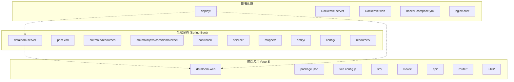
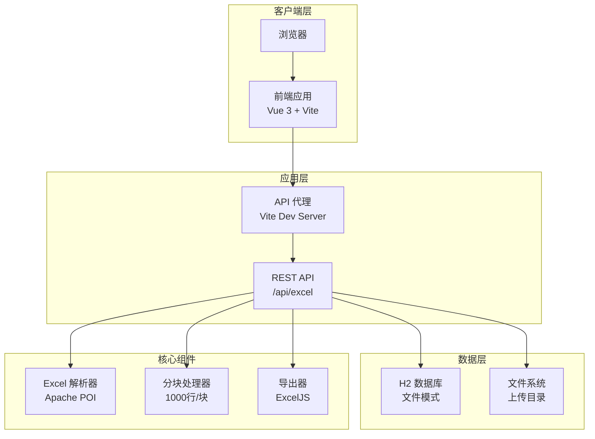
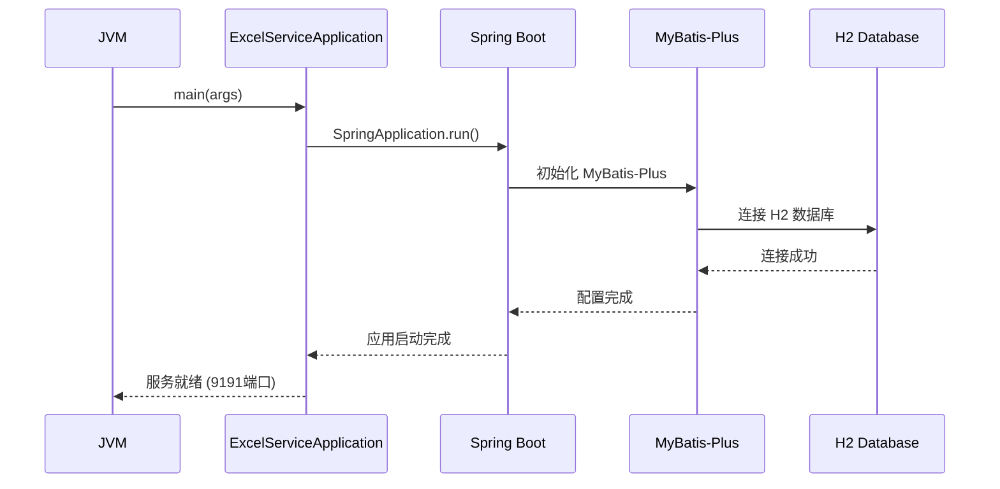
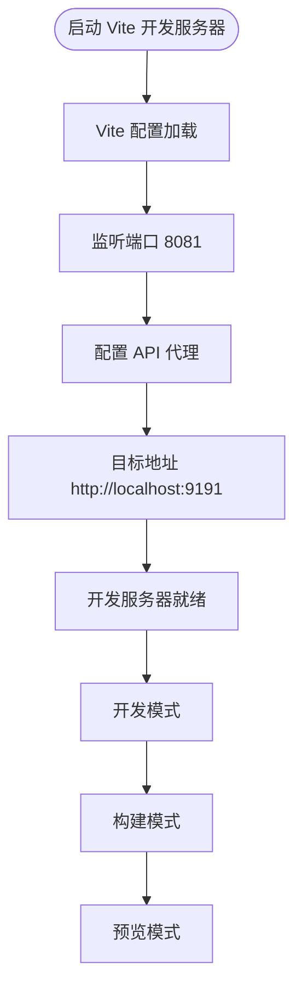
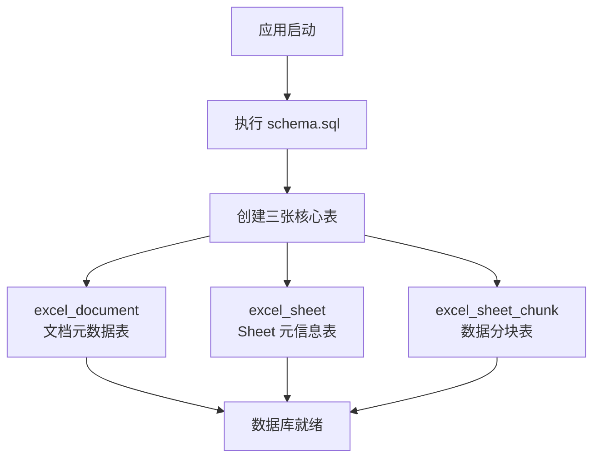
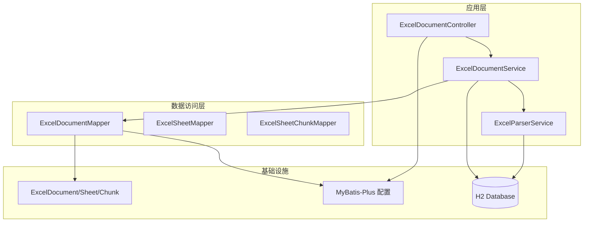
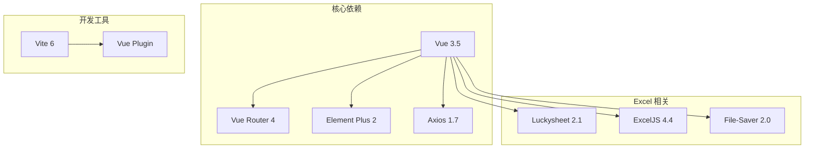

# 开发环境搭建

<cite>
**本文引用的文件**
- [README.md](file://README.md)
- [pom.xml](file://dataloom-server/pom.xml)
- [application.yml](file://dataloom-server/src/main/resources/application.yml)
- [schema.sql](file://dataloom-server/src/main/resources/schema.sql)
- [package.json](file://dataloom-web/package.json)
- [vite.config.js](file://dataloom-web/vite.config.js)
- [ExcelServiceApplication.java](file://dataloom-server/src/main/java/com/demo/excel/ExcelServiceApplication.java)
- [ExcelDocumentController.java](file://dataloom-server/src/main/java/com/demo/excel/controller/ExcelDocumentController.java)
- [ExcelDocumentService.java](file://dataloom-server/src/main/java/com/demo/excel/service/ExcelDocumentService.java)
- [excel.js](file://dataloom-web/src/api/excel.js)
- [ExcelDashboard.vue](file://dataloom-web/src/views/ExcelDashboard.vue)
</cite>

## 目录
1. [简介](#简介)
2. [项目结构](#项目结构)
3. [核心组件](#核心组件)
4. [架构概览](#架构概览)
5. [详细组件分析](#详细组件分析)
6. [依赖关系分析](#依赖关系分析)
7. [性能考虑](#性能考虑)
8. [故障排除指南](#故障排除指南)
9. [结论](#结论)
10. [附录](#附录)

## 简介
DataLoom 是一个从零构建的在线 Excel 协作系统，采用前后端分离架构：
- 后端：Spring Boot 2.1 + MyBatis-Plus 3.3 + H2 数据库
- 前端：Vue 3.5 + Vite 6 + Element Plus + Luckysheet
- 核心特性：Excel 文件上传解析、分块存储（1000 行/块）、懒加载、类 Excel 编辑器、前端导出

## 项目结构
项目采用多模块结构，包含后端服务和前端应用两个主要部分：

**图表来源**
- [pom.xml:1-127](file://dataloom-server/pom.xml#L1-L127)
- [package.json:1-27](file://dataloom-web/package.json#L1-L27)

**章节来源**
- [README.md:217-242](file://README.md#L217-L242)

## 核心组件
DataLoom 的核心组件包括：

### 后端核心组件
- **ExcelServiceApplication**：Spring Boot 启动类，负责应用初始化
- **ExcelDocumentController**：REST API 控制器，处理文档 CRUD 和单元格操作
- **ExcelDocumentService**：业务逻辑层，处理文档相关的业务规则
- **MyBatis-Plus 配置**：ORM 映射和数据库操作

### 前端核心组件
- **ExcelDashboard.vue**：主界面组件，展示文档列表和上传功能
- **excel.js**：API 封装，统一管理后端接口调用
- **Vite 配置**：开发服务器和代理配置

**章节来源**
- [ExcelServiceApplication.java:1-21](file://dataloom-server/src/main/java/com/demo/excel/ExcelServiceApplication.java#L1-L21)
- [ExcelDocumentController.java:1-296](file://dataloom-server/src/main/java/com/demo/excel/controller/ExcelDocumentController.java#L1-L296)
- [ExcelDocumentService.java:1-119](file://dataloom-server/src/main/java/com/demo/excel/service/ExcelDocumentService.java#L1-L119)
- [ExcelDashboard.vue:1-386](file://dataloom-web/src/views/ExcelDashboard.vue#L1-L386)

## 架构概览
DataLoom 采用分层架构，实现了数据的高效存储和传输：

**图表来源**
- [application.yml:1-51](file://dataloom-server/src/main/resources/application.yml#L1-L51)
- [vite.config.js:1-26](file://dataloom-web/vite.config.js#L1-L26)
- [schema.sql:1-124](file://dataloom-server/src/main/resources/schema.sql#L1-L124)

## 详细组件分析

### 后端启动流程
后端应用通过 Spring Boot 自动配置启动，包含以下关键步骤：

**图表来源**
- [ExcelServiceApplication.java:17-20](file://dataloom-server/src/main/java/com/demo/excel/ExcelServiceApplication.java#L17-L20)
- [application.yml:1-51](file://dataloom-server/src/main/resources/application.yml#L1-L51)

### 前端开发服务器配置
前端使用 Vite 作为开发服务器，配置了 API 代理以简化开发体验：

**图表来源**
- [vite.config.js:5-25](file://dataloom-web/vite.config.js#L5-L25)

### 数据库初始化流程
应用启动时自动执行数据库初始化脚本：

**图表来源**
- [application.yml:25-29](file://dataloom-server/src/main/resources/application.yml#L25-L29)
- [schema.sql:8-66](file://dataloom-server/src/main/resources/schema.sql#L8-L66)

**章节来源**
- [pom.xml:32-107](file://dataloom-server/pom.xml#L32-L107)
- [package.json:7-11](file://dataloom-web/package.json#L7-L11)

## 依赖关系分析

### 后端依赖层次
后端项目采用分层架构，依赖关系清晰：

**图表来源**
- [ExcelDocumentController.java:22-33](file://dataloom-server/src/main/java/com/demo/excel/controller/ExcelDocumentController.java#L22-L33)
- [ExcelDocumentService.java:19-24](file://dataloom-server/src/main/java/com/demo/excel/service/ExcelDocumentService.java#L19-L24)

### 前端依赖关系
前端应用依赖关系相对简单，主要围绕 Vue 3 生态系统：

**图表来源**
- [package.json:12-25](file://dataloom-web/package.json#L12-L25)

**章节来源**
- [pom.xml:21-30](file://dataloom-server/pom.xml#L21-L30)
- [package.json:12-25](file://dataloom-web/package.json#L12-L25)

## 性能考虑
DataLoom 在设计时充分考虑了性能优化：

### 分块存储策略
- **1000 行/块**：平衡内存使用和网络传输效率
- **懒加载机制**：前端按需加载数据块，避免一次性加载大量数据
- **增量更新**：只更新受影响的数据块，减少数据库写入

### 数据库优化
- **H2 文件模式**：零配置部署，适合开发环境
- **索引设计**：为常用查询字段建立索引
- **连接池配置**：合理配置数据库连接参数

### 前端性能优化
- **组件懒加载**：按需加载 Vue 组件
- **虚拟滚动**：处理大量数据时的滚动性能
- **缓存策略**：合理使用浏览器缓存和应用缓存

## 故障排除指南

### 环境准备问题

#### JDK 版本不兼容
**症状**：编译时报错，提示 JDK 版本不匹配
**解决方案**：
1. 确认已安装 JDK 8+
2. 设置 JAVA_HOME 环境变量
3. 验证 java -version 输出

#### Maven 版本问题
**症状**：mvn -version 显示版本过低
**解决方案**：
1. 升级到 Maven 3.x
2. 确保 Maven 与 JDK 版本兼容
3. 检查 MAVEN_HOME 配置

#### Node.js 版本问题
**症状**：npm install 失败或 Vite 启动异常
**解决方案**：
1. 安装 Node.js 18+
2. 验证 node -v 和 npm -v
3. 清理 npm 缓存：npm cache clean --force

### 依赖安装问题

#### Maven 依赖下载失败
**症状**：mvn spring-boot:run 报网络错误
**解决方案**：
1. 检查网络连接
2. 配置 Maven 代理（如有需要）
3. 清理本地仓库：删除 ~/.m2/repository/com/demo
4. 重新执行：mvn clean install

#### npm 包安装失败
**症状**：npm install 报错或依赖缺失
**解决方案**：
1. 检查网络连接
2. 清理 node_modules 和 package-lock.json
3. 使用 npm ci 重新安装
4. 检查 package.json 中的版本冲突

### 数据库初始化问题

#### H2 数据库启动失败
**症状**：应用启动时报数据库连接错误
**解决方案**：
1. 检查 data/excel-demo 文件权限
2. 确认数据库文件未被其他进程占用
3. 删除损坏的数据库文件重新启动
4. 检查 application.yml 中的数据库配置

#### 表结构初始化失败
**症状**：应用启动但表不存在
**解决方案**：
1. 确认 schema.sql 文件存在且可读
2. 检查 application.yml 中的 SQL 初始化配置
3. 手动执行 schema.sql 中的建表语句

### 开发服务器问题

#### 后端服务无法启动
**症状**：mvn spring-boot:run 启动失败
**解决方案**：
1. 检查端口 9191 是否被占用：netstat -an | grep 9191
2. 清理项目：mvn clean
3. 重新编译：mvn compile
4. 检查日志输出中的具体错误信息

#### 前端代理配置问题
**症状**：浏览器显示 404 或 CORS 错误
**解决方案**：
1. 确认后端服务已在 9191 端口运行
2. 检查 vite.config.js 中的代理配置
3. 验证 /api 前缀的请求是否正确转发
4. 查看浏览器开发者工具中的网络请求

### API 接口测试问题

#### 上传接口失败
**症状**：上传 Excel 文件时报错
**解决方案**：
1. 检查文件大小限制（默认 100MB）
2. 确认文件格式为 .xlsx 或 .xls
3. 验证后端日志中的解析错误
4. 检查上传目录权限

#### 文档列表为空
**症状**：GET /api/excel/document/list 返回空数据
**解决方案**：
1. 确认数据库中已有文档记录
2. 检查分页参数（pageNum、pageSize）
3. 验证数据库连接和表结构
4. 查看后端日志中的查询结果

### 常见环境问题及解决方案

#### 端口冲突
- **问题**：9191 或 8081 端口被占用
- **解决**：修改 application.yml 或 vite.config.js 中的端口号

#### 文件权限问题
- **问题**：H2 数据库文件无法创建或写入
- **解决**：检查 data/ 目录的写入权限，确保有足够的磁盘空间

#### 代理配置问题
- **问题**：开发环境下 API 请求失败
- **解决**：确认 Vite 代理配置正确，目标地址指向正确的后端服务

#### 依赖版本冲突
- **问题**：不同模块间依赖版本不兼容
- **解决**：统一管理依赖版本，在 pom.xml 和 package.json 中保持一致

**章节来源**
- [README.md:134-188](file://README.md#L134-L188)
- [application.yml:1-51](file://dataloom-server/src/main/resources/application.yml#L1-L51)
- [vite.config.js:12-21](file://dataloom-web/vite.config.js#L12-L21)

## 结论
DataLoom 提供了一个完整、可扩展的在线 Excel 协作编辑解决方案。其开发环境搭建相对简单，主要依赖标准的 Java 和 Node.js 生态系统。通过合理的架构设计和性能优化，该系统能够有效处理大规模 Excel 数据的存储和编辑需求。

关键的成功因素包括：
- 清晰的分层架构设计
- 高效的数据分块存储策略  
- 完善的开发工具链配置
- 良好的错误处理和故障排除机制

对于开发者而言，按照本文档的指导进行环境搭建，通常可以快速启动开发工作。遇到问题时，可以参考故障排除指南中的常见解决方案。

## 附录

### 开发环境验证步骤

#### 后端验证
1. 进入 dataloom-server 目录
2. 执行 mvn spring-boot:run
3. 访问 http://localhost:9191/h2-console 验证数据库连接
4. 检查控制台日志确认应用启动成功

#### 前端验证
1. 进入 dataloom-web 目录
2. 执行 npm install
3. 执行 npm run dev
4. 访问 http://localhost:8081 验证前端页面
5. 检查浏览器控制台无错误

#### API 接口测试
1. 使用 curl 或 Postman 测试 /api/excel/document/list
2. 上传测试 Excel 文件验证解析功能
3. 测试单元格编辑和保存功能
4. 验证导出功能（ExcelJS）

#### 数据库验证
1. 检查 H2 数据库文件是否存在
2. 验证三张核心表是否创建成功
3. 确认数据分块存储正常工作
4. 验证软删除功能

### IDE 推荐配置

#### IntelliJ IDEA
- 插件推荐：Lombok、Vue.js Support、MyBatis Log
- 代码格式化：使用 Google Java Format
- Git 集成：启用内置 Git 工具
- 编译选项：启用注解处理器

#### Eclipse
- 插件推荐：Lombok、Vue.js Support、MyBatis Log
- 代码格式化：使用 Eclipse 默认格式化
- Git 集成：使用EGit插件
- 编译选项：启用注解处理

### 性能监控建议
- 后端：使用 Spring Boot Actuator 监控应用状态
- 前端：使用浏览器开发者工具监控网络请求
- 数据库：定期检查查询性能和索引使用情况
- 系统：监控内存使用和垃圾回收情况