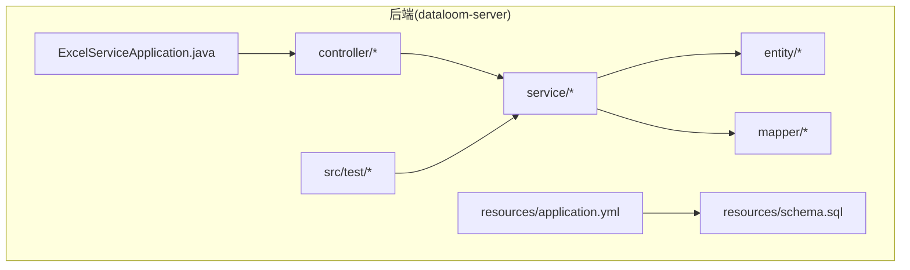
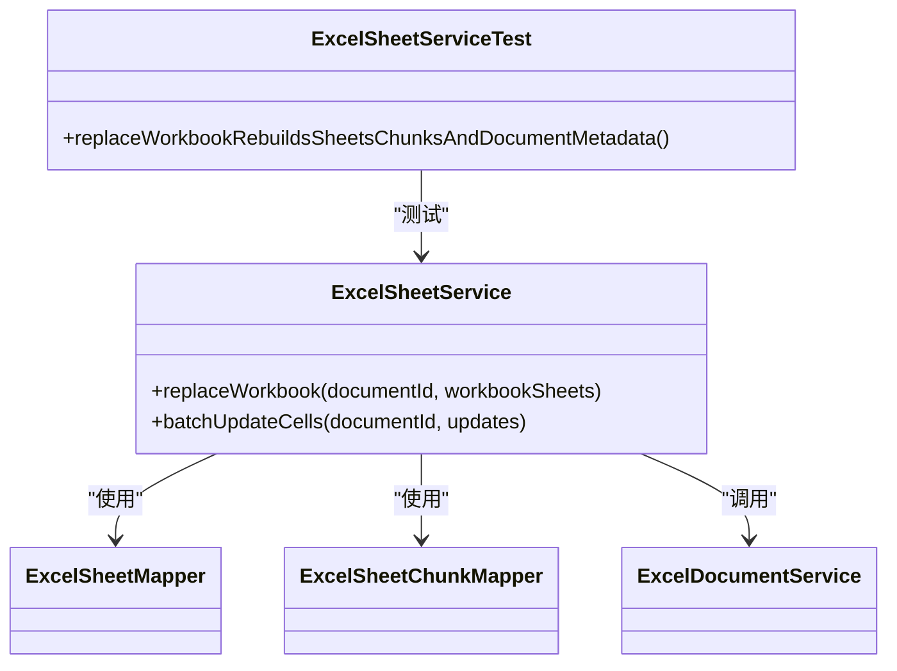
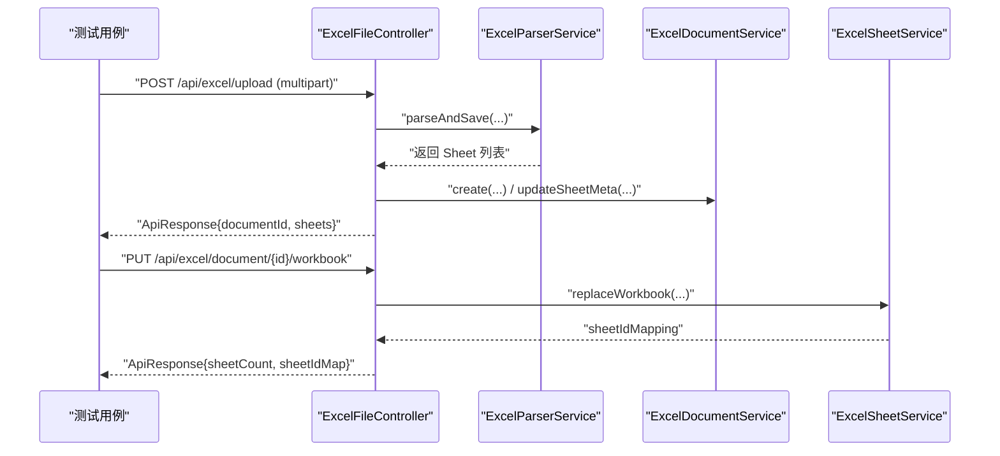
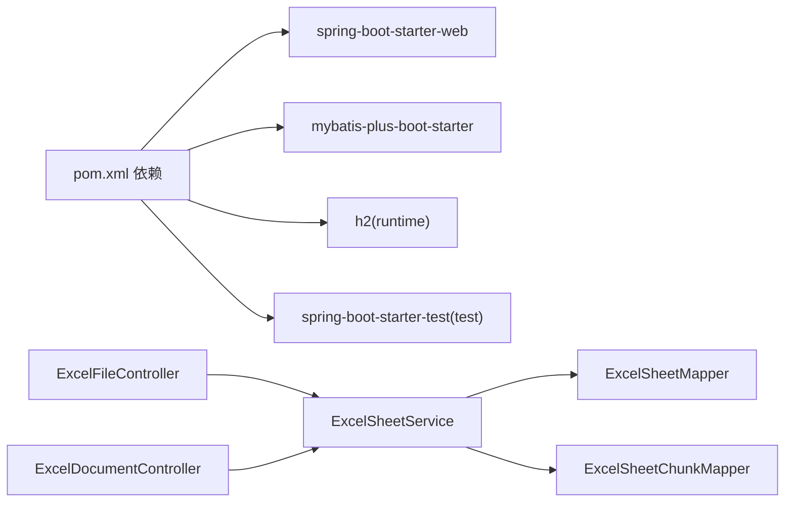

# 测试策略

<cite>
**本文引用的文件**
- [pom.xml](file://dataloom-server/pom.xml)
- [ExcelSheetServiceTest.java](file://dataloom-server/src/test/java/com/demo/excel/service/ExcelSheetServiceTest.java)
- [ExcelSheetService.java](file://dataloom-server/src/main/java/com/demo/excel/service/ExcelSheetService.java)
- [ExcelDocumentController.java](file://dataloom-server/src/main/java/com/demo/excel/controller/ExcelDocumentController.java)
- [ExcelFileController.java](file://dataloom-server/src/main/java/com/demo/excel/controller/ExcelFileController.java)
- [ExcelDocument.java](file://dataloom-server/src/main/java/com/demo/excel/entity/ExcelDocument.java)
- [ExcelSheet.java](file://dataloom-server/src/main/java/com/demo/excel/entity/ExcelSheet.java)
- [ExcelSheetChunk.java](file://dataloom-server/src/main/java/com/demo/excel/entity/ExcelSheetChunk.java)
- [ExcelSheetMapper.java](file://dataloom-server/src/main/java/com/demo/excel/mapper/ExcelSheetMapper.java)
- [ExcelSheetChunkMapper.java](file://dataloom-server/src/main/java/com/demo/excel/mapper/ExcelSheetChunkMapper.java)
- [ExcelServiceApplication.java](file://dataloom-server/src/main/java/com/demo/excel/ExcelServiceApplication.java)
- [application.yml](file://dataloom-server/src/main/resources/application.yml)
- [schema.sql](file://dataloom-server/src/main/resources/schema.sql)
- [README.md](file://README.md)
</cite>

## 目录
1. [简介](#简介)
2. [项目结构](#项目结构)
3. [核心组件](#核心组件)
4. [架构总览](#架构总览)
5. [详细组件分析](#详细组件分析)
6. [依赖分析](#依赖分析)
7. [性能考量](#性能考量)
8. [故障排查指南](#故障排查指南)
9. [结论](#结论)
10. [附录](#附录)

## 简介
本测试策略文档面向 DataLoom 项目，聚焦后端 dataloom-server 的测试体系，涵盖单元测试与集成测试的编写与执行规范、测试数据准备与清理策略、测试覆盖率要求与检查方法、以及测试自动化流程与调试技巧。当前仓库已具备基础的单元测试与 H2 内存数据库配置，测试策略将在此基础上扩展完善。

## 项目结构
- 后端采用 Spring Boot + MyBatis-Plus 架构，控制器层负责 REST API，服务层承载业务逻辑，实体与 Mapper 负责数据模型与持久化。
- 测试位于 dataloom-server/src/test，当前包含针对 ExcelSheetService 的单元测试示例。
- 数据库采用 H2（文件模式），通过 application.yml 初始化 schema.sql 建表脚本。



**图表来源**
- [ExcelServiceApplication.java:1-21](file://dataloom-server/src/main/java/com/demo/excel/ExcelServiceApplication.java#L1-L21)
- [application.yml:1-51](file://dataloom-server/src/main/resources/application.yml#L1-L51)
- [schema.sql:1-124](file://dataloom-server/src/main/resources/schema.sql#L1-L124)

**章节来源**
- [pom.xml:1-127](file://dataloom-server/pom.xml#L1-L127)
- [README.md:217-242](file://README.md#L217-L242)

## 核心组件
- 控制器层：ExcelFileController 负责文件上传；ExcelDocumentController 负责文档与单元格读写。
- 服务层：ExcelSheetService 执行分块存储、批量更新、全量替换等工作；与 ExcelDocumentService 协同维护文档元信息。
- 实体层：ExcelDocument、ExcelSheet、ExcelSheetChunk 三者构成分块存储的核心数据模型。
- Mapper 层：ExcelSheetMapper、ExcelSheetChunkMapper 提供基础 CRUD 能力。

**章节来源**
- [ExcelFileController.java:1-141](file://dataloom-server/src/main/java/com/demo/excel/controller/ExcelFileController.java#L1-L141)
- [ExcelDocumentController.java:1-296](file://dataloom-server/src/main/java/com/demo/excel/controller/ExcelDocumentController.java#L1-L296)
- [ExcelSheetService.java:1-443](file://dataloom-server/src/main/java/com/demo/excel/service/ExcelSheetService.java#L1-L443)
- [ExcelDocument.java:1-55](file://dataloom-server/src/main/java/com/demo/excel/entity/ExcelDocument.java#L1-L55)
- [ExcelSheet.java:1-77](file://dataloom-server/src/main/java/com/demo/excel/entity/ExcelSheet.java#L1-L77)
- [ExcelSheetChunk.java:1-53](file://dataloom-server/src/main/java/com/demo/excel/entity/ExcelSheetChunk.java#L1-L53)
- [ExcelSheetMapper.java:1-13](file://dataloom-server/src/main/java/com/demo/excel/mapper/ExcelSheetMapper.java#L1-L13)
- [ExcelSheetChunkMapper.java:1-13](file://dataloom-server/src/main/java/com/demo/excel/mapper/ExcelSheetChunkMapper.java#L1-L13)

## 架构总览
```mermaid
graph TB
FE["前端(Vue)"] --> API["后端(Spring Boot)"]
API --> CTRL1["ExcelFileController"]
API --> CTRL2["ExcelDocumentController"]
API --> SVC["ExcelSheetService"]
SVC --> MAP1["ExcelSheetMapper"]
SVC --> MAP2["ExcelSheetChunkMapper"]
API --> DB["H2 数据库"]
DB <- --> SCHEMA["schema.sql 建表"]
```

**图表来源**
- [ExcelFileController.java:1-141](file://dataloom-server/src/main/java/com/demo/excel/controller/ExcelFileController.java#L1-L141)
- [ExcelDocumentController.java:1-296](file://dataloom-server/src/main/java/com/demo/excel/controller/ExcelDocumentController.java#L1-L296)
- [ExcelSheetService.java:1-443](file://dataloom-server/src/main/java/com/demo/excel/service/ExcelSheetService.java#L1-L443)
- [ExcelSheetMapper.java:1-13](file://dataloom-server/src/main/java/com/demo/excel/mapper/ExcelSheetMapper.java#L1-L13)
- [ExcelSheetChunkMapper.java:1-13](file://dataloom-server/src/main/java/com/demo/excel/mapper/ExcelSheetChunkMapper.java#L1-L13)
- [application.yml:1-51](file://dataloom-server/src/main/resources/application.yml#L1-L51)
- [schema.sql:1-124](file://dataloom-server/src/main/resources/schema.sql#L1-L124)

## 详细组件分析

### 单元测试策略与实践
- 测试框架与依赖
  - 已引入 spring-boot-starter-test，可用于集成测试；当前单元测试示例使用 Mockito 进行依赖注入与桩件模拟。
- 测试用例设计原则
  - 针对 ExcelSheetService 的 replaceWorkbook 与 batchUpdateCells 等关键方法进行断言验证，覆盖数据结构转换、分块写入、事务边界与文档元信息更新。
  - 使用 ArgumentCaptor 捕获参数，验证 Mapper 调用次数与入参内容。
  - 使用 Mockito 注入 Mock 对象，隔离外部依赖，提升测试稳定性与执行速度。
- 示例参考
  - ExcelSheetServiceTest 验证全量替换工作簿时的删除、插入、更新与文档元信息联动。
  - 断言包括 Sheet 元信息字段、Chunk 的 celldata 结构与行列索引等。



**图表来源**
- [ExcelSheetServiceTest.java:1-109](file://dataloom-server/src/test/java/com/demo/excel/service/ExcelSheetServiceTest.java#L1-L109)
- [ExcelSheetService.java:1-443](file://dataloom-server/src/main/java/com/demo/excel/service/ExcelSheetService.java#L1-L443)

**章节来源**
- [ExcelSheetServiceTest.java:1-109](file://dataloom-server/src/test/java/com/demo/excel/service/ExcelSheetServiceTest.java#L1-L109)

### 集成测试策略与实践
- Spring Boot Test 使用
  - 基于 spring-boot-starter-test，可在测试类上使用 @SpringBootTest 或 @WebMvcTest 等注解加载应用上下文或 Web 层。
  - 结合 @AutoConfigureTestDatabase 与 @Import 机制，确保使用 H2 并加载 schema.sql。
- 数据库测试配置
  - application.yml 已配置 H2 数据源与初始化脚本，测试阶段可复用该配置，或在测试配置中覆盖以确保隔离性。
- API 接口测试
  - 使用 MockMvc 或 TestRestTemplate 对 /api/excel/upload、/api/excel/document/{id}/workbook 等端点进行请求-响应断言。
  - 关注响应体结构、状态码与日志输出的一致性。



**图表来源**
- [ExcelFileController.java:1-141](file://dataloom-server/src/main/java/com/demo/excel/controller/ExcelFileController.java#L1-L141)
- [ExcelDocumentController.java:1-296](file://dataloom-server/src/main/java/com/demo/excel/controller/ExcelDocumentController.java#L1-L296)
- [ExcelSheetService.java:1-443](file://dataloom-server/src/main/java/com/demo/excel/service/ExcelSheetService.java#L1-L443)

**章节来源**
- [application.yml:1-51](file://dataloom-server/src/main/resources/application.yml#L1-L51)
- [schema.sql:1-124](file://dataloom-server/src/main/resources/schema.sql#L1-L124)

### 测试数据准备与清理策略
- 测试数据库
  - 使用 H2 文件模式，首次启动自动执行 schema.sql 建表；测试期间可将数据隔离在独立目录或临时文件，避免污染。
- 测试数据生成
  - 使用 JSON 结构构造 Luckysheet 格式的 celldata 与 config，模拟真实场景（合并单元格、列宽、行高等）。
- 测试数据销毁
  - 单元测试结束后，依赖 Spring 的事务回滚或手动清理（如删除测试目录与文件）。
  - 集成测试可使用 @DirtiesContext 或 @Sql(deleteAllAfter = true) 清理数据。

**章节来源**
- [application.yml:1-51](file://dataloom-server/src/main/resources/application.yml#L1-L51)
- [schema.sql:1-124](file://dataloom-server/src/main/resources/schema.sql#L1-L124)
- [ExcelSheetServiceTest.java:1-109](file://dataloom-server/src/test/java/com/demo/excel/service/ExcelSheetServiceTest.java#L1-L109)

### 测试覆盖率与检查方法
- 当前仓库未配置 JaCoCo 插件，建议新增配置以生成覆盖率报告。
- 建议目标
  - 单元测试：关键服务方法行覆盖率 ≥ 80%，分支覆盖率 ≥ 60%。
  - 集成测试：核心 API 覆盖率 ≥ 70%。
- 实施步骤
  - 在 dataloom-server/pom.xml 中添加 JaCoCo 插件，并配置规则与报告生成。
  - 在 CI 中执行 mvn test jacoco:report，上传报告至覆盖率平台或制品库。

**章节来源**
- [pom.xml:109-125](file://dataloom-server/pom.xml#L109-L125)

### 测试自动化流程（CI/CD）
- 建议流水线步骤
  - 安装 JDK 与 Node.js（遵循 README 的前置要求）。
  - 后端：mvn -B clean test（或 mvn -B verify，结合 JaCoCo）。
  - 前端：npm ci && npm run build（如需端到端测试可增加 e2e 步骤）。
  - 产物归档与覆盖率报告上传。
- 测试结果监控
  - 将测试报告与覆盖率指标纳入质量门禁，失败即阻断发布。

**章节来源**
- [README.md:132-186](file://README.md#L132-L186)
- [pom.xml:1-127](file://dataloom-server/pom.xml#L1-L127)

### 测试调试技巧与常见问题
- 调试技巧
  - 在单元测试中使用 @RunWith(MockitoJUnitRunner.class) 与 @InjectMocks/@Mock，配合 verify/captor 精确定位问题。
  - 集成测试中开启 MyBatis 日志与 Spring 日志级别，定位 SQL 与业务逻辑异常。
- 常见问题
  - H2 初始化失败：确认 schema.sql 位置与 classpath 配置，检查 application.yml 的 sql.init 配置。
  - 单元测试事务未回滚：确保测试方法未被声明为 static/final，且未被 @DirtiesContext 破坏上下文。
  - Mock 不生效：确认 @Mock 注入的类型与 @InjectMocks 的目标一致，避免循环依赖。

**章节来源**
- [application.yml:25-30](file://dataloom-server/src/main/resources/application.yml#L25-L30)
- [ExcelSheetServiceTest.java:28-41](file://dataloom-server/src/test/java/com/demo/excel/service/ExcelSheetServiceTest.java#L28-L41)

## 依赖分析


**图表来源**
- [pom.xml:32-106](file://dataloom-server/pom.xml#L32-L106)
- [ExcelSheetService.java:1-443](file://dataloom-server/src/main/java/com/demo/excel/service/ExcelSheetService.java#L1-L443)
- [ExcelSheetMapper.java:1-13](file://dataloom-server/src/main/java/com/demo/excel/mapper/ExcelSheetMapper.java#L1-L13)
- [ExcelSheetChunkMapper.java:1-13](file://dataloom-server/src/main/java/com/demo/excel/mapper/ExcelSheetChunkMapper.java#L1-L13)
- [ExcelFileController.java:1-141](file://dataloom-server/src/main/java/com/demo/excel/controller/ExcelFileController.java#L1-L141)
- [ExcelDocumentController.java:1-296](file://dataloom-server/src/main/java/com/demo/excel/controller/ExcelDocumentController.java#L1-L296)

**章节来源**
- [pom.xml:1-127](file://dataloom-server/pom.xml#L1-L127)

## 性能考量
- 单元测试
  - 使用 Mock 隔离数据库 I/O，关注方法调用次数与参数正确性，避免真实持久化带来的性能波动。
- 集成测试
  - 通过合理分块（1000 行/块）与按需加载策略，验证大数据场景下的响应时间与内存占用。
- 覆盖率
  - 重点覆盖事务边界、异常分支与边界条件（空输入、非法索引、空 JSON 等）。

[本节为通用指导，无需列出具体文件来源]

## 故障排查指南
- 单元测试失败
  - 检查 @Mock 注入与 @InjectMocks 目标是否匹配；使用 verify/atLeastOnce 确认调用链。
- 集成测试失败
  - 查看日志与响应体，确认文件上传路径、解析流程与数据库初始化是否正常。
- 数据库问题
  - 确认 H2 控制台可用性与建表脚本执行情况；必要时清理数据文件后重启。

**章节来源**
- [ExcelSheetServiceTest.java:77-107](file://dataloom-server/src/test/java/com/demo/excel/service/ExcelSheetServiceTest.java#L77-L107)
- [application.yml:14-17](file://dataloom-server/src/main/resources/application.yml#L14-L17)
- [schema.sql:1-124](file://dataloom-server/src/main/resources/schema.sql#L1-L124)

## 结论
当前 DataLoom 后端已具备单元测试与 H2 数据库的基础能力。建议在现有基础上补充 JaCoCo 覆盖率插件、完善集成测试用例、建立 CI 自动化流水线，并持续优化测试数据准备与清理策略，以保障大规模数据场景下的稳定性与可维护性。

[本节为总结性内容，无需列出具体文件来源]

## 附录
- API 参考（来自 README）
  - 上传接口：POST /api/excel/upload（multipart/form-data）
  - 文档详情：GET /api/excel/document/{id}
  - 全量保存：PUT /api/excel/document/{id}/workbook
  - 批量更新：PUT /api/excel/document/{id}/cells/batch
  - 删除文档：DELETE /api/excel/document/{id}

**章节来源**
- [README.md:190-215](file://README.md#L190-L215)